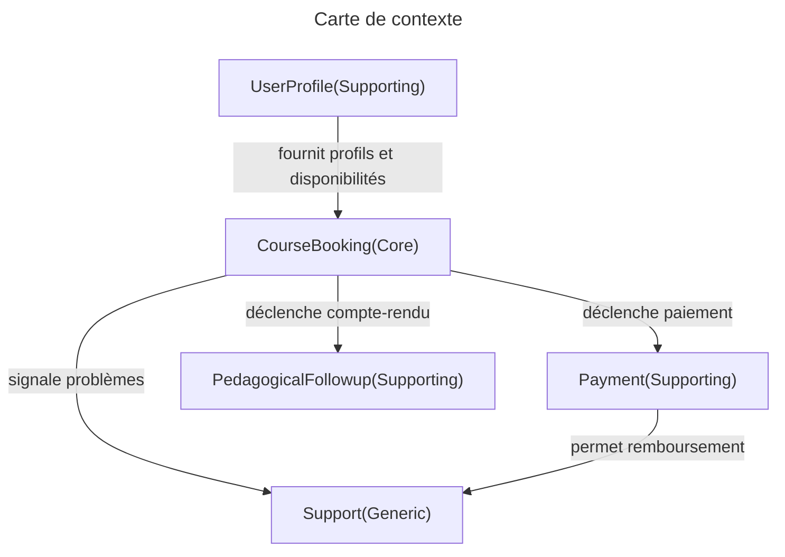
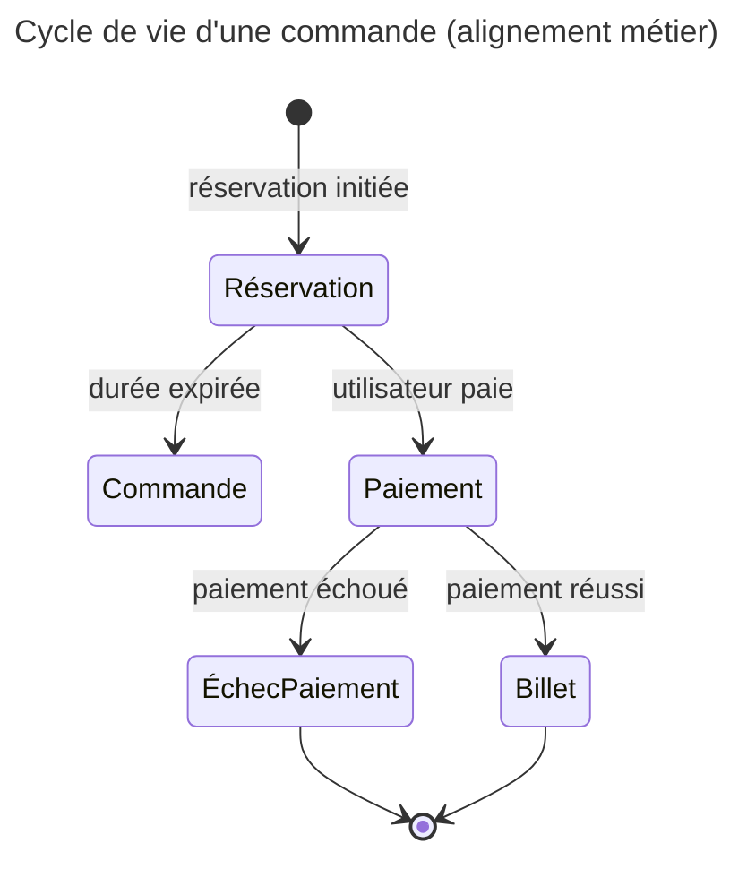
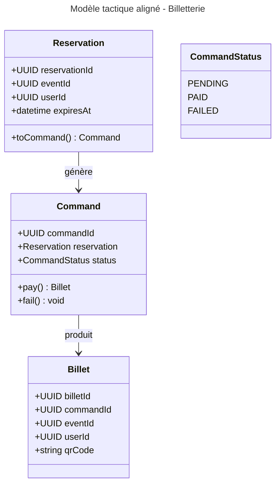

## P1

- cleanup all course categories

- W3C
- transform plantuml to mermaid diagrams
- search => "Ctrl / K"

- Stars after h1, … => hidden, reveal on focus.

```
@startditaa
```

Animate mermaid => https://mermaid.js.org/syntax/flowchart.html#turning-an-animation-on

DDD exo-contexts KO



DDD exo-langage KO





---


http://localhost:4321/ddd/cours#diagramme-de-cas-dutilisation => style
http://localhost:4321/ddd/cours#exemple-de-chemins-s%C3%A9par%C3%A9s => style
http://localhost:4321/ddd/cours#exemple-de-context-map => style (in diag)

=> improve .blue and .green mermaid for all color themes
=> class red, orange

- To Mermaid : http://localhost:4321/_image?href=%2F%40fs%2Fmnt%2Fdata%2Fgit%2Fastro%2Fwebsite%2Fsrc%2Fassets%2Fddd%2FDomainDrivenDesignReference.png%3ForigWidth%3D836%26origHeight%3D741%26origFormat%3Dpng&w=836&h=741&f=webp
- To Mermaid : mvc.md => Spring

- Generate build-time : https://agramont.net/blog/diagraming-with-mermaidjs-astro/

## P2

- CSS layout
  - global layout <https://www.w3schools.com/csS/css_grid.asp>
  - right-hand size : chapters
  	- TOC hidden
	- better pagefind position ?
  - portrait
- styles :
  - fix diagram style : .flowchartTitleText
  - PageFind results theme : https://pagefind.app/docs/ui-usage/
  - ability to zoom images (?)
- diagrams
  - mermaid => render images at build time with playwright : <https://agramont.net/blog/diagraming-with-mermaidjs-astro/>
  - static generate plantuml, … (not on page load)
  - fix `@startdot`
```css
@media (prefers-color-scheme: dark) {
  .kroki svg {
    filter: invert(100%);
  }
}
```


## P3

- URL checker
	- break on broken local link
	- improve external links checks

- "favorites" :
  - link in Menu/
  - delete
  - fix favorites navigation (after astro hydration ?)
  - Favorites.astro => fix TODO

- linter `astro.config.mjs`
  - import remarkLint from 'remark-lint';
  - import remarkPresetLintRecommended from 'remark-preset-lint-recommended';
  - import remarkLintNoDeadUrls from 'remark-lint-no-dead-urls';
  - https://github.com/remarkjs/remark-validate-links
  - remarkPlugins: [ // remarkLint, // remarkPresetLintRecommended, // remarkLintNoDeadUrls, ]

## P4

- seo
  - https://github.com/hellotham/hello-astro/blob/main/src/components/seo.astro
  - https://code.juliancataldo.com/component/astro-seo-metadata/

- Head.astro => ClientRouter transitions
- <whoami.avenel.pro>
- tsconfig.json :	"verbatimModuleSyntax": true,
- better `date:`
- "latest" page => git history ?
- <https://adamsimpson.net/writing/openring>
- tags:[] word cloud and links

---

```css
/******************************************************************************/
/*                                    TODO                                    */
/******************************************************************************/


 /* .pagefind-ui { */
 /*    --pagefind-ui-scale: 0.75; */
 /*    --pagefind-ui-primary: navy; */
 /*    --pagefind-ui-text: black; */
 /*    --pagefind-ui-border: slategrey; */
 /*    --pagefind-ui-border-width: 1px; */
 /*    --pagefind-ui-border-radius: 0.25rem; */
 /*    --pagefind-ui-font: sans-serif; */
 /**/
 /*    width: 50%; */
 /*  } */

body.dark {
  --pagefind-ui-primary: #eeeeee;
  --pagefind-ui-text: #eeeeee;
  --pagefind-ui-background: #152028;
  --pagefind-ui-border: #152028;
  --pagefind-ui-tag: #152028;
}

 /* .pagefind-ui .pagefind-ui__drawer:not(.pagefind-ui__hidden) { */
 /*    position: absolute; */
 /*    left: 0; */
 /*    right: 0; */
 /*    margin-top: 0px; */
 /*    z-index: 9999; */
 /*    padding: 0 2em 1em; */
 /*    overflow-y: auto; */
 /*    box-shadow: */
 /*      0 10px 10px -5px rgba(0, 0, 0, 0.2), */
 /*      0 2px 2px 0 rgba(0, 0, 0, 0.1); */
 /*    border-bottom-right-radius: var(--pagefind-ui-border-radius); */
 /*    border-bottom-left-radius: var(--pagefind-ui-border-radius); */
 /*    background-color: var(--pagefind-ui-background); */
 /*  } */
 /**/
 /*  .pagefind-ui .pagefind-ui__result-link { */
 /*    color: var(--pagefind-ui-primary); */
 /* color: yellow; */
 /*  } */
 /**/
 /*  .pagefind-ui .pagefind-ui__result-excerpt { */
 /*    color: var(--pagefind-ui-text); */
 /* color: red; */
 /*  } */


