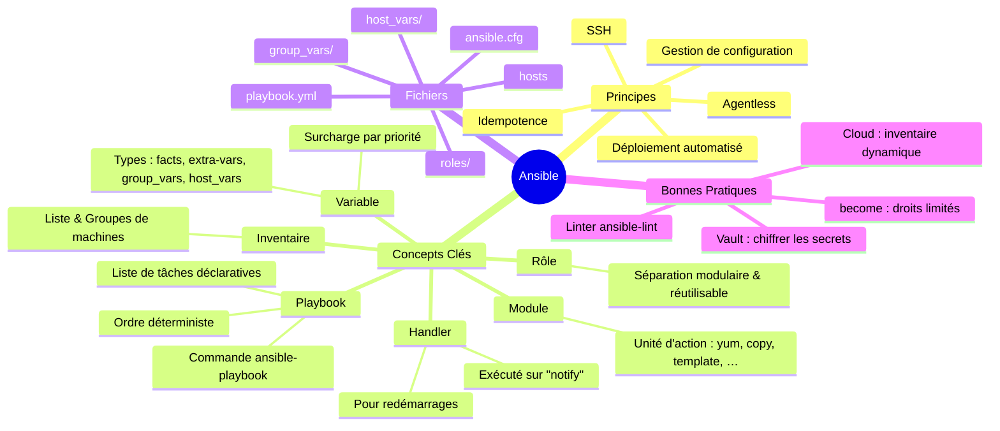

## 🎯 Objectifs

- Gérer un parc de machines simplement par Infrastructure-as-Code grâce à Ansible. 🛠️

---

## 🛠️ Présentation d'Ansible

- Automatise des opérations sur un parc de machines 🏗️
- **Agentless** : SSH depuis un poste de travail 🔑
  - Autres protocoles disponibles 🌐
- **Stateless** : pas d'état du cluster 🔄
- **Idempotent** : décrit un but (et non l'action à effectuer) 🎯
- Outil d'IaC très populaire 🌟
  - Fichiers `playbook` en `yaml` 📄
- Simple d'utilisation dans un cadre standard 🛠️
- Modules et plugins standard : [lien](https://docs.ansible.com/ansible/latest/collections/index_module.html) 🔗

---

> Outil de _provisionning_ les plus utilisés (2025) : Terraform (39%), Ansible (35%), GCP (32%) (d'après : <https://www.docker.com/blog/2025-docker-state-of-app-dev/>).

---

## 🏗️ Architecture

---

### 📄 Playbook

- Fichier `yaml` décrivant les opérations à effectuer 📄
- Liste de `task` 📋
- Supporte quelques opérateurs logiques et paramètres 🔄

---

### 📋 Inventory

- Collection de machines et de paramètres à fournir au(x) playbook(s) pour gérer les cibles d'exécution 📋
- Possibilité d'inventaire dynamique par des plugins : `aws`, `VirtualBox`, … 🌐

---

### Exemple d'inventaire

```ini
#Fichier hosts

[web]
webserver-1 ansible_user=user1
webserver-2
webserver-3 ansible_user=user3

[web:vars]
ansible_connection=ssh

[all:vars]
test_file=/tmp/test
```

```sh
ansible-inventory --graph # affiche l'inventaire
ansible web -m ping -i hosts # exécute ping sur le groupe web de l'inventaire hosts
```

---

### Exemple de playbook

Inspiré de : [ansible documentation](https://docs.ansible.com/ansible/latest/playbook_guide/playbooks_intro.html)

```yaml
---
- name: Update web servers
  hosts: webservers
  remote_user: ansible
  become: yes

  tasks:
  - name: Ensure apache is at the latest version
    ansible.builtin.yum:
      name: httpd
      state: latest

  - name: Write the apache config file
    ansible.builtin.template:
      src: /srv/httpd.j2
      dest: /etc/httpd.conf

  - name: Start the service
    service:
      name: httpd
      state: started

- name: Update db servers
  hosts: databases
  remote_user: root

  tasks:
  - name: Execute a direct Unix command
    command: /sbin/update_db --confirm
```

---

```sh
ansible-playbook <mon_playbook.yml>
ansible-playbook -i <mon_inventaire> <mon_playbook.yml>
ansible-playbook --check […]
ansible-playbook -v […]
```

---

## Tags

Permet d'exécuter (ou ignorer) seulement certaines parties du playbook.

```yaml
[…]
  tasks:
  - name: Task avec tag
    file:
      dest: /etc/hosts
      state: absent
    tags:
      - suppression
  […]
```

```sh
ansible-playbook […] --tags suppression
ansible-playbook […] --skip-tags suppression
```

---

## Variables

Ansible peut utiliser une variable définie (inventaire, playbook, ligne de commande) et créer une variable dynamiquement dans le playbook.

---

```yaml
# Fichier playbook

---
- hosts: web
  vars:
    playbook_var_addr_list: ['::1', '192.168.32.0/24']
  tasks:
  - name: Create a file
    file:
      dest: '{{test_file}}'
      state: '{{file_state}}'
    when: test_file is defined

  - name: Create a new variable
    set_fact: dynamic_var="{{playboook_var_addr_list | ipv4('address') }}"
  - debug:
    msg: "Les adresses ipv4 sont : {{ dynamic_var }}"

  - shell: /usr/bin/uptime
    register: result_uptime
  - debug:
    msg: "L'uptime est {{ result_uptime }}"
```

---

## Rôles

- Collection de playbooks, variables, … pouvant être importés (idem plugin)
- 1 répertoire dédié par rôle et fichier `main.yml`

```sh
ansible-galaxy init mon_role
```

```yaml
---
- name: "Playbook with role"
  hosts: web
  become: yes
  roles:
    role: "mon_role"
```

---

## Secrets : Vault

- `Vault` : Stocke les informations sensibles : mot de passe, variables, (fichiers sensibles)
- Local ou Cloud provider : `AWS Key Management`, `Azure Key Vault`, …

---

```yaml
#Fichier group_vars/web/vars
---
password: '{{vault_mon_password}}'
```

```yaml
#Fichier group_vars/web/vault
---
vault_mon_password: SuperSecretP@ssw0rd
```

```yaml
#Fichier vault_playbook.yml
---
- hosts: web
  tasks:
  - name: print password
    debug:
      msg: 'Mon mot de passe est : {{password}}'
```

```sh
ansible-vault encrypt group_vars/web/vault
ansible-playbook --ask-vault-pass vault_playbook.yml
```

---

## Ansible linter

[ansible-lint](https://docs.ansible.com/ansible-lint/index.html) est un _linter_ permettant de trouver des erreurs dans les fichiers playbook.

---

## 🧰 Modules Ansible les plus courants

Une sélection des modules les plus utilisés, classés par catégories :

---

### 📦 Gestion des paquets

| Module      | Description                                           |
|-------------|-------------------------------------------------------|
| `apt`       | Gère les paquets sur Debian/Ubuntu                    |
| `dnf`       | Remplaçant moderne de `yum`                           |
| `package`   | Abstraction commune à `apt`, `yum`, etc.             |
| `pip`       | Installe des paquets Python via pip                  |

---

### 📁 Fichiers & répertoires

| Module         | Description                                         |
|----------------|-----------------------------------------------------|
| `copy`         | Copie un fichier local sur la machine distante     |
| `template`     | Fichier Jinja2 rendu dynamiquement                 |
| `file`         | Gère droits, propriétaire, création/suppression    |
| `stat`         | Récupère les infos sur un fichier distant          |
| `lineinfile`   | Ajoute/modifie une ligne dans un fichier           |
| `blockinfile`  | Ajoute/modifie un bloc de texte                    |
| `replace`      | Remplacement par regex                             |

---

### ⚙️ Services & processus

| Module      | Description                                         |
|-------------|-----------------------------------------------------|
| `systemd`   | Gère les services systemd                           |
| `service`   | Interface générique pour systemd/init/upstart       |
| `shell`     | Exécute une commande dans un shell                 |
| `command`   | Exécute une commande sans shell                    |
| `cron`      | Gère les tâches cron                               |

---

### 👥 Utilisateurs & groupes

| Module            | Description                            |
|-------------------|----------------------------------------|
| `user`            | Crée ou gère des comptes utilisateurs  |
| `group`           | Crée ou modifie des groupes            |
| `authorized_key`  | Gère les clés SSH autorisées           |

---

### 🔒 Sécurité & accès

| Module        | Description                              |
|---------------|------------------------------------------|
| `ufw`         | Gère le pare-feu UFW (Ubuntu)            |
| `firewalld`   | Pour CentOS/RHEL                         |
| `iptables`    | Règles de pare-feu manuelles             |
| `selinux`     | Active/désactive SELinux                 |
| `seboolean`   | Active/désactive des boolean SELinux     |

---

### 🌐 Réseau & connectivité

| Module       | Description                                  |
|--------------|----------------------------------------------|
| `uri`        | Fait des requêtes HTTP/REST                  |
| `get_url`    | Télécharge des fichiers depuis une URL       |
| `wait_for`   | Attente sur port, fichier ou socket          |
| `ping`       | Test de connectivité Ansible (pong attendu)  |

---

### 🧪 Autres modules utiles

| Module           | Description                                  |
|------------------|----------------------------------------------|
| `debug`          | Affiche des messages pour le debug           |
| `set_fact`       | Définit une variable temporaire              |
| `assert`         | Vérifie une condition                        |
| `include_tasks`  | Inclut dynamiquement un fichier de tâches    |
| `import_tasks`   | Inclut statiquement un fichier de tâches     |

---

## Exemples de playbook simples

---

### Ping toutes les machines _hosts_

```yaml
- name: Ping all hosts
  hosts: all
  tasks:
    - name: Ping
      ansible.builtin.ping:
```

---

### Installer NGINX sur Ubuntu

```yaml
---
- name: Install NGINX on Ubuntu
  hosts: webservers
  become: yes
  tasks:
    - name: Update apt cache
      ansible.builtin.apt:
        update_cache: yes

    - name: Install nginx
      ansible.builtin.apt:
        name: nginx
        state: present
```

---

### Créer un fichier

```yaml
---
- name: Create a file on remote hosts
  hosts: all
  tasks:
    - name: Create an empty file
      ansible.builtin.file:
        path: /tmp/hello.txt
        state: touch
```

---

### Démarrer et Installer un Service

```yaml
---
- name: Ensure nginx is running
  hosts: webservers
  become: yes
  tasks:
    - name: Start and enable nginx
      ansible.builtin.service:
        name: nginx
        state: started
        enabled: yes

```

---

### Copier un fichier local à distance

```yaml
---
- name: Copy index.html to webserver
  hosts: webservers
  become: yes
  tasks:
    - name: Copy file
      ansible.builtin.copy:
        src: ./index.html
        dest: /var/www/html/index.html

```

---

### Créer un utilisateur

```yaml
---
- name: Add a new user
  hosts: all
  become: yes
  tasks:
    - name: Create user 'john'
      ansible.builtin.user:
        name: john
        shell: /bin/bash
        state: present

```

---

### Redémarrer les machines distantes

```yaml
---
- name: Reboot all servers
  hosts: all
  become: yes
  tasks:
    - name: Reboot the machine
      ansible.builtin.reboot:

```

---

## Ressources

- Documentation Ansible : <https://docs.ansible.com/ansible/latest/index.html>
- Tutoriel Ansible débutant : <https://alemorvan.frama.io/formatux.fr-support/SupportLinux-Automatismes-DevOPS.pdf>
  - correction du tutoriel : <https://docs.formatux.fr/DEVOPS-021-Ansible-Niveau-2-TD-Corrections.pdf>
- Liste complète de tutoriels Ansible en français : <https://gitlab.com/xavki/presentation-ansible-fr>
- [Ansible : cas pratique (1er partie)](https://blog.levassb.ovh/post/ansible-study-case/)
- [Cours et TPs Ansible](https://supports.uptime-formation.fr/06-ansible/cours1/)
- [AWX : interface Web de gestion d'ansible](https://github.com/ansible/awx)
- <https://blog.stephane-robert.info/post/ansible-vs-terraform/> et <https://blog.stephane-robert.info/docs/infra-as-code/gestion-de-configuration/ansible/>
- <https://blog.microlinux.fr/formation-ansible/>
- [Ansible tips and tricks](https://docs.ansible.com/ansible/latest/tips_tricks/index.html)
- Trouver des Plugins et des Rôles :
  - Modules et plugins standard : [lien](https://docs.ansible.com/ansible/latest/collections/index_module.html)
  - Plugins et rôles de la communauté : <https://galaxy.ansible.com>
- Le [format Yaml](https://docs.ansible.com/ansible/latest/reference_appendices/YAMLSyntax.html#yaml-syntax) utilisé par les playbooks : 
- Exemples de Playbooks :
  - <https://github.com/ansible/ansible-examples>
	- <https://www.middlewareinventory.com/blog/ansible-playbook-example/>
- Voir aussi le [cours sur les pratiques DevOps](/devops)

---

## Legal 

- Ansible® is a registered trademark of RED HAT, INC.
- Vault is a trademark and brand of HashiCorp, Inc.
- Other names may be trademarks of their respective owners

