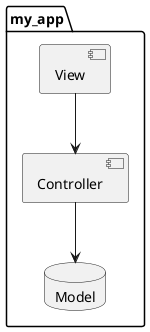
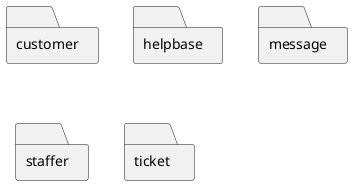
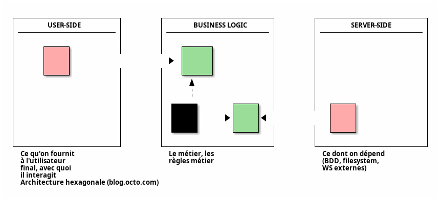
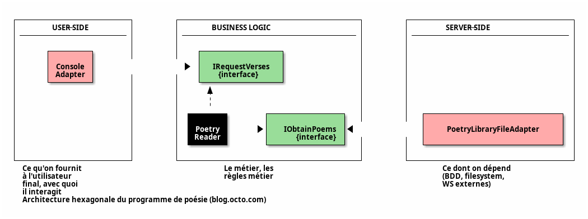

## Intention 🤔

> L'Architecture est une affaire d'Intention, pas de Frameworks. (Uncle Bob)

> Une bonne architecture permet de remettre en cause facilement des décisions volatiles (Uncle Bob)

> Une bonne architecture est une architecture qui supporte sa propre évolution (Martin Fowler)

---



_Quel est le **but** de cette application ?_ 🤔

---



_Quel est le **but** de [cette application django](https://github.com/johnnncodes/ddd-python-django) ?_ 💡

---

## Objectifs 🎯

- Mettre ensemble uniquement ce qui a la même raison de changer (découplage)
- Retirer la technologie du métier pour pérenniser sa valeur

---
layout: section
---

# Architecture Hexagonale

> Permettre à une application d’être pilotée aussi bien par des utilisateurs que par des programmes, des tests automatisés ou des scripts batchs, et d'être développée et testée en isolation de ses éventuels systèmes d’exécution et bases de données. (Alistair Cockburn, 2005)

---

## Idée 💡

- 📦 **Isoler** le _cœur de métier_ des appelants et des dépendances
- 🧪 Le tester **indépendamment**

---

## Principes

- Séparer explicitement `User-Side` 👤 , `Business Logic` ⚙️ et `Server-Side` 🖨️
- Les dépendances vont vers la `Business Logic` ⚙️
- On isole les frontières par des `Ports` et `Adapters`

---



---

## Business Logic ⚙️

- L'hexagone (centre)
- Isole et implémente le **domaine** et la **logique métier**
- Compréhensible par le fonctionnel
- Unique à l'application (spécificité)
- Agnostique : minimum de technologie
  - 🚫 `Django`, `logger`, ⛔ persistence ⛔ , …

---

## User-side 👤

- Point d'entrée (utilisateur ou autre programme) pour **interagir** et **piloter** la business logic ⚙️
- Routes `HTTP`, sérialisations `JSON`, API, …

---

## Server-side 🖨️

- **Dépendances** et détails d'infrastructure
- Pilotés par la **business logic** ⚙️
- Base de données, Service Provider Interface (SPI), …

---

## Exemple

> Alistair in the "Hexagone", Thomas Pierrain, Alistair Cockburn, 2017.

- Objectif : 💬 programme qui écrit dans la console des poèmes récupérés dans un fichier.

```sh
$ ./printPoem
Here is some poem:
I want to sleep
Swat the files
Softly, please.
-- Masaoka Shiki (1867 - 1902)
Type enter to exit...
```

---



---

### Inversion de dépendances

- Rappel : les dépendances vont vers l'intérieur (vers l'hexagone indépendant `Business Logic`)
- Inversion de dépendances :
  - `Port` (interface) à l'intérieur (hexagone)
  - `Adapter` (implémentation) à l'extérieur (`User-Side` et `Server-Side`)
- Possibilité de changer d'`Adapter` : base de données 💽 , fichiers 📁 , …

---

### Code

```cs
public PoetryReader(IObtainPoems poetryLibrary)
{
    this.poetryLibrary = poetryLibrary;
}
```

---

```cs
class Program
{
    static void Main(string[] args)
    {
        // 1. Instantiate right-side adapter(s) ("I want to go outside the hexagon")
        IObtainPoems fileAdapter = new PoetryLibraryFileAdapter(@".\Rimbaud.txt");

        // 2. Instantiate the hexagon
        IRequestVerses poetryReader = new PoetryReader(fileAdapter);

        // 3. Instantiate the left-side adapter(s) ("I want ask/to go inside the hexagon")
        var consoleAdapter = new ConsoleAdapter(poetryReader);

        System.Console.WriteLine("Here is some...");
        consoleAdapter.Ask();

        System.Console.WriteLine("Type enter to exit...");
        System.Console.ReadLine();
    }
}
```

---

## Tests 🧪

- `Business Logic` : unitairement sur l'ensemble de la valeur métier ⬆️⬆️⬆️
- Intégration `User-Side` et `Business Logic` ➡️➡️
- Intégration `Business Logic` et `Server-Side` ↗️↗️
- Tests e2e : très peu, uniquement pour valider la traversée de la stack complète du port d'entrée au port de sortie ↘️
  - `User-Side` -> `Business Logic` -> `Server-Side`

---

### Implémentation des tests

- 👤 `User-Side` : rôle de pilotage : directement par le framework de test 🧪
- 🖨️ `Server-Side` : rôle de dépendance : `Mock` 🧟

```cs
IObtainPoems mockFileAdapter = new IObtainPoems { … } ;
IRequestVerses poetryReader = new PoetryReader(mockFileAdapter);
```

---
layout: section
---

# Liens

- [Architecture hexagonale : 3 principes et un exemple (blog.octo.com)](https://blog.octo.com/architecture-hexagonale-trois-principes-et-un-exemple-dimplementation)
- [Alistair Cockburn : hexagonal architecture](https://alistair.cockburn.us/hexagonal-architecture/)
- [Discussions sur l'architecture hexagonale](https://wiki.c2.com/?HexagonalArchitecture/)
- [Architecture explicite](https://herbertograca.com/2017/11/16/explicit-architecture-01-ddd-hexagonal-onion-clean-cqrs-how-i-put-it-all-together/)

