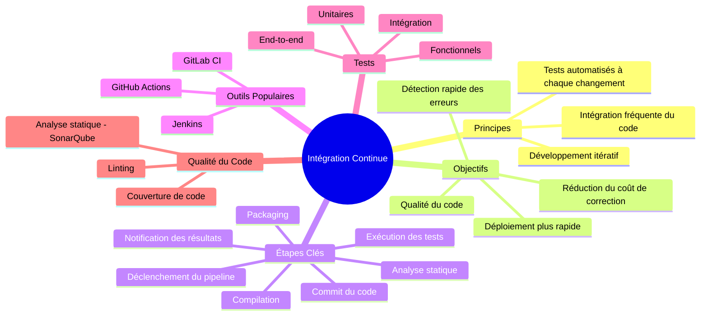
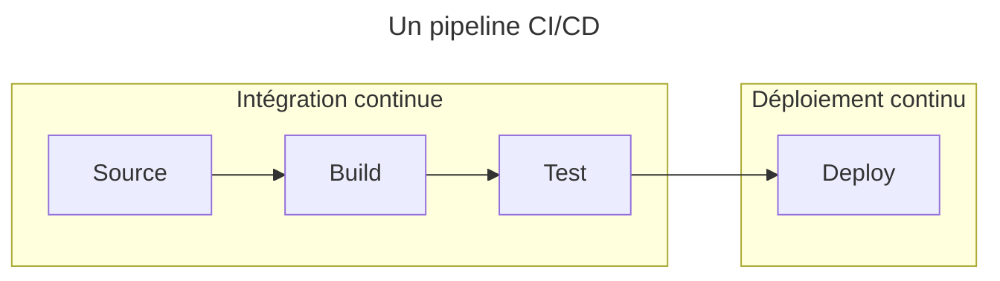
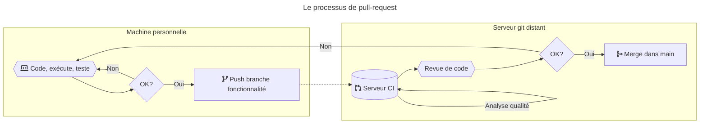
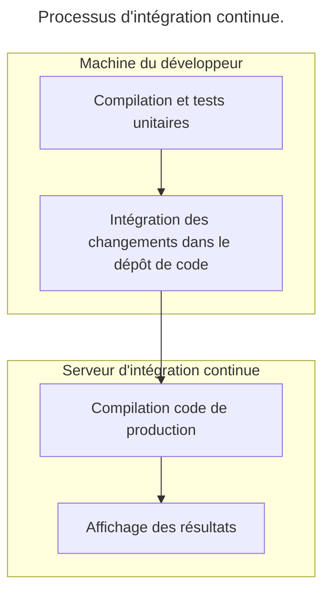
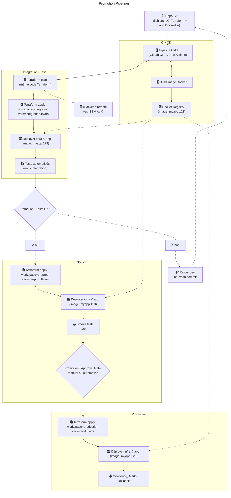

---

## ⚠️ Problèmes courants

- Lenteur des déploiements manuels ⏳
- Erreurs humaines fréquentes au déploiement : ❌
  - Configurations incorrectes ⚙️
  - Oublis de fichiers, … 📄
  - Besoin d'interventions d'urgence 🚨
- Modifications difficiles à suivre : 🔄
  - Quelle version en production ? 🏷️
  - Quels changements sur la production ? 🔍
  - Conflits de dépendances 🔄
- Tests non systématiques ❌
- Pas de communication entre dev et ops 📞

---

## 🔄 Intégration continue

> Ensemble de pratiques consistant à vérifier que chaque modification du code source ne produit pas de régression 🔄

---

> Continuous Integration is a software development practice where members of a team integrate their work frequently, usually each person integrates at least daily – leading to multiple integrations per day. Each integration is verified by an automated build (including test) to detect integration errors as quickly as possible. Many teams find that this approach leads to significantly reduced integration problems and allows a team to develop cohesive software more rapidly. Martin Fowler, ThoughtWorks Chief Scientist

---

## 🔄 Shift Left

La CI se positionne dans une stratégie **Shift Left** : 🔄

- Pratique qui consiste à intégrer les tests et la gestion des connaissances dans les étapes initiales du développement logiciel (plutôt que tardivement dans le processus de production). 🔄
- Objectif : détecter et corriger les bugs et les erreurs dès les premières étapes du développement 🐛

---

## 🌟 Avantages

---

### 🔄 Feedback loop réduite

- Spécifications ✅
  - Les spécifications sont validées plus tôt ✅
- Build 🏗️
  - Le build est testé plus tôt ✅
- Erreurs ❌
  - Les erreurs sont détectées plus tôt ❌
- Intégration 🔄
  - L'intégration est testée plus tôt 🔄

---

### 🤝 Facilite le travail collaboratif

Les changements concurrents sont validés contre une éventuelle régression 🔄

---

## ❌Inconvénients de l'intégration continue

---

- Demande de grosses ressources humaines à la mise en place et matérielles à l'usage 💼
  - Mais le gain est souvent vite compensé par les erreurs en moins à corriger ! ✅
- Peut être compliqué sur de gros changements : la CI nécessite d'intégrer souvent les changements sur le serveur… 🔄
  - … ce qui peut aussi être un avantage pour vérifier tôt la compatibilité ! ✅
- Peu adapté à certains environnements où les spécifications changent souvent (Proof of Concept, Recherche, ...) ⚠️

---

- Respecter une méthodologie stricte d'intégration continue demande beaucoup de rigueur 📏
  - Il peut être nécessaire de vérifier le respect de ces méthodes, manuellement ou automatiquement 🔍
- Le principal défaut est souvent humain ! 👥

---

# 🔄 Pipelines d'intégration continue

---

## 📌 Définition

- Un pipeline d'intégration est une définition formelle du **processus** à suivre pour **intégrer** des changements. 📌
- Il est souvent représenté de manière graphique par un **schéma d'enchaînement d'actions**. 📊
- Ces pipelines peuvent être exécutés manuellement, mais ils seront aussi la référence utilisée pour l'automatisation et l'orchestration de l'intégration continue. 🔄

---

### Exemple simpliste de pipeline

---

On pourra utiliser plusieurs profils (_pipelines_) d'intégration suivant les changements à intégrer et les ressources disponibles, par exemple :

- `Daily` pour chaque intégration : tests unitaires uniquement
- `Nightly` chaque soir : tests de fonctionnalités non parallélisables
- `Weekly` chaque semaine : `staging` (copie environnement de production) pour scénarios complexes de tests de performances

---

:::tip

- On pourra répliquer certains éléments de la boucle d'intégration continue sur l'environnement du développeur pour améliorer les temps de réponse.
- Cela ne dispense pas de reproduire ces étapes sur le serveur d'intégration (environnement neutre).

:::

---

## Workflows Git

Les pipelines d'intégration continue sont fortement liés aux workflows de gestion du code source qui conditionnent les process de développement.

:::link
Voir le [cours sur le gestionnaire de versions Git](/git/).
:::

---

### Pull-request

- Popularisé par `GitHub®`, la `pull-request` ou `merge-request` est aujourd'hui largement répandue en gestion de projet.
- En théorie, simple demande de relecture de code avant l'intégration (`merge`) d'une branche dans une autre.
- En pratique : permet de prévenir l'équipe de la fin d'une partie du produit et engage le processus d'intégration, par exemple un pipeline d'intégration continue

---

### Process de pull-request

Étape optionnelle avant d'intégrer la branche de fonctionnalité au `main` du dépôt central :

1. `push` de la branche de `dev` dans le dépôt central
2. Validation des changements avant fusion : `pull-request`
3. Fusion dans `main` dans le dépôt central

---

- C'est généralement le point de départ du pipeline d'intégration continue.
- Sert de discussion avant l'intégration de changements : revue de code, vérification de la qualité, process administratifs, ...
- Approuvée manuellement par les développeurs ou automatiquement en fonction de critères qualité.

---

### Qualité du commit vs qualité de la pull-request

Il existe 2 grands schémas de lancement de pipeline d'intégration continue (et beaucoup de modèles mélangeant un peu de ces deux schémas) :

- Pour chaque commit : à privilégier pour les branches stables du projet, où chaque commit est critique : `master`, ...
- Au moment d'une pull-request : à privilégier pour les branches de travail instables : fonctionnalité, correction de bug, ...

---

### Qualité liée au commit

- Les interfaces de gestion de projets hébergés (`Github®`, `Bitbucket`, `Gitlab`, ...) peuvent parfois laisser croire que l'intégration continue a été réalisée sur la pull-request…
- …mais la référence utilisée est **toujours un commit** (celui qui sera utilisé pour le merge de la branche).
- `qualité de la pull request == qualité du commit de référence de la branche à intégrer`

---

---

# 📌 Grands principes de l'intégration continue

- Centralisation du code 💾
- Commit réguliers 🔄
- Automatisation des build 🤖
- Compilations auto-testantes 🧪

---

## 💾 Centralisation du code : le gestionnaire de versions

- Segmente les modifications du code source en `commits` et les identifie par des ID de commit. 🏷️
- Garantit l'intégrité : permet le partage fiable des modifications entre tous les développeurs. 🔄
- Référence du contrôle qualité : toute métrique d'intégration continue est faite contre un commit. 🔍

---

Exemples : `git`, `mercurial`, `svn` et leurs serveurs hébergés : `github`, `bitbucket`, `gitlab`, ... 🌐
Certains gestionnaires de versions permettent d'isoler du tronc commun les modifications dont la qualité n'est pas encore suffisante : branches `git`, ... 🌿

---

## 🔄 Commit réguliers

- But intégration continue : réduire au maximum le temps de feedback. ⏳
  - Intégrer les plus petits changements possibles. 🔄
  - Intégrer le plus souvent possible. 🔄
- En principe : intégration continue si `> 1 intégration (commit) par jour`. 📅

---

## 🤖 Automatisation des build

- Nécessaire pour une analyse et validation automatique de la qualité : ✅
- Pas d'intervention manuelle sur l'intégration continue. ❌
- Mais processus manuel possible, par exemple si changements critiques et concurrents entre 2 développeurs. 👥
  - Ces intégrations manuelles sont à exécuter **avant** l'intégration continue - qui validera donc l'ensemble de ces changements ✅

---

## 🧪 Compilations auto-testantes

- Les outils de build permettent l'exécution de certains outils d'intégration continue : tests, vérification syntaxique, … directement durant la phase de build 🛠️
- Permet d'exécuter le même outil avec la même configuration à toutes les étapes du pipeline d'intégration : machine personnelle, serveur d'intégration, … 🖥️
- Une modification du code source ne passant pas l'étape de compilation est en général immédiatement rejetée et la boucle d'intégration continue s'arrête. ❌

---

Lancement de l'outil automatiquement par l'outil de build : pas de programme externe et pas d'oubli de lancer l'outil. 🔄
Ex : `gradle build` ou `mvn package` intègrent par défaut l'exécution des tests unitaires. 🧪

---

Exemple de processus d'intégration continue

---

## 🏗️ Déploiement continu (_Continuous Deployment_)

- Le mouvement DevOps favorise de plus en plus un processus opérationnel entièrement automatisé. 🏗️
- La CI devient une vérification entièrement automatisée dans le pipeline de déploiement. 🔄
- Si succès : l'artéfact généré est déployé automatiquement en production. 🏗️

---

:::tip
Cette méthode opérationnelle est très efficace car elle est entièrement automatisée. Cependant, il est nécessaire de pouvoir agir très rapidement sur la production pour pouvoir fixer d'éventuels problèmes non détectés par le processus automatique.
:::

---

## 🏗️ Livraison continue (_Continuous Delivery_)

En pratique, on ajoute souvent une étape de validation manuelle avant le déploiement en production : on effectue alors uniquement la livraison dans un environnement d'intégration / pré-production. Ce modèle s'appelle la livraison continue (_continuous delivery_) et est souvent le terme abrégé par `CD` dans la `CI/CD`. 🏗️

---

## 📌 Méthodologies et gestion de projet

---

### 🧩 Découpage en composants

- Permet une exigence qualité différente pour chaque composant. 🛠️
- Facilite la non régression en testant les composants isolément. 🔄
- Permet d'identifier des zones de haute qualité vs des zones à améliorer. 📊

---

### 🔄 Développement itératif

- L'intégration a lieu bien plus tôt dans la phase de développement. 🔄
- Les itérations facilitent l'acceptation ou le rejet des changements. 🔄
- Très compatible avec les méthodes agiles. 🔄

---

### 🤝 Responsabilité partagée

- L'intégration continue peut être mise en place à tous les niveaux du pipeline d'intégration : 🔄
  - Chez les développeurs (IDE) 💻
  - Chez les opérationnels (serveur d'intégration) 🏗️

---

## Actionnabilité

- Besoin d'**actionnabilité** après erreur dans le pipeline
- Définir la **gouvernance** : qui est responsable de quoi ?
- Sinon : plus de confiance dans la CI/CD

---

| Catégorie            | Fréquence de Déploiement (vitesse) | Délai d'exécution des modifications (vitesse) | Temps moyen pour restorer (stabilité) | Taux d'erreurs lors de changements (stabilité) |
|--------------------|---------------------|---------------------|----------------------|--------------------|
| Elite performers    | > 1/jour (à la demande) | < 1 jour            | < 1 heure           | 0 - 15%            |
| High performers    | 1/jour - 1/semaine  | 1/jour - 1/semaine | < 1 jour            | 0 - 15%            |
| Medium performers  | 1/semaine - 1/mois  | 1/semaine - 1/mois  | < 1 jour            | 0 - 15%            |
| Low performers     | 1/mois - 1/6 mois   | 1/mois - 1/6 mois   | 1 semaine - 1 mois  | 46 - 60%           |

---

## Promotion Pipelines

- _Promotion Pipelines_ : Passage d'un environnement de test -> staging -> … -> prod
- Configuration des **différents environnements** : utiliser des **fichiers / répertoires** dédiés (~pas de branches Git par environnement~)
- Valeurs **par défaut** : **production** (évite d'envoyer des conf de dev en prod)

:::link

- <https://dev.to/codefreshio/how-to-model-your-gitops-environments-and-promote-releases-between-them-1p6i>
- <https://developers.redhat.com/articles/2022/07/20/git-workflows-best-practices-gitops-deployments>
- <https://codefresh.io/blog/stop-using-branches-deploying-different-gitops-environments/>

:::

---

# Ressources

- Le site de référence de [Martin Fowler sur l'intégration continue](https://martinfowler.com/delivery.html)
- La [traduction en français du site précédent](https://skalp.developpez.com/traductions/martin-fowler-integration-continue/)
- Le livre sur l'intégration continue : [Continuous Integration](https://martinfowler.com/books/duvall.html)
- Le livre sur le déploiement continu : [Continuous Devilery](https://martinfowler.com/books/continuousDelivery.html)
- Intégration continue avec Gitlab CI : <https://gitlab.com/goffinet/gitlab-ci>
- [Exemple de pipeline Jenkins YAML en Infrastructure-as-Code][gist-jenkins-pipeline-yaml]
- [CD : Gestionnaires d'artéfacts - attaques supply chain](https://blog.wescale.fr/supply-chain-attack-proxies-gestionnaires-dartefacts-et-cartographie)
- [CD : attaques supply chain - livrables de confiance](https://blog.wescale.fr/supply-chain-attack-des-livrables-de-confiance)
- Le pipeline d'Actions Github du site Web du cours (<www.avenel.pro>) : <https://github.com/tavenel/website/actions>
- 🚀 Pour aller plus loin : le [cours sur les pratiques DevOps](/devops).

[gist-jenkins-pipeline-yaml]: https://gist.github.com/jonico/e205b16cf07451b2f475543cf1541e70

---
