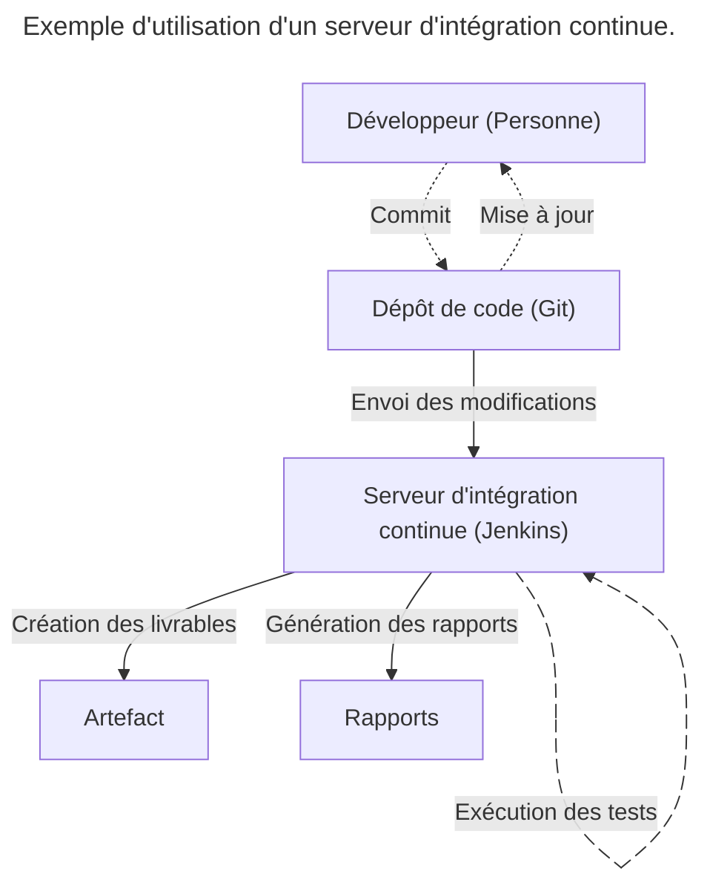
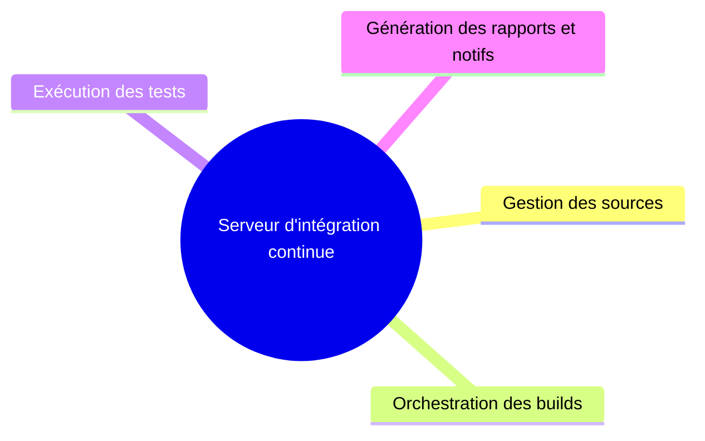

## 🛠️ Présentation

- Outil permettant d'orchestrer le lancement de l'intégration continue, l'exécution des différents outils et la génération de rapports sur la qualité du code après leur exécution. 🔄
- Le code source est surveillé (ou une notification reçue) pour chaque nouveau changement à analyser, afin de lancer la boucle d'intégration continue. 🔄

---

> Serveurs CI/CD les plus utilisés (2025) : GitHub Actions (40%), GitLab (39%), Jenkins (36%) (d'après : <https://www.docker.com/blog/2025-docker-state-of-app-dev/> ).

---

---

## 🌐 Types de serveurs CI

- Combinant hébergement des sources et intégration continue du projet : `Github®`, `Gitlab®`, `Bitbucket®`, … 🌐
  - Ces serveurs proposent des solutions cloud gérant tout le cycle de vie du projet. ☁️
- Dédiés à l'intégration continue uniquement : `Jenkins®`, `TeamCity®` 🔄
  - S'interfacent avec un hébergement distant. 🌐
  - Peuvent être hébergés en ligne ou déployés sur un serveur dédié. 🖥️

---

## 🤔 Lequel choisir ?

- Un hébergement cloud combinant hébergement et intégration continue est une solution de facilité pour des projets "classiques" dont l'intégration suit des patterns standards. ☁️
- Un serveur dédié permet de contrôler plus finement l'intégration mais nécessite plus de configuration. 🛠️

---

## Architecture d'un serveur d'intégration continue

---

## 🌟 Avantages d'un serveur d'intégration

---

### 🏢 Environnement neutre

- Serveur distant : environnement **neutre** pour s’affranchir des spécificités des postes de développeurs : 🏢
- Librairie présente sur le poste de travail mais non déclarée dans les dépendances du projet. 📚
- Version des outils / librairies différentes sur chaque poste de travail. 🔧
- Permet d’obtenir des builds fiables et reproductibles. ✅

---

### ⏰ Plannification

Permet de planifier l'exécution des tâches de l'intégration continue ⏰

---

### 🤝 Mutualisation

Mutualise les ressources entre plusieurs développeurs et/ou plusieurs équipes 🤝

---

## ❌Inconvénients d'un serveur d'intégration

---

### 💻 Ressources matérielles

L'utilisation d'un serveur d'intégration dédié est une ressource supplémentaire. 💻

---

### ⏳ Temps d'exécution

- Augmente le temps d'exécution de la feedback loop pour le développeur (temps nécessaire avant d’avoir un retour sur la qualité des changements à intégrer). ⏳
- Il faut trouver un **compromis** entre une **exécution rapide** mais peu de feedback, ou **beaucoup de vérifications** mais à un coût en temps et ressources élevées. ⚖️
- En général, une feedback loop de :
	- `15 / 30 min` est une bonne moyenne ⏳
	- `> 1h` est peu utilisable : l'environnement du développeur sera trop différent de celui des modifications à tester ❌

---

## 🛠️ Optimisations

- La phase de **compilation** est une bonne cible d'optimisation : elle peut être une part importante du temps d'exécution mais produit peu de feedback. 🛠️
- On **parallélisera** au maximum les **tests** d'intégration continue (souvent unitaires) pour améliorer ce temps de réponse. ⏱️
- Plus les intégrations sont fréquentes, plus la feedback loop devra être rapide. 🔄

---

# 🔄 Jenkins

Le [logo Jenkins®](https://www.jenkins.io/).

---

## 📌 Présentation

- Serveur d'intégration continue en Java. ☕
- Système simple mais entièrement configurable. 🛠️
- Intégration continue et DevOps par plugin : `Git`, `Maven 2 project`, `Amazon EC2`, `HTML Publisher`, ... 🔌
- Outil d'intégration continue le plus utilisé : vaste communauté, 1500 plugins… 🌐
- Fork open-source de `Hudson` (nombreuses traces dans documentation et configurations). 🌿

---

## 🛠️ Installation

- Installation comme application indépendante 🛠️
  - Facile et rapide sur toute machine 🖥️
  - Serveur d'applications dédié ou container servlet Java `Jetty` (voir doc) 📄
- Installation comme servlet dans un serveur d'applications Java : `Apache Tomcat`, `GlassFish®`, ... 🏗️
  - Serveur applicatif à administrer 🛠️
  - Stabilité accrue des tests et du déploiement ✅
- Déploiement dans des conteneurs `Docker` 🐳

---

## 🔄 Modèles de déploiement

Mode de déploiement `Contrôleur` / `Agent` (maître / esclave). 🔄
- Le contrôleur orchestre les builds : récupère les changements à valider, choisit un nœud agent pour l'exécution et démarre le build. 🛠️
- L'agent exécute simplement les tâches qui lui sont assignées et retourne les résultats au contrôleur. 🔄

:::tip
Afin de réduire la charge de l'orchestrateur au maximum, il est recommandé de déléguer l'exécution des builds à des agents au maximum, et d'installer les agents sur des ressources dédiées.
:::

---

## 🔌 Principaux plugins

- Jenkins est avant tout un orchestrateur de build, délégant chaque tâche à un ou plusieurs plugins pour : 🔌
- Ajouter des fonctionnalités au serveur : nouveaux écrans de contrôles, gestion fine des dépendances de build, ... 🛠️
- Faire le lien entre le serveur et les outils d'intégration continue locaux ou sur le réseau. 🌐

---

- `Dashboard View Plugin` : suit le statut des tâches 📊
- `Monitoring Plugin` : mesure la performance des jobs 📈
- `Kubernetes Plugin` : gère le déploiement des agents Jenkins sur une infrastructure `Kubernetes` 🐳
- `Multijob Plugin` : orchestre des tâches complexes de manière séquentielle 🔄
- `GitHub API` : planifie et déclenche des builds depuis GitHub® 🌐
- `Git Client` : fournit une API Git pour les plugins Jenkins 🔄
- `Pipeline` et `Blue Ocean` : configuration de pipelines proches de celle des hébergements cloud : `Gitlab`, `GitHub®`, `Bitbucket`, ... ☁️

---

## 🛠️ Jobs

- Jenkins fonctionne essentiellement sous la forme de jobs (enchaînement d'étapes), de types variés. 🛠️
- 1 projet de build = un job. 🏗️
- Peut enregistrer et afficher des processus exécutés à l'extérieur de Jenkins. 🌐

:::tip
Un job multi-configuration peut être d’une grande utilité dans des projets plus sophistiqués, notamment lorsque des builds spécifiques à chaque plateforme sont nécessaires.
:::

---

## 🤖 Automatisation : la CLI et l'API

- Possibilité d'automatisation : création, sauvegarde, restauration, exécution ou vue de jobs Jenkins, ... 🤖
- Soit par ligne de commandes (CLI) fournie en JAR. 💻
  - Packagée à l'intérieur du `WAR` local : `wget http://localhost:8080/jenkins/jnlpJars/jenkins-cli.jar`
- Soit par une REST API. 🌐
  - 3 implémentations : `XML`, `JSON`, `Python`

---

## 🔄 Enchaînement de jobs

Le chaînage des jobs est l'une des fonctionnalités les plus intéressantes de Jenkins : 🔄
- Permet de créer des liens logiques entre les jobs 🔗
- Exécution d'autres jobs en cas de succès ou d'échec ✅❌

---

:::tip
En pratique, on utilise les dépendances entre jobs pour :

- Appeler des jobs (publication de résultats, ...) qui peuvent être communs à un ensemble de builds d’intégration continue. 📢
- Nettoyer le système en cas d’échec lors d’un build. 🧹
- Séparer les étapes d’un processus d’intégration continue : compilation des sources, exécution des tests, analyse statique, ... 🛠️
:::

---

## 🛠️ Outils d'analyse principaux

- Jenkins supporte de nombreux outils d'analyse par le biais de plugins, par exemple : 🛠️
- `Checkstyle`
- `Spotbugs`
- `Emma`
- `CPD/PMD`

---

### 🧪 Tests unitaires et d'intégration

Jenkins est un orchestrateur : il permet donc d'automatiser les tests unitaires et/ou d'intégration, de plusieurs manières : 🤖
- En utilisant des plugins dédiés. 🔌
- En s'intégrant avec des outils de build : `Maven`, `Gradle`, ... 🛠️
- En fournissant des scripts à exécuter 📜

:::tip
Jenkins permet de s'interfacer avec de nombreux outils d'exécution ou de reporting de tests. Nous verrons comment intégrer Jenkins avec les principaux outils de tests.
:::

---

### 🛠️ Le plugin Warnings Next Generation

Regroupe de nombreux plugins d'intégration continue pour : 🛠️
- Analyser les erreurs des compilateurs : `C`, `C#`, `Java` 🔍
- Générer des avertissements en utilisant des outils d'analyse statique : `CheckStyle`, `SpotBugs` ⚠️
- Détecter les duplications de code : `CPD` 🔍
- Trouver les vulnérabilités dans le code 🔍
- Ajouter des commentaires dans les sources du projet 📝

:::tip
Ce nouveau plugin rend obsolète la plupart des plugins de la suite d'analyse statique de Jenkins : `Android Lint`, `CheckStyle`, `Dry`, `FindBugs`, `PMD`, `Warnings`, `Static Analysis Utilities`, `Static Analysis Collector`
:::

---

### 🛠️ Analyse qualité avec SonarQube™

- Jenkins s'intègre avec le serveur d'analyse de qualité `SonarQube` (outil de reporting sur la qualité des projets informatiques). 🛠️
- Celui-ci centralise les rapports d’outils d’analyse de code pour afficher des informations comme la couverture de test, le respect des normes de développement, la complexité, la duplication… 📊
- `SonarQube™` supporte de nombreux langages : `Java`, `PHP`, `C++`, `.NET`, ... 🌐

---

#### 📊 Dette technique

> **Dette technique** : temps nécessaire dans le futur pour faire évoluer le code (correction de bugs, refactor, …) ⏳

:::tip
Si SonarQube permet de quantifier la dette technique d'un projet, il est important de garder à l'esprit que ces valeurs sont avant tout un ensemble d'indices permettant de déceler des zones d'amélioration, et non une métrique fiable sur la qualité du produit ⚠️
:::

---

#### 📊 Exemples de métriques

- Pourcentage de lignes de code dupliquées 📊
- Pourcentage de lignes de code testées (ex : 70%) 📊
- Complexité du modèle (nombre de méthodes par classe, profondeur de l'héritage, ...) 📊
- Nombre d'avertissements du compilateur ⚠️

---

### 📊 Rapports de tests dans TestLink

- `TestLink` est un outil d'"Assurance Qualité" permettant de gérer l'ensemble du cycle de vie des tests : la gestion des cas de test, la gestion des exigences, l'exécution des campagnes de test et le reporting des résultats. 📊
- C'est l'un des outils les plus utilisés en Assurance Qualité pour réaliser le suivi des tests. 📊
- Jenkins permet l'intégration des résultats des tests exécutés en envoyant les rapports d'exécution dans `TestLink`. 📊

:::link
Voir le [TP sur TestLink](https://example.com).
:::

---

## 🔄 Lier et enchaîner les jobs

---

### 🔄 Pipelines Jenkins

- Jenkins permet de créer un workflow d'orchestration, appelé pipeline. 🔄
- Par exemple, un fichier de pipeline déclaratif peut comprendre une étape de build, une étape de test et une étape de déploiement ; chaque étape implique de nombreuses étapes individuelles. 🏗️
- Jenkins peut créer et soutenir des pipelines multi-branches pour créer des jobs de build complexes en se basant sur des critères externes. 🌿

---

- Jenkins propose deux modes de configuration pour les pipelines : 🔄
  - En configurant les étapes du pipeline directement dans Jenkins 🛠️
  - En codant ces étapes dans un fichier `.jenkinsfile`, de façon similaire à ce qui est utilisé sur les outils d'hébergement de code en ligne `Github®`, `Gitlab`, `Bitbucket` 🌐
- Dans un modèle continu ou DevOps, Jenkins est utilisé pour des activités de déploiement, même dans des configurations complexes et sur plusieurs serveurs Jenkins, en utilisant généralement les API des pipelines. 🌐

---

:::warn
Ne pas confondre le mode _pipeline_ de Jenkins (implémentation technique d'un enchaînement de jobs) et le _pipeline_ global d'intégration continue (processus formel de validation). Le pipeline Jenkins peut implémenter entièrement le processus global ou en être seulement un morceau (utilisation de plusieurs serveurs d'intégration continue, etc…)
:::

---

### 🔄 Jobs paramétrés - réutilisation d’un commit

- Jenkins permet de créer des jobs paramétriques. 🔄
- Le plugin `Parameterized Build` permet de configurer des paramètres pour les tâches de build, qui peuvent être entrés par l'utilisateur lorsque le build est déclenché ou depuis une autre tâche. 🛠️
- Cette paramétrisation permet par exemple de choisir un environnement d'exécution ou de fournir un mot de passe pour une application. 🔐

---

:::tip
Un autre cas d'utilisation est la réutilisation d'un commit : un job principal peut être lancé depuis le dépôt de code après l'arrivée d'un nouveau commit. Ce job principal peut lancer de nouveaux jobs en leur fournissant l'identifiant du commit en cours de test - cela permet d'assurer une chaîne complète de jobs testant le même commit.
:::

---

### 🛠️ Job manuel

- Jenkins permet l'exécution d'étapes manuelles dans un pipeline pour demander une approbation avant de continuer l'exécution (instruction `input`). 🛠️
- `input` affiche un message à l'utilisateur avec deux options : ✅
  - `Proceed` pour continuer l'exécution du pipeline ✅
  - `Abort` pour l'arrêter. ❌

---

:::tip
Ces étapes sont très utiles dans des pipelines de déploiement. Elles permettent par exemple de demander à un opérateur de vérifier les critères de qualité d'un build avant d'approuver le déploiement automatique du projet en production.
:::

---

### 🔄 Enchaînement de jobs

- `dependency` et `join` permettent de créer des dépendances entre les jobs : 🔄
- `dependency` permet de rendre un job dépendant d'un autre job. 🔗
- `join` permet d'attendre la fin d'un groupe de jobs avant d'exécuter le job suivant. ⏳
- Mettent en place un pattern `map/reduce` sur les dépendances : optimise le temps d'exécution et la gestion des erreurs 🛠️

---

:::tip
- Une utilisation classique de ce pattern en intégration continue est l'exécution parallèle de tests : 🧪
- Les tests exécutés en parallèle dépendent du job de compilation. 🏗️
- Un job de résultats regroupe toutes les exécutions dans une étape `join`. 🔄
:::

---

:::link
Pour plus d'informations sur l'enchaînement de jobs :

- Le plugin [Depgraph View](https://plugins.jenkins.io/depgraph-view/) permet de représenter les dépendances 📊
- Documentation du plugin [join](https://plugins.jenkins.io/join/) 📄
:::

---

### 🛠️ Jobs multi-configuration

- Il est courant dans un processus d'intégration continue de devoir exécuter la même suite de tests dans des environnements différents. 🛠️
- Pour rationaliser ces exécutions et éviter de dupliquer des jobs similaires, Jenkins fournit un type avancé de jobs : les jobs multi-configuration. 🛠️
- Matrices de configuration qui vont générer un build dédié pour chaque environnement défini. 🛠️

---

- Ces jobs sont surtout utilisés pour des tests d'intégration dépendants de l'environnement d'exécution : 🛠️
- Tests d'interface graphique sur des matrices de navigateurs Web (type de navigateur x version). 🌐
- Tests de déploiement applicatif multi-OS : `Windows®`, `Linux®`, `Mac OS®` 🖥️

---

## 📚 Références

La documentation de Jenkins est très complète, on pourra notamment citer :

- Le [site officiel](https://www.jenkins.io/)
- La page d'accueil de la [documentation](https://www.jenkins.io/doc/)
- Comment gérer la [sécurité de Jenkins ?](https://www.jenkins.io/doc/book/security/)
- Comment installer et gérer les [plugins Jenkins ?](https://plugins.jenkins.io/)
- Comment utiliser les [pipelines Jenkins ?](https://www.jenkins.io/doc/book/pipeline/)
- Comment mettre en œuvre les [builds dans Jenkins ?](https://www.jenkins.io/doc/pipeline/tour/getting-started/)
- [Guide complet de Jenkins](https://www.jenkins.io/doc/)

[jenkins-logo]: https://www.jenkins.io/images/logos/jenkins/256.png
[server-ci-process]: ./server-ci-process.jpg
[sonarqube-ui]: https://upload.wikimedia.org/wikipedia/commons/a/ac/SonarQube_Project_page.png

<!--references-->
[jenkins-website]: https://www.jenkins.io/
[doc-jenkins-main]: https://www.jenkins.io/doc/
[doc-jenkins-secu]: https://www.jenkins.io/doc/book/managing/security/
[doc-jenkins-plugins]: https://www.jenkins.io/doc/book/managing/plugins/
[doc-jenkins-pipelines]: https://www.jenkins.io/doc/tutorials/#pipeline
[doc-jenkins-builds]: https://www.jenkins.io/doc/tutorials/#tools
[jenkins-guide-complet]: https://jenkins-le-guide-complet.github.io/html/book.html

<!--plugins-->
[plugin-depgraph-view]: https://plugins.jenkins.io/depgraph-view/
[plugin-join]: https://plugins.jenkins.io/join/

---

