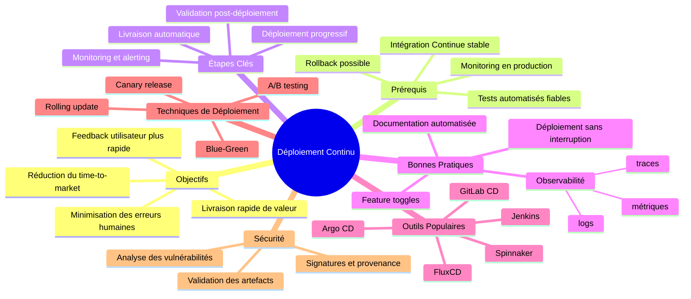

## 🎯 Objectifs

- Apprendre les principes fondamentaux des déploiements continus et leur importance dans le cycle de vie du développement logiciel.
- Étudier divers modèles de déploiement comme Blue-Green, Canary Release, Ring Based Deployment, Feature Flags, Dark Launch, et Test A/B.
- Analyser les avantages et inconvénients de chaque modèle pour comprendre quand et comment les appliquer.
- Comprendre comment intégrer ces modèles de déploiement avec des outils d'intégration et de livraison continues (CI/CD).

---

## 🐞 Bug détecté en production

- Attendre la livraison d'un correctif ? 🐞
- Faire un rollback vers la version précédente ? 🔄
- Quelle stratégie de déploiement pour adresser ces problèmes ? 🔄

---

## 🔵🟢 Blue-Green Deployment

- Déploiement _zero-downtime_ 🔄
- 2 productions identiques 🔵🟢
- Un routeur aiguille les utilisateurs vers l'un des 2 sites 🔄
- Mise à jour d'un site puis l'autre 🔄

---

### 🌟 Avantages / Inconvénients ❌

- Implémentation **facile** et **rapide** (Cloud) ✅
- **Rollback** possible en utilisant le second site ✅
- **Tests** dans environnement **identique à la production** ✅
- **Coûts** et **maintenance** supérieurs : 2 sites ⚠️

---

## 🐦 Canary Release

- Similaire _Blue-Green_ 🐦
- Seule un petit **pourcentage aléatoire** des utilisateurs migre sur la nouvelle version 🔄
- Utile si peu de confiance sur la nouvelle version ✅
  - Surveiller le panel d'utilisateurs sur le nouveau site 🔍
  - Migrer petit à petit tous les utilisateurs 🔄

---

## 🎯 Ring Based Deployment

- Similaire _Canary Release_ mais le public test est un public **ciblé** : 🎯
  - Experts du domaine 🧠
  - Public impacté par le changement 🎯
  - …

---

## 🏷️ Feature Flags

- Le **code est modifié** pour **(dés)activer les fonctionnalités** au déploiement ou dynamiquement : 🏷️
  - Difficile en dev si non prévu dès le début du projet ⚠️
  - Grande liberté de déploiement : morceaux de fonctionnalités non terminées 🛠️

---

## 🌑 Dark Launch

- **Ring-Based Deployment** et **Feature Flags** combinés : 🌑
- Nouvelle fonctionnalité activée uniquement pour panel précis 🎯
- Ajustement des déploiements suite aux retours du panel 🔄
- Migration des autres utilisateurs 🔄

---

## 🧪 Test A/B

- **2 versions** concurrentes sont déployées 🧪
- Chaque utilisateur est aiguillé **aléatoirement** sur l'un des sites 🔄
- Seule la version la "meilleure" (moins de bugs, meilleurs retours clients, ...) est gardée 🏆

---

## Liens

- <https://martinfowler.com/bliki/BlueGreenDeployment.html>
- <https://martinfowler.com/bliki/ContinuousDelivery.html>
