## Patterns tactiques de base

---

### 🎯 Entity

Une entité représente un **objet métier** dans le **domaine** qui possède une **identité unique** et qui évolue au fil du temps. Il a un ID et est mutable.

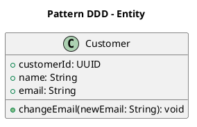

#### Caractéristiques principales d'une **Entity**

1. **Identité unique** :
   - Chaque entité a une **identité** (ID) qui la distingue des autres entités, même si leurs attributs sont identiques.
   - Cette identité est essentielle pour la gestion des entités dans le système.

2. **État mutable** :
   - Une entité peut changer d'état au fil du temps (par exemple, des propriétés ou des attributs peuvent évoluer).

3. **Appartient au domaine métier** :
   - Une entité est définie par le langage ubiquitaire et représente un concept important pour les experts métier.

4. **Comportement métier** :
   - Une entité encapsule à la fois des **données** (attributs) et des **comportements** (logique métier liée à elle).

5. (Souvent) **partie intégrante d'un agrégat** :
   - Les entités sont souvent groupées sous un **Aggregate** pour gérer leurs relations et leurs règles métier de cohérence.

#### Exemple dans le Domaine : Système de gestion des commandes

Une **commande (`Order`)** est un concept central du domaine.

##### Définition d'une entité `Order`

```python
class Order:
    def __init__(self, order_id, customer_id, items):
        self.order_id = order_id  # Identité unique
        self.customer_id = customer_id
        self.items = items  # Liste d'articles
        self.status = "created"

    def add_item(self, item):
        """Ajoute un article à la commande."""
        self.items.append(item)

    def update_status(self, new_status):
        """Met à jour le statut de la commande."""
        self.status = new_status
```

#### Exemple dans le Domaine : Banque

Une entité **Compte bancaire** (`BankAccount`) peut être définie comme suit :

```python
class BankAccount:
    def __init__(self, account_id, owner, balance):
        self.account_id = account_id  # Identité unique
        self.owner = owner
        self.balance = balance

    def deposit(self, amount):
        """Ajoute un montant au solde."""
        if amount <= 0:
            raise ValueError("Le montant doit être positif.")
        self.balance += amount

    def withdraw(self, amount):
        """Retire un montant du solde."""
        if amount > self.balance:
            raise ValueError("Fonds insuffisants.")
        self.balance -= amount
```

#### Bonnes pratiques pour les entités

1. **Responsabilités claires** :
   - L'entité ne doit gérer que sa propre logique métier.
   - Évitez de surcharger les entités avec des dépendances vers d'autres couches (ex. : services ou infrastructure).

2. **Encapsulation stricte** :
   - Les propriétés d'une entité doivent être modifiables uniquement via des méthodes (pas directement exposées).

3. **Respectez le langage ubiquitaire** :
   - Les noms et les comportements doivent refléter les termes métier discutés avec les experts du domaine.

4. **Favorisez les `Value Objects`** :
   - Si une propriété ou un concept n'a pas besoin d'identité, utilisez des `Value Object` à la place pour simplifier.

---

### 🧩 Value Object

Contrairement aux **entités**, les `Value Objects` n'ont pas d'**identité unique**. Ils sont définis uniquement par leurs **valeurs** et sont souvent **immuables**.

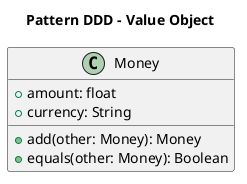

#### Caractéristiques principales d'un **Value Object**

1. **Pas d'identité unique** :
   - Deux Value Objects sont considérés comme égaux si leurs **valeurs** sont identiques.
   - Ils ne sont PAS identifiés par un ID comme les entités.

2. **Immutabilité** :
   - Une fois créé, un `Value Object` ne doit pas être modifié.
   - Tout changement produit un **nouveau** `Value Object`.

3. **Responsabilités limitées** :
   - Un Value Object représente souvent une simple **caractéristique** ou **mesure** d'un concept métier (ex. : une adresse, une monnaie, une date).

4. **Encapsulation des règles métier** :
   - Les Value Objects peuvent contenir de la logique métier pertinente, comme la validation de leurs valeurs ou des opérations liées à elles.

5. **Réutilisabilité** :
   - Les Value Objects peuvent être réutilisés dans plusieurs parties du domaine, ce qui réduit la duplication.

#### Exemple d'utilisation : Domaine : Adresse dans un système de commande

Un **Value Object** `Address` pourrait être défini comme suit :

```python
class Address:
    def __init__(self, street, city, postal_code):
        if not postal_code.isdigit():
            raise ValueError("Le code postal doit être numérique.")
        
        self.street = street
        self.city = city
        self.postal_code = postal_code

    def __eq__(self, other):
        if not isinstance(other, Address):
            return False
        return (
            self.street == other.street and
            self.city == other.city and
            self.postal_code == other.postal_code
        )

    def __str__(self):
        return f"{self.street}, {self.city}, {self.postal_code}"
```

#### Exemples de cas où utiliser des **Value Objects**

1. **Monnaie et montant** :
   - Représentation d'un montant avec une devise (ex. : `Money` avec des opérations comme addition ou conversion).

2. **Date ou intervalle de temps** :
   - Ex. : `DateRange` pour encapsuler un intervalle avec des validations.

3. **Adresse ou contact** :
   - Encapsulation des informations d'adresse pour éviter la duplication et valider les formats.

4. **Unité de mesure** :
   - Ex. : `Weight`, `Length`, `Temperature` avec des conversions ou des comparaisons intégrées.

#### Différence entre **Value Object** et **Entity**

| **Aspect**               | **Value Object**                                 | **Entity**                                   |
|--------------------------|--------------------------------------------------|----------------------------------------------|
| **Identité unique**      | Non. Uniquement défini par ses valeurs.          | Oui. Identifié par un ID unique.             |
| **Mutable**              | Non. Généralement immuable.                      | Oui. L'état peut évoluer dans le temps.      |
| **Représente**           | Une caractéristique ou un attribut réutilisable. | Un concept métier central avec une identité. |
| **Exemple**              | Adresse, Monnaie, Coordonnée géographique.       | Commande, Client, Produit.                   |

#### Bonnes pratiques avec les **Value Objects**

1. **Favorisez les Value Objects lorsque c'est possible** :
   - Si un concept n'a pas besoin d'une identité unique, préférez un `Value Object` à une `Entity`.

2. **Respectez l'immuabilité** :
   - Fournissez des méthodes pour produire de nouveaux objets au lieu de modifier les objets existants.

3. **Encapsulez les règles métier** :
   - Assurez-vous que toute validation ou logique liée aux valeurs est contenue dans le Value Object.

4. **Utilisez des comparateurs** (égalité, …) :
   - Implémentez par exemple `__eq__` en Python pour faciliter la comparaison entre Value Objects.

---

### 📦 Aggregate

Regroupe des `Entity` et des `Value Objects` qui forment une unité cohérente pour la logique métier et la cohérence des données. 

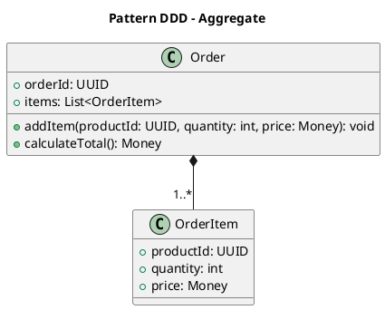

#### Caractéristiques principales d'un **Aggregate**

1. **Unité de cohérence** :
   - Toutes les règles métier d'un `Aggregate` doivent être respectées à l'intérieur de ses limites.
   - Les modifications au sein d'un `Aggregate` garantissent la validité globale de celui-ci.

2. **Root (racine)** :
   - Chaque agrégat possède une **racine d'agrégat (`Aggregate Root`)**, qui est une `Entity` servant de point d’entrée unique.
   - Toute interaction avec l’agrégat passe par cette racine.

3. **Délimitation claire** :
   - Un `Aggregate` définit une frontière dans le domaine métier. Les données ou comportements en dehors de cette frontière ne doivent pas être directement accessibles ou manipulés.

4. **Encapsulation** :
   - Les `Entity` et `Value Objects` internes à un `Aggregate` sont accessibles uniquement via la racine d’agrégat.

5. **Cohérence transactionnelle** :
   - Les modifications dans un `Aggregate` sont cohérentes et complètes dans une seule transaction. 

#### Exemple d'Aggregate

##### Domaine : Système de commande

Un agrégat `Order` (commande) pourrait inclure :

- **Entité racine** : `Order` (commande).
- **Entités internes** : `OrderItem` (article de commande).
- **Value Objects** : `Address` (adresse de livraison).

##### Représentation en code :

```python
class Order:
    def __init__(self, order_id, customer_id, shipping_address):
        self.order_id = order_id  # Identité unique
        self.customer_id = customer_id
        self.shipping_address = shipping_address  # Value Object
        self.items = []  # Liste d'entités OrderItem
        self.status = "created"

    def add_item(self, product_id, quantity, price):
        """Ajoute un article à la commande."""
        if quantity <= 0:
            raise ValueError("La quantité doit être positive.")
        self.items.append(OrderItem(product_id, quantity, price))

    def update_shipping_address(self, new_address):
        """Met à jour l'adresse de livraison."""
        self.shipping_address = new_address

    def calculate_total(self):
        """Calcule le total de la commande."""
        return sum(item.total_price() for item in self.items)

class OrderItem:
    def __init__(self, product_id, quantity, price):
        self.product_id = product_id
        self.quantity = quantity
        self.price = price

    def total_price(self):
        """Calcule le prix total de cet article."""
        return self.quantity * self.price
```

Dans cet exemple :
- `Order` est l'`Aggregate Root`.
- Les interactions avec les `OrderItem` passent exclusivement par `Order`.

#### Différence entre un **Aggregate** et une simple entité

| **Aspect**               | **Aggregate**                                | **Entity**                                |
|--------------------------|----------------------------------------------|------------------------------------------|
| **Structure**            | Groupe d'entités et de Value Objects.        | Objet métier unique.                     |
| **Responsabilité**       | Définit les règles métier à l'échelle d'une unité. | Encapsule les données et comportements métier. |
| **Point d'entrée**       | Une seule racine d'agrégat.                  | N'a pas de restrictions sur son accès.   |
| **Transaction**          | Cohérence transactionnelle garantie.         | Gère uniquement ses propres changements. |

#### Bonnes pratiques pour les **Aggregates**

1. **Petits agrégats** :
   - Chaque agrégat doit rester simple et concentré sur une seule responsabilité métier.

2. **Concevez pour la cohérence interne** :
   - Limitez les modifications à l'intérieur d'un agrégat à une seule transaction.

3. **Utilisez les ID pour référencer d'autres agrégats** :
   - Ne référencez pas directement des entités externes, utilisez leurs identifiants.

4. **Protégez les invariants** :
   - Les règles métier doivent toujours être respectées dans un agrégat.

5. **Favorisez l'encapsulation** :
   - Les objets internes à l’agrégat (`Entity`, `Value Objects`) doivent être accessibles uniquement via la racine.

#### Exemple pratique : Banque

Dans un système bancaire, un agrégat **Compte bancaire (BankAccount)** pourrait inclure :

- **Racine** : `BankAccount`.
- **Entités internes** : `Transaction`.
- **Value Objects** : `Money`.

##### Représentation :

```python
class BankAccount:
    def __init__(self, account_id, owner):
        self.account_id = account_id  # Identité unique
        self.owner = owner
        self.balance = 0  # Solde
        self.transactions = []  # Liste de transactions

    def deposit(self, amount):
        """Dépose de l'argent sur le compte."""
        if amount <= 0:
            raise ValueError("Le montant doit être positif.")
        self.balance += amount
        self.transactions.append(Transaction("deposit", amount))

    def withdraw(self, amount):
        """Retire de l'argent du compte."""
        if amount > self.balance:
            raise ValueError("Fonds insuffisants.")
        self.balance -= amount
        self.transactions.append(Transaction("withdrawal", amount))

class Transaction:
    def __init__(self, transaction_type, amount):
        self.transaction_type = transaction_type
        self.amount = amount
```

#### ❌ Anti-pattern : violation de la cohérence par modification directe d'un membre interne

```python
class Order:
    def __init__(self):
        self.items = []

# Le code client modifie directement la liste
order = Order()
order.items.append({"product": "book", "qty": 0})  # Invalide
```

---

### 🗃️ Repository

Pattern utilisé pour gérer la persistance des `Aggregate` et des `Entity` (par exemple dans une base de données). Il agit comme une interface entre le domaine métier et la couche de persistance, permettant au code métier d'interagir avec les objets du domaine sans se soucier des détails de leur stockage.

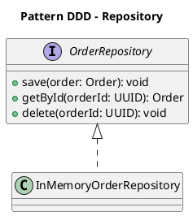

#### Exemple d'utilisation d'un **Repository**

Imaginons un domaine de **gestion des commandes** où nous avons un agrégat `Order` (commande). Un `Repository` pour cet agrégat peut offrir des méthodes pour récupérer, ajouter ou modifier des commandes.

##### Code avec un **Repository**

```python
import uuid

# Entité et agrégat
class Order:
    def __init__(self, order_id, customer_id, shipping_address):
        self.order_id = order_id
        self.customer_id = customer_id
        self.shipping_address = shipping_address
        self.items = []

    def add_item(self, product_id, quantity, price):
        item = OrderItem(product_id, quantity, price)
        self.items.append(item)

    def calculate_total(self):
        return sum(item.total_price() for item in self.items)

class OrderItem:
    def __init__(self, product_id, quantity, price):
        self.product_id = product_id
        self.quantity = quantity
        self.price = price

    def total_price(self):
        return self.quantity * self.price

# Repository pour l'agrégat Order
class OrderRepository:
    def __init__(self):
        # Simulation d'une base de données en mémoire
        self._orders = {}

    def add(self, order):
        """Ajoute une commande dans le repository."""
        self._orders[order.order_id] = order

    def get(self, order_id):
        """Récupère une commande par son ID."""
        return self._orders.get(order_id)

    def remove(self, order_id):
        """Supprime une commande."""
        if order_id in self._orders:
            del self._orders[order_id]

# Utilisation
repository = OrderRepository()
order_id = uuid.uuid4()
order = Order(order_id, "customer_123", "123 rue Exemple")
order.add_item("product_1", 2, 100)
repository.add(order)

# Récupérer une commande
retrieved_order = repository.get(order_id)
print(f"Total de la commande : {retrieved_order.calculate_total()}")
```

#### Différence entre **Repository** et **DAO (Data Access Object)**

| **Aspect**                | **Repository**                                       | **DAO**                                          |
|---------------------------|-----------------------------------------------------|--------------------------------------------------|
| **Responsabilité**         | Manipule des agrégats et des entités du domaine, tout en respectant les règles métier. | Fournit un accès direct aux données, sans se soucier des règles métier. |
| **Abstraction**            | Cache les détails de la persistance tout en maintenant la logique métier intacte. | Concentre généralement sur l'accès aux données sans logique métier. |
| **Interaction avec le domaine** | Le Repository interagit avec le domaine via des objets métiers (entités, agrégats, value objects). | Le DAO est plus focalisé sur l'accès aux données sous forme brute. |
| **Niveau d'abstraction**   | Plus haut niveau d'abstraction (logique métier + persistance). | Plus bas niveau d'abstraction (accès direct aux données). |

#### Bonnes pratiques pour les **Repositories**

1. **Utilisez un Repository pour chaque agrégat** :
   - Créez un Repository spécifique pour chaque agrégat (par exemple, `OrderRepository`, `CustomerRepository`) afin de garder les responsabilités bien définies.

2. **Ne stockez pas de détails de persistance dans le domaine** :
   - Les entités et agrégats ne doivent pas savoir comment elles sont stockées. L'accès à la persistance doit être géré par le Repository.

3. **Gardez les méthodes simples** :
   - Les méthodes du Repository doivent être simples et focalisées sur la gestion des objets. Les opérations complexes doivent être déléguées au domaine (par exemple, des calculs sur l'agrégat).

4. **Evitez les dépendances directes aux frameworks de persistance dans le domaine** :
   - Le Repository doit être découplé des frameworks de persistance spécifiques. Par exemple, utilisez une interface pour le Repository, et l'implémentation du Repository peut utiliser des outils comme des ORM ou des bibliothèques de persistance.

#### ❌ Anti-pattern : Repository qui retourne des DTOs ou des tuples

```python
def get_order(order_id):
    return (order_id, "pending", [("item1", 2), ("item2", 3)])
```

- 🔴 Problème : la couche domaine est court-circuitée, aucun modèle métier n'est reconstruit.
- ✅ À faire : retourner des entités/agrégats riches, pas des structures plates.

#### ❌ Anti-pattern : Repository couplé à l'ORM

```python
# Couche domaine
class OrderRepository:
    def __init__(self, session):
        self.session = session  # ORM spécifique (ex: SQLAlchemy)

    def save(self, order):
        self.session.add(order)

    def get_by_id(self, order_id):
        return self.session.query(Order).get(order_id)
```

- 🛑 Problème :
  - Le domaine connaît le détail d’infrastructure.
  - Impossible à tester sans base de données.
- ✅ À faire :
  - Utiliser une interface abstraite dans le domaine
	- Injecter l'implémentation.

##### Étape 1 — Interface métier (`order_repository.py`)

```python
# Domaine (indépendant)
class OrderRepository:
    def save(self, order): raise NotImplementedError
    def get_by_id(self, order_id): raise NotImplementedError
```

##### Étape 2 — Implémentation dans l'infrastructure (`sqlalchemy_order_repository.py`)

```python
# ORM infrastructure
from sqlalchemy.orm import Session
from domain.models import Order
from orm_entities import OrderModel  # modèle SQLAlchemy

class SqlAlchemyOrderRepository(OrderRepository):
    def __init__(self, session: Session):
        self.session = session

    def save(self, order: Order):
        orm_model = OrderModel.from_domain(order)
        self.session.add(orm_model)
        self.session.commit()

    def get_by_id(self, order_id):
        orm_model = self.session.query(OrderModel).get(order_id)
        return orm_model.to_domain()
```

##### Étape 3 — Mapping entre ORM et domaine (`orm_entities.py`)

```python
class OrderModel(Base):
    __tablename__ = "orders"
    id = Column(String, primary_key=True)
    customer_id = Column(String)
    status = Column(String)

    def to_domain(self):
        return Order(self.id, self.customer_id, self.status)

    @staticmethod
    def from_domain(order: Order):
        return OrderModel(
            id=order.id,
            customer_id=order.customer_id,
            status=order.status
        )
```

##### Étape 4 — Utilisation dans l'Application Service

```python
class OrderApplicationService:
    def __init__(self, repository: OrderRepository):
        self.repository = repository

    def place_order(self, customer_id):
        order = Order.create(customer_id)
        self.repository.save(order)
```

#### Cas d'utilisation avancé : Repository dans CQRS et Event Sourcing

Dans une architecture **CQRS (Command Query Responsibility Segregation)**, les **Repositories** peuvent être utilisés différemment pour la **Command Side** (écriture) et la **Query Side** (lecture). De plus, dans une architecture **Event Sourcing**, les Repositorys ne manipulent pas directement les entités ou agrégats, mais peuvent utiliser des événements pour reconstituer l'état des objets métier. Voir les sections _CQRS_ et _Event Sourcing_.

##### Exemples :

- **Command Side** : Utilisation de Repository pour stocker des événements ou agrégats dans un système de persistance événementielle.
- **Query Side** : Utilisation de Repository pour récupérer des vues de lecture optimisées, souvent dans des bases de données dédiées aux requêtes.

---

### 🧩 Module

En DDD, un **module** fait référence à une structure qui est un regroupement logique de fonctionnalités qui partagent une même responsabilité métier.

```
└── library
    ├── catalogue
    ├── commons
    │   ├── aggregates
    │   ├── commands
    │   └── events
    │       └── publisher
    └── lending
        ├── book
        │   ├── application
        │   ├── infrastructure
        │   └── model
        ├── dailysheet
        │   ├── infrastructure
        │   └── model
        ├── librarybranch
        │   └── model
        ├── patron
        │   ├── application
        │   ├── infrastructure
        │   └── model
        └── patronprofile
            ├── infrastructure
            ├── model
            └── web
```

<div class="caption">Un projet de librairie avec 2 contextes "catalogue" et "lending" et un shared kernel.</div>

#### Types de **Modules** en DDD

1. **Modules dans un Bounded Context** :
   - Un **Bounded Context** peut être considéré comme un type de module dans DDD. Il définit un domaine ou une sous-partie d'un système où un modèle de domaine particulier est appliqué, avec ses propres termes et règles métiers.
   - Exemple : Dans un système de gestion d'une bibliothèque, il pourrait y avoir des modules distincts pour la gestion des **livres**, des **membres**, et des **emprunts**, chacun ayant son propre modèle de domaine et sa logique métier.

2. **Modules dans les architectures** :
   - Les modules peuvent être implémentés à différents niveaux d'architecture, comme dans les **microservices**, les **modèles de composants**, ou les **services**. Chaque module peut correspondre à une fonctionnalité métier spécifique, comme la gestion des commandes ou des paiements.

3. **Modules de Service** :
   - En DDD, un module peut également être représenté par un **service** (par exemple, un **domain service**), qui contient des règles de logique métier complexes qui ne s'intègrent pas facilement dans une entité ou un agrégat.

#### Exemple d'un **Module** en DDD

Imaginons que nous avons un système de gestion de commandes où chaque module gère une fonctionnalité spécifique. Voici un exemple de structure de module dans un tel système :

1. **Module Commande (Order Module)** :
   - Contient tout le modèle de domaine associé à la gestion des commandes, comme les agrégats `Order`, les services associés (par exemple, `OrderService`), les événements de domaine (par exemple, `OrderPlacedEvent`), etc.

2. **Module Paiement (Payment Module)** :
   - Gère les interactions liées aux paiements, avec des entités comme `Payment`, des services de paiement, des événements de domaine comme `PaymentProcessedEvent`, etc.

##### Exemple de structure de fichiers d'un système avec des modules :
```
src/
  +-- order/
  |   - Order.py
  |   - OrderService.py
  |   - OrderRepository.py
  |   - events/
  |       - OrderPlacedEvent.py
  |       - OrderShippedEvent.py
  +-- payment/
  |   - Payment.py
  |   - PaymentService.py
  |   - PaymentRepository.py
  |   - events/
  |       - PaymentProcessedEvent.py
  |       - PaymentFailedEvent.py
  +-- shared/
  |   - Logger.py
```

Dans cette structure :
- Les modules `order` et `payment` ont leurs propres composants métier, comme les **agrégats** (`Order`, `Payment`), les **services** (`OrderService`, `PaymentService`), et les **événements de domaine**.
- Le module `shared` contient des composants qui peuvent être utilisés par plusieurs autres modules, comme le `Logger`.

#### Bonnes pratiques pour l'organisation des **Modules**

1. **Définir une responsabilité claire pour chaque module** :
   - Un module doit avoir une seule responsabilité bien définie. Cela aide à maintenir une bonne cohésion et une faible dépendance.

2. **Séparer les préoccupations** :
   - Les modules doivent être peu couplés entre eux, c'est-à-dire qu'ils ne doivent pas dépendre fortement les uns des autres, ce qui facilite la maintenance et l'extension de l'application.

3. **Utiliser des interfaces pour l'interaction entre modules** :
   - Pour garantir la flexibilité et la maintenabilité, privilégiez les interfaces et les abstractions lorsque vous permettez aux modules de communiquer entre eux.

4. **Documenter les modules** :
   - Une bonne documentation de l'interface publique de chaque module permet de faciliter son utilisation et son intégration dans différents systèmes.

---

### 🏭 Factory

Design pattern permettant de créer des objets complexes, généralement des entités ou des agrégats. Elle permet de centraliser et d'encapsuler la logique de création d'objets, afin que celle-ci ne soit pas dispersée dans tout le code. Cela simplifie la gestion de la création des objets et garantit que des règles métier et des invariants sont respectés lors de leur instantiation.

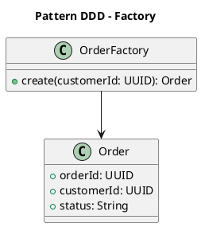

#### Avantages d'une **Factory** :

1. **Séparation des préoccupations** :
   - La création d'objets est séparée de la logique métier, ce qui permet de garder les classes et les services plus clairs et moins responsables.

2. **Simplification des tests** :
   - La Factory rend les tests unitaires plus faciles, car la création d'objets est centralisée, ce qui permet de mieux contrôler l'instanciation des objets dans les tests.

#### Exemple d'utilisation d'une **Factory**

##### Domaine : Système de commande

Imaginons que nous souhaitons créer des objets `Order` (commande), et que la création de l'objet implique des vérifications de l'état de la commande, de la validation des articles, et de l'attribution d'un identifiant unique.

##### Code avec une Factory

```python
import uuid

class Order:
    def __init__(self, order_id, customer_id, shipping_address):
        self.order_id = order_id
        self.customer_id = customer_id
        self.shipping_address = shipping_address
        self.items = []
        self.status = "created"

    def add_item(self, item):
        self.items.append(item)

    def calculate_total(self):
        return sum(item.price for item in self.items)

class OrderItem:
    def __init__(self, product_id, quantity, price):
        self.product_id = product_id
        self.quantity = quantity
        self.price = price

class OrderFactory:
    @staticmethod
    def create_order(customer_id, shipping_address):
        """Crée une nouvelle commande avec un ID unique."""
        order_id = uuid.uuid4()  # Génération d'un ID unique
        order = Order(order_id, customer_id, shipping_address)
        return order

# Sans factory, le constructeur est illisible et risque de créer des objets invalides :
order = Order(None, "", [], True, 12, "CREATED", True, None, False)
# Avec Factory :
order = OrderFactory.create_order(customer_id=42, shipping_address="mon addresse")
```

Dans cet exemple :
- `OrderFactory` est responsable de la création de nouvelles commandes (`Aggregate`).
- La logique de création inclut la génération d'un identifiant unique : `uuid.uuid4()`.
- Les **invariants** (par exemple, une commande ne peut être créée sans adresse de livraison ou client) peuvent être ajoutés dans la `Factory`.

#### Types de **Factory**

1. **Factory Method** :
   - Il s'agit d'une méthode dans une classe qui crée un objet. Cela permet de personnaliser la façon dont l'objet est créé tout en déléguant la logique de création.
   - Exemple : `OrderFactory.create_order()` dans l'exemple précédent.

2. **Abstract Factory** :
   - Il s'agit d'une **interface** ou **classe abstraite** qui déclare des méthodes pour créer une famille d'objets sans spécifier leur classe concrète.
   - Utilisée lorsque le processus de création nécessite plusieurs objets différents mais liés.
   
   Exemple :
   ```python
   class AbstractOrderFactory:
       def create_order(self, customer_id, shipping_address):
           raise NotImplementedError

   class ConcreteOrderFactory(AbstractOrderFactory):
       def create_order(self, customer_id, shipping_address):
           return Order(customer_id, shipping_address)
   ```

3. `Builder` :
   - Un `Builder` est utilisé pour créer des objets complexes de manière progressive (souvent pour des objets qui ont beaucoup d'attributs ou d'étapes de configuration).
   - Exemple : Un `OrderBuilder` pourrait être utilisé pour construire des commandes étape par étape (ajouter des articles, définir l'adresse de livraison, etc.).
   - On utilise un pattern _Fluent_ : chaque méthode du `Builder` retourne l'instance courante pour pouvoir enchaîner les étapes : `OrderBuilder().add_item(…).add_shipping_address(…)`

#### Différence entre **Factory** et **Constructeur**

| **Aspect**               | **Factory**                                      | **Constructeur**                       |
|--------------------------|--------------------------------------------------|-----------------------------------------------------|
| **But principal**         | Encapsuler la logique de création d'objets complexes. | Créer un objet, mais sans logique complexe.         |
| **Complexité**            | Gère des objets complexes, des validations, etc. | Simple instanciation d'un objet.                    |
| **Utilisation**           | Utilisé pour des objets ayant une logique métier complexe à la création (agrégats, entités). | Utilisé pour des objets simples.                    |
| **Flexibilité**           | Peut choisir quel type d'objet créer et comment. | Instancie directement l'objet sans flexibilité.     |

---

### ⚙️ Domain Service

Objet sans état qui encapsule une logique compliquée du domaine.

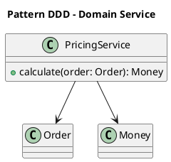

#### Caractéristiques d'un Domain Service

- **Logique métier transversale** : le `Domain Service` est utile lorsque la logique métier implique plusieurs `Entity` ou `Aggregate` et qu'elle ne peut être placée naturellement dans une seule `Entity` ou `Aggregate`.
- **Focus sur une responsabilité spécifique** : Conçu pour exécuter une tâche clairement définie.
- **Opérations stateless** : le `Domain Service` ne conserve pas d'état. Il utilise des `Entity` ou des `Values` pour exécuter sa logique.

#### Exemple de Domain Service

##### Cas : Calcul du prix total d'une commande avec des règles métier

1. Une entité `Order` contient une liste d'articles, mais le calcul du prix total dépend de règles complexes (réduction, taxes, etc.).
2. Un `Domain Service` est utilisé pour encapsuler cette logique.

##### Modèle de domaine

```python
class OrderItem:
    def __init__(self, product_id, quantity, unit_price):
        self.product_id = product_id
        self.quantity = quantity
        self.unit_price = unit_price

class Order:
    def __init__(self, items):
        self.items = items  # Liste d'OrderItem
```

##### Domain Service : Calculateur de prix

```python
class PricingService:
    def calculate_total_price(self, order):
        total = sum(item.quantity * item.unit_price for item in order.items)

        # Exemple de règles métier
        if total > 100:
            total *= 0.9  # Réduction de 10 % pour les commandes supérieures à 100

        return total
```

#### Bonnes pratiques

1. **Limitez les Domain Services à la logique métier transversale** :
   - Si une logique peut être attribuée naturellement à une entité ou un agrégat, placez-la dans celui-ci.

2. **Utilisez des noms significatifs** :
   - Le nom du service doit refléter sa responsabilité métier (ex. : `PricingService`, `TaxCalculationService`).

3. **Évitez les dépendances techniques** :
   - Un Domain Service doit être purement métier et ne doit pas interagir directement avec des détails d'infrastructure (comme une base de données ou une API).

4. **Respectez le langage ubiquitaire** :
   - Définissez les Domain Services en termes métier compréhensibles par les experts métier.

#### ❌ Anti-pattern : "God Service" (logique trop générale ou multipurpose)

```python
class OrderDomainService:
    def place_order(...): ...
    def cancel_payment(...): ...
    def calculate_shipping(...): ...
```

- 🔴 Problème : ce service contient plusieurs responsabilités métier non cohérentes → non-respect du _Single Responsibility Principle_ (SRP).
- ✅ À faire : scinder en services métier spécifiques et nommés selon leur rôle : `OrderPlacer`, `ShippingCalculator`, `RefundProcessor`.

---

### 🧭 Application Service

**Orchestrateur** entre le monde extérieur (interface utilisateur, API, etc.) et le domaine métier. Il est responsable de coordonner les opérations, de valider les entrées, et d'exécuter les commandes tout en laissant la logique métier au domaine.

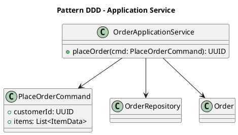

#### Rôles d'un Application Service

1. **Orchestration** :
   - Coordonne les appels aux `Entity`, aux `Aggregate` et aux `ServiceDomain`.
   - Regroupe les étapes nécessaires pour accomplir une opération métier complète.

2. **Couche anti-corruption** :
   - Traduit les données d'entrée (DTO ou commandes) en objets utilisables dans le domaine.
   - Traduit les résultats ou événements produits par le domaine en données consommables par l'extérieur.

3. **Interaction avec l'infrastructure** :
   - Gère les appels aux **repositories** pour accéder ou persister les entités.
   - Peut interagir avec des systèmes externes (via des `Adapter`).

4. **Maintien de la logique métier dans le domaine** :
   - Ne contient pas de logique métier. Cette logique reste au niveau des `Entity`, des `Aggregate` ou des `ServiceDomain`.

5. **Isolation du domaine** :
   - Protège le domaine des détails techniques ou des dépendances externes.

#### Exemple de flux avec un Application Service

##### Cas d'usage : Créer une commande

1. **Entrée** :
   - L'utilisateur soumet une requête via une API ou une interface utilisateur.
   - Un objet de commande est créé (par exemple, `CreateOrderCommand`).

2. **Application Service** :
   - Valide la commande.
   - Appelle les `Aggregate` ou `DomainService` nécessaires pour exécuter l'action.
   - Persiste les résultats dans un `Repository`.

3. **Sortie** :
   - Retourne une confirmation, un identifiant, ou un résultat au client.

#### Exemple pratique en Python

##### Commande (entrée de l'utilisateur)

```python
class CreateOrderCommand:
    def __init__(self, customer_id, items):
        self.customer_id = customer_id
        self.items = items
```

##### Application Service

```python
class OrderApplicationService:
    def __init__(self, order_repository):
        self.order_repository = order_repository

    def create_order(self, command: CreateOrderCommand):
        # Valide les données
        if not command.items:
            raise ValueError("An order must have at least one item.")

        # Crée une nouvelle commande (agrégat métier)
        order = Order(customer_id=command.customer_id, items=command.items)

        # Persiste la commande
        self.order_repository.save(order)

        return order.order_id
```

##### Interaction avec le domaine

```python
class Order:
    def __init__(self, customer_id, items):
        self.customer_id = customer_id
        self.items = items
        self.status = "created"
```

##### Appel du service

```python
# Exemple d'utilisation
order_service = OrderApplicationService(order_repository)
command = CreateOrderCommand(customer_id=123, items=["item1", "item2"])
order_id = order_service.create_order(command)
print(f"Order created with ID: {order_id}")
```

#### Différences entre Application Service et Domain Service

| **Application Service**          | **Domain Service**                    |
|----------------------------------|---------------------------------------|
| Responsable de l'orchestration.  | Responsable de la logique métier complexe qui n'appartient pas à une entité. |
| Interagit avec les API et l'infrastructure. | Agit uniquement au niveau du domaine. |
| Se situe dans la couche application. | Se situe dans la couche domaine.     |


#### ❌ Anti-pattern : logique métier dans l'Application Service

```python
class OrderAppService:
    def place_order(cmd):
        if len(cmd.items) == 0:
            raise Exception("Commande vide interdite")
        # ...
```

- 🔴 Problème : la règle métier est au mauvais endroit (logique dans l'orchestration).
- ✅ À faire : valider dans l’agrégat ou la factory, pas dans le service applicatif.

---
layout: section
---

## Patterns tactiques avancés

### 🔌 Dependency Injection

La **Dependency Injection (DI)** (ou injection de dépendances) est un modèle de conception qui permet d'injecter les dépendances nécessaires à un objet depuis l'extérieur, plutôt que de laisser l'objet créer ou rechercher lui-même ses dépendances. Cela favorise la modularité, la testabilité et la séparation des préoccupations.

:::tip
L'injection de dépendance permet d'utiliser massivement des design patterns de _Delegation_ : c'est l'une des techniques les plus utiles pour séparer le code métier des dépendances externes (souvent techniques), par exemple en _Clean Architecture_ et en _Architecture Hexagonale_ mais pas uniquement. **À utiliser massivement !**
:::

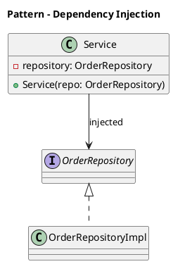

#### Principes de base :

1. **Dépendances explicites** :  
   - Une classe ne gère pas elle-même la création ou la localisation des objets dont elle dépend. Ces dépendances sont injectées, généralement via un constructeur, une méthode ou un champ.

2. **Inversion de contrôle (IoC)** :  
   - L'injection de dépendances applique le principe d'**Inversion of Control**, où la responsabilité de fournir des dépendances est transférée à un autre composant (comme un conteneur IoC).

3. **Configuration externe** :  
   - Les dépendances peuvent être configurées depuis une source externe (par exemple, un fichier de configuration, un conteneur IoC ou un framework).

#### Types d'injection :

1. **Injection par constructeur** :  
   - Les dépendances sont fournies à une classe via son constructeur.  
   - Avantage : garantit que l'objet ne peut pas être créé sans ses dépendances.

   ```java
   public class Service {
       private final Repository repository;

       public Service(Repository repository) {
           this.repository = repository;
       }
   }
   ```

2. **Injection par méthode (ou setter)** :  
   - Les dépendances sont définies via une méthode publique après la création de l'objet.  
   - Avantage : permet une flexibilité dans la configuration après l'instanciation.

   ```java
   public class Service {
       private Repository repository;

       public void setRepository(Repository repository) {
           this.repository = repository;
       }
   }
   ```

3. **Injection par champ** :  
   - Les dépendances sont directement injectées dans un champ, souvent via des annotations ou un conteneur IoC.  
   - Avantage : réduit le code boilerplate.

   ```java
   public class Service {
       @Inject
       private Repository repository;
   }
   ```

#### Lien avec le Domain-Driven Design (DDD) :

Dans un contexte **DDD**, l'injection de dépendances est particulièrement utile dans les contextes de :

1. **Services d'application** :  
   - Les services d'application nécessitent souvent des dépendances telles que des **repositories**, des **factories**, ou des **domain services**.

2. **Testabilité** :  
   - Les tests unitaires des composants DDD (entités, agrégats, services) nécessitent des doubles de test (mocks ou stubs). La DI permet d'injecter ces doubles facilement.

3. **Packaging des Bounded Context** :  
   - Dans une architecture avec plusieurs **Bounded Contexts**, chaque contexte peut avoir son propre conteneur IoC pour gérer les dépendances spécifiques.

#### Inconvénients :

1. **Complexité initiale** :  
   - L'utilisation de frameworks IoC ou de conteneurs peut introduire une courbe d'apprentissage.

2. **Dépendance aux frameworks** :  
   - L'usage excessif de conteneurs IoC peut rendre le code dépendant d'un framework spécifique.

3. **Difficulté de débogage** :  
   - Dans les systèmes complexes, il peut être difficile de suivre quelles dépendances sont injectées et d'où elles proviennent.

#### Exemple avec un conteneur IoC :

##### Exemple Spring (Java)

Ici, le framework **Spring** se charge d'injecter l'implémentation de `OrderRepository` dans `OrderService`.

```java
@Service
public class OrderService {
    private final OrderRepository orderRepository;

    @Autowired
    public OrderService(OrderRepository orderRepository) {
        this.orderRepository = orderRepository;
    }
}
```

##### Exemple Dependency Injector (Python)

Dans Python, on peut utiliser des frameworks comme `Dependency Injector` pour gérer les dépendances de manière formelle :

```sh
pip install dependency-injector
```

```python
from dependency_injector import containers, providers

class Repository:
    def fetch_data(self):
        return "Données du Repository"

class Service:
    def __init__(self, repository: Repository):
        self.repository = repository

    def process(self):
        data = self.repository.fetch_data()
        return f"Traitement des {data}"

# Définition du conteneur d'injection
class Container(containers.DeclarativeContainer):
    repository = providers.Factory(Repository)
    service = providers.Factory(Service, repository=repository)

# Création des objets via le conteneur
container = Container()
service = container.service()
print(service.process())
```

### 🧍‍♂️🔀 Split Entities (ou Entitées Séparées par Bounded Context)

Concept : **diviser une `Entity` en plusieurs entités distinctes dans différents contextes limités (_Bounded Contexts_)**, afin de mieux répondre aux exigences spécifiques de chaque contexte.

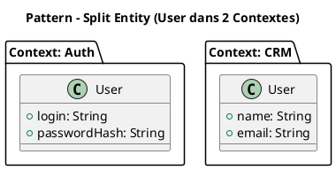

#### Pourquoi utiliser Split Entities ?

Une `Entity` peut représenter différentes choses en fonction du contexte dans lequel elle est utilisée. Si vous essayez de répondre à tous les besoins dans une seule entité, vous risquez de créer une complexité inutile ou d'introduire des contradictions.

- **Exemple classique** : Une entité `Utilisateur` dans un système.
  - Dans le **Bounded Context** de _Gestion des utilisateurs_, un utilisateur peut inclure des champs comme le mot de passe, les rôles, et les informations personnelles.
  - Dans le **Bounded Context** de _Support client_, l'utilisateur pourrait être représenté par un ensemble minimal d'informations comme le nom, l'adresse e-mail et un historique de tickets.

#### Comment gérer les Split Entities ?

1. **Ubiquitous Language** : Les entités devraient être nommées et définies en fonction du langage ubiquitaire propre à chaque contexte.
2. **Mapping et synchronisation** : Si une entité dans un contexte dépend d'une entité dans un autre, vous pouvez utiliser des mécanismes comme des événements de domaine pour synchroniser les informations.
3. **Anti-Corruption Layer (ACL)** : Si deux contextes doivent interagir fortement, une couche d'adaptation peut être utilisée pour convertir les données entre les entités.
4. **Pas de duplication** : Une entité n’est pas copiée : elle est redéfinie avec des attributs et comportements spécifiques au contexte.

:::warn
Si les besoins des différents contextes se chevauchent significativement, il n'est souvent pas utile d'utiliser de  Split Entity.
:::

---

### ⚖️ Policy (Décision métier encapsulée)

Règle métier qui décrit un **comportement** ou une **contrainte métier** applicable à un contexte spécifique (_Bounded Context_). Elle est **déclarative** : elle exprime *quoi* faire plutôt que *comment* le faire.

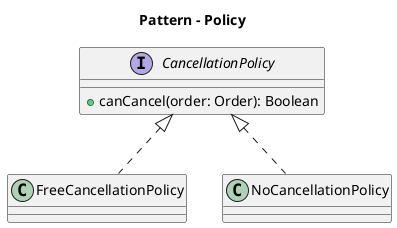

#### Où place-t-on une policy ?

Dans l'implémentation d'un modèle DDD, une policy peut :

- Être codée comme une méthode ou une fonction métier dans un `Aggregate`, une `Entity` ou un `Domain Service`.
- Être représentée en tant qu'objet indépendant si elle est complexe, sous la forme d'une `Policy Object`.

#### Exemple de **policy**

> Un utilisateur ne peut réserver qu'une seule fois pour le même créneau horaire.
  
Cette règle peut être exprimée dans le modèle métier pour être respectée par le système.

```python
class ReservationPolicy:
    def __init__(self, reservation_repository):
        self.reservation_repository = reservation_repository

    def can_reserve(self, user_id, timeslot):
        # Vérifie si l'utilisateur a déjà réservé pour ce créneau horaire
        existing_reservation = self.reservation_repository \
                              .find_by_user_and_timeslot(user_id, timeslot)
        return existing_reservation is None
```

Ici, `ReservationPolicy` encapsule une règle métier et peut être utilisée par d'autres composants du système pour valider les actions.

#### ❌ Anti-pattern : if/else hardcodé au lieu d’une Policy interchangeable

```python
if user.type == "premium":
    can_cancel = True
else:
    can_cancel = False
```

- ✅ À faire : définir une interface `CancellationPolicy` et injecter la stratégie.

---

### 🔐 Invariant (métier protégé dans l'aggrégat)

Un **invariant** fait référence à une **règle métier** ou une **contrainte** qui doit toujours être vraie pour garantir la cohérence et l'intégrité du modèle de domaine, indépendamment des actions effectuées dans le système. Ces règles sont cruciales pour maintenir l'intégrité du domaine tout au long du cycle de vie des entités et agrégats.

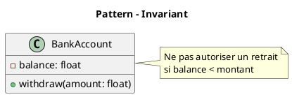

#### Caractéristiques d'un **Invariant**

1. **Immuabilité** :
   - Les invariants doivent toujours être respectés. Ils ne peuvent être violés ou modifiés en cours d'exécution sans compromettre la validité du système.

2. **Garantie de cohérence** :
   - Ils garantissent que le modèle de domaine reste valide à tout moment. Par exemple, un agrégat peut avoir un invariant qui stipule qu'une commande ne peut pas être livrée avant qu'un paiement ait été effectué.

3. **Applicabilité au domaine** :
   - Les invariants sont généralement spécifiques au domaine métier. Ils sont souvent définis au niveau des **agrégats** ou des **entités** pour assurer que leurs états internes sont toujours valides.

4. **Contrôles au moment de l'exécution** :
   - Les invariants sont souvent vérifiés par des méthodes dans les entités ou agrégats pour s'assurer qu'ils ne sont pas violés lorsqu'une opération est effectuée.

#### Exemples d'**Invariants** en DDD

1. **Invariant de l'agrégat `Order`** :
   - Une commande (`Order`) ne peut être validée que si **tous** les articles sont disponibles en stock et que le paiement a été effectué.
   - **Règle** : `Order.itemsAvailable() && Order.paymentComplete() == true`.

2. **Invariant de l'agrégat `BankAccount`** :
   - Un compte bancaire ne peut pas avoir un solde inférieur à zéro, sauf si une autorisation spécifique existe pour des découverts.
   - **Règle** : `BankAccount.balance >= 0` (ou une exception est lancée si le solde devient négatif sans autorisation).

3. **Invariant sur une **Date de naissance** d'une personne** :
   - Une personne doit avoir une date de naissance antérieure à la date actuelle.
   - **Règle** : `Person.birthdate <= today`.

#### Types d'**Invariants**

1. **Invariants d'entité** :
   - Ces invariants sont propres aux entités et garantissent que leur état interne est valide. Par exemple, un **Produit** ne peut pas avoir un prix négatif.

2. **Invariants d'agrégat** :
   - Un agrégat est une collection d'entités et de valeurs objets qui forment une unité de cohérence transactionnelle. Les invariants d'agrégat garantissent que l'ensemble de l'agrégat est cohérent. Par exemple, dans un **agrégat de commande**, un invariant pourrait garantir que **le total de la commande est la somme de ses articles**.

3. **Invariants de domaine** :
   - Ces invariants concernent l'ensemble du modèle de domaine. Par exemple, dans une application de gestion de bibliothèque, un **livre ne peut être emprunté que si un membre est inscrit**.

#### Mise en œuvre des **Invariants** en DDD

Dans DDD, les invariants sont souvent vérifiés à des points clés du cycle de vie des objets métier (par exemple, lors de la création, de la mise à jour ou de la suppression). Voici quelques bonnes pratiques pour les gérer efficacement :

1. **Validation dans les méthodes de l'agrégat** :
   - Les méthodes des agrégats doivent valider les invariants chaque fois qu'une modification importante est effectuée. Par exemple, un **agrégat `Order`** pourrait valider que les articles sont en stock et que le paiement est complet avant de finaliser la commande.

2. **Exceptions en cas de violation** :
   - Lorsqu'un invariant est violé, une **exception** est généralement lancée. Cela permet de signaler immédiatement un état incorrect et de prévenir la persistance de données erronées.

3. **Utilisation des **Domain Services** pour des invariants complexes** :
   - Si un invariant nécessite de vérifier plusieurs entités ou d'autres agrégats, il peut être géré par un **domain service**. Par exemple, un service pourrait valider qu'un produit est toujours en stock avant de finaliser une commande.

4. **Validation au moment de la commande (avant persistance)** :
   - Dans les architectures **CQRS** ou **Event Sourcing**, les invariants doivent être validés au moment où la commande est émise, avant qu'elle ne soit persistée.

#### Exemple de gestion d'invariant

Imaginons un système où un agrégat `Order` possède un invariant qui garantit que le montant total de la commande ne peut pas être inférieur à zéro.

```python
class Order:
    def __init__(self, order_id, customer_id, items):
        self.order_id = order_id
        self.customer_id = customer_id
        self.items = items  # Liste de tuples (product_id, price, quantity)
    
    def total_amount(self):
        return sum(item[1] * item[2] for item in self.items)
    
    def validate_invariant(self):
        if self.total_amount() < 0:
            raise ValueError("Le montant total de la commande ne peut pas être négatif.")
    
    def place_order(self):
        self.validate_invariant()
        # Logique de création de commande
        print("Commande passée avec succès.")
        
# Exemple d'usage
order = Order(
    order_id=1,
    customer_id=123,
    items=[("product_1", 100, 2), ("product_2", 50, -1)]
)
try:
    order.place_order()
except ValueError as e:
    print(f"Erreur : {e}")
```

Dans cet exemple, la méthode `validate_invariant` vérifie que le montant total de la commande n'est pas négatif avant de passer la commande. Si l'invariant est violé, une exception est levée.

#### ❌ Anti-pattern : laisser violer les règles métier par modification directe

```python
account.balance = -100  # oups
```

- 🔴 Problème :
  - L'invariant `balance >= 0` est violé.
- ✅ À faire :
  - Encapsuler l'état
  - Faire les mutations via méthodes contrôlées : `withdraw(amount)`.

---

###  📜 Specification Pattern

Modèle de conception utilisé pour encapsuler des règles ou des critères métier dans un objet réutilisable, combinable et testable. Ce modèle permet de définir des spécifications sous forme d'objets, qui peuvent être utilisés pour valider, filtrer ou décider si un objet ou une entité satisfait à un ensemble de conditions. 

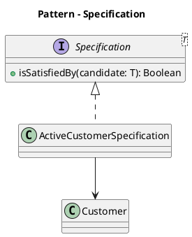

#### Caractéristiques principales du **Specification Pattern** :

1. **Encapsulation des règles métier** :  
   - Les règles métier, qui pourraient autrement être dispersées dans le code, sont regroupées dans des objets spécifiques. Cela facilite leur gestion, leur compréhension et leur modification.

2. **Composabilité** :  
   - Les spécifications peuvent être combinées logiquement (par exemple, **ET**, **OU**, **NON**) pour former des règles complexes. Cela permet de construire des critères dynamiques ou évolutifs.

3. **Réutilisabilité** :  
   - Une fois définies, les spécifications peuvent être réutilisées dans différents contextes, comme les validations, les filtres ou les requêtes.

4. **Testabilité** :  
   - Les spécifications étant des objets isolés, elles peuvent être facilement testées de manière unitaire pour s'assurer que leurs règles sont correctement implémentées.

#### Structure typique :

Le **Specification Pattern** comprend généralement :

1. **Interface de spécification** :
   - Une interface (ou une classe abstraite) définissant une méthode pour vérifier si une entité satisfait à la spécification (souvent appelée `IsSatisfiedBy`).

   ```python
   class Specification:
       def is_satisfied_by(self, entity):
           pass
   ```

2. **Spécifications concrètes** :
   - Des classes implémentant cette interface pour encapsuler une règle ou un critère spécifique.

   ```python
   class HasDiscount(Specification):
       def is_satisfied_by(self, entity):
           return entity.has_discount()

   class IsEligibleForPromotion(Specification):
       def is_satisfied_by(self, entity):
           return entity.purchase_amount > 100
   ```

3. **Combinaison logique** :
   - Des classes ou des opérateurs permettant de combiner des spécifications (par exemple, `AndSpecification`, `OrSpecification`, `NotSpecification`).

   ```python
   class AndSpecification(Specification):
       def __init__(self, spec1, spec2):
           self.spec1 = spec1
           self.spec2 = spec2

       def is_satisfied_by(self, entity):
           return self.spec1.is_satisfied_by(entity) \
              and self.spec2.is_satisfied_by(entity)
   
   class OrSpecification(Specification):
       def __init__(self, spec1, spec2):
           self.spec1 = spec1
           self.spec2 = spec2

       def is_satisfied_by(self, entity):
           return self.spec1.is_satisfied_by(entity) \
               or self.spec2.is_satisfied_by(entity)
   
   class NotSpecification(Specification):
       def __init__(self, spec):
           self.spec = spec

       def is_satisfied_by(self, entity):
           return not self.spec.is_satisfied_by(entity)
   ```

#### Exemple dans le domaine DDD :

Supposons un domaine où l'on gère des **commandes**. Une règle métier pourrait être de valider qu'une commande est éligible pour une promotion uniquement si :

1. La commande dépasse un montant minimal.
2. La commande a été passée par un client premium.

Avec le **Specification Pattern**, cela pourrait être implémenté comme suit :

1. **Spécifications concrètes** :
   - `HasSufficientPurchaseAmount` : vérifie si la commande dépasse le montant minimal.
   - `IsLoyalCustomer` : vérifie si le client est premium.

   ```python
   class IsLoyalCustomer(Specification):
       def is_satisfied_by(self, entity):
           return entity.is_loyal_customer()

   class HasSufficientPurchaseAmount(Specification):
       def is_satisfied_by(self, entity):
           return entity.purchase_amount >= 100
   ```

2. **Combinaison** :
   - Une spécification combinée `EligibleForPromotionSpecification` est créée en utilisant l'opération logique **ET** sur les deux spécifications.

   ```python
   loyal_and_high_spending = AndSpecification(
       IsLoyalCustomer(), 
       HasSufficientPurchaseAmount()
   )
   ```

3. **Check eligibility**:

   ```python
   customer = Customer(purchase_amount=150, loyal=True)
   print(loyal_and_high_spending.is_satisfied_by(customer))  # True
   ```

#### ❌ Anti-pattern : Règle codée dans tous les appels

```python
if customer.status == "active" and not customer.is_blacklisted():
```

- 🛑 Problème :
  - Duplications partout.
  - Aucun test unitaire sur cette règle.
- ✅ À faire :
  - Créer une `IsEligibleCustomerSpecification`.

---

### 🔁 CQRS : Command Query Responsibility Segregation

Modèle architectural utilisé pour séparer les responsabilités de lecture (`Query`) et d'écriture (`Command`) dans un système.

:::tip
Cette séparation améliore la flexibilité, la scalabilité et parfois la simplicité des systèmes complexes, notamment ceux avec de fortes contraintes métier.
:::

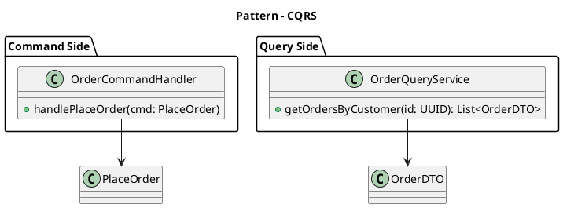

#### Principe du CQRS

Le modèle repose sur l'idée que les **commandes** (modifications de l'état du système) et les **requêtes** (lecture des données) sont des préoccupations fondamentalement différentes et qu'elles peuvent être gérées par des modèles distincts :

1. **Command** (*Commande*) : Modifie l'état du système.
   - Exemple : "Créer une commande", "Mettre à jour le profil utilisateur".
   - Elle déclenche une action métier qui peut inclure des validations et des processus complexes.

2. **Query** (*Requête*) : Lit les données sans les modifier.
   - Exemple : "Afficher la liste des commandes passées".
   - Elle se concentre uniquement sur la récupération des données optimisée pour la consommation.

#### Architecture CQRS

Dans une architecture CQRS typique, on distingue deux modèles :

1. **Modèle d'écriture (Command model)** :
   - Gère les modifications d'état.
   - Peut être structuré autour de principes comme les *Aggregates* du DDD pour garantir la cohérence métier.
   - Exemple : Une API qui reçoit une commande "Créer une réservation".

2. **Modèle de lecture (Query model)** :
   - Optimisé pour la récupération des données.
   - Peut utiliser des bases de données ou des structures de données différentes pour répondre efficacement aux besoins des requêtes.
   - Exemple : Une base indexée pour des recherches rapides.

#### Avantages du CQRS

1. **Scalabilité** :
   - Les lectures et les écritures peuvent être mises à l'échelle indépendamment, répondant ainsi aux différents besoins de performance.

2. **Optimisation** :

   - Le modèle de lecture peut être conçu spécifiquement pour les requêtes (rapides et orientées utilisateur), sans avoir à se conformer aux règles complexes de l'écriture.

3. **Flexibilité métier** :

   - Les règles complexes de validation et de mise à jour peuvent être isolées dans le modèle d'écriture, ce qui rend le modèle plus clair.

4. **Support du Event Sourcing** (facultatif) :

   - Le CQRS s'intègre bien avec l'**Event Sourcing**, où chaque changement d'état est représenté par un événement immuable.

#### Inconvénients du CQRS

1. **Complexité accrue** :

   - Nécessite de gérer deux modèles distincts et parfois deux bases de données différentes.
   - Implémenter et maintenir une synchronisation entre les deux modèles peut être difficile.

2. **Latence de propagation** :

   - Les mises à jour sur le modèle d'écriture doivent être propagées au modèle de lecture, introduisant une éventuelle latence.

#### Exemple de CQRS en pratique

##### Commande (écriture)
```python
class CreateOrderCommand:
    def __init__(self, order_id, customer_id, items):
        self.order_id = order_id
        self.customer_id = customer_id
        self.items = items

class OrderCommandHandler:
    def handle(self, command: CreateOrderCommand):
        # Applique la logique métier pour créer une commande
        order = Order(command.order_id, command.customer_id, command.items)
        order_repository.save(order)
```

##### Requête (lecture)
```python
class OrderQueryService:
    def __init__(self, query_database):
        self.query_database = query_database

    def get_order_by_id(self, order_id):
        # Récupère une commande optimisée pour la lecture
        return self.query_database.find_order(order_id)
```

---

### 📣 Domain Event

Représente un événement **immuable** et **significatif** qui s'est produit dans le domaine métier, et il est généralement utilisé pour signaler qu'un changement d'état ou une action importante a eu lieu.

Les `Domain Events` sont généralement générés par des `Entity`, des `Aggregate` ou des `Domain Service` en réponse à des actions ou à des commandes.

Les Domain Events sont idéaux pour les architectures orientées événements (_Event-Driven Architecture_).

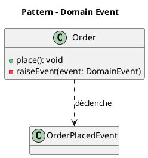

#### Exemple de Domain Event

##### Définition de l'événement

```python
class OrderCreatedEvent:
    def __init__(self, order_id, customer_id, items):
        self.order_id = order_id
        self.customer_id = customer_id
        self.items = items
        self.occurred_on = datetime.utcnow()  # Date de l'événement
```

##### Émission de l'événement depuis un Aggregate

```python
class Order:
    def __init__(self, order_id, customer_id, items):
        self.order_id = order_id
        self.customer_id = customer_id
        self.items = items
        self.status = "created"
        self.events = []

    def create(self):
        # Logique métier
        self.events.append(
            OrderCreatedEvent(self.order_id, self.customer_id, self.items)
        )
```

##### Réaction à l'événement

Un service ou un listener peut réagir à cet événement :

```python
class OrderEventHandler:
    def handle(self, event: OrderCreatedEvent):
        print(f"Order created: {event.order_id} for customer {event.customer_id}")
        # Autres actions comme envoyer un e-mail ou mettre à jour un modèle de lecture
```

#### Bonnes pratiques

1. **Ne pas abuser des Domain Events** :
   - N'émettez pas d'événements pour chaque petite action, concentrez-vous sur les événements significatifs.

2. **Respectez le langage ubiquitaire** :
   - Les noms des événements et leur contenu doivent être compréhensibles par les experts métier.

3. **Gestion des événements asynchrones** :
   - Si les Domain Events sont propagés de manière asynchrone, gérez les erreurs et les garanties de livraison (au moins une fois, exactement une fois, etc.).

4. **Versionnement des événements** :
   - Si les exigences changent, gérez les différentes versions des événements.

#### ❌ Anti-pattern : Domain Event utilisé comme message technique

```python
class OrderInsertedToDbEvent:
	    # ...
```

- 🔴 Problème : ce n'est pas un fait métier, mais une opération technique → confusion avec Event technique ou audit.
- ✅ À faire : un _DomainEvent_ doit refléter un changement métier : `OrderPlacedEvent`, `UserRegisteredEvent`.

---

### 🕰️ Cohérence Éventuelle (Eventual Consistency)

Principe utilisé dans les systèmes distribués où il est acceptable que les différentes parties du système ne soient pas immédiatement synchronisées, tant qu'elles finissent par atteindre un état cohérent après un certain délai. Cela contraste avec la cohérence forte, où toutes les parties du système doivent être synchronisées immédiatement.

:::tip
Dans le contexte du DDD, la cohérence éventuelle est particulièrement pertinente lorsque les différents _Bounded Context_ d'un système ont leurs propres modèles et bases de données. La cohérence éventuelle permet à ces contextes de communiquer via des événements, sans nécessiter une synchronisation immédiate.
:::

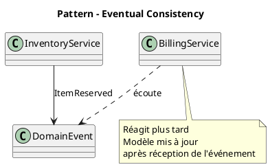

#### Caractéristiques principales :

1. **Délais de propagation** :  
   - Les mises à jour ou les changements effectués sur une partie du système sont propagés de manière asynchrone aux autres parties. Cela peut entraîner un laps de temps pendant lequel différentes parties ont des états incohérents.

2. **Synchronisation finale** :  
   - Après un certain délai (variable en fonction des systèmes et des charges), toutes les parties du système convergent vers le même état cohérent.

3. **Échange asynchrone** :  
   - Les messages ou événements sont échangés de manière asynchrone entre les composants, ce qui améliore la résilience et la scalabilité.

---

#### Exemple pratique : 

Supposons un système de commerce électronique avec deux contextes limités :

1. **Gestion des commandes** (Order Management).  
2. **Gestion des stocks** (Inventory Management).  

Lorsqu'une commande est passée :  
- Le contexte **Gestion des commandes** enregistre la commande et publie un **Domain Event** "Commande créée".  
- Le contexte **Gestion des stocks** reçoit cet événement et ajuste le stock correspondant.  

Pendant un court moment, l'état de la commande et l'état du stock peuvent ne pas être cohérents (la commande est enregistrée mais le stock n'est pas encore mis à jour). Cependant, après un certain délai, les deux contextes atteindront un état cohérent.

---

### 🧾 Event Sourcing

Modèle architectural où l'état d'une application ou d'un domaine n'est pas stocké directement, mais reconstruit à partir d'une série d'événements immuables. Ces événements représentent chaque changement survenu dans le système.

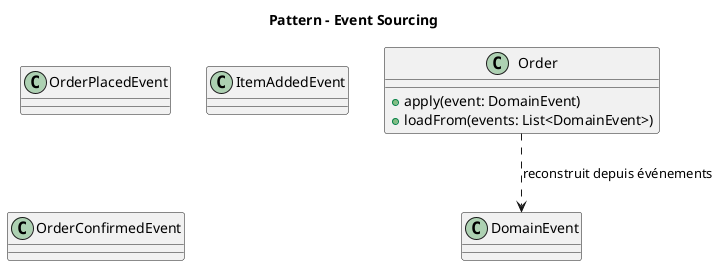

#### Principe de l'Event Sourcing

1. **Événements immuables** : 
   - Chaque modification d'état est capturée sous forme d'un événement spécifique (par exemple : "Commande créée", "Article ajouté au panier").
   - Les événements sont enregistrés de manière immuable dans un **Event Store**.

2. **Reconstruction de l'état** : 
   - L'état actuel d'un objet (comme un `Aggregate`) est recréé en rejouant tous les événements associés à cet objet depuis le début.

3. **Source unique de vérité** : 
   - Les événements sont la seule source de vérité et permettent une traçabilité complète des modifications.

#### Exemple simplifié d'Event Sourcing

##### Enregistrement d'un événement :

```python
event_store.append("order-123", {
    "event_type": "OrderCreated",
     "data": {"order_id": "123", "customer_id": "456"}
    }
)
```

##### Relecture des événements pour reconstruire un état :
```python
events = event_store.get_events("order-123")
order = replay(events)  # Recrée l'état de la commande à partir des événements
```

#### Avantages de l'Event Sourcing

1. **Traçabilité complète** :
   - Chaque événement étant enregistré, il est facile de comprendre ce qui s'est passé dans le passé.

2. **Auditabilité** :
   - Les événements fournissent un historique détaillé des actions pour des audits ou des analyses.

3. **Flexibilité pour reconstruire l'état** :
   - Vous pouvez reconstruire le modèle métier tel qu'il était à un moment donné.

4. **Support des systèmes réactifs** :
   - Les événements sont des déclencheurs naturels pour d'autres processus ou services.

#### Défis de l'Event Sourcing

1. **Complexité accrue** :
   - Rejouer les événements pour reconstruire l'état peut être coûteux sans optimisations (comme des _snapshots_).

2. **Évolution des schémas d'événements** :
   - La gestion des changements dans la structure des événements (_versioning_) peut être difficile.

3. **Latence** :
   - Reconstituer l'état à partir de nombreux événements peut introduire des retards.

#### Lien entre Event Sourcing et CQRS

**Event Sourcing et CQRS se complètent bien**, mais ils sont indépendants. Voici leur relation :

1. **Modèle d'écriture dans CQRS avec Event Sourcing** :
   - Dans le **modèle d'écriture** du CQRS, les commandes modifient l'état en générant des événements.
   - Ces événements sont enregistrés dans un Event Store.

2. **Propagation vers le modèle de lecture** :
   - Les événements générés dans le modèle d'écriture sont utilisés pour mettre à jour le **modèle de lecture** dans CQRS.
   - Cela permet de synchroniser les deux modèles.

3. **Découplage naturel** :
   - Les événements servent de pont entre le modèle d'écriture et le modèle de lecture, facilitant leur découplage.

#### Exemple intégrant Event Sourcing et CQRS

##### Modèle d'écriture (Command -> Event)

```python
class CreateOrderCommandHandler:
    def handle(self, command: CreateOrderCommand):
        event = OrderCreatedEvent(
            order_id=command.order_id,
            customer_id=command.customer_id
        )
        event_store.append(event)
```

##### Propagation vers le modèle de lecture (Event -> Projection)

```python
class OrderProjectionUpdater:
    def on_event(self, event: OrderCreatedEvent):
        if event.type == "OrderCreated":
            query_database.save({
                "order_id": event.data["order_id"],
                "customer_id": event.data["customer_id"]
            })
```

---

### 🧩 Saga

Modèle de conception utilisé pour gérer des processus métier ou transactions complexes et de longue durée impliquant plusieurs services ou agrégats.

:::tip
Le pattern Saga est particulièrement utile dans les systèmes distribués et pour garantir la **cohérence éventuelle**, lorsque plusieurs services ou composants doivent participer à un processus métier sans pouvoir s'appuyer sur des transactions _ACID_ traditionnelles à l'échelle du système.
:::

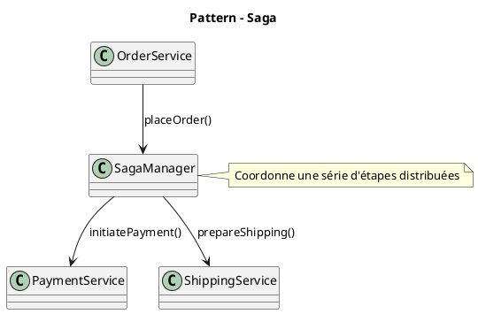

#### Caractéristiques clés d'une **Saga** :

1. **Processus de longue durée** :  
   - Une Saga représente un processus métier complexe et de longue durée qui ne peut pas être complété en une seule transaction. Elle implique plusieurs étapes qui peuvent s'étendre sur différents services, agrégats ou systèmes externes.

2. **Cohérence éventuelle** :  
   - Les Sagas reposent sur le principe de la **cohérence éventuelle**. Chaque étape d'une Saga se termine généralement de manière asynchrone, et le processus global garantit la cohérence sur le temps, plutôt qu'immédiatement.

3. **Transactions distribuées** :  
   - Une Saga gère les transactions distribuées à travers plusieurs services ou agrégats. Elle coordonne chaque étape pour s'assurer que le processus métier complet réussit ou qu'une compensation est effectuée en cas d'échec.

4. **Actions compensatoires** :  
   - Si une étape de la Saga échoue, des actions compensatoires sont déclenchées pour annuler les étapes précédentes ou gérer l'échec de manière à garantir que le système reste cohérent.  
   - Par exemple, si un service de paiement échoue après l'envoi d'un produit, la Saga peut annuler l'expédition ou rembourser le paiement.

5. **Découplage et approche pilotée par événements** :  
   - Les Sagas sont souvent basées sur des événements. Chaque service participant émet des événements, et la Saga réagit à ces événements pour déterminer l'action suivante.  
   - Les Sagas peuvent être **chorégraphiées** (chaque service connaît l'étape suivante et déclenche l'action suivante) ou **orchestrées** (un composant central ou orchestrateur gère la séquence des actions).

#### Types de **Sagas** :

1. **Saga chorégraphiée** :  
   - Dans une Saga chorégraphiée, chaque service ou composant impliqué dans le processus connaît la prochaine étape à suivre. Chaque service écoute les événements et déclenche des actions basées sur ces événements.  
   - Il n'y a pas de coordinateur central ; la chorégraphie est décentralisée et les services communiquent par événements.

2. **Saga orchestrée** :  
   - Dans une Saga orchestrée, un **orchestrateur** central contrôle le déroulement du processus. L'orchestrateur envoie des commandes aux services et attend des réponses ou des événements avant de passer à l'étape suivante.  
   - L'orchestrateur est responsable de la gestion de l'ensemble du processus et s'assure que les étapes sont exécutées dans le bon ordre.

#### Cas d'utilisation typiques des **Sagas** :

1. **Traitement des commandes** :  
   - Dans un système de commerce électronique, lorsqu'une commande est passée, le système doit :  
     1. Réserver le stock.  
     2. Traiter le paiement.  
     3. Expédier le produit.  
     4. Notifier le client.  
   - Si une étape échoue (par exemple, le paiement échoue), la Saga compense en annulant les étapes précédentes, comme le remboursement ou la libération du stock.

2. **Réservation de vols** :  
   - Lorsqu'on réserve un vol, le système doit :  
     1. Réserver le vol.  
     2. Facturer le client.  
     3. Émettre une carte d'embarquement.  
   - Si le paiement échoue, la Saga peut annuler la réservation du vol ou invalider la carte d'embarquement.

3. **Approbation de prêts** :  
   - Un processus d'approbation de prêt pourrait inclure :  
     1. Vérification du score de crédit du demandeur.  
     2. Vérification de l'emploi.  
     3. Finalisation du contrat de prêt.  
   - Si une vérification échoue, la Saga peut annuler les approbations précédentes ou informer le demandeur.

#### Défis du modèle **Saga** :

1. **Complexité** :
   - Mettre en œuvre et gérer des Sagas peut être complexe, notamment pour gérer les compensations et s'assurer que toutes les étapes sont correctement coordonnées entre les services.

2. **Cohérence éventuelle** :
   - La cohérence éventuelle peut entraîner des incohérences temporaires dans le système. Bien que le système atteigne finalement un état cohérent, il peut ne pas être pleinement cohérent à tout moment.

3. **Gestion des compensations** :
   - Concevoir et implémenter la logique de compensation peut être difficile. Déterminer les actions compensatoires correctes pour chaque étape nécessite une réflexion approfondie, et certaines actions peuvent ne pas avoir de compensation simple.

4. **Gestion des états** :
   - Gérer l'état d'une Saga, en particulier entre plusieurs services, peut être un défi. Assurer que l'état est correctement stocké et synchronisé ajoute de la complexité, notamment lorsque la Saga s'étend sur de longues périodes.

#### Exemple d'une Saga en action :

##### Traitement des commandes dans un système de commerce électronique :

1. **Commande passée** (Événement) → La Saga commence.
2. **Réservation du stock** (Action) : Le service réserve les produits en entrepôt.
   - Si le stock n'est pas disponible, une **action compensatoire** est déclenchée pour annuler la commande.
3. **Traitement du paiement** (Action) : Le service traite le paiement pour la commande.
   - Si le paiement échoue, une **action compensatoire** peut être déclenchée pour annuler la réservation du stock.
4. **Expédition du produit** (Action) : Une fois le paiement confirmé, le produit est expédié.
   - Si l'expédition échoue, la Saga compense en déclenchant des actions pour annuler le paiement et la réservation du stock.
5. **Notification au client** (Action) : Une fois le produit expédié, le client est notifié.
   - Si une étape échoue, la Saga s'assure que des actions compensatoires sont déclenchées pour gérer ou annuler les étapes précédentes.

---

### 🔄 Process Manager

Modèle de conception utilisé pour coordonner des processus métier complexes qui impliquent plusieurs services ou agrégats. Il agit comme un orchestrateur central qui gère le déroulement d'un workflow en envoyant des commandes et en réagissant aux événements.

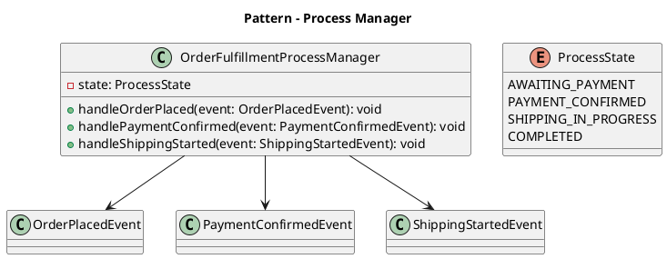

#### Caractéristiques principales du **Process Manager** :

1. **Orchestration centralisée** :  
   - Contrairement à une approche décentralisée où chaque service ou composant sait ce qu'il doit faire, le Process Manager centralise la logique du workflow.  
   - Il décide quelles commandes envoyer ou quelles actions entreprendre en fonction des événements qu'il reçoit.

2. **Coordination de multiples services** :  
   - Il est souvent utilisé dans des systèmes distribués pour coordonner des actions entre plusieurs services ou agrégats, garantissant que le processus global respecte les règles métier. Par exemple dans des architectures de microservices, où chaque service est responsable d'une partie du workflow, le Process Manager coordonne les services pour garantir un processus global cohérent.

#### Structure d'un **Process Manager** :

Un Process Manager est généralement structuré en plusieurs parties clés :

1. **Listener d'Events** :  
   - Il s'abonne aux événements émis par d'autres parties du système (par exemple, des agrégats, des services ou des modules). Ces événements déclenchent des actions spécifiques dans le Process Manager.

2. **Suivi de l'état** :  
   - Le Process Manager conserve un état interne pour suivre la progression du workflow. Cet état peut inclure des informations comme l'étape actuelle, les événements déjà traités et les prochaines étapes à exécuter.

3. **Logique métier** :  
   - Il contient les règles métier qui définissent comment réagir aux événements et quelles commandes envoyer en réponse.

4. **Émetteur de commandes** :  
   - Le Process Manager envoie des commandes aux services ou agrégats concernés pour initier des actions spécifiques (par exemple, "réserver un stock" ou "déclencher un paiement").

5. **Gestion des erreurs** :  
   - Il inclut une logique pour gérer les échecs ou les exceptions, comme la reprise d'un processus ou l'annulation d'actions précédentes en cas de problème.

6. **Journalisation et audit** :  
   - Les actions et les transitions d'état sont souvent journalisées pour permettre un suivi et une traçabilité des processus métier.

#### Exemple de fonctionnement :

Prenons l'exemple d'un système de commande dans un site e-commerce. Le processus métier pour traiter une commande peut inclure plusieurs étapes :  

1. Réserver le stock.  
2. Traiter le paiement.  
3. Organiser l'expédition.  
4. Notifier le client.  

Le Process Manager pourrait fonctionner ainsi :  

##### Flux du Process Manager :

Le flux typique d'un **Process Manager** fonctionne comme suit :

1. **Commande passée** (événement) → Le Process Manager démarre.  
2. **Réservation du stock** (commande) : Le Process Manager envoie une commande au service d'inventaire pour réserver le stock.  
3. **Événement de succès de la réservation** : Une fois que l'inventaire confirme la réservation, le Process Manager envoie une commande au service de paiement pour traiter le paiement.  
4. **Événement de succès du paiement** : Une fois le paiement réussi, le Process Manager envoie une commande au service de livraison pour expédier le produit.  
5. **Événement de confirmation d'expédition** : Le Process Manager termine le processus et envoie une notification au client.
6. **Gestion des erreurs ou exceptions** : Si une erreur survient, le Process Manager décide des actions compensatoires nécessaires (par exemple, annuler une réservation de stock en cas d'échec du paiement).

Si une étape échoue, comme un paiement refusé, le Process Manager peut entreprendre des actions de compensation, comme libérer le stock réservé.

#### Avantages du **Process Manager** :

1. **Centralisation de la logique métier** :  
   - La logique du workflow est centralisée dans un composant unique, ce qui la rend plus facile à comprendre, à tester et à modifier.

2. **Gestion explicite de l'état** :  
   - Le Process Manager suit explicitement l'état du processus, ce qui permet une meilleure visibilité sur la progression et facilite la gestion des erreurs.

3. **Flexibilité** :  
   - Les workflows peuvent être facilement modifiés ou étendus en mettant à jour le Process Manager sans affecter les services participants.

4. **Cohérence** :  
   - Le Process Manager s'assure que toutes les étapes du processus sont exécutées correctement et dans le bon ordre.

#### Défis et inconvénients :

1. **Composant critique** :
   - Le Process Manager est un élément centralisé qui peut devenir un point unique de défaillance.

2. **Risque de surcharge** :  
   - Peut devenir un goulot d'étranglement s'il n'est pas bien conçu.

3. **Complexité accrue** :  
   - La gestion explicite des états et des transitions peut introduire une complexité supplémentaire, en particulier dans des workflows très dynamiques.

4. **Dépendance vis-à-vis d'événements** :  
   - Le Process Manager repose sur une communication fiable par événements et commandes. Toute perte ou délai dans le traitement des événements peut affecter le fonctionnement du workflow.

#### Différence entre **Process Manager** et **Saga** :

Bien que les deux soient utilisés pour coordonner des workflows ou des transactions distribuées, ils diffèrent dans leur approche :  

- **Process Manager** :  
  - Centralisé.  
  - Suit explicitement l'état du processus.  
  - Orchestration via des commandes et des événements.

- **Saga** :  
  - Décentralisée (sauf dans le cas d'une Saga orchestrée).  
  - Chaque participant gère son propre état et sait comment réagir.  
  - Coordination souvent basée sur des événements.

---

## 🤓 Récapitulatif

| Pattern              | Rôle principal                                               | Caractéristiques clés                               | Exemple typique                      |
|----------------------|--------------------------------------------------------------|-----------------------------------------------------|--------------------------------------|
| **Entity**           | Représente un concept métier avec **identité**              | Mutable, ID unique, encapsule données + comportements | `Order`, `Customer`, `BankAccount`   |
| **Value Object**     | Représente une **valeur métier sans identité**              | Immuable, égalité par valeur, règles de validation   | `Money`, `Address`, `DateRange`      |
| **Aggregate**        | Groupe cohérent d'`Entity`/`VO` avec **règles métier fortes**| Racine unique, cohérence transactionnelle           | `Order` contenant `OrderItem`        |
| **Repository**       | Interface pour accéder aux **agrégats**                     | Abstraction de la persistance, basé sur l'ID         | `OrderRepository`                    |
| **Factory**          | Centralise la **création d’objets complexes**               | Crée des entités/agrégats valides dès l'instanciation| `OrderFactory.create(customer, ...)` |
| **Domain Service**   | Contient la **logique métier transversale**                 | Stateless, agit sur plusieurs entités                | `PricingService`, `TaxCalculator`    |
| **Application Service** | Orchestration métier **hors du domaine**                 | Coordonne services, agrégats, repos. Pas de logique métier | `PlaceOrderService`, `CreateUser`    |
| **Policy**           | Encapsule une **règle métier conditionnelle**               | Pluggable, interchangeable, injecté, testable              | `CancellationPolicy`, `DiscountPolicy` |
| **Specification**    | Vérifie si un objet respecte un **critère métier**          | Composable (`AND`/`OR`), testable, réutilisable         | `IsActiveCustomerSpecification`      |
| **Invariant**        | Règle métier **qui ne doit jamais être violée**             | Implémenté / Encapsulé  dans l'agrégat              | `balance >= 0` dans `BankAccount`    |
| **Dependency Injection**   | Délègue l'**initialisation des dépendances**                   | Favorise inversion de dépendance, testabilité                    | `Service(repo: Repository)`            |
| **Split Entity**           | Représente une **même entité** métier dans **plusieurs contextes** | Définitions locales aux Bounded Context                          | `User` dans `Auth` vs `CRM`            |
| **CQRS**                   | **Sépare lecture / écriture**                                  | Modèles et responsabilités distincts                            | `OrderCommandHandler` / `OrderQueryService` |
| **Domain Event**           | Représente un **fait métier significatif**                 | Émis par un agrégat, asynchrone, propagable                      | `OrderPlacedEvent`, `UserRegistered`   |
| **Eventual Consistency**   | Permet la **désynchronisation temporaire** des vues            | Système distribué, écoutes d'événements, résilience              | Mise à jour de stock via événement     |
| **Event Sourcing**         | L'état est **reconstruit** à partir des événements passés      | Chaque modification est un événement      | `Order.apply(Event)`                   |
| **Saga**                   | **Coordonne** des opérations distribuées                       | Multi-étapes, orchestrée ou chorégraphiée, peut gérer les erreurs| Paiement → Livraison → Notification    |
| **Process Manager**        | **Pilote** un processus métier avec mémoire d'état             | Réagit à plusieurs événements, garde un état intermédiaire       | `OrderFulfillmentProcessManager`       |


