```mermaid
mindmap
root((DevOps))

  **Culture**
    Équipes produit
    Gestion du risque
    Agilité
  **Automatisation**
    IaC
      Historique des changements
        Git
      Scripts/configs
        Code & infrastructure
      Conteneurisation
    CI/CD
      Build, test, déploiement images
      Jenkins
      GitLab
      Github
    Déploiements tests/prod automatisés
      Ansible
      Terraform
    Orchestration
      Pet vs Cattle
  **Lean**
    Amélioration continue
    Itérations fréquentes
    Agilité
  **Mesure**
    Plateforme + applicatif
    Logs
      Loki
      ELK
    Métriques
      Prometheus
    Traces
      OpenTelemetry
    Alertes
  **Share**
    Feedback loop
    Collaboration
    Agilité

```

## 🎯 Objectifs

- Gérer ses projets tant en développement qu'en infrastructure en adoptant une approche DevOps / SysOps 🛠️

---

## ⚠️ Problèmes courants

- Silos entre les équipes Dev et Ops 🏗️
  - Manque de collaboration 🤝
  - Problèmes de gouvernance, frictions ⚠️
  - Pas de visibilité sur les processus 👀

---

- Absence d'automatisation 🤖
  - Tâches manuelles répétitives sur de gros systèmes 🔄
  - Délais de livraison importants ⏳
  - Problèmes lors de la mise en production (erreurs, pannes) ⚠️
  - Tests au dernier moment ⏳
  - Interruptions de service ❌

---

## 🔄 Définition

> Le DevOps est un ensemble de pratiques, de philosophies et d'outils visant à combiner les pratiques de développement (Dev) et les pratiques opérationnelles (Ops). 🔄

- Objectif : développement et déploiement d'applications / services en un temps record. ⏱️
- RH déploiement et maintenance réduites par la mutualisation des compétences. 🤝
- Réconcilier 2 mondes : ops = stabilité, dev = vitesse 🏗️

---

## 🏗️ Les 5 piliers CALMS du DevOps

- **Culture** :
  - Équipes transverses orientées produit
  - Gérer le risque et les erreurs
- **Automatisation** :
  - Coder l'Infrastructure (**IaC**)
    - Intégration & Livraison Continus (**CI/CD**)
- **Lean**
  - Amélioration continue
    - Livraison au plus tôt, **itérations**
- **Mesurer** :
  - Monitoring continu.
- **Share** :
  - Collaboration
    - _Feedback loop_

---

## 🤝 Culture DevOps

- But commun : la réussite du projet 🎯
- Collaboration étroite entre les équipes : dev, ops, QA, marketing, … 🤝
- Gestion de projet itérative 🔄
- Livraisons fréquentes 📦
- Focus sur la continuité du service et la résolution rapide des problèmes 🛠️

---

## 🏗️ Infrastructure as Code (IaC)

> Coder (scripts, fichiers de configuration) une infrastructure informatique virtuelle. 🏗️

---

- Automatise le déploiement intégral d'applications : 🔄
  - De la couche infrastructure (généralement un Cloud privé) ☁️
  - À la couche logicielle. 💻
- Déploiement facile et rapide des environnements de test 🧪
  - Facilite CI/CD 🔄
- Exemples d'outils IaC : Ansible® / Terraform / Puppet 🛠️
- Souvent : fichiers `Yaml` 📄

---

## 🔄 Gestion des versions

- Objectif : segmenter tout changement et gérer un historique : 📜
  - Dans le code ; 💻
  - Sur la plateforme. 🏗️

:::link
Voir le [cours sur les gestionnaires de versions (Git)](/git).
:::

---

## 🔄 Intégration continue

> Ensemble de pratiques permettant de réduire la feedback loop. 🔄

:::link

- Voir le [cours sur l'intégration continue](/ci/cours).

:::

---

## 🐳 Isolation par conteneurs

- Base de la culture DevOps
- Docker, Kubernetes 🐳

---

### 🌟 Avantages

- \+ Immutabilité image de production :
  - Instances des applications générées depuis une image figée ;
  - Un seul livrable de production ;
  - Changements d'état sont minimaux et non critiques ;
- \+ Une instance applicative doit donc pouvoir être détruite et recréée à n'importe quel moment !

---

- \+ Environnement applicatif invariant :
  - Abstraction plateforme d'exécution ;
  - Dev, CI/CD, production => même image, OS, dépendances, ...
  - Tests dans même environnement que la production.

---

## 🐄 Pet vs Cattle

- **Pet** : approche traditionnelle : quelques grosses VM
  - backup de la VM
  - opérations manuelles dans la VM
  - modification de la VM au cours du temps
- **Cattle** : approche DevOps : des centaines de conteneurs
  - conteneurs anonymes, immuables, jetables
  - fichiers de config (templates)
  - changement de besoin => destruction, reconstruction

---

## 🏗️ Orchestration

---

### Orchestration CI/CD

- Infrastructures dev et prod DevOps complexes => Serveurs CI 🏗️
  - `Jenkins`, `Gitlab` 🛠️
  - Code source -> image Docker -> pipeline CI : analyse statique, tests unitaires / intégration, livraison **images** Docker 🐳

---

### 🏗️ Orchestration production (technique)

- Orchestrateur `Docker` (`Kubernetes`, `Swarm`, ...) 🐳
  - Création automatique des instances des applications ; 🏗️
  - Redondance, résilience, équilibre de charge, routage, ... 🔄

---

### 🏗️ Orchestration production (métier)

- orchestration technique != orchestration liée au code métier (microservices, …) ⚠️
- Souvent également un orchestrateur _business_ supplémentaire : _registry_ `Spring Cloud`, _load balancer_ `NginX`, ... 🛠️

---

## 👀 Observabilité

- Déploiements complexes => suivi **minutieux** et **automatisé** : 👀
  - Observabilité plateforme Cloud et conteneurs : `Prometheus®` / `Grafana®` ; 📊
  - Observabilité du métier applicatif : corrélation logs, … 📜

---

### 📊 Types d'observabilité

- **logs** : messages des applications, à centraliser : `Loki`, `ELK`, `fluentd`, …
- **métriques** (sondes) : indicateurs sur la santé des composants : CPU, latence réseau, mémoire, … : `prometheus`
- **traces** : suivi d'un utilisateur / une requête à travers tout le système : `zipkin`, `OpenTelemetry`, …

:::warn
Cette observabilité doit se coupler à des **alertes** en cas de souci !
:::

:::tip
En DevOps moderne, on utilise de plus en plus souvent du "_ChatOps_" qui consiste à intégrer les opérations (Ops) et l'automatisation dans un outil de communication collaboratif : Slack, Microsoft Teams, Mattermost, Discord.

Exemples de systèmes connectés :

- CI/CD : GitLab, Jenkins, GitHub Actions
- Cloud : AWS, Azure, GCP, Kubernetes
- Monitoring : Prometheus, Grafana, Datadog
- Outils de tickets : Jira, …

Exemples de requêtes :

- Déploiement applicatif :

```bash
/deploy frontend v1.3
```

- Monitoring :

```bash
/status cluster-k8s
```

:::

---

## 💥 Chaos Engineering

- Idée : "casser" les systèmes volontairement pour tester l'observabilité et la reprise sur erreur 💥
  - Ex: scripts faisant tomber un service, … 🛠️
- Populaire en sécurité : DevSecOps et SRE 🔒

:::link

- Voir une introduction à la _Simian Army_ dans le [cours sur les tests](/tests/cours-indus#-simian-army).

:::

---

## 🔄 Liens avec l'agilité

- Nombreux outils provenant des pratiques des méthodes agiles : 🔄
  - Automatisation des compilations et des tests ; 🤖
  - Intégration continue ; 🔄
  - Déploiement continu ; 🏗️
  - Gestion de projet agile particulièrement indiquée. 🔄

---

_L'association des pratiques DevOps et Agiles est si courante que ces deux concepts sont parfois confondus, mais leur but est différent : les méthodes agiles visent à **rapprocher l'équipe de développement du client final**, là où les pratiques DevOps tentent de **réconcilier les équipes de développement et les équipes opérationnelles**._

---

## 🔄 Lien avec les micro-services

- DevOps très adapté micro-services 🔄
  - Facilite CI/CD d'une partie métier de l'application. 🏗️

---

### 🔄 12 factor apps

- Micro-services ~= SaaS 🔄
  - <https://12factor.net/fr/> 🌐

---

## ❌Inconvénients du DevOps

- Infrastructure plus complexe
  - Outils supplémentaires : CI/CD, orchestration, monitoring, …
  - Attention à la sécurité
  - Attention à l'automatisation excessive
- Coûts initiaux élevés
  - Mise en place d'une nouvelle infrastructure et d'outils d'automatisation.
  - Formation aux outils et process
- Résistance au changement (culture organisationnelle différente)

---

## 🛠️ Exemple de solution DevSecOps complète : **Gitlab DevOps Platform**

| Fonctionnalité | Description |
| --- | --- |
| **Gestion de Code Source** | Git, branches, merge request |
| **Gestion de Projet** | Tableaux Kanban, listes de tâches, Gantt, Wikis |
| **Collaboration d'Équipe** | Plateforme commune, code review |
| **Suivi des Problèmes** | Suivi des bugs et des demandes de fonctionnalités |
| **Gestion des Vulnérabilités** | Analyse statique du code (SAST), analyse des dépendances (DAST) |
| **Pipelines CI/CD** | Tests, builds, déploiements |
| **Registry de Conteneurs** | Docker |
| **Intégration Cloud** | Déploiement et gestion des infrastructures |
| **Gestion des Incidents** | Gestion des alertes |
| **Intégration** | Avec de nombreux autres outils |

:::link
Voir aussi : <https://about.gitlab.com/platform/>
:::

---

## 🔄 Du DevOps au DevOps/SysOps

- Objectif DevOps == une équipe Dev et Ops mais : 🔄
  - Architectures SaaS très complexes ; 🏗️
  - Besoin de compétences variées ; 🛠️
  - Métier spécialisé dans **la gestion de l'infrastructure SaaS** : _SysOps_. 🏗️

---

> Le _SysOps_ gère l'ensemble de l'infrastructure physique et logicielle permettant le déploiement de conteneurs applicatifs (stack réseau, gestion des données, Kubernetes, ...). 🏗️
> Le métier de _DevOps_ consiste alors à développer et déployer des applications métier dans des conteneurs applicatifs sur cette plateforme. 🛠️

---

## 🔄 Variations du DevOps

| Variation | Description |
| --- | --- |
| **DataOps** | Adaptation au contexte très spécifique du Big Data |
| **ArchOps** | Réflexions d'architecture dans la boucle DevOps |
| **TestOps** | Focus tests |
| **DevSecOps** | Focus sécurité |
| **MLOps** | DevOps orienté data pour le Machine Learning |
| **GitOps** | Automatisation et Gestion des Infrastructures par Git |

---

## 🔄 GitOps

- `Git` == source de vérité pour code et déploiement applications et infrastructure
- Tous les changements (infrastructure et configurations) sont gérés et versionnés dans un dépôt Git (IaC).
- Un outil GitOps (`FluxCD`, `ArgoCD`, `Jenkins X`) surveille les changements dans Git et applique automatiquement les mises à jour au cluster (ex. `Kubernetes`).
- Traçabilité, Reproductibilité, Sécurité, Fiabilité, Rollbacks

---

## 🛠️ Métiers

- Même si l'on trouve de nombreux postes estampillés _DevOps_, ce n'est pas un métier mais une philosophie ! 🛠️
- Quelques métiers où l'on pratique quotidiennement le DevOps : _SRE_ (_Site Reliability Engineer_), _Platform engineer_ 🛠️

---

## DevOps Research and Assessment (DORA)

Initiative de recherche (aujourd'hui Google Cloud) pour améliorer les pratiques DevOps (métriques, …).

:::link
Pour plus d'information, voir : <https://dora.dev/>
:::

---

### Métriques

---

#### Lead Time for Changes (temps de livraison)

- Temps nécessaire pour qu'un commit passe de la phase de développement à la production ;
  - Si trop lent => goulot d'étranglement
- Indicateur de rapidité de livraison d'un changement.

---

#### Fréquence de déploiement

- Fréquence de déploiement en production ;
  - Si fréquence élevée => processus automatisé et mature
- Indicateur d'agilité.

---

#### Temps moyen de récupération (MTTR)

- Temps de reprise après incident ;
  - Si temps court => confiance accrue
- Indicateur de robustesse et de réactivité

---

#### Taux d'échec des changements

- Poucentage d'erreurs dans les changements déployés ;
  - Si faible => vraie politique de tests
- Indicateur de qualité et de fiabilité

---

### Capacités

DORA identifie les capacités DevOps essentielles à suivre :

#### Techniques

- **Automatisation** des processus de **développement** et de **déploiement** ;
- **CI/CD** ;
- **Gestion efficace** de la configuration et de l'**infrastructure**.

#### Processus

- Gestion **agile** ;
- **Visualisation du workflow** ;
- **Limitation du travail en cours** (_LEAN_).

#### Mesure et Surveillance

- **Tableaux de bord** temps réel des performances ;
- **Outils de suivi** ;
- **Métriques de performance** : évaluation et améliorations.

#### Culturelles

- **Collaboration** et **Communication** entre équipes ;
- **Apprentissage continu** (et **partage**) ;
- **Acceptation de l'échec** (apprentissage).

---

### Niveaux de Performance

---

#### Faible

- Fréquence de déploiement : Quelques déploiements par an.
- Temps de livraison des changements : De plusieurs semaines à plusieurs mois.
- Temps moyen de récupération (MTTR) : Plusieurs jours à plusieurs semaines pour restaurer un service après un incident.
- Taux d'échec des changements : 46-60% des changements entraînent des défaillances ou des incidents.

#### Moyenne

- Fréquence de déploiement : Un déploiement par mois à un par semaine.
- Temps de livraison des changements : De quelques jours à une semaine.
- Temps moyen de récupération (MTTR) : De quelques heures à un jour.
- Taux d'échec des changements : 16-30% des changements entraînent des défaillances ou des incidents.

#### Haute

- Fréquence de déploiement : Plusieurs déploiements par jour.
- Temps de livraison des changements : Moins d'un jour, souvent quelques heures.
- Temps moyen de récupération (MTTR) : Moins d'une heure.
- Taux d'échec des changements : 0-15% des changements entraînent des défaillances ou des incidents.

---



---

## 📚 Glossaire

- **DevOps** : ensemble de pratiques, de philosophies et d'outils visant à combiner les pratiques de développement (Dev) et les pratiques opérationnelles (Ops).
- **SysOps** : gère l'ensemble de l'infrastructure physique et logicielle permettant le déploiement de conteneurs applicatifs (stack réseau, gestion des données, kubernetes, ...).
- **IaC** : Infrastructure-as-Code : Coder (scripts, fichiers de configuration) une infrastructure informatique virtuelle.
- **CI** : Continuous Integration (Intégration Continu). Ensemble de pratiques permettant de réduire la feedback loop.
- **CD** : Continuous Delivery/Deployment (Déploiement Continu). Mise en production automatique des artéfacts générés par la CI.
- **SaaS** : Software-as-a-Service. Application hébergée sur le cloud et accessible directement à l'utilisateur final.

---

## Ressources

- Voir une [sélection d'outils DevOps sur le site web](/tools)
- Glossaire DevOps : <https://blog.stephane-robert.info/docs/glossaire/>
- Un autre [glossaire orienté IaC](https://itnext.io/kubernetes-configuration-and-infrastructure-as-code-taxonomy-62ab4dd7e82f)
- Un [résumé de Docker et du CI/CD](https://cours.brosseau.ovh/tp/devops/support-docker-cicd.html)
- <https://roadmap.sh/devops>
- <https://www.damyr.fr/glossaire/>
- [Exemple de pipeline Jenkins YAML en Infrastructure-as-Code][gist-jenkins-pipeline-yaml]
- [Tutoriel OpenClassrooms sur le monitoring applicatif en Devops][tuto-openclassrooms-monitoring]
- Introduction à Prometheus : <https://une-tasse-de.cafe/blog/prometheus/>
- [Exemple de monitoring Prometheus - Grafana dans un cluster Kubernetes](https://blog.octo.com/exemple-dutilisation-de-prometheus-et-grafana-pour-le-monitoring-dun-cluster-kubernetes)
- [Jeu Metrics, logs, traces, and mayhem pour s'entraîner à Grafana](https://grafana.com/blog/2024/11/20/metrics-logs-traces-and-mayhem-introducing-an-observability-adventure-game-powered-by-grafana-alloy-and-otel/)
- <https://github.com/bregman-arie/devops-exercises> : questions d'entretien
- [Le métier SRE](https://blog.zwindler.fr/talks/2022-sre-sre-partout/index.html)
- [Livres SRE (google)](https://sre.google/books/)
- [Schéma des outils Devops](https://platformengineering.org/platform-tooling)
- <https://github.com/stephrobert/awesome-french-devops>
- [Topologie d'équipes DevOps](https://blog.stephane-robert.info/docs/devops/team-toplogies-devops/)
- [Recueil de liens et mindmap des outils DevSecOps](https://blog.stephane-robert.info/docs/)
- [xavki - Vidéos sur le Devops](https://www.youtube.com/playlist?list=PLn6POgpklwWrBPMKFniOiMyLMdxlgFhrG)
- [xavki - roadmap DevOps](https://www.youtube.com/watch?v=1W0oUxaJz_8)
- [Playlist 90 days of DevOps](https://yewtu.be/playlist?list=PLsKoqAvws1psCnkDaTPRHaqcTLSTPDFBR)
- [OpenClassrooms : Découvrez la méthodologie DevOps](https://openclassrooms.com/fr/courses/6093671-decouvrez-la-methodologie-devops)
- <https://blog.wescale.fr/gitops-au-pays-des-bisounours>
- Wiki Ops de SourceHut : <https://man.sr.ht/ops/>
- <https://teamtopologies.com/>
- [Remote Development Environment Supercharged with MCP servers (_Medium_)](https://medium.com/tailor-tech/remote-development-environment-supercharged-with-mcp-servers-c4b959cb321c)

[gist-jenkins-pipeline-yaml]: https://gist.github.com/jonico/e205b16cf07451b2f475543cf1541e70
[tuto-openclassrooms-monitoring]: https://openclassrooms.com/fr/courses/2035736-mettez-en-place-lintegration-et-la-livraison-continues-avec-la-demarche-devops/6183162-monitorez-votre-application
