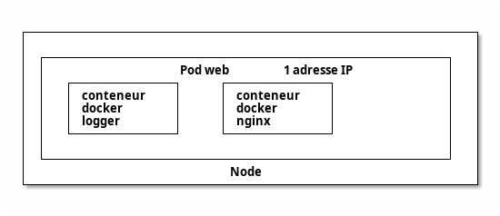
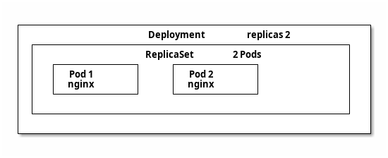

## Chapitres

---

# Présentation de Kubernetes

---

`Kubernetes` `k8s` est un orchestrateur de déploiement et de gestion de conteneurs applicatifs dans un cluster de machines virtuelles.

* Indépendant de Docker® mais même runtime `containerd` => peut tourner les mêmes images
* Configure et gère un cluster applicatif complexe : nœuds du cluster, réseau, stockage, ...

---

* De loin l'orchestrateur le plus utilisé avec Docker®
* D'autres orchestrateurs existent : `OpenShift`, `Swarm`, `Apache Mesos`, …

---

* Possibilité de gérer tout le cluster via API `kubectl`
* Mais configuration recommandée via `Yaml` / `Json` pour audit

---

# Recommandations

* `Docker®` seul / `docker compose` pour CI/CD et outils internes
* `k8s®` pour gestion applicative de l'environnement de production
* `k8s®` duplique des fonctionnalités de Docker® => préférer 100% Docker® ou k8s®

---

# Technologies de conteneurs supportées

1. `containerd` : projet open-source créé pour Kubernetes (runtime de `Docker` : _Docker sans la CLI_)
2. `Docker Engine` : _Docker avec la CLI_
3. `Podman` : alternative _serverless_ à Docker
4. `CRI-O` : conteneurs légers
5. `Mirantis Container Runtime (MCR)` (anciennement _Docker Enterprise_)

---

# Plugin réseau (CNI)

- Container Networking Interface (_CNI_) :
  - Permet la communication réseau au sein du cluster
  - Parfois intégré à la distribution, sinon à installer séparément
	- <https://github.com/containernetworking/cni/>

---

## CNI (Kubernetes) vs CNM (Docker)

- Docker :
  - réseaux **multiples** et **isolés**
	- DNS par **réseau**
	- **pas d'interconnexion** des réseaux
- Kubernetes :
  - **1 seul** réseau _flat_
	- DNS par **`Namespace`**
	- **pas d'isolation** des réseaux par défaut (utiliser des `NetworkPolicies`)

---

## Flannel

- Est un réseau de sous-réseaux pour Kubernetes
- Utilise des tunnels UDP ou TCP pour la communication 
- Offre une isolation réseau par pod
- Est plus simple à configurer que les autres options
- Est majoritairement utilisé

---

## Calico

- Utilise BGP (Border Gateway Protocol) pour le routage
- Propose une isolation réseau granulaire (par pod)
- Supporte nativement le routage IPv4 et IPv6
- S'intègre bien avec l'infrastructure existante

---

## Weave

- Crée un réseau virtuel entre tous les conteneurs
- Utilise le DNS intégré de Docker
- Propose une isolation réseau par pod
- Est facile à configurer mais peut être moins performant que les autres options

---

## Cilium

- Utilise _BPF_ (_Berkeley Packet Filter_)
  - performant, débit élevé et latence réduite
- Métriques détaillées sur le trafic réseau
- Supporte dynamiquement l'ajout et la suppression de nœuds
- Conçu pour gérer des clusters de grande taille

---
layout: section
---

# Distributions Kubernetes

---

1. Kubeadm
   - outil officiel
	 - installation de chaque composant séparément
	 - le plus configurable mais le plus complexe

---

2. Kubespray
   - Utilise `Ansible` pour (re)déployer automatiquement un cluster
	 - compatible _bare-metal_ et _cloud_

---

3. Rancher (RKE) :
   - Plateforme complète pour gérer des clusters Kubernetes
   - Propose des fonctionnalités avancées comme la gestion multi-cluster
   - Offre une interface graphique intuitive

---

4. K3s (Rancher Labs) :
   - Version allégée de Kubernetes conçue pour les environnemets embarqués
   - Consomme moins de ressources que Kubernetes standard
   - Idéal pour les systèmes à faible puissance

---

5. K0s (CNCF) :
   - Autre version allégée Kubernetes
	 - Très minimale, aucun composant additionnel
	 - Compatible on-premise, edge, IoT, …

---

6. OpenShift :
   - Distribution propriétaire de Red Hat basée sur Kubernetes
   - Inclut des fonctionnalités supplémentaires comme l'orchestration d'applications
   - Forte sécurité et conformité

---

7. Docker Kubernetes Service (DKS)
   - Surveillance intégrée du cluster et des applications.
   - Nombreux drivers storage

---

8. MicroK8s (Ubuntu) :
   - Distribution légère et sécurisée de Kubernetes
   - Conçue pour les environnemets Ubuntu
   - Propose des fonctionnalités avancées comme l'installation de paquets

---

9. Minikube : 
   - Version légère pour le développement et le test
   - Fonctionne sur un seul ordinateur
   - Idéal pour débutants et environnement de développement

---

10. Docker Desktop :
   - Intègre Kubernetes nativement
   - Offre une expérience utilisateur simplifiée
   - Adapté aux développeurs utilisant Docker

---

11. Kind (Kubernetes IN Docker) :
   - Déploie Kubernetes dans un conteneur pour le développement et le test
   - Crée rapidement un ou plusieurs clusters localement
   - Utile pour tester plusieurs clusters : upgrade, changements d'infrastructure, …

---

12. Talos Linux :
   - Distribution Linux dédiée
	 - OS immuable : pas de SSH, shell, …

---

# Plateformes managées

- Amazon Elastic Kubernetes Service (EKS)
- Google Kubernetes Engine (GKE)
- Azure Kubernetes Services (AKS) 
- Oracle Kubernetes Engine (OKE)
- IBMCloud K8s
- OVHCloud K8s

---
layout: section
---

# Architecture

---

# Installation

- `kubeadm` : l'outil officiel (installation de chaque composant séparément)
- Intégré dans la distribution : `k3s`, `minikube`, `microk8s`, …
- Versions managées : outils dédiés au fournisseur de Cloud

---

# Modèle

* Un cluster k8s est composé de plusieurs `Node`
* Chaque `Node` fait tourner des `Pod` (ensemble de conteneurs - c'est l'unité atomique de k8s !)
* Un `Deployment` gère _déclarativement_ des ressources à déployer (pods, replicas, mise à jour, … )
* Un `Service` permet d'exposer les ports d'un pod (interne ou externe)
  - _Aucun lien avec un `service` de `docker-compose` !_

---

## Types de Nodes

* Node de rôle `master` : le `control pane`, gère le cluster (orchestration, API server, …)
* Node de type `worker` (sans rôle) : exécute les pods et leur fournit les ressources

---

# Limites

- k8s est fait pour gérer de gros clusters :
- limitations Kubernetes v1.31 :
  - < 5,000 Node
  - < 110 Pod / Node
  - < 150,000 Pod (total)
  - < 300,000 Containers (total)

---


<div class="caption">Architecture d'un cluster Kubernetes (source: kubernetes.io)</div>

---



<div class="caption">Architecture d'un Pod</div> 

---

# Composants

* `APIServer` : API de gestion du cluster
* `etcd` : stockage de la configuration du cluster
* `Controller Manager` : gère les `WorkerNode` depuis le `MasterNode`
* `Kubelet` : exécute et gère les conteneurs sur les `Node`
* `Kube-proxy` : équilibre le trafic sur chaque `Node`
* `Scheduler` : assigne les `Pod` à un `Node`

---

# etcd

- Backend k8s : état du cluster (le reste est stateless)
  - store clé=valeur
- Dans ou en dehors du cluster
- 1 leader (par consensus)
  - déployer un nombre impair d'instances
  - supporte N/3 instances défaillantes
- Jamais utilisé directement (`APIServer`)
- Critique !
  - machine dédiée ou environnement isolé
  - bonnes performances réseau / disque

---

# ControllerManager

- Compare l'état désiré (déclaratif) à l'état actuel
- En déduit (et applique) les actions nécessaires (`APIServer`)
- Beaucoup de contrôleurs différents
  - possibilité d'installer des contrôleurs externes pour gérer de nouvelles ressources (`Custom Resource Definition`)
  - ex: Load Balancer AWS, …
- Boucles de réconciliation :
  - reconstruit des ressources si besoin pendant le cycle de vie du cluster
  - sans besoin d'intervention
- Contient toute l'intelligence de Kubernetes

---

# Scheduler

- Assigne les `Pod` (en state: `Pending`) aux `Node`
  - techniquement : crée un `Binding` et change le `nodeName` du `Pod`
- Calcule de score par _filtrage_ puis _score_ :
    1. _filtrage_ : capacité, tolérance, affinité, sélecteurs, …
    2. _score_ : load-balancing, …
- Possibilité d'installer un `Scheduler` customisé

---

# Kubelet

- 1 `Kubelet` par `Node`
  - Un `kubelet` est souvent installé sur le `MasterNode` pour y gérer ses composants dans des pods (optionnel)
  - En général, on y ajoute le `Taint` : `node-role.kubernetes.io/master:NoSchedule` pour ne pas utiliser le `Master` comme un `Worker`.
- Connexion permanente à l'`APIServer`
- Déploie le `Pod` s'il a le `nodeName` du `Node` courant :
    1. Récupération de l'image (format `OCI`)
    2. Création des ressources : `Volumes`, `Networks`, `Containers`
    3. États du `Pod` : `pending` -> `running` / `failed` -> `succeeded` (terminé)
    4. Remonte l'information à l'`APIServer`

---

# Kube-proxy

- gère le réseau sur chaque `Node` (entre Pods et vers extérieur)
- plusieurs modes :
  - tout traffic par `iptables`, règles `DNAT` ( ⚠️ CPU si beaucoup de règles)
    - load-balancer : _round-robbin_
  - `ipvs` : module noyau gérant un ensemble de règles d'un coup (plus performant)
    - load-balancer avancé
  - Si CNI `Cilium` : règles `eBPF` dans le noyau, plus besoin de `Kube-proxy`
    - voir section sur les CNI
- Connexion entre `Pods` : niveau 3 (_IP_)
- Connexion par `Services` : niveau 4 (_TCP_, _UDP_)

---

Voir : <https://2021-05-enix.container.training/5.yml.html#50> pour un exemple de fonctionnement du _Control Plane_ suite à la création d'un `Deployment`

---

# Gestion du cluster

* Fichiers de configuration `yml` (à privilégier autant que possible !)
* Interface en ligne de commande `kubectl` (surtout pour lancer les fichiers de config)
* Interface web (peu utilisée)

---
layout: section
---

# Ressources du cluster

---

## Interactions entre ressources

- Les `Pod` exécutent les microservices.
- Les `Service` exposent ces pods pour permettre leur communication et leur accès.
- Les `ConfigMap` et `Secret` injectent les configurations et les données sensibles.
- Le/Les `Ingress` gèrent le trafic externe et les certificats SSL.
- Les `PersistentVolume` et `StatefulSet` supportent les applications avec état.
- Les `DaemonSet` assurent le fonctionnement des outils d’administration sur chaque noeud.

---

## Gestion des applications

- `Deployment` : gère le déploiement d'un `ReplicaSet`
  - et la mise à jour des applications (rolling update, rollback, scaling)
- `ReplicaSet` : crée et gère le suivi (réplicas) d'un pod
  - ne pas utiliser de `ReplicaSet` directement mais passer par un `Deployment` (plus puissant)
- `Pod` : gère un ensemble de conteneurs partageant la même isolation : stack réseau, stockage, …
  - démarré directement ou (mieux) par un `deployment` créant un `ReplicaSet`
  - éphémère : pas de données critiques dans le pod
  - 1 IP par pod partagée entre tous les conteneurs (mais l'IP peut changer)
    - accès par `localhost` aux autres conteneurs et **partage des ports ouverts**

---



<div class="caption">Un Deployment gérant un ReplicaSet gérant un Pod</div> 

---

## Labels

- attributs clé=valeur des objets du cluster
- utilisé par kubernetes
- `NodeSelector` : lance un pod sur un `Node` ayant ce label
- `NodeAffinity` : décrit des affinités entre un `Pod` et un `Node`
- `podAffinity`, `podAntiAffinity` : (anti)affinité entre `Pod`
- il existe aussi des `annotations` : idem mais NON utilisé par k8s ensuite

---

### Labels et debug

- Beaucoup de ressources utilisent les labels pour sélectionner les ressources (`Pod`, …) à manager
- Pour debugger un `Pod` fautif, on peut changer son `Label` :
  - le Pod fautif sera retiré du Service (plus de Load balancing)
  - un nouveau Pod est créé par le `ReplicaSet` ou le `DaemonSet`
  - le Pod fautif est toujours actif pour du debug

---

## Service

- Service DNS permettant d'accéder à 1 (ou plusieurs) Pods
  - Nom DNS court (dans le namespace) : `<service_name>.<namespace>` (ou `<service_name>` si `namespace==default`)
  - Nom DNS complet : `<service_name>.<namespace>.svc.<cluster-domain>`
  - exemple : `mon_service.mon_namespace.svc.mon_cluster`
- Association `Service` <-> `Pod`(s) grâce aux _labels_
  - **avec gestion des réplicas**
- Au moins 2 CIDR (plages réseau) : CIDR Pod et CIDR Services

---

### Service: ClusterIP

- Expose à l'intérieur du cluster uniquement
- Crée une Virtual IP
- Accès via le nom du service
- Load balancer interne sur les Pods

---

### Service: NodePort

- Extension du `ClusterIP`
- Expose à l'extérieur du cluster
- Accès via des ports sur les Nodes du cluster
- Load balancer interne sur les Pods

---

### Service: LoadBalancer

- LoadBalancer pour l'accès au Pod depuis l'extérieur
  - idéalement directement, sinon par un `NodePort`
- Permet d'avoir un accès unique à plusieurs conteneurs d'un Pod tournant sur plusieurs Nodes.
- Load balancer externe : lié au service de load balancing du Cloud Provider.
  - on-premise, installer `MetalLB`

---

### Service: ExternalName

- Référence un DNS interne ou externe (alias)
- exemple : BDD externe au cluster
- pas de Load balancer

---

### Endpoint

- Lien `Service` <-> `Pod`

---

## Ingress

- Point d'accès publique HTTP/HTTPS unique pour l'accès aux différentes Pods (différent d'un Service)
- Agit comme un _Reverse-proxy_ qui redirige la requête vers le `Service`
- Règles de routage avancées
- Recquiert une implémentation d'`Ingress Controller` à installer :
  - `Nginx Ingress Controller` : standard, stable, supporte HTTPS et annotations avancées.
  - `HAProxy Ingress` : performant
  - `Traefik` : léger, dynamique (cloud, microservices)
  - `Consul Ingress / Istio Gateway` : intégration avec les _service mesh_ Consul / Istio

---

## Service Mesh

- Ajoute les services d'infrastructure communs
  - authentification
  - sécurité
  - logs
- Gère la communication sécurisée entre conteneurs sur des architectures micro-services
- À installer : `Istio`, `linkerd`, `consul`, …
  - Voir la [page des outils Devops](https://www.avenel.pro/tools#-kubernetes-specific)

---

## Gateway API

- Nouvelle API Kubernetes (successeur Ingress)
  - Orienté rôles, portable, extensible
  - Routage multi-namespace
  - Décorélé de l'installation de kubernetes
- `GatewayClass` : Ensemble de `Gateway` avec configuration commune et géré par un contrôleur
- `Gateway` : Définit une instance d'infrastructure de gestion du trafic : Cloud load-balancing, …
- `HTTPRoute` : Règles pour mapper le trafic d'une `Gateway` à un endpoint réseau (`Service`)

---

## Configuration des applications

* `ConfigMap` pour modifier la configuration des applications
  - décorélé du code de l'application
* `Secret` (mots de passe, …) : assez similaire
  - [Differents types de Secrets](https://kubernetes.io/docs/concepts/configuration/secret/#secret-types)
  - ⚠️ par défaut, **simple encodage** : voir les [bonnes pratiques de sécurité](https://kubernetes.io/docs/concepts/security/secrets-good-practices/)
  - [chiffrement possible](https://kubernetes.io/docs/tasks/administer-cluster/encrypt-data/) des accès _REST_ mais l'_API Server_ ne peut plus démarrer automatiquement (si très fort besoin de sécurité uniquement)
* `ConfigMap` et `Secret` peuvent être _immuable_ 

---

## Stockage

---

### Volume

- `Volume` : **points de montage** d'un Pod
- pas de ressource dans l'_API Server_ (~`kubectl get volumes`~)
- très similaire à _Docker_
- pour accès aux configs, persistence, filesystem temporaire, …
- accessible à tous les _Conteneurs_ du _Pod_
- détruit (ou détaché si _remote_) à la destruction du Pod (persiste au redémarrage)

---

### PersistentVolume

- `PersitentVolume` (PV) : vision _storage_ du cluster Kubernetes
- **stockage extérieur** à la vision _conteneur/pod_
- Représente un disque concret : _EBS_, _SAN_, …
  - existe dans l'_API Server_ : `kubectl get persistentvolumes`
  - durée de vie indépendante du pod
  - ~ne peut **pas être associé directement**~ à un _Pod_

- `PersistentVolumeClaim` : réquisition d'un `PV`
  - permet l'association d'un disque à un _Pod_

---

En résumé :

- `Volume` => vision _container_ : un point de montage pour configs, persistence, filesystem temporaire, …
- `PersitentVolume` (`PV`) => vision _storage_ du cluster Kubernetes, un espace de stockage
- `PersistenVolumeClaim` (`PVC`) => un type de _Volume_ permettant de réquisitionner et d'utiliser un `PV`

---

### Quelques types de Volumes

- `emptyDir` : volume vide, supprimé avec le Pod (mais partage entre conteneurs du pod) 
- `hostPath` : monte un répertoire du Host vers le Pod
- `configMap` : monte des fichiers de configuration
- `PersistentVolume` : `iscsi`, `nfs`, `cephfs`
- beaucoup de types supportés : <https://kubernetes.io/docs/concepts/storage/volumes/>

---

### Quelques solutions de stockage

Solution | Type | Mode d'accès | Cas d'usage
---------|------|--------------|-------------
_AWS EBS CSI_ | Stockage en bloc | `RWO` (noeud unique) | Stockage haute performance sur AWS
_Google Persistent Disk CSI_ | Stockage en bloc | `RWO` (noeud unique) | Applications cloud-native sur GCP
_Ceph RBD CSI_ | Stockage distribué | `RWO`, `RWX` | Bases de données distribuées
_Longhorn CSI_ | Stockage local | `RWO`, `RWX` | Stockage persistant natif Kubernetes

---

### Volumes statiques - Odre des opérations

- Création du volume `PV` par l'utilisateur : taille, type de stockage, …
- Création du `PVC` par l'utilisateur : taille et type de stockage requis (correspond à un PV existant qui répond à ces critères).
- Association entre `PVC` et `PV` par Kubernetes
- Utilisation du `Volume` par un `Pod`

---

### Volumes dynamiques - Odre des opérations

- `PVC` : l'utilisateur demande un volume persistant et spécifie une `StorageClass`
- _Provisionnement_ du `Volume` via le driver `CSI` (_Container Storage Interface_) associé à la `StorageClass`
- _Attachement du volume_ au _Node_ par le `CSI`
- _Montage du volume_ dans le _conteneur_ depuis le _Node_

---

## DaemonSet

- Assure que des pods tournent sur tous les noeuds du cluster
- Utile pour monitoring & logs

---

## StatefulSet

- Déploie des applications avec état : BDD, …
- Ressources **ordonnées** (ordre de lancement)
- Un volume persistant par _Pod_ (vs. _ReplicaSet_ où les volumes sont partagés)
- Un même volume monté dans un pod (`PVC`) le reste pour toujours (même après recréation)
- Un DNS dédié (_service headless_) :
  - load-balancing sur tous les pods du set
  - sélection d'un pod en particulier

---

## Job et CronJob

- Pour travaux "longs" (> minutes / heures)
- `Job` : Démarre un `Pod`, en cas d'échec, relance jusqu'au _backoff limit_ (default=6)
  - paramètres : `completions` (default=1) => nombre d'exécutions, `parallelism` (default=1)
- `CronJob` : Nécessite un `schedule` (idem _Cron_ sur _UNIX_)

---

## Configuration du cluster

* Metadata
* `Namespace` : espaces de noms isolant des ressources
  - cloisonne une partie du cluster
  - idem namespace Linux
* Rôles

---

## Role-Based Access Control (RBAC)

- `ClusterRole` : profil permettant des accès / actions / ressources
- `ServiceAccount` : user applicatif
  - génère des token (secrets) : à monter par exemple dans un `Pod` pour permettre l'accès
- `Cluster Role Binding` : association `ServiceAccount` <-> `ClusterRole`

---
layout: section
---

# Configuration avancée des Pods

---

## Sondes Healthcheck

- `ReadinessProbe`
  - remplacement du Pod si défectueux
  - exemple : dépendance service externe
  - laisser de la marge : ne pas tuer en boucle un conteneur qui démarre !
- `LivenessProbe`
  - monitoring du Pod
  - kill du conteneur si échec
	- et donc (souvent) redémarrage automatique du Pod
  - jamais de dépendance vers l'extérieur du Pod
- `StartupProbe`
  - doit renvoyer un échec tant que l'application n'est pas initialisée
- 3 modes : `exec` (commande), `httpGet`, `tcpSocket`
- si vérification > 1 seconde, préférer précalculer (asynchrone) et retourner un cache

Voir aussi : <https://blog.stephane-robert.info/docs/conteneurs/orchestrateurs/kubernetes/probes/>

---

### ⚠️ Healthcheck exec : processus orphelins 

- En Linux, quand un processus se termine : 
  - son parent gère son _exit status_ (`wait()`/`waitpid()`) => état _zombie_
  - si le processus a été tué, ses enfants sont rattachés au `PID=1` (responsable de tuer les zombies)
  - OK sur système "standard" (`/sbin/init`, …) mais ici `PID=1` est le processus principal du conteneur
- Besoin d'un tueur de zombies 🧟 en cas d'`exec`
  - <https://github.com/krallin/tini> : utiliser un mini `init`
  - Ou [partager le namespace PID entre tous les conteneurs du Pod](https://kubernetes.io/docs/tasks/configure-pod-container/share-process-namespace/) : `gcr.io/pause` tuera les zombies

---

## Limiter les ressources d'un Pod

- Ressources :
  - `ResourceRequirements` : limite le CPU et/ou la mémoire
    - dans les fichiers `Deployment`, `StatefulSet`, `DaemonSet`
    - block `resource:`
  - `LimitRange` : limites par défaut du cluster
- 2 types de limites :
  - `requests` : minimum requis par conteneur
    - pour la répartition sur les Node (`Scheduler`)
  - `limits` : maximum par `Pod`
    - pour la santé des Pod (`Kubelet`)
- Requirement: installer un `MetricsServer` dans le cluster
- Utilise les fonctionnalités de Docker : voir le [cours Docker sur le site](https://www.avenel.pro/cours/docker)

---

## Scaling

- Scaling horizontal : plusieurs instances de l'application
  - commande `kubectl`
  - ou automatiquement `HorizontalPodAutoscaler` (`HPA`) : natif k8s mais requiert un [Metrics Server](https://github.com/kubernetes-sigs/metrics-server)
- Scaling vertical : redimensionner les ressources de l'application (mémoire, CPU)
  - par mise à jour du déploiement et création d'un nouveau Pod
  - ou automatiquement : `VerticalPodAutoscaler` [extension à installer](https://github.com/kubernetes/autoscaler/tree/9f87b78df0f1d6e142234bb32e8acbd71295585a/vertical-pod-autoscaler)

---

## Sécurité

- Appliquer un `SecurityContext` : 
  - changer le `UID`, `GID`
	- drop de _capabilities_
	- filesystem _R/O_
	- …

---

## Stratégies de déploiements

- k8s propose 2 stratégies de déploiements :
  - **rolling update** :
    1. création pod v2 en coexistance avec v1
    2. intégration v2
    3. suppression v1
  - **recreate** (sans coexistance) :
    1. suppression v1
    2. création v2

---

- autres stratégies manuelles ou en ajoutant d'autres outils :
  - **blue/green** : coexistance des 2 versions (dont la nouvelle pour test)
  - **canary deployment** : coexistance avec migration progressive des requêtes vers v2

---

## Assigner un Pod à un Node spécifique

- _NodeName_ : assigner un _Pod_ à un _Node_ (test uniquement)
- _Node Selector_ : sélectionner un _Node_ par _Label_, ex : CI/CD, Node spécialisé stockage pour Pod BDD, …
- _Node Affinity : contraintes sur les _Label_ du _Node_, ex : répartition géographique, possédant un GPU, …
- _Pod Affinity_ : regrouper des pods pour améliorer les perfs, par ex d'une même stack applicative, …
- _Anti-Affinity_ : éloigner des pods pour augmenter la robustesse, par ex instances de H/A, …
- _Taints_ et _Tolerations_ : réserver des _Node_ pour des workloads spécifiques : le _taint_ empêche de déployer des _Pod_ sur un _Node_ en l'absence de _toleration_) : `NoSchedule` (_Control Plane_, …), `PreferNoSchedule`, `NoExecute` (expulsion)

---

# Pods multi-conteneurs

---

## Sidecars et autres patterns

- Conteneur(s) classiques supplémentaire(s) dans le Pod
- Points d'accès entrée et/ou sortie à la place du conteneur principal
- Utilise les volumes partagés ou la couche réseau pour travailler avec le conteneur principal
- Souvent injectés par des opérateurs k8s
- Abstraction théorique : pas de modèle kubernetes [mais une implémentation est en beta](https://kubernetes.io/docs/concepts/workloads/pods/sidecar-containers/)

---

- `sidecar` : étends les fonctionnalités du conteneur principal : logs, monitoring, …
- `adapter` : adapte la donnée avant de la fournir au conteneur principal (ex: CSV to JSON)
- `ambassador` : authentification, (reverse)proxy, sécurité (HTTPS), …

---

## initcontainer

- Type de conteneur Kubernetes spécifique : `initContainers`
- Lancés dans l'ordre de spécification
- Le(s) conteneur(s) classiques démarrent après (si succès uniquement)
- usage : chargement de données, migration BDD, génération de configs, attente dépendances, … (tous les pré-requis du conteneur)

---

# Commandes de base de Kubernetes® 

Voir la [cheatsheet sur Kubernetes®](https://www.avenel.pro/cours/docker/kubernetes-cheatsheet)

---

# Structure d'un fichier k8s

```yaml
apiVersion: v1 # Version de l'APIServer k8s
kind: … # Le type de ressource à gérer : Pod, Deployment, Service, …
metadata: # Métadatas de la ressource
  name: … # nom (interne) de la ressource à créer et/ou monitorer
  namespace: mon-namespace # Namespace spécial (optionnel - sinon default)
  labels: # ajout de labels (optionnel)
    ma-cle: ma-valeur 
  […]
spec: # Les spécifications de la ressource. Différent pour chaque type de ressource
  […]
```

---
layout: section
---

# Outils externes

---

# Kustomize

- Permet d'ajouter / modifier des ressources Kubernetes par `Kustomization` (fichier YAML)
- Intégré dans `kubectl` : `apply -k …`
- Utile pour :
  - config dev vs prod, …
  - scaling : `replicas: …`
  - mettre à jour l'image d'un conteneur


<div class="caption">Exemple d'usage de Kustomize. Credits: kustomize.io</div>

---

## Vocabulaire Kustomize

- **kustomization** : une **base** ou un **overlay**
- **base** : _kustomization_ **référencée par** d'autres _kustomization_
- **overlay** : _kustomization_ **qui référence** d'autres _kustomization_ (récursif)
- **patch** : une **modification** d'une ressource Kubernetes existante
- **variant** : **version finale** de la ressource Kubernetes après application des _bases_ et _overlay_

---

# Helm

- Gestionnaire de "paquets" k8s
  - en fait des fichiers Yaml
  - ajout du versionning
- `chart` : ensemble de fichiers manifests
- Stockés dans des `repositories`
  - `hub` officiel : <https://hub.helm.sh/>

---

# FluxCD

- Outil Gitops pour k8s
    - scrute un dépôt Git distant
    - mise à jour automatique des ressources k8s
    - plus de CLI `kubectl`
    - Utilise des `Kustomizations` de `Kustomize` (outil intégré à k8s)
- intégrations Helm et Terraform
- CLI `fluxctl` (pas de GUI)
    - outils plus avancés : `argoscd`, `jenkins X`

---


<div class="caption">Architecture de FluxCD (source: documentation FluxCD)</div>

---

# Kyverno

- Moteur de politiques pour k8s
- Gère des règles de sécurité, de conformité et de gestion (fichiers Yaml)
- DevSecOps

---

# Certifications

- Kubernetes and Cloud Native Associate (KCNA)
- Certified Kubernetes Application Developer (CKAD)
- Certified Kubernetes Administrator (CKA)
- Certified Kubernetes Security Specialist (CKS)

Pour plus d'information, voir [une explication des différentes formations](https://gist.github.com/bakavets/05681473ca617579156de033ba40ee7a)

---
layout: two-cols
---

<!-- class: liens -->

# Liens

- [Site web Kubernetes](https://kubernetes.io/)
- Bacs à sable pour tester k8s : [killercoda](https://killercoda.com/playgrounds/scenario/kubernetes) et <https://labs.play-with-k8s.com/>
- Mini-distributions : <https://blog.palark.com/small-local-kubernetes-comparison/>
- [Introduction à k8s](https://blog.stephane-robert.info/docs/conteneurs/orchestrateurs/kubernetes/introduction/)
- Cours sur kubernetes :
  - [uptime-formation](https://supports.uptime-formation.fr/05-kubernetes/01_cours_presentation_k8s/)
  - [stephane-robert](https://blog.stephane-robert.info/docs/conteneurs/orchestrateurs/kubernetes/introduction/)
  - [vidéos xavki](https://www.youtube.com/watch?v=37VLg7mlHu8&list=PLn6POgpklwWqfzaosSgX2XEKpse5VY2v5)
	- <https://container.training/> : formations Jérôme Petazzo, notamment :
	  - [Fondamentaux Kubernetes](https://2021-05-enix.container.training/2.yml.html) : cours complet, de l'installation aux usages de kubernetes
		- [Packaging d'applications et CI/CD pour Kubernetes](https://2021-05-enix.container.training/3.yml.html)
		- [Kubernetes Avancé](https://2021-05-enix.container.training/4.yml.html)
		- [Opérer Kubernetes](https://2021-05-enix.container.training/5.yml.html)
		- <https://github.com/jpetazzo/container.training>
		- [Video - Deep Dive into Kubernetes Internals for Builders and Operators](https://www.youtube.com/watch?v=3KtEAa7_duA)
- [Dear Friend, you have built a Kubernetes](https://www.macchaffee.com/blog/2024/you-have-built-a-kubernetes/)

- [Introduction à kubectl](https://blog.stephane-robert.info/docs/conteneurs/orchestrateurs/outils/kubectl/)
- <https://roadmap.sh/kubernetes>
- [Helm: package manager pour déployer dans k8s](https://helm.sh/)
    - [Introduction à Helm](https://www.aukfood.fr/helm-le-meilleur-ami-de-votre-kubernetes/)
- [Livre : Bootstrapping Microservices with Docker, Kubernetes, and Terraform](https://www.manning.com/books/bootstrapping-microservices-with-docker-kubernetes-and-terraform)
- <https://www.cortex.io/post/understanding-kubernetes-services-ingress-networking>

---
layout: two-cols
---

- Autoscaling : [doc](https://kubernetes.io/docs/tasks/run-application/horizontal-pod-autoscale/) et [pratique](https://kubernetes.io/docs/tasks/run-application/horizontal-pod-autoscale-walkthrough/)
- [HPA Autoscaling depuis des métriques custom dans Prometheus](https://blog.zwindler.fr/2024/10/11/optimisation-ressources-kubernetes-autoscaling-horizontal-custom-metrics-prometheus-adapter/)
- [Blue-Green deployment in k8s](https://developer.harness.io/docs/continuous-delivery/deploy-srv-diff-platforms/kubernetes/kubernetes-executions/create-a-kubernetes-blue-green-deployment/)
- [Canary deployment in k8s](https://learn.microsoft.com/en-us/azure/devops/pipelines/ecosystems/kubernetes/canary-demo?view=azure-devops&tabs=yaml)
- <https://blog.wescale.fr/comment-rendre-une-application-haute-disponibilit%C3%A9-avec-kubernetes>

- Tutoriels sur la communication entre pods :
  - [Utiliser un service](https://kubernetes.io/docs/tutorials/kubernetes-basics/expose/expose-intro/)
  - [Tutoriel complet](https://medium.com/@extio/mastering-kubernetes-pod-to-pod-communication-a-comprehensive-guide-46832b30556b)
	- [Youtube Xavki : Kubernetes 021 - Services : NodePort, LoadBalancer, ExternalName et notions de Endpoints](https://www.youtube.com/watch?v=tF28iwTco9A)
- [Exemple de monitoring Prometheus - Grafana dans un cluster Kubernetes](https://blog.octo.com/exemple-dutilisation-de-prometheus-et-grafana-pour-le-monitoring-dun-cluster-kubernetes)
- [Article très complet sur le service mesh Istio](https://une-tasse-de.cafe/blog/istio/)
- <https://spacelift.io/blog/kubernetes-secrets>
- [Learning Kubernetes, Pods & Deployments with Doom](https://www.youtube.com/watch?v=j9DOWkw9-pc)
- [Administration de cluster via etcd](https://blog.stephane-robert.info/post/kubernetes-etcd/)
- [Un cluster de production en un éclair avec Talos](https://kdrive.infomaniak.com/app/share/834488/21e24b60-ece5-4445-ba1d-c5adc3c170cc)
- [Installer Kubernetes via kubeadm](https://dev.to/abhay_yt_52a8e72b213be229/how-to-set-up-and-install-a-kubernetes-cluster-a-step-by-step-guide-375j)
- [Kubernetes HA : what if kubernetes internal components go down](https://medium.com/@s.atmaramani/what-if-kubernetes-internal-components-goes-down-6f6372ce0838)
- [Fichiers perso de configuration des lignes de commandes : kubectl, helm, …](https://git.sr.ht/~toma/dotfiles/tree/main/item/.config/zsh/k8s.sh)
- [10 Ways to Shoot Yourself in the Foot with Kubernetes, #9 Will Surprise You (Youtube)](https://www.youtube.com/watch?v=QKI-JRs2RIE)
- [Scheduler Kubernetes (pour démonstration)](https://github.com/kelseyhightower/scheduler)
- Exemples de projets : voir la [page des liens](/cours/liens#kubernetes)
- <https://learnk8s.io/production-best-practices/>
- [Blog: comparaison des types de réseau et de CNI dans Kubernetes (publié par le CNI Calico)](https://docs.tigera.io/calico/latest/networking/determine-best-networking)

---

# Legal

- Docker®, Docker Swarm and the Docker logo are trademarks or registered trademarks of Docker, Inc. in the United States and/or other countries. Docker, Inc. and other parties may also have trademark rights in other terms used herein.
- Kubernetes® is a registered trademark of The Linux Foundation in the United States and/or other countries
- Other names may be trademarks of their respective owners

