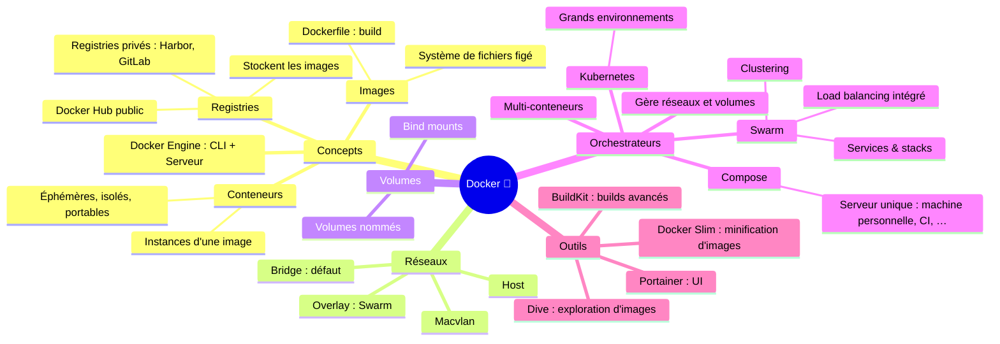
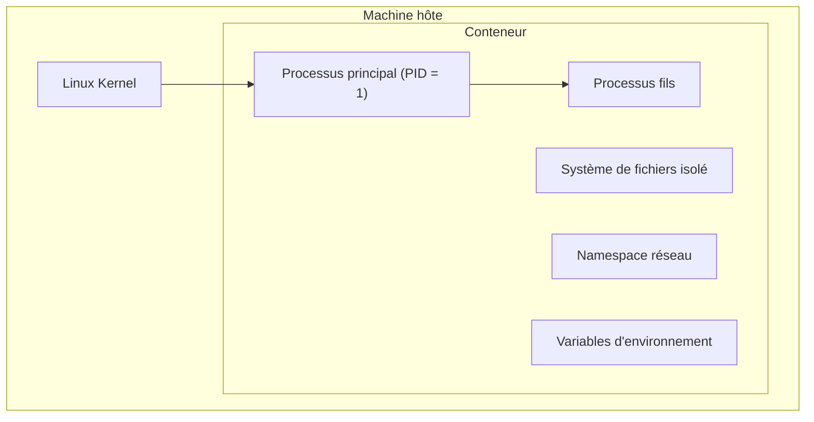
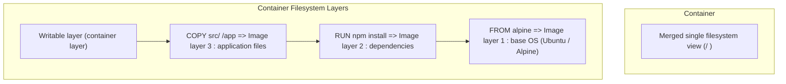
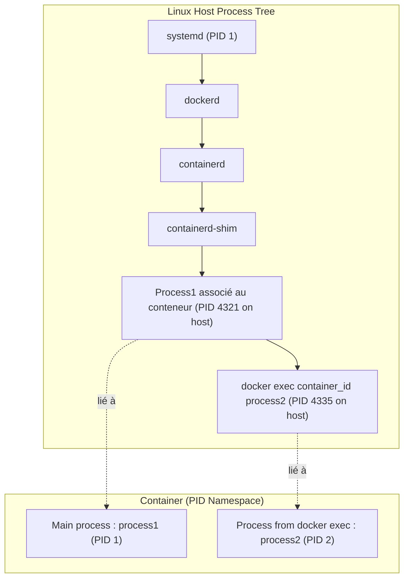
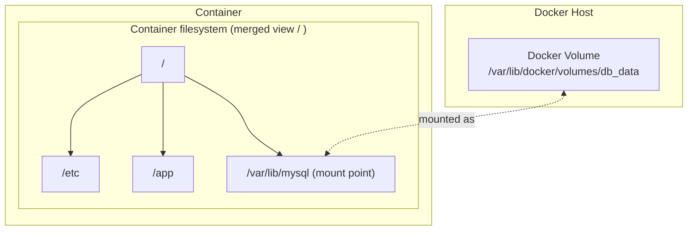
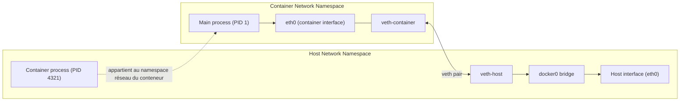
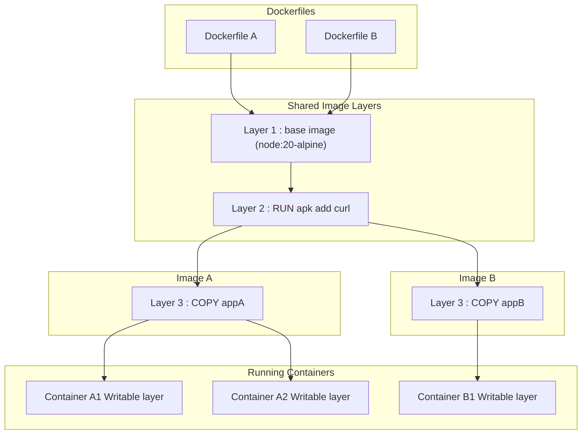
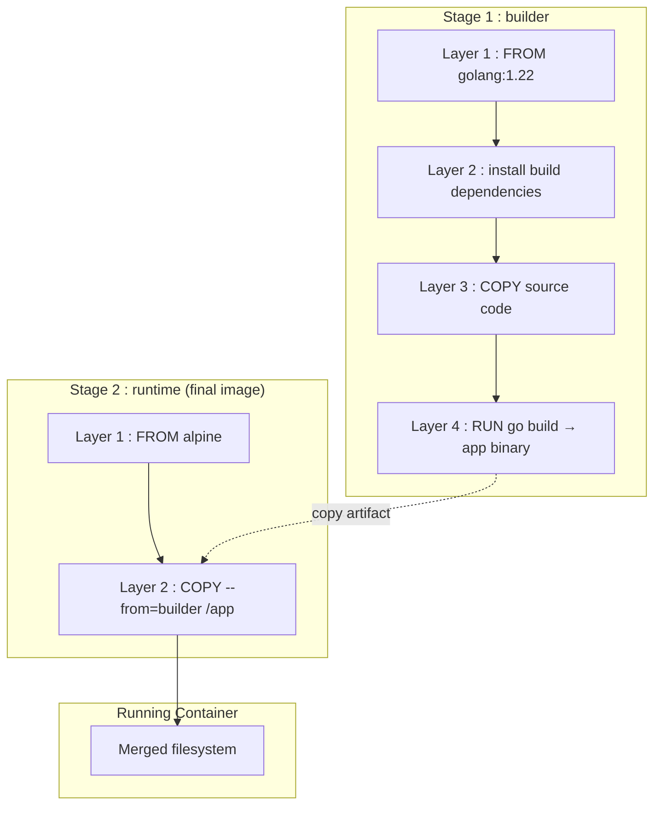

---

## 🚀 Introduction: Problèmes courants

---

### ⚠️ Incohérences entre environnements

- **"Ça marche sur ma machine"** 💻
  - Environnements de dev / test / production différents 🏗️
  - Bugs spécifiques à chaque environnement : OS, dépendances, configurations, … 🐛
  - Difficile de reproduire des environnements proches de la production : Tests d'intégration et de performance faussés 🧪

---

### ⚠️ Problèmes de compatibilité

- Grand nombre de dépendances : bibliothèques, versions de logiciels difficiles à maintenir. 📚
- Conflits entre différentes versions de dépendances ⚠️

---

### ⚠️ Difficulté de déploiement

- Scripts complexes et configurations spécifiques à chaque environnement 📜
- Processus de déploiement manuel : 🛠️
  - Erreurs humaines ❌
  - Long ⏳

---

### ⚠️ Problèmes de portabilité

- Difficile de déplacer une application : 📦
  - D'un serveur à un autre 🖥️
  - D'un environnement de développement à la production 🏗️

---

### ⚠️ Environnements lourds

- Machines virtuelles pour isoler les environnements : 🖥️
  - Consomment beaucoup de ressources 💾
  - Gestion et maintenance coûteuses 💸
  - VM lente à démarrer ⏳

---

### ⚠️ Difficulté à évoluer

- Scalabilité limitée : environnements traditionnels mal adaptés aux architectures modernes nécessitant une scalabilité rapide et fluide. 📈
- Mise à l'échelle : configurations manuelles complexes. 🛠️

---

> Develop faster. Run anywhere.

_Docker®_ 🐳

---

## 🐳 Introduction aux conteneurs

---

### Architecture d'une machine virtuelle

```
+--------------+--------------+
|     VM A     |     VM B     |
| +----------+ | +----------+ |
| |   App1   | | |   App2   | |
| +----------+ | +----------+ |
| | bin/libs | | | bin/libs | |
| +----------+ | +----------+ |
| | Guest OS | | | Guest OS | |
| +----------+ | +----------+ |
+--------------+--------------+
|         Hyperviseur         |
+-----------------------------+
|           OS hôte           |
+-----------------------------+
|        Infrastructure       |
+-----------------------------+
```

---

### Architecture d'un conteneur

```
+--------------+--------------+
| Conteneur A  | Conteneur B  |
| +----------+ | +----------+ |
| |   App1   | | |   App2   | |
| +----------+ | +----------+ |
| | bin/libs | | | bin/libs | |
| +----------+ | +----------+ |
+--------------+--------------+
|       OS hôte + Docker      |
+-----------------------------+
|        Infrastructure       |
+-----------------------------+
```

---

### 🏗️ Virtualisation forte

| 🌟 Avantages | Inconvénients ❌|
| --- | --- |
| Grande indépendance par rapport à l'hyperviseur | Consomme beaucoup de ressources |
| Isolation forte voire totale | Performances réduites : temps de démarrage, virtualisation des appels systèmes, ... |
| Ressources dédiées | |

---

### 🐳 Paravirtualisation (conteneurs)

| 🌟 Avantages | Inconvénients ❌|
| --- | --- |
| Impact quasi nul sur les performances | Proche du système d'exploitation hôte |
| | Isolation faible |
| Partage un maximum de ressources | |

---

## 🐳 Présentation de Docker®

Docker® est un outil de création, gestion et hébergement de conteneurs applicatifs 🐳

- Compatible Windows, Linux et MacOS 🖥️
- Utilise des **images** figées pour générer des **conteneurs** (version dynamique des images) 📦
- La création d'une image est décrite dans un fichier `Dockerfile` 📄

---

Un conteneur ne tourne qu'un seul processus 🏗️

- Une stack applicative va être découpée en plusieurs conteneurs 🧩
- Exemple `LAMP` : 1 `Apache`, 1 `MySQL` 🏗️

---

## 🐳 Conteneur

Un conteneur est donc un **processus en isolation** du reste du système, il a : 🐳

- Son propre **namespace** applicatif : ne voit pas les autres processus 🔒
- Son propre **système de fichiers** **isolé** (provient de l'_image_) 📁
- Sa propre **stack réseau** : en principe, _bridge_ simulé par un _namespace_ réseau 🌐
- Il récupère les **logs de la console** écrits par les applications : `println`, … 📜

:::tip
D'un point de vue système, un conteneur n'est donc rien d'autre qu'un processus ou un groupe de processus exécutés avec des contraintes et une isolation spécifiques.
:::

---



---

### 🔄 Cycle de vie

Un conteneur peut donc ressembler un peu à une VM mais : 🐳

- On ne "démarre" / "arrête" pas un conteneur mais seulement le processus qui tourne en isolation 🔄
- La vision `running`, `stopped`, … de Docker est donc une abstraction 🔄
- **Arrêt du processus principal (PID=1, provenant de l'image ou de `docker run …`) == _"arrêt"_ du conteneur** ⏹️

:::tip
Si l'on doit lancer plusieurs services dans un conteneur (déconseillé sauf services directement liés au processus principal), on pourra utiliser :

- Un script shell comme processus principal, responsable du lancement des autres processus
- Un service de supervision : <https://supervisord.org/>
- Un "vrai" système d'_init_ comme dans une distribution Linux standard, mais beaucoup plus léger : <https://github.com/krallin/tini>

:::

---

### Modes d'exécution

#### Interactif

- **Mode interactif** `-it` : pour interagir avec le processus du conteneur via un terminal (ex : bash interactif).

```bash
docker run -it ubuntu bash
````

:::tip
Sans option `-it`, le shell `bash` n'a rien à faire… et termine donc son exécution (et donc le conteneur s'arrête) !
:::

#### Détaché

- **Mode détaché** `-d` : lance le conteneur en arrière-plan (ex : serveur web, BDD).
- Docker retourne l'_ID_ du conteneur créé
- Pour interagir avec le conteneur, on exécute une nouvelle commande (par exemple `bash`) dans le même contexte :

```bash
docker exec -it <container> bash
```

---

## 📦Image

- **Template de système de fichiers** utilisé pour créer des conteneurs (similaire à une archive, un installeur, une ISO).
- **Modèle immuable** qui contient tout le nécessaire pour exécuter une application :
- Plusieurs conteneurs peuvent être créés à partir de la **même image**

---

### Layers

- Une image est construite en **couches successives**, généralement définies dans un **Dockerfile**.
- Chaque instruction ajoute une nouvelle couche :
- Ces couches sont **empilées** pour former l'image finale.
- Docker **mutualise** les 1ères couches communes à plusieurs images (pas de duplication de données)



---

### 📦 Registry

Docker® utilise des caches locaux et distants pour stocker les images des conteneurs 📦

- Lors de la création d'un conteneur, Docker® cherche si l'image est disponible en local, sinon celle-ci est récupérée depuis un répertoire distant 🌐
- Par défaut, Docker utilise le _Docker Hub_ : <https://hub.docker.com> 🔗

---

Les images sont versionnées par un tag 🏷️

- Exemple : `mysql:5.3`
- Si aucun tag ajouté, le tag `latest` est utilisé
- Attention : `latest` est juste un nom de tag (pas la dernière image) ⚠️

---

:::tip
Il est possible d'utiliser d'autres registries que le hub par défaut comme :

- Hub Github : <https://ghcr.io/> 🔗
- Hub d'images temporaires <https://ttl.sh/> 🔗
- Registry interne à l'entreprise : `gitea`, <https://hub.docker.com/_/registry> 🔗

:::

---

## 🌟 Avantages de Docker®

- Même environnement d'exécution dans toutes les étapes du pipeline d'intégration : ordinateur personnel, test, production, pré-production, ... 🏗️
  - Windows, Linux, MacOS 🖥️
  - Assure l'utilisation des mêmes versions de librairies, outils, ... 🔧

---

- Architecture immuable 🏗️

> Build once, run everywhere

- Une image Docker® est par design immuable et sans état (stateless) 📦
  - Ce n'est pas le cas d'un conteneur (exécution d'une image) 🐳

---

- Répertoire centralisé d'images 📦
  - Docker® Hub accessible publiquement 🌐
  - Assure la véracité et l'intégrité des images utilisées 🔒

---

## 🏗️ Architecture de Docker®

Docker utilise massivement deux technologies du noyau Linux pour isoler et associer des ressources aux conteneurs : les `namespaces` et les `cgroups`. 🏗️

---

### 🔒 Namespaces

- Fonctionnalité native du noyau Linux. 🔒
- Aspect fondamental des conteneurs : permet d'isoler des ressources du système hôte. 🔒
- 5 types de `namespace` : 🔒
  - `Process ID`
  - `Mount`
  - `IPC` (Interprocess communication)
  - `User` (expérimental)
  - `Network`

---



---

### 🏗️ Cgroups

- Extension du noyau Linux. 🏗️
- Les `control groups` permettent de contrôler finement les ressources à allouer aux conteneurs. 🏗️
  - Limitations mémoire 💾
  - Utilisation et temps CPU ⏱️
  - Accès aux disques 💾
  - …

---

Exemples de `cgroups` classiques : 🏗️

- `CPU`
- `Memory`
- `Network Bandwidth`
- `Disk`
- `Priority`

---


<div class="caption">Architecture de Docker®</div>

---

## 🛠️ Commandes de base de Docker®

Voir la [cheatsheet sur Docker®](https://www.avenel.pro/docker/cheatsheet) 🔗

---

## 💾 Persistance des données

- Les **conteneurs sont éphémères** ⚠️
- À l'arrêt ou à la suppression d'un conteneur les données internes sont **perdues**

:::warn
Ne jamais stocker de données critiques directement dans le conteneur : bases de données, données applicatives
:::

---

- Possibilité de stocker les données en dehors des conteneurs. 💾
- Permet de dissocier le cycle de vie des données / cycle de vie du conteneur. 🔄
- Données non critiques et temporaires : dans le conteneur. 📦
- Données liées au métier (base de données, ...) : hors du conteneur. 💾

---

### Rappel : stockage dans un système Linux

- **Partition** :
  - subdivision logique d'un disque physique (ex : disque `/dev/sda`, partitions `/dev/sda1` et `/dev/sda2`)
  - possède son propre système de fichiers (_NTFS_, _ext4_, _btrfs_, _zfs_, …)
- **Point de montage** (mountpoint) :
  - Chemin permettant d'accéder au contenu d'un système de fichiers
  - Le système de fichiers de la partition devient accessible via ce point de montage.
  - Windows : `C:` (partition principale du système), `D:`, `E:`, …
  - Linux :
    - arborescence unique : `/` (partition principale du système),
    - Toute autre partition peut être montée sur n'importe quel répertoire vide (ex: `/dev/sdb1` sur `/data`)

Linux utilise une **arborescence unique** :

```

/ => /dev/sda2 (par exemple)
├── home => dans /dev/sda2
├── var => dans /dev/sda2
├── etc => dans /dev/sda2
└── data => /dev/sdb1

```

---

### Volume 📁

- Permet de **stocker des données en dehors du conteneur**
- Espace de stockage **géré par Docker**
- Initialisé lors de la création du conteneur. 📦
- Persistant : non détruit à l'arrêt ou à la destruction du conteneur 🔄
- Partageable entre conteneurs
- Sauvegardable facilement
- Stocké sur l'hôte Docker …
- … ou possibilité d'utiliser un vrai volume de stockage partagé : `iSCSI`, `FC` ou `NFS` comme `data volume`. 💾
- Le conteneur accède aux données via un **montage**, exactement comme un **mountpoint Linux**.
- ex : la base de données écrit dans le conteneur dans `/var/lib/mysql` mais les données sont en réalité stockées dans le volume `mydata` en dehors du conteneur.

```bash
docker volume create db_data
docker run -v db_data:/var/lib/mysql mysql
```

- `db_data` : volume Docker
- `/var/lib/mysql` : chemin dans le conteneur



---

### Bind mounts 🔗

- Lien direct entre :
  - Un dossier **de l'hôte**
  - Un dossier **du conteneur**
- Accès direct aux fichiers
- Volume virtuel
- Facile d'utilisation
- Dépendance forte à l'hôte : performances, robustesse, portabilité, ... ⚠️
- Moins portable

```bash
docker run -v /data/app:/app nginx
```

:::tip

- Surtout utilisé pour partager des fichiers de configuration, avec peu de changements / accès dans le conteneur 📄
- Très utilisé en **développement** 🛠️

:::

---

### 🔄 Partage de données entre conteneurs

Pour partager des données entre conteneurs, il suffit de monter le même volume nommé dans différents conteneurs :

```sh
docker volume create --name mon_volume
docker run -v mon_volume:/pont_de_montage_conteneur_1 conteneur_image
docker run -v mon_volume:/pont_de_montage_conteneur_2 conteneur_image
```

---

### 📦 Utilisation des volumes depuis les commandes Docker®

Voir la section sur les volumes de la [cheatsheet sur Docker®](https://www.avenel.pro/docker/cheatsheet). 🔗

---

## 🌐 Gestion et configuration du réseau

---

### 🌐 Réseau Docker

- Les conteneurs doivent :
  - Communiquer entre eux 🔄
  - Exposer des services vers l'extérieur 🌍
- Chaque conteneur :
  - Dispose de sa propre **stack réseau**
  - Peut avoir une ou plusieurs interfaces

---

- Docker agit comme un **Virtual switch** logiciel avec une abstraction du réseau : le _CNM_ (_Container Network Model_). 🌐
- Le comportement par défaut décrit est celui d'un système Linux (installation classique). Celui-ci peut varier dans des installations plus exotiques (`Oracle® VirtualBox` sur Windows, ...). ⚠️
- La configuration du réseau est gérée par des pilotes (driver) différents décrits ci-après. 🛠️

:::tip

- Par défaut, les conteneurs sont **isolés** du réseau hôte
- Sauf pour `macvlan`, l'adresse `mac` du conteneur est la même que celle de l'hôte. 🔒
- Docker intègre un serveur `DNS` pour les réseaux créés par l'utilisateur - en cas d'échec, le service `DNS` configuré dans le conteneur est utilisé (peut provenir de l'hôte). 🌐

:::

---

### 🌉 Driver `bridge`

- Réseau privé interne à l'hôte
- Interconnexion des conteneurs sur le même bridge mais pas d'accès depuis l'extérieur 🌐
- NAT entre conteneurs et extérieur
- **DNS Docker** intégré 🧠
  - les conteneurs communiquent par **leur nom**
- Par défaut : bridge commun `docker0` si non spécifié à la création du conteneur 🌉

:::tip

- Chaque conteneur reçoit :
  - Une IP privée
  - Une route par défaut
- De loin le plus utilisé

:::

```bash
docker network create mynet
docker run --network mynet --name web nginx
docker run --network mynet busybox ping web
```



---

#### Exposer un service : publication de ports 🚪🌍

Pour accéder à un conteneur depuis l'hôte :

- Accéder à une application web
- Fournir une API

```bash
docker run -p 8080:80 nginx
```

- `8080` : port de l'hôte
- `80` : port du conteneur

---

### 🚫 Driver `null` - réseau `none`

- Aucune connexion entre conteneurs ou avec l'extérieur. 🚫
- Connexion à l'interface locale `loopback` uniquement. 🔄
- À l'installation, création d'un réseau de type `null` nommé `none`. 🚫

```bash
docker run --network none alpine
```

---

### 🌐 Driver `host`

- Supprime l'isolation du réseau. 🌐
- Vision directe des interfaces de l'hôte. 🌐
- Pas de mapping de port (option `-p`). 🌐

```bash
docker run --network host nginx
```

---

### 🌐 Driver `overlay`

- Permet de gérer un réseau multi-hôtes distribué entre plusieurs `Docker Engine`. 🌐
- Routage automatique du paquet vers le bon couple : hôte/conteneur. 🌐

---

### 🌐 Driver `macvlan`

- Attribue une adresse `mac` dédiée à un conteneur. 🌐
- Simule un système physique différent sur le réseau. 🌐
- Proche d'une vraie machine virtuelle. 🖥️

---

### 🌐 Driver `ipvlan`

- Similaire `macvlan`, mais partage une interface réseau avec l'hôte et son adresse MAC. Chaque conteneur a sa propre adresse IP. 🌐
- Très performant (pas de _bridge_) 🌐
- Layer 2 VLAN tagging (couche de liaison) : partage de la même interface physique, adresses IP distinctes. 🌐
- IPvlan L3 : agit comme un routeur : routage en couche 3 ("réseau") automatique dans le réseau, à gérer manuellement à l'extérieur. 🌐

---

### Résumé

| Driver        | Usage principal             |
| ------------- | --------------------------- |
| `bridge`   | Réseau par défaut           |
| `host`    | Accès direct au réseau hôte |
| `none`     | Aucun réseau                |
| `overlay` | Clusters / Swarm            |
| `macvlan`  | IP du réseau physique       |
| `ipvlan`  | Partage de l'adresse MAC       |

---

### 🛠️ Configuration du réseau depuis les commandes Docker®

- Voir la section sur le réseau de la [cheatsheet sur Docker®](https://www.avenel.pro/docker/cheatsheet) 🔗
- Voir la documentation officielle : <https://docs.docker.com/engine/network/drivers/> 🔗

---

## 📄 Le `Dockerfile`

- Fichier texte qui décrit comment créer une nouvelle image Docker®. 📄
- Décrit une suite d'instructions à exécuter les unes à la suite des autres pour générer l'image. 📜
- N'est plus utilisé une fois l'image créée. 📦

---

### 🧩 Layers

- Les instructions du `Dockerfile` (`ADD`, …) créent chacun une mini-image (_layer_) 🧩
- La couche suivante hérite de **tout les contexte** de la couche précédente : _user_, _workdir_, … (notamment lors du `FROM`)
- L'image finale est l'empilement de tous les _layers_ 🧩
- En cas de modification, seuls les nouveaux _layers_ sont modifiés ! 🔄
- Les images utilisent _UnionFS_ : chaque layer **ajoute** les changements du filesystem (nouveau fichier, suppression, …) au layer précédent => **un layer ne supprime jamais de données dans l'image finale** 🧩

---

#### Exemple de layers

```dockerfile
# Dockerfile A
FROM node:20-alpine
RUN apk add curl
COPY appA /app
```

```dockerfile
# Dockerfile B
FROM node:20-alpine
RUN apk add curl
COPY appB /app
```

Images construites :

```
Image A
 ├ Layer 3 : appA
 ├ Layer 2 : curl
 └ Layer 1 : node

Image B
 ├ Layer 3 : appB
 ├ Layer 2 : curl
 └ Layer 1 : node
```



---

### 🏗️ Build multistage

- Il est possible d'utiliser plusieurs `FROM … AS etapeX` 🏗️
- On récupère des fichiers du layer précédent par `COPY --from=etapeX …` 📦
  - Tout le reste du layer est détruit à la fin 🗑️
  - Il ne reste que les instructions après le dernier `FROM …` 🏗️
- Très utile pour séparer une partie _dev_ ou _build_ de la _prod_ 🏗️

---

#### Exemple de multistage

```dockerfile
FROM golang:1.22 AS builder
WORKDIR /src
COPY . .
RUN go build -o app

FROM alpine
COPY --from=builder /src/app /app
CMD ["/app"]
```

Image construite :

```
Image builder
 ├ Layer 2 : RUN go build -o app
 └ Layer 1 : COPY . .

Image finale
 └ Layer 1 : COPY --from-builder /src/app /app
```



---

### 🛠️ Instructions standards Dockerfile

Voir la [cheatsheet sur Docker®](https://www.avenel.pro/docker/cheatsheet) 🔗

---

## BuildKit et `buildx`

- **BuildKit** : nouveau moteur moderne de build d'images Docker :
  - Builds parallèles plus rapides.
  - Cache plus efficace et exportable.
  - Support des secrets (`--mount=type=secret`).
  - Meilleure gestion des multi-étapes.
  - Moins d'espace disque gaspillé.
  - Utilise et remplace `docker build` (mais limité sans `buildx`).
- **buildx** : plugin Docker CLI pour BuildKit avancé :
  - Création de **builders personnalisés**
  - Build **multi-architecture**
  - Export d'images vers plusieurs formats : Docker registry, tarball, …
  - Partage et persistance du cache.
  - Accès à toutes les fonctionnalités avancées de BuildKit.
  - `docker buildx build` plutôt que `docker build`.

---

## IA

Docker propose différents projets facilitant l'utilisation et l'intégration d'IAs :

- **Docker Model Runner** (**DMR**) : permet d'exécuter facilement un modèle d'IA.
- **Model-Connected-Pipeline** (**MCP**) : permet de gérer l'intégration avec des MCPs :
  - **Docker MCP Catalog** : bibliothèque centralisée (Hub) de serveurs MCP prêts à l'emploi (Stripe, Elastic, New Relic, …).
  - **Docker MCP Toolkit** : intégration du MCP (+ authentification et sécurité), configuration du conteneur.
- Champ `models` dans _Docker Compose_

:::link
Pour une liste complète des fonctionnalités IA de Docker, voir : <https://www.docker.com/solutions/docker-ai/>
:::

---

## Offload

Fonctionnalité payante qui permet de builder et d'exécuter des conteneurs dans le Cloud en les lançant depuis sa machine.

---

## Docker Hardened Images (DHI)

- Images minimales, sécurisées et prêtes pour la production
- Gérées par Docker.
- Conçues pour réduire les vulnérabilités et simplifier la conformité

---

# 🏗️ Présentation de Docker Compose

---

## 🏗️ Orchestrateurs de conteneurs

- Principe de Docker : 1 conteneur pour 1 seul service : BDD, backend, frontend, … 🏗️
- Une application est composée d'une stack de plusieurs services 🏗️
- Comment gérer une stack de manière homogène ? 🏗️
  - Orchestrateurs de conteneurs : `Docker Compose`, `Swarm`, `DC/OS / Mesos`, `Kubernetes`, `OpenShift`, … 🏗️

---

## 🏗️ Docker Compose

`Docker compose` est un outil de définition et de management d'applications multi-conteneurs : 🏗️

- Un fichier `Yaml` configure les différents services (conteneurs) au sein d'une stack 📄
- `Docker compose` gère les dépendances entre services : `depends_on` 🏗️
- `Docker compose` configure également l'infrastructure Docker® basique : `network`, `volumes`, environnement, … 🏗️

La stack complète est gérée depuis la CLI `docker compose` : création, démarrage des conteneurs, ...

---

## 🏗️ Philosophie des conteneurs

- Un conteneur isole un service applicatif minimal 🏗️
- En théorie : 1 conteneur pour 1 processus 🏗️
- Utile pour créer une architecture de micro-services 🏗️
- `Docker compose` permet une gestion unifiée de l'application globale 🏗️

---

En pratique, on utilise Docker pour séparer à la fois :

- Des micro-services applicatifs : unités métier indépendantes 🏗️
  - Service de paiement 💳
  - Service de gestion des utilisateurs 👥
- Des services techniques séparés : séparent les couches d'architecture en services distincts 🏗️
  - Base de données 🗃️
  - Backend 🏗️
  - UI 🖥️

---

> Google, 2014 : 2 milliards de conteneurs lancés par semaine 📊
> En 2025, 92% des entreprises de l'IT utilisent _Docker_ (d'après : <https://www.docker.com/blog/2025-docker-state-of-app-dev/> ).

---

## 🛠️ Commandes de base de Docker compose®

Voir la [cheatsheet sur Docker®](https://www.avenel.pro/docker/cheatsheet) 🔗

---

# 🛠️ Quelques bonnes pratiques

---

- Vérifier l'**image de base** `FROM` : 🛠️
  - Image **officielle** ? **Reconnue** ? ✅
  - Attention aux **registries** utilisées ⚠️
  - **Layers optimisés** ? ✅
  - Failles de **sécurité** ? Image **maintenue** ? 🔒
  - Ne pas utiliser le tag `latest` mais **préciser un tag** avec numéro de version ou (mieux) directement le `digest` : `FROM NOM_IMAGE@sha256:…`. Voir : `docker manifest inspect NOM_IMAGE` et l'outil `dive`. 🔍
  - **Tout** ce qui est dans l'image récupérée depuis `FROM` est hérité : `USER`, `WORKDIR`, `CMD`, …

---

- Installation de paquets : `apt`, `apk`, `pip`, … : 📦
  - **Versionner** les éléments à installer 🏷️
  - **Vider les caches** (et `/var/cache`, …) 🗑️
  - **Supprimer** tout paquet ou outil inutile 🗑️
  - Éviter les outils de debug 🛠️
  - **Mettre à jour** les images 🔄

---

- Fichiers : 📄
  - Utiliser le `.dockerignore` 📄
  - Utiliser `COPY` (obligatoirement local) plutôt que `ADD` (sécurité) 📦
  - Éviter le `COPY . .` 📦
  - Utiliser un `WORKDIR` 📁

---

- Créer un **utilisateur par défaut** et utiliser l'instruction `USER` (au moins pour le `CMD`) 👤
- Push de l'image : registry _publique_ ou _privée_ ? 🌐
- **Éviter les monolithes** : séparer BDD, backend, frontend, … 🏗️
- Utiliser un multi-stage build si besoin 🏗️

---

- Utiliser un **linter** : `docker run --rm -i hadolint/hadolint < Dockerfile` 🛠️
- Attention aux **informations sensibles** (secrets, certificats, …) 🔒
  - Utiliser des **variables** 📝
  - Faire des scans de **vulnérabilités** : `Clair`, `Falco`, … 🔍

---

- Monter les filesystems en **lecture seule** au maximum 📖
- **Limiter les ressources** d'un conteneur (mémoire, CPU, taille des logs, …) 📏
- Configurer les **logs** : compression, rotation (`max-size`) : [voir doc](https://docs.docker.com/config/containers/logging/) 📜
  - Par conteneur : `--log-opt` 📜
  - Globalement par config. du serveur : `daemon.json` 📜
  - Les applications doivent écrire leurs logs sur la **console** (`stdout`, `stderr`). 📜
- Ne pas tourner le serveur Docker en `root` (_expérimental_) ⚠️

---

- Mettre à jour les langages de programmation et frameworks (_npm_, _[Java](https://medium.com/@sb.aravind/the-hidden-java-8-tax-in-your-kubernetes-bill-and-how-to-stop-paying-it-8b4f0ad83694)_, …)

---

## 📦 Optimiser la taille des images Docker

- Limiter le **nombre de couches** : chaque instruction `RUN`, `COPY` ou `ADD` ajoute un layer supplémentaire, combiner les commandes si possible : 📦
  - `apt-get update && apt-get install -y … && rm -rf …` 📦
- `apt-get` : 📦
  - L'option `--no-install-recommends` de `apt-get install` permet de ne pas installer les dépendances optionnelles. 📦
  - Supprimer `/var/lib/apt/lists/*` après avoir installé un package **dans le même layer** 📦
- `apk` : 📦
  - L'option `--no-cache` évite le cache de packets 📦
- **Analysez** vos images, par exemple avec [dive](https://github.com/wagoodman/dive) 🔍
- Docker utilise _UnionFS_ : ~retirer un fichier d'un layer précédent n'a **aucune influence** sur la taille de l'image~. 📦
- Utiliser _Docker Slim_ pour réduire drastiquement la taille des images déjà buildées

---

## Debug

- Vérifier le code de sortie du conteneur si différent de 0 (i.e. code d'erreur de l'application principale):

```bash
docker ps -a

CONTAINER ID   IMAGE         COMMAND     CREATED         STATUS                     PORTS     NAMES
26a29e53c241   alpine:edge   "/bin/sh"   6 seconds ago   Exited (3) 3 seconds ago             pedantic_satoshi
```

- Consulter les logs :

```bash
docker logs <container>

# En temps réel :
docker logs -f <container>
```

- Inspecter le conteneur pour obtenir toutes les informations techniques :

```bash
docker inspect <container>
```

- "Entrer" dans le conteneur, i.e. exécuter une commande dans le même contexte d'isolation :

```bash
docker exec -it <container> sh
```

- Vérifier la configuration réseau :
  - vérifier les ports exposés par `docker ps`
  - vérifier la config réseau du conteneur par `docker inspect`
  - vérifier que l'application fonctionne dans le conteneur (`docker exec …` puis `curl localhost …`)
  - tester depuis l'hôte : `curl localhost:8080`
  - vérifier le réseau sur l'hôte : `docker network inspect …`

- Vérifier les volumes :
  - vérifier la config du volume sur l'hôte : `docker volume inspect …`
  - vérifier le point de montage dans le conteneur :

```bash
mount
ls /data
```

- Si le conteneur plante au démarrage :
  - le conteneur s'arrête si l'application principale s'arrête
  - redémarrer le conteneur en mode interactif avec une autre commande (ex : `bash`) pour lancer le conteneur et s'y connecter sans erreur
  - vérifier la configuration dans le conteneur
  - lancer manuellement l'application et observer les erreurs

```bash
docker run -it image bash

# Dans le conteneur
mon_application
…
```

---

## ❌Inconvénients de Docker

- Sécurité : **isolation limitée** (conteneur vs VM) 🔒
- Performance : surcharge (faible) vs exécution native (assez négligeable) ⚡
- Changement de paradigme : conteneurs "jetables", gestion du stockage, abstraction supplémentaire, … 🔄
- Complexité des réseaux : overlay networks, multi-host networking, … 🌐
- Infrastructures des orchestrateurs complexes : Kubernetes, … 🏗️

---

## 🏗️ Exemples d'usages

- Isolation (simple) d'applications : 🏗️
  - Plusieurs versions de `NodeJS` 🏗️
  - _Microservices_ 🏗️
- _CI/CD_ : même environnement de _build_ et de _test_ 🏗️
- Environnements de développement reproductibles 🏗️
- Sandbox pour expérimentation 🏗️
- Scalabilité et gestion des ressources 🏗️
  - Réplication rapide 🏗️
  - Ressources fortement partagées 🏗️
- Déploiement simple et rapide dans un cluster Cloud hébergé 🏗️
- Plus besoin de configurer le port de l'application mais seulement le binding de port Docker : plusieurs serveurs Web sur leurs ports 80 respectifs (dans les conteneurs), … 🏗️

---

# Ressources

---

## Cours, Documentations, Formations

- [Documentation / Tutoriels officiels Docker](https://docs.docker.com/)
- [Comparaison de technologies de virtualisation niveau 2 (OS)](https://en.wikipedia.org/wiki/OS-level_virtualization)
- [Architecture Docker](https://delftswa.github.io/chapters/docker/)
- <https://github.com/groda/big_data/blob/master/docker_for_beginners.md>
- [Vidéo Docker for novices (Alec Clews, youtube)](https://www.youtube.com/watch?v=xsjSadjKXns)
- [Vidéo : Docker simplified in 55s (youtube)](https://www.youtube.com/watch?v=vP_4DlOH1G4)
- [Vidéo : 0 downtime avec Docker stack et Docker Swarm](https://www.youtube.com/watch?v=fuZoxuBiL9o)
- [Formation complète Docker (stephane-robert.info)](https://blog.stephane-robert.info/docs/conteneurs/moteurs-conteneurs/docker/)
- [Jérôme Petazzoni : Docker Intensif](https://2021-05-enix.container.training/1.yml.html#1)
- [Vidéo : 100+ Docker concepts you should know (8')](https://www.youtube.com/watch?v=rIrNIzy6U_g)
- [Livre : Bootstrapping Microservices with Docker, Kubernetes, and Terraform](https://www.manning.com/books/bootstrapping-microservices-with-docker-kubernetes-and-terraform)
- Livre : <https://docker-handbook.farhan.dev/>

---

## Exercices, Challenges

- [Bac à sable Docker en ligne](https://labs.play-with-docker.com/)
- <https://github.com/eficode-academy/docker-katas> Exercices Docker
- <https://docker-curriculum.com/> Autres exercices Docker
- Formations et challenges : <https://labs.iximiuz.com/>
- Exemples de projets : voir la [page des liens](/liens#docker)

---

## Réseau

- [Comprendre le réseau Docker](https://blog.stephane-robert.info/docs/conteneurs/moteurs-conteneurs/docker-network/)
- [Fonctionnement du réseau sous Docker](https://devopssec.fr/article/fonctionnement-manipulation-reseau-docker)

---

## Stockage

- [Gestion de l'état dans les conteneurs](https://container.training/swarm-selfpaced.yml.html#450)
- <https://blog.garambrogne.net/persister-les-conteneurs.html>

---

## Outils et écosystème

- [Awesome Docker - écosystème Docker](https://github.com/veggiemonk/awesome-docker)
- [Awesome Docker : development environment](https://github.com/veggiemonk/awesome-docker#development-environment)
- [Awesome Docker Compose : templates pour des stacks classiques](https://github.com/docker/awesome-compose/)

---

## Environnements de développement

- <https://coder.com/> : environnements de dev dockerisés
- [Dev Containers in VS Code](https://www.youtube.com/watch?v=LH5qMhpko8k)
- <https://github.com/RamiKrispin/vscode-python> : Python dev containers (VScode)
- <https://containertoolbx.org/> : environnements de dev utilisant Podman

---

## Bonnes pratiques et astuces

- [Best pratices dev (doc officielle)](https://docs.docker.com/develop/dev-best-practices/)
- [Bonnes pratiques sur le serveur Docker](https://blog.stephane-robert.info/docs/conteneurs/moteurs-conteneurs/docker-bonnes-pratiques/)
- [Docker Caveats : What You Should Know About Running Docker In Production](https://docker-saigon.github.io/post/Docker-Caveats/)
- [Pourquoi utiliser l'option `-t` pour un conteneur interactif](https://www.baeldung.com/linux/docker-run-interactive-tty-options)
- [Astuce _Docker in Docker_ : `-v var/run/docker.sock:/var/run/docker.sock`](https://jpetazzo.github.io/2015/09/03/do-not-use-docker-in-docker-for-ci/)
- [Build multi-plateformes](https://blog.microlinux.fr/docker-cmatrix-alpine-03/)
- [Documentation sur les logs](https://docs.docker.com/engine/logging/configure/)

---

## Construction d'images

- [Best practices Dockerfile (doc officielle)](https://docs.docker.com/develop/develop-images/dockerfile_best-practices/)
- [Best practices Dockerfile (2)](https://github.com/hexops-graveyard/dockerfile)
- [Optimiser la taille des images](https://blog.stephane-robert.info/docs/conteneurs/images-conteneurs/optimiser-taille-image/)
- [Optimiser les images avec le cache des layers](https://bearstech.com/societe/blog/securiser-et-optimiser-le-build-des-images-docker-pour-vos-applications/)

---

## Sécurité

- [Documentation officielle sur le sécurité](https://docs.docker.com/engine/security/)
- [Démo faille sécu volume Docker (et résolution)](https://lafor.ge/docker-volume-security/)
- [Analyses de sécurité](https://github.com/docker/docker-bench-security)

---

## Détails techniques d'implémentation

- [Documentation sur les Namespace et les Cgroups](https://medium.com/@kasunmaduraeng/docker-namespace-and-cgroups-dece27c209c7)
- [Video décrivant ce qu'est réellement un conteneur : Containers Don't Exist - Your Kernel Is Lying to You](https://youtu.be/DUgzXX2_aDQ?si=rHNkxWPwaJygTjfV)
- [Au final… qu'est-ce qu'un conteneur ? (blog une-tasse-de.cafe)](https://une-tasse-de.cafe/blog/conteneur/)
- [Building a Linux container by hand using namespaces](https://www.redhat.com/en/blog/building-container-namespaces)
- [Building a container by hand using namespaces: The mount namespace](https://www.redhat.com/en/blog/mount-namespaces)
- [Building containers by hand: The PID namespace](https://www.redhat.com/en/blog/pid-namespace)
- [Building containers by hand using namespaces: The net namespace](https://www.redhat.com/en/blog/net-namespaces)
- [Deep-dive into Containerization : Creating containers from scratch](https://www.alanjohn.dev/blog/Deep-dive-into-Containerization-Creating-containers-from-scratch)
- [Building a Linux Container using Namespace](https://github.com/rockerritesh/Building-a-Linux-Container-using-Namespace)
- [Introduction aux namespaces Linux](https://blog.stephane-robert.info/docs/admin-serveurs/linux/namespaces/)
- [Comprendre les Cgroups](https://blog.stephane-robert.info/docs/admin-serveurs/linux/cgroups/)
- [Building a container filesytem by hand](https://michalpitr.substack.com/p/primer-on-linux-container-filesystems)
- [Linux container from scratch](https://michalpitr.substack.com/p/linux-container-from-scratch)

---

## Autres

- [A Decade of Docker (histoire de Docker)](https://opensourcewatch.beehiiv.com/p/decade-docker)
- [Solomon Hykes : Why we built Docker (youtube)](https://youtu.be/3N3n9FzebAA)
- Podman : autre technologie de conteneurs compatible Docker / docker compose / k8s : <https://podman.io/>
- [LXC / LXD : autres technologies de conteneurs sous Linux](https://lwn.net/Articles/907613/)
- [Containerd : moteur de conteneurs à la base de Docker / Kubernetes](https://blog.stephane-robert.info/docs/conteneurs/moteurs-conteneurs/containerd/)
- [Nerdctl : un concurrent de Docker utilisant Containerd](https://blog.stephane-robert.info/docs/conteneurs/moteurs-conteneurs/containerd/nerdctl-base/)

---

# Legal

- Docker®, Docker Swarm and the Docker logo are trademarks or registered trademarks of Docker, Inc. in the United States and/or other countries. Docker, Inc. and other parties may also have trademark rights in other terms used herein.
- Kubernetes® is a registered trademark of The Linux Foundation in the United States and/or other countries
- Linux is a registered trademark of Linus Torvalds.
- Windows is a registered trademark of Microsoft Corporation in the United States and other countries.
- Oracle and VirtualBox are registered trademarks of Oracle and/or its affiliates.
- Other names may be trademarks of their respective owners
