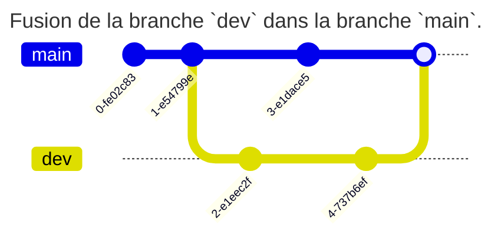
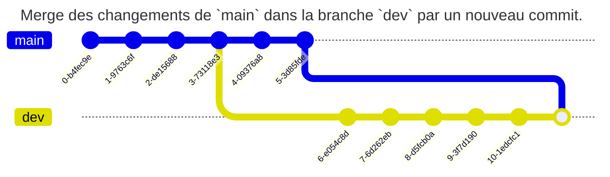

```plantuml
@startditaa

    +-------------------+    +---------+    +------------+
    | cBLK              |    | cYEL    |    | {s} cBLU   |
    | Working Directory |    | Staging |    | Dépôt .git |
    +-------------------+    +---------+    +------------+
                 |                 |               |
                 |                 |               |
                 |---------------->|               |
   /----------+  |     git add     |               |
   |{d} cPNK  |  |                 |               |
   |  Fichier |  |                 |               |
   |          |  |                 |               |
   |   AaBbC  |  |                 |               |
   |   01234  |  |                 |-------------->|
+--|   AaBbC  |  |                 |   git commit  |
|  +----------+  |                 |               |
|      ^         |                 |               |
|      |         |<--------------------------------|
+------+         |       git checkout / merge      |
Changements      |                 |               |
locaux           |                 |               |

= Les différentes zones de travail de git

@endditaa
```

```plantuml
@startditaa

+-------------+   +---------------+
| {s} cGRE    |   | {s} cBLU      |
| Dépôt local |   | Dépôt distant |
+-------------+   +---------------+
       |                   |
       | /------+          |
       | |{d}   |          |
       | |cGRE  |          |
       | |Commit|=========>|
       | +------+ git push |
       |                   |
       |                   |
       |                   |
       |          /------+ |
       |          |{d}   | |
       |          |cBLU  | |
       |<=========|Commit| |
       | git pull +------+ |
       |                   |

= Synchronisation dépôt local & distant

@endditaa
```

```mermaid
---
title: Une branche `dev` isolée de la branche `main` avant stablilisation.
---

gitGraph
commit
commit
branch dev
commit
checkout main
commit
checkout dev
commit
```

## 📜 Introduction

- `git` : gestionnaire de versions (_Linus Torvalds, 2005_) 📜
- Gère tout type de **fichier** mais surtout du code source 📂
- Autres gestionnaires de versions : `mercurial`, `cvs`, ... (`git` largement majoritaire aujourd'hui) 📜

---

### 🔄 Versionner son code source

Versionner son code source permet : 🔄
- D'identifier, isoler et documenter les changements apportés dans le code 📝
- De visualiser l'historique des changements et opérer un retour arrière 🔄
- D'intégrer des changements, y compris de manière concurrente et non linéaire 🔄

---

### 🏗️ Infrastructure-as-Code (IaC)

- Fichiers texte de configuration : idéal pour environnements `GNU/Linux` ; 📄
- Scripts de déploiement et de configuration : `Python`, ... ; 🐍
- Outils d'IaC type `Ansible` ou `Puppet` : stock les fichiers de déploiements (`playbook`, ...) 📄

---

### 📜 Versioning de documentation

- `Git` est orienté _texte brut_ ; 📜
- Parfaitement adapté aux documentations type `Markdown` ; 📄
- Permet de gérer un wiki très simplement ! 📚

---

### 💾 Stocker et échanger des données

- Permet de stocker et échanger facilement de la donnée texte : `CSV`, ... 📂
- À combiner avec un outil de visualisation de données : `Grafana`, ... 📊
- Le versioning de code source est **indispensable** à tout projet, y compris pour un travail individuel ! 🔄
- De plus en plus utilisé en administration système : _DevOps_, _CI/CD_, ... 🏗️

:::tip
À titre personnel, je gère même mes fichiers de configuration système (dotfiles) sous git 📂
:::

---

### 🏗️ Exemple : Windows

- 3.5M files
- 300GB repository
- 4,000 active developers
- 8,421 pushes per day (on average)
- 4,352 active topic branches

Tout en Git ! <https://devblogs.microsoft.com/bharry/the-largest-git-repo-on-the-planet> 🔗

---

## 📌 Présentation de Git

---

### 🔄 Principe de fonctionnement

`git` est un gestionnaire de versions **décentralisé** (ou distribué) : 🔄
- 1 copie = 1 nouveau dépôt complet avec l'historique des changements 📜
- En général, un serveur distant héberge la version la plus à jour des intégrations 🌐
- Possibilité d'infrastructures très complexes, par exemple plusieurs références distantes (`upstream`) non cohérentes 🌐

- Les versions des fichiers sont stockées dans un dépôt (`repository`) local et/ou distant (similaire à une base de données). 📂
- Le projet est disponible dans le répertoire de travail (`working directory`). 📁
- Pour intégrer un changement, il faut le placer en zone d'attente (`staging area`) par une opération d'ajout `add`. 📥
- Les fichiers en `staging` sont ajoutés à la prochaine version par une opération de `commit`. 📤

---



---



---

### 📌 Le commit

- Instantané créé depuis le `staging` à un moment donné. 📸
- Notion fondamentale pour le versioning des fichiers. 🔄
- **Immuable** : la version identifiée sera récupérable à n'importe quel moment et sera toujours la même.

Le dépôt est surtout un ensemble de commits. 📦

---

Un commit est constitué de 📌:

- d'un `hash` (son identifiant) 🔢
- d'une date 📅
- d'un auteur (nom, mail) 👤
- d'un message entré par son auteur 📝
- (d'une signature par clé) 🔑

```
commit 520ace1a3e6c33a4c2e06213340ed194e51d2cc8
Author: Tom Avenel <tom@avenel.pro>
Date:   Mon Nov 27 12:47:48 2023 +0100

    [git] TP IDE
```

---

## Comment utiliser Git ? 🚀

---

### Pourquoi Git et Github ? 🤔

`Git` et `GitHub` sont deux technologies différentes parfois confondues 🧠  
- `git` est un gestionnaire de versions : il sert à créer un dépôt local et à gérer des versions de fichiers 🗂️  
- `GitHub` est un service en ligne qui va héberger ce dépôt à distance : c'est donc un service de type Cloud SaaS de `git` ☁️  
  (et d'autres services utiles sur ce dépôt : revue de code 👀, intégration continue 🔁, ...)

---

Il existe d'autres services de Cloud `git` :  
- `Bitbucket` 🪣  
- Des versions open-source : `GitLab` 🦊, `Sourcehut` 🏡, ...

---

### Pourquoi utiliser un dépôt public ? 🌍

- Le dépôt public permet d'utiliser un dépôt comme référence commune à tous les développeurs 👥  
- Permet un travail collaboratif : les développeurs intègrent leurs modifications et récupèrent celles des autres 🔄  
- Pour un travail individuel : le dépôt distant permet d'indexer, de sauver et d'archiver ses différents projets 💾

---

### Que mettre dans un dépôt git ? 📁

Un dépôt git sert à centraliser des données (majoritairement du code source 💻) entre plusieurs développeurs :  
il ne doit donc contenir que des données **universelles** 🌐 :

- ❌ pas de binaires compilés  
- ❌ pas de fichiers temporaires  
- ❌ pas de configuration spécifique à un développeur

---

### Bonnes pratiques de commit ✅

- Commits simples et fréquents 🔁 
- Texte du commit clair et précis (pas uniquement "correction", "bug", ...) ✍️  
- Format commun de messages de commit (par exemple [BUG], [FEATURE], ... ) 🏷️  
  👉 <https://www.conventionalcommits.org/fr/>

---

## Les branches 🌿

---

### Notion de branches 🧵

Dans `git`, une branche n'est qu'un pointeur vers une liste chaînée d'identifiants de commit 🔗  
C'est ainsi que sont gérés les historiques de commit 📜

Créer une nouvelle branche, c'est donc créer une nouvelle histoire dans l'historique depuis le commit courant,  
qui sera indépendante de l'histoire de l'ancienne branche 🧬

La `HEAD` est un pointeur spécial qui référence le commit courant dans la branche courante 🎯

---

```
               dev <- HEAD
              /
c1 <- c2 <- c3
```

_La branche courante `dev` comporte 3 commit_

---

```
                     dev <- HEAD
                    /
c1 <- c2 <- c3 <- c4
```

_Un nouveau commit `c4` vient d'être ajouté à la branche `dev`_

---

### Isolation par branches 🧪🌿

Travailler sur une branche permet d'isoler un développement spécifique sans impacter la branche principale (`main`, `master`, ...) 🧩

Cela permet :

- d'expérimenter sans risque 💡
- de corriger un bug sans bloquer d'autres évolutions 🐞
- de développer une nouvelle fonctionnalité en parallèle 🆕
- de faciliter les revues de code 🔍

Une fois le travail terminé, la branche peut être **fusionnée** (`merge`) dans une autre branche 🔀

---


_Un projet avec deux branches : `stable-v1` pour les hotfix dans la version stable v1, `dev-v2` pour la version 2 en développement._

---

### Fusion de branches 🔀✨

Lorsque le développement dans une branche est terminé, on peut le fusionner (`merge`) dans une autre branche (souvent `main`) 🧵➡️🌳

Cela permet :

- d'intégrer les modifications apportées dans la branche de développement ✅
- de garder un historique clair et structuré 🗂️
- de conserver l’isolation jusqu’au moment voulu 🔒➡️🔓

Ce comportement permet par exemple d'isoler une branche de développement avant de l'intégrer dans la branche principale :

---





---

### Le merge 🧩

L'opération la plus simple pour fusionner une branche `dev` avec une branche `main` consiste à réaliser une fusion (`merge`) des changements de `dev` dans `main` pour les intégrer 🔧➡️🌳

Techniquement, il s'agit de réaliser un nouveau commit dans la branche `dev` qui va intégrer les différences réalisées dans `main` depuis la dernière fusion 📥🆕

---

Cette opération est **non-destructive** 🛡️ et permet de repérer quand les changements ont été fusionnés 🕵️‍♂️📆



---

### Le rebase 🔄

L'opération de `merge` a un inconvénient : elle pollue l'historique avec des commits de merge 🧱🌀

Une autre solution consiste à effectuer un `rebase` afin de **déplacer la chaîne de commit** d'une branche à la suite d'une autre 🔁📈

Cette solution permet :
- de garder l'historique de `dev` 📜  
- d'obtenir une **histoire linéaire** 🪄📏

Elle supprime cependant la vision explicite de la fusion 👀❌et est potentiellement à risque ⚠️ (réécriture d'historique 📝🧨)

---


**Pas de rebase d'une branche publique comme `main` : risque de désynchronisation avec les autres développeurs**

---

### Merge vs Rebase ✅

👉 Utiliser `merge` dans les cas suivants :
- Pour conserver l’historique des branches 📚  
- Lorsqu’on travaille en équipe sur une même branche 🔄👥  
- Pour garder une trace explicite des fusions 🔍

👉 Utiliser `rebase` dans les cas suivants :
- Pour nettoyer un historique avant une fusion finale 🧼🧵  
- Pour garder un historique linéaire plus lisible 📏 
- Sur des branches locales, avant un `push` 🖥️➡️☁️

⚠️ Éviter le `rebase` sur des branches déjà partagées avec d'autres développeurs 🚫🤝 (risque de conflits et perte de synchronisation !)

---

### Fast-forward ⏩🌿

- Stratégie de fusion si la branche cible ne contient **aucun commit supplémentaire** que la branche source 🚫➕ 
- Simple **déplacement de pointeur** vers le dernier commit de la branche source 🎯📍  
- Évite la création d’un _merge commit_ ❌🔀


```
A---B (main)
     \
      C---D (feature)

A---B---C---D (main, feature)
```

---

