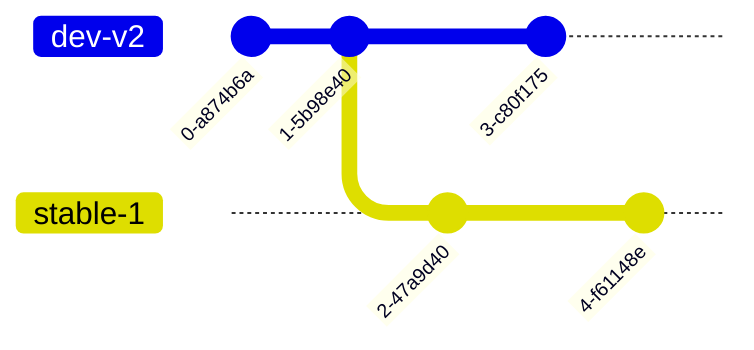
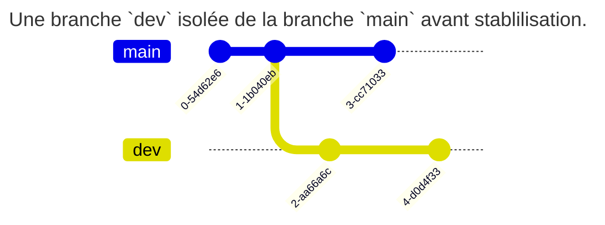
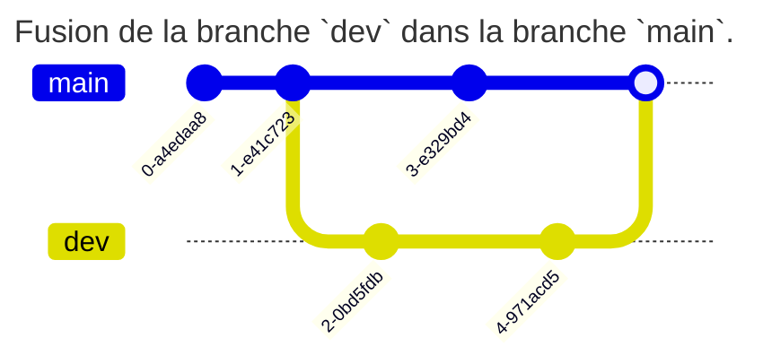

# Introduction

- `git` : gestionnaire de versions (_Linus Torvalds, 2005_)
- Gère tout type de **fichier** mais surtout du code source

- Autres gestionnaires de versions : `mercurial`, `cvs`, ... (`git` largement majoritaire aujourd'hui)

---

# Versionner son code source

Versionner son code source permet :

- D'identifier, isoler et documenter les changements apportés dans le code
- De visualiser l'historique des changements et opérer un retour arrière
- D'intégrer des changements, y compris de manière concurrente et non linéaire

---

# Infrastructure-as-Code (IaC)

- Fichiers texte de configuration : idéal pour environnements `GNU/Linux` ;
- Scripts de déploiement et de configuration : `Python`, ... ;
- Outils d'IaC type `Ansible` ou `Puppet` : stock les fichiers de déploiements (`playbook`, ...)

---

# Versioning de documentation

- `Git` est orienté _texte brut_ ;
- Parfaitement adapté aux documentations type `Markdown` ;
- Permet de gérer un wiki très simplement !

---

# Stocker et échanger des données

- Permet de stocker et échanger facilement de la donnée texte : `CSV`, ...
- À combiner avec un outil de visualisation de données : `Grafana`, ...

---

- Le versioning de code source est **indispensable** à tout projet, y compris pour un travail individuel !
- De plus en plus utilisé en administration système : _DevOps_, _CI/CD_, ...
- A titre personnel, je gère même mes fichiers de configuration système (dotfiles) sous git

---

# Exemple : Windows

- 3.5M files
- 300GB repository
- 4,000 active developers
- 8,421 pushes per day (on average)
- 4,352 active topic branches

Tout en Git ! <https://devblogs.microsoft.com/bharry/the-largest-git-repo-on-the-planet>

---
layout: section
---

# Présentation de Git

---

# Principe de fonctionnement

`git` est un gestionnaire de versions **décentralisé** (ou distribué) :

- 1 copie = 1 nouveau dépôt complet avec l'historique des changements
- En général, un serveur distant héberge la version la plus à jour des intégrations
- Possibilité d'infrastructures très complexes, par exemple plusieurs références distantes (`upstream`) non cohérentes

---

- Les versions des fichiers sont stockées dans un dépôt (`repository`) local et/ou distant (similaire à une base de données).
- Le projet est disponible dans le répertoire de travail (`working directory`).
- Pour intégrer un changement, il faut le placer en zone d'attente (`staging area`) par une opération d'ajout `add`.
- Les fichiers en `staging` sont ajoutés à la prochaine version par une opération de `commit`

---


---


---

# Le commit

- Instantané créé depuis le `staging` à un moment donné.
- Notion fondamentale pour le versioning des fichiers.
- **Immuable** : la version identifiée sera récupérable à n'importe quel moment et sera toujours la même.

Le dépôt est surtout un ensemble de commit.

---

Un commit est constitué :

- d'un `hash` (son identifiant)
- d'une date
- d'un auteur (nom, mail)
- d'un message entré par son auteur
- (d'une signature par clé)

```
commit 520ace1a3e6c33a4c2e06213340ed194e51d2cc8
Author: Tom Avenel <tom@avenel.pro>
Date:   Mon Nov 27 12:47:48 2023 +0100

    [git] TP IDE
```

---
layout: section
---

# Comment utiliser Git ?

---

# Pourquoi Git et Github ?

`Git` et `GitHub` sont deux technologies différentes parfois confondues

- `git` est un gestionnaire de versions : il sert à créer un dépôt local et à gérer des versions de fichiers.
- `GitHub` est un service en ligne qui va héberger ce dépôt à distance : c'est donc un service de type Cloud SaaS de `git` (et d'autres services utiles sur ce dépôt : revue de code, intégration continue, ...).

---

Il existe d'autres services de Cloud `git` : `Bitbucket`, et des versions open-source : `GitLab`, `Sourcehut`, ...

---

# Pourquoi utiliser un dépôt public ?

- Le dépôt public permet d'utiliser un dépôt comme référence commune à tous les développeurs.
- Permet un travail collaboratif : les développeurs intègrent leurs modifications et récupèrent celles des autres
- Pour un travail individuel : le dépôt distant permet d'indexer, de sauver et d'archiver ses différents projets

---

# Que mettre dans un dépôt git ?

Un dépôt git sert à centraliser des données (majoritairement du code source) entre plusieurs développeurs : il ne doit donc contenir que des données **universelles** :

- pas de binaires compilés
- pas de fichiers temporaires
- pas de configuration spécifique à un développeur

---

# Bonnes pratiques de commit

- Commit simples et fréquents
- Texte du commit clair et précis (pas uniquement "correction", "bug", ...)
- Format commun de messages de commit (par exemple [BUG], [FEATURE], ... ) : <https://www.conventionalcommits.org/fr/>

---
layout: section
---

# Les branches

---

# Notion de branches

Dans `git`, une branche n'est qu'un pointeur vers une liste chaînée d'identifiants de commit. C'est ainsi que sont gérés les historiques de commit.

Créer une nouvelle branche, c'est donc créer une nouvelle histoire dans l'historique depuis le commit courant, qui sera indépendante de l'histoire de l'ancienne branche.

La `HEAD` est un pointeur spécial qui référence le commit courant dans la branche courante.

---

```
               dev <- HEAD
              /
c1 <- c2 <- c3
```

_La branche courante `dev` comporte 3 commit_

---

```
                     dev <- HEAD
                    /
c1 <- c2 <- c3 <- c4
```

_Un nouveau commit `c4` vient d'être ajouté à la branche `dev`_

---

# Isolation par branches

L'intérêt des branches est donc de pouvoir isoler du code pendant un temps avant de le fusionner si nécessaire.



_Un projet avec deux branches : `stable-v1` pour les hotfix dans la version stable v1, `dev-v2` pour la version 2 en développement._

---

# Fusion de branches

Ce comportement permet par exemple d'isoler une branche de développement avant de l'intégrer dans la branche principale :

---





---

# Merge vs rebase

## Le merge

L'opération la plus simple pour fusionner une branche `dev` avec une branche `main` consiste à réaliser une fusion (`merge`) des changements de `dev` dans `main` pour les intégrer.

Techniquement, il s'agit de réaliser un nouveau commit dans la branche `dev` qui va intégrer les différences réalisées dans `main` depuis la dernière fusion.

---

Cette opération est non-destructive et permet de repérer quand les changements ont été fusionnés.


---

## Le rebase

L'opération de `merge` a un inconvénient, elle pollue l'historique avec des commit de merge.

Une autre solution consiste à effectuer un `rebase` afin de déplacer la chaîne de commit d'une branche à la suite d'une autre.

Cette solution permet de garder l'historique de `dev` et une unique histoire linéaire. Elle supprime cependant la vision de la fusion et est potentiellement à risque (réécriture d'historique).

---


**Pas de rebase d'une branche publique comme `main` : risque de désynchronisation avec les autres développeurs**

---

# fast-forward

- stratégie de fusion si la branche cible ne contient aucun commit supplémentaire que la branche source
- Simple déplacement de pointeur vers le dernier commit de la branche source
- Évite la création d'un _merge commit_

```
A---B (main)
     \
      C---D (feature)

A---B---C---D (main, feature)
```

---

