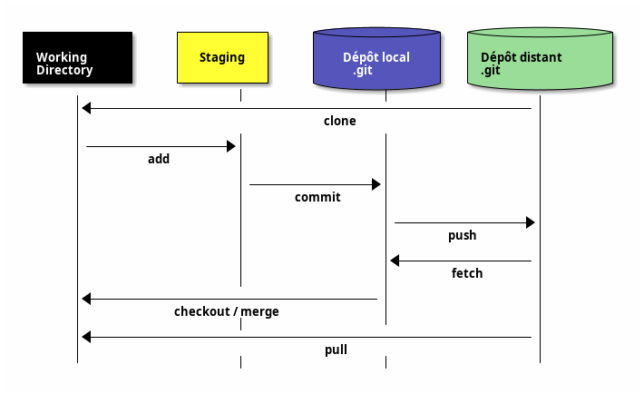

## Alternatives à la ligne de commandes 🖱️💻

---

### Interfaces graphiques 🖼️👁️

- Il existe de nombreuses interfaces graphiques pour `git` permettant de réaliser les opérations visuellement 👆  
- La présence d’un **graphe des branches** est souvent bien plus intuitive lors d’intégrations complexes 🧠🧬

Des interfaces graphiques en ligne de commandes existent également :  

- `tig` 🧵  
- `lazygit` 😌📟

---

### Sourcetree® 🌳🧰

![L'interface graphique Sourcetree®][sourcetree-ui]

<div class="caption">L'interface graphique Sourcetree®.</div>

---

### GitKraken® 🐙⚓

![L'interface graphique GitKraken®.][gitkraken-ui]

<div class="caption">L'interface graphique GitKraken®.</div>

---

### Intégration dans un IDE 🧠🔧

- Il est également possible d’intégrer `git` directement dans un IDE 🛠️  
- La plupart des IDE sont capables de **détecter automatiquement** un dépôt `git` 🧲  

:::tip
👉 Bien penser à ouvrir le **répertoire principal** du dépôt, celui contenant le répertoire `.git` 📂
:::

---

Intégrer `git` dans un IDE permet : 🚀  

- d’afficher en temps réel les changements apportés au code source 📝🔍  
- de trouver des informations (commit log, développeur, numéro de bug, ...) sur un changement déjà apporté dans le code 🔎📖

---

## `.gitignore` 🙈📄

- Le fichier spécial `.gitignore` (à placer directement dans le répertoire de travail de Git, sans sous-dossier)  permet de **lister des chemins de fichiers à ignorer** lors d’un `git checkout` 🚫📂  
- 👉 Ces fichiers deviennent invisibles pour git 👻

:::link
🧪 Voir le TP correspondant.
:::

---

## Hooks 🪝⚙️

- Permettent d’exécuter des scripts _avant_ (`pre-*`) ou _après_ (`post-*`) des commandes ⏳🖇️  
  - côté _client_ : `pre-commit` 🖊️  
  - côté _serveur_ : `pre-receive` 🛎️

---

- À mettre dans le répertoire `.git/hooks` 📁🔩  
  - fichiers d’exemples : `.git/hooks/*.sample` 🧪  
  - en cas d’erreur (`code de retour != 0`), la commande n’est pas exécutée ❌🚫

---

### Exemple 🔍

`pre-commit` pour **refuser un commit** si un fichier `WIP` est trouvé ❗🛑📄 :

```sh
!/bin/bash

[ -f WIP ] && echo "WIP found : commit refused" > /dev/stderr && exit 1
```

---

## Multi-repo vs Mono-repo 🆚📂

- **Multi-repo** 🧱 :
  - Adapté aux équipes fonctionnelles séparées 👥🔄  
  - Livrables ayant leur propre cycle de vie 📦⏳

- **Mono-repo** 🏗️ :
  - Adapté à un livrable conséquent 💼  
  - Inclut plusieurs briques distinctes 🧩

---

## Gist ✨📝

- Service GitHub pour partager simplement :
  - extraits de code 💻  
  - notes 🗒️  
  - listes de tâches ✅

- Besoin seulement d'une **URL secrète** 🔐 : facilite l'automatisation 🤖  
- Techniquement : **vrai dépôt Git**, mais usage limité via l’interface Web 🌐

---

## Submodules 🧬📁

- Permettent d’inclure un **autre dépôt Git** dans un dépôt principal 🔗  
  (ex : dépendance partagée)

- Fichier `.gitmodules` 📄  
- `git submodule add <URL_du_dépôt_sous_module> <chemin/dossier>` ➕
- `git clone --recurse-submodules <URL>` : clone tout 🌳  
- `git submodule update --remote` 🔄

---

## Worktree 🌲👷‍♀️

- `git worktree` crée plusieurs répertoires de travail pour un même dépôt 🧰  
- Permet de travailler **simultanément sur plusieurs branches** 🔄🧠

- Utile avec `git --bare` pour créer un dépôt **central** 🏛️ (nu) à partir duquel on peut créer et gérer ces répertoires de travail. 
- Exemple : `git worktree add ../mon-projet-feature feature-branch` 🛠️
- Chaque worktree est **indépendant** 🔐  
  => vous pouvez y faire des commits sans impacter les autres répertoires de travail 🧪

---


<div class="caption">🧠 Résumé visuel des commandes Git</div>

---

## Quelques commandes avancées ⚙️💡

- `git checkout <other-branch-name> -- path/to/your/folder/or/file`
- `git log --oneline --decorate --graph` => log minimal
- `git config --global alias.lola "log --graph --decorate --pretty=oneline --abbrev-commit --all"` => crée l'alias `git lola` pour afficher un graphe des commit
- `git log -p` => log avec diff
- `git commit -S` et `git config --global user.signingkey <gpg_key_id>` => utilisation de commit signés
- `git clone --depth=1` : clone seulement le dernier commit
- `git clone --filter=blob:none` : ne pas cloner les blobs (seulement l'historique)

---

- `git gc --aggressive` => réduire la taille d'un dépôt par un garbage collector aggressif
- `git -c gc.reflogExpire=0 -c gc.reflogExpireUnreachable=0 -c gc.rerereresolved=0 -c gc.rerereunresolved=0 -c gc.pruneExpire=now gc` : garbage collector très aggressif
- `git sparse-checkout set [dir1] [dir2] …` pour faire du lazy-checkout de fichiers (utile en monorépos).
- `git bisect` : crée un arbre binaire de recherche pour trouver un commit en particulier (utile pour trouver la cause d'un bug)
- `git restore` et `git switch` (2019) : sépare `git checkout` en 2 commandes pour séparer les responsabilités
  - `git switch feature/A` : change de branche
  - `git restore --source feature/B -- utils.js` : restaure le working tree
- `git merge --ff-only -` : `--ff-only` (fast-forward) : ne pas créer de commit pour le merge, `-` : dernière branche de checkout

---

- `git commit --fixup=[sha]` : crée un commit qui corrige un autre commit (en référence)
  - `git rebase --autosquash` : rebase en écrasant (`squash`) automatiquement les commits de `fixup`.
  - `git commit --fixup=reword:[sha]` change aussi le message du commit d'origine.
  - `git commit --fixup=amend:[sha]` change aussi le contenu du commit d'origine.
- `git push --force` : MAJ forcée de la branche - écrase les contributions sur la branche distante non récupérées !
- `git push --force-with-lease` : vérification contre les écrasements accidentels (pas de nouveaux commits ajoutés à distance depuis le dernier `fetch` / `pull`).

---

- Retrouver des commits perdus : `git reflog` && `git checkout` && `git cherry-pick <commit-id>`
- Blame et log sur certaines lignes seulement : `git blame -L 20,40 my_file` et `git log -L20,40:my_file`
- Blame sur un block en suivant un `PATTERN` : `git blame -L :'PATTERN' my_file` et `git blame -L :'class MyClass' MyClass.java`
- Blame en ignorant les espaces et sauts de ligne : `git blame -w`
-  Scheduler une optimisation du dépôt : `git maintenance` et `git maintenance run`

---

- Suivre les fichier(s) / block(s) à travers : 
  - Le commit courrant : `git blame -C …`
  - Le commit courrant vs le commit ayant créé le fichier : `git blame -C …`
  - Tous les commits (très utile) : `git blame -C -C -C …`
- Code churn : `git log --pretty='' --date=short --numstat`
- Nuage de mots extraits des messages de commits : `git log --pretty=format:'%s' | tr ' ' '\n' | sed 's/.*/\L&/' | sort | uniq -c | sort -rg | head -n 100`

---

## Résumé



---

## Commandes utiles

1. `git rev-parse --show-toplevel` : Vérifier le répertoire parent contenant le dossier `.git`
2. `git add -p` : Ajoutez des modifications partie par partie. Idéal pour des commits propres et ciblés.
3. `git commit mon_fichier` : Ignore les changements en staging et crée un commit contenant la version actuelle d'un fichier déjà connu
4. `git commit -a` : Ajoute au staging les états actuels de tous les fichiers déjà connus par Git et en crée un commit.
5. `git commit --amend` : Modifiez votre dernier commit : corriger un message, ajouter un fichier oublié.

---

6. `git reset --soft HEAD~1` : Annulez le dernier commit en conservant vos modifications. ⚠️  Attention avec l'option `--hard` qui supprime définitivement les modifications
7. `git stash / git stash pop` : Mettez de côté vos modifications temporairement. Idéal pour switcher rapidement de branche.
8. `git cherry-pick <commit-hash>` : Appliquez un commit spécifique d'une autre branche.
9. `git branch -d <branch-name>` : Nettoyez vos branches locales inutilisées.
10. `git log -- <file>` : Visualisez l'historique d'un fichier spécifique (attention à l'espace après `--`).

---

11. `git blame <filename>` : Identifiez qui a modifié chaque ligne de code.
12. `git bisect` : Trouvez le commit qui a introduit un bug grâce à une recherche dichotomique.
13. `git merge --abort` : Annulez une fusion problématique.
14. `git log --grep="xxx"` : Recherchez dans les messages de commit.
15. `git tag -a v1.0 -m "Version 1.0"` : Marquez les moments importants de votre projet avec des tags.

---

16. `git clean -fd` : Nettoyez votre espace de travail. ⚠️utilisez d'abord `git clean -n` pour prévisualiser les suppressions
17. `git reflog` : Visualisez l'historique de toutes les opérations Git.
18. `git rebase -i HEAD~<n>` : Réorganisez vos commits. ⚠️ À éviter sur des branches partagées.
19. `git revert <commit-hash>` : Annulez proprement un commit sans réécrire l'historique.
20. `git fetch --all --prune` : Synchronisez et nettoyez votre repo en une commande.

---

21. `git log --graph --oneline --all` : Visualisez graphiquement l'historique de toutes vos branches.
22. `git log --name-status` : Affiche le nom des fichiers modifiés (et leur status, sinon `--name-only`)
23. `git log --source --all` : Ajoute l'information de branche pour chaque commit
24. `git diff --staged` : Examinez les modifications qui sont dans la staging area avant de commiter.
25. `git show <commit-hash>` : Affichez les détails complets d'un commit spécifique.
26. `git archive` : crée une archive contenant les fichiers d'un commit ou d'une branche sans inclure l'historique Git

---

## Ressources

---

### Cours

- Livre officiel et gratuit : <https://git-scm.com/book/>
- [Exercices interactifs en ligne][learn-git-branch]
- [Documentation et pages de manuel officiels][git-scm]
- [Git Cheatsheet de GitHub Education][github-cheatsheet]
- [Git Cheatsheet interactive de NDP Software][ndp-cheatsheet]
- [L'essentiel de Git & Gitlab pour les débutants](https://frenchtechlead.com/posts/tech/20201023-git-pour-debutant/)
- [Cours en ligne OpenClassrooms - 1][openclassrooms1]
- [Cours en ligne OpenClassrooms - 2][openclassrooms2]
- [Sylvain Bouveret, Grégory Mounié, Matthieu Moy : Git Workflows (cours Ensimag)][ensimag-git-workflows]
- [Sylvain Bouveret, Grégory Mounié : Git Comprendre le modèle de données (Exercices)][ensimag-git-modele-donnees-tp]
- [Pierre-Antoine Champin : Introduction à Git][pa-champin]

---

### Merge et Rebase

- Exemple de repo avec un conflit de merge à gérer : <https://github.com/redguardtoo/test-git-mergetool>
- <https://alchemists.io/articles/git_rebase>
- [Advanced Git rebase techniques (youtube, Andrew Courter)](https://www.youtube.com/watch?v=OdFW1embsHw)
- [Git Merge vs Git Rebase (youtube, Andrew Courter)](https://www.youtube.com/watch?v=YMBhhje-Sgs)
- [Explication poussée des opérations merge vs rebase][atlassian-merge-rebase]

---

### Workflows

- [Tutoriels en ligne Git et workflows tous niveaux][atlassian-tutos]
- [Comparaisons des principaux workflows Git][atlassian-workflows]
- [Comparaison des workflows Github et Gitlab et proposition de nouveau workflow (lafor.ge)][laforge-workflows]

---

### Versioning sémantique, conventions et bonnes pratiques

- <https://semver.org/> et <https://calver.org/> : Versioning Sémantique
- <https://www.conventionalcommits.org/en/v1.0.0/> : Convention commune d'écriture de commits
- <https://bearstech.com/blog/les-bonnes-pratiques-du-gitflow-avec-gitlab>
- [Pourquoi écrire des commits atomiques](https://dev.to/samuelfaure/how-atomic-git-commits-dramatically-increased-my-productivity-and-will-increase-yours-too-4a84)

---

### Git avancé

- <https://alchemists.io/articles/git_commit_anatomy>
- <https://alchemists.io/articles/git_for_each_ref>
- <https://alchemists.io/articles/git_trailers>
- <https://alchemists.io/articles/git_notes>
- [Git metadata cloning : cloner partiellement un dépôt (alchemists.io)](https://alchemists.io/articles/git_metadata_cloning)
- [Inside .git : structure interne de Git](https://jvns.ca/blog/2024/01/26/inside-git/)
- <https://thevaluable.dev/complexity-metrics-environment/> : data mining dans les métadatas git
- [Exemple de réécriture d'historique][zds-refaire-histoire]

---

### Autres

- <https://blog.gitbutler.com/git-tips-and-tricks/>
- [Exemple de création d'un nouveau dépôt depuis un dépôt existant][zds-nouveau-depot-existant]
- [Documentation sur les hooks][git-hooks] et [exemples pour les Ops](https://blog.wescale.fr/vers-linfrastructure-craftsmanship-avec-les-git-hooks)
- [Utiliser git pour gérer ses dotfiles (atlassian)](https://www.atlassian.com/fr/git/tutorials/dotfiles) et [Armand Philippot](https://www.armandphilippot.com/article/dotfiles-git-fichiers-configuration)
- <https://alchemists.io/articles/git_configuration>
- [A Git story: Not so fun this time (les origines de Git)](https://blog.brachiosoft.com/en/posts/git/)

[learn-git-branch]: https://learngitbranching.js.org/?locale=fr_FR
[git-scm]: https://git-scm.com/doc
[github-cheatsheet]: https://training.github.com/downloads/fr/github-git-cheat-sheet/
[ndp-cheatsheet]: https://ndpsoftware.com/git-cheatsheet.html
[openclassrooms1]: https://openclassrooms.com/fr/courses/7162856-gerez-du-code-avec-git-et-github
[openclassrooms2]: https://openclassrooms.com/fr/courses/5641721-utilisez-git-et-github-pour-vos-projets-de-developpement
[atlassian-tutos]: https://www.atlassian.com/fr/git/tutorials
[atlassian-workflows]: https://www.atlassian.com/fr/git/tutorials/comparing-workflows
[atlassian-merge-rebase]: https://www.atlassian.com/fr/git/tutorials/merging-vs-rebasing
[zds-refaire-histoire]: https://zestedesavoir.com/tutoriels/379/refaire-lhistoire-avec-git/
[zds-nouveau-depot-existant]: https://zestedesavoir.com/tutoriels/415/git-creer-un-nouveau-depot-a-partir-dun-dossier-dun-autre-depot/
[git-hooks]: https://git-scm.com/book/en/v2/Customizing-Git-Git-Hooks
[ensimag-git-workflows]: https://git.pages.ensimag.fr/formation-git/slides/git-workflow-slides.pdf
[ensimag-git-modele-donnees-tp]: https://mounieg.gricad-pages.univ-grenoble-alpes.fr/formation-git/tp/tp2-modele-git.pdf
[laforge-workflows]: https://lafor.ge/gitworkflow/
[pa-champin]: https://perso.liris.cnrs.fr/pierre-antoine.champin/enseignement/intro-git/

[git-logo]: https://git-scm.com/images/logos/downloads/Git-Logo-1788C.svg "The Git logo"
[sourcetree-ui]: https://wac-cdn.atlassian.com/dam/jcr:580c367b-c240-453d-aa18-c7ced44324f9/hero-mac-screenshot.png?cdnVersion=542 "Sourcetree UI"
[gitkraken-ui]: https://www.gitkraken.com/wp-content/uploads/2022/10/1-visual-commit-graph-1600x900-1-1024x576.png.webp "Gitkraken UI"

---

## Legal

- [Git Logo](https://git-scm.com/images/logos/downloads/Git-Logo-2Color.svg) by [Jason Long](https://twitter.com/jasonlong) is licensed under the [Creative Commons Attribution 3.0 Unported License](https://creativecommons.org/licenses/by/3.0/).
- Git and the Git logo are either registered trademarks or trademarks of Software Freedom Conservancy, Inc., corporate home of the Git Project, in the United States and/or other countries
- Other names may be trademarks of their respective owners

