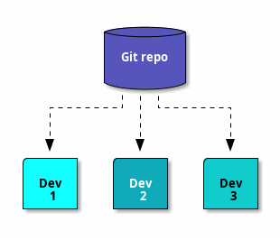
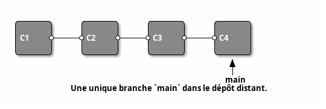
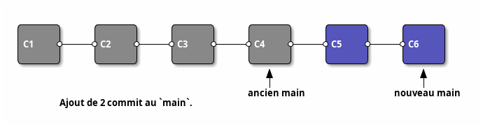
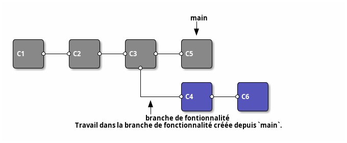
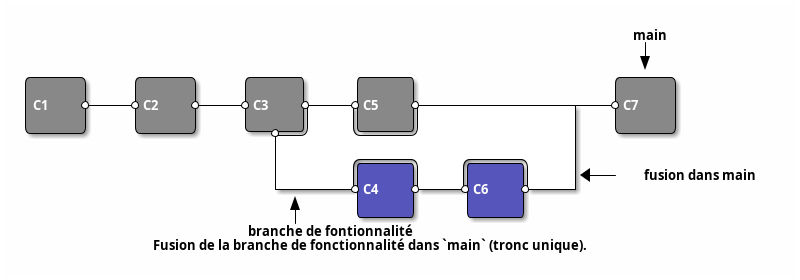
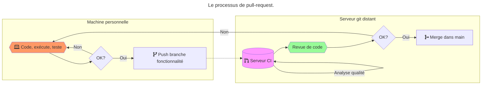
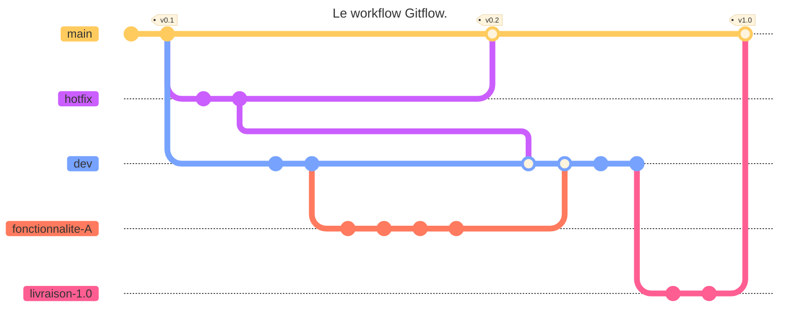
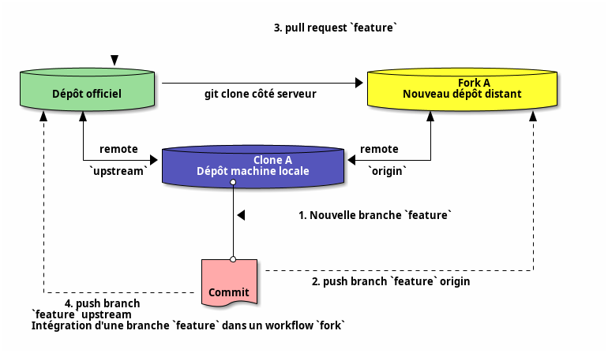

# Workflow

- Workflow Git : processus cohérent d'utilisation de Git pour réaliser une tâche, généralement Devops
- Rationalise l'utilisation du ou des dépôt(s) distant(s)
- Permet de se comprendre entre développeurs, process à formaliser en équipe

---

# Workflow centralisé

---

- Workflow simple : un seul dépôt distant - une branche unique
- `pull` à la demande du développeur
- `rebase` conseillé pour éviter de polluer l'historique du `main`
- `push` lorsque les changements sont matures
- Adapté aux petite équipes

---

---

# Workflow branche de fonctionnalité

- Un dépôt centralisé de référence
- Tout nouveau développement (fonctionnalité, bug, ...) dans une nouvelle branche dédiée depuis `main`
- Branche de dev instable appartenant au(x) développeur(s) de la fonctionnalité
- Fusionnée au `main` du dépôt central lorsque le code est stable

---

- Possibilité de test et revue de code : `pull-request` avant fusion
- La branche `main` constitue la version `stable` du projet à chaque instant
- Workflow de référence intégré à tous les workflows modernes

---

---

---

# Pull-request

- Popularisé par GitHub, la `pull-request` ou `merge-request` est aujourd'hui largement répandue en gestion de projet.
- En théorie, simple demande de relecture de code avant l'intégration (`merge`) d'une branche dans une autre.
- En pratique : permet de prévenir l'équipe de la fin d'une partie du produit et engage le processus d'intégration d'une branche spécialisée dans une branche commune, par exemple un pipeline d'intégration continue

---

# Process de pull-request

Étape optionnelle avant d'intégrer la branche de fonctionnalité au `main` du dépôt central :

1. `push` de la branche de dev dans le dépôt central
2. Validation des changements avant fusion : `pull-request`
3. Fusion dans `main` dans le dépôt central

---

---

# Workflow Gitflow

- Branches de fonctionnalité mais plusieurs branches stables d'intégration :
  - `main` pour les versions principales (livrables)
  - `develop` pour l'intégration courante : référence pour création / fusion branches de fontionnalité
- Fusion seulement si fonctionnalité terminée
- Avant livraison d'une version : branche intermédiaire `release` entre `develop` et `main`
- Branches `hotfix` depuis les commit de `main`

---

- Workflow très complexe : permet de gérer tout le cycle de vie du projet
- Généralement abandonné car difficile à gérer en intégration continue / pratiques DevOps.
- Adapté aux livraisons planifiées : intégration au bon moment
- Outil `git-flow` disponible (wrapper `git` avec sémantique Gitflow)

---

---

# Workflow développement basé sur le tronc (trunk)

- Successeur très simplifié de Gitflow
- Développement par branches de fonctionnalité
- Intégrations fréquentes dans un tronc unique `main` dès que le code est stable
- Compatible intégration continue
- Réduit la _feedback loop_

---

# Workflow de duplication (fork)

- Workflow orienté dépôts
  - Un dépôt _officiel_ suivant un process Gitflow
  - Chaque développeur copie (`fork`) le dépôt officiel pour créer un nouveau dépôt distant
- Avantage : intégration de changements sans altérer le dépôt officiel
- Très utilisé en open-source

---

