```plantuml
@startditaa

/-----\    /-----\    /-----\    /-----\
|c888 |    |c888 |    |c888 |    |c888 |
|C1   *----*C2   *----*C3   *----*C4   |
|     |    |     |    |     |    |     |
\-----/    \-----/    \-----/    \-----/
                                    ^
                                    |
                                   main

= Une unique branche `main` dans le dépôt distant.

@endditaa
```

```plantuml
@startditaa

                                   main
                                    |
                                    v
/-----\    /-----\    /-----\    /-----\
|c888 |    |c888 |    |c888 |    |c888 |
|C1   *----*C2   *----*C3   *----*C5   |
|     |    |     |    |     |    |     |
\-----/    \-----/    \--*--/    \-----/
                         |
                         |       /-----\    /-----\
                         |       |cBLU |    |cBLU |
                         +-------*C4   *----*C6   |
                           ^     |     |    |     |
                           |     \-----/    \-----/
                   branche de fontionnalité

= Travail dans la branche de fonctionnalité créée depuis `main`.

@endditaa
```

```mermaid
---
title: Le processus de pull-request.
---

graph LR
  subgraph Machine personnelle
    A1{{fa:fa-laptop-code Code, exécute, teste}}-->A2{OK?}-->|Oui|A3[fa:fa-code-branch Push branche fonctionnalité]
    A2-->|Non|A1
  end

  subgraph Serveur git distant
    A3-.->B1[(fa:fa-code-pull-request Serveur CI)]--Analyse qualité-->B1
    B1-->B2{{Revue de code}}-->B3{OK?}-->|Oui|B4[fa:fa-code-merge Merge dans main]
    B3-->|Non|A1
  end

style A1 fill:#f96;
style B1 fill:#f9f;
style B2 fill:#98fb98;
```

```plantuml
@startditaa

                            3. pull request `feature`
            +-----------------------------------------------------------+
            :                                                           :
            v                                                           :
+----------------+                          +-----------------------+   :
| {s} cGRE       |------------------------->| {s} cYEL Fork A       |===+
| Dépôt officiel |  git clone côté serveur  | Nouveau dépôt distant |
+----------------+                          +-----------------------+
   ^    ^                                           ^            ^
   :    |                                           |            :
   :    |                                           |            :
   :    | remote  +----------------------+ remote   |            :
   :    +-------->| {s} cBLU Clone A     |<---------+            :
   :    `upstream`| Dépôt machine locale | `origin`              :
   :              +--------*-------------+                       :
   :                       |                                     :
   :                       |                                     :
   :                       |<==1. Nouvelle branche `feature`     :
   :                       |                                     :
   :                       |                                     :
   :                       |                                     :
   :                   /---*--+                                  :
   :                   |{d}   |----------------------------------+
   :                   |cPNK  | 2. push branch `feature` origin
   +-------------------|Commit|
    4. push branch     +------+ 
  `feature` upstream

= Intégration d'une branche `feature` dans un workflow `fork`

@endditaa
```

# Workflow 🧩🔄

- Workflow Git : processus cohérent d'utilisation de Git pour réaliser une tâche, généralement Devops 👨‍💻🔧
- Rationalise l'utilisation du ou des dépôt(s) distant(s) ☁️📦
- Permet de se comprendre entre développeurs, process à formaliser en équipe 🧠🤝

---

# Workflow centralisé 🏛️

---

- Workflow simple : un seul dépôt distant 🔗 - une branche unique 🌿  
- `pull` à la demande du développeur 👨‍💻⬇️  
- `rebase` conseillé pour éviter de polluer l’historique du `main` 🧹🕰️  
- `push` lorsque les changements sont matures ✅⬆️  
- Adapté aux petites équipes 👥🔧

---

---

# Workflow branche de fonctionnalité 🌿🔧

- Un dépôt centralisé de référence 📍 
- Tout nouveau développement (fonctionnalité, bug, ...) dans une **nouvelle branche dédiée** depuis `main` 🌱  
- Branche de dev **instable** appartenant au(x) développeur(s) de la fonctionnalité 👩‍💻👨‍💻  
- Fusionnée au `main` du dépôt central lorsque le code est **stable** ✅

---

- Possibilité de test et revue de code : `pull-request` avant fusion 🔍📝 
- La branche `main` constitue la version **stable** du projet à chaque instant 🏆 
- Workflow de référence intégré à tous les workflows modernes 🚀

---

---

---

# Pull-request 🔄📥

- Popularisé par GitHub, la `pull-request` ou `merge-request` est aujourd’hui largement répandue en gestion de projet 🌍 
- En théorie, simple demande de relecture de code avant l’intégration (`merge`) d’une branche dans une autre 👀✅  
- En pratique : permet de prévenir l’équipe de la fin d’une partie du produit et engage le processus d’intégration d’une branche spécialisée dans une branche commune, par exemple un pipeline d’intégration continue 🚦🤝

---

# Process de pull-request 🛠️🔀

Étape optionnelle avant d’intégrer la branche de fonctionnalité au `main` du dépôt central :  

1. `push` de la branche de dev dans le dépôt central ⬆️  
2. Validation des changements avant fusion : `pull-request` ✔️  
3. Fusion dans `main` dans le dépôt central 🎯

---

---

# Workflow Gitflow 🌳⚙️

- Branches de fonctionnalité mais plusieurs branches stables d'intégration :  
  - `main` pour les versions principales (livrables) 🎁  
  - `develop` pour l'intégration courante : référence pour création / fusion branches de fonctionnalité 🔄  
- Fusion seulement si fonctionnalité terminée ✔️  
- Avant livraison d'une version : branche intermédiaire `release` entre `develop` et `main` 📦  
- Branches `hotfix` depuis les commits de `main` 🔥🐞

---

- Workflow très complexe : permet de gérer tout le cycle de vie du projet 🛠️📅  
- Généralement abandonné car difficile à gérer en intégration continue / pratiques DevOps 🚧  
- Adapté aux livraisons planifiées : intégration au bon moment ⏰ 
- Outil `git-flow` disponible (wrapper `git` avec sémantique Gitflow) 🧰

---

---

# Workflow développement basé sur le tronc (trunk) 🌳➡️

- Successeur très simplifié de Gitflow ⚡  
- Développement par branches de fonctionnalité 🌿  
- Intégrations fréquentes dans un tronc unique `main` dès que le code est stable ✅  
- Compatible intégration continue 🔄  
- Réduit la _feedback loop_ 🔁

---

# Workflow de duplication (fork) 🍴🔀

- Workflow orienté dépôts 📂  
  - Un dépôt _officiel_ suivant un process Gitflow 🏛️  
  - Chaque développeur copie (`fork`) le dépôt officiel pour créer un nouveau dépôt distant 📋➡️📤  
- Avantage : intégration de changements sans altérer le dépôt officiel 🔒  
- Très utilisé en open-source 🌐🐙

---

