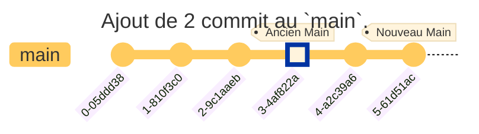

```mermaid
---
title: Une unique branche `main` dans le dépôt distant.
---
%%{init: { 'theme': 'base' } }%%
gitGraph
commit
commit
commit
commit tag: "Main"
```

```mermaid
---
title: Travail dans la branche de fonctionnalité créée depuis `main`.
---
%%{init: { 'theme': 'base' } }%%
gitGraph
commit
commit
commit
branch F1
commit
checkout main
commit
checkout F1
commit
```

```mermaid
---
title: Fusion de la branche de fonctionnalité dans `main` (tronc unique).
---
%%{init: { 'theme': 'base' } }%%
gitGraph
commit
commit
commit
branch F1
commit
checkout main
commit
checkout F1
commit
checkout main
merge F1
```

```mermaid
---
title: Le processus de pull-request.
---

graph LR
  subgraph Machine personnelle
    A1{{fa:fa-laptop-code Code, exécute, teste}}-->A2{OK?}-->|Oui|A3[fa:fa-code-branch Push branche fonctionnalité]
    A2-->|Non|A1
  end

  subgraph Serveur git distant
    A3-.->B1[(fa:fa-code-pull-request Serveur CI)]--Analyse qualité-->B1
    B1-->B2{{Revue de code}}-->B3{OK?}-->|Oui|B4[fa:fa-code-merge Merge dans main]
    B3-->|Non|A1
  end

```

## Workflow 🧩🔄

- Workflow Git : processus cohérent d'utilisation de Git pour réaliser une tâche, généralement Devops 👨‍💻🔧
- Rationalise l'utilisation du ou des dépôt(s) distant(s) ☁️📦
- Permet de se comprendre entre développeurs, process à formaliser en équipe 🧠🤝

---

## Workflow centralisé 🏛️

```mermaid
---
title: Le workflow centralisé
---
graph TD
    subgraph Dépôt central
        A[Git repo]
    end

    subgraph Dev_1
        D1[Repo Dev 1]
    end

    subgraph Dev_2
        D2[Repo Dev 2]
    end

    subgraph Dev_3
        D3[Repo Dev 3]
    end

    A --> D1
    A --> D2
    A --> D3

```

---

- Workflow simple : un seul dépôt distant 🔗 - une branche unique 🌿  
- `pull` à la demande du développeur 👨‍💻⬇️  
- `rebase` conseillé pour éviter de polluer l'historique du `main` 🧹🕰️  
- `push` lorsque les changements sont matures ✅⬆️  
- Adapté aux petites équipes 👥🔧

---





---

## Workflow branche de fonctionnalité 🌿🔧

- Un dépôt centralisé de référence 📍 
- Tout nouveau développement (fonctionnalité, bug, ...) dans une **nouvelle branche dédiée** depuis `main` 🌱  
- Branche de dev **instable** appartenant au(x) développeur(s) de la fonctionnalité 👩‍💻👨‍💻  
- Fusionnée au `main` du dépôt central lorsque le code est **stable** ✅

---

- Possibilité de test et revue de code : `pull-request` avant fusion 🔍📝 
- La branche `main` constitue la version **stable** du projet à chaque instant 🏆 
- Workflow de référence intégré à tous les workflows modernes 🚀

---





---

## Pull-request 🔄📥

- Popularisé par GitHub, la `pull-request` ou `merge-request` est aujourd'hui largement répandue en gestion de projet 🌍 
- En théorie, simple demande de relecture de code avant l'intégration (`merge`) d'une branche dans une autre 👀✅  
- En pratique : permet de prévenir l'équipe de la fin d'une partie du produit et engage le processus d'intégration d'une branche spécialisée dans une branche commune, par exemple un pipeline d'intégration continue 🚦🤝

---

### Process de pull-request 🛠️🔀

Étape optionnelle avant d'intégrer la branche de fonctionnalité au `main` du dépôt central :  

1. `push` de la branche de dev dans le dépôt central ⬆️  
2. Validation des changements avant fusion : `pull-request` ✔️  
3. Fusion dans `main` dans le dépôt central 🎯

---



---

## Workflow Gitflow 🌳⚙️

- Branches de fonctionnalité mais plusieurs branches stables d'intégration :  
  - `main` pour les versions principales (livrables) 🎁 
  - `develop` pour l'intégration courante : référence pour création / fusion branches de fonctionnalité 🔄  
- Fusion seulement si fonctionnalité terminée ✔️  
- Avant livraison d'une version : branche intermédiaire `release` entre `develop` et `main` 📦  
- Branches `hotfix` depuis les commits de `main` 🔥🐞

---

- Workflow très complexe : permet de gérer tout le cycle de vie du projet 🛠️📅  
- Généralement abandonné car difficile à gérer en intégration continue / pratiques DevOps 🚧  
- Adapté aux livraisons planifiées : intégration au bon moment ⏰ 
- Outil `git-flow` disponible (wrapper `git` avec sémantique Gitflow) 🧰

---


---

## Workflow développement basé sur le tronc (trunk) 🌳➡️

- Successeur très simplifié de Gitflow ⚡  
- Développement par branches de fonctionnalité 🌿  
- Intégrations fréquentes dans un tronc unique `main` dès que le code est stable ✅  
- Compatible intégration continue 🔄  
- Réduit la _feedback loop_ 🔁

---

## Workflow de duplication (fork) 🍴🔀

- Workflow orienté dépôts 📂  
  - Un dépôt _officiel_ suivant un process Gitflow 🏛️  
  - Chaque développeur copie (`fork`) le dépôt officiel pour créer un nouveau dépôt distant 📋➡️📤  
- 🌟 Avantage : intégration de changements sans altérer le dépôt officiel 🔒  
- Très utilisé en open-source 🌐🐙

---

```mermaid
---
title: Intégration d'une branche `feature` dans un workflow `fork`
---
flowchart TD
    subgraph Dépôt_Officiel
        OfficialRepo@{ shape: cyl, label: "Dépôt officiel" }
    end

    subgraph Fork_Distant
        ForkA@{ shape: cyl, label: "Fork A\nNouveau dépôt distant" }
    end

    subgraph MachineLocale
        CloneA@{ shape: cyl, label: "Clone A\nDépôt local" }
        Commit
    end

    OfficialRepo -.->|"git clone (entre serveurs)"| ForkA
    CloneA -.-|remote 'origin'| ForkA
    CloneA -.-|remote 'upstream'| OfficialRepo

    CloneA e1@-->|1 - nouvelle branche 'feature'| Commit
    Commit e2@-->|2 - push 'feature' vers origin| ForkA
    ForkA e3@-->|3 - pull request 'feature'| OfficialRepo
    Commit e4@-->|4 - push 'feature' vers upstream| OfficialRepo

    e3@{ animate: true }
    e4@{ animate: true }
```

