# Présentation de Kubernetes

---

`Kubernetes` `k8s` est un orchestrateur de déploiement et de gestion de conteneurs applicatifs dans un cluster de machines virtuelles.

* Indépendant de Docker® mais même runtime `containerd` => peut tourner les mêmes images
* Configure et gère un cluster applicatif complexe : nœuds du cluster, réseau, stockage, ...

---

* De loin l'orchestrateur le plus utilisé avec Docker®
* D'autres orchestrateurs existent : `OpenShift`, `Swarm`, `Apache Mesos`, …

---

* Possibilité de gérer tout le cluster via API `kubectl`
* Mais configuration recommandée via `Yaml` / `Json` pour audit

---

# Recommandations

* `Docker®` seul / `docker compose` pour CI/CD et outils internes
* `k8s®` pour gestion applicative de l'environnement de production
* `k8s®` duplique des fonctionnalités de Docker® => préférer 100% Docker® ou k8s®

---

# Technologies de conteneurs supportées

1. `containerd` : projet open-source créé pour Kubernetes (runtime de `Docker` : _Docker sans la CLI_)
2. `Docker Engine` : _Docker avec la CLI_
3. `Podman` : alternative _serverless_ à Docker
4. `CRI-O` : conteneurs légers
5. `Mirantis Container Runtime (MCR)` (anciennement _Docker Enterprise_)

---

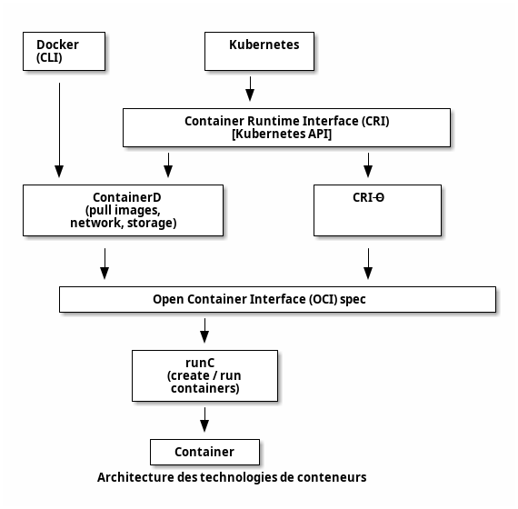

---

# Plugin réseau (CNI)

- Container Networking Interface (_CNI_) :
  - Permet la communication réseau au sein du cluster
  - Parfois intégré à la distribution, sinon à installer séparément
	- <https://github.com/containernetworking/cni/>
  - Par défaut, _Kubelet_ charge les config des plugins réseau depuis : `/etc/cni/net.d`

---

## CNI (Kubernetes) vs CNM (Docker)

- Docker :
  - réseaux **multiples** et **isolés**
	- DNS par **réseau**
	- **pas d'interconnexion** des réseaux
- Kubernetes :
  - **1 seul** réseau de conteneurs (_flat_)
	- DNS par **`Namespace`**
	- **aucune isolation** des réseaux par défaut (utiliser des `NetworkPolicies`)

---

## Flannel

- Est un réseau de sous-réseaux pour Kubernetes
- Fonctionne avec divers backends (VXLAN, UDP, etc.).
- Offre une isolation réseau par pod
- Est plus simple à configurer que les autres options
- Inconvénients : peut introduire une latence supplémentaire, moins de fonctionnalités avancées (`NetworkPolicies`, …), moins adapté aux très grands clusters.

---

## Calico

- Supporte plusieurs modes de réseau : BGP, IPIP, VXLAN.
- Propose une isolation réseau granulaire (par pod)
- Intègre de la sécurité
- Conçu pour des (très) grand clusters.
- S'intègre bien avec l'infrastructure existante.
- Souvent utilisé dans les déploiements Cloud.
- Inconvénients : complexe, besoin de compatibilité réseau (BGP).

---

## Weave

- Crée un réseau virtuel entre tous les conteneurs
- Utilise le DNS intégré de Docker
- Propose une isolation réseau par pod
- Est facile à configurer mais peut être moins performant que les autres options

---

## Cilium

- Utilise _eBPF_ (_Berkeley Packet Filter_)
  - (très) performant, débit élevé et latence réduite
- Métriques détaillées sur le trafic réseau
- Supporte dynamiquement l'ajout et la suppression de nœuds
- Conçu pour gérer des clusters de grande taille
- Inconvénients : complexe (eBPF et concepts réseau avancés), eBPF doit être activé dans le noyau Linux.

---

| **Critère**          | **Calico**                        | **Flannel**                       | **Weave Net**                    | **Cilium**                       |
|-----------------------|-----------------------------------|-----------------------------------|----------------------------------|----------------------------------|
| **Type de Réseau**    | Couche 3 (IPIP, BGP, VXLAN)       | Couche 3 (VXLAN, UDP)             | Couche 2 (Overlay)               | Couche 3 (eBPF)                  |
| **Sécurité**          | Politiques de réseau granulaires  | Politiques de réseau basiques     | Politiques de réseau basiques    | Politiques de réseau granulaires |
| **Performance**       | Haute                             | Moyenne                           | Moyenne                          | Très haute                       |
| **Scalabilité**       | Très élevée                       | Moyenne                           | Moyenne                          | Très élevée                      |
| **Complexité**        | Moyenne à élevée                  | Faible                            | Faible à moyenne                 | Élevée                           |
| **Fonctionnalités**   | Avancées (BGP, IPIP, VXLAN)       | Basiques                          | Basiques à moyennes              | Avancées (eBPF, DNS, chiffrement)|
| **Compatibilité**     | Kubernetes, OpenShift, Docker     | Kubernetes, Docker                | Kubernetes, Docker, Mesos        | Kubernetes                       |
| **Résilience**        | Élevée                            | Moyenne                           | Élevée                           | Élevée                           |

---
layout: section
---

# Distributions Kubernetes

---

1. Kubeadm
   - outil officiel
	 - installation de chaque composant séparément
	 - le plus configurable mais le plus complexe

---

2. Kubespray
   - Utilise `Ansible` pour (re)déployer automatiquement un cluster
	 - compatible _bare-metal_ et _cloud_

---

3. Rancher (RKE) :
   - Plateforme complète pour gérer des clusters Kubernetes
   - Propose des fonctionnalités avancées comme la gestion multi-cluster
   - Offre une interface graphique intuitive

---

4. K3s (Rancher Labs) :
   - Version allégée de Kubernetes conçue pour les environnemets embarqués
   - Consomme moins de ressources que Kubernetes standard
   - Idéal pour les systèmes à faible puissance
   - Utilise le CNI `flannel`
   - Voir aussi : _k3d_ (_k3s in Docker_) : similaire _kind_ (voir ci-dessous) pour k3s

---

5. K0s (CNCF) :
   - Autre version allégée Kubernetes
	 - Très minimale, aucun composant additionnel
	 - Compatible on-premise, edge, IoT, …

---

6. OpenShift :
   - Distribution propriétaire de Red Hat basée sur Kubernetes
   - Inclut des fonctionnalités supplémentaires comme l'orchestration d'applications
   - Forte sécurité et conformité

---

7. Docker Kubernetes Service (DKS)
   - Surveillance intégrée du cluster et des applications.
   - Nombreux drivers storage

---

8. MicroK8s (Ubuntu) :
   - Distribution légère et sécurisée de Kubernetes
   - Conçue pour les environnemets Ubuntu
   - Propose des fonctionnalités avancées comme l'installation de paquets

---

9. Minikube : 
   - Version légère pour le développement et le test
   - Fonctionne sur un seul ordinateur
   - Idéal pour débutants et environnement de développement

---

10. Docker Desktop :
   - Intègre Kubernetes nativement
   - Offre une expérience utilisateur simplifiée
   - Adapté aux développeurs utilisant Docker

---

11. Kind (Kubernetes IN Docker) :
   - Déploie Kubernetes dans un conteneur pour le développement et le test
   - Crée rapidement un ou plusieurs clusters localement
   - Utile pour tester plusieurs clusters : upgrade, changements d'infrastructure, …
   - CNI custom : `kindnetd`
   - Utilise `kubeadm`

---

12. Talos Linux :
   - Distribution Linux dédiée
	 - OS immuable : pas de SSH, shell, …

---

# Plateformes managées

- Amazon Elastic Kubernetes Service (EKS)
- Google Kubernetes Engine (GKE)
- Azure Kubernetes Services (AKS) 
- Oracle Kubernetes Engine (OKE)
- IBMCloud K8s
- OVHCloud K8s

---
layout: section
---

# Architecture

---

# Installation

- `kubeadm` : l'outil officiel (installation de chaque composant séparément)
- Intégré dans la distribution : `k3s`, `minikube`, `microk8s`, …
- Versions managées : outils dédiés au fournisseur de Cloud

---

# Modèle

* Un cluster k8s est composé de plusieurs `Node`
* Chaque `Node` fait tourner des `Pod` (ensemble de conteneurs - c'est l'unité atomique de k8s !)
* Un `Deployment` gère _déclarativement_ des ressources à déployer (pods, replicas, mise à jour, … )
* Un `Service` permet d'exposer les ports d'un pod (interne ou externe)
  - _Aucun lien avec un `service` de `docker-compose` !_

---

## Types de Nodes

* Node de rôle `master` : le `control pane`, gère le cluster (orchestration, API server, …)
* Node de type `worker` (sans rôle) : exécute les pods et leur fournit les ressources

---

# Limites

- k8s est fait pour gérer de gros clusters :
- limitations Kubernetes v1.31 :
  - < 5,000 Node
  - < 110 Pod / Node
  - < 150,000 Pod (total)
  - < 300,000 Containers (total)

---


<div class="caption">Architecture d'un cluster Kubernetes (source: kubernetes.io)</div>

---

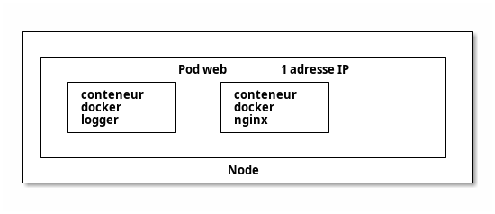

<div class="caption">Architecture d'un Pod</div> 

---

# Composants

* `APIServer` : API de gestion du cluster
* `etcd` : stockage de la configuration du cluster
* `Controller Manager` : gère les `WorkerNode` depuis le `MasterNode`
* `Kubelet` : exécute et gère les conteneurs sur les `Node`
* `Kube-proxy` : équilibre le trafic sur chaque `Node`
* `Scheduler` : assigne les `Pod` à un `Node`

---

# etcd

- Backend k8s : état du cluster (le reste est stateless)
  - store clé=valeur
- Dans ou en dehors du cluster
- 1 leader (par consensus)
  - déployer un nombre impair d'instances
  - supporte N/3 instances défaillantes
- Jamais utilisé directement (`APIServer`)
- Critique !
  - machine dédiée ou environnement isolé
  - bonnes performances réseau / disque

---

# ControllerManager

- Compare l'état désiré (déclaratif) à l'état actuel
- En déduit (et applique) les actions nécessaires (`APIServer`)
- Beaucoup de contrôleurs différents
  - possibilité d'installer des contrôleurs externes pour gérer de nouvelles ressources (`Custom Resource Definition`)
  - ex: Load Balancer AWS, …
- Boucles de réconciliation :
  - reconstruit des ressources si besoin pendant le cycle de vie du cluster
  - sans besoin d'intervention
- Contient toute l'intelligence de Kubernetes

---

# Scheduler

- Assigne les `Pod` (en state: `Pending`) aux `Node`
  - techniquement : crée un `Binding` et change le `nodeName` du `Pod`
- Calcule de score par _filtrage_ puis _score_ :
    1. _filtrage_ : capacité, tolérance, affinité, sélecteurs, …
    2. _score_ : load-balancing, …
- Possibilité d'installer un `Scheduler` customisé

---

# Kubelet

- 1 `Kubelet` par `Node`
  - Un `kubelet` est souvent installé sur le `MasterNode` pour y gérer ses composants dans des pods (optionnel)
  - En général, on y ajoute le `taint` : `node-role.kubernetes.io/master:NoSchedule` pour ne pas utiliser le _Master_ comme un _Worker_.
- Connexion permanente à l'`APIServer`
- Déploie le `Pod` s'il a le `nodeName` du `Node` courant :
    1. Récupération de l'image (format `OCI`)
    2. Création des ressources : `Volumes`, `Networks`, `Containers`
    3. États du `Pod` : `pending` -> `running` / `failed` -> `succeeded` (terminé)
    4. Remonte l'information à l'`APIServer`

---

# Kube-proxy

- gère le réseau sur chaque `Node` (entre Pods et vers extérieur)
- plusieurs modes :
  - tout traffic par `iptables`, règles `DNAT` ( ⚠️ CPU si beaucoup de règles)
    - load-balancer : _round-robbin_
  - `ipvs` : module noyau gérant un ensemble de règles d'un coup (plus performant)
    - load-balancer avancé
  - Si CNI `Cilium` : règles `eBPF` dans le noyau, plus besoin de `Kube-proxy`
    - voir section sur les CNI
- Connexion entre `Pods` : niveau 3 (_IP_)
- Connexion par `Services` : niveau 4 (_TCP_, _UDP_)
- Connexion par `Ingress` : niveau 7 (_HTTP_)

---

Voir : <https://2021-05-enix.container.training/5.yml.html#50> pour un exemple de fonctionnement du _Control Plane_ suite à la création d'un `Deployment`

---

# Gestion du cluster

* Fichiers de configuration `yml` (à privilégier autant que possible !)
* Interface en ligne de commande `kubectl` (surtout pour lancer les fichiers de config)
* Interface web (peu utilisée)

---
layout: section
---

# Ressources basiques du cluster

---

## Interactions entre ressources

- Les `Pod` exécutent les microservices.
- Les `Service` exposent ces pods pour permettre leur communication et leur accès.
- Les `ConfigMap` et `Secret` injectent les configurations et les données sensibles.
- Le/Les `Ingress` gèrent le trafic externe (routage par _URI_ ou header _host_) et les certificats SSL/TLS.
- Les `PersistentVolume` et `StatefulSet` supportent les applications avec état.
- Les `DaemonSet` assurent le fonctionnement des outils d’administration sur chaque noeud.

---

## Gestion des applications

- `Deployment` : gère le déploiement d'un `ReplicaSet`
  - et la mise à jour des applications (rolling update, rollback, scaling)
- `ReplicaSet` : crée et gère le suivi (réplicas) d'un pod
  - ne pas utiliser de `ReplicaSet` directement mais passer par un `Deployment` (plus puissant)
- `Pod` : gère un ensemble de conteneurs partageant la même isolation : stack réseau, stockage, …
  - démarré directement ou (mieux) par un `deployment` créant un `ReplicaSet`
  - éphémère : pas de données critiques dans le pod
  - 1 IP par pod partagée entre tous les conteneurs (mais l'IP peut changer)
    - accès par `localhost` aux autres conteneurs et **partage des ports ouverts**

---

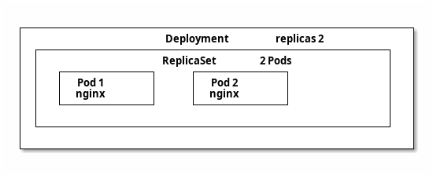

<div class="caption">Un Deployment gérant un ReplicaSet gérant un Pod</div> 

---

## Labels

- attributs clé=valeur des objets du cluster
- utilisé par kubernetes
- `NodeSelector` : lance un pod sur un `Node` ayant ce label
- `NodeAffinity` : décrit des affinités entre un `Pod` et un `Node`
- `podAffinity`, `podAntiAffinity` : (anti)affinité entre `Pod`
- il existe aussi des `annotations` : idem mais NON utilisé par k8s ensuite

---

### Labels et debug

- Beaucoup de ressources utilisent les labels pour sélectionner les ressources (`Pod`, …) à manager
- Pour debugger un `Pod` fautif, on peut changer son `Label` :
  - le Pod fautif sera retiré du Service (plus de Load balancing)
  - un nouveau Pod est créé par le `ReplicaSet` ou le `DaemonSet`
  - le Pod fautif est toujours actif pour du debug

---

## Service

- Service DNS permettant d'accéder à 1 (ou plusieurs) Pods
  - Nom DNS court (dans le namespace) : `<service_name>.<namespace>` (ou `<service_name>` si dans le même `namespace`)
  - Nom DNS complet : `<service_name>.<namespace>.svc.<cluster-domain>`
  - exemple : `mon_service.mon_namespace.svc.mon_cluster`
- Association `Service` <-> `Pod`(s) grâce aux _labels_
  - **avec gestion des réplicas**
- Au moins 2 CIDR (plages réseau) : CIDR Pod et CIDR Services

---

### Service: ClusterIP

- Expose à l'intérieur du cluster uniquement
- Crée une Virtual IP
- Accès via le nom du service
- Load balancer interne sur les Pods

---

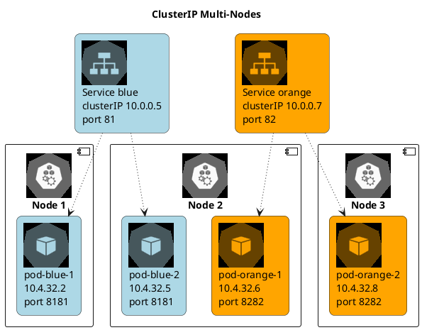

---

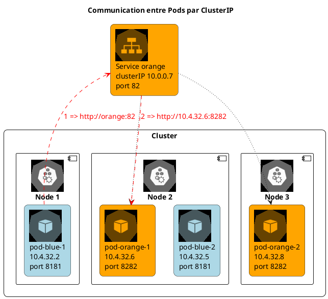

---

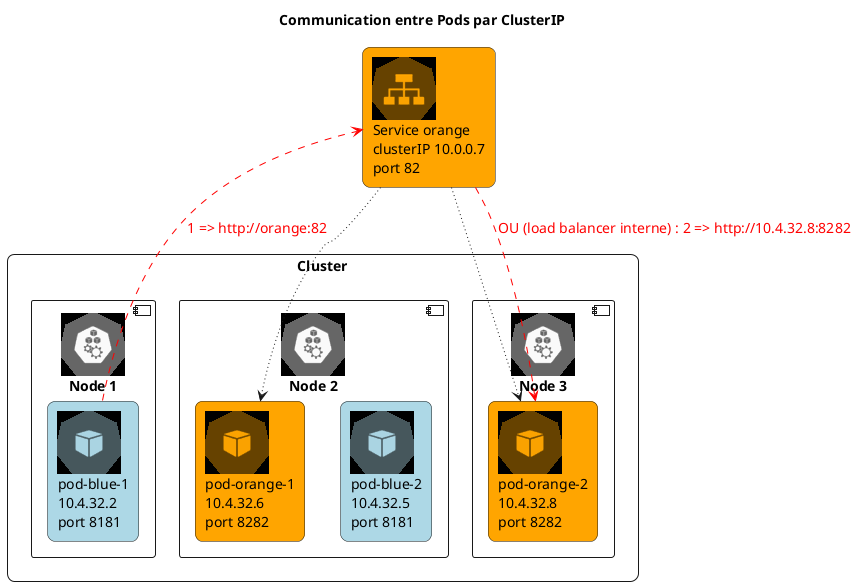

---

### Service: NodePort

- Extension du `ClusterIP`
- Expose à l'extérieur du cluster
- Accès via des ports sur les Nodes du cluster
- Load balancer interne sur les Pods

---

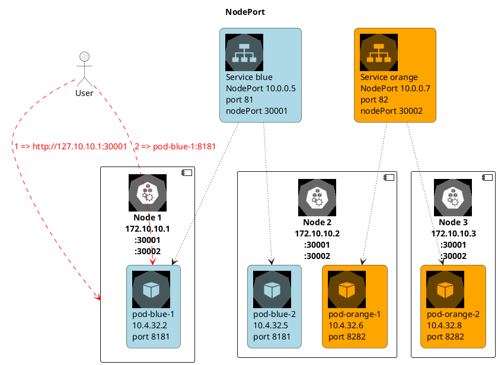

---

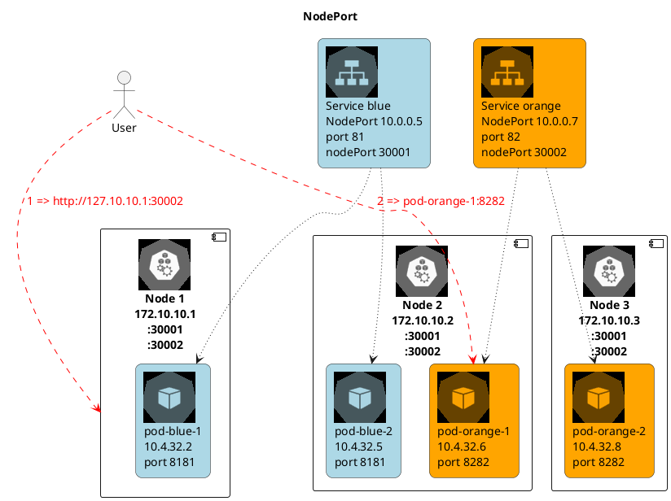

---

### Service: LoadBalancer

- LoadBalancer pour l'accès au `Pod` depuis l'extérieur
  - idéalement directement, sinon par un `NodePort`
- Permet d'avoir un accès unique à plusieurs conteneurs d'un Pod tournant sur plusieurs Nodes.
- Lié au service de _Load Balancing_ **externe** du Cloud Provider (_ELB_, _Azure LB_, _GCLB_, …).
  - dans le cluster : idem `ClusterIP`
  - programme un _Load Balancer_ Cloud puis ajoute l'IP **externe** au `Service`
  - on-premise, installer `MetalLB`

---

### Service: ExternalName

- Référence un DNS interne ou externe (alias)
- exemple : BDD externe au cluster
- pas de Load balancer

---

### EndpointSlice

- Lien `Service` <-> `Pod`

---

## Ingress

- Point d'accès publique HTTP/HTTPS unique pour l'accès aux différentes Pods (différent d'un Service)
- Agit comme un _Reverse-proxy_ qui redirige la requête vers le `Service`
- Règles de routage avancées
- En principe, crée un service `LoadBalancer` (point d'entrée de l'Ingress).
- Recquiert une implémentation d'`Ingress Controller` à installer :
  - `Nginx Ingress Controller` : standard, stable, supporte HTTPS et annotations avancées.
  - `HAProxy Ingress` : performant
  - `Traefik` : léger, dynamique (cloud, microservices)
  - `Consul Ingress / Istio Gateway` : intégration avec les _service mesh_ Consul / Istio

---

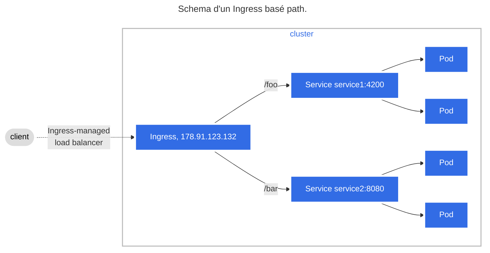

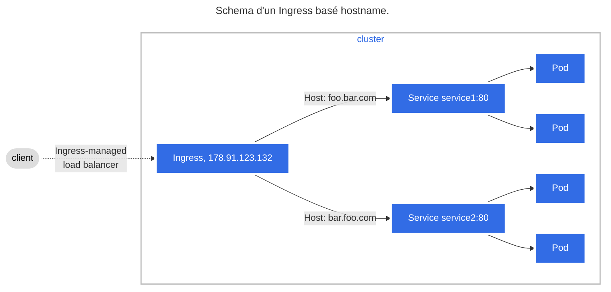

<div class="caption">Source: <a href="https://kubernetes.io/docs/concepts/services-networking/ingress/">https://kubernetes.io/docs/concepts/services-networking/ingress/</a></div>

---

## cert-manager (TLS)

- CRD à ajouter au Cluster pour générer et signer des `Certificat`
- Stocke la `key` et le `crt` dans un `Secret`
  - Réutilisables dans `Ingress`, …
- Utilise des `Issuer` (namespace-limited) ou des `ClusterIssuer` (cluster-wide)

---

## Service Mesh

- Ajoute les services d'infrastructure communs
  - authentification
  - sécurité
  - logs
- Gère la communication sécurisée entre conteneurs sur des architectures micro-services
- À installer : `Istio`, `linkerd`, `consul`, …
  - Voir la [page des outils Devops](https://www.avenel.pro/tools#-kubernetes-specific)

---

## Gateway API

- Nouvelle API Kubernetes (successeur Ingress)
  - Orienté rôles, portable, extensible
  - Routage multi-namespace
  - Décorélé de l'installation de kubernetes
- `GatewayClass` : Ensemble de `Gateway` avec configuration commune et géré par un contrôleur
- `Gateway` : Définit une instance d'infrastructure de gestion du trafic : Cloud load-balancing, …
- `HTTPRoute` : Règles pour mapper le trafic d'une `Gateway` à un endpoint réseau (`Service`)

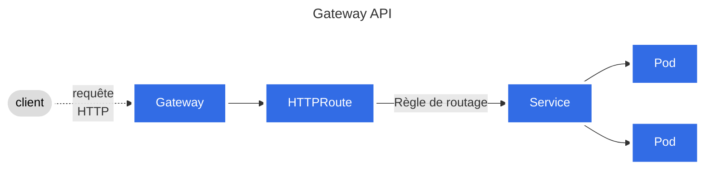


---

### CIDRs

- Kubernetes utilise uniquement 3 réseaux :
- un CIDR pour faire communiquer les _Nodes_
- un CIDR _flat_ (en principe isolé) pour les Pods
- un CIDR publique (routé par le plugin CNI) pour communiquer au sein du Cluster (pour les `Service`, …)
- peuvent s'ajouter des _external IP_ (Load Balancer, …)

---

## Configuration des applications

* `ConfigMap` pour modifier la configuration des applications
  - décorélé du code de l'application
* `Secret` (mots de passe, …) : assez similaire
  - [Differents types de Secrets](https://kubernetes.io/docs/concepts/configuration/secret/#secret-types)
  - ⚠️ par défaut, **simple encodage** : voir les [bonnes pratiques de sécurité](https://kubernetes.io/docs/concepts/security/secrets-good-practices/)
  - [chiffrement possible](https://kubernetes.io/docs/tasks/administer-cluster/encrypt-data/) des accès _REST_ mais l'_API Server_ ne peut plus démarrer automatiquement (si très fort besoin de sécurité uniquement)
* `ConfigMap` et `Secret` peuvent être _immuable_ 

---

## Stockage

---

### Volume

- `Volume` : **points de montage** d'un Pod
- pas de ressource dans l'_API Server_ (~`kubectl get volumes`~)
- très similaire à _Docker_
- pour accès aux configs, persistence, filesystem temporaire, …
- accessible à tous les _Conteneurs_ du _Pod_
- détruit (ou détaché si _remote_) à la destruction du Pod (persiste au redémarrage du conteneur)

---

### Quelques types de Volumes

- `emptyDir` : volume vide, supprimé avec le Pod (mais partage entre conteneurs du pod) 
- `hostPath` : monte un répertoire du Host vers le Pod
- `configMap` : monte des fichiers de configuration
- `PersistentVolume` : `iscsi`, `nfs`, `cephfs`
- [Doc: types de Volumes supportés](https://kubernetes.io/docs/concepts/storage/volumes/)

---

:::tip
- Il est possible d'injecter des volumes issus d'images OCI : <https://kubernetes.io/docs/tasks/configure-pod-container/image-volumes/>
- Exemple : image Docker custom `FROM scratch` + un binaire à injecter dans le conteneur principal
:::

---

### PersistentVolume

- `PersitentVolume` (PV) : vision _storage_ du cluster Kubernetes
- **stockage extérieur** à la vision _conteneur/pod_
- Représente un disque concret : local, NFS, iSCSI, SMB, EBS, SAN, …
  - existe dans l'_API Server_ : `kubectl get persistentvolumes`
  - durée de vie indépendante du pod
  - ~ne peut **pas être associé directement**~ à un _Pod_
  - [Doc: types de PV supportés](https://kubernetes.io/docs/concepts/storage/persistent-volumes/#types-of-persistent-volumes)

- `PersistentVolumeClaim` : réquisition d'un `PV`
  - permet l'association d'un disque à un _Pod_
  - états : `Pending` (cŕeation `PVC`) -> `Bound` (attaché au `Pod`) -> `Terminating` (attente de suppression)

---

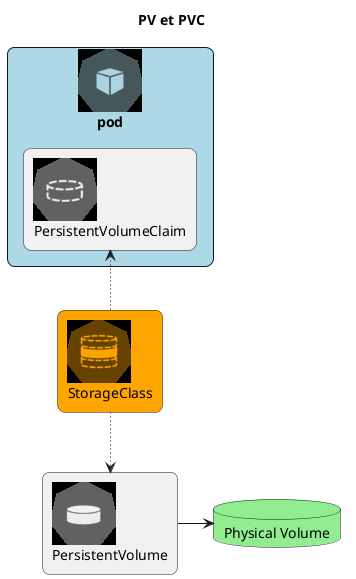


---

En résumé :

- `Volume` => vision _container_ : un point de montage pour configs, persistence, filesystem temporaire, …
- `PersitentVolume` (`PV`) => vision _storage_ du cluster Kubernetes, un espace de stockage
- `PersistenVolumeClaim` (`PVC`) => un type de _Volume_ permettant de réquisitionner et d'utiliser un `PV`

---

### Quelques solutions de stockage

Solution | Type | Mode d'accès | Cas d'usage
---------|------|--------------|-------------
_AWS EBS CSI_ | Stockage en bloc | `RWO` (noeud unique) | Stockage haute performance sur AWS
_Google Persistent Disk CSI_ | Stockage en bloc | `RWO` (noeud unique) | Applications cloud-native sur GCP
_Ceph RBD CSI_ | Stockage distribué | `RWO`, `RWX` | Bases de données distribuées
_Longhorn CSI_ | Stockage local | `RWO`, `RWX` | Stockage persistant natif Kubernetes

---

### Volumes statiques - Odre des opérations

- Création du volume `PV` par l'utilisateur : taille, type de stockage, …
- Création du `PVC` par l'utilisateur : taille et type de stockage requis (correspond à un PV existant qui répond à ces critères).
- Association entre `PVC` et `PV` par Kubernetes
- Utilisation du `Volume` par un `Pod`

---

### Volumes dynamiques - Odre des opérations

- `PVC` : l'utilisateur demande un volume persistant et spécifie une `StorageClass`
- _Provisionnement_ du `Volume` via le driver `CSI` (_Container Storage Interface_) associé à la `StorageClass`
- _Attachement du volume_ au _Node_ par le `CSI`
- _Montage du volume_ dans le _conteneur_ depuis le _Node_

---

### Modes d'accès

`PV` et `PVC` ont des _access modes_ :

- `ReadWriteOnce` : un seul _Node_ peut accéder au volume à la fois
- `ReadWriteMany` : plusieurs _Node_ peuvent accéder au volume simultanément
- `ReadOnlyMany` : plusieurs _Node_ peuvent accéder au volume (mais pas écrire dedans)
- `ReadWriteOncePod` : un seul _Pod_ peut accéder au volume

- Un `PV` liste les modes d'accès **qu'il supporte**
- Un `PVC` liste des **contraintes** sur les droits d'accès : seul un `PV` les supportant peut être réquisitionné

Voir [la documentation](https://kubernetes.io/docs/concepts/storage/persistent-volumes/#access-modes)

---

# Ressources avancées

---

## DaemonSet

- Assure que des pods tournent sur tous les noeuds du cluster
- Utile pour monitoring & logs
- Exemple : installation d'un _Load Balancer_ `MetalLB` sur tous les _Node_ du cluster.

---

## StatefulSet

- Déploie des applications avec état : BDD, …
- Ressources **ordonnées** (ordre de lancement)
- Un `PV` par _Pod_ (vs. _ReplicaSet_ où les volumes sont partagés)
- _persistent volume claim templates_ (`spec.volumeClaimTemplates`) : crée un `PVC` par _Pod_ nommé `<claim-name>.<stateful-set-name>.<pod-index>`
- Un même volume monté dans un pod (`PVC`) le reste pour toujours (même après recréation)
- Un DNS dédié (_service headless_) :
  - load-balancing sur tous les pods du set
  - sélection d'un pod en particulier

---

## Job et CronJob

- Pour travaux "longs" (> minutes / heures)
- `Job` : Démarre un `Pod`, en cas d'échec, relance jusqu'au _backoff limit_ (default=6)
  - paramètres : `completions` (default=1) => nombre d'exécutions, `parallelism` (default=1)
- `CronJob` : Nécessite un `schedule` (idem _Cron_ sur _UNIX_)

---

## Configuration du cluster

* Metadata
* `Namespace` : espaces de noms isolant des ressources
  - cloisonne une partie du cluster
  - idem namespace Linux
  - Namespaces spéciaux :
	  - `kube-public` : ressources accessibles à tous (par ex pour le _bootstrap_ du cluster)
	  - `kube-system` : composants Kubernetes
    - `default` : si aucun namespace spécifié
* Rôles

---

# Commandes de base de Kubernetes® 

Voir la [cheatsheet sur Kubernetes®](https://www.avenel.pro/cours/docker/kubernetes-cheatsheet)

---

# Structure d'un fichier k8s

```yaml
apiVersion: v1 # Version de l'APIServer k8s
kind: … # Le type de ressource à gérer : Pod, Deployment, Service, …
metadata: # Métadatas de la ressource
  name: … # nom (interne) de la ressource à créer et/ou monitorer
  namespace: mon-namespace # Namespace spécial (optionnel - sinon default)
  labels: # ajout de labels (optionnel)
    ma-cle: ma-valeur 
  […]
spec: # Les spécifications de la ressource. Différent pour chaque type de ressource
  […]
```

---

