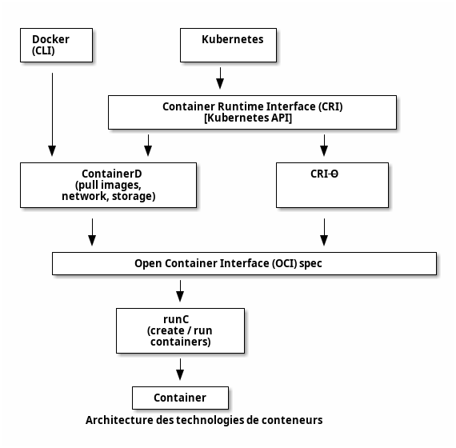
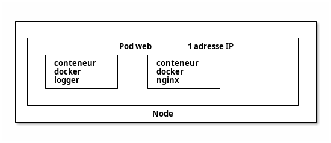
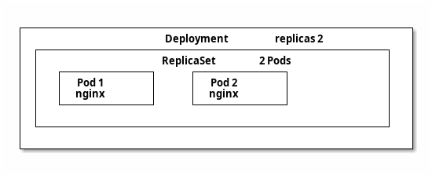
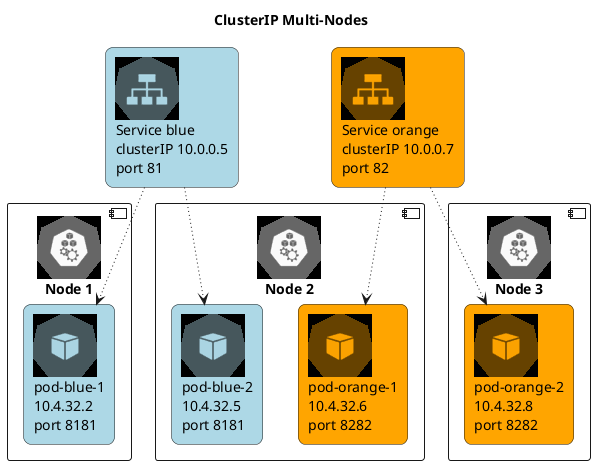
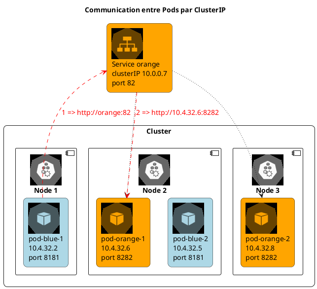
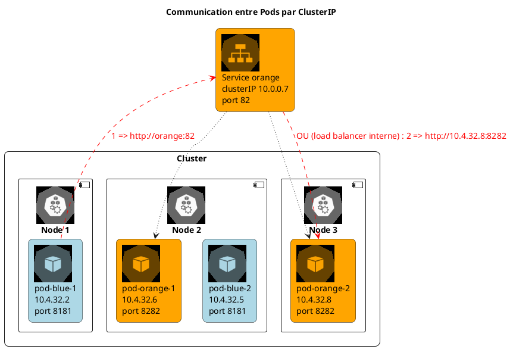
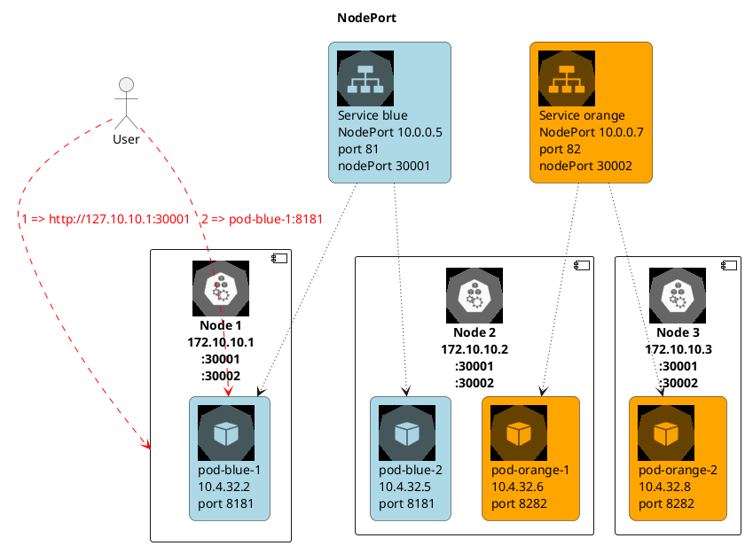
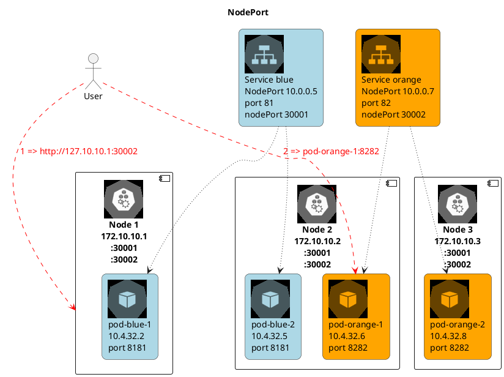
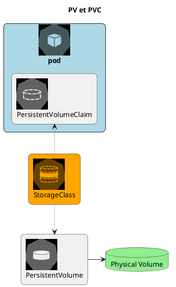

```plantuml
@startuml
title: "Boucle de réconciliation"
rectangle "Observation" as observe
rectangle "Action" as act
rectangle "Diff" as diff
observe --> diff
diff --> act
act --> observe
@enduml
```

## 🚀 Comparaison des Plateformes de Conteneurs

---

### 🌟 Introduction

> Une plateforme de conteneurs est un ensemble d'outils et de services qui permettent de gérer le cycle de vie des applications conteneurisées. 📦

- **Orchestration** : Gestion automatisée du déploiement, de la mise à l'échelle, et de la mise en réseau des conteneurs. 🔄
- **Évolutivité** : Capacité à ajuster les ressources et les services en fonction de la demande. 📈
- **Isolation** : Exécution sécurisée et isolée des applications pour éviter les conflits. 🔒
- **Portabilité** : Exécution cohérente des applications sur différents environnements (développement, test, production ; on-premise et multi-cloud). 🌍

---

### 🧩 Kubernetes

- **Description** : Plateforme open-source pour l'automatisation du déploiement, la mise à l'échelle et la gestion des applications conteneurisées. 🌐
- De loin l'orchestrateur **le plus utilisé avec Docker®** 🏆
- **Avantages** :
  - Grande communauté et écosystème 👥
  - Hautement extensible avec de nombreux outils et extensions 🛠️
  - Prise en charge de charges de travail complexes 🏋️
- **Inconvénients** :
  - Courbe d'apprentissage abrupte 📚
  - Configuration complexe ⚙️
- Pour les **déploiements complexes et évolutifs** 🌐

---

### 🚀 OpenShift

- **Description** : Plateforme de conteneurs de Red Hat, basée sur Kubernetes, avec des fonctionnalités supplémentaires pour les entreprises. 🏢
- **Avantages** :
  - Intégration facile avec d'autres produits Red Hat 🔄
  - Interface utilisateur intuitive 🖥️
  - Sécurité et conformité renforcées 🔒
- **Inconvénients** :
  - Coût élevé pour les fonctionnalités d'entreprise 💰
  - Moins flexible que Kubernetes seul 🤸
- Pour les **solutions d'entreprise avec support** 🏢

---

### 🐳 Docker Swarm

- **Description** : Solution d'orchestration de conteneurs intégrée à Docker, simple et facile à utiliser. 🐋
- **Avantages** :
  - Intégration transparente avec Docker 🔄
  - Facile à configurer et à utiliser 🛠️
  - Idéal pour les petits déploiements 🏠
- **Inconvénients** :
  - Manque de fonctionnalités avancées 🛑
  - Communauté et écosystème plus petits 👥
- Pour les **environnements simples et rapides** 🏡

---

### 🏗️ Apache Mesos

- **Description** : Projet open-source pour la gestion des ressources dans les centres de données, prenant en charge les conteneurs et les charges de travail non conteneurisées. 🏢
- **Avantages** :
  - Flexibilité pour gérer divers types de charges de travail 🔄
  - Évolutivité et robustesse 📈
- **Inconvénients** :
  - Complexité de configuration et de gestion ⚙️
  - Moins axé sur les conteneurs que les autres solutions 🎯
- Pour les **environnements hybrides et complexes** 🏗️

---

### 📊 Comparaison

| Plateforme | Facilité d'utilisation | Évolutivité | Écosystème | Coût |
|------------|-----------------------|-------------|------------|------|
| Kubernetes | ⭐️⭐️⭐️ | ⭐️⭐️⭐️⭐️ | ⭐️⭐️⭐️⭐️ | 🆓 |
| OpenShift | ⭐️⭐️⭐️⭐️ | ⭐️⭐️⭐️⭐️ | ⭐️⭐️⭐️ | 💰 |
| Swarm | ⭐️⭐️⭐️⭐️ | ⭐️⭐️⭐️ | ⭐️⭐️ | 🆓 |
| Mesos | ⭐️⭐️ | ⭐️⭐️⭐️⭐️ | ⭐️⭐️ | 🆓 |

---

## 🎭 Présentation de Kubernetes

---

`Kubernetes` (ou `k8s`) est un orchestrateur de déploiement et de gestion de conteneurs applicatifs dans un cluster de machines virtuelles. 🚀

* Indépendant de Docker® mais même runtime `containerd` => peut tourner les mêmes images 🐳
* Configure et gère un cluster applicatif complexe : nœuds du cluster, réseau, stockage, ... 🌐
* Possibilité de gérer tout le cluster via API `kubectl` 🔧
* Mais configuration recommandée via `Yaml` / `Json` pour audit 📝

---

## 💡 Recommandations

* `Docker®` seul / `docker compose` pour CI/CD et outils internes 🛠️
* `k8s®` pour gestion applicative de l'environnement de production 🏗️
* `k8s®` duplique des fonctionnalités de Docker® => préférer 100% Docker® ou k8s® 🔄

---

## 📦 Technologies de conteneurs supportées

1. `containerd` : projet open-source créé pour Kubernetes (runtime de `Docker` : _Docker sans la CLI_) 🐳
2. `Docker Engine` : _Docker avec la CLI_ 🐳
3. `Podman` : alternative _serverless_ à Docker 🐳
4. `CRI-O` : conteneurs légers 📦
5. `Mirantis Container Runtime (MCR)` (anciennement _Docker Enterprise_) 🏢

---



---

## 🌐 Plugin réseau (CNI)

- **Container Networking Interface** (_CNI_) : 🌍
  - Permet la communication réseau au sein du cluster 🌐
  - Parfois intégré à la distribution, sinon à installer séparément 🛠️
  - [GitHub - CNI](https://github.com/containernetworking/cni/) 🔗
  - Par défaut, _Kubelet_ charge les configurations des plugins réseau depuis : `/etc/cni/net.d` 📂

---

### 🔄 CNI (Kubernetes) vs CNM (Docker)

- **Docker** : 🐳
  - Réseaux **multiples** et **isolés** 🌐
  - DNS par **réseau** 📡
  - **Pas d'interconnexion** des réseaux ❌

- **Kubernetes** : 🚀
  - **1 seul** réseau de conteneurs (_flat_) 🌍
  - DNS par **`Namespace`** 📡
  - **Aucune isolation** des réseaux par défaut (utiliser des `NetworkPolicies`) ⚠️

---

### 🌐 Flannel

- Est un réseau de sous-réseaux pour Kubernetes 🌐
- Fonctionne avec divers backends (VXLAN, UDP, etc.) 🔄
- Offre une isolation réseau par pod 🔒
- Plus simple à configurer que les autres options 🛠️
- Inconvénients : Peut introduire une latence supplémentaire, moins de fonctionnalités avancées (`NetworkPolicies`, …), moins adapté aux très grands clusters ⚠️

---

### 🛡️ Calico

- Supporte plusieurs modes de réseau : BGP, IPIP, VXLAN 🌐
- Propose une isolation réseau granulaire (par pod) 🔒
- Intègre de la sécurité 🛡️
- Conçu pour des (très) grands clusters 🏗️
- S'intègre bien avec l'infrastructure existante 🔄
- Souvent utilisé dans les déploiements Cloud ☁️
- Inconvénients : Complexe, besoin de compatibilité réseau (BGP) ⚠️

---

### 🕸️ Weave

- Crée un réseau virtuel entre tous les conteneurs 🌐
- Utilise le DNS intégré de Docker 📡
- Propose une isolation réseau par pod 🔒
- Facile à configurer mais peut être moins performant que les autres options 🛠️

---

### ⚡ Cilium

- Utilise _eBPF_ (_Berkeley Packet Filter_) ⚡
  - (Très) performant, débit élevé et latence réduite ⚡
- Métriques détaillées sur le trafic réseau 📊
- Supporte dynamiquement l'ajout et la suppression de nœuds 🔄
- Conçu pour gérer des clusters de grande taille 🏗️
- Inconvénients : Complexe (eBPF et concepts réseau avancés), eBPF doit être activé dans le noyau Linux ⚠️

:::tip
- Cilium fournit un outil de monitoring (_Hubble_) avec une CLI et UI permettant de visualiser les communications au sein du cluster.
- Cilium fournit un "_Cluster Mesh_" (⚠️ à ne pas confondre avec un _Service Mesh_ k8s) permettant une communication entre _Service_ de différents clusters.
:::

---

| **Critère** | **Calico** | **Flannel** | **Weave Net** | **Cilium** |
|-------------|------------|-------------|---------------|------------|
| **Type de Réseau** | Couche 3 (IPIP, BGP, VXLAN) | Couche 3 (VXLAN, UDP) | Couche 2 (Overlay) | Couche 3 (eBPF) |
| **Sécurité** | Politiques de réseau granulaires | Politiques de réseau basiques | Politiques de réseau basiques | Politiques de réseau granulaires |
| **Performance** | Haute | Moyenne | Moyenne | Très haute |
| **Scalabilité** | Très élevée | Moyenne | Moyenne | Très élevée |
| **Complexité** | Moyenne à élevée | Faible | Faible à moyenne | Élevée |
| **Fonctionnalités** | Avancées (BGP, IPIP, VXLAN) | Basiques | Basiques à moyennes | Avancées (eBPF, DNS, chiffrement) |
| **Compatibilité** | Kubernetes, OpenShift, Docker | Kubernetes, Docker | Kubernetes, Docker, Mesos | Kubernetes |
| **Résilience** | Élevée | Moyenne | Élevée | Élevée |

---

## 📦 Distributions Kubernetes

---

1. **Kubeadm** 🛠️
   - Outil officiel
   - Installation de chaque composant séparément
   - Le plus configurable mais le plus complexe

---

2. **Kubespray** 🔄
   - Utilise `Ansible` pour (re)déployer automatiquement un cluster
   - Compatible _bare-metal_ et _cloud_ ☁️

---

3. **Rancher (RKE)** 🏗️
   - Plateforme complète pour gérer des clusters Kubernetes
   - Propose des fonctionnalités avancées comme la gestion multi-cluster 🌐
   - Offre une interface graphique intuitive 🖥️

---

4. **K3s (Rancher Labs)** 📦
   - Version allégée de Kubernetes conçue pour les environnements embarqués
   - Consomme moins de ressources que Kubernetes standard 🔋
   - Idéal pour les systèmes à faible puissance ⚡
   - Utilise le CNI `flannel` 🌐
   - Voir aussi : _k3d_ (_k3s in Docker_) : similaire _kind_ (voir ci-dessous) pour k3s 🐳

---

5. **K0s (CNCF)** 📦
   - Autre version allégée Kubernetes
   - Très minimale, aucun composant additionnel 🔧
   - Compatible on-premise, edge, IoT, … 🌍

---

6. **OpenShift** 🏢
   - Distribution propriétaire de Red Hat basée sur Kubernetes
   - Inclut des fonctionnalités supplémentaires comme l'orchestration d'applications 🛠️
   - Forte sécurité et conformité 🔒

---

7. **Docker Kubernetes Service (DKS)** 🐳
   - Surveillance intégrée du cluster et des applications 👁️
   - Nombreux drivers storage 💾

---

8. **MicroK8s (Ubuntu)** 📦
   - Distribution légère et sécurisée de Kubernetes
   - Conçue pour les environnements Ubuntu 🐧
   - Propose des fonctionnalités avancées comme l'installation de paquets 📦

---

9. **Minikube** 🧪
   - Version légère pour le développement et le test
   - Fonctionne sur un seul ordinateur 💻
   - Idéal pour débutants et environnement de développement 🛠️

---

10. **Docker Desktop** 🐳
    - Intègre Kubernetes nativement
    - Offre une expérience utilisateur simplifiée 🖥️
    - Adapté aux développeurs utilisant Docker 🛠️

---

11. **Kind (Kubernetes IN Docker)** 🧪
    - Déploie Kubernetes dans un conteneur pour le développement et le test
    - Crée rapidement un ou plusieurs clusters localement 🏗️
    - Utile pour tester plusieurs clusters : upgrade, changements d'infrastructure, … 🔄
    - CNI custom : `kindnetd` 🌐
    - Utilise `kubeadm` 🛠️

---

12. **Talos Linux** 🐧
    - Distribution Linux dédiée
    - OS immuable : pas de SSH, shell, … 🔒

---

### ☁️ Plateformes managées

- Amazon Elastic Kubernetes Service (EKS) 🌐
- Google Kubernetes Engine (GKE) 🌐
- Azure Kubernetes Services (AKS) 🌐
- Oracle Kubernetes Engine (OKE) 🌐
- IBMCloud K8s 🌐
- OVHCloud K8s 🌐

---

## 🏗️ Architecture

---

### 🛠️ Installation

- `kubeadm` : l'outil officiel (installation de chaque composant séparément) 🛠️
- Intégré dans la distribution : `k3s`, `minikube`, `microk8s`, … 📦
- Versions managées : outils dédiés au fournisseur de Cloud ☁️

---

### 📂 Modèle

- Un cluster k8s est composé de plusieurs `Node` 🌐
- Chaque `Node` fait tourner des `Pod` (ensemble de conteneurs - c'est l'unité atomique de k8s !) 📦
- Un `Deployment` gère _déclarativement_ des ressources à déployer (pods, replicas, mise à jour, …) 🔄
- Un `Service` permet d'exposer les ports d'un pod (interne ou externe) 🌍
  - _Aucun lien avec un `service` de `docker-compose` !_ ⚠️

---

### 🏷️ Types de Nodes

- Node de rôle `master` : le `control pane`, gère le cluster (orchestration, API server, …) 🏢
- Node de type `worker` (sans rôle) : exécute les pods et leur fournit les ressources 🛠️

---

### ⚠️ Limites

- k8s est fait pour gérer de gros clusters : 🏗️
- Limitations Kubernetes v1.31 :
  - < 5,000 Node 🌐
  - < 110 Pod / Node 📦
  - < 150,000 Pod (total) 📦
  - < 300,000 Containers (total) 📦

---


<div class="caption">Architecture d'un cluster Kubernetes (source: kubernetes.io)</div>

---



<div class="caption">Architecture d'un Pod</div> 

---

## 🧩 Composants

- `APIServer` : API de gestion du cluster 🌐
- `etcd` : Stockage de la configuration du cluster 📂
- `Controller Manager` : Gère les `WorkerNode` depuis le `MasterNode` 🏢
- `Kubelet` : Exécute et gère les conteneurs sur les `Node` 📦
- `Kube-proxy` : Équilibre le trafic sur chaque `Node` 🌍
- `Scheduler` : Assigne les `Pod` à un `Node` 📅

---

### 📂 etcd

- Backend k8s : État du cluster (le reste est stateless) 📂
  - Store clé=valeur 🔑
- Dans ou en dehors du cluster 🌐
- 1 leader (par consensus) 🏆
  - Déployer un nombre impair d'instances 🔢
  - Supporte N/3 instances défaillantes ⚠️
- Jamais utilisé directement (`APIServer`) ⚠️
- Critique ! 🚨
  - Machine dédiée ou environnement isolé 🏢
  - Bonnes performances réseau / disque ⚡

---

### 🔄 ControllerManager

- Compare l'état désiré (déclaratif) à l'état actuel 🔄
- En déduit (et applique) les actions nécessaires (`APIServer`) 🛠️
- Beaucoup de contrôleurs différents 🧩
  - Possibilité d'installer des contrôleurs externes pour gérer de nouvelles ressources (`Custom Resource Definition`) 🔧
  - Exemple : Load Balancer AWS, … ☁️
- Boucles de réconciliation : 🔄
  - Reconstruit des ressources si besoin pendant le cycle de vie du cluster 🔄
  - Sans besoin d'intervention 🛠️
- Contient toute l'intelligence de Kubernetes 🧠

---



---

### 📅 Scheduler

- Assigne les `Pod` (en state: `Pending`) aux `Node` 📅
  - Techniquement : crée un `Binding` et change le `nodeName` du `Pod` 🔧
- Calcule de score par _filtrage_ puis _score_ : 📊
  1. _Filtrage_ : Capacité, tolérance, affinité, sélecteurs, … 🔍
  2. _Score_ : Load-balancing, … ⚖️
- Possibilité d'installer un `Scheduler` customisé 🔧

---

### 📦 Kubelet

- 1 `Kubelet` par `Node` 📦
  - Un `kubelet` est souvent installé sur le `MasterNode` pour y gérer ses composants dans des pods (optionnel) 🏢
  - En général, on y ajoute le `taint` : `node-role.kubernetes.io/master:NoSchedule` pour ne pas utiliser le _Master_ comme un _Worker_. ⚠️
- Connexion permanente à l'`APIServer` 🌐
- Déploie le `Pod` s'il a le `nodeName` du `Node` courant : 📦
  1. Récupération de l'image (format `OCI`) 📥
  2. Création des ressources : `Volumes`, `Networks`, `Containers` 🛠️
  3. États du `Pod` : `pending` -> `running` / `failed` -> `succeeded` (terminé) 🔄
  4. Remonte l'information à l'`APIServer` 📤

---

### 🌐 Kube-proxy

- Gère le réseau sur chaque `Node` (entre Pods et vers extérieur) 🌍
- Plusieurs modes : 🔄
  - Tout trafic par `iptables`, règles `DNAT` (⚠️ CPU si beaucoup de règles) ⚠️
    - Load-balancer : _round-robin_ 🔄
  - `ipvs` : Module noyau gérant un ensemble de règles d'un coup (plus performant) ⚡
    - Load-balancer avancé ⚖️
  - Si CNI `Cilium` : Règles `eBPF` dans le noyau, plus besoin de `Kube-proxy` 🌟
    - Voir section sur les CNI 📚
- Connexion entre `Pods` : Niveau 3 (_IP_) 🌐
- Connexion par `Services` : Niveau 4 (_TCP_, _UDP_) 🌍
- Connexion par `Ingress` : Niveau 7 (_HTTP_) 🌐

---

Voir : <https://2021-05-enix.container.training/5.yml.html#50> pour un exemple de fonctionnement du _Control Plane_ suite à la création d'un `Deployment`

---

## 🛠️ Gestion du cluster

- Fichiers de configuration `yml` (à privilégier autant que possible !) 📄
- Interface en ligne de commande `kubectl` (surtout pour lancer les fichiers de config) 🖥️
- Interface web (peu utilisée) 🌐

---

## 📂 Ressources basiques du cluster

---

### 🔄 Interactions entre ressources

- Les `Pod` exécutent les microservices. 📦
- Les `Service` exposent ces pods pour permettre leur communication et leur accès. 🌐
- Les `ConfigMap` et `Secret` injectent les configurations et les données sensibles. 🔐
- Le/Les `Ingress` gèrent le trafic externe (routage par _URI_ ou header _host_) et les certificats SSL/TLS. 🌍
- Les `PersistentVolume` et `StatefulSet` supportent les applications avec état. 💾
- Les `DaemonSet` assurent le fonctionnement des outils d’administration sur chaque nœud. 🛠️

---

### 📦 Gestion des applications

- `Deployment` : Gère le déploiement d'un `ReplicaSet` 📦
  - Et la mise à jour des applications (rolling update, rollback, scaling) 🔄
- `ReplicaSet` : Crée et gère le suivi (réplicas) d'un pod 📦
  - Ne pas utiliser de `ReplicaSet` directement mais passer par un `Deployment` (plus puissant) 🛠️
- `Pod` : Gère un ensemble de conteneurs partageant la même isolation : stack réseau, stockage, … 📦
  - Démarré directement ou (mieux) par un `deployment` créant un `ReplicaSet` 📦
  - Éphémère : Pas de données critiques dans le pod ⚠️
  - 1 IP par pod partagée entre tous les conteneurs (mais l'IP peut changer) 🌐
    - Accès par `localhost` aux autres conteneurs et **partage des ports ouverts** 🔄

---



<div class="caption">Un Deployment gérant un ReplicaSet gérant un Pod</div> 

---

### 🏷️ Labels

- Attributs clé=valeur des objets du cluster 🏷️
- Utilisé par Kubernetes 🛠️
- `NodeSelector` : Lance un pod sur un `Node` ayant ce label 🏷️
- `NodeAffinity` : Décrit des affinités entre un `Pod` et un `Node` 🏷️
- `podAffinity`, `podAntiAffinity` : (Anti)affinité entre `Pod` 🏷️
- Il existe aussi des `annotations` : Idem mais NON utilisé par k8s ensuite 📝

---

#### 🐛 Labels et debug

- Beaucoup de ressources utilisent les labels pour sélectionner les ressources (`Pod`, …) à manager 🏷️
- Pour debugger un `Pod` fautif, on peut changer son `Label` : 🐛
  - Le Pod fautif sera retiré du Service (plus de Load balancing) ⚖️
  - Un nouveau Pod est créé par le `ReplicaSet` ou le `DaemonSet` 📦
  - Le Pod fautif est toujours actif pour du debug 🐛

---

### 🌐 Service

- Service DNS permettant d'accéder à 1 (ou plusieurs) Pods 🌐
  - Nom DNS court (dans le namespace) : `<service_name>.<namespace>` (ou `<service_name>` si dans le même `namespace`) 📡
  - Nom DNS complet : `<service_name>.<namespace>.svc.<cluster-domain>` 📡
  - Exemple : `mon_service.mon_namespace.svc.mon_cluster` 📡
- Association `Service` <-> `Pod`(s) grâce aux _labels_ 🏷️
  - **Avec gestion des réplicas** 🔄
- Au moins 2 CIDR (plages réseau) : CIDR Pod et CIDR Services 🌐

---

### 🌐 Service: ClusterIP

- Expose à l'intérieur du cluster uniquement 🏢
- Crée une Virtual IP 🌐
- Accès via le nom du service 📡
- Load balancer interne sur les Pods ⚖️

---



---



---



---

### 🌐 Service: NodePort

- Extension du `ClusterIP` 🌐
- Expose à l'extérieur du cluster 🌍
- Accès via des ports sur les Nodes du cluster 🌐
- Load balancer interne sur les Pods ⚖️

---



---



---

### 🌐 Service: LoadBalancer

- LoadBalancer pour l'accès au `Pod` depuis l'extérieur 🌍
  - Idéalement directement, sinon par un `NodePort` 🌐
- Permet d'avoir un accès unique à plusieurs conteneurs d'un Pod tournant sur plusieurs Nodes 🌐
- Lié au service de _Load Balancing_ **externe** du Cloud Provider (_ELB_, _Azure LB_, _GCLB_, …) ☁️
  - Dans le cluster : idem `ClusterIP` 🌐
  - Programme un _Load Balancer_ Cloud puis ajoute l'IP **externe** au `Service` 🌍
  - On-premise, installer `MetalLB` 🏢

---

### 🌐 Service: ExternalName

- Référence un DNS interne ou externe (alias) 📡
- Exemple : BDD externe au cluster 💾
- Pas de Load balancer ⚖️

---

### 🔗 EndpointSlice

- Lien `Service` <-> `Pod` 🔗

---

### 🌍 Ingress

- Point d'accès publique HTTP/HTTPS unique pour l'accès aux différentes Pods (différent d'un Service) 🌍
- Agit comme un _Reverse-proxy_ qui redirige la requête vers le `Service` 🔄
- Règles de routage avancées 📜
- En principe, crée un service `LoadBalancer` (point d'entrée de l'Ingress) ⚖️
- Requiert une implémentation d'`Ingress Controller` à installer : 🛠️
  - `Nginx Ingress Controller` : Standard, stable, supporte HTTPS et annotations avancées 🌐
  - `HAProxy Ingress` : Performant ⚡
  - `Traefik` : Léger, dynamique (cloud, microservices) ☁️
  - `Consul Ingress / Istio Gateway` : Intégration avec les _service mesh_ Consul / Istio 🌐

---


<div class="caption">Source: <a href="https://kubernetes.io/docs/concepts/services-networking/ingress/">https://kubernetes.io/docs/concepts/services-networking/ingress/</a></div>

---

## 🔐 cert-manager (TLS)

- CRD à ajouter au Cluster pour générer et signer des `Certificat` 🔐
- Stocke la `key` et le `crt` dans un `Secret` 🔒
  - Réutilisables dans `Ingress`, … 🌐
- Utilise des `Issuer` (namespace-limited) ou des `ClusterIssuer` (cluster-wide) 🏷️

---

## 🛡️ Service Mesh

- Ajoute les services d'infrastructure communs 🛠️
  - Authentification 🔐
  - Sécurité 🛡️
  - Logs 📝
- Gère la communication sécurisée entre conteneurs sur des architectures micro-services 🌐
- À installer : `Istio`, `linkerd`, `consul`, … 🛠️
  - Voir la [page des outils Devops](https://www.avenel.pro/tools#-kubernetes-specific) 🔗

---

## 🌐 Gateway API

- Nouvelle API Kubernetes (successeur Ingress) 🌐
  - Orienté rôles, portable, extensible 🔄
  - Routage multi-namespace 🏷️
  - Décorrélé de l'installation de Kubernetes 🛠️
- `GatewayClass` : Ensemble de `Gateway` avec configuration commune et géré par un contrôleur 🏷️
- `Gateway` : Définit une instance d'infrastructure de gestion du trafic : Cloud load-balancing, … ☁️
- `HTTPRoute` : Règles pour mapper le trafic d'une `Gateway` à un endpoint réseau (`Service`) 🌐


---

## 🌐 CIDRs

- Kubernetes utilise uniquement 3 réseaux : 🌐
  - Un CIDR pour faire communiquer les _Nodes_ 🌐
  - Un CIDR _flat_ (en principe isolé) pour les Pods 📦
  - Un CIDR publique (routé par le plugin CNI) pour communiquer au sein du Cluster (pour les `Service`, …) 🌍
- Peuvent s'ajouter des _external IP_ (Load Balancer, …) 🌐

---

## 🛠️ Configuration des applications

- `ConfigMap` pour modifier la configuration des applications 📝
  - Décorrélé du code de l'application 🛠️
- `Secret` (mots de passe, …) : Assez similaire 🔐
  - [Différents types de Secrets](https://kubernetes.io/docs/concepts/configuration/secret/#secret-types) 🔗
  - ⚠️ Par défaut, **simple encodage** : Voir les [bonnes pratiques de sécurité](https://kubernetes.io/docs/concepts/security/secrets-good-practices/) 🔒
  - [Chiffrement possible](https://kubernetes.io/docs/tasks/administer-cluster/encrypt-data/) des accès _REST_ mais l'_API Server_ ne peut plus démarrer automatiquement (si très fort besoin de sécurité uniquement) 🔒
- `ConfigMap` et `Secret` peuvent être _immuable_ 🔒

---

## 💾 Stockage

---

### 📂 Volume

- `Volume` : **Points de montage** d'un Pod 📂
- Pas de ressource dans l'_API Server_ (~`kubectl get volumes`~) ⚠️
- Très similaire à _Docker_ 🐳
- Pour accès aux configs, persistence, filesystem temporaire, … 📂
- Accessible à tous les _Conteneurs_ du _Pod_ 📦
- Détruit (ou détaché si _remote_) à la destruction du Pod (persiste au redémarrage du conteneur) ⚠️

---

### 📂 Quelques types de Volumes

- `emptyDir` : Volume vide, supprimé avec le Pod (mais partage entre conteneurs du pod) 🗑️
- `hostPath` : Monte un répertoire du Host vers le Pod 📂
- `configMap` : Monte des fichiers de configuration 📝
- `PersistentVolume` : `iscsi`, `nfs`, `cephfs` 💾
- [Doc: Types de Volumes supportés](https://kubernetes.io/docs/concepts/storage/volumes/) 📚

---

:::tip
- Il est possible d'injecter des volumes issus d'images OCI : [Injecter des volumes issus d'images OCI](https://kubernetes.io/docs/tasks/configure-pod-container/image-volumes/) 📦
- Exemple : Image Docker custom `FROM scratch` + un binaire à injecter dans le conteneur principal 🐳
:::

---

### 💾 PersistentVolume

- `PersistentVolume` (PV) : Vision _storage_ du cluster Kubernetes 💾
- **Stockage extérieur** à la vision _conteneur/pod_ 📦
- Représente un disque concret : Local, NFS, iSCSI, SMB, EBS, SAN, … 💾
  - Existe dans l'_API Server_ : `kubectl get persistentvolumes` 📂
  - Durée de vie indépendante du pod 🔄
  - ~Ne peut **pas être associé directement**~ à un _Pod_ ⚠️
  - [Doc: Types de PV supportés](https://kubernetes.io/docs/concepts/storage/persistent-volumes/#types-of-persistent-volumes) 📚
- `PersistentVolumeClaim` : Réquisition d'un `PV` 📝
  - Permet l'association d'un disque à un _Pod_ 📦
  - États : `Pending` (création `PVC`) -> `Bound` (attaché au `Pod`) -> `Terminating` (attente de suppression) 🔄

---




---

### 📌 En résumé :

- `Volume` => Vision _container_ : Un point de montage pour configs, persistence, filesystem temporaire, … 📂
- `PersistentVolume` (`PV`) => Vision _storage_ du cluster Kubernetes, un espace de stockage 💾
- `PersistentVolumeClaim` (`PVC`) => Un type de _Volume_ permettant de réquisitionner et d'utiliser un `PV` 📝

---

### 💾 Quelques solutions de stockage


| Solution | Type | Mode d'accès | Cas d'usage |
|---------|------|--------------|-------------|
| _AWS EBS CSI_ | Stockage en bloc | `RWO` (noeud unique) | Stockage haute performance sur AWS 🌐 |
| _Google Persistent Disk CSI_ | Stockage en bloc | `RWO` (noeud unique) | Applications cloud-native sur GCP ☁️ |
| _Ceph RBD CSI_ | Stockage distribué | `RWO`, `RWX` | Bases de données distribuées 🗃️ |
| _Longhorn CSI_ | Stockage local | `RWO`, `RWX` | Stockage persistant natif Kubernetes 📦 |

---

### 📂 Volumes statiques - Ordre des opérations

- Création du volume `PV` par l'utilisateur : Taille, type de stockage, … 📦
- Création du `PVC` par l'utilisateur : Taille et type de stockage requis (correspond à un PV existant qui répond à ces critères) 📝
- Association entre `PVC` et `PV` par Kubernetes 🔗
- Utilisation du `Volume` par un `Pod` 📦

---

### 🔄 Volumes dynamiques - Ordre des opérations

- `PVC` : L'utilisateur demande un volume persistant et spécifie une `StorageClass` 📝
- _Provisionnement_ du `Volume` via le driver `CSI` (_Container Storage Interface_) associé à la `StorageClass` 📦
- _Attachement du volume_ au _Node_ par le `CSI` 🔗
- _Montage du volume_ dans le _conteneur_ depuis le _Node_ 📦

---

### 🔒 Modes d'accès

`PV` et `PVC` ont des _access modes_ : 🔒

- `ReadWriteOnce` : Un seul _Node_ peut accéder au volume à la fois 🔒
- `ReadWriteMany` : Plusieurs _Node_ peuvent accéder au volume simultanément 🔒
- `ReadOnlyMany` : Plusieurs _Node_ peuvent accéder au volume (mais pas écrire dedans) 🔒
- `ReadWriteOncePod` : Un seul _Pod_ peut accéder au volume 🔒

- Un `PV` liste les modes d'accès **qu'il supporte** 🔒
- Un `PVC` liste des **contraintes** sur les droits d'accès : Seul un `PV` les supportant peut être réquisitionné 🔒

Voir [la documentation](https://kubernetes.io/docs/concepts/storage/persistent-volumes/#access-modes) 📚

---

## 🛠️ Ressources avancées

---

### 🛡️ DaemonSet

- Assure que des pods tournent sur tous les nœuds du cluster 🛠️
- Utile pour monitoring & logs 📊
- Exemple : Installation d'un _Load Balancer_ `MetalLB` sur tous les _Node_ du cluster ⚖️

---

### 💾 StatefulSet

- Déploie des applications avec état : BDD, … 💾
- Ressources **ordonnées** (ordre de lancement) 📜
- Un `PV` par _Pod_ (vs. _ReplicaSet_ où les volumes sont partagés) 💾
- _Persistent volume claim templates_ (`spec.volumeClaimTemplates`) : Crée un `PVC` par _Pod_ nommé `<claim-name>.<stateful-set-name>.<pod-index>` 📝
- Un même volume monté dans un pod (`PVC`) le reste pour toujours (même après recréation) 🔄
- Un DNS dédié (_service headless_) : 📡
  - Load-balancing sur tous les pods du set ⚖️
  - Sélection d'un pod en particulier 🎯

---

### ⏳ Job et CronJob

- Pour travaux "longs" (> minutes / heures) ⏳
- `Job` : Démarre un `Pod`, en cas d'échec, relance jusqu'au _backoff limit_ (default=6) 🔄
  - Paramètres : `completions` (default=1) => Nombre d'exécutions, `parallelism` (default=1) ⚙️
- `CronJob` : Nécessite un `schedule` (idem _Cron_ sur _UNIX_) ⏰

---

## 🛠️ Configuration du cluster

- Metadata 🏷️
- `Namespace` : Espaces de noms isolant des ressources 🏷️
  - Cloisonne une partie du cluster 🏗️
  - Idem namespace Linux 🐧
  - Namespaces spéciaux : 🏷️
    - `kube-public` : Ressources accessibles à tous (par ex pour le _bootstrap_ du cluster) 🌍
    - `kube-system` : Composants Kubernetes 🏗️
    - `default` : Si aucun namespace spécifié 🏷️
- Rôles 👥

---

## 📚 Commandes de base de Kubernetes®

Voir la [cheatsheet sur Kubernetes®](https://www.avenel.pro/k8s/cheatsheet) 📚

---

## Structure d'un fichier k8s

```yaml
apiVersion: v1 # Version de l'APIServer k8s
kind: … # Le type de ressource à gérer : Pod, Deployment, Service, …
metadata: # Métadatas de la ressource
  name: … # nom (interne) de la ressource à créer et/ou monitorer
  namespace: mon-namespace # Namespace spécial (optionnel - sinon default)
  labels: # ajout de labels (optionnel)
    ma-cle: ma-valeur 
  […]
spec: # Les spécifications de la ressource. Différent pour chaque type de ressource
  […]
```

---

