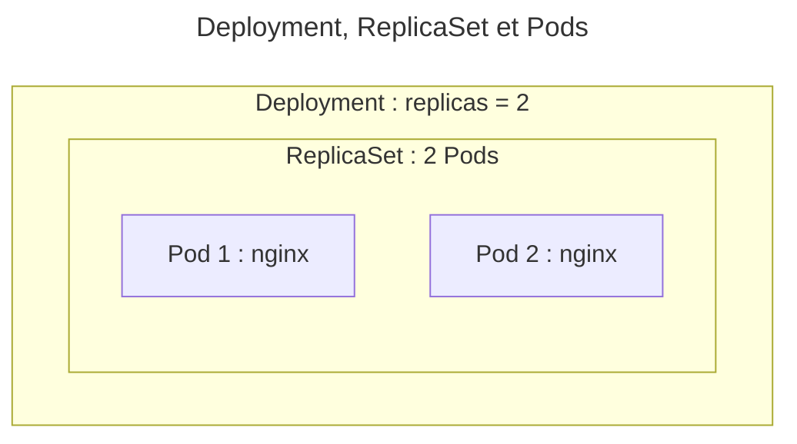
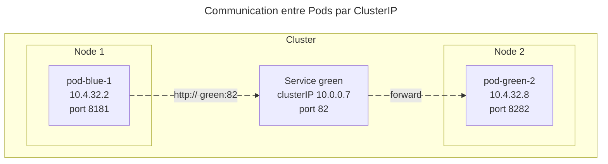
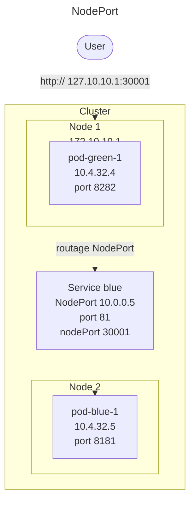
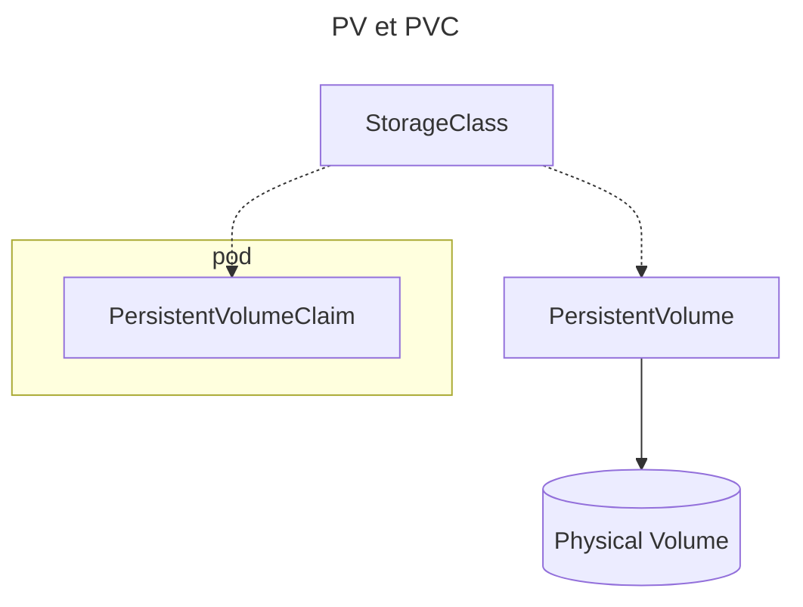

## Kubernetes

- Cluster de `Nodes` (serveurs physiques ou VMs) :
  - _worker_ (exécute des applications)
  - _control plane_ (administre le cluster et stocke l'état dans _etcd_)
- Administration via ligne de commandes `kubectl` et fichiers de manifests en `yaml`
- Ensemble de ressources (`kind: …`), ajout possible de `CRD` (_Custom Ressource Definition_)
- Réconciliation de ressources : les `Controller` adaptent le Cluster en permanence vers l'état attendu

---

## Déploiements applicatifs

- `Pod` : abstraction d'un (normalement) unique _Conteneur_ : backend, frontend, …
- `Deployment` : gère le déploiement d'un `ReplicaSet` (nombre de `Pod`)
  - et la mise à jour du `Pod` (rolling update, rollback, scaling)

---

Un Deployment gérant un ReplicaSet gérant un Pod
 

---

## Service

- Les `Pod` ne communiquent jamais directement mais par les noms DNS de `Service`.
- `Service` == service DNS associé à un Pod ou un Déploiement par un `label` :
  - l'association crée un objet `EndpointSlices`
  - DNS : `service_name` dans le même namespace (`mon_service`), sinon `service_name.namespace_name` (`mon_service.mon_namespace`).
  - `type=ClusterIP` (defaut) : communication entre `Pod` dans le cluster uniquement
  - `type=NodePort` : ajoute un accès depuis tous les `Node` du cluster
  - autres types : `type=LoadBalancer` (Cloud provider), `type=ExternalName` (alias DNS)

---

Communication interne dans le cluster par Cluster IP.

---

Communication depuis l'extérieur par NodePort.

---

## Configuration des applications

- `ConfigMap` (`Volume`) pour la configuration des applications
  - autre ressource similaire : `Secret` (mots de passe, …)

---

## Stockage

- `PersistentVolumeClaim` : associe un `PersistentVolume` (disque virtuel géré par une `StorageClass`) à un/des `Pod`

StorageClass, PersistentVolume, PersistentVolumeClaim et volume physique.

---

## Autres ressources

* `Namespace` : espaces de noms isolant des ressources
- `StatefulSet` : composants avec état et ordre à respecter : BDD, … (très différent du reste)
- `Volume` (différent `PersistentVolume`, proche d'un volume _Docker_) : point de montage pour configs, filesystem temporaire, …
- `DaemonSet` : assure que des pods tournent sur tous les noeuds du cluster (ex pour des services techniques)
- `Job` et `CronJob` pour des tâches

