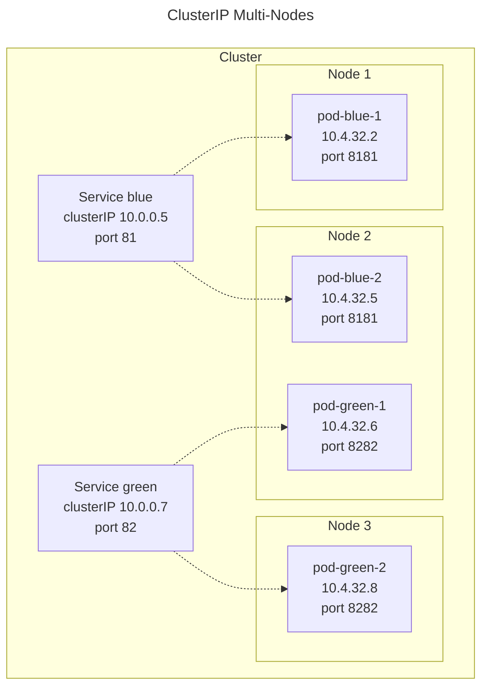
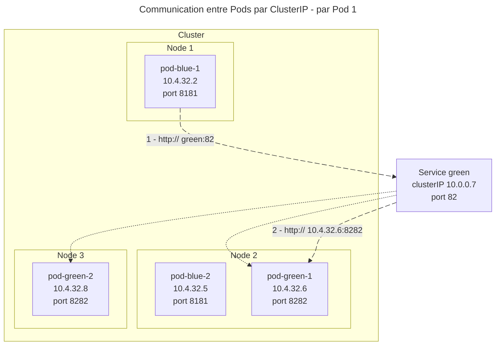
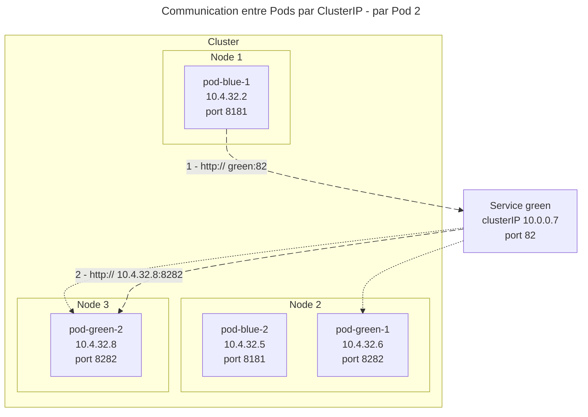
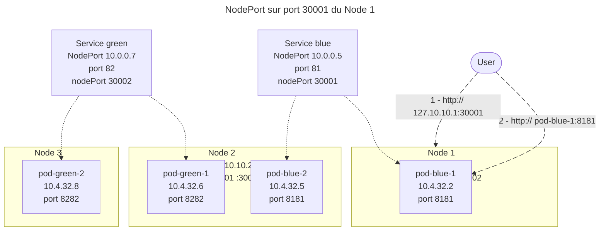
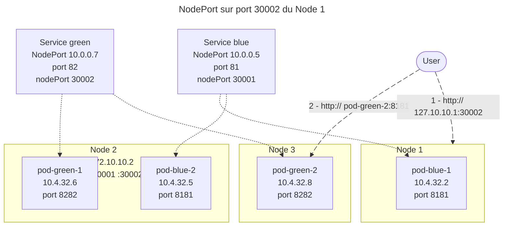
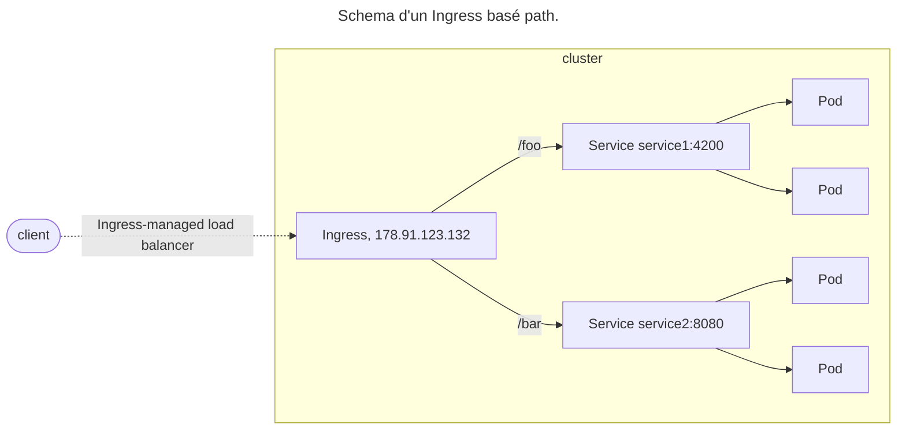
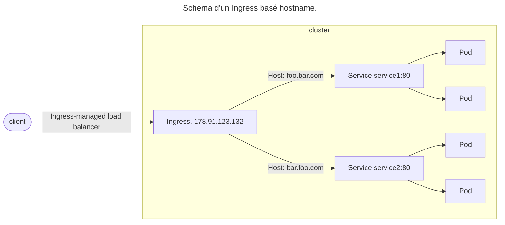
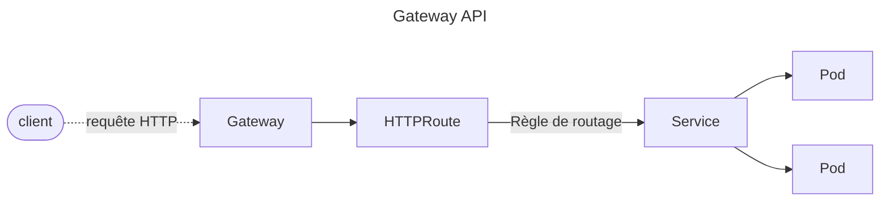

## 🌐 CIDRs

- Kubernetes utilise uniquement 3 réseaux : 🌐
  - Un CIDR pour faire communiquer les _Nodes_ 🌐
  - Un CIDR _flat_ (en principe isolé) pour les Pods 📦
  - Un CIDR publique (routé par le plugin CNI) pour communiquer au sein du Cluster (pour les `Service`, …) 🌍
- Peuvent s'ajouter des _external IP_ (Load Balancer, …) 🌐

:::tip
v1.33.0 introduit le _Service IP Expansion_ : l'API `ServiceCIDR` permet d'ajouter (dynamiquement) autant de CIDRs que voulu aux `Service`.
:::

---

## 🌐 Service

- Service DNS permettant d'accéder à 1 (ou plusieurs) Pods 🌐
  - Nom DNS court (dans le namespace) : `<service_name>.<namespace>` (ou `<service_name>` si dans le même `namespace`) 📡
  - Nom DNS complet : `<service_name>.<namespace>.svc.<cluster-domain>` 📡
  - Exemple : `mon_service.mon_namespace.svc.mon_cluster` 📡
- Association `Service` <-> `Pod`(s) grâce aux _labels_ 🏷️
  - **Avec gestion des réplicas** 🔄
- Au moins 2 CIDR (plages réseau) : CIDR Pod et CIDR Services 🌐

:::link
Pour des exemples d'usage concrets, voir : <https://sheakimran.hashnode.dev/kubernetes-services-a-deep-dive-with-examples>
:::

---

### 🌐 Service: ClusterIP

- Expose à l'intérieur du cluster uniquement 🏢
- Crée une Virtual IP 🌐
- Accès via le nom du service 📡
- Load balancer interne sur les Pods ⚖️

---



<div class="caption">ClusterIP multi Nodes</div>

---





<div class="caption">Communication entre Pods par ClusterIP. Le service Green est load-balancé sur pod-green-1 et pod-green-2.</div>

---

### 🌐 Service: NodePort

- Extension du `ClusterIP` 🌐
- Expose à l'extérieur du cluster 🌍
- Accès via des ports sur les Nodes du cluster 🌐
- Load balancer interne sur les Pods ⚖️

---





<div class="caption">Communication par NodePort. La communication vers l'adresse IP du Node est redirigée vers un Pod du Service.</div>

---

### 🌐 Service: LoadBalancer

- LoadBalancer pour l'accès au `Pod` depuis l'extérieur 🌍
  - Idéalement directement, sinon par un `NodePort` 🌐
- Permet d'avoir un accès unique à plusieurs conteneurs d'un Pod tournant sur plusieurs Nodes 🌐
- Lié au service de _Load Balancing_ **externe** du Cloud Provider (_ELB_, _Azure LB_, _GCLB_, …) ☁️
  - Dans le cluster : idem `ClusterIP` 🌐
  - Programme un _Load Balancer_ Cloud puis ajoute l'IP **externe** au `Service` 🌍
  - On-premise, installer `MetalLB` 🏢

---

### 🌐 Service: ExternalName

- Référence un DNS interne ou externe (alias) 📡
- Exemple : BDD externe au cluster 💾
- Pas de Load balancer ⚖️

---

### 🔗 EndpointSlice

- Lien `Service` <-> `Pod` (ressource interne) 🔗

---

## 🌍 Ingress

- Point d'accès publique HTTP/HTTPS unique pour l'accès aux différentes Pods (différent d'un Service) 🌍
- Agit comme un _Reverse-proxy_ qui redirige la requête vers le `Service` 🔄
- Règles de routage avancées 📜
- En principe, crée un service `LoadBalancer` (point d'entrée de l'Ingress) ⚖️
- Requiert une implémentation d'`Ingress Controller` à installer : 🛠️
  - ~`Nginx Ingress Controller` : Standard, stable, supporte HTTPS et annotations avancées 🌐 (_Déprécié_) ~
  - `HAProxy Ingress` : Performant ⚡
  - `Traefik` : Léger, dynamique (cloud, microservices) ☁️
  - `Consul Ingress / Istio Gateway` : Intégration avec les _service mesh_ Consul / Istio 🌐

---





<div class="caption">Source: <a href="https://kubernetes.io/docs/concepts/services-networking/ingress/">https://kubernetes.io/docs/concepts/services-networking/ingress/</a></div>

---

## 🌐 Gateway API

- Nouvelle API Kubernetes (successeur Ingress) 🌐
  - Orienté rôles, portable, extensible 🔄
  - Routage multi-namespace 🏷️
  - Décorrélé de l'installation de Kubernetes 🛠️
- `GatewayClass` : Ensemble de `Gateway` avec configuration commune et géré par un contrôleur 🏷️
- `Gateway` : Définit une instance d'infrastructure de gestion du trafic : Cloud load-balancing, … ☁️
- `HTTPRoute` : Règles pour mapper le trafic d'une `Gateway` à un endpoint réseau (`Service`) 🌐



---

## 🔐 cert-manager (TLS)

- CRD à ajouter au Cluster pour générer et signer des `Certificat` 🔐
- Stocke la `key` et le `crt` dans un `Secret` 🔒
  - Réutilisables dans `Ingress`, … 🌐
- Utilise des `Issuer` (namespace-limited) ou des `ClusterIssuer` (cluster-wide) 🏷️

---

## Cas d'usage - quels services utiliser ?

---

### Communication interne entre microservices

#### Cas d'usage

- Une API backend consommée par un frontend
- Un service applicatif appelant un service métier
- Un worker consommant une API interne

#### Service **ClusterIP**

- Accessible uniquement **à l'intérieur du cluster**
- Fournit une **IP virtuelle stable** et un **DNS interne**
- Load-balancing natif entre les Pods via DNS : `service-name.namespace.svc.cluster.local`
- Coupler avec des **NetworkPolicies** pour restreindre les flux

---

### Exposition d'une application web vers l'extérieur

- Application web (HTTP/HTTPS)
- API REST publique
- Dashboard applicatif

#### Option A - NodePort

- Accessible via `IP_du_node:NodePort`
- Cluster bare-metal sans load balancer externe
- Peu sécurisé : environnement de test, labo, formation
- Pas de gestion TLS native

#### Option B - LoadBalancer

- IP externe dédiée
- Intégration avec les load balancers cloud public (AWS, GCP, Azure)
- Bare-metal avec MetalLB / kube-vip
- Support natif du trafic externe
- Utilisé en combinaison avec un **Ingress Controller**

---

### Exposition HTTP/HTTPS multi-services (reverse proxy)

- Plusieurs applications derrière un même point d'entrée
- Routage par nom de domaine ou chemin
- Terminaison TLS centralisée
- **ClusterIP** pour les applications
- **LoadBalancer** ou **NodePort** pour l'Ingress Controller

#### Architecture typique

```
Internet
   |
[ LoadBalancer / NodePort ]
   |
[ Ingress Controller ]
   |
[ Services ClusterIP ]
```

- Mutualisation de l'exposition externe
- Gestion centralisée du TLS (cert-manager)
- Scalabilité et flexibilité élevées

---

### Accès à une base de données ou un service stateful

- PostgreSQL, MySQL, MongoDB
- Redis, Kafka, Elasticsearch

#### Option A - ClusterIP

- Accès simple à une base unique
- Load balancing côté client non requis
- exemple : Application → `postgres.default.svc.cluster.local`

#### Option B - Headless Service

- `clusterIP: None`

- StatefulSets
- Réplication, clustering, leader election
- Résolution DNS par Pod
- Contrôle fin du routage (ex : primary / replicas)
- exemple : `postgres-0.postgres`, `postgres-1.postgres`

---

### Services nécessitant une IP fixe par Pod

- Clusters distribués (Kafka, Cassandra)
- Protocoles non HTTP
- Applications sensibles à l'identité réseau

#### Headless Service

- Pas de load balancing
- DNS renvoyant toutes les IP des Pods
- Indispensable avec `StatefulSet`

---

### Accès à un service externe au cluster

- Base de données externe
- API SaaS
- Service legacy hors Kubernetes

#### ExternalName

- Le Service agit comme un alias DNS
- Redirige vers un FQDN externe

```yaml
apiVersion: v1
kind: Service
metadata:
  name: db-external
spec:
  type: ExternalName
  externalName: db.prod.example.com
```

---

### Exposition directe d'un Pod spécifique

- Debug
- Tests réseau
- Accès temporaire à un composant précis

#### Service **NodePort** ou port-forwarding

- Préférer `kubectl port-forward` en production
- Éviter les Services permanents pour le debug

---

### Services internes nécessitant un accès cross-namespace

- Plateforme partagée (auth, logging, metrics)
- Mutualisation de services transverses

#### Service **ClusterIP**

- accès via DNS FQDN complet
- Exemple : `prometheus.monitoring.svc.cluster.local`

---

### Récapitulatif

| Cas d'usage                 | Type de Service         |
| --------------------------- | ----------------------- |
| Communication interne       | ClusterIP               |
| Application web publique    | LoadBalancer / NodePort |
| Reverse proxy HTTP(S)       | Ingress + ClusterIP     |
| Base de données simple      | ClusterIP               |
| Base de données clusterisée | Headless                |
| StatefulSets                | Headless                |
| Service externe             | ExternalName            |
| Debug / tests               | NodePort / port-forward |

---
