```mermaid
---
title: Kubernetes API request lifecycle
---
flowchart LR
    %% Étapes principales
    A["API Handler"]
    B["Authentication"]
    C["Mutating Admission<br/>(Webhook Callout)"]
    D["Schema Validation"]
    E["Validating Admission<br/>(Webhook Callout)"]
    F["Persist to etcd"]

    %% Webhooks séparés
    subgraph "Mutating Webhook"
        MW["Webhook Code<br/>Implementation"]
    end

    subgraph "Validating Webhook"
        VW["Webhook Code<br/>Implementation"]
    end

    %% Flux principal
    A --> B
    B --> C
    C --> D
    D --> E
    E --> F

    %% Webhook Mutating
    C -->|"Call registered webhook"| MW
    MW -->|"Modified object"| C

    %% Webhook Validating
    E -->|"Call registered webhook"| VW
    VW -->|"Validation response"| E
```

## Surface d'attaque d'un cluster

Composants critiques :

- API Server
- etcd
- kubelet
- controller manager
- scheduler
- Pods / containers
- réseau inter-pods

La majorité des attaques passent par **l'API Server**

---

## 🔐 Authentification et autorisation

---

### 📋 Généralités

- L'authentification (_authn_, vérification de l'identité) s'effectue par _TLS mutuel_ 🔄
  - Le client et le serveur doivent tous deux détenir un certificat valide 📜
- L'autorisation (_authz_, vérification des droits) s'effectue de différentes manières :
  - _api-server_ : **RBAC** 🔑
  - Certains services délèguent l'autorisation à l'_api-server_ (**webhooks**) 🌐
  - Certains services nécessitent un certificat signé par une _autorité de certification_ (_CA_) 📜

---

## ServiceAccount

- `ServiceAccount` : authentification basique à l'intérieur du cluster
- Compte technique (machine à machine), pas prévu pour utilisateur individuel
- _RBAC_ lie un `ServiceAccount` à un `(Cluster)Role`
- Au moins 1 `ServiceAccount` par `Namespace`
- Un _Pod_ est associé à un _ServiceAccount_ pour parler à l'API (par défaut : `default`, sans droits) 🔄
  - Le token associé est dans le Pod : `/var/run/secrets/kubernetes.io/serviceaccount/token` 🔑
  - désactivable par `automountServiceAccountToken: false` dans la spec du `Pod`

:::tip
Le _ServiceAccount_ est notamment utile pour utiliser l'_API Server_ depuis un conteneur : <https://kubernetes.io/docs/tasks/run-application/access-api-from-pod/>
:::

---

Commande :

```bash
kubectl get serviceaccounts
```

Création :

```yaml
apiVersion: v1
kind: ServiceAccount
metadata:
  name: app-sa
```

---

## 🔐 Authentification (authn)

- Identifie un client (pas ses droits).
- **pas de gestion d'utilisateurs interne** (délégation).
- Nombreuses méthodes _authn_ lors d'une requête _api-server_ (génère username, identifiant, groupes) 📋
- L'_api-server_ ne les interprète pas : tâche des _autorizers_ (_authz_). 🔄

---

### 🔑 Méthodes authn

- Certificats clients TLS (clusters `kubeadm`) 🔒
- Bearer tokens (header HTTP) 🔑
- Autres types de tokens (peu utilisé) 🔑
- Autre proxy authn devant l'_api-server_ 🌐
- Clés d'API externes : _AWS EKS_, … 🔑
- Méthodes authn(s) actuelle(s) dans : `~/.kube/config` 📂

---

#### 🔒 Certificats TLS X.509

- Méthode la plus courante en cluster on-premise.
- Client présente un certificat signé par la CA du cluster
- Mapping sur un `username` + `groups`
- _username_ : `CN` du certificat client 👤
- _liste des groupes_ : `O` du certificat client 👥
- L'_api-server_ peut aussi valider les certificats clients par une CA custom. 🔄

Exemple :

```bash
kubectl config view
```

---

#### 🔑 Bearer Tokens

- Utilisés par :
  - ServiceAccounts
  - Automatisation
  - CI/CD
- Transmis par en-têtes HTTP : `Authorization: Bearer …` 🔑
- Validés de différentes manières :
  - En dur dans un fichier sur l'_api-server_ 📂
  - [Bootstrap tokens](https://kubernetes.io/docs/reference/access-authn-authz/bootstrap-tokens/) : création cluster, ajout _Node_ 🌐
  - [OpenID Connect Token](https://kubernetes.io/docs/reference/access-authn-authz/authentication/#openid-connect-tokens) : _authn_ par fournisseurs externe `OAuth2` 🌐
  - `ServiceAccount` : [create-token](https://kubernetes.io/docs/reference/access-authn-authz/service-accounts-admin/#create-token) 🔑

---

#### OpenID Connect (OIDC)

Intégration avec :

- Keycloak
- Azure AD
- Google IAM
- Okta
- …

Avantages :

- SSO
- MFA
- Centralisation identité

---

#### Webhook Auth

Kubernetes délègue l'authentification à un service externe.

---

### 🚫 Requêtes anonymes

- Si **une** méthode authn renvoie `rejects` : requête refusée `401 Unauthorized` ❌
- Requête anonyme (si aucun accept / reject par aucune méthode authn) :
  - _username_ : `system:anonymous` 👤
  - _liste des groupes_ : `system:unauthenticated` 👥
  - Par défaut ne peut rien faire ❌
- Désactivable sur API Server via `--anonymous-auth=false`

---

### 🔐 authn kubelet

- _Kubelet_ s'authentifie souvent par certificats : `O=system:nodes`, `CN=system:node:name-of-the-node` 🔒
- L'API Kubernetes peut agir comme une CA (encapsule une _CSR X509_ dans une `CertificateSigningRequest`) 🔄
- Permet au _Kubelet_ de renouveler son propre certificat 🔄
- Peut émettre des certificats utilisateur 👤
- Pas de révocation de certificat (clé compromise, …) par l'_api-server_ : [issue #18982](https://github.com/kubernetes/kubernetes/issues/18982) ❌
- => **Certificats de courte durée (quelques heures)** ⏳

---

## 🔐 Autorisation (authz)

Décide **ce que l'utilisateur peut faire** après authn.

- Plusieurs méthodes appelées [authorizers](https://kubernetes.io/docs/reference/access-authn-authz/authorization/#authorization-modules), notamment :
  - [Role-Base Access System (RBAC)](https://kubernetes.io/docs/reference/access-authn-authz/rbac/) : associe dynamiquement les permissions aux utilisateurs 🔑
  - [Webhook](https://kubernetes.io/docs/reference/access-authn-authz/webhook/) (chaque requête API est soumise à un service externe pour approbation) 🌐
  - Node Authorizer
- Plus de détails dans la section "Sécurité dans le cluster"

---

## 🛡️ Sécurisation du _Control Plane_

---

- De nombreux composants acceptent les connexions (et les requêtes) d'autres composants :
  - `api-server` 🌐
  - `etcd` 📂
  - `Kubelet` 🔄
- Nous devons sécuriser ces connexions :
  - Pour refuser les requêtes non autorisées ❌
  - Pour empêcher l'interception de secrets, de _tokens_ et d'autres informations sensibles 🔒

---

### mTLS (Mutual TLS)

Kubernetes repose sur **mTLS interne** :

- API Server ↔ kubelet
- API Server ↔ etcd
- Controller ↔ API Server
- Scheduler ↔ API Server

Chaque composant possède :

- un certificat client
- un certificat serveur

---

### API Server

- Ne pas exposer publiquement l'API Server :
  - Security Groups / Firewall
  - IP whitelisting
  - VPN / Bastion
- TLS obligatoire :
  - Certificats signés par une CA interne
  - TLS 1.2 minimum
  - Rotation des certificats
- Éviter d'utiliser les `ServiceAccount` comme credentials permanents

Flags importants :

```
--tls-cert-file
--tls-private-key-file
--client-ca-file
```

---

### 📂 etcd

- Stocke toute l'information du Cluster (`Secret`, …) et souvent **non chiffrée** (performances) 📂
- Client : port `2379` 🌐
- Coordination / réplication des noeuds : port `2380` 🌐
- _authn_ : TLS, sous-CA 🔒
- _authz_ : Kubernetes ~~n'utilise pas le RBAC interne de _etcd_~~ => tous les droits 🔑
- Voir : [Documentation etcd sur l'authentification](https://etcd.io/docs/current/op-guide/authentication/) et [PKI The Wrong Way](https://www.youtube.com/watch?v=gcOLDEzsVHI) à la KubeCon NA 2020 📚

Flags importants :

```
--cert-file
--key-file
--client-cert-auth
```

---

### 🔄 Kubelet et api-server

- Risque majeur : exécution de commandes sur les nœuds.
- Communication bidirectionnelle _Kubelet_ <-> _api-server_ 🔄
- Enregistrement _Kubelet_ -> _api-server_ : le Kubelet demande les pods à démarrer/arrêter. 🔄
- Communication _api-server_ -> _Kubelet_ : pour actions logs, exec, attach 🔄

```
--kubelet-client-certificate
--kubelet-client-key
--kubelet-certificate-authority
```

---

### 🌐 Clients _api-server_

- Depuis le _Control Plane_ :
  - _authn_ : certificats (`subject` ou `CN`) 🔒
  - _authz_ : souvent RBAC 🔑
- _api-server_ : `--client-ca-file`, `--tls-cert-file`, `--tls-private-key-file` 📂
- Client _api-server_ : `--kubeconfig` contenant le certificat CA, la clé client et le certificat client 📂
  - Certificat _Scheduler_ : `CN=system:kube-scheduler` 🔒
  - Certificat _Kubelet_ (-> _api-server_) : `CN=system:node:<nodename>` et groupes `O=system:nodes`. 🔒
  - Certificat _Controller Manager_ : `CN=system:kube-controller-manager` 🔒

---

### 🔄 api-server -> Kubelet

- _Kubelet_ démarré avec `--client-ca-file` (généralement même CA que l'_api-server_) 🔒
- L'_api-server_ utilise une paire de clés dédiée pour contacter le _Kubelet_ : `--kubelet-client-certificate` et `--kubelet-client-key` 🔑
- _authz_ par _webhooks_ activé dans _Kubelet_ par `--authorization-mode=Webhook` 🌐
  - Le Kubelet renvoie une requête à l'_api-server_ pour demander si "cette personne peut effectuer cette opération ?" 🔄

---

### Scheduler & Controller Manager

Moins exposés mais doivent :

- Communiquer uniquement via TLS
- Ne jamais être exposés publiquement
- Utiliser des ServiceAccounts restreints

---

#### 🔄 Controller manager

- Pour utiliser l'API `CertificateSigningRequest` le _Controller Manager_ a besoin du certificat et de la clé du CA (transmis avec `--cluster-signing-cert-file` et `--cluster-signing-key-file`) 🔒
- Le _Controller Manager_ génère aussi les tokens pour les `ServiceAccount` 🔑

---

#### 🔑 ServiceAccount tokens

- _authn_ à l'_api-server_ : un token _JWT_ par `ServiceAccount` 🔑
- Signé par une paire de clés:
  - Privée (signature) transmise au _Controller Manager_ : `--service-account-private-key-file` et `--root-ca-file` 🔑
  - Publique (vérification) transmise à l'_api-server_ : `--service-account-key-file` 🔑
- Le _kube-proxy_ tourne souvent en `DaemonSet` : propre `ServiceAccount` (=> token _JWT_) 🔄

---

### 🔐 Authentification par jeton en pratique

Connexion anonyme : forbidden

```sh
API_IP=$(kubectl get nodes -o jsonpath='{ $.items[*].status.addresses[?(@.type=="InternalIP")].address }')

curl -k https://$API_IP:6443
# {
#   "kind": "Status",
#   "apiVersion": "v1",
#   "metadata": {},
#   "status": "Failure",
#   "message": "forbidden: User \"system:anonymous\" cannot get path \"/\"",
#   "reason": "Forbidden",
#   "details": {},
#   "code": 403
# }
```

Création d'un nouveau ServiceAccount `my-api-client` :

```sh
kubectl create serviceaccount my-api-client
```

Création et lien d'un `Role` dans le namespace actuel (default) pour autoriser `my-api-client` à lister les Pods :

```yaml
apiVersion: rbac.authorization.k8s.io/v1
kind: Role
metadata:
  name: pod-reader
rules:
  - apiGroups: [""]
    resources: ["pods"]
    verbs: ["get", "list", "watch"]

---
apiVersion: rbac.authorization.k8s.io/v1
kind: RoleBinding
metadata:
  name: my-api-client-binding
subjects:
  - kind: ServiceAccount
    name: my-api-client
roleRef:
  kind: Role
  name: pod-reader
  apiGroup: rbac.authorization.k8s.io
```

```sh
kubectl create token my-api-client
# <TOKEN>
```

Listing des Pods avec le nouveau token

```sh
curl -k -H "Authorization: Bearer <TOKEN>" https://$API_IP:6443/api/v1/namespaces/default/pods

#{
#  "kind": "PodList",
#  "apiVersion": "v1",
#  "metadata": {
#    "resourceVersion": "27451"
#  },
#  "items": [ …
```

---

### 🌐 Webhooks

- Ressources (`kind:`) spécifiques pour les autorisations, dont les `SubjectAccessReview`. 📋
- _authz_ par webhooks : envoi d'un `SubjectAccessReview` à l'_api-server_ pour autoriser chaque requête (réponse `allow` ou `deny`). 🔄

---

#### SubjectAccessReview

Ex: vérifier si `jean.doe` peut `get pods -n kube-system`:

```sh
kubectl -v9 create -f- <<EOF
apiVersion: authorization.k8s.io/v1
kind: SubjectAccessReview
spec:
  user: jean.doe
  groups:
  - foo
  - bar
  resourceAttributes:
    #group: blah.k8s.io
    namespace: kube-system
    resource: pods
    verb: get
    #name: web-xyz1234567-pqr89
EOF
```

---

## PKI & Rotation

Risques :

- Certificats expirés
- Certificats compromis

Bonnes pratiques :

- Rotation automatique (`kubeadm certs renew`)
- Durée de vie courte
- CA protégée offline si possible

---

## 🔒 Sécurité dans le Cluster

---

### Node Authorizer

- Mécanisme d'autorisation conçu **exclusivement pour les kubelets**
- Contrôle de privilèges minimalistes automatique pour les workers.
- Objectif : permettre à un nœud de faire uniquement les actions nécessaires à l'exécution des Pods qui lui sont assignés

#### Fonctionnement

- **Common Name du certificat kubelet**
  Format typique : `system:node:<nodeName>`
- **Groupes** : `system:nodes`
- S'appuie sur :
  - L'objet `Node`
  - Les Pods assignés au Node
  - Les volumes montés
- Flag API Server : `--authorization-mode=Node,RBAC`
  - Ordre important : Node est souvent placé **avant RBAC**.
- Presque toujours couplé avec l'**Admission Controller `NodeRestriction`** :
  - Empêche un kubelet de modifier des labels critiques
  - Empêche l'usurpation d'identité d'un autre nœud
  `--enable-admission-plugins=NodeRestriction`

---

### 🔐 Role-Based Access Control (RBAC)

- _authz_ par règles d'autorisation : [verbes](https://kubernetes.io/docs/reference/access-authn-authz/authorization/#determine-the-request-verb) (`create`, `get`, `list`, `update`, `delete`, …) / [ressources](https://kubernetes.io/docs/reference/access-authn-authz/rbac/#referring-to-resources) (`Pod`, `Service`, …) / nom de ressource 📋
- `Role` : profil permettant des accès / actions / ressources dans un namespace (`ClusterRole` : dans tout le cluster) 🔑
- `ServiceAccount` : user applicatif 🔑
  - Génère des token (secrets) : à monter par exemple dans un `Pod` pour permettre l'accès 🔑
  - Utilisés pour accorder des autorisations aux applications, services, … 🔑
- `RoleBinding` (`ClusterRoleBinding`) : association `ServiceAccount` <-> `Role` (`ClusterRole`) 🔄

---

```yaml
apiVersion: rbac.authorization.k8s.io/v1
kind: Role
metadata:
  namespace: dev
  name: pod-reader
rules:
- apiGroups: [""]
  resources: ["pods"]
  verbs: ["get", "list", "watch"]
```

```yaml
apiVersion: rbac.authorization.k8s.io/v1
kind: RoleBinding
metadata:
  name: read-pods
  namespace: dev
subjects:
- kind: User
  name: alice
roleRef:
  kind: Role
  name: pod-reader
  apiGroup: rbac.authorization.k8s.io
```

---

#### 🔑 `ClusterRoles` par défaut

- `cluster-admin` peut _tout faire_ (pensez à `root` sous UNIX) 🔑
- `admin` peut faire _presque tout_ (sauf, par exemple, modifier les quotas et les limites de ressources). 🔑
- `edit` est similaire à `admin`, mais ne permet pas d'afficher ni de modifier les permissions. 🔑
- `view` a un accès en lecture seule à la plupart des ressources, à l'exception des permissions et des secrets. 🔑
- Par défaut, les CRD ne sont pas inclus dans `view` / `edit` / etc. ❌

:::tip
_Dans de nombreux cas, ces rôles suffisent._ ✅
:::

---

#### 📋 Verbes `list` vs. `get`

- ⚠️ `list` accorde (aussi) des droits de lecture aux ressources ! 📋

:::warn

- **Si un contrôleur doit pouvoir lister les secrets, il pourra aussi les lire** 📋

:::

---

### Admission Controllers

Permettent d'appliquer des politiques de sécurité.

Exemples :

- `NodeRestriction`
- `PodSecurity`
- `ResourceQuota`
- `LimitRanger`

---

#### 🔄 AdmissionController Statiques

- **Acceptent / refusent** ou **modifient** la création de ressources 🔄
- Ex : valeurs par défaut (image pull secret, sidecars, env var), interdire les tag `latest`, exiger `request` et `limits`, … 🔄
- Intégrés à l'_API Server_ : `kube-apiserver -h | grep enable-admission-plugins` 🔄
- Voir [la liste des AdmissionController](https://kubernetes.io/docs/reference/access-authn-authz/admission-controllers/), notamment le [PodSecurityAdmission](https://kubernetes.io/docs/concepts/security/pod-security-admission/) et [comment l'utiliser dans un Namespace](https://kubernetes.io/docs/tasks/configure-pod-container/enforce-standards-namespace-labels/#requiring-the-baseline-pod-security-standard-with-namespace-labels) 📚

---

#### 🌐 AdmissionController Dynamiques

- _Webhooks_ **dynamiques** (ajoutables/supprimables à la volée) 🌐
- **Dans** (`service.name` & `service.namespace`) ou **en-dehors** (`https://…`) du cluster 🌐
- L'_API Server_ et le _webhook_ s'échangent des `AdmissionReview` 🔄
- Voir [les extensions des AdmissionController](https://kubernetes.io/docs/reference/access-authn-authz/admission-controllers/), le [contenu d'une requête](https://kubernetes.io/docs/reference/access-authn-authz/extensible-admission-controllers/#request), les [Admission Webhooks : `ValidatingWebhookConfiguration` & `MutatingWebhookConfiguration`](https://kubernetes.io/docs/reference/access-authn-authz/extensible-admission-controllers/#admission-webhooks) 📚
- Voir aussi [les slides de formation : Dynamic Admission Control (Jérôme Petazzoni)](https://github.com/jpetazzo/container.training/blob/main/slides/k8s/admission.md) 📚

---



---

#### 🔍 ValidatingAdmissionPolicy

- Nouvelle alternative simple aux _Validating Admission Webhook_ 🌐
- Utilisent le _Common Expression Language_ (`CEL`) 📜
- Voir la [documentation officielle](https://kubernetes.io/docs/reference/access-authn-authz/validating-admission-policy/) 📚

---

### 🌐 Réseau

---

#### Segmentation réseau

- Réseau public : uniquement les `NodePort` des applications à destination d'utilisateurs finaux
- Isoler du réseau public :
  - L'API Server
  - Les kubelet (tous les noeuds)
  - Worker : les `NodePort` de services internes (_grafana_, …)
- Lier sur `localhost` uniquement les composants internes du control-plane s'ils sont stackés :
  - scheduler
  - etcd
  - controller-manager

---

- Segmenter :
  - Control Plane ↔ Workers
  - etcd ↔ reste du réseau
  - Admins ↔ API Server
- Utiliser :
  - VLAN
  - Security Groups
  - `NetworkPolicies` ou politiques spécifiques du CNI (_Cilium_)

---

#### NetworkPolicies

- Par défaut :
  - Un `Pod` peut communiquer avec tout autre `Pod`, y compris d'autres `Namespace` 🔄
  - Un `Service` est accessible partout, y compris depuis d'autres `Namespace` 🌐
- Une `NetworkPolicy` permet d'**ajouter** de l'isolation :
  - Si un `Pod` n'est _sélectionné_ par **aucune `NetworkPolicy`** : **aucune isolation** 🔄
  - Si un `Pod` **est _sélectionné_** par au moins une `NetworkPolicy` : **isolation totale par défaut** (sauf règles acceptées par la `NetworkPolicy`) 🔒
  - **Stateful** : isolation à la **connexion**, et ~non par paquet~ 🔄
  - Pour communication Pod A -> Pod B : accepter A vers B (`egress`) **et** B depuis A (`ingress`) 🔄

:::warn
Certains CNI ne supportent pas (totalement) les _NetworkPolicies_ : la ressource est appliquée mais sans effet ! ⚠️
:::

---

## 🔒 Pods

### 🛡️ SecurityContext

- spec `securityContext:` (Pod / Conteneur) :
- Restreindre l'utilisateur tournant dans le conteneur : `runAsNonRoot: true`, `allowPrivilegeEscalation: false`
- Changer `UID` / `GID` : `runAsUser` & `runAsGroup`
- Protéger les points de montage : `fsGroup`, `readOnlyRootFilesystem: true`
- Drop de _capabilities_ du noyau Linux utilisables
- Utiliser des profiles _seccomp_ [lien](https://kubernetes.io/docs/tutorials/security/seccomp/) & _AppArmor_
- Éviter `privileged: true` (bypass la séparation conteneur / host et implique `allowPrivilegeEscalation`)

---

### Pod Security Admission

- Contrôle la sécurité des Pods via des _labels_ sur le _Namespace_
- L'API Server vérifie les Pods à la création
- 3 niveaux : `privileged` (non restreint), `baseline` (sécurité standard), `restricted` (sécurité forte)
- 3 modes : `enforce` (création refusée), `audit` (log), `warning` (console kubectl uniquement)
- Non personnalisable : voir les outils _Kyverno_ ou _Open Policy Agent_.

```yaml
labels:
  pod-security.kubernetes.io/enforce: restricted
  pod-security.kubernetes.io/audit: baseline
  …
```

---

## Audit d'administration du cluster

Objectif : traçabilité, détection d'incidents de sécurité, conformité et forensic.

---

### API Server

- Presque toutes les actions passent par l'API Server (`kubectl`, création / suppression Pods, secrets, RBAC, appels internes de controllers)
- Requêtes journalisables via un **Audit Policy File** (voir cheatsheet)
- Sans politique définie : **pas d'audit logs détaillés**.
- Possibilité d'envoyer vers un backend webhook (recommandé en production) : _SIEM_, _Elastic_, _Splunk_, …

---

- Exemples d'analyses utiles :
  - Détection d'accès aux `secrets`
  - Suppressions massives
  - Élévation de privilèges RBAC
  - Appels anonymes
- Exemples courants :
  - `RequestResponse` pour `secrets`, `roles`, `clusterroles` (critiques)
  - `Metadata` pour `pods`
  - `None` pour `healthz` ou métriques

---

#### Audit Levels

La politique d'audit définit la granularité :

| Niveau            | Contenu                                              |
| ----------------- | ---------------------------------------------------- |
| `None`            | Rien n'est loggé                                     |
| `Metadata`        | Infos générales (user, ressource, verbe, namespace…) |
| `Request`         | Métadonnées + payload de la requête                  |
| `RequestResponse` | Métadonnées + requête + réponse complète             |

---

#### Phases

Un _audit event_ peut apparaître plusieurs fois avec des **stages** :

- `RequestReceived`
- `ResponseStarted` (watch, stream)
- `ResponseComplete`
- `Panic` : Erreur interne API server

---

#### Structure

- JSON d'un événement typique :
  - `timestamp`
  - `user.username` & `user.groups`
  - `verb` (get, list, create, delete…)
  - `objectRef` (resource, namespace, name)
  - `sourceIPs`
  - `responseStatus`
  - `requestObject` / `responseObject` (selon niveau)

---

### kubelet

- Logs kubelet sur chaque Node
- Création / suppression de containers
- Problèmes de volumes
- Interactions CRI

### etcd

- Accès directs à la base clé/valeur
- Tentatives d'authentification
- Problèmes de quorum

### Controller Manager / Scheduler

- Décisions de scheduling
- Échecs de placement
- Reconcilers anormaux

---

## Service Mesh

- Services additionnels à installer dans le cluster : _Istio_, _Linkerd_, _Consul_, …
- mTLS entre pods
- Identity workload
- Chiffrement automatique
- Observabilité sécurité

---

## Outils utiles

- `kubectl auth can-i`
- `kubectl describe role`
- `kubectl describe clusterrole`
- `kube-bench` => CIS Benchmark
- `kube-hunter`

Exemple :

```bash
kubectl auth can-i create pods --as alice -n dev
```

---
