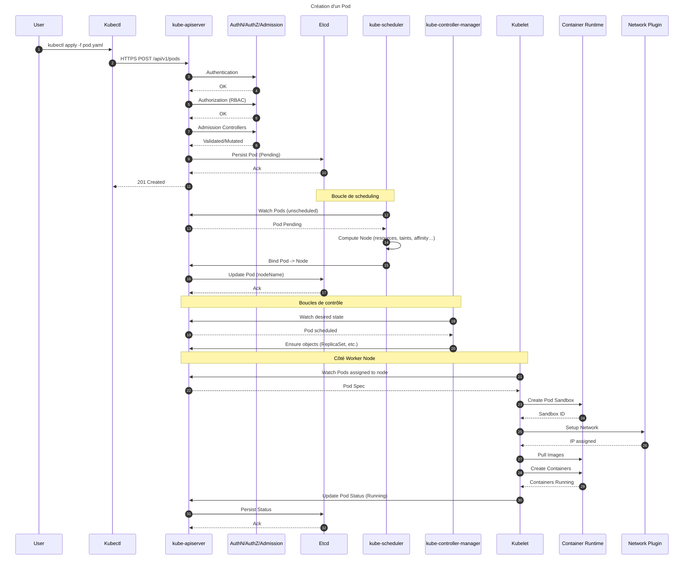

```mermaid
---
title: "Création d'un Pod"
---
sequenceDiagram
    autonumber
    participant User
    participant Kubectl
    participant APIServer as kube-apiserver
    participant Auth as AuthN/AuthZ/Admission
    participant Etcd
    participant Scheduler as kube-scheduler
    participant Controller as kube-controller-manager
    participant Kubelet
    participant CRI as Container Runtime
    participant CNI as Network Plugin

    User->>Kubectl: kubectl apply -f pod.yaml
    Kubectl->>APIServer: HTTPS POST /api/v1/pods

    APIServer->>Auth: Authentication
    Auth-->>APIServer: OK
    APIServer->>Auth: Authorization (RBAC)
    Auth-->>APIServer: OK
    APIServer->>Auth: Admission Controllers
    Auth-->>APIServer: Validated/Mutated

    APIServer->>Etcd: Persist Pod (Pending)
    Etcd-->>APIServer: Ack

    APIServer-->>Kubectl: 201 Created

    Note over Scheduler,Etcd: Boucle de scheduling

    Scheduler->>APIServer: Watch Pods (unscheduled)
    APIServer-->>Scheduler: Pod Pending
    Scheduler->>Scheduler: Compute Node (resources, taints, affinity…)
    Scheduler->>APIServer: Bind Pod -> Node
    APIServer->>Etcd: Update Pod (nodeName)
    Etcd-->>APIServer: Ack

    Note over Controller,APIServer: Boucles de contrôle

    Controller->>APIServer: Watch desired state
    APIServer-->>Controller: Pod scheduled
    Controller->>APIServer: Ensure objects (ReplicaSet, etc.)

    Note over Kubelet,APIServer: Côté Worker Node

    Kubelet->>APIServer: Watch Pods assigned to node
    APIServer-->>Kubelet: Pod Spec

    Kubelet->>CRI: Create Pod Sandbox
    CRI-->>Kubelet: Sandbox ID

    Kubelet->>CNI: Setup Network
    CNI-->>Kubelet: IP assigned

    Kubelet->>CRI: Pull Images
    Kubelet->>CRI: Create Containers
    CRI-->>Kubelet: Containers Running

    Kubelet->>APIServer: Update Pod Status (Running)
    APIServer->>Etcd: Persist Status
    Etcd-->>APIServer: Ack
```

