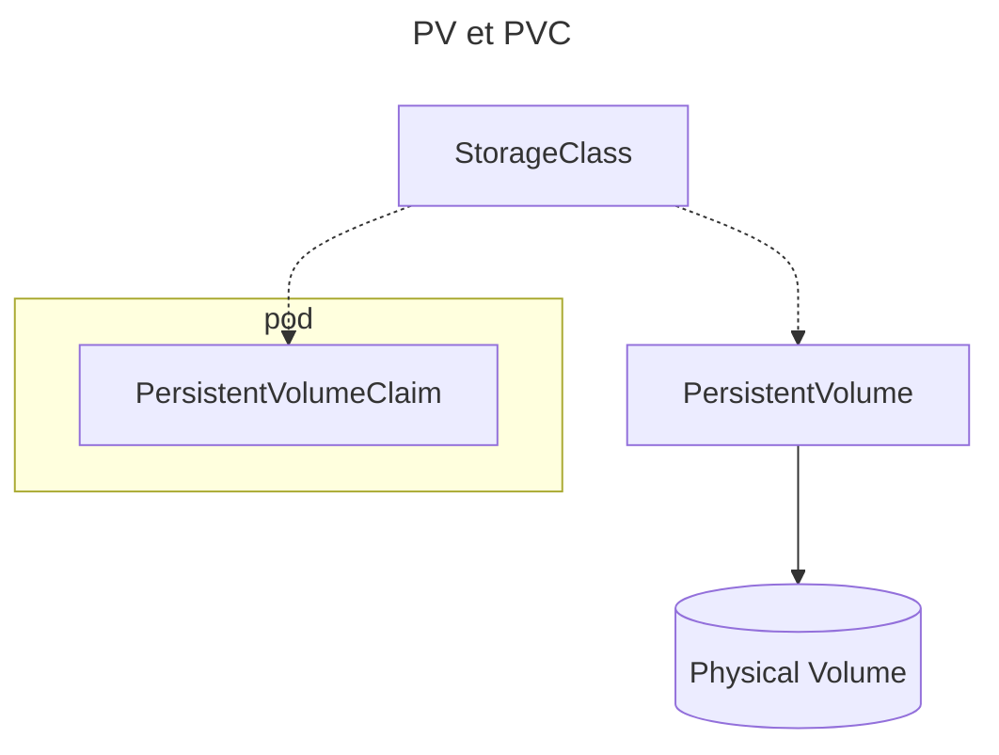

## 💾 Stockage

---

### 📂 Volume

- `Volume` : **Points de montage** d'un Pod 📂
- Pas de ressource dans l'_API Server_ (~`kubectl get volumes`~) ⚠️
- Très similaire à _Docker_ 🐳
- Pour accès aux configs, persistence, filesystem temporaire, … 📂
- Accessible à tous les _Conteneurs_ du _Pod_ 📦
- Détruit (ou détaché si _remote_) à la destruction du Pod (persiste au redémarrage du conteneur) ⚠️

---

### 📂 Quelques types de Volumes

- `emptyDir` : Volume vide, supprimé avec le Pod (mais partage entre conteneurs du pod) 🗑️
- `hostPath` : Monte un répertoire du Host vers le Pod 📂
- `configMap` : Monte des fichiers de configuration 📝
- `PersistentVolume` : `iscsi`, `nfs`, `cephfs` 💾
- [Doc: Types de Volumes supportés](https://kubernetes.io/docs/concepts/storage/volumes/) 📚

---

:::tip

- Il est possible d'injecter des volumes issus d'images OCI : [Injecter des volumes issus d'images OCI](https://kubernetes.io/docs/tasks/configure-pod-container/image-volumes/) 📦
- Exemple : Image Docker custom `FROM scratch` + un binaire à injecter dans le conteneur principal 🐳

:::

---

### 💾 PersistentVolume

- `PersistentVolume` (PV) : Vision _storage_ du cluster Kubernetes 💾
- **Stockage extérieur** à la vision _conteneur/pod_ 📦
- Représente un disque concret : Local, NFS, iSCSI, SMB, EBS, SAN, … 💾
  - Existe dans l'_API Server_ : `kubectl get persistentvolumes` 📂
  - Durée de vie indépendante du pod 🔄
  - ~Ne peut **pas être associé directement**~ à un _Pod_ ⚠️
  - [Doc: Types de PV supportés](https://kubernetes.io/docs/concepts/storage/persistent-volumes/#types-of-persistent-volumes) 📚
- `PersistentVolumeClaim` : Réquisition d'un `PV` 📝
  - Permet l'association d'un disque à un _Pod_ 📦
  - États : `Pending` (création `PVC`) -> `Bound` (attaché au `Pod`) -> `Terminating` (attente de suppression) 🔄

---

StorageClass, PersistentVolume, PersistentVolumeClaim et volume physique.

---

### 📌 En résumé

- `Volume` => Vision _container_ : Un point de montage pour configs, persistence, filesystem temporaire, … 📂
- `PersistentVolume` (`PV`) => Vision _storage_ du cluster Kubernetes, un espace de stockage 💾
- `PersistentVolumeClaim` (`PVC`) => Un type de _Volume_ permettant de réquisitionner et d'utiliser un `PV` dans un `Pod` 📝

---

### 💾 Quelques solutions de stockage

| Solution | Type | Mode d'accès | Cas d'usage |
|---------|------|--------------|-------------|
| _AWS EBS CSI_ | Stockage en bloc | `RWO` (noeud unique) | Stockage haute performance sur AWS 🌐 |
| _Google Persistent Disk CSI_ | Stockage en bloc | `RWO` (noeud unique) | Applications cloud-native sur GCP ☁️ |
| _Ceph RBD CSI_ | Stockage distribué | `RWO`, `RWX` | Bases de données distribuées 🗃️ |
| _Longhorn CSI_ | Stockage local | `RWO`, `RWX` | Stockage persistant natif Kubernetes 📦 |

---

### 📂 Volumes statiques - Ordre des opérations

- Création du volume `PV` par l'utilisateur : Taille, type de stockage, … 📦
- Création du `PVC` par l'utilisateur : Taille et type de stockage requis (correspond à un PV existant qui répond à ces critères) 📝
- Association entre `PVC` et `PV` par Kubernetes 🔗
- Utilisation du `Volume` par un `Pod` 📦

---

### 🔄 Volumes dynamiques - Ordre des opérations

- `PVC` : L'utilisateur demande un volume persistant et spécifie une `StorageClass` 📝
- _Provisionnement_ du `Volume` via le driver `CSI` (_Container Storage Interface_) associé à la `StorageClass` 📦
- _Attachement du volume_ au _Node_ par le `CSI` 🔗
- _Montage du volume_ dans le _conteneur_ depuis le _Node_ 📦

---

### 🔒 Modes d'accès

`PV` et `PVC` ont des _access modes_ : 🔒

- `ReadWriteOnce` : Un seul _Node_ peut accéder au volume à la fois 🔒
- `ReadWriteMany` : Plusieurs _Node_ peuvent accéder au volume simultanément 🔒
- `ReadOnlyMany` : Plusieurs _Node_ peuvent accéder au volume (mais pas écrire dedans) 🔒
- `ReadWriteOncePod` : Un seul _Pod_ peut accéder au volume 🔒

- Un `PV` liste les modes d'accès **qu'il supporte** 🔒
- Un `PVC` liste des **contraintes** sur les droits d'accès : Seul un `PV` les supportant peut être réquisitionné 🔒

Voir [la documentation](https://kubernetes.io/docs/concepts/storage/persistent-volumes/#access-modes) 📚

---
