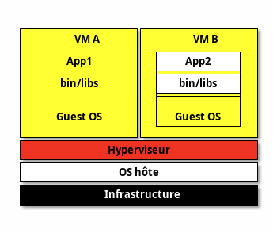
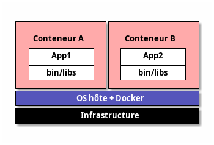

# Conception du schéma de partitionnement

---

# Architecture des disques

- Disque -> Partition -> Filesystem -> Mount point
- Montage dans n'importe quel répertoire vide mais par convention :
  - `/mnt` pour montages "classiques"
  - `/media` pour périphériques temporaires : clé USB, ...
    + distribution récente : `/media/USER_NAME/DISK_LABEL`

---

GParted est un outil graphique permettant de voir les partitions d'un disque (source: Wikipedia)

---

# LVM : Logical Volume Manager

- `Physical Volume PV` : disque physique (gère `RAID`, ...)
- `Volume Group VG` : pool de `PV`
- `Logical Volumes LVs` : découpage de `VG`
- Données gérées par unités (`extents`) : `PE` (`PV`) et `LE` (`LV`)
- les `LVs` peuvent être distribués sur plusieurs disques, gèrent chiffrement, ...
- `LV` accessible comme disque classique : `dev/VGNAME/LVNAME`

---

# Partitionnement

- Bonne pratique : **séparer le système en plusieurs partitions**
- `/` : partition `root`, obligatoire, système principal
- `/boot` : contient les données de boot : `kernel`, `bootloader`, ...
- `/boot/efi` : montage de la partition `ESP`.
- `/home` : fichiers personnels et configurations des utilisateurs
- `/var` : données variables (`/var/logs`, `/var/tmp`, `/var/cache`) ou fichiers changeant pendant l'exécution (`/var/www/html`, `/var/lib/mysql`, `/var/lib/docker`)
- `swap` pour augmenter la RAM en utilisant un disque (non monté)

### Démo

---

# Installation d'un gestionnaire d'amorçage

Voir le TP [tp-grub][tp-grub] déjà réalisé.

---

# Gestion des bibliothèques partagées

---

## Bibliothèque partagée

- `Shared Objects`
- _Ensemble de fonctions que les programmes peuvent réutiliser pour implémenter leurs fonctionnalités_.
- Liées au programme exécutable de manière :
  - **statique** : l'exécutable final contient les fonctions de la bibliothèque dans ses propres fichiers (`NOM_LIBRAIRIE.a` : `libpthread.a`)
  - **dynamique** (ou **partagée**) : bibliothèque chargée en mémoire RAM quand le programme aura besoin d'exécuter les fonctions qu'elle contient. (`NOM_LIBRAIRIE.so.VERSION` : `glibc.so.6`)
    + Windows : `DLL`

---

## Répertoires standards

- `/lib`
- `/lib32`
- `/lib64`
- `/usr/lib`
- `/usr/local/lib`

---

## Répertoires additionnels et cache

- `/etc/ld.so.conf` (ou `/etc/ld.so.conf.d/`) : indique les autres librairies à utiliser, puis...
- `ldconfig` : crée les liens symboliques vers les librairies et met à jour le cache...
- `/etc/ld.so.cache` : fichier de cache
- `LD_LIBRARY_PATH` : variable d'environnement supplémentaire pour scanner des répertoires de librairies (similaire à `$PATH`)

---

## Afficher les dépendances

- `ldd <executable>` : affiche les librairies dépendantes
- `ldd -u <executable>` : affiche les librairies dépendantes _unused_

---

- Voir le cours _102.3 Manage shared libraries_ p.87
- Voir aussi la [wikiversité sur les librairies partagées](https://fr.wikiversity.org/wiki/Certification_Linux_LPI/Administrateur_syst%C3%A8me_d%C3%A9butant/Examen_101/Installation_de_Linux_et_gestion_des_packages/G%C3%A9rer_les_biblioth%C3%A8ques_partag%C3%A9es)
- Voir le TP dédié [tp-shared-lib][tp-shared-lib].

---

# Utilisation des gestionnaires de paquetage Debian (apt, dpkg) et RHEL (dnf, rpm, yum)

---

# Gestionnaires de Paquets

Outils essentiels pour gérer l'installation, la mise à jour et la suppression de logiciels depuis une plateforme centrale vérifiée.

---

## Avantages

- Installation facile : Un simple commande installe le logiciel et ses dépendances.
- Mises à jour centralisées : Facilité de maintenir les logiciels à jour.
- Gestion des dépendances : Installation automatique des composants requis.
- Désinstallation propre : Suppression sans laisser de résidus.
- Sécurité :
  - Les paquets proviennent de sources fiables et vérifiées.
  - Mises à jour régulières pour corriger les vulnérabilités.

---

## Principaux gestionnaires de paquets

- APT (Advanced Package Tool) : Utilisé par Debian et dérivés (Ubuntu).
- RPM (Red Hat Package Manager) : Utilisé par Red Hat, Fedora, CentOS.
- Voir le TP dédié [tp-rpm-apt][tp-rpm-apt].

---

# Linux en tant que système virtuel hébergé

---

## Technologies de Virtualisation : Hyperviseurs

- Hyperviseur de Type 1 : Exécuté directement sur le matériel, ex. `Xen`, `KVM`
- Hyperviseur de Type 2 : Exécuté au-dessus d'un système d'exploitation, ex. `KVM`, `Oracle VirtualBox`.
- Conteneurs : Isole des ressources grâce aux `cgroups`, ex. `Docker`, `LXC`, ...

---

## Architecture d'une machine virtuelle (fully-virtualized)

---

## Architecture d'un conteneur

---

## Commandes

- `virt-host-validate` : informations sur le support de la virtualisation par l'hyperviseur
- `virsh` : créer et gérer des machines virtuelles (KVM, …)

---

## Principaux types de disques virtuels

- `RAW` : la taille totale du disque virtuel est réquisitionnée à la création
- `COW` : quota de taille maximale, espace réquisitionné à l'usage

---

## UUID

- Besoin d'identifiants uniques de machines virtuelles : _d-bus machine id_
- `dbus-uuidgen --ensure`, `dbus-uuidgen --get`
- stocké dans `/var/lib/dbus/machine-id` (symlink `/etc/machine-id`)

---

## SSH [TCP 22]

- `ssh` (Secure SHell) : protocole de communication sécurisé :
  - Utilisé majoritairement pour ouvrir un shell sur un ordinateur distant Unix.
  - Indispensable pour les machines virtuelles

---

- Impose un échange de clés de chiffrement en début de connexion : tous les segments TCP sont authentifiés et chiffrés
- Compatible cryptographie asymétrique (RSA/DSA) avec clef privée/publique
- sshv2 fournit `scp` et `sftp` avec la même configuration

---

- `ssh-keygen` crée les clés SSH (public + privée) dans `~/.ssh`
- `ssh-copy-id -i <public_key> user@cloud_server` : copie la clé publique sur le serveur (dans `~user/.ssh/authorized_keys`)
- Les permissions des fichiers de clés doivent être :
  + `0600` pour la clé privée
  + `0644` pour la clé publique

---

## Cloud-init

- Génère des machines virtuelles ou conteneurs dans un environnement de Cloud
- Fichier de configuration `YAML`

---

