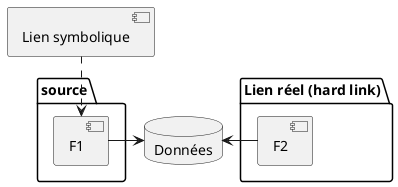
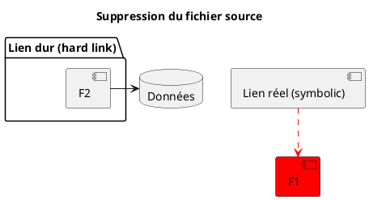

## inode

- _Index node_ : structure de données qui stocke les attributs d'un fichier
- permissions, propriétaire, bloc disque de stockage, ...

---

## Liens symboliques

- Type spécial de fichier
- _Lien symbolique_ (ou lien faible, _soft link_) : pointe vers le chemin d'un autre fichier (_target_)
  + `ln -s TARGET NOM_DU_LIEN`
  + Si suppression de la target, pointe vers rien
- _Lien réel_ (_hard link_) : 2e référence vers le même fichier
  + toujours 1 seul inode
  + `ln TARGET NOM_DU_LIEN`

---

---

---

