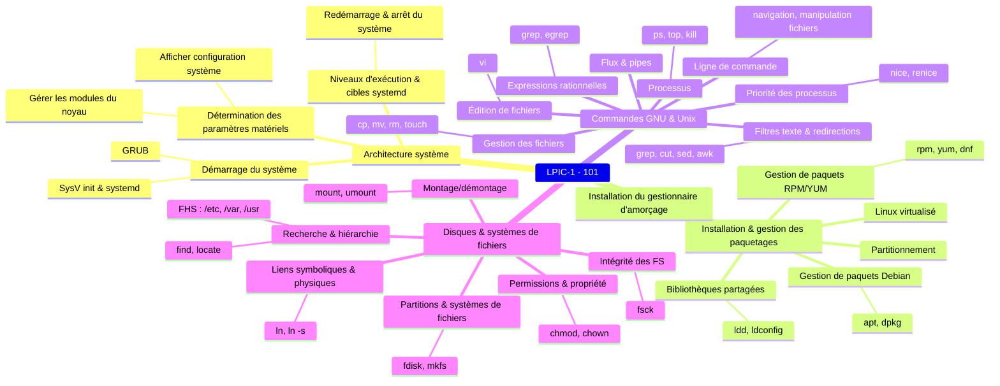

## Objectifs

- Reconnaître le matériel : ports PCI / USB, paramétrage du BIOS / UEFI
- Savoir installer et configurer un système GNU/Linux sur un poste de type PC
- Savoir utiliser les niveaux d’exécution et cibles systemd du système
- Savoir installer et désinstaller les programmes sur les distributions des familles RedHat ou Debian, et gérer les bibliothèques partagées.
- Connaître les spécificités de Linux en tant que système virtualisé.
- Bien utiliser la ligne de commande Linux (Bash, vi)
- Gérer les disques, partitions et systèmes de fichiers courants
- Gestion des fichiers : permissions et propriétés, recherche et liens

---

## Ressources utiles

- [Support de cours](https://learning.lpi.org/fr/learning-materials/101-500/)
- [Support de cours (PDF)](https://learning.lpi.org/pdfstore/LPI-Learning-Material-101-500-en.pdf)
- [Objectifs détaillés de la certification LPIC-101](https://www.lpi.org/fr/our-certifications/exam-102-objectives)
- [Livre Bash beginner's guide](https://ftp.traduc.org/doc-vf/guides/Bash-Beginners-Guide/)
- Aide simple sur les commandes : <https://cheat.sh/>
- Explication graphique de commandes Shell complexes : <https://explainshell.com/>
- [Créer une distribution "Live" (qui reste en mémoire) - tuto complet, reprend les principes de base, du boot à un système minimal](https://zestedesavoir.com/tutoriels/268/creer-son-premier-rim-linux/)

---

## Conventions de notation

- Les commandes et noms de fichiers apparaissent dans le texte avec `cette syntaxe`.
- Les descriptions de commandes suivent le formalisme des _man pages_ :
  - Les symboles `<>` indiquent un argument obligatoire.
  - Les symboles `[]` indiquent un argument optionnel.  

---

## Plan de cours

### Sujet 101 : Architecture système [8]

- 101.1 Détermination et configuration des paramètres du matériel [2]
  - TP : affichage de la configuration du système et des périphériques
  - TP : gestion des modules noyau
- 101.2 Démarrage du système [3]
  - TP : Grub
  - TP : SysV init et systemd init
- 101.3 Changement de niveaux d'exécution / des cibles de démarrage de systemd et arrêt ou redémarrage du système. [3]

---

### Sujet 102 : Installation de Linux et gestion de paquetages [12]

- 102.1 Conception du schéma de partitionnement [2]
- 102.2 Installation d'un gestionnaire d'amorçage [2]
- 102.3 Gestion des bibliothèques partagées [1]
  - TP : librairies partagées
- 102.4 Utilisation du gestionnaire de paquetage Debian [3]
- 102.5 Utilisation des gestionnaires de paquetage RPM et YUM [3]
  - TP : Gestion de paquetages : rpm, yum et dnf vs dpkg et apt
- 102.6 Linux en tant que système virtuel hébergé [1]

---

### Sujet 103 : Commandes GNU et Unix [26]

- 103.1 Travail en ligne de commande [4]
  - TP : Utilisation de la ligne de commande
- 103.2 Traitement de flux de type texte avec des filtres [2]
  - TP : Traitement de flux de type texte avec filtres et expressions rationnelles
- 103.3 Gestion élémentaire des fichiers [4]
  - TP : Gestion des fichiers
- 103.4 Utilisation des flux, des pipes et des redirections [4]
  - TP : Utilisation des flux, des pipes et des redirections 
- 103.5 Création, contrôle et interruption des processus [4]
- 103.6 Modification des priorités des processus [2]
  - TP : Gestion des processus et de leur priorité
- 103.7 Recherche dans des fichiers texte avec les expressions rationnelles [3]
- 103.8 Édition de fichier simple [3]
  - TP : Introduction à vi

---

### Sujet 104 : Disques, systèmes de fichiers Linux, arborescence de fichiers standard (FHS) [14]

- 104.1 Création des partitions et des systèmes de fichiers [2]
- 104.2 Maintenance de l'intégrité des systèmes de fichiers [2]
- 104.3 Montage et démontage des systèmes de fichiers [3]
  - TP : Gestion des partitions et des systèmes de fichiers
- 104.4 Supprimé
- 104.5 Gestion des permissions et de la propriété sur les fichiers [3]
- 104.6 Création et modification des liens physiques et symboliques sur les fichiers [2]
- 104.7 Recherche de fichiers et placement des fichiers aux endroits adéquats [2]
  - TP : Gestion avancée de fichiers - permissions, liens, recherche

---

