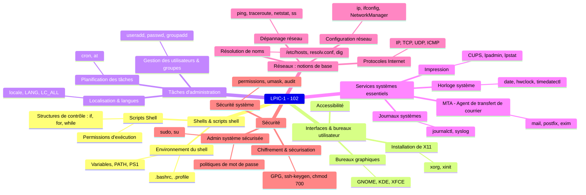

## Objectifs

- Paramétrer le shell et écrire des scripts simples en `Bash`
- Installer et configurer l'interface graphique
- Connaître les outils d'accessibilité
- Effectuer les tâches d'administration de base : gérer les utilisateurs, utiliser les tâches automatiques, …
- Installer et paramétrer les services essentiels : messagerie, impression, horloge système, journaux système
- Avoir les notions de réseau essentielles à l'administration système : protocoles Internet, configuration réseau des postes, résolution `DNS` et dépannage
- Savoir mettre en place un niveau de sécurité sur les postes : services en écoute et ports ouverts, limitations d'accès, et chiffrement des données

---

## Plan de cours

---

### Sujet 105 : Shells et scripts Shell [8]

- 105.1 Personnalisation et utilisation de l'environnement du shell [4]
- 105.2 Personnalisation ou écriture de scripts simples [4]

---

### Sujet 106 : Interfaces et bureaux utilisateur [4]

- 106.1 Installation et configuration de X11 [2]
- 106.2 Bureaux graphiques [1]
- 106.3 Accessibilité [1]

---

### Sujet 107 : Tâches d'administration [12]

- 107.1 Gestion des comptes utilisateurs et des groupes ainsi que des fichiers systèmes concernés [5]
- 107.2 Automatisation des tâches d'administration par la planification des travaux [4]
- 107.3 Paramètres régionaux et langues [3]

---

### Sujet 108 : Services systèmes essentiels [12]

- 108.1 Gestion de l'horloge système [3]
- 108.2 Journaux systèmes [4]
- 108.3 Bases sur l'agent de transfert de courrier (MTA) [3]
- 108.4 Gestion des imprimantes et de l'impression [2]

---

### Sujet 109 : Notions élémentaires sur les réseaux [14]

- 109.1 Notions élémentaires sur les protocoles Internet [4]
- 109.2 Configuration réseau persistante [4]
- 109.3 Résolution de problèmes réseaux simples [4]
- 109.4 Configuration de la résolution de noms [2]

---

### Sujet 110 : Securité [10]

- 110.1 Tâches d'administration de sécurité [3]
- 110.2 Configuration de la sécurité du système [3]
- 110.3 Sécurisation des données avec le chiffrement [4]

---

## Ressources utiles

- [Support de cours](https://learning.lpi.org/en/learning-materials/102-500/)
- [Objectifs détaillés de la certification LPIC-102](https://www.lpi.org/fr/our-certifications/exam-102-objectives)
- [Livre Bash beginner's guide](https://ftp.traduc.org/doc-vf/guides/Bash-Beginners-Guide/)
- Aide simple sur les commandes : <https://cheat.sh/>
- Explication graphique de commandes Shell complexes : <https://explainshell.com/>
- [Créer une distribution "Live" (qui reste en mémoire) - tuto complet, reprend les principes de base, du boot à un système minimal](https://zestedesavoir.com/tutoriels/268/creer-son-premier-rim-linux/)

---

## Conventions de notation

- Les commandes et noms de fichiers apparaissent dans le texte avec `cette syntaxe`.
- Les descriptions de commandes suivent le formalisme des _man pages_ :
  - Les symboles `<>` indiquent un argument obligatoire.
  - Les symboles `[]` indiquent un argument optionnel.  

---

