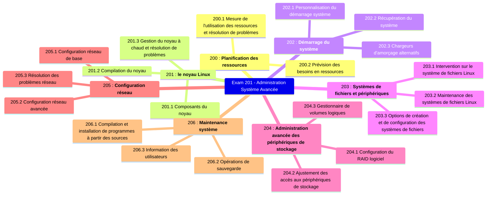
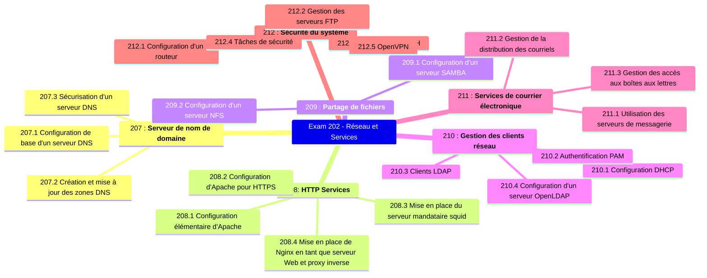

## Exam 201

### Sujet 200 : Planification des ressources

#### 200.1 Mesure de l'utilisation des ressources et résolution de problèmes (valeur : 6)

> Les candidats doivent être capables de mesurer les ressources matérielles et la bande passante du réseau, d'identifier et de résoudre les problèmes de ressources.

Domaines de connaissances clés :

- Mesurer l'utilisation du processeur.
- Mesurer l'utilisation de la mémoire.
- Mesurer les E/S disque.
- Mesurer les E/S réseau.
- Mesurer le débit du pare-feu et du routage.
- Cartographier l'utilisation de la bande passante client.
- Associer les symptômes système aux problèmes probables.
- Estimer le débit et identifier les goulots d'étranglement d'un système, y compris le réseau.

Voici une liste partielle des fichiers, termes et utilitaires utilisés :

- `iostat`
- `iotop`
- `vmstat`
- `netstat`
- `ss`
- `iptraf`
- `pstree`, `ps`
- `w`
- `lsof`
- `top`
- `htop`
- `uptime`
- `sar`
- `swap`
- processus bloqués sur les E/S (I/O)
- blocages en entrée
- blocages en sortie

#### 200.2 Prévision des besoins en ressources (valeur : 2)

> Les candidats doivent être capables de surveiller l'utilisation des ressources pour prévoir les besoins futurs en ressources.

Domaines de connaissances clés :

- Utiliser des outils de surveillance et de mesure pour surveiller l'utilisation de l'infrastructure informatique.
- Prévoir le point de rupture de capacité d'une configuration.
- Observer le taux de croissance de l'utilisation de la capacité.
- Représenter graphiquement la tendance de l'utilisation de la capacité.
- Connaissance des solutions de surveillance telles qu'Icinga2, Nagios, Collectd, MRTG et Cacti.

Voici une liste partielle des fichiers, termes et utilitaires utilisés :

- diagnostiquer
- prédire la croissance des consommations de ressources
- épuisement des ressources

### Sujet 201 : le noyau Linux

#### 201.1 Composants du noyau (valeur : 2)

> Les candidats doivent être capables d'utiliser les composants du noyau nécessaires à un matériel, des pilotes matériels, des ressources système et des exigences spécifiques. Cet objectif comprend l'implémentation de différents types d'images de noyau, la compréhension des noyaux et des correctifs stables et durables, ainsi que l'utilisation des modules du noyau.

Domaines de connaissances clés :

- Documentation des noyaux 2.6.x, 3.x & 4.x

Voici une liste partielle des fichiers, termes et utilitaires utilisés :

- `/usr/src/linux/`
- `/usr/src/linux/Documentation/`
- `zImage`
- `bzImage` 
- Compression `xz`

#### 201.2 Compilation du noyau (valeur : 3)

> Les candidats doivent être capables de configurer correctement un noyau afin d'inclure ou de désactiver certaines fonctionnalités du noyau Linux, selon les besoins. Cet objectif comprend la compilation et la recompilation du noyau Linux selon les besoins, la mise à jour et l'enregistrement des modifications dans un nouveau noyau, la création d'une image _initrd_ et l'installation de nouveaux noyaux.

Domaines de connaissances clés :

- `/usr/src/linux/`
- Makefiles du noyau
- Cibles de création des noyaux 2.6.x, 3.x et 4.x
- Personnaliser la configuration actuelle du noyau.
- Construire un nouveau noyau et les modules appropriés.
- Installer un nouveau noyau et des modules.
- S'assurer que le gestionnaire de démarrage peut localiser le nouveau noyau et les fichiers associés.
- Fichiers de configuration des modules
- Utiliser _DKMS_ pour compiler les modules du noyau.
- Connaître _dracut_

Voici une liste partielle des fichiers, termes et utilitaires utilisés :

- `mkinitrd`
- `mkinitramfs`
- `make`
- `make` targets (`all`, `config`, `xconfig`, `menuconfig`, `gconfig`, `oldconfig`, `mrproper`, `zImage`, `bzImage`, `modules`, `modules_install`, `rpm-pkg`, `binrpm-pkg`, `deb-pkg`) 
- `gzip`
- `bzip2 `
- module tools
- `/usr/src/linux/.config`
- `/lib/modules/kernel-version/`
- `depmod`
- `dkms`

#### 201.3 Gestion du noyau à chaud et résolution de problèmes (valeur : 4)

> Les candidats doivent être capables de gérer et/ou d'interroger un noyau 2.6.x, 3.x ou 4.x et ses modules chargeables. Ils doivent être capables d'identifier et de corriger les problèmes courants de démarrage et d'exécution. Ils doivent comprendre la détection et la gestion des périphériques avec udev. Cet objectif inclut le dépannage des règles udev.

Domaines de connaissances clés :

- Utiliser des utilitaires en ligne de commande pour obtenir des informations sur le noyau et ses modules en cours d'exécution.
- Charger et décharger manuellement les modules du noyau.
- Déterminer quand les modules peuvent être déchargés.
- Déterminer les paramètres acceptés par un module.
- Configurer le système pour charger les modules sous des noms autres que leur nom de fichier.
- Système de fichiers `/proc`
- Contenu de `/`, `/boot/` et `/lib/modules/`
- Outils et utilitaires pour analyser les informations sur le matériel disponible
- Règles _udev_

Voici une liste partielle des fichiers, termes et utilitaires utilisés :

- `/lib/modules/kernel-version/modules.dep`
- `module configuration files in /etc/`
- `/proc/sys/kernel/`
- `/sbin/depmod`
- `/sbin/rmmod`
- `/sbin/modinfo`
- `/bin/dmesg`
- `/sbin/lspci`
- `/usr/bin/lsdev`
- `/sbin/lsmod`
- `/sbin/modprobe`
- `/sbin/insmod`
- `/bin/uname`
- `/usr/bin/lsusb `
- `/etc/sysctl.conf`, `/etc/sysctl.d/`
- `/sbin/sysctl `
- `udevmonitor`
- `udevadm monitor`
- `/etc/udev/`

### Sujet 202 : Démarrage du système

#### 202.1 Personnalisation du démarrage système (valeur : 3)

> Les candidats doivent être capables d'interroger et de modifier le comportement des services système à différents niveaux d'exécution et cibles. Une connaissance approfondie de _systemd_, _SysV Init_ et du processus de démarrage Linux est requise. Cet objectif inclut l'interaction avec les cibles _systemd_ et les niveaux d'exécution _SysV init_.

Domaines de connaissances clés :

- Systemd
- SysV init
- Linux Standard Base Specification (LSB) 

Voici une liste partielle des fichiers, termes et utilitaires utilisés :

- `/usr/lib/systemd/`
- `/etc/systemd/`
- `/run/systemd/`
- `systemctl`
- `systemd-delta`
- `/etc/inittab`
- `/etc/init.d/`
- `/etc/rc.d/`
- `chkconfig`
- `update-rc.d`
- `init` & `telinit`

#### 202.2 Récupération du système (valeur : 4)

> Les candidats doivent être capables de manipuler correctement un système Linux pendant le démarrage et en mode de récupération. Cet objectif inclut l'utilisation de l'utilitaire init et des options du noyau liées à l'initialisation. Ils doivent être capables de déterminer la cause des erreurs de chargement et d'utilisation des chargeurs de démarrage. GRUB version 2 et GRUB Legacy sont les chargeurs de démarrage concernés. Les systèmes BIOS et UEFI sont couverts.

Domaines de connaissances clés :

- _BIOS_ et _UEFI_
- Démarrage NVMe
- _GRUB_ version 2 et Legacy
- Shell GRUB
- Démarrage du chargeur de démarrage et transfert au noyau
- Chargement du noyau
- Initialisation et configuration du matériel
- Initialisation et configuration du démon/service
- Connaître les différents emplacements d'installation du chargeur de démarrage sur un disque dur ou un périphérique amovible.
- Remplacer les options standard du chargeur de démarrage et utiliser les shells du chargeur de démarrage.
- Utiliser les modes de secours et d'urgence de systemd.

Voici une liste partielle des fichiers, termes et utilitaires utilisés :

- `mount`
- `fsck`
- _inittab_, _telinit_ & _init_ avec _SysV init_
- Contenus de `/boot/`, `/boot/grub/` & `/boot/efi/`
- _EFI System Partition_ (_ESP_)
- _GRUB_
- `grub-install`
- `efibootmgr`
- Shell _UEFI_
- `initrd`, `initramfs`
- _Master boot record_ (_MBR_)
- `systemctl`

#### 202.3 Chargeurs d'amorçage alternatifs (valeur : 2)

> Les candidats doivent connaître les autres chargeurs de démarrage et leurs principales fonctionnalités.

Domaines de connaissances clés :

- _SYSLINUX_, _ISOLINUX_, _PXELINUX_
- Compréhension de _PXE_ pour le _BIOS_ et l'_UEFI_
- Connaissance de _systemd-boot_ et d'_U-Boot_

Voici une liste partielle des fichiers, termes et utilitaires utilisés :

- `syslinux`
- `extlinux`
- `isolinux.bin`
- `isolinux.cfg`
- `isohdpfx.bin`
- `efiboot.img`
- `pxelinux.0`
- `pxelinux.cfg/`
- `uefi/shim.efi`
- `uefi/grubx64.efi`

### Sujet 203 : Systèmes de fichiers et périphériques

#### 203.1 Intervention sur le système de fichiers Linux (valeur : 4)

> Les candidats doivent être capables de configurer et de naviguer correctement dans le système de fichiers Linux standard. Cet objectif comprend la configuration et le montage de différents types de systèmes de fichiers.

Domaines de connaissances clés :

- Concept de configuration `fstab`
- Outils et utilitaires pour la gestion des partitions et fichiers d'échange
- Utilisation des _UUID_ pour l'identification et le montage des systèmes de fichiers
- Compréhension des unités de montage _systemd_

Voici une liste partielle des fichiers, termes et utilitaires utilisés :

- `/etc/fstab`
- `/etc/mtab`
- `/proc/mounts`
- `mount` & `umount`
- `blkid`
- `sync`
- `swapon`
- `swapoff `

#### 203.2 Maintenance des systèmes de fichiers Linux (valeur : 3)

> Les candidats doivent être capables de maintenir correctement un système de fichiers Linux à l'aide d'utilitaires système. Cet objectif comprend la manipulation de systèmes de fichiers standard et la surveillance d'appareils SMART.

Domaines de connaissances clés :

- Outils et utilitaires pour manipuler _ext2_, _ext3_ et _ext4_
- Outils et utilitaires pour effectuer des opérations _Btrfs_ de base, notamment sur les sous-volumes et les snapshots
- Outils et utilitaires pour manipuler _XFS_
- Connaissance de _ZFS_

Voici une liste partielle des fichiers, termes et utilitaires utilisés :

- `mkfs` (`mkfs.*`)
- `mkswap`
- `fsck` (`fsck.*`)
- `tune2fs`, `dumpe2fs` & `debugfs`
- `btrfs`, `btrfs-convert`
- `xfs_info`, `xfs_check`, `xfs_repair`, `xfsdump` & `xfsrestore`
- `smartd`, `smartctl`

#### 203.3 Options de création et de configuration des systèmes de fichiers (valeur : 2)

> Les candidats doivent être capables de configurer des systèmes de fichiers à montage automatique avec AutoFS. Cet objectif comprend la configuration du montage automatique pour les systèmes de fichiers réseau et périphériques. Il comprend également la création de systèmes de fichiers pour des périphériques tels que des CD-ROM et une connaissance des fonctionnalités de base des systèmes de fichiers chiffrés.

Domaines de connaissances clés :

- Fichiers de configuration _autofs_
- Compréhension des unités de montage automatique
- Outils et utilitaires _UDF_ et _ISO9660_
- Connaissance des autres systèmes de fichiers CD-ROM (_HFS_)
- Connaissance des extensions de systèmes de fichiers CD-ROM (_Joliet_, _Rock Ridge_, _El Torito_)
- Connaissance des fonctionnalités de base du chiffrement des données (`dm-crypt` / _LUKS_)

Voici une liste partielle des fichiers, termes et utilitaires utilisés :

- `/etc/auto.master`
- `/etc/auto.[dir]`
- `mkisofs`
- `cryptsetup`

### Sujet 204 : Administration avancée des périphériques de stockage

#### 204.1 Configuration du RAID logiciel (valeur : 3)

> Les candidats doivent être capables de configurer et de mettre en œuvre un RAID logiciel. Cet objectif comprend l'utilisation et la configuration des RAID 0, 1 et 5.

Domaines de connaissances clés :

- Fichiers et utilitaires de configuration _RAID_ logiciel

Voici une liste partielle des fichiers, termes et utilitaires utilisés :

- `mdadm.conf`
- `mdadm`
- `/proc/mdstat`
- partition type `0xFD`

#### 204.2 Ajustement des accès aux périphériques de stockage (valeur : 2)

> Les candidats doivent être capables de configurer les options du noyau pour prendre en charge différents lecteurs. Cet objectif comprend des outils logiciels permettant de visualiser et de modifier les paramètres du disque dur, y compris les périphériques iSCSI.

Domaines de connaissances clés :

- Outils et utilitaires pour configurer le _DMA_ pour les périphériques _IDE_, notamment _ATAPI_ et _SATA_
- Outils et utilitaires pour configurer les disques _SSD_, notamment _AHCI_ et _NVMe_
- Outils et utilitaires pour manipuler ou analyser les ressources système (par exemple, les interruptions)
- Connaissance de la commande `sdparm` et de ses utilisations
- Outils et utilitaires pour _iSCSI_
- Connaissance du _SAN_, notamment des protocoles pertinents (_AoE_, _FCoE_)

Voici une liste partielle des fichiers, termes et utilitaires utilisés :

- `hdparm`, `sdparm`
- `nvme`
- `tune2fs`
- `fstrim`
- `sysctl`
- `/dev/hd*`, `/dev/sd*`, `/dev/nvme*`
- `iscsiadm`, `scsi_id`, `iscsid` & `iscsid.conf`
- `WWID`, `WWN`, `LUN` numbers

#### 204.3 Gestionnaire de volumes logiques (valeur : 3)

> Les candidats doivent être capables de créer et de supprimer des volumes logiques, des groupes de volumes et des volumes physiques. Cet objectif inclut les snapshots et le redimensionnement des volumes logiques.

Domaines de connaissances clés :

- Outils de la suite _LVM_
- Redimensionnement, renommage, création et suppression de volumes logiques, de groupes de volumes et de volumes physiques
- Création et maintenance d'instantanés
- Activation de groupes de volumes

Voici une liste partielle des fichiers, termes et utilitaires utilisés :

- `/sbin/pv*`
- `/sbin/lv*`
- `/sbin/vg*`
- `mount`
- `/dev/mapper/ `
- `lvm.conf`

### Sujet 205 : Configuration réseau

#### 205.1 Configuration réseau de base (valeur : 3)

> Les candidats doivent être capables de configurer un périphérique réseau pour se connecter à un réseau local, filaire ou sans fil, et à un réseau étendu. Cet objectif inclut la capacité à communiquer entre différents sous-réseaux d'un même réseau, y compris les réseaux IPv4 et IPv6.

Domaines de connaissances clés :

- Utilitaires de configuration et de manipulation des interfaces réseau Ethernet
- Configuration de l'accès de base aux réseaux sans fil

Voici une liste partielle des fichiers, termes et utilitaires utilisés :

- `ip`
- `ifconfig`
- `route`
- `arp`
- `iw`
- `iwconfig`
- `iwlist`

#### 205.2 Configuration réseau avancée (valeur : 4)

> Les candidats doivent être capables de configurer un périphérique réseau pour mettre en œuvre différents schémas d'authentification réseau. Cet objectif comprend la configuration d'un périphérique réseau multi-résident et la résolution des problèmes de communication.

Domaines de connaissances clés :

- Utilitaires de manipulation des tables de routage
- Utilitaires de configuration et de manipulation des interfaces réseau Ethernet
- Utilitaires d'analyse de l'état des périphériques réseau
- Utilitaires de surveillance et d'analyse du trafic TCP/IP

Voici une liste partielle des fichiers, termes et utilitaires utilisés :

- `ip`
- `ifconfig`
- `route`
- `arp`
- `ss`
- `netstat`
- `lsof`
- `ping`, `ping6`
- `nc`
- `tcpdump`
- `nmap`

#### 205.3 Résolution des problèmes réseau (valeur : 4)

> Les candidats doivent être capables d'identifier et de corriger les problèmes courants de configuration du réseau, notamment la connaissance des emplacements des fichiers de configuration et des commandes de base.

Domaines de connaissances clés :

- Emplacement et contenu des fichiers de restriction d'accès
- Utilitaires de configuration et de manipulation des interfaces réseau Ethernet
- Utilitaires de gestion des tables de routage
- Utilitaires de listage des états du réseau
- Utilitaires d'obtention d'informations sur la configuration réseau
- Méthodes d'information sur les périphériques matériels reconnus et utilisés
- Fichiers d'initialisation système et leur contenu (_Systemd_ et _SysV init_)
- Connaissance de _NetworkManager_ et de son impact sur la configuration réseau

Voici une liste partielle des fichiers, termes et utilitaires utilisés :

- `ip`
- `ifconfig`
- `route`
- `ss`
- `netstat`
- `/etc/network/, /etc/sysconfig/network-scripts/`
- `ping, ping6`
- `traceroute, traceroute6`
- `mtr`
- `hostname`
- System log files such as `/var/log/syslog`, `/var/log/messages` & the `systemd` journal
- `dmesg`
- `/etc/resolv.conf`
- `/etc/hosts`
- `/etc/hostname`, `/etc/HOSTNAME`
- `/etc/hosts.allow`, `/etc/hosts.deny`

### Sujet 206 : Maintenance système

#### 206.1 Compilation et installation de programmes à partir des sources (valeur : 2)

> Les candidats doivent être capables de créer et d'installer un programme exécutable à partir des sources. Cet objectif inclut la capacité à décompresser un fichier de sources.

Domaines de connaissances clés :

- Décompresser le code source à l'aide d'utilitaires courants de compression et d'archivage.
- Comprendre les bases de `make` pour compiler des programmes.
- Appliquer des paramètres à un script de configuration.
- Savoir où les sources sont stockées par défaut.

Voici une liste partielle des fichiers, termes et utilitaires utilisés :

- `/usr/src/`
- `gunzip`
- `gzip`
- `bzip2`
- `xz`
- `tar`
- `configure`
- `make`
- `uname`
- `install `
- `patch`

#### 206.2 Opérations de sauvegarde (valeur : 3)

> Les candidats doivent être capables d'utiliser les outils système pour sauvegarder les données système importantes.

Domaines de connaissances clés :

- Connaissance des répertoires à inclure dans les sauvegardes
- Connaissance des solutions de sauvegarde réseau telles qu'_Amanda_, _Bacula_, _Bareos_ et _BackupPC_
- Connaissance des avantages et inconvénients des bandes, _CDR_, disques ou autres supports de sauvegarde
- Réalisation de sauvegardes partielles et manuelles
- Vérification de l'intégrité des fichiers de sauvegarde
- Restauration partielle ou totale des sauvegardes

Voici une liste partielle des fichiers, termes et utilitaires utilisés :

- `/bin/sh`
- `dd`
- `tar`
- `/dev/st*` & `/dev/nst*`
- `mt`
- `rsync `

#### 206.3 Information des utilisateurs (valeur : 1)

> Les candidats doivent être en mesure d'informer les utilisateurs des problèmes actuels liés au système.

Domaines de connaissances clés :

- Automatiser la communication avec les utilisateurs via des messages de connexion.
- Informer les utilisateurs actifs de la maintenance du système.

Voici une liste partielle des fichiers, termes et utilitaires utilisés :

- `/etc/issue`
- `/etc/issue.net`
- `/etc/motd`
- `wall`
- `shutdown `
- `systemctl`

## Exam 202

### Sujet 207 : Serveur de nom de domaine

#### 207.1 Configuration de base d'un serveur DNS (valeur : 3)

> Les candidats doivent être capables de configurer _BIND_ pour qu'il fonctionne comme un serveur DNS faisant autorité et récursif, avec mise en cache uniquement. Cet objectif inclut la capacité à gérer un serveur en cours d'exécution et à configurer la journalisation.

Domaines de connaissances clés :

- Fichiers de configuration, termes et utilitaires BIND 9.x
- Définition de l'emplacement des fichiers de zone BIND dans les fichiers de configuration BIND
- Rechargement des fichiers de configuration et de zone modifiés
- Connaissance de `dnsmasq`, `djbdns` et _PowerDNS_ comme serveurs de noms alternatifs

Voici une liste partielle des fichiers, termes et utilitaires utilisés :

- `/etc/named.conf`
- `/var/named/`
- `rndc`
- `named-checkconf`
- `kill `
- `host`
- `dig`

#### 207.2 Création et mise à jour des zones DNS (valeur : 3)

> Les candidats doivent être capables de créer un fichier de zone pour une zone directe ou inverse, ainsi que des conseils pour les serveurs racine. Cet objectif comprend la définition de valeurs appropriées pour les enregistrements, l'ajout d'hôtes dans les zones et l'ajout de zones au DNS. Un candidat doit également être capable de déléguer des zones à un autre serveur DNS.

Domaines de connaissances clés :

- Fichiers de configuration, termes et utilitaires BIND 9
- Utilitaires permettant de demander des informations au serveur DNS
- Disposition, contenu et emplacement des fichiers de zone BIND
- Différentes méthodes pour ajouter un nouvel hôte aux fichiers de zone, y compris les zones inversées

Voici une liste partielle des fichiers, termes et utilitaires utilisés :

- `/var/named/`
- zone file syntax
- resource record formats
- `named-checkzone`
- `named-compilezone`
- `masterfile-format`
- `dig`
- `nslookup`
- `host `

#### 207.3 Sécurisation d'un serveur DNS (valeur : 2)

> Les candidats doivent être capables de configurer un serveur DNS pour qu'il s'exécute en tant qu'utilisateur non root et dans une prison « chroot ». Cet objectif inclut l'échange sécurisé de données entre les serveurs DNS.

Domaines de connaissances clés :

- Fichiers de configuration de _BIND 9_
- Configuration de _BIND_ pour une exécution dans une prison `chroot`
- Configuration fractionnée de _BIND_ à l'aide de l'instruction forwarders
- Configuration et utilisation des signatures de transaction (_TSIG_)
- Connaissance de _DNSSEC_ et des outils de base
- Connaissance de _DANE_ et des enregistrements associés

Voici une liste partielle des fichiers, termes et utilitaires utilisés :

- `/etc/named.conf`
- `/etc/passwd`
- _DNSSEC_
- `dnssec-keygen `
- `dnssec-signzone`

### Sujet 208 : HTTP Services

#### 208.1 Configuration élémentaire d'Apache (valeur : 4)

> Les candidats doivent être capables d'installer et de configurer un serveur web. Cet objectif comprend la surveillance de la charge et des performances du serveur, la restriction de l'accès des utilisateurs clients, la configuration de la prise en charge des langages de script sous forme de modules et la mise en place de l'authentification des utilisateurs clients. La configuration des options du serveur pour restreindre l'utilisation des ressources est également incluse. Les candidats doivent être capables de configurer un serveur web pour utiliser des hôtes virtuels et personnaliser l'accès aux fichiers.

Domaines de connaissances clés :

- Fichiers de configuration, termes et utilitaires Apache 2.4
- Configuration et contenu des fichiers journaux _Apache_
- Méthodes et fichiers de restriction d'accès
- Configuration de `mod_perl` et PHP
- Fichiers et utilitaires d'authentification des utilisateurs clients
- Configuration du nombre maximal de requêtes, ainsi que du nombre minimal et maximal de serveurs et de clients
- Implémentation d'un hôte virtuel Apache 2.4 (avec et sans adresses IP dédiées)
- Utilisation des instructions de redirection dans les fichiers de configuration Apache pour personnaliser l'accès aux fichiers

Voici une liste partielle des fichiers, termes et utilitaires utilisés :

- access logs & error logs
- `.htaccess`
- `httpd.conf`
- `mod_auth_basic`, `mod_authz_host` & `mod_access_compat`
- `htpasswd`
- `AuthUserFile`, `AuthGroupFile`
- `apachectl`, `apache2ctl`
- `httpd`, `apache2`

#### 208.2 Configuration d'Apache pour HTTPS (valeur : 3)

> Les candidats doivent être capables de configurer un serveur Web pour fournir HTTPS.

Domaines de connaissances clés :

- Fichiers de configuration, outils et utilitaires _SSL_
- Générer une clé privée et une _CSR_ pour une autorité de certification commerciale
- Générer un certificat auto-signé
- Installer la clé et le certificat, y compris les autorités de certification intermédiaires
- Configurer l'hébergement virtuel avec _SNI_
- Connaître les problèmes liés à l'hébergement virtuel et à l'utilisation de _SSL_
- Problèmes de sécurité liés à l'utilisation de _SSL_ : désactiver les protocoles et chiffrements non sécurisés

Voici une liste partielle des fichiers, termes et utilitaires utilisés :

- Fichiers de configuration _Apache2_
- `/etc/ssl/`, `/etc/pki/`
- `openssl`, _CA.pl_
- _SSLEngine_, _SSLCertificateKeyFile_, _SSLCertificateFile_
- _SSLCACertificateFile_, _SSLCACertificatePath_
- _SSLProtocol_, _SSLCipherSuite_, _ServerTokens_, _ServerSignature_, _TraceEnable_

#### 208.3 Mise en place du serveur mandataire squid (valeur : 2)

> Les candidats doivent être capables d'installer et de configurer un serveur proxy, y compris les politiques d'accès, l'authentification et l'utilisation des ressources.

Domaines de connaissances clés :

- Fichiers de configuration, termes et utilitaires de Squid 3.x
- Méthodes de restriction d'accès
- Méthodes d'authentification des utilisateurs clients
- Disposition et contenu des listes de contrôle d'accès dans les fichiers de configuration de _Squid_

Voici une liste partielle des fichiers, termes et utilitaires utilisés :

- `squid.conf`
- `acl`
- `http_access`

#### 208.4 Mise en place de Nginx en tant que serveur Web et proxy inverse (valeur : 2)

> Les candidats doivent être capables d'installer et de configurer un serveur proxy inverse, Nginx. La configuration de base de Nginx comme serveur HTTP est incluse.

Domaines de connaissances clés :

- _Nginx_
- Reverse Proxy
- Serveur web basique

Voici une liste partielle des fichiers, termes et utilitaires utilisés :

- `/etc/nginx/`
- `nginx`

### Sujet 209 : Partage de fichiers

#### 209.1 Configuration d'un serveur SAMBA (valeur : 5)

> Les candidats doivent être capables de configurer un serveur Samba pour différents clients. Cet objectif comprend la configuration de Samba en tant que serveur autonome et son intégration dans un annuaire Active Directory. La configuration de partages CIFS et d'imprimantes simples est également abordée. La configuration d'un client Linux pour l'utilisation d'un serveur Samba est également abordée. Le dépannage des installations est également testé.

Domaines de connaissances clés :

- Documentation _Samba 4_
- Fichiers de configuration Samba 4
- Outils, utilitaires et daemons Samba 4
- Montage de partages _CIFS_ sous Linux
- Mappage des noms d'utilisateur Windows vers les noms d'utilisateur Linux
- Sécurité au niveau utilisateur, au niveau partage et _AD_

Voici une liste partielle des fichiers, termes et utilitaires utilisés :

- `smbd`, `nmbd`, `winbindd`
- `smbcontrol`, `smbstatus`, `testparm`, `smbpasswd`, `nmblookup`
- `samba-tool`
- `net`
- `smbclient`
- `mount.cifs`
- `/etc/samba/`
- `/var/log/samba/ `

#### 209.2 Configuration d'un serveur NFS (valeur : 3)

> Les candidats doivent être capables d'exporter des systèmes de fichiers via NFS. Cet objectif comprend les restrictions d'accès, le montage d'un système de fichiers NFS sur un client et la sécurisation de NFS.

Domaines de connaissances clés :

- Fichiers de configuration _NFS_ version 3
- Outils et utilitaires NFS
- Restrictions d'accès à certains hôtes et/ou sous-réseaux
- Options de montage sur serveur et client
- _Wrappers_ TCP
- Connaissance de NFSv4

Voici une liste partielle des fichiers, termes et utilitaires utilisés :

- `/etc/exports`
- `exportfs`
- `showmount`
- `nfsstat`
- `/proc/mounts`
- `/etc/fstab`
- `rpcinfo`
- `mountd`
- `portmapper`

### Sujet 210 : Gestion des clients réseau

#### 210.1 Configuration DHCP (valeur : 2)

> Les candidats doivent être capables de configurer un serveur DHCP. Cet objectif comprend la définition d'options par défaut et par client, l'ajout d'hôtes statiques et d'hôtes BOOTP. La configuration d'un agent relais DHCP et la maintenance du serveur DHCP sont également incluses.

Domaines de connaissances clés :

- Fichiers de configuration DHCP, termes et utilitaires
- Configuration des sous-réseaux et des plages allouées dynamiquement
- Connaissance des annonces DHCPv6 et IPv6 des routeurs

Voici une liste partielle des fichiers, termes et utilitaires utilisés :

- `dhcpd.conf`
- `dhcpd.leases`
- Messages de log DHCP dans `syslog` ou le journal `systemd`
- `arp`
- `dhcpd `
- `radvd`
- `radvd.conf`

#### 210.2 Authentification PAM (valeur : 3)

> Le candidat doit être capable de configurer PAM pour prendre en charge l'authentification à l'aide de diverses méthodes disponibles, notamment les fonctionnalités SSSD de base.

Domaines de connaissances clés :

- PAM configuration files, terms & utilities
- Mots de passe `passwd` & `shadow`
- Authentification LDAP par `ssd`

Voici une liste partielle des fichiers, termes et utilitaires utilisés :

- `/etc/pam.d/`
- `pam.conf`
- `nsswitch.conf`
- `pam_unix`, `pam_cracklib`, `pam_limits`, `pam_listfile`, `pam_sss`
- `sssd.conf`

#### 210.3 Clients LDAP (valeur : 2)

> Les candidats doivent être capables d'effectuer des requêtes et des mises à jour sur un serveur LDAP. Ils doivent également être capables d'importer et d'ajouter des éléments, ainsi que d'ajouter et de gérer des utilisateurs.

Domaines de connaissances clés :

- Utilitaires LDAP pour la gestion et les requêtes de données
- Modification des mots de passe des utilisateurs
- Interrogation de l'annuaire LDAP

Voici une liste partielle des fichiers, termes et utilitaires utilisés :

- `ldapsearch`
- `ldappasswd`
- `ldapadd`
- `ldapdelete `

#### 210.4 Configuration d'un serveur OpenLDAP (valeur : 4)

> Les candidats doivent être capables de configurer un serveur OpenLDAP de base, y compris la connaissance du format LDIF et des contrôles d'accès essentiels.

Domaines de connaissances clés :

- _OpenLDAP_
- Directory based configuration
- _Access Control_
- _Distinguished Names_
- _Changetype Operations_
- _Schemas_ & _Whitepages_
- Directories
- Object _IDs_, _Attributs_ & _Classes_

Voici une liste partielle des fichiers, termes et utilitaires utilisés :

- `slapd`
- `slapd-config`
- `LDIF`
- `slapadd`
- `slapcat`
- `slapindex`
- `/var/lib/ldap/`
- `loglevel`

### Sujet 211 : Services de courrier électronique

#### 211.1 Utilisation des serveurs de messagerie (valeur : 4)

> Les candidats doivent être capables de gérer un serveur de messagerie, notamment la configuration des alias, des quotas et des domaines de messagerie virtuels. Cet objectif comprend la configuration des relais de messagerie internes et la surveillance des serveurs de messagerie.

Domaines de connaissances clés :

- Fichiers de configuration pour _Postfix_
- Configuration _TLS_ de base pour _Postfix_
- Connaissances de base du protocole _SMTP_
- Connaissances de _Sendmail_ et d'_Exim_

Voici une liste partielle des fichiers, termes et utilitaires utilisés :

- Fichiers de configuration et commandes pour Postfix
- `/etc/postfix/`
- `/var/spool/postfix/`
- Commandes de la couche d'émulation Sendmail
- `/etc/aliases`
- Logs liés aux mails dans `/var/log/`

#### 211.2 Gestion de la distribution des courriels (valeur : 2)

> Les candidats doivent être capables de mettre en œuvre un logiciel de gestion des e-mails clients pour filtrer, trier et surveiller les e-mails entrants des utilisateurs.

Domaines de connaissances clés :

- Compréhension des fonctionnalités, de la syntaxe et des opérateurs de _Sieve_
- Utilisation de _Sieve_ pour filtrer et trier les e-mails par expéditeur, destinataire(s), en-têtes et taille
- Connaissance de _procmail_

Domaines de connaissances clés :

- Conditions et opérateurs de comparaison
- `keep`, `fileinto`, `redirect`, `reject`, `discard`, `stop`
- Dovecot vacation extension

#### 211.3 Gestion des accès aux boîtes aux lettres (valeur: 2)

> Les candidats doivent être capables d'installer et de configurer les démons POP et IMAP.

Domaines de connaissances clés :

- Configuration et administration IMAP et POP3 de Dovecot
- Configuration TLS de base pour Dovecot
- Connaissance de _Courier_

Voici une liste partielle des fichiers, termes et utilitaires utilisés :

- `/etc/dovecot/`
- `dovecot.conf `
- `doveconf`
- `doveadm`

### Sujet 212 : Sécurité du système

#### 212.1 Configuration d'un routeur (valeur : 3)

> Les candidats doivent être capables de configurer un système pour transférer des paquets IP et effectuer la traduction d'adresses réseau (NAT, masquage IP), et d'expliquer son importance pour la protection d'un réseau. Cet objectif comprend la configuration de la redirection de ports, la gestion des règles de filtrage et la prévention des attaques.

Domaines de connaissances clés :

- Fichiers de configuration, outils et utilitaires `iptables` et `ip6tables`
- Outils, commandes et utilitaires pour gérer les tables de routage.
- Plages d'adresses privées (IPv4), adresses locales uniques et adresses de liaison locale (IPv6).
- Redirection de port et transfert IP.
- Liste et écriture de règles de filtrage acceptant ou bloquant les paquets IP en fonction du protocole source ou de destination, du port et de l'adresse.
- Enregistrement et rechargement des configurations de filtrage.

Voici une liste partielle des fichiers, termes et utilitaires utilisés :

- `/proc/sys/net/ipv4/`
- `/proc/sys/net/ipv6/`
- `/etc/services`
- `iptables `
- `ip6tables`

#### 212.2 Gestion des serveurs FTP (valeur : 2)

> Les candidats doivent être capables de configurer un serveur FTP pour les téléchargements anonymes. Cet objectif comprend les précautions à prendre si les téléchargements anonymes sont autorisés et la configuration de l'accès utilisateur.

Domaines de connaissances clés :

- Fichiers de configuration, outils et utilitaires pour _Pure-FTPd_ et _vsftpd_
- Connaissance de _ProFTPd_
- Compréhension des connexions FTP passives et actives

Voici une liste partielle des fichiers, termes et utilitaires utilisés :

- `vsftpd.conf`
- Options importantes de la ligne de commande _Pure-FTPd_

#### 212.3 Shell sécurisé (SSH) (valeur : 4)

> Les candidats doivent être capables de configurer et de sécuriser un démon SSH. Cet objectif comprend la gestion des clés et la configuration de SSH pour les utilisateurs. Ils doivent également être capables de transférer un protocole d'application via SSH et de gérer la connexion SSH.

Domaines de connaissances clés :

- Fichiers de configuration, outils et utilitaires _OpenSSH_
- Restrictions de connexion pour le superutilisateur et les utilisateurs normaux
- Gestion et utilisation des clés serveur et client pour la connexion avec et sans mot de passe
- Utilisation de connexions multiples depuis plusieurs hôtes pour se prémunir contre la perte de connexion à un hôte distant suite à des modifications de configuration

Voici une liste partielle des fichiers, termes et utilitaires utilisés :

- `ssh`
- `sshd`
- `/etc/ssh/sshd_config`
- `/etc/ssh/`
- Fichiers de clés privées et publiques
- `PermitRootLogin`, `PubKeyAuthentication`, `AllowUsers`, `PasswordAuthentication`, `Protocol` 

#### 212.4 Tâches de sécurité (valeur : 3)

> Les candidats doivent être capables de recevoir des alertes de sécurité provenant de diverses sources, d'installer, de configurer et d'exécuter des systèmes de détection d'intrusion et d'appliquer des correctifs de sécurité et des corrections de bogues.

Domaines de connaissances clés :

- Outils et utilitaires pour analyser et tester les ports d'un serveur
- Sites et organisations signalant les alertes de sécurité via _Bugtraq_, _CERT_ ou autres sources
- Outils et utilitaires pour mettre en œuvre un système de détection d'intrusion (_IDS_)
- Connaissance d'_OpenVAS_ et de _Snort_

Voici une liste partielle des fichiers, termes et utilitaires utilisés :

- `telnet`
- `nmap`
- `fail2ban`
- `nc`
- `iptables `

#### 212.5 OpenVPN (valeur : 2)

> Les candidats doivent être capables de configurer un VPN (réseau privé virtuel) et de créer des connexions sécurisées point à point ou site à site.

Domaines de connaissances clés :

- OpenVPN 

Voici une liste partielle des fichiers, termes et utilitaires utilisés :

- `/etc/openvpn/`
- `openvpn`

