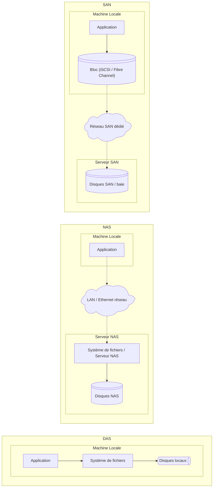

- **DAS** (*Direct Attached Storage*) : solution de stockage directement connectée à un serveur
  - **SATA**, **SCSI**, **USB**
  - Performances élevées mais pas de partage de données entre plusieurs machines.
- **NAS** (*Network Attached Storage*) : un **serveur de fichiers** connecté au réseau local (LAN)
  - **NFS**, **SMB/CIFS**.
  - Permet à plusieurs utilisateurs ou serveurs de partager des fichiers centralisés, avec une administration simplifiée.
- **SAN** (*Storage Area Network*) : **infrastructure réseau dédiée au stockage**
  - **Fibre Channel**, **iSCSI**
  - **Accès au niveau bloc** à haute performance et haute disponibilité
	- **Datacenters** et environnements virtualisés.

---

---

| **Critère**                    | **DAS** *(Direct Attached Storage)*                               | **NAS** *(Network Attached Storage)*               | **SAN** *(Storage Area Network)*                                      |
| ------------------------------ | ----------------------------------------------------------------- | -------------------------------------------------- | --------------------------------------------------------------------- |
| **Type de connexion**          | Directe au serveur via USB, SATA, SCSI                            | Réseau local (Ethernet)                            | Réseau dédié au stockage (Fibre Channel, iSCSI)                       |
| **Niveau d'accès**             | Bloc                                                              | Fichier (NFS, SMB/CIFS)                            | Bloc                                                                  |
| **Topologie**                  | Serveur connecté directement à un disque ou une baie              | Serveurs accèdent à un stockage partagé via le LAN | Plusieurs serveurs accèdent à un stockage via un réseau dédié         |
| **Partage**                    | Non partagé                                                       | Partagé entre plusieurs clients                    | Partagé entre plusieurs serveurs                                      |
| **Performance**                | Excellente en local (faible latence)                              | Moyenne (dépend du réseau LAN)                     | Très élevée (réseau haut débit dédié)                                 |
| **Scalabilité**                | Limitée à la capacité locale                                      | Moyenne, ajout de NAS possible                     | Très élevée (ajout de baies et serveurs à la SAN)                     |
| **Disponibilité**              | Dépend du serveur hôte                                            | Bonne, selon redondance réseau et disques          | Très haute, redondance intégrée (RAID, multi-chemins, etc.)           |
| **Protocole de communication** | SATA, SCSI, SAS                                                   | NFS, SMB/CIFS, FTP                                 | Fibre Channel, iSCSI, FCoE                                            |
| **Administration**             | Simple (gérée localement)                                         | Centralisée (accès via IP et interface web)        | Complexe (logiciels spécialisés, zoning, LUN, etc.)                   |
| **Utilisation typique**        | Stockage d'un serveur unique, poste de travail, sauvegarde locale | Stockage centralisé pour utilisateurs d’un réseau  | Environnements virtualisés, datacenters, clusters haute disponibilité |
| **Coût**                       | Faible                                                            | Moyen                                              | Élevé                                                                 |
| **Exemples d'usage**           | Disque externe d'un serveur                                       | NAS Synology ou TrueNAS pour PME                   | SAN Dell EMC, NetApp, HP pour datacenter                              |
| **Avantage principal**         | Simplicité et rapidité                                            | Partage de fichiers facile                         | Performance, flexibilité et haute disponibilité                       |
| **Inconvénient principal**     | Non partageable                                                   | Performances limitées par le réseau                | Coût et complexité de gestion                                         |

---

