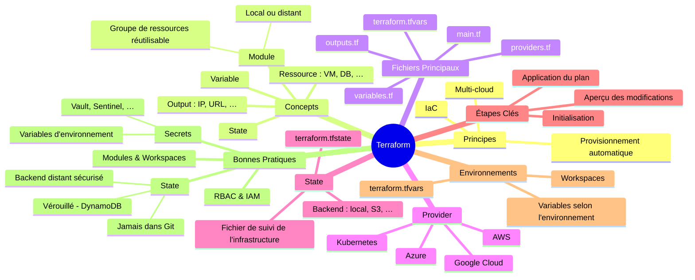

---

## 🎯 Objectifs

- Gérer des ressources dans un cluster Cloud avec une notion d'état grâce à Terraform. ☁️

---

## 🛠️ Présentation de Terraform

- Outil IaC de déploiement et mise à jour d'infrastructures hétérogènes (via fichiers `.tf`) 🏗️
- Déclaratif 📜
- Statefull (vs Ansible : stateless) 🔄
- Majoritairement pour le Cloud (multi-provider: _Azure_, _AWS_, _GCP_, …) ☁️
  - Fournisseur CRUD de _ressources_ (modifiables) et _data source_ (immuable) par API [Terraform Registry](https://registry.terraform.io) 🔗
- Séparation plan vs application : `refresh`, `plan`, `apply`, `destroy`, … 🔄
- Modules partagés pour les infrastructures courantes 🧩

---

> Outil de _provisionning_ les plus utilisés (2025) : Terraform (39%), Ansible (35%), GCP (32%) (d'après : <https://www.docker.com/blog/2025-docker-state-of-app-dev/>).

---

## ❓ Pourquoi Terraform ? (Problématique)

### Enjeux

- Reproductibilité de l'infrastructure
- Gestion des dépendances
- Versionnage et collaboration (avec Git)

### Cas d'usage

- Déploiements multi-environnement
- Projets DevOps
- Déploiement d'applications multi-composants

### Complémentarité

- Jenkins / GitLab CI (déploiements automatiques)
- Ansible (provisioning)
- Vault (gestion des secrets)
- Sentinel (politiques de gouvernance)

---

## 🔄 Fonctionnement

1. **Fichiers** IaC pour lancer Terraform : `*.tf` 📄
2. Compare l'**état actuel** (`terraform.tfstate` ou remote state) au plan => changements / créations 🔄
3. Utilise les API des **providers** pour effectuer les changements 🌐
4. Stocke l'**état des changements** (`terraform.tfstate.backup` et nouveau `terraform.tfstate`) 💾

---

## 📋 Étapes

1. `terraform init` => Initialise Terraform et installe les plugins
1. `terraform plan` => Plannifie l'exécution des changements (`terraform graph`)
1. `terraform apply` => Exécute le plan
1. `terraform destroy` => Détruit les ressources

---

## 📄 Fichiers

| Fichier | Description |
| --- | --- |
| `main.tf` | Configuration de l'infrastructure 🏗️ |
| `variables.tf` | Déclaration des variables 📝 |
| `terraform.tfvars` | Valeurs des variables 📝 |
| `modules` | Groupes logiques de ressources dans fichiers `.tf` dédiés (~= _role_ Ansible) 🧩 |

---

### 📄 Exemples de fichiers Terraform

```tf
terraform {
  required_providers {
    docker = {
      source = "kreuzwerker/docker"
      version = "~> 3.0.1"
    }
  }
}

provider "docker" {}

resource "docker_image" "nginx" {
  name         = "nginx:latest"
  keep_locally = false
}

resource "docker_container" "nginx" {
  image = docker_image.nginx.image_id
  name  = "tutorial"
  ports {
    internal = 80
    external = 8000
  }
}
```

```tf
provider "kubernetes" {
    version = "~> 1.10"
}

resource "aws_instance" "ma_ressource_web" {
    ami = "mon_id"
    instance_type = "t2.micro"
    subnet_id = var.environnement == "production" ? aws_subnet.prod_subnet.id : aws_subnet.dev_subnet.id
}

# data => données extraites de l'infrastructure
data "aws_ami" "ubuntu" {
    most_recent = true
}
```

---

## Variables

---

### Variable string

```tf
# accès par `var.mon_ip`
variable "mon_ip" {
    type = string
    default = "192.168.1.1"
}

output "affiche_mon_ip" {
    value = var.mon_ip
}
```

---

### Variable list

```tf
# pour les types multiples : `count` et `for-each`
variable "mes_ips" {
    default = ["127.0.0.1 localhost","192.168.1.1 mon_ip"]
}

resource "null_resource" "mes_hosts" {
    count = "${length(var.mes_ips)}"
    triggers = { foo = element(var.mes_ips, count.index } # déclenché si mes_ips change
    provisioner "local_exec" {
        command = "echo '${element(var.mes_ips, count.index)}' >> hosts.txt"
    }
```

---

### Variable map (objet)

```tf
variable "mes_distributions" {
    type = "map"
    default = {
        clef1 = "ubuntu"
        clef2 = "rhel"
        clef3 = "alpine"
    }
}

resource "aws_instance" "mes_serveurs" {
    for_each = var.mes_distributions
    triggers = { foo = each.value } # déclenché si mes_distributions change
    tags = { Name = each.key }
}
```

---

### Dynamic Blocks

```hcl
dynamic "rule" {
  for_each = var.rules
  content {
    name     = rule.value.name
    priority = rule.value.priority
    ...
  }
}
```

- Génération dynamique des blocs de configuration : règles NSG, disques attachés, …
- Fonctions utiles :
  - `count` et `for_each`
  - _tertiaire conditionnel_ : `condition ? "valeur1" : "valeur2"`

---

### 📊 Précédence des variables

Ordre de chargement des variables (les derniers écrasent les précédents) :

1. Variables d'environnement (préfixe `TF_VAR_`)

    ```bash
    export TF_VAR_region=francecentral
    ```

2. Fichier `terraform.tfvars`

    ```hcl
    # terraform.tfvars
    variable "region" {
      default = "westeurope"
    }
    ```

3. Fichier `terraform.tfvars.json`

    ```json
    # terraform.tfvars.json
    {
      "variable": {
        "region": {
          "default": "northamerica"
        }
      }
    }
    ```

4. Fichiers `*.auto.tfvars` ou `*.auto.tfvars.json` (dans l'ordre lexicographique)
5. Options en ligne de commande de `terraform apply` : `-var` et `-var-file` (dans l'ordre où elles sont fournies)

    ```bash
    terraform apply -var region="northafrica" -var-file varfile.tfvars
    ```

---

## 🛠️ Provisionneurs

### 👤 user-data

- ⚙️ Paramètres communs aux instances "compute" : AWS EC2, Azure VM, OpenStack instance
- 📝 Permet d'exécuter un script `cloud-init` à la création de la VM : installation de packages, …

```hcl {5-11}
resource "aws_instance" "web" {
  ami           = "ami-04505e74c0741db8d"
  instance_type = "t2.micro"

  user_data = <<-EOF
              #!/bin/bash
              apt update -y
              apt install nginx -y
              systemctl enable nginx
              systemctl start nginx
              EOF

  tags = {
    Name = "web-server"
  }
}
```

---

:::tip
💠 Azure utilise le champ similaire : `custom_data` mais la data **doit être encodée en Base 64** :

```hcl {14}
resource "azurerm_linux_virtual_machine" "example" {
  name                  = "vm-example"
  resource_group_name   = azurerm_resource_group.rg.name
  location              = azurerm_resource_group.rg.location
  size                  = "Standard_B1s"
  admin_username        = "azureuser"
  network_interface_ids = [azurerm_network_interface.main.id]

  admin_ssh_key {
    username   = "azureuser"
    public_key = file("~/.ssh/id_rsa.pub")
  }

  custom_data = filebase64("init.sh")
}
```
:::

---

### 🌐 remote-exec

- 🔧 Provisioner permettant d'exécuter des commandes par SSH (ou WinRM) sur une ressource distante (VM, …) après sa création.

```hcl {30-47}
resource "azurerm_linux_virtual_machine" "vm" {
  name                  = "vm-remoteexec"
  resource_group_name   = azurerm_resource_group.rg.name
  location              = azurerm_resource_group.rg.location
  size                  = "Standard_B1s"
  admin_username        = "azureuser"
  network_interface_ids = [azurerm_network_interface.nic.id]

  admin_ssh_key {
    username   = "azureuser"
    public_key = file("~/.ssh/id_rsa.pub")
  }

  os_disk {
    name                 = "osdisk-demo"
    caching              = "ReadWrite"
    storage_account_type = "Standard_LRS"
  }

  source_image_reference {
    publisher = "Canonical"
    offer     = "0001-com-ubuntu-server-jammy"
    sku       = "22_04-lts"
    version   = "latest"
  }

  # -------------------------------
  # remote-exec provisioner
  # -------------------------------
  provisioner "remote-exec" {
    inline = [
      "sudo apt update -y",
      "sudo apt install nginx -y",
      "sudo systemctl enable nginx",
      "sudo systemctl start nginx"
    ]
    # inline ou script :
    # script = "setup_web.sh"

    connection {
      type        = "ssh"
      host        = azurerm_public_ip.pubip.ip_address
      user        = "azureuser"
      private_key = file("~/.ssh/id_rsa")
      timeout     = "2m"
    }
  }
}
```

---

:::warn
Les provisioner de commandes (`remote-exec`, `local-exec`) rendent les déploiements moins déclaratifs et plus difficiles à reproduire.
:::

---

### ⚙️ local-exec

💻 Permet d'exécuter du code sur la machine tournant Terraform :

- 🪵 **Logging** : `echo ${self.public_ip} >> ips.txt`
- 🧩 **Exécution de scripts** : `command = "bash ./post_deploy.sh ${self.public_ip}"`
- 🌐 **Appels d'APIs externes** : `curl -X POST https://hooks.slack.com/...`
- ➕ …

```hcl
provisioner "local-exec" {
  command     = "Write-Host VM deployed!"
  interpreter = ["PowerShell", "-Command"]
}
```

---

:::tip
💡 Un cas d'usage courant est le lancement d'un playbook _Ansible_ depuis _Terraform_ :

```hcl
provisioner "local-exec" {
  command = "ansible-playbook -i '${self.public_ip_address},' playbook.yml --user azureuser --private-key ~/.ssh/id_rsa"
}
```
:::

---

### 📂 file

📤 Copie un script local sur une ressource distante :

```hcl
  provisioner "file" {
    source      = "scripts/init.sh"
    destination = "/home/azureuser/init.sh"
    connection { … }
```

---

## 🧩 Modules

- Regroupement logique de fichiers Terraform réutilisables, qui encapsulent un ensemble de ressources.

**But :**

- Factoriser le code
- Réutiliser dans plusieurs projets
- Organiser proprement des infrastructures complexes

---

### 📁 Structure

- `main.tf` : logique principale
- `variables.tf` : variables d'entrée
- `outputs.tf` : valeurs de sortie
- …

📦 Exemple pour un module `vm` :

```
modules/
└── vm/
    ├── main.tf
    ├── variables.tf
    └── outputs.tf
```

---

```hcl
# variable.tf
variable "vm_name" {
  description = "Nom de la VM"
  type        = string
}
```

```hcl
# outputs.tf
output "vm_id" {
  value = azurerm_virtual_machine.vm.id
}
```

---

### 🔗 Utilisation

Dans le code principal (`root module`) :

```hcl
module "vm1" {
  source       = "./modules/vm"
  vm_name      = "web-01"
  vm_size      = "Standard_B2s"
  admin_user   = var.admin_user
  admin_pass   = var.admin_pass
}

output "id_vm1" {
  value = module.vm1.vm_id
}
```

- ✅ `source` peut pointer vers :
  - un chemin local
- un dépôt Git
- un registre de modules (Terraform Registry)

---

## 📦 Workspaces

- Chaque Workspace a son **propre état `terraform.tfstate`**
* Utilisent **le même code Terraform** sans changer le répertoire ou dupliquer les fichiers
- Utile pour séparer **plusieurs environnements** : dev, test, staging, prod
- Possibilité d'utiliser des **variables conditionnelles** selon le workspace :

```hcl
variable "instance_type" {
  default = terraform.workspace == "prod" ? "t3.large" : "t3.micro"
}
```

:::warn
Ne pas utiliser les workspaces pour des environnements **très différents** (préférez plusieurs répertoires ou modules).
:::


| Commande                            | Description                      |
| ----------------------------------- | -------------------------------- |
| `terraform workspace list`          | Liste les workspaces disponibles |
| `terraform workspace new <name>`    | Crée un nouveau workspace        |
| `terraform workspace select <name>` | Bascule sur un autre workspace   |
| `terraform workspace show`          | Affiche le workspace actif       |

---

## 🔐 Secrets

1. Marquer la variable `sensitive` (pas d'historique) 🔒
2. Utiliser _Vault_ (via provider `vault`) pour sécuriser le fichier de variables 🗄️
  - Gestion **centralisée** des **secrets**
  - ex : récupérer dynamiquement des identifiants pour un compte AWS
3. Déplacer l'état `terraform.tfstate` vers un **état sécurisé** par un Cloud provider ☁️
4. Utiliser _Sentinel_ : moteur de **politique as code** pour bloquer des opérations Terraform
  - ex : empêcher la création de ressources dans des régions non autorisées

---

### Variable sensible

```tf
# variables.tf
variable "mon_password" {
    type = string
    sensitive = true
```

```tf
# terraform.tfvars
mon_password = "P@ssw0rd"
```

---

### Exemple

- `terraform plan` demande des credentials dynamiques à _Vault_ et propose un `t2.micro` ;
- La policy _Sentinel_ est automatiquement évaluée avant l'`apply` et refuse le `t2.micro`.

---

#### 🔐 Vault : Fourniture dynamique des identifiants AWS

- Pré-requis : Vault est configuré pour gérer des identifiants AWS dynamiques via le _secrets engine_ `aws`.

```sh {3,4}
vault secrets enable -path=aws aws
vault write aws/config/root \
    access_key=... \
    secret_key=... \
    region=us-east-1

vault write aws/roles/my-role \
    credential_type=iam_user \
    policy_document=-<<EOF
{
  "Version": "2012-10-17",
  "Statement": [
    {
      "Effect": "Allow",
      "Action": "ec2:*",
      "Resource": "*"
    }
  ]
}
EOF
```

---

#### ☁️ Terraform : Vault provider et Déploiement d'une instance EC2

```hcl {10,11}
provider "vault" {}

data "vault_aws_access_credentials" "creds" {
  backend = "aws"
  role    = "my-role"
}

provider "aws" {
  region     = "us-east-1"
  access_key = data.vault_aws_access_credentials.creds.access_key
  secret_key = data.vault_aws_access_credentials.creds.secret_key
}
```

```hcl {3}
resource "aws_instance" "example" {
  ami           = "ami-0c55b159cbfafe1f0"
  instance_type = "t2.micro" # À bloquer par Sentinel
  tags = {
    Name = "Vault-Sentinel-Test"
  }
}
```

---

#### 🛡️ Sentinel : Interdire les instances `t2.micro`

```hcl
import "tfplan/v2" as tfplan

deny["t2.micro instance type is not allowed"] {
  some r
  r in tfplan.resources.aws_instance
  r.applied.instance_type is "t2.micro"
}
```

---

## 🚀 Intégration CI/CD

Exemples d'utilisations :

- Linter `tflint`
- Provisioning automatique d'infrastructure de test
- Provisioning automatique de production Cloud (blue/green)

:::link
Le pipeline d'intégration continue est à lier avec [le workflow Git](/git/cours#workflows-git-travailler-en-quipe)
:::

---

## Ressources

- [Documentation Terraform officielle](https://developer.hashicorp.com/terraform)
- [Terraform Best Practices](https://www.terraform-best-practices.com/)
- <https://lafor.ge/blue-green/>
- <https://blog.stephane-robert.info/post/ansible-vs-terraform/>
- <https://blog.stephane-robert.info/docs/infra-as-code/provisionnement/terraform/>
- Livre : "_L'infrastructure as code avec Terraform_ (Julien Wittouck, éditions eni)"
- [Vault](https://www.vaultproject.io/) & [Sentinel](https://docs.hashicorp.com/sentinel/)
- [Terraform Azure Provider](https://registry.terraform.io/providers/hashicorp/azurerm/latest/docs)
- [Terraform linter (tflint)](https://github.com/terraform-linters/tflint)
- Exercices et tutoriels :
  - <https://developer.hashicorp.com/terraform/tutorials/> notamment le [tutoriel Docker](https://developer.hashicorp.com/terraform/tutorials/docker-get-started) et la [sandbox simulant un environnement AWS avec LocalStack](https://developer.hashicorp.com/terraform/tutorials/sandbox/sandbox)
  - <https://github.com/iButcat/terraform-associate-practice> : préparation à la certification Terraform
- Homelab : Terraform et Proxmox
  - <https://blog.stephane-robert.info/docs/virtualiser/type1/proxmox/terraform/>
  - <https://github.com/bpg/terraform-provider-proxmox>

---

## Legal 

- Terraform is a trademark and brand of HashiCorp, Inc.
- Other names may be trademarks of their respective owners

