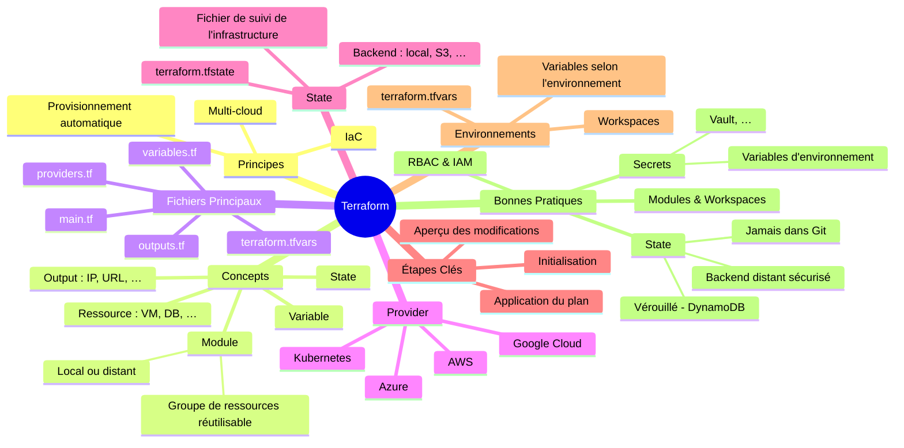

---

## 🎯 Objectifs

- Gérer des ressources dans un cluster Cloud avec une notion d'état grâce à Terraform. ☁️

---

## 🛠️ Présentation de Terraform

- Outil IaC de déploiement et mise à jour d'infrastructures hétérogènes 🏗️
- Déclaratif 📜
- Statefull (vs Ansible : stateless) 🔄
- Majoritairement pour le Cloud (multi-provider) ☁️
  - Fournisseur CRUD de _ressources_ (modifiables) et _data source_ (immuable) par API [Terraform Registry](https://registry.terraform.io) 🔗
- Séparation plan vs application : `refresh`, `plan`, `apply`, `destroy`, … 🔄
- Modules partagés pour les infrastructures courantes 🧩

---

> Outil de _provisionning_ les plus utilisés (2025) : Terraform (39%), Ansible (35%), GCP (32%) (d'après : <https://www.docker.com/blog/2025-docker-state-of-app-dev/>).

---

## 🔄 Fonctionnement

1. Fichiers IaC pour lancer Terraform : `*.tf` 📄
2. Compare l'état actuel (`terraform.tfstate` ou remote state) au plan => changements / créations 🔄
3. Utilise les API des providers pour effectuer les changements 🌐
4. Stocke l'état des changements 💾

---

## 📋 Étapes

1. `terraform init` => Initialise Terraform et installe les plugins
1. `terraform plan` => Plannifie l'exécution des changements (`terraform graph`)
1. `terraform apply` => Exécute le plan
1. `terraform destroy` => Détruit les ressources

---

## 📄 Fichiers

| Fichier | Description |
| --- | --- |
| `main.tf` | Configuration de l'infrastructure 🏗️ |
| `variables.tf` | Déclaration des variables 📝 |
| `terraform.tfvars` | Valeurs des variables 📝 |
| `modules` | Groupes logiques de ressources dans fichiers `.tf` dédiés (~= _role_ Ansible) 🧩 |

---

### 📄 Exemple de fichier Terraform

```tf
provider "kubernetes" {
    version = "~> 1.10"
}

resource "aws_instance" "ma_ressource_web" {
    ami = "mon_id"
    instance_type = "t2.micro"
    subnet_id = var.environnement == "production" ? aws_subnet.prod_subnet.id : aws_subnet.dev_subnet.id
}

# data => données extraites de l'infrastructure
data "aws_ami" "ubuntu" {
    most_recent = true
}
```

---

## Variables

---

### Variable string

```tf
# accès par `var.mon_ip`
variable "mon_ip" {
    type = string
    default = "192.168.1.1"
}

output "affiche_mon_ip" {
    value = var.mon_ip
}
```

---

### Variable list

```tf
# pour les types multiples : `count` et `for-each`
variable "mes_ips" {
    default = ["127.0.0.1 localhost","192.168.1.1 mon_ip"]
}

resource "null_resource" "mes_hosts" {
    count = "${length(var.mes_ips)}"
    triggers = { foo = element(var.mes_ips, count.index } # déclenché si mes_ips change
    provisioner "local_exec" {
        command = "echo '${element(var.mes_ips, count.index)}' >> hosts.txt"
    }
```

---

### Variable map (objet)

```tf
variable "mes_distributions" {
    type = "map"
    default = {
        clef1 = "ubuntu"
        clef2 = "rhel"
        clef3 = "alpine"
    }
}

resource "aws_instance" "mes_serveurs" {
    for_each = var.mes_distributions
    triggers = { foo = each.value } # déclenché si mes_distributions change
    tags = { Name = each.key }
}
```

---

## 🔒 Secrets

1. Marquer la variable "sensible" (pas d'historique) 🔒
2. Utiliser `Vault` pour sécuriser le fichier de variables 🗄️
3. Déplacer l'état `terraform.tfstate` vers un état sécurisé par un Cloud provider ☁️

---

### Variable sensible

```tf
# variables.tf
variable "mon_password" {
    type = string
    sensitive = true
```

```tf
# terraform.tfvars
mon_password = "P@ssw0rd"
```

---

## Ressources

- [Documentation Terraform](https://developer.hashicorp.com/terraform?product_intent=terraform)
- <https://lafor.ge/blue-green/>
- <https://blog.stephane-robert.info/post/ansible-vs-terraform/>
- <https://blog.stephane-robert.info/docs/infra-as-code/provisionnement/terraform/introduction/>
- Livre : "_L'infrastructure as code avec Terraform_ (Julien Wittouck, éditions eni)"

---

## Legal 

- Terraform is a trademark and brand of HashiCorp, Inc.
- Other names may be trademarks of their respective owners

