```plantuml
@startuml

title Le processus TDD

state "1. test" as A #red
A : test en échec
state "2. implémentation" as B #lightgreen
B : écriture du code
B : succès du test
state "refactoring" as C #cyan

A --> B
B --> C
C --> A : problème suivant

@enduml
```

## ⏳ Problème du test tardif

- ⚠️ Vérification tardive = corrections coûteuses
- 📉 Aucune information sur la qualité pendant le développement
- 🏗️ Architecture difficile à tester
- 🤔 **Le test couvre-t-il réellement le problème ?**

---

## 🧪 TDD (Test-Driven Development)

- ✍️ Écrire un test **avant l'implémentation**
- ❌ Vérifier que le test **échoue d'abord**
  - ✅ Donc le test couvre bien le problème !
- 🛠️ **Implémenter** la fonctionnalité (ou correction de bug) jusqu'à faire **passer** le test
- 🔄 **Refactorer** le code si nécessaire
  - 🔄 Facile, les tests évitent les régressions

---

## 🏗️ Conception émergente

- 🔄 Le TDD est en fait plus une pratique de développement incrémental (issue de l'eXtreme Programming et des méthodes agiles) qu'une méthodologie de test
- 🛠️ Les choix technologiques, d'architecture et d'implémentation sont repoussés au moment de l'implémentation
- 🧪 Le test en amont impose une architecture facilement testable
- 🏗️ L'architecture est fortement orientée par les tests : ne pas négliger le refactoring.

---

---

## 🤖 Behavior-Driven Development (BDD)

- 🔄 En TDD traditionnel, les tests (unitaires) sont très proches de l'implémentation :
  - 🔄 Le refactoring peut être compliqué, beaucoup de tests deviennent obsolètes
  - 🎯 Seul le besoin métier est invariant, le reste dépend de l'implémentation
- 🏃 En BDD, on préfèrera des tests validant les fonctionnalités du programme plutôt que les détails d'implémentation.

---

:::tip
- 🔄 Chaque méthode a ses avantages, il est possible de cumuler les 2 suivant le besoin.
- 🏃 Ces méthodes améliorent considérablement les temps de développement.
:::

---

## 🤖 TDD et IA

- 🤖 TDD & BDD se couplent très bien aux IA génératives :
	- ✍️ Écriture des tests décrivant les attentes et cadrant le programme
	- 🤖 Génération du code par IA
	- 🔄 Refactoring assisté par IA

