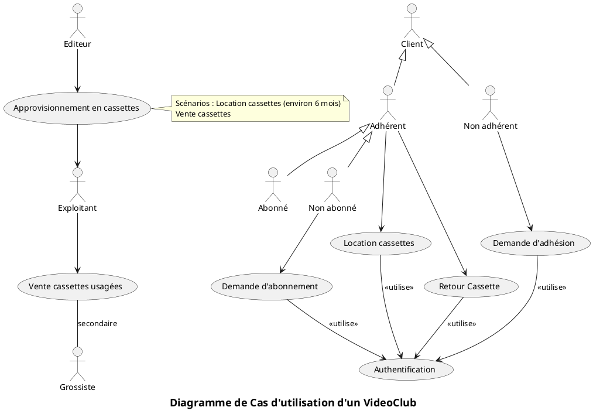
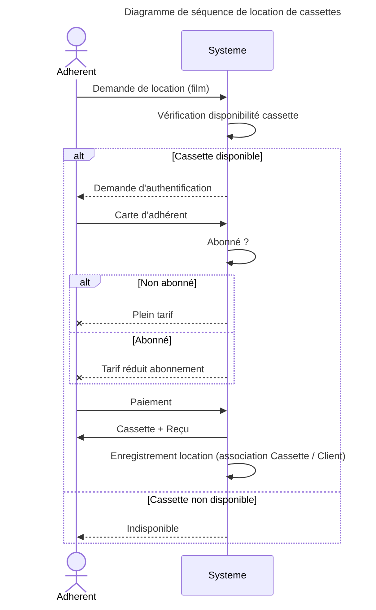

# Analyse des besoins d'un vidéo club

Un vidéo club est un centre de distribution qui assure essentiellement la location de films préenregistrés.

Les éditeurs procurent les cassettes aux exploitants soit en location soit en vente. Les exploitants peuvent donc passer avec les éditeurs des contrats de location d'une durée moyenne de 6 mois ou passer des commandes à partir de catalogues fournis régulièrement par les éditeurs.

Un vidéo club entretient des relations avec une trentaine d'éditeurs environ.

Lorsque les exploitants constatent une usure des cassettes qui leur appartiennent, ils ont la possibilité de les vendre à des grossistes qui peuvent alors pratiquer des ventes au rabais.

Un seul statut est proposé aux clients, celui d'adhérent. Chaque adhérent se voit attribuer une carte d'adhésion sur laquelle est mentionné un code adhérent. Il peut alors choisir entre plusieurs types d’abonnement. Les tarifs varient selon le mode d'abonnement choisi. Quatre tarifs adaptés aux locations sont proposés en fonction des différents types d'abonnement. Toutefois, on peut louer des cassettes aux clients non abonnés sans leur faire profiter des avantages tarifaires réservés aux abonnés.

Le but est de décrire la vue des besoins (_use case view_) de ce système.

1. Donner le diagramme des cas d'utilisation du système. Penser à utiliser la généralisation d’acteurs.
2. Décrire le scénario _Location Cassettes_ par un diagramme de séquence.

:::correction

:::

:::correction

:::

# Système d'enregistrement d'enseignants et d'étudiants à des cours

Les inscriptions dans une école fonctionnent de la façon suivante. Au début de chaque semestre, un catalogue des cours proposés est fourni par la scolarité aux étudiants. Chaque cours est décrit par un certain nombre d'informations, en particulier : l'enseignant, le cursus et les prérequis.

Ce catalogue ne peut être créé avant que tous les cours ne soient affectés à des enseignants. Pour cela, chaque enseignant accède au système d'inscription pour indiquer les cours qu'il prévoit d'enseigner.

Les étudiants doivent remplir des fiches d'enregistrement qui indiquent leurs choix de cours. L'étudiant standard doit suivre 4 enseignements choisis dans le catalogue. Il devra indiquer aussi deux cours supplémentaires. En effet, il se peut que, parmi les 4 cours choisis, l'un des cours soit trop plein ou abandonné par manque d'étudiants.

Chaque cours doit en effet être dispensé à au moins 5 étudiants et au plus 30 étudiants.
Si un cours est choisi par moins de 5 étudiants, il est supprimé.

Ces fiches sont gérées par la scolarité. Une fois la période d’inscription terminée, un programme est exécuté pour affecter les étudiants aux cours. Dans la plupart des cas, les étudiants obtiennent ce qu'il ont choisi. Après que tous les étudiants aient été correctement affectés aux différents cours, un listing est imprimé pour chaque étudiant pour vérification.

Une fois la sélection de cours d'un étudiant validée, l'information est transmise au système de facturation qui facturera l'étudiant pour son semestre.

On souhaite analyser les besoins de ce système d'inscription.

1. Donner le diagramme des cas d'utilisation du système.
2. Décrire le scénario principal de chaque cas d’utilisation par un diagramme de séquence.

:::correction
Correction : <https://cour2.blogspot.com/2012/12/etude-de-cas-systeme-denregistrement.html>
:::
