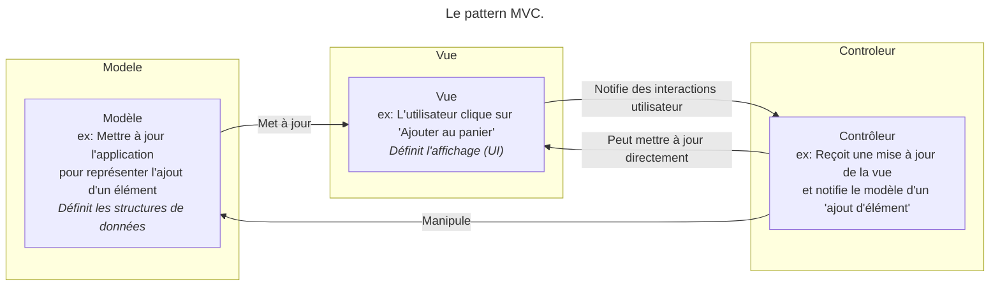
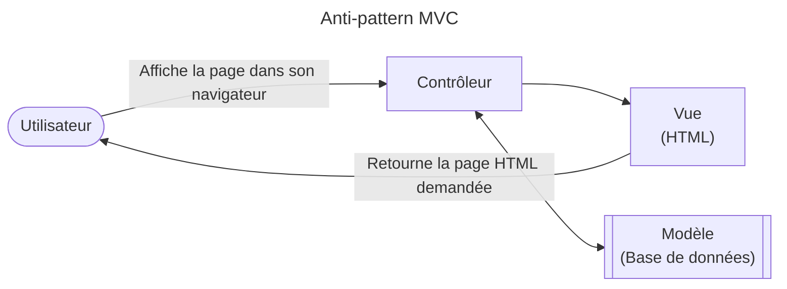

## Modèle/Vue/Contrôleur (`MVC`)

Design pattern populaire dans les applications web, permettant :

- De séparer la présentation des données de leur modélisation et de leur manipulation.
- La mise à jour de la couche de représentation lorsque les données changent.

---

## Composants 

MVC est composé de 3 modules :

- Modèle : contient les données ainsi que de la logique en rapport avec les données (validation, ...)
- Vue : partie visible d'une interface graphique. Une vue contient des éléments visuels ainsi que la logique nécessaire pour afficher les données provenant du modèle
- Contrôleur : module qui traite les actions de l'utilisateur, modifie les données du modèle et de la vue.

---

---

> Architecture of an application is all about its intent. _(Robert Martin)_

---

**MVC N'EST PAS UNE ARCHITECTURE**

- MVC est un mécanisme de livraison de données (par exemple, par le Web) : l'architecture et la logique métier de l'application sont décorrélées de ce pattern
- Les exemples (nombreux) d'application MVC avec persistance directe de la couche _Model_ en base de données sans logique métier sont des anti-patterns !!!

---

---

Une implémentation MVC : Spring MVC Request Lifecycle (source : terasolunaorg.github.io).

---

## Legal

- Spring® is a trademark of Pivotal Software, Inc. in the U.S. and other countries.
- Other names may be trademarks of their respective owners

