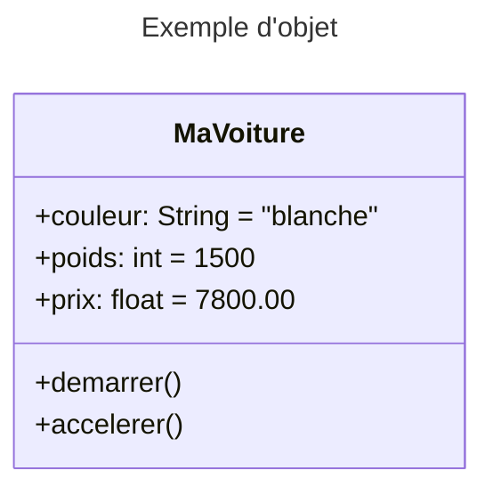
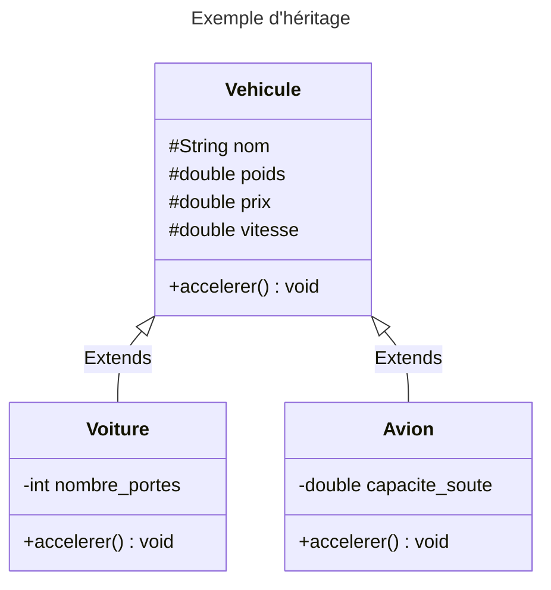

## Introduction

> Programmation orientée objet (POO) : modèle de programmation utilisant une conception basée sur les **objets**.

- Alternatives :
  + _Programmation procédurale_
  + _Programmation fonctionnelle_

---

## Historique

- Émergence dans les années 1970 : `Simula`, `Smalltalk` ;
- Années 1980 : effervescence des langages objets : `Eiffel`, `C++`, `Objective C` ;
- Années 1990 : `Java` (plus simple), grand succès ;
- Années 2000 : `.NET` et `C#` pour concurrencer `Java` ;
- Aujourd'hui :
  + Paradigme incontournable supporté par presque tous les langages : `PHP`, `Python`, ...
  + Applications modélisées en objets : `UML`, ...

---

## Différents types de langages POO

- Langages de POO « purs » où tout est objet : `Ruby`, `Scala`, ...
- Langages principalement POO mais avec quelques éléments procéduraux : `Java`, `Python`, `C++`, `C#`, `.NET`, ...
- Langages historiquement procéduraux étendus à la POO : `PHP`, `Perl`, `VB`, `C++`, `C#`, ...
- Langages qui ressemblent à la POO mais sans véritable objet : `JavaScript`, `Lua`, ...

---

## Avantages du paradigme objet 🌟

- **Modularité** :  les objets regroupent des données et un ensemble d'opérations.
- **Abstraction** : les objets sont proches du monde réel.
- **Productivité** et **ré-utilisabilité** : plus l'application est complexe et plus la POO est intéressante, niveau de ré-utilisabilité supérieur au procédural.
- **Sûreté** : encapsulation et typage des classes.

---

## Concepts de base

La programmation orientée objet repose sur 5 concepts fondamentaux :

- La classe
- L'objet
- L'encapsulation
- L'héritage
- Le polymorphisme

---

## La classe

**Une classe regroupe des fonctions et des attributs qui définissent un objet.**

On appelle les fonctions d'une classe des _méthodes_.

---

### Exemple de classe

```python
class Voiture:

	def __init__(self):
		self.nom = "Ferrari"
```

- Notre classe `Voiture` est une sorte d'usine à créer des voitures.
- **Constructeur** : la méthode `__init__()` est appelée lors de la création d'un objet.
- **Attribut** : `self.nom` est une manière de stocker une information dans la classe.

---

## L'objet

**Un objet est une instance d'une classe**.

On peut créer autant d'objets que l'on désire avec une classe.

Créons 2 voitures depuis notre usine à voitures :

```python
ma_voiture_1 = Voiture()
ma_voiture_2 = Voiture()
```

_Note_ : `Voiture()` est un raccourci pour appeler la méthode `__init__()` de `Voiture`. C'est un appel au constructeur de la classe permettant de générer une instance

---

### Cycle de vie

- L'appel au constructeur permet de créer l'objet (attribue l'espace mémoire dédié) ;
- Suppression : automatique par la machine virtuelle ou par `del(mon_objet)`

---

### Les attributs

- **Ils permettent de stocker des informations à l'intérieur d'un objet**.
- Similaires aux variables mais propres à chaque instance de l'objet.

```python
>>> ma_voiture_1 = Voiture()
>>> ma_voiture_1.nom
'Ferrari'
```

---

Vous pouvez à tout moment créer un attribut pour votre objet et y accéder :

```python
>>> ma_voiture_1.modele = "250"
>>> ma_voiture_1.modele
'250'
```

---

L'attribut a été ajouté à `ma_voiture_1` mais pas à `ma_voiture_2` :

```python
>>> ma_voiture_2.modele
Traceback (most recent call last):
  File "<stdin>", line 1, in <module>
AttributeError: 'Voiture' object has no attribute 'modele'
```

---

### Les méthodes

- **Les méthodes sont des fonctions définies dans une classe.**
- Elles ont accès aux attributs de la classe.

---

Création d'une nouvelle méthode dans notre classe voiture:

```python
class Voiture:

	def __init__(self):
		self.nom = "Ferrari"

	def donne_moi_le_nom(self):
		return self.nom
```

---

Utilisation de cette méthode:

```python
>>> ma_voiture=Voiture()
>>> ma_voiture.donne_moi_le_nom()
'Ferrari'
```

---

### `dir()` et `__dict__`

- Dans des langages POO "stricts" (`Java`), l'objet est toujours lié à la classe qui l'a généré :
  + toutes les instances de `Voiture` ont les mêmes méthodes et noms d'attributs.

---

- En Python, une fois créé un objet n'est plus dépendant de la classe qui l'a généré :
  + chaque instance de `Voiture` a ses propres méthodes et noms d'attributs.
  + `dir(ma_voiture)` retourne les méthodes de l'instance `ma_voiture` ;
  + `ma_voiture.__dict__` retourne les attributs de l'instance `ma_voiture`.

---

### Résumé d'un objet

Techniquement, un objet est caractérisé par 3 choses :

---

- une **identité** : l'identité doit permettre d'identifier sans ambiguïté l'objet (adresse/ référence ou nom) ;

---

- des **états** : chaque objet a une valeur par défaut (lorsqu'elle est indiqué à la création de l'objet) pour chacune de ses propriétés. On appelle ces valeurs, des états de l'objet.

---

- des **méthodes** : chaque objet est capable d'exécuter les actions ou le comportement défini dans la classe. Ces actions sont traduites en POO concrètement sous forme de méthodes. Les actions possibles sur un objet sont déclenchées par des appels de ces méthodes ou par des messages envoyées par d'autres objets.

---



<div class="caption">Un exemple d'objet</div>

- L'**identité** de l'objet est `MaVoiture`
- Son **état** est composé de : `blanche`, `1500 Kg`, `7800 euros`
- Ses **comportements** possibles sont : `demarrer()`, `accelerer()`

---

## Convention d'écriture

Par convention :

- Les noms de classes (`Voiture`) sont en `CamelCase` (mots séparés par une majuscule, par exemple `VoitureElectrique`) ;
- Les noms d'instances, d'attributs et de méthodes en `SnakeCase` (mots séparés par un espace, par exemple : `ma_voiture.mon_nom`.

---

## L'encapsulation

**Les propriétés des objets ne peuvent être accédées que par ses méthodes.**

La classe gère à la fois les attributs et les méthodes qui permettent de manipuler les objets indépendamment de leurs états.

---

Exemple : accès aux états en utilisant une méthode dédiée plutôt qu'un accès direct :

```python
class Voiture:

	def __init__(self):

	def definirCouleur(self, couleur):
		return self.couleur = couleur
```

---

### Les propriétés

- En POO "pure" => un attribut n'est pas accessible en dehors de la classe.
  + Pour récupérer / changer la valeur d'un attribut (appelé alors _propriété_) on utilise des `getter` et `setter`
  + Très utilisés en pratique mais peut casser le  principe d'encapsulation !
  + En Python : `ma_voiture.nom` utilise le `getter` de la propriété `nom` ;
  + `ma_voiture.nom = 'nouveau nom` utilise le `setter` de la propriété `nom`.

**On utilise donc une classe comme une boîte noire - l'utilisateur d'une classe n'a pas à connaître les détails d'implémentation.**

---

```python
class Voiture(object):

    def __init__(self):
        self._roues=4

    def _get_roues(self):
        print "Récupération du nombre de roues"
        return self._roues

    def _set_roues(self, v):
        print "Changement du nombre de roues"
        self._roues  =  v

    roues=property(_get_roues, _set_roues)
```

---

Testons notre classe:

```python
>>> ma_voiture=Voiture()
>>> ma_voiture.roues=5
Changement du nombre de roues
>>> ma_voiture.roues
Récupération du nombre de roues
5
```

---

### Portée (publique / privée)

La portée (ou visibilité) définit les droits d'accès d'un attribut/méthode :

- **Publique `+`**: accessibles à tous ;
- **Protégée `#`**: accessibles dans l'héritage de la classe ;
- **Privée `-`**: accessibles seulement par la classe elle-même.

---

- En Python, la portée par défaut est _publique_ ;
- Par convention, on préfixe d'un `_` pour documenter une utilisation _protected_ ;
- On préfixe d'un `__` pour documenter une utilisation _privée_ : `__attribut` sera remplacé par `_nom_de_classe__attribut` (_name mangling).

---

```python
class Voiture:

	def __init__(self, nom:str):
		self._nom = nom

	def _methode_privee(self):
		'''Une méthode privée.
		   Ne doit pas être appelée hors de la classe'''
		return self._nom

	def getNom(self) -> str :
		'''Un getter.
		   Sa portée est publique'''
		# On appelle une méthode privée dans la classe :
		# toujours autorisé
		return self._methode_privee()

ma_voiture = Voiture('Ferrari')
ma_voiture._nom # interdit
ma_voiture.getNom() # autorisé
ma_voiture._methode_privee() # interdit (hors de la classe)
```

---

## L'héritage

---

En POO une classe peut **hériter** des caractéristiques (attributs, méthodes) d'une autre classe.



<div class="caption">Un exemple d'héritage.</div>

- `Avion` et `Voiture` (_spécialisations_) héritent de `Véhicule` (_généralisation_)
- `Avion` est la _classe fille_ (ou sous-classe) de `Véhicule` qui est la _classe parente_ (ou super-classe)

---

```python
class Vehicule:

	def deplacement(self):
		print("Je me déplace")

class Avion(Vehicule):
    pass

class Voiture(Vehicule):
    pass

# Un Avion (et donc aussi un Vehicule)
>>> mon_vehicule_1 = Avion()
# Une Voiture (et donc aussi un Vehicule)
>>> mon_vehicule_2 = Voiture()
>>> mon_vehicule_1.deplacement()
Je me déplace
>>> mon_vehicule_2.deplacement()
Je me déplace
```

---

L'héritage présente 2 avantages principaux en POO 🌟 :

- **réutilisation** : pas besoin de recréer à chaque fois la même classe ;
- **spécialisation** : réutilise les attributs et les méthodes d'une classe en y ajoutant des opérations particulières à la nouvelle classe.

**Attention : l'héritage est très souvent mal utilisé en pratique et amène de nombreux problèmes de maintenabilité du code (voir principes SOLID et délégation)**

---

## Polymorphisme

Le polymorphisme permet de redéfinir dans une classe fille un attribut / méthode dont le contrat est définit dans une classe parente (ici `_type_mouvement`) :

---

```python
class Vehicule:

	def __init__(self):
		self._type_mouvement = '?'

	def deplacement(self):
		print(f"Le véhicule se déplace en : {self._type_mouvement}")

class Avion(Vehicule):

	def __init__(self):
		self._type_mouvement = 'volant'

class Voiture(Vehicule):

	def __init__(self):
		self._type_mouvement = 'roulant'

# Un Vehicule générique
>>> mon_vehicule_1 = Vehicule()
# Un Avion (et donc aussi un Vehicule)
>>> mon_vehicule_2 = Avion()
# Une Voiture (et donc aussi un Vehicule)
>>> mon_vehicule_3 = Voiture()
>>> mon_vehicule_1.deplacement()
Le véhicule se déplace en : ?
>>> mon_vehicule_2.deplacement()
Le véhicule se déplace en : volant
>>> mon_vehicule_3.deplacement()
Le véhicule se déplace en : roulant
```

---

```python
class Vehicule:

	def deplacement(self):
		print(f"Le véhicule se déplace en : {self._type_mouvement}")

class Avion(Vehicule):

	def __init__(self):
		self._type_mouvement = 'volant'

class Voiture(Vehicule):

	def __init__(self):
		self._type_mouvement = 'roulant'


# Un Avion (et donc aussi un Vehicule)
>>> mon_vehicule_1 = Avion()
# Une Voiture (et donc aussi un Vehicule)
>>> mon_vehicule_2 = Voiture()
>>> mon_vehicule_1.deplacement()
Le véhicule se déplace en : volant
>>> mon_vehicule_2.deplacement()
Le véhicule se déplace en : roulant
```

Polymorphisme simple en _duck typing_.

---

