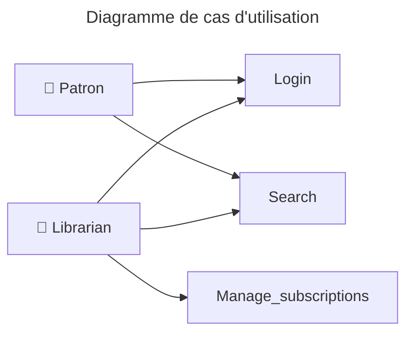
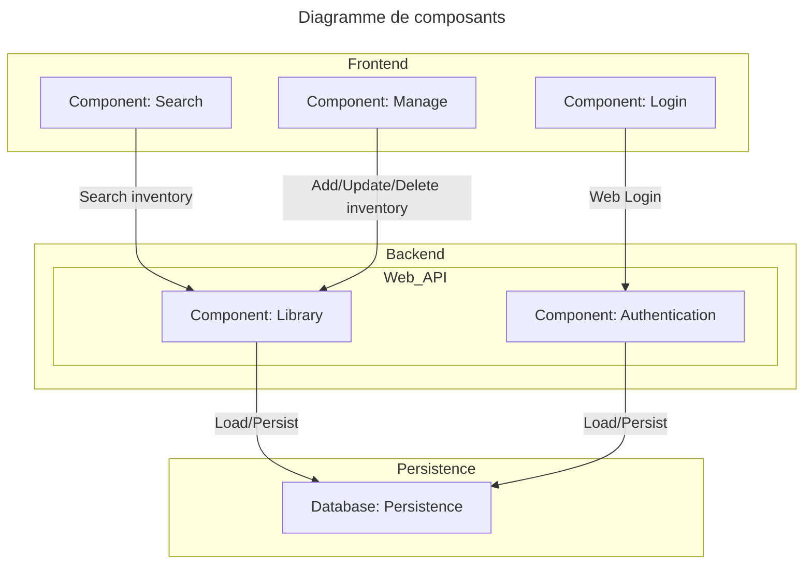
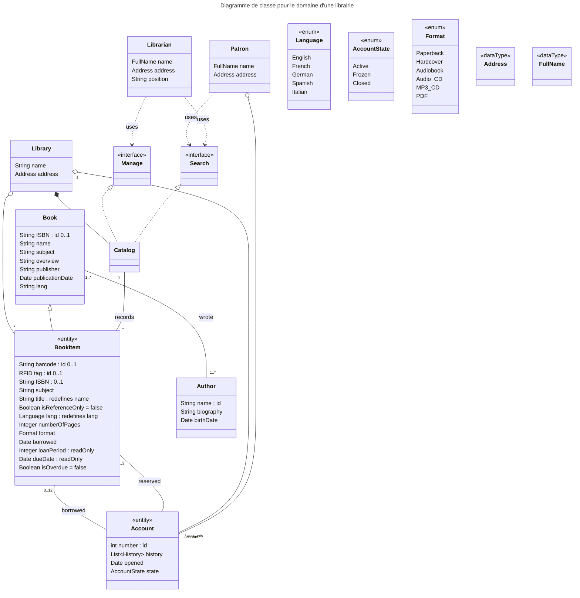

## Présentation de l'étude de cas

Cette étude de cas porte sur la réalisation d'une application de gestion d'une bibliothèque. L'étude de cas est inspirée de l'exemple suivant : <https://www.uml-diagrams.org/library-domain-uml-class-diagram-example.html>.

## Le projet 

Le projet a été spécifié grâce à un ensemble de diagrammes de classes et de composants.

- Il s'agit d'une application Web client-serveur.
- La persistance des données n'est pas une priorité - on pourra utiliser une méthode non optimisée, y compris un composant de persistance en mémoire vive.
- Le seul client attendu dans cette version est un client Web.

## Diagramme de cas d'utilisation

L'application décrit trois cas d'utilisation :

- La connexion d'un utilisateur.
- Une interface de recherche pour l'usager et le libraire.
- Une interface de gestion pour le libraire.

La vue de connexion est la première vue commune.

Les deux interfaces correspondent à deux vues différentes dans l'application Web.

## Diagrammes de composants

L'application est composée de trois composants principaux :

- Un composant de persistance (base de données ou autre).
- Un backend exposant une Web API.
- Un frontend déployant le client Web dans le navigateur et utilisant l'API du Backend.

## Diagrammes de classes du Domain Model de la bibliothèque

Exemple de diagramme de classe pour le domaine d'une librairie. <a href="https://www.uml-diagrams.org/library-domain-uml-class-diagram-example.html">Source et crédit</a>

Ce diagramme représente le domain model de la bibliothèque, c'est-à-dire les classes comportant et interagissant avec la donnée de l'application dans le composant `Backend`.

Les interfaces `search` et `manage` sont les deux points d'entrée utilisateur tels que décrits dans le diagramme de cas d'utilisation.

Précision sur le type `History` : ce type est décrit par une classe `History` comportant l'historique des opérations `borrowed` et `reserved`. Étant un attribut de l'entité `Account`, cet attribut doit être persisté, cependant il n'est pas demandé d'exposer cet attribut aux acteurs de l'application via l'interface graphique.

Les autres classes à ajouter sont à la discrétion de l'équipe de développement.

# Travail à réaliser

Ce projet sera réalisé en groupes de 3 apprenants.

En utilisant la technologie de votre choix, développer **et tester** une application dans une architecture client-serveur implémentant les diagrammes de classe et de composants fournis. On veillera à bien respecter le formalisme UML® mais on pourra bien sûr ajouter d'autres classes et composants mineurs si nécessaire.

# Rendus attendus

Il est attendu un fichier de rapport contenant :

- Les noms et prénoms des membres du groupe.
- Une description des technologies utilisées.
- Une documentation technique afin d'installer et de déployer localement l'application.
- Un lien vers le ou les dépôts de code.

## Références

Les liens suivants peuvent servir de rappels de cours concernant la modélisation UML® :

- [Référence officielle de la norme UML](https://www.omg.org/spec/UML)
- [Cours complet et libre sur UML 2](https://laurent-audibert.developpez.com/Cours-UML/)
- [Article Wikipédia - résumé des diagrammes UML principaux](https://fr.wikipedia.org/wiki/UML_(informatique))

# Legal

- UML is either a registered trademark or a trademark of Object Management Group, Inc. in the United States and/or other countries.
- [Source et crédit](https://www.uml-diagrams.org/library-domain-uml-class-diagram-example.html) du diagramme de classe UML pour le modèle.

