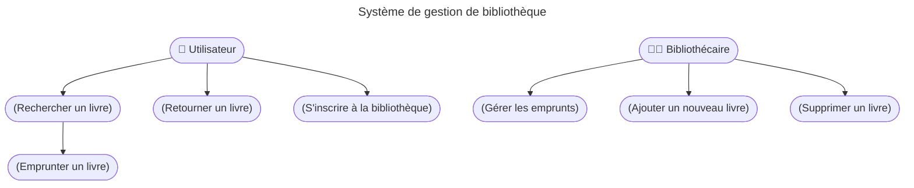
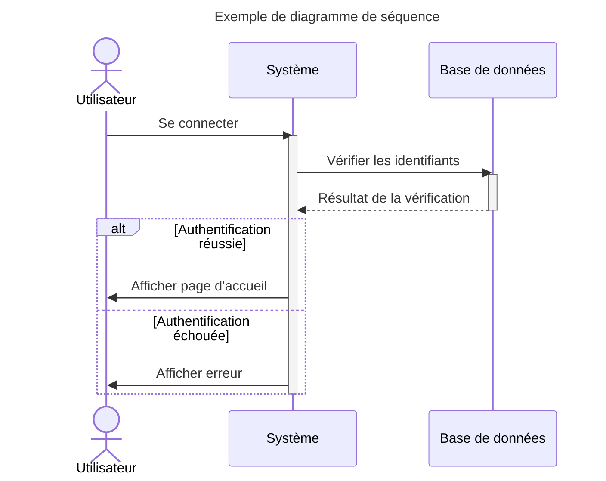

## Diagrammes de Cas d'Utilisation (Use Case)

- Représentation graphique des interactions entre les acteurs et le système.
- Capture les exigences fonctionnelles d'un système.
- Représente les cas d'utilisation principaux et les acteurs qui interagissent avec le système.

---

### 🌟 Avantages

- Aide à comprendre le comportement attendu du système.
- Permet d'identifier les rôles et les responsabilités dans un système.
- Facilite la communication entre les développeurs et les parties prenantes.

---

### Composants

1. **Acteurs** : entités externes qui interagissent avec le système.
2. **Cas d'Utilisation** : actions ou scénarios que le système peut effectuer pour les acteurs.
3. **Relations** :
   - **Association** : lien entre un acteur et un cas d'utilisation.
   - **Héritage** : un acteur ou un cas d'utilisation peut hériter des caractéristiques d'un autre.
   - **Extend** : un cas d'utilisation optionnel qui étend le comportement d'un autre cas d'utilisation.
   - **Include** : un cas d'utilisation inclut systématiquement un autre cas d'utilisation.

---

### Exemple de Diagramme de Cas d'Utilisation

Exemple de diagramme de cas d'utilisation pour un système de gestion d'une librairie.

---

## Diagrammes de Séquence

---

- Représentation graphique des interactions entre les objets dans un système.
- Met l'accent sur l'ordre des messages échangés.
- Utilisé pour :
  - Visualiser des scénarios.
  - Clarifier le comportement d'un système.
  - Préparer la conception du code.

---

### Élément de Base

- **Lifeline (ligne de vie)** : représentation d'un objet ou d'une classe.
- **Message** : communication entre les objets.
  - **Synchronous (synchronisé)** : l'émetteur attend une réponse.
  - **Asynchronous (asynchronisé)** : l'émetteur continue sans attendre.
- **Activation Bar (barre d'activation)** : indique le temps pendant lequel un objet est actif.

---

### Exemple

---

### 🌟 Avantages

- Décris le flux d'interactions d'un cas d'utilisation.
- Clarifie les dépendances entre les composants.

---

### Limitations

- Complexe pour de grands systèmes.
- Pas de détails structurels du système.

---

