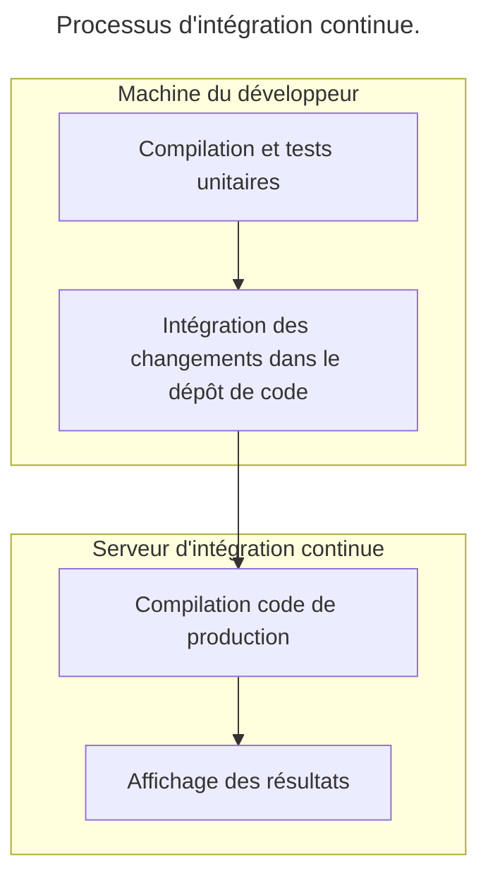
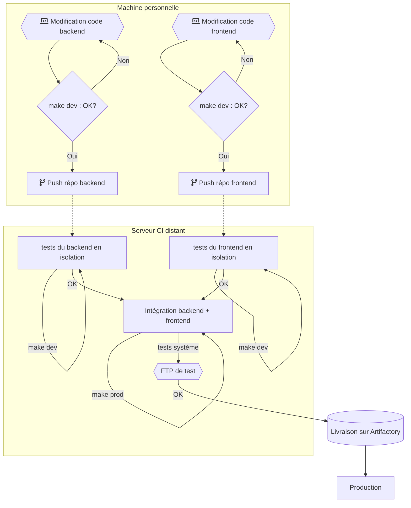

# Amélioration d'un processus d'intégration continue

Malgré plusieurs tentatives pour mettre en place une intégration continue dans leur projet, une équipe fait appel à vos services car les tentatives se sont toutes soldées par un échec.

L'équipe vous apprend que les développeurs travaillent en itérations de 2 semaines : chaque développeur utilise une branche dédiée pour ses fonctionnalités pendant toute la durée de l’itération. A la fin de l’itération (toutes les 2 semaines), l'ensemble des changements sont validés par un ensemble de tests et de critères qualité et intégrés dans le tronc commun, mais après avoir travaillé 2 semaines sur une branche séparée ces critères n’arrivent plus à être respectés.

L'équipe de développement vous signale également que les besoins de ce projet amènent l'ensemble des développeurs à intégrer plusieurs centaines de changements tous les jours, souvent dépendants des changements d'autres développeurs qui ne sont pas encore dans le tronc commun.

Quel(s) conseil(s) souhaitez-vous apporter à cette équipe ? Justifiez votre choix. 

:::correction
- Réduire le temps avant intégration afin de tester au plus tôt et donc réduire la "feedback loop".
:::

# Pipeline d'intégration continue

Une équipe de développement fait appel à vos services pour définir un pipeline d’intégration continue sur leur produit. Ce produit réalise le calcul d’une facture finale depuis un ensemble de documents fournis (prix de vente hors taxe du produit, avoir du client, livraison, TVA et autres taxes, …). 

Le projet est composé des éléments suivants : 

- Un serveur FTP récupérant les fichiers à utiliser. Le binaire de ce serveur provient d’un éditeur externe : l'équipe se contente donc de configurer ce produit. 
- Un service backend qui récupère les fichiers déposés sur le serveur FTP et réalise le traitement des données (entièrement codé par l'équipe de développement).
- Un service frontend qui affiche à l'utilisateur l'avancée du traitement et le résultat de la facture (entièrement codé par l'équipe de développement).

Les services backend et frontend n’ont pas d’autre dépendance externe (pas de base de données, ...). 

Pour réaliser leurs tests unitaires, les développeurs utilisent une option spéciale à la compilation du projet permettant d’utiliser des données de test en mémoire à la place du serveur FTP (et donc, de tester les services backend et frontend en isolation). Avant la mise en production, les développeurs disposent d’un serveur FTP de test pour réaliser des tests d’intégration entre le backend, le frontend et le serveur FTP. 

L’équipe de développement aimerait également réaliser le déploiement des services backend et frontend en production de manière automatisée. Ils disposent pour cela d’un dépôt `Artifactory` capable de stocker des binaires et de les déployer en production sur demande. Le déploiement d’un service est totalement indépendant des autres services. 

Pour compiler les services backend et frontend, l'équipe a mis au point un `Makefile`. Ce `Makefile` doit être utilisé plusieurs fois dans le processus opérationnel du projet : 

- La cible `make dev` permet de créer un environnement de développement. Cela permet de tester la compilation du code, et d’utiliser du code compilé pour les tests unitaires (sur la machine d’un développeur ou sur un serveur distant) 
- La cible `make prod` permet de créer un binaire de production. C’est ce binaire qui sera stocké sur `Artifactory` et déployé en production. 

_Schématiser le pipeline d’intégration continue que vous proposez pour gérer ce projet (depuis la machine du développeur jusqu'à la mise en production). On pourra par exemple utiliser l'outil <https://diagrams.net> pour réaliser le schéma._

Pour rappel, voici un exemple de pipeline simpliste : 

:::correction

:::

# Legal

- © 2025 Tom Avenel under CC  BY-SA 4.0
