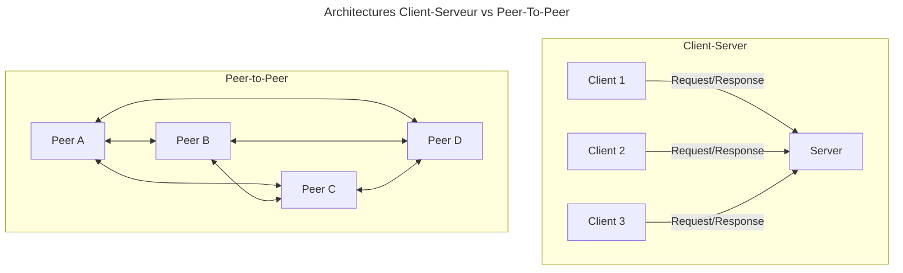
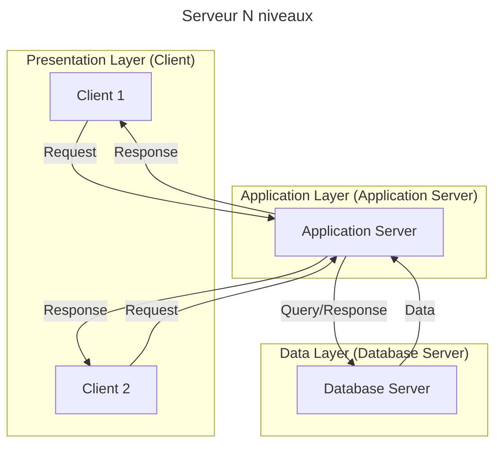
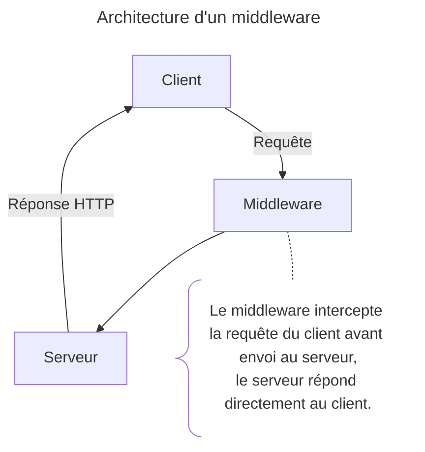
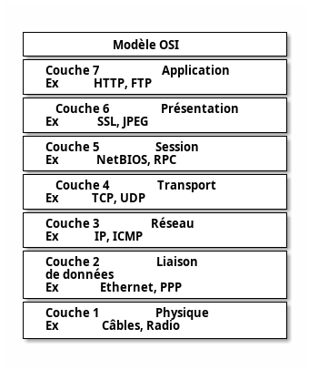
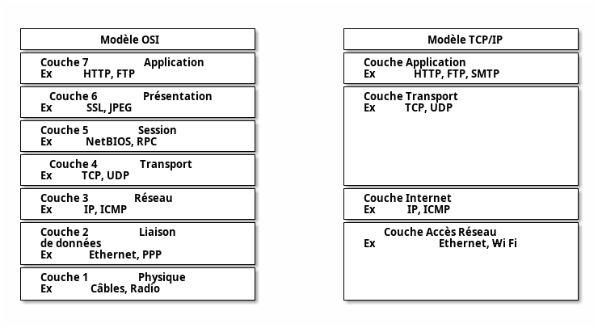

## Client/serveur vs peer-to-peer

Les applications (partie visible pour l'utilisateur) sont la raison d'être des réseaux informatiques.

Leur nombre et évolution depuis les débuts d'Internet est considérable :

- sous forme textuelle au début : messagerie électronique, terminaux distants, transferts de fichiers, ...
- principalement multimédia aujourd'hui : diffusion vidéo à la demande, streaming, VoIP, ...

---

Ces applications communiquent en utilisant l'un des deux modèles d'architecture du Web :

- Point-à-point (_peer to peer_) : chaque application est connectée à l'ensemble des autres applications
- Client-serveur : les applications utilisateur (client ou _frontend_) interagissent uniquement avec un ou des serveurs partagés par les utilisateurs (_backend_)

---

```mermaid
---
title: Architectures Client-Serveur vs Peer-To-Peer
---
graph TD
  subgraph Client-Server
    C1[Client 1]
    C2[Client 2]
    C3[Client 3]
    S[Server]
    
    C1 -->|Request/Response| S
    C2 -->|Request/Response| S
    C3 -->|Request/Response| S
  end

  subgraph Peer-to-Peer
    PA[Peer A]
    PB[Peer B]
    PC[Peer C]
    PD[Peer D]
    
    PA <--> PB
    PA <--> PC
    PA <--> PD
    PB <--> PC
    PB <--> PD
    PC <--> PD
  end
```

---

## Architecture client serveur

Mode de communication à travers un réseau entre plusieurs programmes :

- l'un, qualifié de client, envoie des requêtes.
- l'autre ou les autres, qualifiés de serveurs, attendent les requêtes des clients et y répondent.

---

Les processus client / serveur ne sont pas identiques : ils communiquent pour réaliser le traitement des données.

- Le serveur est à l'écoute d'une requête cliente éventuelle.
- Le client initie l'échange.
- Le service (traitement des données) est effectué par le serveur.
- Le client réceptionne le résultat et l'affiche à l'utilisateur.

---

## Le serveur

- Tourne en permanence, attendant des requêtes.
- Peut répondre à plusieurs clients en même temps.
- Nécessite :
  + Une machine robuste et rapide, qui fonctionne 24h/24 : alimentation redondante, technologie RAID, stockage et sauvegarde des données
  + La présence d'administrateurs systèmes et réseau pour gérer les serveurs.

---

### Exemples de serveurs

- Base de données
- Serveur d'impression
- Serveur Web

---

## Le client

- Son instance est dédiée à la machine de l'utilisateur...
- ...mais peut être partagée par plusieurs comptes ou profils !
- Il est démarré par l'utilisateur seulement pour le temps d'utilisation de l'application.
- Dépend des ressources de la machine de l'utilisateur :
  + Limitation mémoire, bande passante, CPU, ...
  + Dépendances peu maîtrisées : `Android` vs `iPhone`, version des librairies, ...

---

### Exemples de clients

- Navigateur Web
- Client `Android`
- Client mail

---

## 🌟 Avantages de l'architecture client/serveur

- Ressources centralisées : le serveur gère les ressources communes à tous les utilisateurs (base de données, ...)
  + la cohérence des données est aisée
- Administration centralisée : seul le serveur est critique
- Réseau évolutif : ajout / suppression de clients sans impact sur les autres clients
- Sécurité : l'accès aux données est masqué par le serveur, les clients en manipulent le minimum

---

## Inconvénients de l'architecture client/serveur

- Maillon faible : tout le réseau est architecturé autour du serveur
celui-ci doit avoir une forte tolérance aux pannes
- Coût élevé (ressources et maintenance) dû à la technicité du serveur
- Communication directe impossible entre les clients

---

Le serveur est donc le seul élément critique mais sa maintenance est compliquée et coûteuse.

---

## Différentes architectures client/serveur

### Client léger vs client lourd

Possibilité de déléguer plus ou moins de traitements au serveur :

- Client lourd si le client effectue une majorité des opérations.
- Client léger si le serveur réalise la majorité des traitements.

---

### Serveur N niveaux

- Architecture à N niveaux délégant des traitements à des serveurs secondaires masqués au client.
- Permet de segmenter l'utilisation de ressources ou services et leur administration.

```mermaid
---
title: Serveur N niveaux
---
flowchart TD
  subgraph Presentation_Layer["Presentation Layer (Client)"]
    C1[Client 1]
    C2[Client 2]
  end

  subgraph Application_Layer["Application Layer (Application Server)"]
    AppServer[Application Server]
  end

  subgraph Data_Layer["Data Layer (Database Server)"]
    DBServer[Database Server]
  end

  C1 -->|Request| AppServer
  C2 -->|Request| AppServer
  AppServer -->|Query/Response| DBServer
  DBServer -->|Data| AppServer
  AppServer -->|Response| C1
  AppServer -->|Response| C2
```

---

## Middleware

- Logiciel qui inter-connecte un ensemble d'applications en leur fournissant des fonctionnalités et services communs.
- Se situe entre les requêtes du client et le serveur :
  + Gérer une authentification commune (token `JWT`).
  + Retravailler les headers.
  + Vérifier des requêtes à l'API.
- Peut aussi servir à abstraire le système sur lequel tourne l'application.

---

```mermaid
---
title: Architecture d'un middleware
---
flowchart TD
    Client[Client]
    Middleware[Middleware]
    Serveur[Serveur]

    Client -->|Requête| Middleware
    Middleware --> Serveur
    Serveur -->|Réponse HTTP| Client

    Note@{ shape: comment, label: "Le middleware intercepte la requête du client avant envoi au serveur,<br>le serveur répond directement au client."}

    Middleware -.- Note
```

---

# Internet et TCP/IP

---

## Des conventions aux protocoles

Exemple de l'envoi d'un courrier postal :

- Quelles sont les conventions respectées par les différent acteurs ?

---

Idem pour l'envoi d'un courrier électronique ou lorsqu'un navigateur affiche une page d'un site web :

- Cette communication est possible parce qu'un ensemble de conventions sont respectées.
- La communication a alors lieu entre deux ordinateurs. On parle alors de _protocole_.

---

Dans une architecture client/serveur, le serveur joue le rôle de _La Poste_ entre les clients.

---

## Internet

- Réseau mondial regroupant un ensemble de sous-réseaux non homogènes d'architectures et de technologies différentes.
- C'est donc un réseau de réseaux : `Inter-network` !
- Comment faire pour permettre la communication entre des entités de réseaux très différents et n'utilisant pas les mêmes technologies ? 

---

## Le modèle OSI

### Séparer les couches réseau

- Norme précisant comment les machines doivent communiquer entre elles.
- Modèle de 7 couches indépendantes ayant chacune un rôle particulier.
- Chaque couche ne peut communiquer qu'avec une couche adjacente.

---

```plantuml
@startditaa
+----------------------------+
|        Modèle OSI          |
+----------------------------+
|  Couche 7 : Application    |
|  Ex: HTTP, FTP             |
+----------------------------+
|  Couche 6 : Présentation   |
|  Ex: SSL, JPEG             |
+----------------------------+
|  Couche 5 : Session        |
|  Ex: NetBIOS, RPC          |
+----------------------------+
|  Couche 4 : Transport      |
|  Ex: TCP, UDP              |
+----------------------------+
|  Couche 3 : Réseau         |
|  Ex: IP, ICMP              |
+----------------------------+
|  Couche 2 : Liaison        |
|  de données                |
|  Ex: Ethernet, PPP         |
+----------------------------+
|  Couche 1 : Physique       |
|  Ex: Câbles, Radio         |
+----------------------------+
@endditaa
```

---

## Le modèle TCP/IP

- OSI: modèle théorique utile pour segmenter les couches réseau.
- En pratique : modèle TCP/IP de 4 couches fusionnant certaines des couches OSI.
- Chaque couche possède ses propres protocoles et peut être remplacée indépendamment des autres couches.

---

### Couche application

Ces protocoles gèrent l'accès applicatif aux services réseau :
  + Gestion des noms de domaines `DNS`.
  + Configuration dynamique des postes `DHCP`.
  + _Hypertext Transfert Protocol_ `HTTP`.
  + Transfert de fichiers `FTP`.
  + Transfert de mails `SMTP`, ...

---

### Couche transport

Ces protocoles établissent les communications :

- De manière connectée en utilisant des sessions.
  + _Transmission Control Protocol_ `TCP`.
- Ou en diffusant les messages sans connexion.
  + _User Datagram Protocol_ `UDP`.

---

- `TCP` est bien plus fiable qu'`UDP` grâce à l'usage de sessions mais plus coûteux.
- Pour les applications à destination des utilisateurs finaux, on réservera `UDP` aux applications réalisant des échanges massifs de données non critiques (streaming vidéo, ...)

---

### Couche internet

Ces protocoles gèrent :

- L'acheminement (routage) et l'encapsulation des données au travers de paquets _Internet Protocol_ `IP`.
- La résolution d'adresse `ARP`
- La communication entre équipement réseau `ICMP` (utilisé par exemple lors d'un `ping`).

---

### Couche réseau

Ces protocoles font transiter les frames de données sur le réseau :

- Différents réseaux locaux `LAN` : `Ethernet`, `Token Ring`, ...
- Technologies de télécommunications sur les réseaux globaux `WAN` : `POTS`, `ISDN`, `ATM`, ...

Leur configuration est gérée par les administrateurs réseaux et est généralement masquée aux développeurs.

---

```plantuml
@startditaa
+----------------------------+          +----------------------------+
|        Modèle OSI          |          |        Modèle TCP/IP       |
+----------------------------+          +----------------------------+
|  Couche 7 : Application    |          |  Couche Application        |
|  Ex: HTTP, FTP             |          |  Ex: HTTP, FTP, SMTP       |
+----------------------------+          +----------------------------+
|  Couche 6 : Présentation   |          |  Couche Transport          |
|  Ex: SSL, JPEG             |          |  Ex: TCP, UDP              |
+----------------------------+          |                            |
|  Couche 5 : Session        |          |                            |
|  Ex: NetBIOS, RPC          |          |                            |
+----------------------------+          |                            |
|  Couche 4 : Transport      |          |                            |
|  Ex: TCP, UDP              |          |                            |
+----------------------------+          +----------------------------+
|  Couche 3 : Réseau         |          |  Couche Internet           |
|  Ex: IP, ICMP              |          |  Ex: IP, ICMP              |
+----------------------------+          +----------------------------+
|  Couche 2 : Liaison        |          |  Couche Accès Réseau       |
|  de données                |          |  Ex: Ethernet, Wi-Fi       |
|  Ex: Ethernet, PPP         |          |                            |
+----------------------------+          |                            |
|  Couche 1 : Physique       |          |                            |
|  Ex: Câbles, Radio         |          |                            |
+----------------------------+          +----------------------------+
@endditaa
```

---

## IP

- Pour envoyer un courrier postal, l'expéditeur inscrit l'adresse du destinataire dans un format prédéfini (rue, code postal, ville).
- De la même manière, il est nécessaire de définir un format pour identifier une entité sur le réseau.
- `TCP/IP` utilise 2 schémas pour nommer et identifier les machines (`hosts`) et les réseaux dans un `internetwork` : adresses `IP` et noms de domaines.

---

### Addresses IP

- Adresses logiques sur 32 bits (4 octets) de la forme `w.x.y.z`
- Partitionnées en 2 segments grâce à un _masque de sous-réseau_ (`subnet mask`) :
  + un ID réseau (`NetID`)
  + suivi par un ID de machine (`HostID`).
- Clé primaire pour identifier une machine ou un réseau.

---

Exemple :

L'adresse IP `205.116.8.44` est partitionnée par le masque `255.255.255.0` en :

- un NetID : `205.116.8.0`
- un HostID : `44`

---

- Autre notation pour le masque de sous-réseau : notation décimale.
- Indique le nombre de bits réservés par le nom du réseau dans l'adresse IP.

Par exemple, le masque `255.255.255.0` réserve les 3 premiers octets ($=3x8$ bits) au réseau (et le dernier octet à l'identification de l'hôte dans le réseau). Ce masque peut donc aussi s'écrire `/24`.

---

Chaque réseau possède 2 adresses particulières :

- L'adresse avec un `HostID` = 0 est l'adresse identifiant le réseau.
- L'adresse avec un `HostID` dont tous les bits sont à 1 est l'adresse de diffusion (`broadcast`). Cette adresse sert à diffuser un message à tous les hôtes sur le réseau.

Par exemple, pour le réseau `25.116.8.0/24` :

- L'adresse de réseau est : `25.116.8.0`
- L'adresse de `broadcast` est : `25.116.8.255`

---

### IPv6

- Les adresses `w.x.y.z` sont en réalité des adresses de la version IPv4 sur 32 bits.
- Version majoritaire dans les déploiements actuels mais en cours d'épuisement.
- Nouvelle norme : IPv6 sur 128 bits mais complexe à mettre en œuvre.
  + Les adresses IPv6 ne s'écrivent pas en notation décimale `192.168.0.1` mais en notation hexadécimale (8 groupes de 2 octets soit 128 bits).
  + Par exemple : `2001:0db8:0000:85a3:0000:0000:ac1f:8001`
- Il est possible de mélanger des déploiements de chaque version, une interface réseau peut même posséder une adresse IPv4 et une adresse IPv6 en même temps.

---

## Nom de domaine

`FQDN` (Fully Qualified Domain Name) : noms alphanumériques de la forme `nom_de_machine.nom_de_domaine` où `nom_de_domaine` est un nom `DNS` (système de nom hiérarchique mondialisé).

Exemple :

Le nom de domaine `en.wikipedia.org` représente la machine `en` qui appartient à un réseau nommé `wikipedia` qui est un sous-réseau du réseau `org` (lui-même sous-réseau du réseau racine : `.` (dot)).

---

## DNS : Domain Name System

- Service informatique distribué utilisé pour traduire les noms de domaine Internet en adresse IP ou autres enregistrements.
- Humain = noms de domaine : plus simples à retenir et plus parlant (logs, ...)
- Machine = adresses IP.
- Service hiérarchique : les serveurs `DNS` de 1er niveau (`TLD` : Top Level Domain) sont connus de tous et délèguent la résolution de sous-domaines à des serveurs intermédiaires (exemple : `.org`), et ainsi de suite jusqu'au nœud `DNS` terminal connaissant l'`IP` de la machine.

---

## Legal

- ANDROID is a trademark of GOOGLE LLC
- iPhone® is a trademark of Apple Inc., registered in the U.S. and other countries and regions.
- Other names may be trademarks of their respective owners

---

