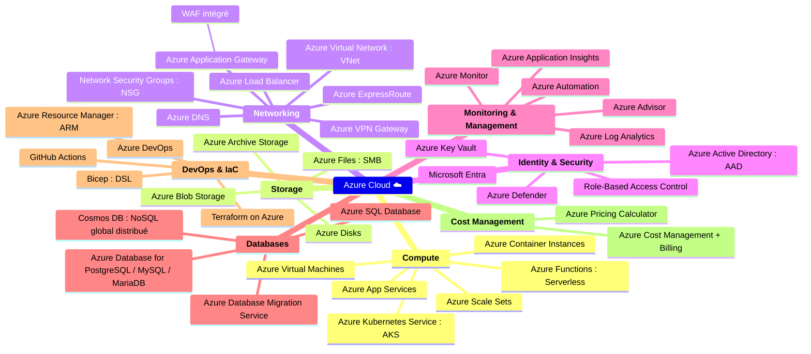

## 🌐 Principaux composants d'Azure Cloud

---

### 🏗️ Azure Compute

Services liés à la puissance de calcul, pour héberger des applications, sites web, conteneurs, etc.

- **Azure Virtual Machines (VMs)** : Machines virtuelles IaaS.
- **Azure App Service** : Hébergement PaaS d'applications web/API (support .NET, Java, Python, etc.).
- **Azure Functions** : Exécution de fonctions serverless (FaaS).
- **Azure Kubernetes Service (AKS)** : Orchestration de conteneurs Kubernetes managé.
- **Azure Batch** : Traitement parallèle de gros volumes de données.

---

### 💾 Azure Storage

Solutions de stockage pour fichiers, objets, disques et bases de données.

- **Azure Blob Storage** : Stockage d'objets (images, vidéos, backups…).
- **Azure File Storage** : Partages de fichiers SMB.
- **Azure Disk Storage** : Disques gérés pour VMs.
- **Azure Archive Storage** : Stockage à froid à coût réduit.

---

### 🗃️ Azure Database Services

Services de bases de données relationnelles et NoSQL.

- **Azure SQL Database** : SQL Server managé (PaaS).
- **Azure Cosmos DB** : Base de données NoSQL distribuée (multi-modèle).
- **Azure Database for MySQL/PostgreSQL** : Versions managées de bases populaires.
- **Azure Synapse Analytics** : Data warehouse et analytique à grande échelle.

---

### 🧠 Azure AI et Machine Learning

Services pour l'IA, la data science et le ML.

- **Azure Cognitive Services** : APIs prêtes à l'emploi (vision, langage, reconnaissance vocale…).
- **Azure Machine Learning** : Plateforme de création, entraînement et déploiement de modèles ML.
- **Azure OpenAI Service** : Accès aux modèles GPT via API Azure.

---

### 🌐 Azure Networking

Outils pour la connectivité, la sécurité réseau et la diffusion mondiale.

- **Azure Virtual Network (VNet)** : Réseaux privés virtuels.
- **Azure Load Balancer** : Répartition de charge L4.
- **Azure Application Gateway** : Répartition de charge L7 + WAF.
- **Azure VPN Gateway** : Connexion VPN site à site.
- **Azure ExpressRoute** : Lien privé vers Azure (bypass Internet).
- **Azure DNS / Traffic Manager / Front Door** : Résolution DNS, routage global, CDN.

---

### 🔐 Sécurité et Identité

Services pour gérer l'authentification, la sécurité et la conformité.

- **Azure Active Directory (Entra ID)** : Gestion des identités et authentification SSO/MFA.
- **Azure Key Vault** : Stockage sécurisé des secrets, clés et certificats.
- **Microsoft Defender for Cloud** : Supervision de la posture de sécurité.
- **Azure Policy & Blueprints** : Gouvernance et conformité.

---

### 📈 Monitoring, Gestion & DevOps

Outils pour surveiller, automatiser et déployer les ressources.

- **Azure Monitor / Log Analytics** : Monitoring, logs, alertes.
- **Azure Automation** : Runbooks et automatisation.
- **Azure Resource Manager (ARM)** : Déploiement par templates.
- **Azure DevOps Services** : Pipelines CI/CD, boards, repo Git.
- **GitHub Actions for Azure** : Intégration GitHub + Azure CI/CD.

---

### ☁️ Azure Resource Management

Gestion et organisation des ressources cloud.

- **Resource Groups** : Conteneurs logiques de ressources.
- **Azure Subscription** : Conteneur de facturation.
- **Management Groups** : Hiérarchie de gouvernance à grande échelle.
- **Azure Cost Management** : Suivi des coûts et budgets.

---

### 🧩 Azure Marketplace & Services tiers

Catalogue de services, images, logiciels proposés par Microsoft et partenaires.

---

## 🤓 Résumé des services Azure Cloud

---

