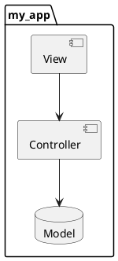
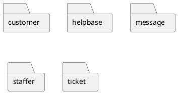
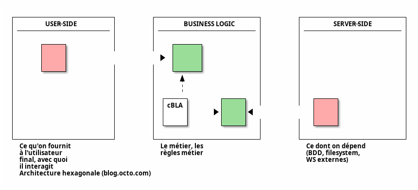
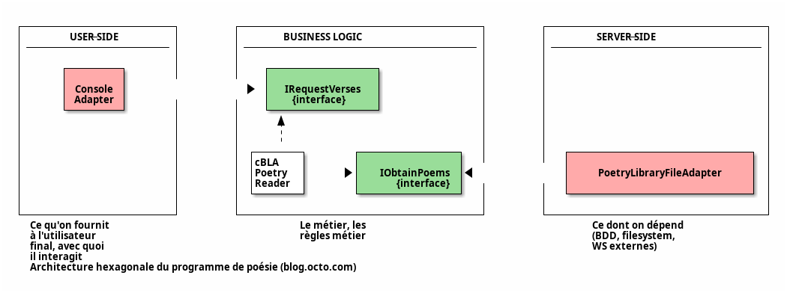

<!-- _class: titre lead -->

# Architecture Hexagonale
# Clean architecture

_Tom Avenel_

<https://www.avenel.pro/>

<!-- _footer: "© 2025 Tom Avenel under 󰵫  BY-SA 4.0" -->

---

## Intention :thinking:

> L'Architecture est une affaire d'Intention, pas de Frameworks. (Uncle Bob)

> Une bonne architecture permet de remettre en cause facilement des décisions volatiles (Uncle Bob)

> Une bonne architecture est une architecture qui supporte sa propre évolution (Martin Fowler)

---


```plantuml
@startuml

folder my_app {
  component View
  component Controller
  database Model
  
  View --> Controller
  Controller --> Model
}

@enduml
```

_Quel est le <span v-mark.underline.red="0">but</span> de cette application ?_ 🤔

---


```plantuml
@startuml
folder customer
folder helpbase
folder message
folder staffer
folder ticket
@enduml
```

_Quel est le <span v-mark.underline.red="0">but</span> de [cette application django][ddd-django] ?_ 💡

---

## Objectifs :dart:

- Mettre ensemble uniquement ce qui a la même raison de changer (découplage)
- Retirer la technologie du métier pour pérenniser sa valeur

---

# Architecture Hexagonale

> Permettre à une application d’être pilotée aussi bien par des utilisateurs que par des programmes, des tests automatisés ou des scripts batchs, et d'être développée et testée en isolation de ses éventuels systèmes d’exécution et bases de données. (Alistair Cockburn, 2005)

---

## Idée :bulb:

- :package: **Isoler** le _cœur de métier_ des appelants et des dépendances
- :test_tube: Le tester **indépendamment**

---

## Principes

- Séparer explicitement `User-Side` :bust_in_silhouette: , `Business Logic` :gear: et `Server-Side` :printer:
- Les dépendances vont vers la `Business Logic` :gear:
- On isole les frontières par des `Ports` et `Adapters`

---


```plantuml
@startditaa

+--------------------+       +---------------------+       +---------------------+
|     USER-SIDE      |       |    BUSINESS LOGIC   |       |     SERVER-SIDE     |
|--------------------|       |---------------------|       |---------------------|
|                    |       |                     |       |                     |
|     +----+         |       |   +-----+           |       |                     |
|     |cPNK|         |       |   |cGRE |           |       |                     |
|     |    |===================> |     |           |       |                     |
|     |    |         |       |   |     |           |       |                     |
|     +----+         |       |   +-----+           |       |                     |
|                    |       |     ^               |       |                     |
|                    |       |     :               |       |                     |
|                    |       |     :               |       |                     |
|                    |       | +----+      +----+  |       |  +----+             |
|                    |       | |cBLA|      |cGRE|  |       |  |cPNK|             |
|                    |       | |    |=====>|    |<============|    |             |
|                    |       | |    |      |    |  |       |  |    |             |
|                    |       | +----+      +----+  |       |  +----+             |
|                    |       |                     |       |                     |
+--------------------+       +---------------------+       +---------------------+

  Ce qu'on fournit             Le métier, les                Ce dont on dépend    
  à l'utilisateur              règles métier                 (BDD, filesystem,    
  final, avec quoi                                           WS externes)         
  il interagit                                                                    

= Architecture hexagonale (blog.octo.com)

@endditaa
```

---

## Business Logic :gear:

- L'hexagone (centre)
- Isole et implémente le **domaine** et la **logique métier**
- Compréhensible par le fonctionnel
- Unique à l'application (spécificité)
- Agnostique : minimum de technologie
  - :no_entry_sign: `Django`, `logger`, :no_entry: persistence :no_entry: , …

---

## User-side :bust_in_silhouette:

- Point d'entrée (utilisateur ou autre programme) pour **interagir** et **piloter** la business logic :gear:
- Routes `HTTP`, sérialisations `JSON`, API, …

---

## Server-side :printer:

- **Dépendances** et détails d'infrastructure
- Pilotés par la **business logic** :gear:
- Base de données, Service Provider Interface (SPI), …

---

## Exemple

> Alistair in the "Hexagone", Thomas Pierrain, Alistair Cockburn, 2017.

- Objectif : :speech_balloon: programme qui écrit dans la console des poèmes récupérés dans un fichier.

```sh
$ ./printPoem
Here is some poem:
I want to sleep
Swat the files
Softly, please.
-- Masaoka Shiki (1867 - 1902)
Type enter to exit...
```

---


```plantuml
@startditaa

+--------------------+       +--------------------------------+       +-----------------------------+
|     USER-SIDE      |       |    BUSINESS LOGIC              |       |     SERVER-SIDE             |
|--------------------|       |--------------------------------|       |-----------------------------|
|                    |       |                                |       |                             |
|     +-------+      |       |   +--------------+             |       |                             |
|     |cPNK   |      |       |   |cGRE          |             |       |                             |
|     |Console|================> |IRequestVerses|             |       |                             |
|     |Adapter|      |       |   | {interface}  |             |       |                             |
|     +-------+      |       |   +--------------+             |       |                             |
|                    |       |     ^                          |       |                             |
|                    |       |     :                          |       |                             |
|                    |       |     :                          |       |                             |
|                    |       | +------+      +-------------+  |       |  +------------------------+ |
|                    |       | |cBLA  |      |cGRE         |  |       |  |cPNK                    | |
|                    |       | |Poetry|=====>|IObtainPoems |<============|PoetryLibraryFileAdapter| |
|                    |       | |Reader|      | {interface} |  |       |  |                        | |
|                    |       | +------+      +-------------+  |       |  +------------------------+ |
|                    |       |                                |       |                             |
+--------------------+       +--------------------------------+       +-----------------------------+

  Ce qu'on fournit                    Le métier, les                         Ce dont on dépend    
  à l'utilisateur                     règles métier                          (BDD, filesystem,    
  final, avec quoi                                                           WS externes)         
  il interagit                                                                           

= Architecture hexagonale du programme de poésie (blog.octo.com)

@endditaa
```

---

### Inversion de dépendances

- Rappel : les dépendances vont l'intérieur (vers l'hexagone `Business Logic` indépendant)
- Inversion de dépendances :
  - `Port` (interface) à l'intérieur (hexagone)
  - `Adapter` (implémentation) à l'extérieur (`User-Side` et `Server-Side`)
- Possibilité de changer d'`Adapter` : base de données :minidisc: , fichiers :file_folder: , …

---

### Code

```cs
public PoetryReader(IObtainPoems poetryLibrary)
{
    this.poetryLibrary = poetryLibrary;
}
```

---

```cs
class Program
{
    static void Main(string[] args)
    {
        // 1. Instantiate right-side adapter(s) ("I want to go outside the hexagon")
        IObtainPoems fileAdapter = new PoetryLibraryFileAdapter(@".\Rimbaud.txt");

        // 2. Instantiate the hexagon
        IRequestVerses poetryReader = new PoetryReader(fileAdapter);

        // 3. Instantiate the left-side adapter(s) ("I want ask/to go inside the hexagon")
        var consoleAdapter = new ConsoleAdapter(poetryReader);

        System.Console.WriteLine("Here is some...");
        consoleAdapter.Ask();

        System.Console.WriteLine("Type enter to exit...");
        System.Console.ReadLine();
    }
}
```

---

## Tests :test_tube:

- `Business Logic` : unitairement sur l'ensemble de la valeur métier :arrow_up::arrow_up::arrow_up:
- Intégration `User-Side` et `Business Logic` :arrow_upper_right::arrow_upper_right:
- Intégration `Business Logic` et `Server-Side` :arrow_upper_right::arrow_upper_right:
- Tests e2e : très peu, uniquement pour valider la traversée de la stack complète du port d'entrée au port de sortie :arrow_lower_right:
  - `User-Side` -> `Business Logic` -> `Server-Side`

---

### Implémentation des tests

- :bust_in_silhouette: `User-Side` : rôle de pilotage : directement par le framework de test :test_tube:
- :printer: `Server-Side` : rôle de dépendance : `Mock` :zombie:

```cs
IObtainPoems mockFileAdapter = new IObtainPoems { … } ;
IRequestVerses poetryReader = new PoetryReader(mockFileAdapter);
```

---

# Clean Architecture

> Uncle Bob, 2017

---

## Idées

- Règles métier au centre (_Enterprise Business Rules_)
- **Use Cases** autour : uniques composants appelant des règles métier (_Application Business Rules_)
- puis ajout de **Contrôleurs** autour
- puis ajout des **Frameworks** et **Dépendances** autour

---


<!-- _class: legende -->

Clean Architecture. Credits: Robert C. Martin (Uncle Bob)

---

<!-- _class: bjaune -->
## Entities

- Cœur de la Clean Architecture
- Domaine métier (voir DDD)
- :white_check_mark: objets simples
- :white_check_mark: Peuvent être utilisées par toutes les couches de l'application.
- :x: Pas de dépendance technique (Framework, BDD)
- :x: Pas de logique spécifique à un cas d'usage

---

<!-- _class: brose -->
## Use Cases

- Encapsulent **toute** la logique métier spécifique à l'application.
- :arrow_left: :arrow_right: Interagit avec les entités
- Détermine comment les données doivent être transmises entre les entités et les couches extérieures.
- :warning: 1 Use Case == 1 Processus métier
- Indépendant des détails de l'implémentation externe
  - format de donnée agnostique (transformé par le **Presenter**)

---

<!-- _class: bvert -->
## Interface Adapters

- :arrow_left: :arrow_right: Fait le lien entre les `Use Case` et les couches externes
- :building_construction: Adapte les données pour les cas d'usage…
- :building_construction: …puis les présente dans le bon format à l'interface utilisateur ou d'autres API.
- Isolent la logique métier des détails techniques de l’application.
- `controllers`, `presenters`, `gateways`, …

---

<!-- _class: bbleu -->
## Couche externe : UI, Frameworks, Drivers

- :arrow_right: Tout ce qui est en contact avec le monde extérieur : interface utilisateur, BDD, serveurs web, …
- :warning: Séparé des règles métier
- :warning: Sert uniquement à communiquer avec d'autres systèmes (ou l'utilisateur)
- Utiliser les adapteurs pour s'adapter facilement aux changements

---

## Règle de dépendance

> Toute modification dans les couches externes ne doit pas affecter les couches internes

---

## Mise en œuvre - 1/2

- :bulb: Analyse et Conception initiales : comprendre le domaine, identifier les entités, les règles métier, les cas d'usage
- :scissors: Définir des frontières entre les couches
- :busts_in_silhouette: Créer les Entités
- :office_worker: Développement des Cas d'Usage
- :building_construction: Conception des Adaptateurs

---

## Mise en œuvre - 2/2

- :arrow_right: Développement et intégration des composants externes : UI, BDD, Service Web, …
- :test_tube: Tests Rigoureux :
  - la logique métier fonctionne comme prévu ?
  - les couches externes interagissent correctement avec les cas d'usage ?
- :arrows_counterclockwise: Révision et Refactorisation

---

<!-- class: liens -->
# Liens

- [Architecture hexagonale : 3 principes et un exemple (blog.octo.com)](https://blog.octo.com/architecture-hexagonale-trois-principes-et-un-exemple-dimplementation)
- [Alistair Cockburn : hexagonal architecture](https://alistair.cockburn.us/hexagonal-architecture/)
- [Discussions sur l'architecture hexagonale](https://wiki.c2.com/?HexagonalArchitecture/)
- [Uncle Bob : clean architecture (2012-08-13)](https://blog.cleancoder.com/uncle-bob/2012/08/13/the-clean-architecture.html)
- [Uncle Bob : clean architecture (2016-01-04)](https://blog.cleancoder.com/uncle-bob/2016/01/04/ALittleArchitecture.html)
- [Robert C Martin - Clean Architecture and Design (Youtube)](https://www.youtube.com/watch?v=Nsjsiz2A9mg)
- [Clean architecture - summary](https://gist.github.com/ygrenzinger/14812a56b9221c9feca0b3621518635b)
- [Daniel Oliveira : How to write robust apps every time, using "The Clean Architecture"](https://www.freecodecamp.org/news/how-to-write-robust-apps-consistently-with-the-clean-architecture-9bdca93e17b)
- [Architecture explicite](https://herbertograca.com/2017/11/16/explicit-architecture-01-ddd-hexagonal-onion-clean-cqrs-how-i-put-it-all-together/)

[ddd-django]: https://github.com/johnnncodes/ddd-python-django

---

<!-- class: legal -->

# Legal

| [](http://creativecommons.org/licenses/by-sa/4.0/) | CC BY-SA 4.0 |
| ---------------------------------------------------------------- | ------------------------------------------ |
|  | Attribution : vous devez créditer l'auteur |
|  | Partage dans les mêmes conditions          |

- Ce fichier est mis à disposition selon les termes de la Licence Creative Commons Attribution - Partage dans les Mêmes Conditions 4.0 International. Pour plus d'informations : <http://creativecommons.org/licenses/by-sa/4.0/>
- Le code source au format `Markdown` de ce document est disponible sur le [site web][site-perso]

[site-perso]: https://www.avenel.pro/

