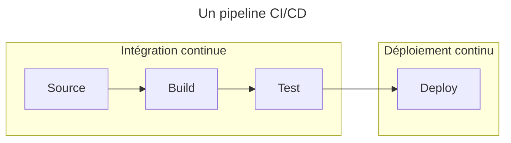
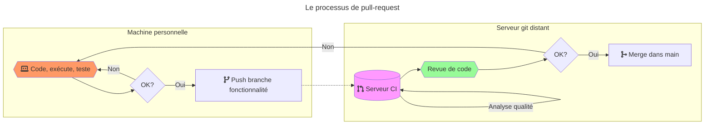

<!-- _class: titre lead -->

# Pipelines

---

# Pipelines

Un pipeline d'intégration est une définition formelle du processus à suivre pour intégrer des changements.
Il est souvent représenté de manière graphique par un schéma d'enchaînement d'actions.

Ces pipelines peuvent être exécutés manuellement, mais ils seront aussi la référence utilisée pour l'automatisation et l'orchestration de l'intégration continue.

---

# Exemple simpliste de pipeline

---

On pourra utiliser plusieurs profils (_pipelines_) d’intégration suivant les changements à intégrer et les ressources disponibles, par exemple :

- `Daily` pour chaque intégration : tests unitaires uniquement
- `Nightly` chaque soir : tests de fonctionnalités non parallélisables
- `Weekly` chaque semaine : `staging` (copie environnement de production) pour scénarios complexes de tests de performances

---

On pourra répliquer certains éléments de la boucle d’intégration continue sur l’environnement du développeur pour améliorer les temps de réponse.

Cela ne dispense pas de reproduire ces étapes sur le serveur d’intégration (environnement neutre).

---

<!-- _class: subtitle lead -->

# Lien avec les workflows Git

## Pull requests

---

# Lien avec les workflows

Les pipelines d'intégration continue sont fortement liés aux workflows de gestion du code source qui conditionnent les process de développement.

Voir le [cours sur le gestionnaire de versions Git][site-perso].

---

# Pull-request

- Popularisé par `GitHub®`, la `pull-request` ou `merge-request` est aujourd'hui largement répandue en gestion de projet.
- En théorie, simple demande de relecture de code avant l'intégration (`merge`) d'une branche dans une autre.
- En pratique : permet de prévenir l'équipe de la fin d'une partie du produit et engage le processus d'intégration, par exemple un pipeline d'intégration continue

---

# Process de pull-request

Étape optionnelle avant d'intégrer la branche de fonctionnalité au `main` du dépôt central :

1. `push` de la branche de `dev` dans le dépôt central
2. Validation des changements avant fusion : `pull-request`
3. Fusion dans `main` dans le dépôt central

---

- C'est généralement le point de départ du pipeline d'intégration continue.
- Sert de discussion avant l'intégration de changements : revue de code, vérification de la qualité, process administratifs, ...
- Approuvée manuellement par les développeurs ou automatiquement en fonction de critères qualité.

---

# Qualité du commit vs qualité de la pull-request

Il existe 2 grands schémas de lancement de pipeline d'intégration continue (et beaucoup de modèles mélangeant un peu de ces deux schémas) :
- Pour chaque commit : à privilégier pour les branches stables du projet, où chaque commit est critique : `master`, ...
- Au moment d'une pull-request : à privilégier pour les branches de travail instables : fonctionnalité, correction de bug, ...

---

# Qualité liée au commit

- Les interfaces de gestion de projets hébergés (`Github®`, `Bitbucket`, `Gitlab`, ...) peuvent parfois laisser croire que l'intégration continue a été réalisée sur la pull-request…
- …mais la référence utilisée est **toujours un commit** (celui qui sera utilisé pour le merge de la branche).
- `qualité de la pull request == qualité du commit de référence de la branche à intégrer`

---

---

# Actionnabilité

- Besoin d'**actionnabilité** après erreur dans le pipeline
- Définir la **gouvernance** : qui est responsable de quoi ?
- Sinon : plus de confiance dans la CI/CD

---

<!-- class: liens -->

# Liens

- [Exemple de pipeline Jenkins YAML en Infrastructure-as-Code][gist-jenkins-pipeline-yaml]
- [CD : Gestionnaires d'artéfacts - attaques supply chain](https://blog.wescale.fr/supply-chain-attack-proxies-gestionnaires-dartefacts-et-cartographie)
- [CD : attaques supply chain - livrables de confiance](https://blog.wescale.fr/supply-chain-attack-des-livrables-de-confiance)

[gist-jenkins-pipeline-yaml]: https://gist.github.com/jonico/e205b16cf07451b2f475543cf1541e70

---

# Legal

- Git and the Git logo are either registered trademarks or trademarks of Software Freedom Conservancy, Inc., corporate home of the Git Project, in the United States and/or other countries
- GITHUB®, the GITHUB® logo design, the INVERTOCAT logo design, OCTOCAT®, and the OCTOCAT® logo design are trademarks of GitHub, Inc., registered in the United States and other countries.
- Bitbucket is a registered trademark of Atlassian Pty Ltd.
- GitLab is a registered trademark of GitLab Inc.
- Other names may be trademarks of their respective owners

