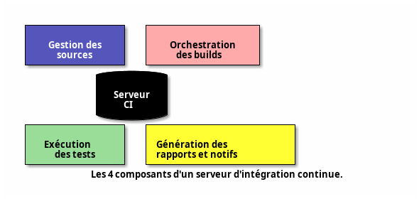

# Serveur d'intégration continue

Outil permettant d'orchestrer le lancement de l'intégration continue, l'exécution des différent outils et la génération de rapports sur la qualité du code après leur exécution.

Le code source est surveillé (ou une notification reçue) pour chaque nouveau changement à analyser, afin de lancer la boucle d'intégration continue.

---

```plantuml
@startuml
!include https://raw.githubusercontent.com/plantuml-stdlib/C4-PlantUML/master/C4_Container.puml

caption
= Exemple d'utilisation d'un serveur d'intégration continue.
endcaption

HIDE_STEREOTYPE()

Person(dev, "Développeur", $sprite="&laptopscale=3.0")
ContainerDb(git, "Dépôt de code", "Git", $sprite="&code,scale=5.0")
System(jenkins, "Serveur d'intégration continue", "Jenkins", $sprite="&loop,scale=5.0")
Container(artifact, "Artefact", $sprite="&box,scale=2.0")
Container(reports, "Rapports", $sprite="&graph,scale=2.0")

Rel(dev, git, "Commit")
Rel(git, dev, "Mise à jour")
Rel(jenkins, jenkins, "Exécution des tests")
Rel_R(git, jenkins, "Envoi des modifications")
Rel(jenkins, artifact, "Création des livrables")
Rel(jenkins, reports, "Génération des rapports")
@enduml
```

---

# Types de serveurs CI

- Combinant hébergement des sources et intégration continue du projet : `Github®`, `Gitlab®`, `Bitbucket®`, ...
  + Ces serveurs proposent des solutions cloud gérant tout le cycle de vie du projet.
- Dédiés à l'intégration continue uniquement : `Jenkins®`, `TeamCity®`
  + S'interfacent avec un hébergement distant.
  + Peuvent être hébergés en ligne ou déployés sur un serveur dédié.

---

# Lequel choisir ?

Un hébergement cloud combinant hébergement et intégration continue est une solution de facilité pour des projets "classiques" dont l'intégration suit des patterns standards.

Un serveur dédié permet de contrôler plus finement l'intégration mais nécessite plus de configuration.

---

# Architecture d'un serveur d'intégration continue



---

<!-- _class: subtitle lead -->

# Avantages d'un serveur d'intégration

---

# Environnement neutre

Serveur distant : environnement « neutre » pour s’affranchir des spécificités des postes de développeurs :

- Librairie présente sur le poste de travail mais non déclarée dans les dépendances du projet.
- Version des outils / librairies différentes sur chaque poste de travail.
- Permet d’obtenir des build fiables et reproductibles.

---

# Plannification

Permet de planifier l'exécution des tâches de l'intégration continue

---

# Mutualisation

Mutualise les ressources entre plusieurs développeurs et/ou plusieurs équipes

---

<!-- _class: subtitle lead -->

# Inconvénients d'un serveur d'intégration

---

# Ressources matérielles

L'utilisation d'un serveur d'intégration dédié est une ressource supplémentaire.

---

# Temps d'exécution

 Augmente le temps d’exécution de la _feedback loop_ pour le développeur (temps nécessaire avant d’avoir un retour sur la qualité des changements à intégrer).

Il faut trouver un compromis entre une exécution rapide mais peu de feedback, ou beaucoup de vérifications mais à un coût en temps et ressources élevées.

---

En général, une feedback loop de :

- `15 / 30 min` est une bonne moyenne
- `> 1h` est peu utilisable : l'environnement du développeur sera trop différent de celui des modifications à tester

---

# Optimisations

La phase de compilation est une bonne cible d’optimisation : elle peut être une part importante du temps d’exécution mais produit peu de feedback.

On parallélisera au maximum les tests d’intégration continue (souvent unitaires) pour améliorer ce temps de réponse.

Plus les intégrations sont fréquentes, plus la feedback loop devra être rapide.

---

<!-- _class: titre lead -->

# Jenkins

![The Jenkins logo][jenkins-logo]

Le [logo Jenkins®][jenkins-website].

---

<!-- _class: subtitle lead -->

# Présentation du produit

---

# Présentation de Jenkins®

- Serveur d'intégration continue en Java.
- Système simple mais entièrement configurable.
- Intégration continue et DevOps par plugin : `Git`, `Maven 2 project`, `Amazon EC2`, `HTML Publisher`, ...

---

- Outil d'intégration continue le plus utilisé : vaste communauté, 1500 plugin…
- ...Mais système vieillissant et difficile à maintenir (en cours de réécriture)
- Fork open-source de `Hudson` (nombreuses traces dans documentation et configurations).

---
<!-- _class: subtitle lead -->

# Installation et déploiement

---

# Installation de Jenkins

- Installation comme application indépendante
  + facile et rapide sur toute machine
  + serveur d'applications dédié ou container servlet Java `Jetty` (voir doc)
- Installation comme servlet dans un serveur d'applications Java : `Apache Tomcat`, `GlassFish®`, ...
  + serveur applicatif à administrer
  + stabilité accrue des tests et du déploiement
- Déploiement dans des conteneurs `Docker`

---

_Pour nos besoins, nous nous limiterons à l'utilisation de Jenkins dans son propre serveur d'applications, en lançant directement le JAR récupéré sur la page du projet._

---

# Modèles de déploiement

Mode de déploiement `Contrôleur` / `Agent` (maître / esclave).

- Le contrôleur orchestre les build : récupère les changements à valider, choisit un nœud agent pour l'exécution et démarre le build.
- L'agent exécute simplement les tâches qui lui sont assignées et retourne les résultats au contrôleur.

---

_Afin de réduire la charge de l'orchestrateur au maximum, il est recommandé de déléguer l'exécution des build à des agents au maximum, et d'installer les agents sur des ressources dédiées._

---

<!-- _class: subtitle lead -->

# Principaux plugin

---

# Plugin

Jenkins est avant tout un orchestrateur de build, délégant chaque tâche à un ou plusieurs plugin pour :

- ajouter des fonctionnalités au serveur : nouveaux écrans de contrôles, gestion fine des dépendances de build, ...
- faire le lien entre le serveur et les outils d'intégration continue locaux ou sur le réseau. 

---

# Principaux plugin 1/2

- `Dashboard View Plugin` : suit le statut des tâches
- `Monitoring Plugin` : mesure la performance des jobs
- `Kubernetes Plugin` : gère le déploiement des agents Jenkins sur une infrastructure `Kubernetes`
- `Multijob Plugin` : orchestre des tâches complexes de manière séquentielle

---

# Principaux plugin 2/2

- `GitHub API` : planifie et déclenche des build depuis GitHub®
- `Git Client` : fournit une API Git pour les plugin Jenkins
- `Pipeline` et `Blue Ocean` : configuration de pipelines proches de celle des hébergements cloud : `Gitlab`, `GitHub®`, `Bitbucket`, ...

---

<!-- _class: subtitle lead -->

# Les jobs Jenkins

---

# Les jobs

- Jenkins fonctionne essentiellement sous la forme de jobs (enchaînement d'étapes), de types variés.
- 1 projet de build = un job.
- Peut enregistrer et afficher des processus exécutés à l'extérieur de Jenkins.

---

_Un job multi-configuration peut être d’une grande utilité dans des projets plus sophistiqués, notamment lorsque des build spécifiques à chaque plateforme sont nécessaires._

---

<!-- _class: subtitle lead -->

# Automatisation

---

# La CLI et l'API

- Possibilité d'automatisation : création, sauvegarde, restauration, exécution ou vue de jobs Jenkins, ...
- Soit par ligne de commandes (CLI) fournie en JAR.
  + Packagée à l'intérieur du `WAR` local : `wget http://localhost:8080/jenkins/jnlpJars/jenkins-cli.jar`
- Soit par une REST API.
  + 3 implémentations : `XML`, `JSON`, `Python`

---

<!-- _class: subtitle lead -->

# Références

---

La documentation de Jenkins est très complète, on pourra notamment citer :

- La [site officiel][jenkins-website]
- La page d'accueil de la [documentation][doc-jenkins-main]
- Comment gérer la [sécurité de Jenkins ?][doc-jenkins-secu]
- Comment installer et gérer les [plugins Jenkins ?][doc-jenkins-plugins]
- Comment utiliser les [pipelines Jenkins ?][doc-jenkins-pipelines]
- Comment mettre en oeuvre les [builds dans Jenkins ?][doc-jenkins-builds]
- [Guide complet de Jenkins][jenkins-guide-complet]

---

<!-- _class: titre lead -->

# Tests, métriques et outils d'analyse

---

<!-- _class: subtitle lead -->

# Tests unitaires et d'intégration

---

# Automatisation des tests unitaires et d'intégration

Jenkins est un orchestrateur : il permet donc d'automatiser les tests unitaires et/ou d'intégration, de plusieurs manières :

- En utilisant des plugin dédiés.
- En s'intégrant avec des outils de build : `Maven`, `Gradle`, ...
- En fournissant des scripts à exécuter

---

_Jenkins permet de s'interfacer avec de nombreux outils d'exécution ou de reporting de tests. Nous verrons comment intégrer Jenkins avec les principaux outils de tests._

---

<!-- _class: subtitle lead -->

# Lier et enchaîner les jobs

---

# Enchaînement de jobs

Le chaînage des jobs est l'une des fonctionnalités les plus intéressantes de Jenkins :

- permet de créer des liens logiques entre les jobs
- exécution d'autres jobs en cas de succès ou d'échec

---

En pratique, on utilise les dépendances entre jobs pour :

- Appeler des jobs (publication de résultats, ...) qui peuvent être communs à un ensemble de builds d’intégration continue.
- Nettoyer le système en cas d’échec lors d’un build.
- Séparer les étapes d’un process d’intégration continue : compilation des sources, exécution des tests, analyse statique, ...

---

<!-- _class: subtitle lead -->

# Les outils d'analyse principaux

---

# Outils d'analyse

Jenkins supporte de nombreux outils d'analyse par le biais de plugins, par exemple :

- `Checkstyle`
- `Spotbugs`
- `Emma`
- `CPD/PMD`

---

# Le plugin Warnings Next Generation

Regroupe de nombreux plugin d'intégration continue pour :

- Analyser les erreurs des compilateurs : `C`, `C#`, `Java`
- Générer des avertissements en utilisant des outils d'analyse statique  : `CheckStyle`, `SpotBugs`
- Détecter les duplications de code : `CPD`
- Trouver les vulnérabilités dans le code
- Ajouter des commentaires dans les sources du projet

---

_Ce nouveau plugin rend obsolète la plupart des plugin de la suite d'analyse statique de Jenkins : `Android Lint`, `CheckStyle`, `Dry`, `FindBugs`, `PMD`, `Warnings`, `Static Analysis Utilities`, `Static Analysis Collector`_

---

# Intégration avec l'outil SonarQube™

Jenkins s'intègre avec le serveur d'analyse de qualité `SonarQube` (outil de reporting sur la qualité des projets informatique).

Celui-ci centralise les rapports d’outils d’analyse de code pour afficher des informations comme la couverture de test, le respect des normes de développement, la complexité, la duplication…

`SonarQube™` supporte de nombreux langages : `Java`, `PHP`, `C++`, `.NET`, ...

---

![Sonarqube UI][sonarqube-ui]

<!-- _class: legende -->

Exemples de rapports SonarQube™ (source: Ganncamp at <https://en.wikipedia.org/wiki/SonarQube>).

---

## Dette technique

_Dette technique_ : temps nécessaire dans le futur pour faire évoluer le code (correction de bugs, refactor, …)

_Si SonarQube permet de quantifier la dette technique d'un projet, il est important de garder à l'esprit que ces valeurs sont avant tout un ensemble d'indices permettant de déceler des zones d'amélioration, et non une métrique fiable sur la qualité du produit_

---

### Exemples de métriques

- Pourcentage de lignes de code dupliquées
- Pourcentage de lignes de code testées (ex : 70%)
- Complexité du modèle (nombre de méthodes par classe, profondeur de l'héritage, ...)
- Nombre d'avertissements du compilateur

---

# Rapports de tests dans TestLink

- `TestLink` est un outil d'"Assurance Qualité" permettant de gérer l'ensemble du cycle de vie des tests : la gestion des cas de test, la gestion des exigences, l'exécution des campagnes de test et le reporting des résultats.
- C'est l'un des outils les plus utilisés en Assurance Qualité pour réaliser le suivi des tests.
- Jenkins permet l'intégration des résultats des tests exécutés en envoyant les rapports d'exécution dans `TestLink`.

Voir le [TP sur TestLink][site-perso].

---

<!-- _class: titre lead -->

# Pipelines Jenkins et jobs complexes

---

# Pipelines Jenkins

- Jenkins permet de créer un workflow d'orchestration, appelé pipeline.
- Par exemple, un fichier de pipeline déclaratif peut comprendre une étape de build, une étape de test et une étape de déploiement ; chaque étape implique de nombreuses étapes individuelles.
- Jenkins peut créer et soutenir des pipelines multi-branches pour créer des jobs de build complexes en se basant sur des critères externes.

---

- Jenkins propose deux modes de configuration pour les pipelines :
  + En configurant les étapes du pipeline directement dans Jenkins
  + En codant ces étapes dans un fichier `.jenkinsfile`, de façon similaire à ce qui est utilisé sur les outils d'hébergement de code en ligne `Github®`, `Gitlab`, `Bitbucket`
- Dans un modèle continu ou DevOps, Jenkins est utilisé pour des activités de déploiement, même dans des configurations complexes et sur plusieurs serveurs Jenkins, en utilisant généralement les API des pipelines.

---

# Jobs paramétrés – réutilisation d’un commit

- Jenkins permet de créer des jobs paramétriques.
- Le plugin `Parameterized Build` permet de configurer des paramètres pour les tâches de build, qui peuvent être entrés par l'utilisateur lorsque le build est déclenché ou depuis une autre tâche.
- Cette paramétrisation permet par exemple de choisir un environnement d'exécution ou de fournir un mot de passe pour une application.

---

_Un autre cas d'utilisation est la réutilisation d'un commit : un job principal peut être lancé depuis le dépôt de code après l'arrivée d'un nouveau commit. Ce job principal peut lancer de nouveaux jobs en leur fournissant l'identifiant du commit en cours de test - cela permet d'assurer une chaîne complète de jobs testant le même commit._

---

# Job manuel dans un pipeline

- Jenkins permet l'exécution d'étapes manuelles dans un pipeline pour demander une approbation avant de continuer l'exécution (instruction `input`).
- `input` affiche un message à l'utilisateur avec deux options :
  + `Proceed` pour continuer l'exécution du pipeline
  + `Abort` pour l'arrêter.

---

_Ces étapes sont très utiles dans des pipelines de déploiement.
Elles permettent par exemple de demander à un opérateur de vérifier les critères de qualité d'un build avant d'approuver le déploiement automatique du projet en production._

---

# Enchaînement de jobs

`dependency` et `join` permettent de créer des dépendances entre les jobs :
- `dependency` permet de rendre un job dépendant d'un autre job.
- `join` permet d'attendre la fin d'un groupe de jobs avant d'exécuter le job suivant.
- Mettent en place un pattern `map/reduce` sur les dépendances : optimise le temps d'exécution et la gestion des erreurs

---

Une utilisation classique de ce pattern en intégration continue est l'exécution parallèle de tests :

- Les tests exécutés en parallèle dépendent du job de compilation.
- Un job de résultats regroupe toutes les exécutions dans une étape `join`.

---

Pour plus d'informations sur l'enchaînement de jobs :

- Le plugin [Depgraph View][plugin-depgraph-view] permet de représenter les dépendances
- Documentation du plugin [join][plugin-join]

---

# Jobs multi-configuration

- Il est courant dans un process d'intégration continue de devoir exécuter la même suite de tests  dans des environnements différents.
- Pour rationaliser ces exécutions et éviter de dupliquer des jobs similaires, Jenkins fournit un type avancé de jobs : les jobs multi-configuration.
- Matrices de configuration qui vont générer un build dédié pour chaque environnement défini.

---

Ces jobs sont surtout utilisés pour des tests d'intégration dépendants de l'environnement d'exécution :

- tests d'interface graphique sur des matrices de navigateurs Web (type de navigateur x version).
- tests de déploiement applicatif multi-OS : `Windows®`, `Linux®`, `Mac OS®`

---

# Déploiement continu (_Continuous Deployment_)

- Le mouvement DevOps favorise de plus en plus un processus opérationnel entièrement automatisé.
- La CI devient une vérification entièrement automatisée dans le pipeline de déploiement.
- Si succès : l'artéfact généré est déployé automatiquement en production.

---

_Cette méthode opérationnelle est très efficace car elle est entièrement automatisée. Cependant, il est nécessaire de pouvoir agir très rapidement sur la production pour pouvoir fixer d'éventuels problèmes non détectés par le processus automatique._

---

# Livraison continue (_Continuous Delivery_)

En pratique, on ajoute souvent une étape de validation manuelle avant le déploiement en production : on effectue alors uniquement la livraison dans un environnement d'intégration / pré-production. Ce modèle s'appelle la livraison continue (_continuous delivery_) et est souvent le terme abrégé par `CD` dans la `CI/CD`.

---

# Méthodologies et gestion de projet

## Découpage en composants

- Permet une exigence qualité différente pour chaque composant.
- Facilite la non régression en testant les composants isolément.
- Permet d’identifier des zones de haute qualité vs des zones à améliorer.

---

# Méthodologies et gestion de projet

## Gestion de projet

- L’intégration a lieu bien plus tôt dans la phase de développement.
- Les itérations facilitent l’acceptation ou le rejet des changements.
- Très compatible avec les méthodes agiles

---

# Méthodologies et gestion de projet

## Responsabilité partagée

- L’intégration continue peut être mise en place à tous les niveaux du pipeline d’intégration :
  + Chez les développeurs (IDE)
  + Chez les opérationnels (serveur d’intégration)

---

<!-- _class: titre lead -->

# Pour aller plus loin - pratiques DevOps

Voir le [cours sur les pratiques DevOps][site-perso].

---

[jenkins-logo]: https://www.jenkins.io/images/logos/jenkins/256.png
[server-ci-process]: ./server-ci-process.jpg
[sonarqube-ui]: https://upload.wikimedia.org/wikipedia/commons/a/ac/SonarQube_Project_page.png

<!--references-->
[jenkins-website]: https://www.jenkins.io/
[doc-jenkins-main]: https://www.jenkins.io/doc/
[doc-jenkins-secu]: https://www.jenkins.io/doc/book/managing/security/
[doc-jenkins-plugins]: https://www.jenkins.io/doc/book/managing/plugins/
[doc-jenkins-pipelines]: https://www.jenkins.io/doc/tutorials/#pipeline
[doc-jenkins-builds]: https://www.jenkins.io/doc/tutorials/#tools
[jenkins-guide-complet]: https://jenkins-le-guide-complet.github.io/html/book.html
<!--plugins-->
[plugin-depgraph-view]: https://plugins.jenkins.io/depgraph-view/
[plugin-join]: https://plugins.jenkins.io/join/

---

# Legal 

- Oracle and Java are registered trademarks of Oracle and/or its affiliates
- Jenkins® and the Jenkins logo are registered trademarks of LF Charities Inc.
- TeamCity is a trademark or registered trademark of JetBrains, s.r.o.
- Git and the Git logo are either registered trademarks or trademarks of Software Freedom Conservancy, Inc., corporate home of the Git Project, in the United States and/or other countries
- Apache, Apache Subversion, and the Apache feather logo are trademarks of The Apache Software Foundation.
- GITHUB®, the GITHUB® logo design, the INVERTOCAT logo design, OCTOCAT®, and the OCTOCAT® logo design are trademarks of GitHub, Inc., registered in the United States and other countries.
- Bitbucket is a registered trademark of Atlassian Pty Ltd.
- GitLab is a registered trademark of GitLab Inc.
- GRADLE is a trademark of GRADLE, INC
- Apache, Apache Maven, and Maven are trademarks of the Apache Software Foundation
- The project name “webpack” is a trademark of the JS Foundation.

---

- GlassFish® is a trademark of Eclipse Foundation, Inc.
- Apache, Apache Tomcat, and Tomcat are trademarks of the Apache Software Foundation
- SONARQUBE is a trademark of SonarSource SA.
- Linux is a registered trademark of Linus Torvalds.
- Mac and Mac OS are trademarks of Apple Inc., registered in the U.S. and other countries.
- Windows is a registered trademark of Microsoft Corporation in the United States and other countries.
- The name SpotBugs and the SpotBugs logo are trademarked by the University of Maryland.
- "Python" is a registered trademark of the PSF. The Python logos (in several variants) are use trademarks of the PSF as well.
- Kotlin is a trademark or registered trademark of JetBrains, s.r.o.
- Docker, Docker Swarm and the Docker logo are trademarks or registered trademarks of Docker, Inc. in the United States and/or other countries. Docker, Inc. and other parties may also have trademark rights in other terms used herein.
- Kubernetes® is a registered trademark of The Linux Foundation in the United States and/or other countries
- Other names may be trademarks of their respective owners

