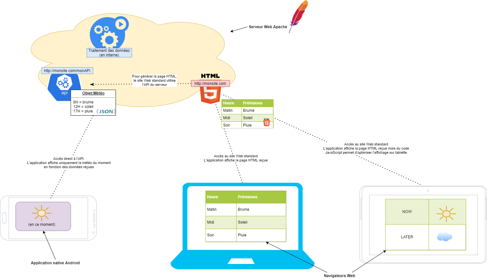

# http://

- `Hypertext Transfer Protocol (HTTP)` : protocole de communication client-serveur pour le Web.
- Protocole de la couche applicative : n'impose pas de couche de transport (en pratique, `TCP`).
- Clients `HTTP` classiques : navigateurs Web permettant d'accéder à un serveur contenant les données

---

- `(HTTP1.0)`, `HTTP 1.1` et `HTTP/2` sont les versions utilisées du protocole, `HTTP/3` n'étant pas encore bien supporté par les navigateurs.
- Par défaut, un serveur `HTTP` utilise le port `80` (`443` pour `HTTPS`).
- `HTTP` permet l'authentification de l'utilisateur par username/password.

---

Dans le protocole `HTTP`, une méthode est une commande spécifiant un type de requête : elle demande au serveur d'effectuer une action.

En général l'action concerne une ressource identifiée par l'URL qui suit le nom de la méthode, par exemple : `GET / HTTP/1.1 Host:www.google.com`.

---

## Liste des méthodes `HTTP` :

- `GET` : C'est la méthode la plus courante pour demander une ressource. Une requête `GET` est sans effet sur la ressource, il doit être possible de répéter la requête sans effet.
- `HEAD` : Cette méthode ne demande que des informations sur la ressource, sans demander la ressource elle-même.
- `POST` : Cette méthode est utilisée pour transmettre des données en vue d'un traitement à une ressource (le plus souvent depuis un formulaire `HTML`). Le résultat peut être la création de nouvelles ressources ou la modification de ressources existantes.

---

- `OPTIONS` : Cette méthode permet d'obtenir les options de communication d'une ressource ou du serveur en général.
- `CONNECT` : Cette méthode permet d'utiliser un proxy comme un tunnel de communication.
- `TRACE` : Cette méthode demande au serveur de retourner ce qu'il a reçu, dans le but de tester et effectuer un diagnostic sur la connexion.
- `PUT` : Cette méthode permet de remplacer ou d'ajouter une ressource sur le serveur.
- `PATCH` : Cette méthode permet, contrairement à `PUT`, de faire une modification partielle d'une ressource.
- `DELETE` : Cette méthode permet de supprimer une ressource du serveur.

---

Les réponses aux requêtes `HTTP` renvoient toutes :

- Un code de statut et une description. Ce code permet d'identifier et d'automatiser le traitement des erreurs.
- Un ou plusieurs en-têtes (`headers`) optionnels.
- Un corps de message (`body`) optionnel de plusieurs lignes pouvant contenir des données binaires.

---

Un codes de statut est un nombre à 3 chiffres défini par la norme.

Les codes de statut sont regroupés en 5 catégories :

- 1xx – Informational
- 2xx – Successful
- 3xx - Multiple Choice
- 4xx – Client Error (404 page not found)
- 5xx - Server Error

---

# https://

- `HTTPS` (S = secured) : variante sécurisée de `HTTP`.
- Utilise le protocole sécurisé Transport Layer Security (`TLS`) ou `SSL` encapsulant le protocole `HTTP` dans les données qui transitent.
- Sécurité des informations par certificats `SSL`.
  + Le serveur émet un certificat (clé publique) signée avec sa clé privée
  + La détention de cette clé privée garantie l'identité du serveur.
  + Les échanges de données sont alors chiffrées en utilisant les clés du serveur et du client : garantit la **confidentialité** et **l'intégrité** des échanges.

---

Le certificat du serveur est en principe signé de nouveau avec la clé publique d'une 2e autorité, et ce procédé est appliqué récursivement jusqu'à un signataire de confiance.

Ainsi, le client peut connaître une liste limitée de signataires de confiance, qui en signant le certificat d'un tiers vont lui déléguer leur confiance, et ainsi de suite jusqu'au serveur à atteindre.

---

# ws://

Le protocole `WebSocket` (`ws`) permet d'établir sur les ports web standards une connexion **permanente** et **bidirectionnelle** entre le client et le serveur distant.

- Données échangées instantanément, hors du mode requête/réponse classique de `HTTP`.
- Possibilité de _push_ de données du serveur vers le client (sans requête client).

Comme `HTTP` et `FTP`, on utilise  le protocole `TCP` pour la couche de transport.

---

- Protocole utile si interactions entre les 2 parties : (visio-conférence, ...) ou échange de grande quantités de données non critiques (streaming, ...)
- Souvent ajoutées à une application Web (en `EcmaScript`) pour optimiser une partie des échanges.
  + Contrairement aux précédent protocoles implémentés dans des clients dédiés.

---

# Le Web

Le Web est un ensemble de liens exprimés sous forme d'`URIs` (généralement des `URLs`) identifiant des ressources `HTML` obtenues via le protocole `HTTP`.

Exemple de code `HTML` :

```html
<HTML>
 <HEAD> <TITLE> Bienvenue sur cette page web </TITLE>
 </HEAD>
 <BODY>
  <TABLE BORDER>
   <CAPTION>Sites Web</CAPTION>
   <TR>
    <TH>Sites</TH>
    <TH>Liens</TH>
   </TR>
   <TR>
   <TD>Mon Site</TD>
   <TD><A HREF="http://www.monsite.com">Lien vers mon site</A></TD>
   </TR>
  </TABLE>
  <font color="yellow"> Merci pour votre visite </font>
  </BODY>
</HTML>
```

---

# Serveur web

Fonction principale : diffuser des contenus Web sur Internet (ou un Intranet).

Peut désigner suivant le contexte :

- le logiciel qui permet la diffusion du contenu
- la machine qui héberge le programme et le contenu (on utilisera dans ce cours le terme machine hôte pour les différencier).

---

- Lorsque l'utilisateur visite un site Web, il renseigne l'adresse Internet correspondante dans son navigateur :
  + Le navigateur (client) envoie une requête au serveur Web.
  + Le serveur Web répond sous forme de page `HTML`.
  + Le navigateur interprète la réponse et envoie de nouvelles requêtes au serveur pour intégrer par exemple les images ou les données `CSS` associées.
- Transmission par `HTTP(S)`, via `IP` et `TCP` (rarement `UDP`).

---

Le document `HTML` envoyé par le serveur peut être enregistré sur l'hébergeur de manière statique (contenu constant) ou dynamique (le serveur Web doit exécuter des codes de programme, généralement `PHP` ou `Java`, avant la réponse).

---

Autres fonctions d'un serveur Web :

- Sécurité : Cryptage des communications entre serveur et client Web (`HTTPS`).
- Identification utilisateur : Authentification `HTTP` autorisant l’accès à des domaines particuliers du Web.
- Redirections : Redirection et réécriture d’URL (`URL Rewriting`) grâce au `Rewrite-Engine`.
- Cache : Enregistrement intermédiaire de documents dynamiques pour répondre plus vite aux demandes et prévenir une surcharge du serveur Web.
- Attribution de Cookies : Envoi et traitement de `cookies HTTP`.

---

## Serveur web autogéré ou hébergement web ?

Hébergement web : service en ligne de stockage et de mise à disponibilité de contenus web.

- Le client reçoit un espace de stockage dédié pour mettre en ligne ses contenus.
- La machine hôte est gérée par les administrateurs système de l'hébergeur et le serveur web applicatif est souvent mutualisé :
 + Réduit fortement les coûts d'exploitation.
 + Facilite la mise en production.
 + Mais offre moins de flexibilité.

---

Différentes manières de mettre à disposition un contenu web :

- Déployer et administrer entièrement le serveur web applicatif et la machine hôte soi-même (serveur physique).
- Administrer son propre serveur web applicatif sur une machine hôte gérée par un hébergeur (serveur dédié).
- Partager un serveur web mutualisé en y installant uniquement le programme et le contenu web à déployer (serveur virtuel, serveur cloud).
- Utiliser directement un service Cloud au-dessus d'un web serveur (CMS, blog, ...) : le site web est déjà déployé, il suffit d'y ajouter son contenu.

---

## Principaux serveurs Web applicatifs

- `Apache web server`, notamment pour les sites dynamiques `JavaEE`, `PHP`.
  + Très puissant et entièrement configurable.
  + Difficile à administrer et gourmand en ressources.
- `NginX` : sites statiques, sites aux contenus légers, "reverse proxy" (passerelle vers des web serveurs secondaires).
  + Redoutablement efficace.
  + Limité en fonctionnalités.
- `Node.js` : applications `NodeJS` ou serveur de développement sur un ordinateur personnel.
- Nombreux autres visant un objectif spécifique : `Jetty` pour les performances, ...

---

# Architectures des clients

On classe généralement les clients selon l'importance des services qu'ils proposent par rapport au serveur.

Un client peut en effet choisir de déléguer plus ou moins de données ou de services à un ou plusieurs serveurs : par exemple, on peut stocker les préférences de l'utilisateur directement sur sa machine (par exemple dans des Cookies du navigateur) ou en utilisant la base de données du serveur.

---

- Dans le cas d'un client proposant la majorité des services de l'application, on parle de **client lourd**.
- Dans le cas d'un client délégant la majorité des services de l'application au serveur, on parle de **client léger**.

---

Après l'effervescence des applications lourdes (années 80 - 2000), la tendance est aujourd'hui de nouveau aux clients (très) légers. Cela s'explique par :
- La multiplication des clients et des points d'accès (ordinateur, smartphone, box, ...).
- La capacité des infrastructures à supporter de forts échanges de données.

---

# Architecture client des terminaux mobiles

Le choix d'un client léger ou d'un client lourd a notamment un fort impact sur l'architecture web des applications visant des terminaux mobiles (smartphone, tablette, ...)

On distingue 3 familles d'applications mobiles liés à ce choix :

- la `WebApp`
- l'application hybride
- l'application native

---

## La WebApp

- Développée à partir de technologies web.
- Peut être utilisée directement via le navigateur du mobile.
- Dans une démarche itérative, point de départ minimaliste et qui peut être réutilisé :
  + économique et déployable rapidement.
  + Capteurs locaux limités à la géolocalisation.

---

Pour des raisons liées à la visibilité de l’application, un composant navigateur peut être intégré à une application mobile (très légère) pour rendre l’application déployable dans les stores.

Une autre solution est d'utiliser la technologie Progressive Web Apps (`PWA`) pour "installer" l'application web sur la machine du client (il s'agit en réalité d'une fonctionnalité du navigateur simulant une application Desktop).

Ces applications sont également directement disponibles sur tous les clients "classiques" (ordinateur personnel, ...) mais elles ne fonctionnent pas (ou mal pour la `PWA`) sans le serveur Web.

---

## L’application hybride


- Développée avec des technologies utilisant les capacités `EcmaScript` des mobiles.
- Prend en compte certains capteurs : appareil photo, calendrier, micro, ...
- Un seul développement : développement rapide, maintenance simple.
- Génération d'applications déployables sur les stores via `Sencha`, `PhoneGap`, `Ionic`, `Corona`, ...

---

## L’application native

- Développement dans un environnement propre à chaque terminal
  + `Swift/Objective-C` pour `iOS`.
  + `Java/Kotlin` pour `Android`.
- Utilise les spécificités et fonctions avancées de la plateforme.
- Maintenance complexe : double développement
- Fonctionne sans connexion Internet.

---

En alternative à ce double développement, certaines solutions (`Xamarin`, ...) proposent un environnement de développement qui sera converti en code natif pour chaque système d’exploitation.

---

# Applications modernes

_Application qui supporte des clients multiples : site web, application mobile, et/ou autre application cliente qui utilise les données et services de l'application à travers son API._

Ces applications fournissent une API `HTTP(s)` commune à tous leurs clients (et non une API optimisée pour chaque client) qui expose tous les services et fonctionnalités accessibles au client par une interface utilisateur ou une CLI.

---

Les données sont disponibles dans un format générique et consommable (`JSON`, ...) et l'API représente les objets et services de manière claire et organisée (`RESTful`, `GraphQL`, ...)

Les application modernes ne font pas d'hypothèse sur le nombre d'utilisateurs qui utilisera les données et services de l'application : conçues pour être hautement réactives aux montées en charge.

L'utilisation d'une API (unique) permet de limiter l'intégration avec les interfaces utilisateur et de pouvoir faire évoluer ceux-ci rapidement.

---



---

<!-- class: liens -->

# Références

- [Présentation sur l'intérêt des standards dans le Web](https://speakerdeck.com/notwaldorf/how-to-train-your-dragon-web-standard)
- [Applications modernes](https://www.nginx.com/blog/principles-of-modern-application-development)
- [Exemple de middleware en Go](https://jeffdevslife.com/p/middleware-with-go/)
- [Tutoriel Amazon Web Services : modern apps](https://aws.amazon.com/getting-started/projects/build-modern-app-fargate-lambda-dynamodb-python/)

---

# Legal

- Apache, Apache Maven, and Maven are trademarks of the Apache Software Foundation.
- Oracle, Java and Java EE are registered trademarks of Oracle and/or its affiliates.
- NGINX® is a registered trademark of F5 NETWORKS, INC.
- The project name Node.js® is a trademark of the JS Foundation.
- Kotlin™ is a trademark of JetBrains, s.r.o.
- ANDROID is a trademark of GOOGLE LLC.
- iPhone®, Objective-C®, Swift® are trademarks of Apple Inc., registered in the U.S. and other countries and regions.
- GraphQL is a trademark of the GraphQL Foundation.
- Jetty is a trademark of Eclipse Foundation, Inc.
- Other names may be trademarks of their respective owners

