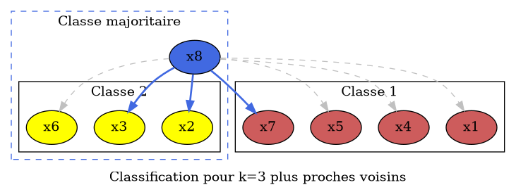

# Introduction

## Qu'est-ce que le data mining ?

Une science à la frontière des mathématiques et de l'informatique (et intelligence artificielle).

> _L'analyse des données est un outil pour dégager de la gangue des données le pur diamant de la véridique nature. (J.P.Benzécri 1973)_

Exemple : extraire de millions de séquençages génétiques des patterns permettant de prédire une maladie.

Un nouveau champ situé au croisement de la statistique et des technologies de l'information (bases de données, intelligence artificielle, apprentissage etc.) dont le but est de découvrir des structures dans de vastes ensembles de données.

> _Data Mining is the nontrivial process of identifying valid, novel, potentially useful, and ultimately understandable patterns in data. (U.M.Fayyad, G.Piatetski-Shapiro)_

> _I shall define Data Mining as the discovery of interesting, unexpected, or valuable structures in large data sets. (D.J.Hand)_

- Le Data Mining analyse des données recueillies à d'autres fins: c'est une analyse secondaire de bases de données, souvent conçues pour la gestion de données individuelles (Kardaun, T.Alanko,1998).
- Le Data Mining ne se préoccupe donc pas de collecter des données de manière efficace (sondages, plans d'expériences) (Hand, 2000).

Le Data Mining est né de :

- L'évolution des SGBD vers l'informatique décisionnelle avec les entrepôts de données (Data Warehouse).
- La constitution d'énormes bases de données : transactions de cartes de crédit, appels téléphoniques, factures de supermarchés: terabytes de données recueillies automatiquement.
- Développement de la Gestion de la Relation Client (CRM)
  + Marketing client au lieu de marketing produit
  + Attrition, satisfaction, etc.
- Recherches en Intelligence artificielle, apprentissage, extraction de connaissances

:::tip
Qu'est-ce qu'un bon algorithme d'apprentissage ?

- Interprétable : la règle de classification est "compréhensible" ;
- Critique : fournit un score en classification, un intervalle en régression ;
- Consistance : convergence vers l'erreur bayésienne : quand $n$ tend vers l'infini, $f_n$ tend vers la [règle de Bayes][wiki-bayes] ;
- Minimax : cette convergence est la plus rapide possible ;
- Non asymptotique : garanties de performance pour $n$ donné ;
- Sans paramètre : Paramétrage automatique ;
- Vitesse : complexité linéaire, possibilité de paralléliser ;
- En ligne : mise à jour séquentielle. 
:::

Il n'y a pas de meilleure méthode !

- Chacune est plus ou moins adaptée au problème considéré, à la nature des données, aux propriétés de la relation entre descripteurs et variable expliquée...
- Il faut apprendre les qualités et les défauts de chaque méthode
- Il faut apprendre à expérimenter pour trouver la plus pertinentes
- L'estimation de la qualité des méthodes est donc centrale (mais pas toujours évidente).

> _Tous les modèles sont faux, certains sont utiles (Box, G.E.P. and Draper, N.R.: Empirical Model-Building and Response Surfaces, p. 424, Wiley, 1987)_

Quelques paradoxes :

- Un bon modèle statistique ne donne pas nécessairement des prédictions précises au niveau individuel.
  + facteurs de risque en épidémiologie
- On peut prévoir sans comprendre:
  + pas besoin d'une théorie du consommateur pour faire du ciblage
  + un modèle n'est qu'un algorithme
- Questions d'éthique et traitements de données personnelles


# Introduction à la statistique

## Vocabulaire

:::strong
- _Donnée statistique_ : observation ou mesure qui sert de base à un raisonnement. C'est le point de départ pour une recherche.
- _Individu_ ou _unité statistique_ : Élément observé ou mesuré : par exemple une personne dans un sondage, un objet dans un comparatif.
- _Population_ : Ensemble des individus observés ou mesurés dans le cadre d'une étude. Peut être infini. Par exemple : l'ensemble des entreprises françaises.
- _Échantillon_ : partie de la population que l'on étudie. L'ensemble de $1000$ entreprises françaises tirées au hasard constitue un échantillon de la population précédente.
- _Caractère_ (ou _variable_) : ce qui est observé ou mesuré sur un individu.
- _Série statistique_ ou _distribution_ : liste de valeurs recueillies sur un caractère observé ou mesuré sur un ensemble d'individus.
- _Variable observée_ : variable concrètement observable chez un individu (ex: salaire).
- _Variable latente_ : variable non observée chez un individu (ex: âge + salaire).
:::

### Échantillon vs population

:::warn
Attention à ne pas confondre échantillon et population !

- L'étude d'un échantillon est une science : la statistique descriptive.
- L'estimation des caractéristiques d'une population depuis un échantillon représentatif est une autre science : la statistique inférentielle.
- Pour faire des statistiques, il faut donc avoir des **connaissances dans le domaine** de l'étude.
:::

### Exercice

:::exo
On souhaite réaliser un sondage à Paris pour connaître le temps de trajet moyen des utilisateurs des transports en commun pour aller travailler.

Pour cela, pour chaque personne sondée, on recueille :

- Son âge et sa catégorie socio-professionnelle (CSP)
- Son temps moyen passé dans les transports en commun

Quels sont :

- Les individus de l'étude ?
- La population de l'étude ?
- L'échantillon de l'étude ?
- Les variables étudiées ?
:::

:::correction

- Les individus sont les personnes sondées.
- La population est l'ensemble des personnes utilisant les transports en commun.
- L'échantillon est l'ensemble des personnes ayant répondu favorablement au sondage.
- On a trois variables : l'âge, la CSP et le temps moyen.

:::

## Types de variables

:::strong
2 types de variables :

- Les variables _quantitatives_ : variables à valeurs numériques, pour lesquelles les opérations arithmétiques ont un sens. Par exemple, un âge, une distance, un volume, etc :
  + _discrètes_ : dans un ensemble dénombrable (on peut compter toutes les valeurs possibles) ;
  + _continues_ : valeurs possibles non connues à l'avance et travail dans les réels ;
- Les variables _qualitatives_ : les valeurs possibles sont codées par des _modalités_ (ou _catégories_). Par exemple, la couleur des yeux, le département, ou tout autre codage où les opérations arithmétiques ne sont pas correctement définies :
  + _ordinale_ : pouvant être ordonné (niveau d'appréciation d'un produit, mention dans un diplôme) ;
  + _nominale_ : aucun ordre (couleur des yeux, ville de naissance).
:::

:::exo
Quel est le type des variables précédentes ?
:::

:::correction

- âge : variable quantitative discrète
- CSP : variable qualitative ordinale
- temps moyen: variable quantitative continue
:::

# Statistique descriptive à une dimension

:::link
Pour plus d'information, voir le [cours zeste de savoir de statistique descriptive à une dimension][zds-stat-desc-1d].
:::

## Moyenne (_mean_)

- Famille d'indicateurs statistiques les plus courants car simples.
- Résume une liste de valeurs numériques en un seul nombre réel.
- Donne une information sur la distribution, aucune sur les individus (répartition, ...)
  + Peu robuste aux valeurs extrêmes.
  + Exemple d'un unique salaire élevé.

:::link
Voir [l'article Wikipedia sur la moyenne][wiki-moyenne].
:::

### Moyenne arithmétique

C'est de très loin la moyenne la plus utilisée : somme des valeurs divisé par nombre de valeurs.

:::strong
$$\mu = \frac{\sum_{i=1}^n{m_i \cdot x_i}}{\sum_{i=1}^n {m_i}}$$
:::

### Autres moyennes

- Il existe d'autres moyennes, par exemple :
  + [Moyenne de Hölder][wiki-moyenne-holder] (ou d'ordre p) : $$\left( \frac{1}{n} \sum_{i=1}^n x_i^p \right)^{\frac{1}{p}}$$
  + Permet de donner plus d'importance aux petites valeurs (p petit) ou aux grandes valeurs (p grand).
- La moyenne numérique est généralisable : barycentre en géométrie, espérance en probabilités, ...
- En absence de précision, le terme seul de _moyenne_ décrit la _moyenne arithmétique_.

:::link
Lien vers [la Moyenne de Hölder][wiki-moyenne-holder].
:::

### Exercice

:::exo
Soit une promotion de 20 étudiants :

- 19 d'entre-eux sont embauchés avec un salaire situé entre $20000$ et $30000$ euros par an
- Un étudiant a un salaire d'un million d'euros par an.

Quelle est la moyenne arithmétique ? Que remarquez-vous ?

Calculer la moyenne d'ordre 2 et la moyenne d'ordre 50. Que remarquez-vous ?
:::

:::correction
**Moyenne arithmétique**

$$m=\frac{19 \times 25 000 + 1 \times 1 000 000}{20}=73750$$

La moyenne arithmétique est très élevée à cause d'une valeur extrême : la moyenne ne représente pas bien l'échantillon.

**Moyenne de Hölder**

Calculons la moyenne de Hölder d'ordre 2 et d'ordre 50, par exemple en Python :
```python
m = ( (1/20)*(19*25000**p + 1000000**p) )**(1/p)
m_2 => 224930
m_50 => 941844
```

La moyenne de Hölder est toujours très influencée par la valeur extrême. On remarque bien que pour $p=50 > 2$ on fait plus ressortir la plus grande valeur que pour $p=2$.

:::

## Médiane (_median_)

La [médiane][wiki-mediane] indique le centre d'une série statistique : c'est la valeur qui partage la moitié inférieure de la moitié supérieure de cette série.

- Donne peu d'information sur la série elle-même.
- Utile pour nuancer d'autres mesures de tendance, comme la moyenne :
  + Assez robuste aux valeurs extrêmes.
  + Reprise de l'exemple précédent.
- Plus complexe que la moyenne car nécessite un tri : coûteux, généralement $\mathcal{O}(n\log{n})$.

### Formule de la médiane

La médiane se définit formellement par :

:::strong
$$Med=\displaystyle \text{argmin}_{\alpha \in \mathbb{R}} \sum_{i=1}^n |\alpha-x_i|$$
:::

où $argmin$ définit la variable pour laquelle une fonction atteint son minimum :

$$f(x^*)=\min_{x \in \mathbb{R}} f(x) \Leftrightarrow x^* = \text{argmin}_{x \in \mathbb{R}} f(x)$$

### Quartiles

Soit une serie statistique numerique de médiane $Med$.

- Premier quartile $Q_1$ : médiane de la série des observations strictement inférieures à $Med$.
- Deuxième quartile $Q_2$ : médiane de la série complète.
- Troisième quartile $Q_3$ : médiane de la série des observations strictement supérieures à $Med$.
- L'écart inter quartile est défini par : $I_q = Q_3 - Q_1$.

Généralisation : déciles, centiles, ...

### Calcul de la médiane

Contrairement à la moyenne, la médiane ne se calcule pas algébriquement : il faut la trouver on ordonnant les valeurs de la série.

Pour une série de $n$ éléments :

1. Ordonner la série
- Si $n$ est impair : l'élément à la position $\frac{n+1}{2}$ est la médiane.
- Si $n$ est pair :
  + Toute valeur entre l'élément à la position $\frac{n}{2}$ et l'élément à la position $\frac{n}{2}+1$ est une médiane.
  + En pratique, on utilise la moyenne arithmétique de ces deux éléments.

:::link
Lien vers [la page Wikipedia sur la médiane][wiki-mediane].
:::

### Exercice

:::exo
Reprenons l'exercice sur la moyenne des salaires d'une promotion :

Soit une promotion de 20 étudiants :

- 19 d'entre-eux sont embauchés avec un salaire situé entre $20000$ et $30000$ euros par an
- Un étudiant a un salaire d'un million d'euros par an.

Quelle est le salaire médian ? Que remarquez-vous ?
:::

:::correction

La médiane est entre les classes $20000$ euros et $30000$ euros donc $Med=25000$ euros.

Le salaire médian est beaucoup plus représentatif de l'échantillon que le salaire moyen.

:::

## Écart-type (_deviation_) et variance

L'[écart-type][wiki-deviation] $\sigma$ (et donc la variance $V=\sigma^2$) représente la dispersion des valeurs dans la distribution.

La variance se calcule comme la moyenne des carrés des écarts à la moyenne :

- L'écart-type est donc la moyenne des écarts.
- On peut le voir comme la "distance" des valeurs à la moyenne.
- Donne une indication sur l'homogénéité de la distribution.

:::strong
$$\sigma=\sqrt{V}$$

$$V = \frac{1}{n}\sum_{i=1}^n \left(x_i - \overline{x}\right)^2$$
:::


<div class="caption">Deux exemples de distribution ayant la même moyenne mais un écart-type différent. Source : https://upload.wikimedia.org/wikipedia/commons/f/f9/Comparison_standard_deviations.svg (domaine public).</div>

### En programmation

:::warn
Attention : l'écart-type calculé directement avec la formule mathématique peut être [incorrect en programmation][deviation-computing-error] à cause d'arrondis, notamment pour des valeurs faibles (entre 0 et 1). 

Il peut être utile d'utiliser [d'autres algorithmes éprouvés][deviation-computing-solution] pour ce besoin.
:::

### Avantages et inconvénients

:::tip
+  Mesures particulièrement représentatives de la réalité lorsque la distribution est normale.
+  Tient compte de toutes les valeurs de la distribution donc représentent bien sa dispersion.
+  Utiles pour comparer la dispersion d'une variable d'une même population à des temps différents ou de populations semblables.
- Mesures affectées par les valeurs extrêmes
- Difficultés d'interprétation liées au fait que la valeur de l'écart-type varie selon les valeur de la variable.
  * Un grand écart-type n'est pas synonyme de grande dispersion (dépend des valeurs).
:::

:::link
Voir [la page Wikipedia sur l'écart-type][wiki-deviation].
:::

### Exercice

:::exo
On donne ci-dessous les notes de trois groupes d'étudiants :

$$G_1=\{10,12,11,13,14,12,7,15\} \qquad G_2=\{12,17,4,8,19,11,12,9\} \qquad G_3=\{8,7,12,10,14,10,8,3,8,7\}$$

Quelle est le groupe le plus hétérogène ? Que remarquez-vous ?
:::

:::correction

On commence par calculer les moyenne de chaque groupe, que l'on notera $\bar{G1}, \bar{G2}$ et $\bar{G3}$ :

$$\bar{G1}=\frac{10+12+11+13+14+12+7+15}{8}=11,75 \qquad \bar{G2}=11,5 \qquad \bar{G3}=8,7$$

Calculons la variance de $G1$ :

$$v_1=\frac{(10-11,75)^2+(12-11,75)^2+(11-11,75)^2+(13-11,75)^2+(14-11,75)^2+(12-11,75)^2+(7-11,75)^2+(15-11,75)^2}{8}$$

$$v_1=\frac{1,75^2+0,25^2+0.75^2+2,25^2+0,25^2+4,75^2+3,25^2}{8} \approx 6.214 \qquad v_2=23.143 \qquad v_3=9.122$$

On remarque que $v_2 > v_3 > v_1$, le groupe le plus hétérogène est donc le groupe $G2$.

On remarque que les groupes $G1$ et $G2$ ont des moyennes assez proches, et pourtant, leur variance est complètement différente. La moyenne n'est donc pas suffisante : on effectuera quasi systématiquement un calcul de variance ou d'écart-type.

:::

## Statistiques à deux dimensions

### Centre de gravité

Définition : Le centre de gravité du nuage représentant les deux séries $x_i$ et $y_i$ de moyennes $\bar{x}$ et $\bar{y}$ respectivement est le point $G = (\bar{x}, \bar{y})$ dont les coordonnées sont les moyennes des deux séries.

On peut aussi relier l'étendue du nuage aux deux écart-type $\sigma(x)$ et $\sigma(y)$ des séries $x$ et $y$. Le premier est lié à l'étendue horizontale (dans le sens de l'axe des $x$), et le second à l'étendue verticale (dans le sens de l'axe des $y$).

### Covariance de deux séries

Si tous les points du nuage étaient pratiquement situés sur une même droite (nuage de forme allongée), le nuage pourrait être très étendu, à la fois en $y$ et en $y$ sans pour autant être étendu en surface dans le plan.

Pour mesurer _l'étendue en surface_ du nuage, on calcule la _covariance_ des deux séries, c'est-à-dire la moyenne des produits des écarts à la moyenne :

:::strong
$$Cov(x, y) = \frac{1}{n}\sum_{i=1}^n(x_i - \bar{x})(y_i - \bar{y})$$
:::

À noter que si $y = x, Cov(x, x) = Var(x)$.

Le signe de la covariance renseigne sur le fait que les deux séries varient dans le même sens ou en sens opposé : une covariance positive indique que l'une augmente quand l'autre augmente ou diminue quand l'autre diminue.

Par contre la valeur absolue de la covariance (le fait qu'elle ait une valeur petite ou grande) fournit peu d'informations pertinentes car elle dépend des unités dans lesquelles ont été exprimées les deux séries $x$ et $y$.

### Coefficient de corrélation linéaire

Pour obtenir un équivalent de la covariance qui soit indépendant des unités dans lesquelles ont été exprimé les deux séries de mesures il convient de calculer le coefficient de corrélation linéaire :

:::strong
$$\rho(x,y)=\frac{Cov(x,y)}{\sqrt{Var(x)Var(y)}}$$
:::

On peut montrer que sa valeur est toujours comprise entre $-1$ et $+1$.

On dit que les deux séries sont faiblement corrélées lorsque $\rho(x, y)$ est proche de 0, et dans ce cas le nuage a une forme très dispersée. Au contraire si $\rho(x, y)$ est proche de $-1$ ou $+1$, les deux séries sont dites fortement corrélées (positivement si $\rho(x, y) > 0$ et négativement si $\rho(x, y) < 0$) et dans ce cas le nuage est regroupé le long d'une droite.

:::tip
On utilise souvent plutôt le carré de ce terme pour augmenter sa dispersion vers 0 ou 1.
:::

Ce coefficient sera très utile lors des régressions linéaires.

:::exo
| Nombre de caisses ouvertes (x) :       | 3  | 4  | 5  | 6    | 8    | 10   | 12   |
|----------------------------------------| ---| ---| ---| -----| -----| -----| -----|
| Temps moyen d'attente en minutes (y) : | 16 | 15 | 16 | 14.9 | 16.6 | 14.7 | 14.8 |

Dans cet exemple, y a-t-il une relation directe entre le nombre de caisses ouvertes et le temps moyen d'attente ?
:::

:::correction
1. Commençons par calculer le centre de gravité du nuage de points $\{x;y\}$ : $G=(6.8 ; 15.4)$.
2. Calculons les variances de $X$ et $Y$ :
  + $Var(X) = 9.27$
  + $Var(Y) = 0.49$
3. Calculons la covariance de $X$ et $Y$ : $Cov(X,Y)$ = -0.97$
4. On en déduit la coefficient de corrélation : $\rho(X,Y)=-0.45$.

Le coefficient de corrélation linéaire est assez éloigné de 1 : $R^2=-0.20$. Il n'y a pas de lien direct entre le nombre de caisses ouvertes et le temps moyen d'attente dans cet exemple.

Exemple de calcul en `Python` :

```python
import numpy
x=[3,4,5,6,8,10,12]
y=[16, 15, 16, 14.9, 16.6, 14.7, 14.8]
R2=( numpy.cov(x,y)[0][1] / numpy.sqrt(numpy.var(x) * numpy.var(y)) )**2

import matplotlib.pyplot as plt
#plt.plot(x,y) # ligne
plt.scatter(x,y) # points
plt.show()
```


<div class="caption">Le nuage de points</div>

:::

## Lois de probabilité

### Rappels et notations

:::tip
- $P(Y=1)$ est la probabilité a priori pour que $Y=1$. Pour simplifier, on note parfois : $p(1)$.
- $p(X|1)$ est la distribution conditionnelle des $X$ sachant la valeur prise par $Y$.
- $\sum_{i=1}^n p_i = 1$
- La probabilité a posteriori d'obtenir la modalité $1$ de $Y$ sachant la valeur prise par $X$ est notée $p(1|X)$.
- Si $X$ est une variable aléatoire **réelle**, la fonction de répartition de $X$ est la fonction $F_X(t) = \mathbb P(X\leq t)$.
- Si l'événement $A$ se produit $N_A$ fois sur $N$ observations, la fréquence de l'événement $A$ est : $\frac{N_A}{N}$.
:::

### Espérance

L'espérance d'une variable aléatoire $X$ correspond à la moyenne des valeurs possibles de $X$ pondérées par les probabilités associées à ces valeurs et est définie par :

:::strong
$$\bar{X} = \sum_i P_i x_i$$
:::

ou pour une variable continue à densité :

$$\mathbb{E}[X] = \int_{-\infty}^\infty x f(x) \mathrm{d}x$$

C'est intuitivement la valeur que l'on s'attend à trouver (en moyenne...).

### Théorème de Bayes

:::strong
$$P(A|B) = \frac{P(B|A)P(A)}{P(B)}$$
:::

:::correction
Démonstration par $P(A\cap B) = P(A) P(B|A) = P(B) P(A|B)$
:::

:::link
Voir : [Théorème de Bayes][wiki-bayes].
:::

### Loi binomiale

Exemple :

- QCM de 3 questions et 4 réponses dont une seule correcte par question.
- Population très nombreuse.
- Variable $X$ : nombre de réponses correctes données par le sujet.
- Si les sujets répondent au hasard, quelle est la fréquence de $X = 2$ ?

#### Combinaisons

Le nombre de manières de choisir $k$ éléments parmi $n$ éléments est appelé _nombre de combinaisons de $n$ éléments pris $k$ à $k$_ et est défini par le coefficient binomial :

$$\binom{n}{k} = C_n^k = \frac{n!}{k!(n-k)!}$$

Avec factorielle $n$ : $n! = 1 \cdot 2 \cdot ... \cdot n$.

#### Loi de Bernoulli

Une loi de Bernoulli est une variable statistique $X$ à 2 modalités : 1 ou 0 (ou succès/échec).

Caractéristiques : $\mu = p, \sigma^2 = p(1-p)$ avec $p$ la fréquence de la modalité "succès".

#### Loi binomiale

La variable $X$ : "nombre de succès observés lorsqu'on répète $n$ (entier) fois, de façon indépendante, une expérience de Bernoulli de paramètre $p$" suit une _loi binomiale de paramètres $n$ et $p$_ :

- ses modalités sont $0, 1, ..., n$.
- La fréquence de la modalité $k$ est donnée par : $f_k = \mathbb P(X=k) = \binom{n}{k} p^k (1-p)^{n-k}$.

Caractéristiques : $\mu = np, \sigma^2 = np(1-p)$


<div class="caption">Exemples de distributions binomiales. (Crédits et sources : https://commons.wikimedia.org/wiki/File:Binomial_Distribution.PNG)</div>

### Loi normale

Loi théorique d'une variable _continue_ approchant bien les distributions expérimentales dans lesquelles la dispersion de la variable résulte d'effets nombreux, additifs, indépendants et de même grandeur.

:::link
Voir la [page Wikipedia sur la loi normale][wiki-loi-normale].
:::


<div class="caption">Exemples de distributions normales. (Crédits et sources : https://commons.wikimedia.org/wiki/File:Normal_Distribution_PDF.svg)</div>

#### Cas particulier

La loi normale centrée : $\mu = 0$ et réduite : $\sigma = 1$.

Sa fonction de densité est : $f(x) = \frac{1}{\sqrt{2\pi}}e^{-\frac{x^2}{2}}$.

#### Cas général

Une variable statistique $X$ de moyenne $\mu$ et d'écart-type $\sigma$ suit la loi normale $\mathcal N(\mu,\sigma)$ si : $Z = \frac{X - \mu}{\sigma}$ suit une loi normale centrée réduite : $\mathcal N(0,1)$.

#### Théorème fondamental : convergence en loi normale

Cette loi est très utile car la loi d'une somme de variables aléatoires indépendantes et identiquement distribuées converge généralement vers une loi normale.

## Tests statistiques

### Hypothèse nulle

- En statistiques l'hypothèse nulle ($H_0$) est une hypothèse postulant l'égalité entre des paramètres statistiques (par exemple la moyenne ou la variance) de deux échantillons dont elle fait l'hypothèse qu'ils sont pris sur des populations équivalentes.
- Hypothèse vraie par défaut (car prouver une égalité stricte a une probabilité de 0 donc n'est pas réaliste) : en traitement des données on l'utilisera pour définir un risque au-delà duquel on rejettera l'hypothèse faite sur le modèle (indépendance, etc...).
- Vision statistique d'une démonstration par l'absurde

#### Exemple

Si l'on veut tester l'égalité des tailles moyennes chez les femmes (groupe 1) et les hommes (groupe 2) :

$$ H_0 : \mu_1 = \mu_2 $$

Où :

- $H_0$ : hypothèse nulle
- $\mu_1$ = moyenne population 1
- $\mu_2$ = moyenne population 2

### p-valeur

Dans un test statistique, la _p-valeur_ est la probabilité pour un modèle statistique donné sous l'hypothèse nulle d'obtenir une valeur au moins aussi extrême que celle observée.

En termes statistiques, la p-valeur s'interprète comme la probabilité d'un résultat au moins aussi "extrême" que le résultat observé, sachant l'hypothèse nulle:

:::strong
$$p = \mathbb P(x|H_0)$$
:::

Le résultat d'une p-valeur "improbable" (à définir) implique que l'expérience observée ne suit pas l'hypothèse nulle. Par exemple, imaginons que l'on connaisse la loi répartissant le poids des individus d'une population en surpoids et qu'on teste un traitement amincissant sur un groupe de personnes. On évalue le poids moyen du groupe après le traitement et on vérifie avec la loi initiale si le résultat est probable ou improbable. S'il est improbable, le traitement est efficace. 

On utilise généralement les seuils suivants :

- $p\leq 0.01$ : très forte présomption contre l'hypothèse nulle ;
- $0.01 < p\leq 0.05$ : forte présomption contre l'hypothèse nulle ;
- $0.05 < p\leq 0.1$ : faible présomption contre l'hypothèse nulle ;
- $0.1 < p$ : pas de présomption contre l'hypothèse nulle.


<div class="caption">Illustration de la p-valeur</div>

$X$ désigne la loi de probabilité de la statistique de test et $z$ la valeur calculée de la statistique de test. [Source et crédits : Wikimedia](https://commons.wikimedia.org/wiki/File:Valeur-p.jpg)_.

:::warn
La p-valeur interprète $\mathbb P(x|H_0)$ or en faisant un test statistique, on cherche à savoir quelle est la probabilité que $H_0$ soit vraie sachant les données donc $\mathbb P(H_0|x)$ ! D'après le théorême de Bayes : $\mathbb P(x|H_0) = \frac{\mathbb P(H_0 | x) \mathbb P(x)}{\mathbb P(H_0)}$
:::

### Test de normalité

- Ces tests permettent de vérifier si des données réelles suivent une [loi normale][wiki-loi-normale] (notée $\mathcal N$).
- Très utiles en statistiques : de nombreux tests supposent la normalité des distributions pour être applicables.
- Exemple : application aux résidus d'un modèle de régression linéaire - ces résidus ne peuvent pas être utilisés dans des tests qui font intervenir des hypothèses de normalité (test du $\chi^2$, ...). Si les résidus ne sont pas normalement distribués, cela signifie que la variable dépendante ou au moins une variable explicative pourrait avoir une fonction de répartition erronée.


<div class="caption">Exemples de distributions suivant une loi normale (à gauche) et n'en suivant pas (à droite). Source et crédits : https://commons.wikimedia.org/wiki/File:Normality_histogram.png</div>

### Test du Khi-2

C'est un test statistique pour rejetter une hypothèse d'indépendance entre variables.

$H_0$ : $X$ suit une [loi du $\chi^2$][wiki-loi-chi-2] à $k$ degrés de liberté si :

:::strong
$$X=\sum_{i=1}^k X_i^2$$
:::

où $X_1, ..., X_k$ sont $k$ variables aléatoires indépendantes qui suivent la loi normale de moyenne 0 et d'écart-type 1 : $\mathcal N(0,1)$.

#### Principe

- On répartie les données en $J$ classes ;
- On calcule la statistique de test $T$ (voir ci-dessous) ;
- On utilise une [table de valeurs des quantiles][wiki-chi-2-table] du $\chi^2$ par degré de liberté.
- On rejette $H_0$ pour une _p-valeur_ choisie (appelé niveau de risque $\alpha$), généralement : $p\leq 0.05$.

:::link
[Table de valeurs des quantiles][wiki-chi-2-table]
:::

#### Exemple d'une loi multinomiale

On définit alors la statistique du $\chi_2$ par :

:::strong
$$T = \sum_{j=1}^J \frac{(N \hat{p}_j - N p_j)^2}{N p_j}$$
:::

où :

- $v_1, ..., v_J$ sont les $J$ valeurs possibles de $Y$ ;
- $y_1, ..., y_N$ sont les $N$ observations de $Y$ ;
- $p_j$ est la probabilité théorique que $Y$ prenne la valeur $v_j$ ;
- $\hat{p}_j$ est la probabilité empirique (mesurée) que $Y$ prenne la valeur $v_j$ ;
- $N p_j = \sum_{i=1}^N 1_{y_i = v_j}$ (idem pour $N \hat{p}_j$ avec la probabilité mesurée).

On démontre que sous $H_0$, $T$ converge vers une loi du $\chi^2$ à $(J-1)$ degrés de liberté.

Ainsi, pour un test de niveau $\alpha$, on en déduit le rejet de $H_0$ si $T$ est plus grande que le quantile $1 - \alpha$ de la loi à $(J - 1)$ degrés de liberté.

On généralise ce cas particulier à une variable aléatoire $Y$ prenant un nombre dénombrable de valeurs ou à une variable aléatoire continue, en découpant l'ensemble des valeurs que peut prendre $Y$ en $J$ classes distinctes.

#### Exercice

:::exo
On souhaite tester l'hypothèse selon laquelle un dé à six faces n'est pas truqué, avec un risque $\alpha = 0.05$.

Pour cela, le dé est lancé 600 fois de suite. S'il est équilibré, on s'attend que sur ces 600 jets, chaque chiffre tombe 100 fois.

Supposons que notre expérience donne les résultats suivants :

| numéro tiré | 1  | 2   | 3   | 4  | 5   | 6  |
|-------------|----|-----|-----|----|-----|----|
| effectifs   | 88 | 109 | 107 | 94 | 105 | 97 |

c'est-à-dire nous avons obtenu 88 fois le chiffre 1, 109 fois le chiffre 2, etc.


1. Quelle est l'hypothèse nulle $H_0$ ?
2. Combien y a-t-il de degrés de liberté ?
3. En considérant l'hypothèse nulle vraie, définir la variable statistique du $\chi^2$ : $T$.
4. Peut-on considérer que le dé est truqué avec un risque de 5% ?
5. Même question pour le nouveau tirage suivant :

| numéro tiré | 1  | 2   | 3  | 4  | 5   | 6  |
|-------------|----|-----|----|----|-----|----|
| effectifs   | 89 | 131 | 93 | 92 | 104 | 91 |

:::

:::correction

1. L'hypothèse que l'on souhaite rejeter (qu'on appelle hypothèse nulle et qu'on note $H_0$) est donc ici : "Le dé est équilibré". 
2. Le nombre de degrés de liberté est de $6 - 1 = 5$. En effet, $88 + 109 + 107 + 94 + 105 + 97 = 600$ et si l'on connaît par exemple les nombres de fois où l'on obtient les chiffres 1 à 5, on connaît le nombre de fois où l'on obtient le chiffre 6 : $600 - (88 + 109 + 107 + 94 + 105) = 97$. 
3. En considérant l'hypothèse nulle vraie, la variable T définie précédemment vaut : ${\frac {(88-100)^{2}}{100}}+{\frac {(109-100)^{2}}{100}}+{\frac {(107-100)^{2}}{100}}+{\frac {(94-100)^{2}}{100}}+{\frac {(105-100)^{2}}{100}}+{\frac {(97-100)^{2}}{100}}=3.44$
4. La statistique T suit la loi du $\chi^2$ à cinq degrés de liberté. Cette loi donne la valeur en deçà de laquelle on considère le tirage comme conforme avec un risque $\alpha = 0.05 : P(T < 11.07) = 0.95$. Puisque $3.44 < 11.07$, on ne peut pas rejeter l'hypothèse nulle : ces données statistiques ne permettent pas de considérer que le dé est truqué.
5. $T ={\frac {(89-100)^{2}}{100}}+{\frac {(131-100)^{2}}{100}}+{\frac {(93-100)^{2}}{100}}+{\frac {(92-100)^{2}}{100}}+{\frac {(104-100)^{2}}{100}}+{\frac {(91-100)^{2}}{100}}=12.92 > 11.07$ : on peut rejeter l'hypothèse nulle : le dé est truqué. 

:::

## L'apprentissage automatique

### Présentation

- Méthodes qui permettent à une machine d'évoluer grâce à un processus d'apprentissage.
- Permet d'accomplir des tâches qu'il est difficile ou impossible de remplir par des moyens algorithmiques plus classiques.
- Objectif : extraire et exploiter automatiquement l'information présente dans un jeu de données.

### Apprentissage supervisé vs non-supervisé

:::tip
Les algorithmes d'apprentissage peuvent se catégoriser selon le type d'apprentissage qu'ils emploient :

- L'apprentissage **supervisé**
  + Un expert est employé pour étiqueter correctement des exemples.
  + La machine doit trouver ou approximer la fonction qui permet d'affecter la bonne étiquette aux données.
- L'apprentissage **non supervisé**
  + Aucun expert n'est disponible.
  + La machine doit découvrir par elle-même la structure des données.
- L'apprentissage **par renforcement** (hors programme)
  + La machine apprend à se rapprocher d'une stratégie comportementale optimale par des interactions répétitives avec l'environnement.
  + L'apprentissage se fait sans supervision.
  + Repose sur le principe d'essai/erreur.
  + Utile quand l'environnement évolue.
:::

# Apprentissage supervisé

À partir d'un échantillon d'apprentissage $D_n = (x_1, y_1), ... ,(x_n, y_n)$ , inférer la relation entre $x$ et $y$.

:::tip
Exemples d'utilisation :

- Détecteur de spam
- Risque de crédit
- Prédiction des pics d'ozone
- Aide au diagnostic médical (ex : cancer du sein)
- Aide au pilotage
- Moteurs de recommandation, apprentissage sur les graphes
:::

Cadre classique :

- Données : échantillon d'apprentissage $(x_k, y_k)_{1\leq k\leq n}$ constitué d'observations que l'on suppose représentatives et sans lien entre elles.
- Objectif : prédire les valeurs de $y$ associées à chaque valeur possible de $x \in X$.
- _Classification_ : $Y$ discret (on peut dénombrer l'ensemble des valeurs: variables _qualitatives_). Pour chaque valeur de $x \in X$ on prédit la classe la plus souvent associée.
  + Classification _non paramétrique_ (_classification hiérarchique_, _méthode des centres mobiles_) : ne considère qu'une seule hypothèse - plus deux individus sont proches, plus ils ont de chances de faire partie de la même classe.
  + _Classification probabiliste_ : utilise une hypothèse sur la distribution des individus à classifier (par exemple, suivre une _loi normale_). On détermine alors quels sont les paramètres des lois (_moyenne_, _variance_) et à quelle classe les individus ont le plus de chances d'appartenir.
- _Régression_ : Méthodes d'analyse statistique permettant d'approcher une variable à partir d'autres qui lui sont corrélées. Généralement $Y$ est continue ou est une fonction (variables _quantitatives_).
- Règle de classification : à partir de l'échantillon d'apprentissage, construire $f_n : X \rightarrow Y$ associant à chaque entrée possible $x$ la classe $y$ prédite pour elle.

```plantuml
@startdot

digraph supervised {

node [style="filled"]
entrées [color="indianred"]

subgraph clusterSuperviseur {
node [fillcolor="lightskyblue"]
edge [color="royalblue"]
label = "Superviseur"
superviseur -> "sortie désirée" -> erreur
}

subgraph {
node [fillcolor="aquamarine2"]
edge [color="aquamarine4"]
réseau -> "sortie obtenue" -> erreur
}

entrées -> superviseur, réseau
erreur -> réseau [style="dashed", color="royalblue"]

label = "Schéma d'apprentissage supervisé"

@enddot
}
```

## Méthodes de régression

On considère une population d'individus (êtres humains, animaux, pays, biens de consommation, ...) qui peuvent être décrits selon plusieurs critères appelés variables. Il peut s'agir de variables _quantitatives_ (grandeurs numériques telles que la taille, l'âge, le prix, un pourcentage, ...) ou _qualitatives_ (sexe, catégorie socio-professionnelle, saison, type de produit, ...)

Certaines variables peuvent être plus difficiles à mesurer que d'autres, pour des raisons techniques, des raisons d'accès (données publiques contre données privées), ou encore du fait d'un délai important entre la mise en place d'une expérience et son aboutissement. Il arrive donc que l'on souhaite estimer ces variables (dites _expliquées_) à partir des données plus faciles à obtenir (dites _explicatives_).

La construction de la régression repose d'une part sur une modélisation des variables statistiques par des variables aléatoires (réelles ou non), d'autre part sur un recueil de données croisées, c'est-à-dire que pour un même échantillon de population, on dispose d'observations des différentes variables mesurées avec une imprécision éventuelle.

La régression consiste alors à formuler un indicateur sur les valeurs de la variable expliquée dépendant uniquement des valeurs des variables explicatives. Cet indicateur pourra ensuite être utilisé sur une population pour laquelle on ne connait que les valeurs des variables explicatives, afin d'estimer les valeurs de la variable expliquée.

On distingue essentiellement deux cas selon la nature de la variable expliquée, représentée ici par une variable aléatoire $Y$. Les variables explicatives seront notées $X_1, ... , X_n$.

### Cas quantitatif

Pour une variable expliquée quantitative, c'est-à-dire lorsque $Y$ est une variable aléatoire réelle, la fonction de régression est définie par un indicateur de la loi de $Y$ conditionnellement aux valeurs des autres variables. Il s'agit le plus souvent de l'espérance conditionnelle $f(x_{1}, ... ,x_{n})=\mathbb {E} (Y|X_{i}=x_{i})$, mais on peut aussi considérer d'autres indicateurs de distribution conditionnelle comme la médiane, la variance...

C'est donc une fonction numérique, dont les arguments sont des valeurs possibles des variables explicatives.

Cependant, la définition probabiliste ne suffit pas en général pour décrire la construction de l'indicateur à partir d'un jeu de données statistiques. En effet, les observations ne fournissent pas toujours toutes les combinaisons de modalités dans le cas de variables explicatives discrètes, et ne peuvent être exhaustives dans le cas de variables explicatives continues. La régression s'appuie alors sur un modèle de fonction avec un ou plusieurs paramètres, par exemple une fonction affine dans le cas de la régression linéaire ou multilinéaire.

### Cas qualitatif

Pour une variable expliquée qualitative, la régression s'apparente aux problèmes de classification, au sens où l'on cherche à déterminer une modalité à partir des valeurs des autres variables.

La fonction de régression correspond dans ce cas à un partage de l'espace des valeurs des variables explicatives, par des méthodes géométriques ou par _régression logistique_.

### Principaux modèles de régression

- On parle de _modèle linéaire_ lorsque les paramètres apparaissent comme les coefficients d'une combinaison linéaire de fonctions de référence, quitte à passer par un changement de variable.
- Si la variable expliquée est une variable aléatoire binomiale (0 ou 1), il est courant d'utiliser une _régression logistique_.

### Régression linéaire

Le but de la régression linéaire simple (respectivement multiple) est d'expliquer une variable $Y$ à l'aide d'une variable $X$ (respectivement plusieurs variables $X_1, ... , X_q$).

La variable $Y$ est appelée variable _à expliquer_ ou variable _dépendante_ et les variables $X_j (j=1, ... ,q)$ sont appelées variables _explicatives_ ou variables _indépendantes_. 

:::strong
Le but est donc de trouver une fonction $f$ telle que : $y_i \approx f(x_i)$.
:::

Exemple simple : ajustement affine : $y = ax + b$.

- L'existence d'une relation entre $X$ et $Y$ n'implique pas nécessairement une relation de causalité entre elles !
- Exemple : corrélation chocolat / prix Nobel : <https://www.bbc.com/news/magazine-20356613>.
- Autres exemples étranges : <https://www.tylervigen.com/spurious-correlations>.

#### Exemple

_Étude de la relation entre la tension artérielle et l'âge d'un individu_.

Les données sont extraites de _Bouyer et al. (1995) Epidémiologie. Principes et méthodes quantitatives, Les éditions INSERM._

1. Objectif
  - On souhaite savoir si, de façon générale, l'âge a une influence sur la tension artérielle et sous quelle forme cette influence peut être exprimée.
  - Le but est d'expliquer au mieux comment la tension artérielle varie en fonction de l'âge et éventuellement de prédire la tension à partir de l'âge.
2. Population et variables étudiées 
  - Population générale d'individus sur laquelle on définit 2 variables :
  - La variable $Y$ : variable tension - c'est la variable à expliquer (variable à régresser)
  - La variable $X$ : variable âge - c'est la variable explicative (variable régresseur)
3. Échantillon aléatoire d'individus
  - Pour l'étude, on doit faire des mesures sur $n$ individus tirés au sort dans la population.
  - On observe deux échantillons appariés de $X$ et $Y$ de taille $n$ : $(x_1, y_1), ... , (x_i, y_i), ... , (x_n, y_n)$ où $x_i$ et $y_i$ sont les valeurs de $X$ et $Y$ observées sur le $i^{eme}$ individu tiré au sort.
4. Modèle exprimant la relation entre $Y$ et $X$
  - On cherche à exprimer la relation entre la variable tension et la variable âge à l'aide d'une fonction mathématique du type $y = f(x)$.
  - Graphiquement cela revient à représenter cette relation à l'aide d'une courbe (graphe de la fonction).
5. Choix du modèle
  - Quelle fonction mathématique utiliser ?
  - Pour choisir le modèle de relation, on doit faire des observations sur un échantillon d'individus.
  - Les données recueillies sur ces individus sont représentées graphiquement à l'aide d'un nuage de points.
  - Si le nuage a une forme particulière s'apparentant à une courbe mathématique, on choisira la fonction mathématique correspondant à cette courbe.


<div class="caption">Source et crédit : Ana Karina Fermin Rodriguez.</div>
 
La forme étirée et croissante du nuage suggère une relation linéaire entre la tension et l'âge. Le coefficient de corrélation linéaire observé sur l'échantillon est $r = 0, 7868$ assez proche de $1$ : on va modéliser cette relation à l'aide d'une droite.

### Équation générale du modèle de régression linéaire simple

Si la relation était parfaitement linéaire cela se traduirait par des points alignés et l'on pourrait écrire la relation entre $Y$ et $X$ sous la forme :

$$Y = aX + b$$

Connaissant l'âge $x$ d'un individu, l'équation permettrait de déterminer exactement la tension artérielle $y$.

Or la relation observée sur l'échantillon n'est pas exacte : le nuage est étiré mais les points ne sont pas alignés.
De plus, on voit que des personnes du même âge ont des tensions artérielles différentes.

Ces différences peuvent être expliquées par d'autres variables ayant une influence sur la variable tension et qui ne sont pas prises en compte dans le modèle, ou encore par des erreurs de mesures.

Pour rendre compte de cette situation, on écrit la relation entre la tension et l'âge sous la forme générale suivante : _droite + erreur_ :

:::strong
$$Y_i = aX_i + b + \epsilon_i, i=1..n$$
:::

Pour un âge $x$ donné, la tension d'un individu est la somme de deux termes :

- $ax+b$ entièrement déterminé par l'âge ;
- le terme d'erreur $\epsilon$ (variable aléatoire) qui varie de façon aléatoire d'un individu à l'autre :
  + Synthétise toutes les variables influant sur la tension et qui ne sont pas prises en compte.
  + Les erreurs doivent être des variables indépendantes, de même loi, centrées et de même variance.
  + $\epsilon_i$ est l'observation de cette variable : représente l'erreur commise (l'écart de valeur entre $Y$ observée et le modèle).
  
La variable $Y$ est donc aléatoire. La variable $X$ est supposée non aléatoire, on la mesure sans erreur sur chaque individu.

Le modèle de régression linéaire est souvent estimé par la méthode des moindres carrés mais il existe aussi de nombreuses autres méthodes pour estimer ce modèle (par exemple si les termes d'erreurs ne sont pas indépendants).

On peut par exemple estimer le modèle par [maximum de vraisemblance][wiki-max-vraisemblance] ou encore par [inférence bayésienne][wiki-inference-bayesienne].

### Méthode des moindres carrés - Khi-deux

La méthode des moindres carrés permet de comparer des données expérimentales (incluant des erreurs de mesure) à un modèle mathématique censé décrire ces données.

Le modèle théorique est une famille de fonctions $f(x;\theta)$ d'une ou plusieurs variables muettes $x$, indexées par un ou plusieurs paramètres $\theta$ inconnus.

La méthode des moindres carrés permet de sélectionner parmi ces fonctions celle qui reproduit le mieux les données expérimentales.


<div class="caption">Source et crédits : Nicolas Regnault https://commons.wikimedia.org/wiki/File:Moindres_carres_introduction.png</div>


L'idée est de minimiser les écarts quadratiques (i.e. au carré) entre l'observation et le modèle, ainsi pour $N$ observations on minimise :

$$S(\theta) = \sum_{i=1}^N \left(y_i - f(x_i;\theta)\right)^2$$

#### Cas de la régression linéaire

Lorsque l'on connaît l'écart-type $\sigma_i$ des erreurs de chaque mesure $y_i$ et si les erreurs sont distribuées selon une [loi normale][wiki-loi-normale], on utilise cet écart-type pour pondérer la contribution de la mesure : une mesure aura d'autant plus de poids que son incertitude sera faible.

On retrouve alors un test du $\chi^2$ :

$$\chi^2(\theta) = \sum_{i=1}^N \left(\frac{y_i - f(x_i;\theta)}{\sigma_i}\right)^2$$

Dans le cas d'une régression linéaire simple, on vérifie que cette valeur est minimale pour $grad(\chi^2) = 0$ et par développement, pour un modèle $Y=aX+b+\epsilon$ et si $Var(X)\neq 0$ :

:::strong
$$a = \frac{Cov(X,Y)}{Var(X)}$$

$$b = \bar{Y} - a \bar{X}$$
:::

:::warn
Attention : dans la pratique, on ne connaît jamais $a$ et $b$ (valeurs exactes du modèle) ! 

On calcule donc : $\hat{a}$ et $\hat{b}$, valeurs estimées de $a$ et $b$ dans les conditions de l'expérience.

Ces valeurs ne sont donc pas exactes - nous verrons dans la suite du cours comment vérifier leur véracité.
:::

#### Cas général

:::link
Pour un calcul de $grad(\chi^2) = 0$ dans le cas général, voir la [page Wikipedia de la méthode des moindres carrés][wiki-moindres-carres].
:::

#### Limites

Attention, la méthode des moindres carrés gère mal les valeurs aberrantes. Plusieurs méthodes existent pour éviter une influence trop forte de ces valeurs :

- Modifier le $\chi^2$ en ne calculant plus le carré des résidus mais une fonction bien choisie de ceux-ci (méthodes des M-estimateurs) ;
- Remplacer la somme par la médiane, qui contrairement à la moyenne est un estimateur robuste (méthode des moindres carrés médians).

:::link
La méthode des moindres carrés est un cas particulier du [maximum de vraisemblance][wiki-max-vraisemblance] - cette méthode est utile notamment si les résidus ne sont pas indépendants.
:::

#### Exemple

Reprenons notre exemple pour réaliser une régression linéaire simple.

On obtient : $\hat{a} = 1.5771$ et $\hat{b} = 60.3928$.


<div class="caption">Source et crédit : Ana Karina Fermin Rodriguez.</div>

:::exo
Quelle est la signification des paramètres $a$ et $b$ ?
:::

:::correction

- $a$ est la pente de la droite : une augmentation de l'âge d'un an se traduit par une augmentation ($a > 0$) de la tension estimée à $1,5771$.
- $b$ est l'ordonnée à l'origine : attention à ne pas extrapoler la droite au delà des limites du domaine observé de $X$. Ici, la droite a été ajustée pour des âges compris entre 40 et 66 ans. Le coefficient fixe uniquement la hauteur de la droite.

:::

### Qualité de la prédiction

Une fois la prédiction réalisée, on s'intéresse à la qualité de l'estimation.

Nous allons calculer la qualité de la régression $Y = \hat{a} X + \hat{b}$ pour les données de l'expérience.

En réalité, si l'on réalise plusieurs fois cette expérience, on trouvera d'autres valeurs de $\hat{a}$ et $\hat{b}$ (les vraies valeurs de $a$ et $b$ ne seront jamais connues).

Pour évaluer la qualité de la prédiction, il faudrait donc également calculer :

- l'intervalle de confiance de $\hat{a}$.
- l'intervalle de confiance de $\hat{b}$.
- l'intervalle de confiance de $\hat{y_i}$.
- vérifier les conditions initiales sur les résidus : hypothèse de normalité, ...

#### Qualité de l'ajustement

La première étape consiste à calculer la variance expliquée par la régression, c'est-à-dire la variation des valeurs ajustées autour de la moyenne $\bar{y}$ :

$$SSE = \sum_{i=1}^N (\hat{y}_i - \bar{y})^2$$

#### Résidus (_SSR_)

La seconde étape consiste à calculer la variance résiduelle ou non expliquée, c'est-à-dire la variation qui n'est pas expliquée par le modèle de régression :

1. Calculer la prédiction : $\hat{y_i} = a x_i + b$
2. La valeur $e_i = y_i - \hat{y_i}$ s'appelle le résidu : c'est l'écart entre la prédiction et l'observation (et donc, une approximation de l'erreur $\epsilon$).
3. On calcule la somme des carrés des résidus : $SSR = \sum e_i^2$.
4. On peut alors estimer sans biais $\sigma^2$ (écart-type des erreurs) par : $\hat{\sigma}^2 = \frac{SSR}{n-2}$.

$$SSR = \sum_{i=1}^N (y_i - \hat{y_i})^2$$

:::tip
Pourquoi utiliser un estimateur sans biais pour $\sigma^2$ : $\hat{\sigma}^2 = \frac{SSR}{n-2}$ et non $\frac{1}{n}SSR$ ?.

Ce biais provient du fait que nos calculs utilisent une estimation de la moyenne (basée sur des valeurs empiriques) et non l'espérance théorique de la variable. Cette notion sera approfondie plus en détails en TP.

Pour plus d'information, voir [la page Wikipedia sur le biais d'un estimateur][wiki-bias].
:::

#### Coefficient de détermination linéaire de Pearson

On en déduit alors la variation totale des observations $y_i$ autour de leur moyenne $\bar{y}$ :

$$SST = \sum (y_i - \bar{y})^2 = SSR + SSE$$

On définit alors $R^2$ le _coefficient de détermination_ qui mesure la part de la variation de $Y$ expliquée par $X$ :

:::strong
$$R^2 = \frac{SSE}{SST}$$
:::

Lorsque $R^2$ est proche de 1, le modèle de régression explique bien la variation totale (condition nécessaire mais pas suffisante).

Dans notre exemple : $r^2=0.6191$ : le modèle explique $61,91$ % de la variation totale.

:::tip
Pourquoi utiliser la même notation : $R^2$ pour le carré du coefficient de corrélation linéaire et pour le coefficient de détermination ?

On [démontre](https://en.wikipedia.org/wiki/Residual_sum_of_squares) que ces deux valeurs sont en effet équivalentes :

$$R^2=\rho^2$$

:::

#### Tests de significativité

##### Significativité globale

On peut tester la significativité globale d'une régression :

- $H_0$ : $a = 0$ (contre $H_1$ : $a\neq 0$)
- On utilise une statistique de _Fisher(1,n-2)_ : $F=(n-2)\frac{R^2}{1-R^2}$
- On rejette $H_0$ si $F$ est grande, donc on rejette $H_0$ au risque d'erreur $\alpha$ si $\alpha_{obs}\leq \alpha$
- $\alpha_{obs} = \mathbb P_{H_0}(F(1,n-2) > (n-2)\frac{r^2}{1-r^2})$.

##### Tests sur les paramètres

On peut tester chacun des paramètres :

- (a) Est-ce que le coefficient $a$ est non nul, autrement dit la variable $X$ a-t-elle réellement une influence sur $Y$ ?
  + $H_0$ : $a = 0$ (contre $H_1$ : $a\neq 0$)
- (b) Est-ce que le coefficient $b$ est non nul, autrement dit faut-il une constante dans le modèle ?
  + $H_0$ : $b = 0$ (contre $H_1$ : $b\neq 0$)
- On utilise une statistique $T$ de _Student(n-2)_ : $T = \frac{\hat{a}}{\hat{\sigma}_{\hat{a}}}$ (idem pour $b$).
- On rejette $H_0$ si $|T|$ est grande, donc on rejette $H_0$ au risque d'erreur $\alpha$ si $\alpha_{obs}\leq \alpha$
- $\alpha_{obs} = 2 \mathbb P_{H_0}(T(n-2) > \left|\frac{\hat{a}}{\hat{\sigma}_{\hat{a}}}\right|)$ (idem pour $b$).

### Régression linéaire multiple

Le modèle de régression multiple est une généralisation du modèle de régression simple lorsque les variables explicatives sont en nombre fini.

Exemples :

- Quelles variables permettent de prédire les symptômes anxieux ?
- Est-ce que la satisfaction au travail varie en fonction de l'augmentation des défis à relever et de l'esprit d'équipe ?

On suppose alors que les données collectées suivent le modèle suivant :

$$y_i = b_0 + b_1xi_1 + b_2xi_2 + ... + b_pxi_p + \epsilon_i, i = 1, ... , n$$

Tous les résultats précédents se généralisent dans le cas général.

Il se peut que le nombre $p$ des variables disponibles soit (trop) grand. On peut essayer de réduire ces variables :

- en partant du modèle complet et en retirant les variables superflues.
- en partant d'une régression simple puis en ajoutant les variables intéressantes pour enrichir le modèle.

### Régression linéaire généralisée (_GLM_)

Les GLM sont une extension des modèles linéaires classiques qui peuvent être utilisés lorsque les réponses ne sont pas de type numérique continues :

- Les données sont de type comptage (nombre de vélos, ...)
  + elles suivent théoriquement une loi de Poisson de paramètre $\lambda$.
- Les données sont de type binaire (Malade/non malade, ...)
  + on parle de _régression logistique_ (chapitre suivant du cours).

#### Prédicteur linéaire

Comme dans les modèles linéaires classiques, les réponses prédites par les modèles vont l'être à partir d'une combinaison linéaire des variables prédictives :

$$\eta = \sum_{j=1}^{p} \beta_j\ X_{ij}$$

#### Fonction de lien

Contrairement aux modèles linéaires classiques, les valeurs prédites par le prédicteur linéaire ne correspondent plus à la prédiction moyenne d'une observation, mais à la **transformation (par une fonction mathématique) de cette moyenne**.

Autrement dit, il existe une fonction de lien $g$ telle que :

$$g(\bar{y}) = \eta = \sum_{j=1}^{p} \beta_j\ X_{ij}$$

:::link
Pour plus de détails sur la régression linéaire généralisée, voir [ce lien][slides-glm].
:::

### Régression de Poisson

La régression de Poisson est l'application de la régression généralisée _GLM_ pour des données de comptage (donc une loi de Poisson) :

$$g(\bar{y}) = log(\bar{y}) = \sum_{j=1}^{p} \beta_j\ X_{ij}$$

### Régression logistique (_LOGIT_)

- Modèle de régression binomiale : on veut expliquer au mieux la présence ou l'absence d'une caractéristique (variable aléatoire de Bernoulli $y$ dite _variable prédite_) par des observations réelles nombreuses sur des variables aléatoires $x_1, ..., x_k$ appelées _prédicteurs_.
- Cas particulier du modèle linéaire généralisé pour une variable binaire.
- Très utilisé en apprentissage automatique.
- Par exemple en médecine : trouver les facteurs qui caractérisent un groupe de sujets malades.

#### Hypothèse

$ln\frac{p(X|1)}{p(X|0)}$ (fonction `logit`) est linéaire, c'est-à-dire :

:::strong
$$ln\left(\frac{p}{1-p}\right) = ln\left(\frac{p(Y=1|X)}{1-p(Y=1|X)}\right) = \sum_{j=1}^{p} \beta_j\ X_{ij}$$
:::

Ou après transformation, sous forme de [loi logistique][wiki-loi-logistique] :

$$p(Y=1 | X) = \frac{1}{1+e^{-(b_0+b_1x_1+...+b_kx_k)}}$$

Remarque : En analyse discriminante, on modélise les densités conditionnelles $p(X | Y=1)$ et $p(X | Y=0)$. Ici, c'est le rapport de ces densités qui est modélisé. La restriction introduite par l'hypothèse est moins forte. De nombreuses distributions répondent à cette hypothèse : [distribution multinormale][wiki-distrib-multinormale], distributions de variables explicatives booléennes, ...

#### Estimation

En pratique, il est rare d'avoir assez d'échantillons pour pouvoir estimer les $P(1|X)$ et $P(0|X)$ ce qui rend la méthode des moindres carrés difficile à appliquer.

On utilise donc le [maximum de vraisemblance][wiki-max-vraisemblance]. Les algorithmes de calcul approchent ce maximum différemment - il est donc normal d'obtenir des coefficients différents en utilisant des programmes différents.

#### Test du modèle

Dans la régression logistique, le modèle de base est le plus grand nombre de cas, c'est-à-dire la catégorie (0 ou 1) qui obtient la fréquence la plus élevée.

Il ne serait pas judicieux d'utiliser la moyenne comme dans la régression linéaire, puisque la moyenne de 0 et de 1 ne ferait pas de sens. Ainsi, le modèle qui fournit la meilleure prédiction est l'événement qui arrive le plus souvent.

Pour calculer l'amélioration du modèle on utilise donc plutôt la méthode du _log-likelihood_.

La perte logarithmique pour le point $j$ est :

$$\begin{cases}
-\ln p(x_j) & \text{ si } y_j = 1, \\
-\ln (1 - p(x_j)) & \text{ si } y_j = 0.
\end{cases}$$

:::correction
log loss == "surprise" de $y_j$ sachant $x_j$ ($=0$ si prédiction parfaite, $\rightarrow \infty$ si prédiction fausse et $p_j \rightarrow \{0,1\}$).

$P(y_j=1|x_j) = p(x_j)$ et $P(y_j=0|x_j) = 1-p(x_j)$ (Bernoulli) d'où  :
$-y_j\ln p_j - (1 - y_j)\ln (1 - p_j)$
:::

On calcule alors l'amélioration du modèle à partir de la probabilité -log likelihood (_-LL_) qui est la somme de ces pertes.

On obtient alors le résultat suivant, qui illustre la différence au carré entre le modèle de base (la constante ou l'événement qui arrive le plus souvent) et le modèle avec un ou plusieurs prédicteurs :

$$\chi_{k-1}^2 = 2(LL_{modèle} - LL_{base})$$

avec $\chi_{k-1}^2$ une distribution du $\chi^2$ à $k-1$ degrés de liberté.

La statistique $R$ peut être déduite de ce résultat et d'une statistique de [Wald](https://fr.wikipedia.org/wiki/Test_de_Wald) mais est instable pour de grands échantillons.

On utilise donc plutôt des peudo $R^2$ calculés différemment et qui approchent cette valeur, comme :

$$R_{logit}^2 = 1 - \frac{-2LL_{modèle}}{-2LL_{base}}$$

#### Conditions d'utilisation

- Inclure les variables pertinentes : toutes les variables pertinentes doivent être comprises dans le modèle et celles qui ne le sont pas, éliminées.
- Indépendance des observations : un individu ne peut pas faire partie des deux groupes de la variable prédite.
- Pas de relation linéaire parfaite ou très élevée entre deux ou plusieurs prédicteurs. Par conséquent, les corrélations ne doivent pas être trop fortes entre ceux-ci.
- Pas de valeurs extrêmes des résiduels : influencent les coefficients du modèle et limitent la qualité de l'ajustement.
- Taille de l'échantillon : l'échantillon doit être suffisant pour que l'on puisse procéder à l'analyse. On suggère a minima 10 observations par variable indépendante (_Hosmer et Lemeshow, 1989_, voir également _Cohen, 1992_).

#### Qualités

:::tip
- Interprétable : NON
- Critique : OUI (très utilisé pour le scoring)
- Consistance : NON (sauf si le modèle est exact)
- Minimax : NON
- Sans paramètre : OUI
- Vitesse : OUI
- En ligne : possible
:::

:::link
Voir la [page Wikipedia de la Régression logistique][wiki-regression-logistique].
:::

:::correction
Reg logistique : pas de valeurs extrêmes des résiduels : comme dans la régression multiple, des valeurs résiduelles standardisées plus élevées que 2,58 ou moins élevées que -2,58 influencent les coefficients du modèle et limitent la qualité de l'ajustement.
:::

### Régression pénalisée (_lasso_)

#### Modèle linéaire

Le lasso fonctionne comme une régression linéaire standard mais ajoute une contrainte de pénalisation sur la norme $l_1$ des coefficients $\beta$ de la régression :

$$\sum_{j=1}^{p} |\beta_j| \leq t$$.

On cherche alors les coefficients $\beta$ qui satisfont :

$$\min_{\beta_0,\beta_1,\dots,\beta_p} \frac{1}{2}\sum_{i=1}^{n} \left( y_i - \beta_0 - \sum_{j=1}^{p} \beta_j x_{i,j} \right)^2 + \lambda \sum_{j=1}^{p} |\beta_j|$$

- Le paramètre $t$ contrôle le niveau de régularisation des $\beta$ estimés.
- $\lambda \geq 0$ est appelé paramètre de régularisation.
- $\lambda$ est relié à $t$ par une relation qui dépend des données.
- Si $p > n$ (nombre de variables supérieures au nombre d'individus) le lasso sélectionne au plus $n$ variables.

#### Généralisation

Le lasso n'est pas uniquement restreint à la régression linéaire, il peut être également utilisé avec les modèles de régression généralisée permettant notamment de faire de la régression logistique pénalisée.

Sa généralisation s'écrit :

$$\min_{\beta\in\mathbb{R}^p}\frac{1}{n}\sum\limits_{i=1}^n f_\beta(X_{i,.},y_i) +\lambda\|\beta\|_1$$

Avec $f_\beta$ une [fonction objectif](https://fr.wikipedia.org/wiki/Fonction_objectif).

Par exemple, pour une régression logistique, on a :

$$f_\beta(X_{i,.},y_i)=\frac{1}{N} \sum_{i=1}^N y_i (\beta_0 + X_{i,.}^T \beta) - \log (1+e^{(\beta_0+X_{i,.}^T \beta)})$$

#### Avantages et limites

Les principaux avantages du lasso sont :

+ Grande dimension : fonctionne dans les cas où le nombre d'individus est inférieur au nombre de variables ($n < p$) si toutefois un faible nombre de ces variables a une influence sur les observations (hypothèse de parcimonie).
  * N'est pas vraie dans le cas de la régression linéaire classique avec un risque associé qui augmente comme la dimension de l'espace des variables même si l'hypothèse de parcimonie est vérifiée.
+ Algorithmes peu coûteux en temps de calcul et de stockage
+ Sélection parcimonieuse : permet de sélectionner un sous-ensemble restreint de variables (dépendant du paramètre $\lambda$).
  * Cette sélection restreinte permet souvent de mieux interpréter un modèle (rasoir d'Ockham).
+ Consistance de la sélection : lorsque le vrai vecteur solution $\beta$ est creux $(\|\beta \|_{0}=K<p)$, c'est-à-dire que seul un sous-ensemble de variables est utilisé pour la prédiction, sous de bonnes conditions, le lasso sera en mesure de sélectionner ces variables d'intérêts avant toutes autres variables.

Ses principaux inconvénients sont :

- Fortes corrélations : si des variables sont fortement corrélées entre elles et qu'elles sont importantes pour la prédiction, le lasso en privilégiera une au détriment des autres.
  * Un autre cas, où les corrélations posent problème, est quand les variables d'intérêts sont corrélées avec d'autres variables. Dans ce cas, la consistance de la sélection du lasso n'est plus assurée.
- La très grande dimension : lorsque notamment la dimension est trop élevée ($p >> n$) ou si le vrai vecteur $\beta$ n'est pas suffisamment creux (trop de variables d'intérêts), le lasso ne pourra pas retrouver l'ensemble de ces variables d'intérêts.

:::link
Pour une vision mathématique du lasso, voir [ce cours][slides-lasso].
:::

### Régression typologique ou clusterwise

L'idée de base est de chercher à créer un ensemble de modèles locaux qui serait plus performant qu'un modèle global. Au lieu de chercher un modèle global unique permettant de décrire l'ensemble des observations, les méthodes par cluster travaillent en parallèle sur $k$ modèles locaux optimisés pour une partition en $k$ clusters.


<div class="caption">Figure adaptée de (Hennig, 2000) : (a) données initiale, (b) droite de régression avec un seule modèle, (c) droites de régression avec deux modèles. Une unique régression prédira toujours la valeur 0 alors que la détection de deux sous-ensembles dans les données permettra de trouver deux droites de régressions.</div>

Utilise deux approches principales :

- La méthode des moindres carrés (dérivée des [k-moyennes][wiki-k-means]) : méthode géométrique (analyse des données);
- Un mélange de modèles utilisant le [maximum de vraisemblance][wiki-max-vraisemblance] : mélanges finis (statistique mathématique).

En général, on utilise la méthode des moindres carrés pour minimiser les résidus :

:::strong
$$\sum_{i=1}^n\sum_{k=1}^K1_k(i)(y_i - (\alpha_k + \beta_k x_i))^2$$

Avec $1_k(i)$ la fonction indicatrice du cluster $k$ : vaut 1 ssi $i\in k$ sinon 0.
:::

#### Algorithme :

- À partir d'une partition initiale, on estime séparément $k$ modèles de régression.
– Chaque observation est affectée au cluster (ou modèle) donnant le plus petit résidu carré, c'est-à-dire la meilleure prédiction. Une fois toutes les observations reclassées, on a une nouvelle partition.
– Itération
- Si un cluster a un effectif trop faible : régression sur composantes principales du cluster.

## Méthodes de classification

### Méthode des k proches voisins (_k-NN_)

On dispose d'une base de données d'apprentissage constituée de $m$ couples _entrée-sortie_.

Pour estimer la sortie associée à une nouvelle entrée $x$, on prend en compte les $k$ échantillons d'apprentissage dont l'entrée est la plus proche de la nouvelle entrée $x$, selon une distance à définir.

- En classification k-NN, on retiendra la classe la plus représentée parmi les $k$ sorties associées aux $k$ entrées les plus proches de la nouvelle entrée $x$.
- En régression k-NN, le résultat est la moyenne des valeurs des $k$ plus proches voisins.



#### Algorithme de classification

- Paramètre : le nombre $k$ de voisins.
  + Souvent le nombre d'attributs +1.
- Donnée : un échantillon de $m$ exemples et leurs classes.
- La classe d'un exemple $X$ est $c(X)$.
- Entrée : un enregistrement $Y$.
- Déterminer les $k$ plus proches exemples de $Y$ en calculant les distances.
  + Le choix de la distance est primordial au bon fonctionnement de la méthode.
  + Dépend du type des données et des connaissances préalables du problème.
  + Par ex: pondérer la distance euclidienne pour éviter qu'un attribut domine le calcul.
- Combiner les classes de ces $k$ exemples en une classe $C$.
- Sortie : la classe de $Y$ est $c(Y)=C$.

#### Qualités

:::tip
- Interprétable : OUI et NON
- Critique : OUI mais pas très fiable
- Consistance : NON mais possible si $k = log(n)$ (par exemple)
- Minimax : NON
- Sans paramètre : NON
- Vitesse : OUI et NON, implémentation possible en $\mathcal O(n log n)$
- En ligne : OUI
:::

:::link
Voir aussi : [l'article Wikipedia sur la méthode des k plus proches voisins][wiki-k-neighbors] et [l'article Wikipedia sur la recherche de proches voisins][wiki-closest-neighbors].
:::

#### Exercice

:::exo
On dispose d'une base de données d'apprentissage constituée de 5 couples entrée-sortie :

- (_Dupont_, Admis)
- (_Fernand_, Admis)
- (_David_, Ajourné)
- (_Dumont_, Ajourné)
- (_Billaut_, Admis)

Pour chaque étudiant on dispose aussi de 4 notes dans 4 matières différentes :

- Dupont : $14, 12, 8, 12$
- Fernand : $12, 12, 6, 10$
- David : $8, 9, 9, 1$
- Dumont : $15, 11, 3, 5$
- Billaut : $12, 9, 14, 11$

On dispose maintenant d'une nouvelle entrée _Verneuil_ qui a pour notes : $9, 14, 15, 6$.

En utilisant la méthode des $k$ plus proches voisins ($k =3$) et en choisissant la distance suivante : $d(X,Y) = \sqrt{\sum_{i=1}^4{|X_i - Y_i|}}$.

Déterminez la classe de _Verneuil_.
:::

:::correction

  $d(Verneuil,Dupont)^2 = |9-14| + |14-12| + |15-8| + |6-12| = 20$

  $d(Verneuil,Fernand)^2 = |9-12| + |14-12| + |15-6| + |6-10| = 18$

  $d(Verneuil,David)^2 = |9-8| + |14-9| + |15-9| + |6-1| = 17$

  $d(Verneuil,Dumont)^2 = |9-15| + |14-11| + |15-3| + |6-5| = 22$

  $d(Verneuil,Billaut)^2 = |9-12| + |14-9| + |15-14| + |6-11| = 14$

  _Verneuil_ est le plus proche de : (_Fernand_, Admis), (_David_, Ajoutné), (_Billaut_, Admis) => _Verneuil_ est donc dans la classe _Admis_.

:::

### Arbres de décision (_CART_)

- Type d'analyse discriminante non paramétrique.
- But : expliquer une variable réponse (qualitative ou quantitative) à l'aide d'autres variables.
- Principe : construire un arbre à l'aide de divisions successives des individus d'un ensemble $E$ en deux segments (appelés aussi nœuds) homogènes par rapport à une variable $Y$ en utilisant l'information de $p$ variables $X_1, ..., X_p$.

L'arbre obtenu comporte à la racine l'échantillon total $E$ à segmenter et les autres segments sont :

- soit des segments intermédiaires (encore divisibles);
- soit des segments terminaux.

L'ensemble des segments terminaux constitue une partition de l'ensemble $E$ en classes homogènes et distinctes, relativement à la variable $Y$.

Il existe deux principaux types d'arbre de décision en fouille de données :

- Les _arbres de classification_ (_Classification Tree_) permettent de prédire à quelle classe la variable cible $Y$ qualitative appartient, dans ce cas la prédiction est une étiquette de classe,
- Les _arbres de régression_ (_Regression Tree_) permettent de prédire une quantité réelle $Y$ quantitative (par exemple, le prix d'une maison ou la durée de séjour d'un patient dans un hôpital), dans ce cas la prédiction est une valeur numérique.

#### Avantages / Inconvénients

:::tip
+ Solutions sous formes graphiques simples à interpréter.
+ Peu de préparation des données.
+ Se combinent bien à d'autres techniques d'apprentissage.
+ Très calculatoire et efficace à condition d'avoir de grandes tailles d'échantillon.
+ Capable de gérer à la fois les variables quantitatives et qualitatives simultanément.
+ Peu d'hypothèses requises !
- Algorithme basé sur une stratégie pas à pas hiérarchisée, peut passer à côté d'un optimum global.
- Peut construire des arbres très complexes (sur-apprentissage) qui généralisent mal l'ensemble étudié : besoin d'élagage..
:::


<div class="caption">Un exemple de sur-apprentissage. Source et crédits https://commons.wikimedia.org/wiki/File:Surajustement_Mod%C3%A8le_2.JPG</div>

#### Méthode _CART Classification And Regression Tree_ : construction d'un arbre binaire

Soient $p$ variables quantitatives ou qualitatives explicatives $X_1, ..., X_p$ et une variable à expliquer $Y$ observée sur un échantillon de $n$ individus.

$Y$ est :

- soit qualitative à $m$ modalités ${\tau_l, l=1, ... ,m}$.
- soit quantitative réelle.

La construction d'un arbre de discrimination binaire consiste à déterminer une séquence de nœuds définis chacun par :

- une variable parmi les explicatives ;
- une division qui induit une partition en deux classes.

Une division est elle-même définie par :

- une valeur seuil de la variable (quantitative) sélectionnée.
- ou un partage en deux groupes des modalités (variable qualitative).

À la racine correspond l'ensemble de l'échantillon. La procédure est ensuite itérée sur chacun des sous-ensembles.

Cet algorithme nécessite :

- La définition d'un critère permettant de sélectionner la "meilleure" division pour les différentes variables ;
- Une règle permettant de décider qu'un noeud est terminal (feuille) ;
- L'affectation de chaque feuille à l'une des classes (par exemple : classe majoritaire dans la feuille) ou à une valeur de la variable à expliquer.

#### Critère de division

Une division est dite _admissible_ si aucun des segments descendants n'est vide.

- Si la variable explicative est qualitative ordinale à $m$ modalités, elle conduit à $m - 1$ divisions binaires admissibles.
- Si elle est nominale, le nombre de divisions devient égal à $2^{m-1} -1$.
- Pour une variable quantitative à $m$ valeurs distinctes, on se ramène au cas ordinal.

Objectif : Partager les individus en deux groupes les plus homogènes au sens de la variable à expliquer.

Le critère de division repose sur la définition d'une _fonction d'hétérogénéité_ ou de _désordre_ $D$ d'un noeud :

- $D$ est nulle si et seulement si le segment est homogène : tous les individus appartiennent à la même modalité ou prennent la même valeur de $Y$ ;
- $D$ est maximale lorsque les valeurs de $Y$ sont équiprobables ou très dispersées.

La division du noeud $k$ crée deux fils notés $(k+1)$ et $(k+2)$.

Parmi toutes les divisions admissibles du noeud $k$, on garde celle qui rend la somme $D_{(k+1)} + D_{(k+2)}$ des désordres des nœuds fils minimale, c'est-à-dire :

$$\max_{divisions de X_j ; j=1,...,p}{D_k - D_{(k+1)} - D_{(k+2)}}$$

#### Règle d'arrêt

La croissance de l'arbre s'arrête à un noeud qui devient donc feuille :

- Lorsqu'il est homogène c'est-à-dire lorsqu'il n'existe plus de division admissible ;
- Si le nombre d'observations qu'il contient est inférieur à un seuil fixé par l'utilisateur $d_{min}$. En général $1\leq d_{min}\leq 5$ ;
- Si le nombre de nœuds est supérieur à $n_{max}$ nombre fixé par l'utilisateur.

#### Affectation

Une fois les critères d'arrêt atteints, il faut affecter une valeur à chaque feuille :

- Si $Y$ est quantitative, attribution de la valeur moyenne aux observations de cette feuille ;
- Si $Y$ est qualitative, chaque feuille est affectée à une modalité $\tau_l$ de $Y$ en considérant le mode conditionnel :
  + celle ayant la proportion la plus élevée à l'intérieur de cette feuille. Il est alors facile de comparer le nombre de données mal classées.
  + la modalité la moins coûteuse si des coûts de mauvais classements sont donnés.
  + la classe a posteriori la plus probable au sens bayésien si des probabilités a priori sont connues.

#### Critère d'homogénéité

##### Cas quantitatif

- Soit une partition de $n$ individus en deux sous populations $E_1$ et $E_2$ de tailles respectives $n_1$ et $n_2$.
- Soit $\mu_{ij}$ la valeur "théorique" de $Y$ pour l'individu $i$ du sous-ensemble $E_j$.
- Soit $\mu_{.j} = \frac{1}{n_j}\sum_{i=1}^{n_j}\mu_{ij}$
- Soit $\mu_{..} = \frac{1}{n}\sum_{i,j}\mu_{ij}$

L'hétérogénéité du sous-ensemble $E_j$ est mesurée par :

$$D_j = \sum_{i=1}^{n_j}(\mu_{ij}-\mu_{.j})^2$$

Alors l'hétérogénéité de la partition est définie par :

$$D = D_1 + D_2 = \sum_{j=1}^2\sum_{i=1}^{n_j}(\mu_{ij}-\mu_{.j})^2$$

C'est l'inertie intra-groupe qui vaut 0 si et seulement si $\forall i, j, \mu_{ij} = \mu_{.j}$

La différence entre l'hétérogénéité de l'ensemble non partagé et celle de la partition est :

$$
\begin{aligned}
\Delta = \sum_{j=1}^2\sum_{i=1}^{n_j}(\mu_{ij}-\mu_{..})^2 - \sum_{j=1}^2\sum_{i=1}^{n_j}(\mu_{ij}-\mu_{.j})^2 \\
    = \sum_{j=1}^2 n_j(\mu_{..}-\mu_{.j})^2 \\
    = \frac{n_1 n_2}{n}(\mu_{.1}-\mu_{.2})^2
\end{aligned}
$$

$\Delta$ correspond au "désordre" des barycentres et est homogène à la variance intergroupe.

Objectif : À chaque étape, maximiser $\Delta$ c-à-d trouver la _variable explicative_ induisant une partition en deux sous-ensembles associée à :

- une inertie intra-groupe minimale ;
- ou encore qui rende l'inertie intergroupe maximale (avoir des sous-ensembles dont les valeurs de la variable cible soient les plus dispersées possibles).

Estimation des quantités :

$D_j$ estimé par $\hat{D_j} = \sum_{i=1}^{n_j}(y_{ij}-y_{.j})^2$ et $D$ par $\hat{D}= \sum_{j=1}^2\sum_{i=1}^{n_j}(y_{ij}-y_{.j})^2$

##### Cas qualitatif

Soit $Y$ une variable à expliquer à $m$ modalités $\tau_l$. L'arbre induit une partition pour laquelle $n_{+k}$ désigne l'effectif du $k^{eme}$ noeud.

Soit $p_{lk} = \mathbb{P}[\tau_l | k]$ avec $\sum_{l=1}^m p_{lk} = 1$ la probabilité qu'un élément du $k^{eme}$ noeud appartienne à la $l^{eme}$ classe.

Le désordre du $k^{eme}$ noeud, défini à partir de l'entropie de Shannon, s'écrit :

$$D_k = -2\sum_{l=1}^m n_{+k}p_{lk}log(p_{lk})$$

L'entropie permet de mesurer le désordre dans un ensemble de données et est utilisée pour choisir la valeur permettant de maximiser le gain d'information.

L'hétérogénéité de la partition est définie par :

$$D = D_1 + D_2 = -2\sum_{j=1}^2\sum_{l=1}^{m}n_{+k}p_{lk}log(p_{lk})$$

Cette quantité est positive et nulle si et seulement si les probabilités $p_{lk}$ ne prennent que des valeurs 0 sauf une égale à 1 correspondant à l'absence de mélange.

Soit $n_{lk}$ l'effectif observé de la $l^{eme}$ classe dans le $k^{eme}$ noeud : $n_{+k} = \sum_{l=1}^m n_{lk}$.

Estimation des quantités :

$$\hat{D_k} = -2\sum_{l=1}^m n_{+k}\frac{n_{lk}}{n_{+k}}log\left(\frac{n_{lk}}{n_{+k}}\right)$$

$$\hat{D} = -2\sum_{k=1}^2\sum_{l=1}^m n_{+k}\frac{n_{lk}}{n_{+k}}log\left(\frac{n_{lk}}{n_{+k}}\right)$$

##### Critère de Gini

Le _critère de Gini_ du noeud $k$ est défini par $D_k = \sum_{l\neq h}p_{lk}p_{hk}$ et estimé par $\hat{D_k} = \sum_{l\neq h}\frac{n_{lk}}{n_{+k}}\frac{n_{hk}}{n_{+k}}$.

- Il mesure avec quelle fréquence un élément aléatoire de l'ensemble serait mal classé si son étiquette était choisie aléatoirement selon la distribution des étiquettes dans le sous-ensemble.
- Le désordre $D_k$ est maximal si $p_{lk} = \frac{1}{m}$ : l'échantillon présente autant d'éléments de chaque modalité.
- $D_k$ est nul si l'échantillon est pur : $p_{lk} = 1$ et $p_{hk} = 0$ si $h\neq l$.
- $D_k$ représente la probabilité de mauvais classement pour un individu tiré au hasard parmi les individus du noeud $k$.

Le désordre de l'échantillon initial de taille $n$ est estimé par $\hat{D} = \sum_{l\neq h}\frac{n_l}{n}\frac{n_h}{n}$ où $n_l$ représente l'effectif observé de la $l^{eme}$ modalité dans l'échantillon initial.

La réduction d'impureté correspond à une division binaire est alors estimée par :

$$\hat{\Delta} = \hat{D} - \frac{n_+1}{n}\hat{D_1} - \frac{n_+2}{n}\hat{D_2}$$

#### Élagage

Objectif : Rechercher le meilleur compromis entre :

- un arbre très détaillé, fortement dépendant des observations qui ont permis son estimation, qui fournira un modèle de prévision très instable ;
- un arbre trop robuste mais grossier qui donne des prédictions trop approximatives.

Principe :

- Construire une suite emboîtée de sous-arbres de l'arbre maximum par élagage successif.
- Choisir, parmi cette suite, l'arbre optimal au sens d'un critère.

La solution obtenue par algorithme pas à pas n'est pas nécessairement globalement optimale mais cette méthode est efficace et fiable.

#### Construction de la séquence d'arbres

Pour un arbre $A$ donné, on note $K$ le nombre de feuilles ou nœuds terminaux de $A$; la valeur de $K$ exprime la complexité de $A$.

La qualité de discrimination d'un arbre $A$ se mesure par le critère $D(A) = \sum_{k=1}^K D_k(A)$ où $D_k(A)$ est le nombre de mal classés ou la déviance ou le coût de mauvais classement de la $k^{eme}$ feuille de l'arbre $A$.

La construction de la séquence d'arbres emboîtés repose sur une pénalisation de la complexité de l'arbre : $C(A) = D(A) + \gamma K$.

- Pour $\gamma = 0$, $A_{max} = A_K$ minimise $C(A)$.
- En faisant croître $\gamma$, l'une des divisions de $A_K$ - celle pour laquelle l'amélioration de $D$ est la plus faible (inférieure à $\gamma$) - apparaît comme superflue et les deux feuilles sont regroupées (élaguées) dans le noeud père qui devient terminal ; $A_{K-1} \subset A_K$.

Soit $\mathcal N$ un noeud. On appelle $A_{\mathcal N}$ le sous-arbre (ou la branche) de $A$ extrait(e) à partir de $\mathcal N$ , donc constitué des descendants de $\mathcal N$ et de la racine. On appelle $A'$ le sous-arbre de $A$ auquel on a enlevé la branche $A_\mathcal{N}$ .

On a alors :

$$C(A') = C(A) + C(\mathcal N) - C(A_\mathcal{N})$$

Par conséquent :

$$C(A') \geq C(A) \iff \gamma \leq \frac{D(\mathcal N) - D(A_{\mathcal N}}{|A_{\mathcal N}| -1} = \alpha$$

Ceci signifie que si la valeur de $\gamma$ fixée est inférieure à $\alpha$ , le coût du sous-arbre élagué $A'$ est supérieur à celui de $A$ : on gardera donc l'arbre complet $A$.

Le procédé est itéré pour la construction de la séquence emboîtée $A_{max} = A_K \supset A_{K-1} \supset ... \supset A_1$ où A_1 (la racine) regroupe l'ensemble de l'échantillon.

Un graphe représente la _décroissance_ ou l'_éboulis_ de la déviance (ou du taux de mal classé) :

- en fonction du nombre croissant de feuilles dans l'arbre ;
- ou en fonction de la valeur décroissante du coefficient de pénalisation $\gamma$ (graphes équivalents).

_Élagage lorsque l'augmentation de la complexité de l'arbre n'est plus compensée par la diminution de la déviance_.

#### Recherche de l'arbre optimal

Les procédures d'élagage diffèrent par la façon d'estimer l'erreur de prédiction. Quand l'amélioration du critère est jugée trop petite ou négligeable, on élague l'arbre au nombre de feuilles obtenues.

- L'évaluation de la déviance ou du taux de mauvais classement estimée par resubstitution sur l'échantillon d'apprentissage est biaisée (trop optimiste).
- Une estimation sans biais est obtenue par l'utilisation d'un autre échantillon (validation) ou encore par validation croisée.

La procédure de validation croisée a une particularité : la séquence d'arbres obtenue est différente pour chaque estimation sur l'un des sous-échantillons :
- L'erreur moyenne n'est pas calculée pour chaque sous-arbre avec un nombre de feuilles donné mais pour chaque sous-arbre correspondant à une valeur fixée du coefficient de pénalisation $\gamma$.
- À la valeur de $\gamma$ minimisant l'estimation de l'erreur de prévision, correspond ensuite l'arbre jugé optimal dans la séquence estimée sur tout l'échantillon d'apprentissage.

Le principe de sélection d'un arbre optimal est donc décrit par l'algorithme suivant :

- Construction de l'arbre maximal $A_{max}$ .
- Construction de la séquence $A_K , ... , A_1$ d'arbres emboîtés.
- Estimation sans biais (échantillon de validation ou validation croisée) des déviances $D(A_K), ... , D(A_1)$.
- Représentation de $D(A_k)$ en fonction de $k$ ou de $\gamma$.
- Choix de $k$ rendant $D(A_k)$ minimum.

#### Qualités du classifieur CART

:::tip
- Interprétable : OUI !
- Consistance : OUI (sous certaines réserves) MAIS instable !
- Minimax : NON !
- Sans paramètre : NON
- Vitesse : OUI
- En ligne : NON
:::

:::link
Voir la [page Wikipedia sur les arbres de décision][wiki-arbres-decision].
:::

# Apprentissage non supervisé

A partir de l'échantillon d'apprentissage $D_n = (x_1, ..., x_n)$ non étiqueté, on cherche des régularités sous-jacentes pour partitionner l'ensemble :

- Sous forme d'une fonction.
- Sous forme d'un modèle complexe.

Afin de résumer, détecter des régularités, comprendre...

- Grand concept du machine learning : permet à un ordinateur d'en apprendre lui-même sur les données que l'humain lui fournit.
- Repèrent des similarités dans les données pour pouvoir ensuite les structurer.
- Exemple : similarités entre individus pour les partitionner en différents groupes (clustering).

```plantuml
@startdot

digraph non-supervise {

subgraph {
réseau "sortie obtenue" x[shape=point]
}
entrées -> réseau -> x -> "sortie obtenue", réseau

label="Schéma d'apprentissage non supervisé"
}

@enddot
```

## Classification automatique (_Clustering_)

- Méthode mathématique d'analyse de données pour faciliter l'étude d'une population d'effectif important (animaux, plantes, malades, gènes, etc...).
- Regroupement en classes : 
  + d'individus le plus semblables possible.
  + classes le plus distinctes possibles.
- Différentes méthodes et algorithmes pour différentes classifications, dans le cours :
  + Classification hiérarchique ascendante.
  + Méthode des centres mobiles (k-moyennes).
  + Méthodes à densité (DBSCAN).

Très utile notamment pour parcourir une base de données dans le but d'en extraire des clusters.

:::link
Autre exemple d'utilisation : [Approche mathématique pour le traitement et le clustering de données sonores][clustering-donnees-sonores].
:::

### Distance euclidienne entre individus d'une même population

Pour regrouper les individus qui se ressemblent et séparer ceux qui ne se ressemblent pas, il faut un "critère de ressemblance".

Pour cela on examine l'ensemble des informations dont on dispose concernant les individus (pression artérielle, température, ...
Par exemple s'il s'agit de malades) notées $(x_i, y_i, ...)$ pour le $i^{eme}$ individu, et on imagine que chaque individu est un point $M_i = (x_i, y_i, z_i, ...)$ de l'espace.

S'il n'y a que deux variables relevées $(x_i, y_i)$ on obtient ainsi un nuage $\Gamma$ de points dans le plan, $\Gamma = {M_i, i = 1, ... , n}$ où $n$ est l'effectif total de la population.

:::strong
La distance euclidienne de deux individus $M_i$ et $M_j$ est par définition $d_2(M_i, M_j) = \sqrt{(x_i - x_j )^2 + (y_i - y_j )^2}$.
:::

Elle est d'autant plus petite que les deux individus sont semblables (du point de vue des valeurs des deux critères retenus) et d'autant plus grande qu'ils sont différents.

On peut associer à chaque nuage d'individus une matrice $\mathbb{D} = (d_{ij})_{0\leq i\leq n,0\leq j\leq n} = (d_2(M_i, M_j ))$, dite matrice des distances.

C'est une matrice à $n$ lignes et $n$ colonnes, à coefficients positifs, symétrique puisque $d_2(M_i,M_j) = d_2(M_j,M_i)$ et nulle sur la diagonale puisque $d_2(M_i,M_i) = 0$.

Pour un nuage d'effectif $n$, il y a donc $\frac{n(n-1)}{2}$ distances à calculer.

À côté de la distance euclidienne, on peut définir d'autres distances (et donc d'autres matrices des distances).

Par exemple :

$$d_1(M_i, M_j) = |xi - xj | + |yi - yj |$$
$$d_\infty(M_i, M_j ) = Max{|xi - xj |, |yi - yj |}$$

### Écarts entre classes

Supposons le nuage $\Gamma = {M_i, i = 1, ... , n}$ décomposé en plusieurs classes $\Gamma_{1}, \Gamma_{2}, ... , \Gamma_{k}$ et notons $G_1, G_, ... , G_k$ les centres de gravité respectifs de chaque classes et $p_1, p_2, ... , p_k$ les poids respectifs de chaque classe que l'on définit de la façon suivante :

- Le centre de gravité $G$ d'un nuage de points $\Gamma$ est le point moyen du nuage, c'est-à-dire le point $G = (\bar{x}, \bar{y}, ...)$ de coordonnées :

:::strong
$$\bar{x} = \frac{1}{n}\sum_{i=1}^n{x_i} , \bar{y} = \frac{1}{n}\sum_{i=1}^n{y_i} , ... $$
:::

- Si l'on suppose que tous les individus ont le même poids égal à $\frac{1}{n}$ , le poids $p_l$ de la classe $\Gamma_l$ est égal à l'effectif de $\Gamma_l$ divisé par $n$.
  + De cette façon la somme des poids de toutes les classes vaut $1$.

- Pour mesurer l'écart entre deux classes $\Gamma_{l}$ et $\Gamma_{m}$, il existe de nombreuses façons de procéder :
  + Distance du plus proche voisin : $\min_{Mi \in \Gamma_m, Mj \in \Gamma_l}{d(Mi, Mj )  }$.
  + $\max_{Mi \in \Gamma_m, Mj \in \Gamma_l}{d(Mi, Mj )}$.
  + Distance des centres de gravité $d_2(G_m, G_l)$.
  + (Le plus souvent) écart de Ward :

:::strong
$$ d(\Gamma_m,\Gamma_l) = \frac{p_m p_l}{p_m + p_l}d_2(G_m, G_l)^2 $$

Où $p_l$ et $p_m$ sont les poids des deux classes.
:::

### Inertie interclasse et inertie intra-classe

On appelle inertie totale I d'un nuage $\Gamma = {M_i, i = 1, ... , n}$ la somme pondérée des carrés des distances de ses points au centre de gravité du nuage.

Donc, si $G$ désigne le centre de gravité de $\Gamma$ et si tous les points du nuage sont de même poids égal à $\frac{1}{n}$ alors l'inertie totale est :

:::strong
$$ I(\Gamma) = \frac{1}{n}\left(d_2(M_1, G)^2 + d_2(M_2, G)^2 + ... + d_2(M_n, G)^2\right)$$
:::

Avec $d_2(M_i, G)$ la distance euclidienne de $M_i$ à $G$.

Note : Le centre de gravité est aussi le point G pour laquelle cette somme pondérée est minimale.

L'inertie mesure la _dispersion_ du nuage : si le nuage $\Gamma$ est composé de $k$ classes $1, 2, ... , k$ disjointes deux à deux, celles-ci seront d'autant plus homogènes que les inerties de chaque classe $I(\Gamma_1), I(\Gamma_2), ... , I(\Gamma_k)$, calculées par rapport à leurs centres de gravité $G_1, G_2, ... , G_k$ respectifs, sont faibles.

La somme de ces inerties est appelée _inertie intra-classe_ :

$$I_{intra} = I(\Gamma_1) + I(\Gamma_2) + ... + I(\Gamma_k)$$

Les inerties des classes $I(\Gamma_1), I(\Gamma_2), ...$ sont simplement calculées avec la formule de l'inertie ci-dessus où l'on remplace le centre de gravité $G$ par celui de la classe $G_1, G_2, ...$ et le poids $\frac{1}{n}$ par celui de la classe.

Attention : _L'inertie totale d'un nuage n'est généralement pas égale à la somme des inerties des classes qui le composent (inertie intra-classe) car il faut prendre en compte également la **dispersion des classes par rapport au centre de gravité du nuage**._ 

Cette dispersion est définie par _l'inertie interclasse_ :

$$I_{inter} = p_1 d_2(G_1, G)^2 + p_2 d_2(G_2, G)^2 + ... + p_k d_2(G_k, G)^2$$

Où $p_j$ désigne le poids total de la classe $\Gamma_j$.

On montre le résultat suivant appelé décomposition de Huygens :

L'inertie totale d'un nuage de points composé de différentes classes disjointes deux à deux est la somme de son inertie intra-classe et de son inertie interclasse :

:::strong
$$I(\Gamma) = I(\Gamma_1 \cup \Gamma_2 \cup ... \cup \Gamma_k) = I_{intra} + I_{inter}$$
:::

:::tip
Lorsqu'un nuage est composé de plusieurs classes on a vu que, si chacune est très bien regroupée autour de son centre de gravité, son inertie intra-classe qui est la somme des inerties de chaque classe sera
petite.

La partition d'un nuage en deux classes sera d'autant meilleure que son inertie intra-classe sera petite, ou que son inertie interclasse sera grande puisque leur somme est l'inertie totale qui reste la même quelle que soit la partition.
:::

## Classification hiérarchique ascendante

Pour classifier une population d'effectif $n$ dont les individus sont numérotés $1, 2, ... , n$ :

- On considère cette population comme la réunion de $n$ classes à un seul élément
- Puis on regroupe progressivement les classes deux à deux selon l'algorithme suivant :
  + Étape 1 : Calculer la matrice des distances $\mathbb{D} = (d(M_i, M_j)_{0\leq i\leq n,0\leq j\leq n}$ ou directement la matrice des distances de Ward des classes réduites aux points $\mathbb{W} = \left( \frac{p_i p_j}{p_i + p_j} (d(M_i, M_j)^2 \right)_{1\leq i\leq n,1\leq j\leq n}$.
  + Étape 2 : Remplacer les deux individus de distance minimale par une classe (à 2 éléments) numérotée $n + 1$, qui sera représentée par le centre de gravité des individus et affectée de la somme des poids des individus.
  + Étape 3 : Calculer la perte d'inertie _interclasse_ (ou gain d'inertie _intra-classe_) due au regroupement précédent : il s'agit exactement de l'écart de Ward des deux individus regroupés.

Après ces trois étapes, la population compte alors $n-1$ classes ($n-2$ classes à un élément et une à 2 éléments). On peut donc recommencer à l'étape 1 en remplaçant _"individus"_ par _"classes"_ si nécessaire (et donc "distance entre individus" par "écarts entre classes").
Après $n-1$ itérations, tous les individus sont regroupés en une classe unique.

On construit alors un arbre, appelé _dendrogramme_ de la façon suivante :

- On aligne sur l'axe horizontal des points représentant les différents individus et on les joint deux à deux, successivement, en suivant cet algorithme de classification hiérarchique ascendante (commençant par les plus proches, etc...).
- On poursuit ainsi jusqu'à regroupement de tous les individus en une classe unique.
- Pour plus de lisibilité, on pourra disposer les individus dans l'ordre dans lequel les regroupements ont été effectués.
- Le niveau (hauteur) de chaque noeud de l'arbre est le plus souvent choisi proportionnel à la nouvelle valeur d'inertie intra-classe ; ce niveau vaut zéro lorsque tous les individus sont séparés (en bas) et est maximal lorsqu'ils sont tous réunis en une seule classe (en haut).

En fait, on trace ce dendrogramme afin de visualiser le niveau où couper cet arbre pour réaliser la meilleure partition de l'ensemble initial.
On peut comprendre qu'il sera optimal de couper le dendrogramme à un niveau où le regroupement entre classes conduit à une perte d'inertie interclasse maximale.

On peut vérifier que l'écart de Ward entre deux classes est en fait égal à la perte d'inertie interclasse (ou le gain d'inertie intra-classe) que produirait la réunion de ces deux classes en une seule. Le niveau des nœuds de l'arbre est donc facile à calculer à partir des écarts de Ward entre les classes.


<div class="caption">A gauche, une représentation des individus. A droite, le dendrogramme associé et les étapes de sa création. Animation : dashee87.github.io</div>

Si on souhaite deux classes, on choisira $(p_0,p_1,p_2)$ et $(p_3,p_4,p_5,p_6)$. Si on souhaite des classes éloignées de plus d'une unité de mesure, on choisira $(p_0,p_1,p_2)$, $(p_3)$ et $(p_4,p_5,p_6)$.

### Cas non euclidien : positionnement multidimentionnel (_MDS_)

Il arrive souvent dans les situations concrètes que l'on dispose d'une matrice de distances entre les individus à classifier mais que cette distance ne corresponde pas à la distance euclidienne entre des points repérés par leurs coordonnées.

On peut toujours réaliser une classification mais l'interprétation donnée ci-dessus utilisant le nuage de points, les centres de gravités et l'écart de Ward n'a plus de sens.

On peut alors faire précéder l'algorithme par une méthode appelée positionnement multidimensionnel (_MultiDimentional Scaling MDS_) qui permet de trouver, pour n'importe quelle matrice de distances de taille $n^2$ un ensemble de $n$ points repérés par leur coordonnées euclidiennes dont la matrice de distance est très proche de la matrice de distances donnée, puis calculer l'écart de Ward.

## Méthode des centres mobiles


<div class="caption">Les points rouges sont les centres des classes, actualisés à chaque étape. Animation : www.analyticsvidhya.com</div>

On observe bien le phénomène de convergence de ces 10 centres mobiles.

Cette méthode s'applique lorsque l'on sait à l'avance combien de classes on veut obtenir.

La méthode centroïde la plus classique est la méthode des [_k-moyennes_ (_k-means_)][wiki-k-means]. Elle ne nécessite qu'un seul choix de départ : $k$, le nombre de classes voulues.

Appelons $k$ ce nombre. L'algorithme est le suivant :

- Initialisation : Pour initialiser l'algorithme, on tire au hasard $k$ individus appartenant à la population : ce sont les $k$ centres initiaux $C_1(0), C_2(0), ... , C_k(0)$.
- Étape 1 : On regroupe les $n-k$ individus restants autours de ces $k$ centres de sorte à former $k$ classes $\Gamma_1(0), \Gamma_2(0), ... , \Gamma_k(0)$ de la manière suivante : chaque classe $\Gamma_l(0)$ est constituée des points plus proches du centre $C_l(0)$ que des autres centres $\Gamma_m(0)$ pour $m \neq l$ ([partition de Voronoï](https://fr.wikipedia.org/wiki/Diagramme_de_Vorono%C3%AF)).
- Étape 2 : On calcule alors les centres de gravité $G_1, G_2, ... , G_k$ des $k$ classes obtenues et on désigne ces points comme nouveaux centres $C_1(1) = G1, C_2(1) = G_2, ... , C_k(1) = G_k$. On a alors $k$ classes à $k$ moyennes (centres).

On répète les étapes 1 et 2 jusqu'à ce que le découpage en classes obtenu ne soit presque plus modifié par une itération supplémentaire (convergence).


<div class="caption">Illustration du déroulement de l'algorithme des k-moyennes. Source et crédit https://commons.wikimedia.org/wiki/File:K-means.png?uselang=fr</div>

On peut montrer que la variance intra-classe (somme des distances entre les individus d'une même classe) ne peut que décroître lorsque l'on passe d'un découpage en classes au suivant.

Les classes finales dépendent beaucoup des $k$ individus choisis pour l'initialisation : certains algorithmes de _k-means_ itèrent plusieurs fois le processus avec des initialisations différentes, dans le but de garder la partition qui minimise le plus la variance intra-classe.

:::link
Les autres algorithmes des méthodes centroïdes peuvent prendre en compte d'autres représentants de classes que la moyenne, comme [le médoïde][wiki-k-medoides], individu le plus central du groupe.
:::

:::link
Exemples de visualisations : [lien][visu-clustering-k-mean].
:::

### Inertie

On appelle _inertie totale_ d'un nuage $\Gamma = {M_i, i = 1, ... , n}$ la somme pondérée des carrés des distances de ses points au centre de gravité du nuage.

Donc, si $G$ désigne le centre de gravité de $\Gamma$ et si tous les
points du nuage sont de même poids égal à $\frac{1}{n}$ , pour rappel l'inertie totale de $\Gamma$ est donnée par la formule :

$$\mathcal I(\Gamma) = \frac{1}{n}\sum_{i=1}^n d_2(M_i, G)^2$$

Avec $d_2(M_i, G)$ la distance euclidienne de $M_i$ à $G$.

On peut montrer que l'inertie intra-classe ne peut que décroître lorsque l'on passe d'un regroupement en classes $\{\Gamma_1^i, \Gamma_2^i\}$ au suivant $\{\Gamma_1^{i+1}, \Gamma_2^{i+1}\}$ par une itération de l'algorithme des centres mobiles.

Si cette décroissance était toujours stricte on serait sûr d'atteindre ainsi le minimum.

En pratique, la décroissance n'est pas toujours stricte et on n'est donc sûr de rien... Mais cet algorithme est populaire car il est facile à utiliser et il suffit de peu d'itérations pour avoir une partition de qualité.

:::exo
En utilisant l'algorithme des K-moyennes et la distance de Manhattan $d(X,Y)=\sum_{i=1}^n|X_i - Y_i|$ et A et B comme centres initiaux, générer deux clusters pour les données suivantes :

$A(2,2) B(3,4) C(7,8) D(9,8) E(5,1) F(8,7)$
:::

:::correction

| Centres | A(2,2) | G(7/2,3/2)   | I(10/3,7/3) |
|         | B(3,4) | H(27/4,27/4) | K(8,23/3)   |
| Points  |        |              |             |
|---------|--------|--------------|-------------|
| A(2,2)  | **A**  | **G**        | **I**       |
| B(3,4)  | __B__  | **G**        | **I**       |
| C(7,8)  | __B__  | __H__        | __K__       |
| D(9,8)  | __B__  | __H__        | __K__       |
| E(5,1)  | **A**  | **G**        | **I**       |
| F(8,7)  | __B__  | __H__        | __K__       |

Les deux clusters sont donc : $\{A;B;E\}$ de centre $I(10/3;7/3)$ et $\{C;D;F\}$ de centre $K(8;23/3)$.
:::

:::correction
Introduction à la densité : exemple échec k-mean smiley (distance proche mais classes différentes).
:::

## Les méthodes à densité (_DBSCAN_)

Les classes des méthodes à densité correspondent aux zones de densité relativement élevées, c'est-à-dire les zones où beaucoup de points sont proches par rapport à d'autres zones de l'espace $\mathbb{R}$ en dimension $p$.

:::correction
Montrer graphiquement zones de densité sur le smiley.
:::

La méthode phare de cette catégorie est appelée "density-based spatial clustering of applications with noise" (_DBSCAN_). En plus de former des classes d'individus, l'algorithme repère par la même occasion les valeurs hors du commun que l'on qualifie de bruit. 

Il prend deux paramètres en entrée : $\epsilon$ la distance maximale qui peut définir deux individus comme voisins, et $N$ le nombre minimal d'individus nécessaires pour former un groupe. A partir de là, l'algorithme est assez intuitif. On aura besoin de stocker deux informations : les cluster successifs et les individus visités au fur et à mesure.

- La première étape consiste à choisir un point parmi les $n$ disponibles. Grâce au paramètre $\epsilon$, on peut définir le voisinage du point initial, c'est-à-dire l'ensemble des points que l'on peut qualifier comme ses voisins. 
  + Grâce au paramètre $N$, on peut dire que si cet ensemble est constitué de moins de $N$ points, alors le point initial correspond à du bruit. On le stocke alors dans les individus visités.
  + À l'inverse si le voisinage comprend plus de $N$ points, alors on peut initialiser un cluster avec le point de départ. On étudie chaque point de son voisinage initial.
- Et pour tout point de ce voisinage, si son propre voisinage comporte plus de $N$ éléments, alors on étend le voisinage initial en le réunissant avec le voisinage du point visité.
- Puis on ajoute ce point dans le cluster. Une fois que tous les points du voisinage ont été testés, ceux retenus dans le cluster sont stockés comme individus visités. Le cluster obtenu est stocké dans la liste des cluster.

Tant que tous les individus n'ont pas été visités, on réitère cette étape en commençant par choisir un individu parmi ceux qui sont encore disponibles. Et on obtient finalement notre liste de groupes d'individus ainsi que les individus correspondant à du bruit.


<div class="caption">L'algorithme DBSCAN pas à pas. Les cercles en mouvement correspondent aux voisinages successifs. Il y a ici 4 zones où la densité est élevée. La forme des cluster s'adapte à la forme des données proposées. Animation : zhuanlan.zhihu.com</div>

:::link
Pour en savoir plus : [article Wikipedia DBSCAN][wiki-dbscan].
:::

:::link
Exemples de visualisations : [lien][visu-clustering-dbscan].
:::

## Méthodes mixtes

Lorsque le nombre d'individus est très grands et qu'il est alors difficile de choisir d'avance le nombre de classes, on effectue une classification mixte comme indiqué sur la figure suivante :


<div class="caption">Exemple de classification mixte</div>

- Si l'on a des milliers, voir des dizaines de milliers d'individus à classifier, on commence par les répartir en un (trop) grand nombre de classes (par exemple $k = 100$) par la méthode des centres mobiles.
- Puis, on ne retient que les centres des classes (avec leur poids qui sera proportionnel au nombre d'individus dans chaque classe) ${(C_1^n,p_1),(C_2^n,p_2), ... , (C_100^n,p_100)}$ et on effectue une classification hiérarchique ascendante sur ces centres.
- Une partition est alors obtenue par coupure du dendrogramme que l'on choisit aussi judicieusement que possible (par exemple au plus grand saut) pour avoir le bon nombre de classes.
- On peut alors calculer leurs centres de gravité et finalement allouer chaque individu au centre le plus proche, ce qui consolide la partition.

## Conclusion

:::tip
- Au-delà de ces 3 catégories d'algorithmes, beaucoup d'autres méthodes moins intuitives existent comme la maximisation de l'espérance, qui repose sur des outils mathématiques probabilistes ou des réseaux de neurones.
- Chaque méthode présente ses avantages mais aussi ses limites, selon le type de données à traiter :
  + Les méthodes hiérarchiques peuvent être gourmandes en calculs.
  + La méthode des k-moyennes donne des groupes à la forme uniquement convexe.
  + Pour chaque méthode les paramètres d'initialisation ne sont pas forcément optimaux.
- Sachant cela, l'objectif reste de minimiser les variances intra-classes tout en s'évitant des temps de calcul trop contraignants.
:::

# Réduction de dimensions

## Analyse factorielle

### Généralités

- Outils fondamentaux de l'analyse des tableaux de données qui ne présentent pas de structure particulière.
- Permet de condenser les données de nombreuses variables en quelques variables latentes seulement pour simplifier la compréhension des résultats.
- Permet de _réduire les dimensions_ des données en une ou plusieurs _super variables_ latentes.
- Variables latentes exprimées comme _combinaison linéaire_ des variables observées.

:::link
Pour une approche mathématique de l'analyse factorielle, voir le très bon [cours de Rodolphe Palm][cours-analyse-facto-maths] (attention, il faut être à l'aise avec le calcul matriciel avancé : vecteurs propres, déterminants, ...).
:::

#### Avantages

:::tip
- Condenser des variables.
- Découvrir des rassemblements de données.
- Simplifier la compréhension.
:::

##### Exemple 1 : profiles type

Dans une étude visant à connaître la typologie des clients qui utilisent le plus son site Internet, une entreprise va récolter de nombreuses data sur les individus étudiés :

- caractéristiques socio-démographiques des répondants (sexe, âge, lieu d'habitation, CSP, coordonnées)
- habitudes d'achat (canal d'achat privilégié, nombre de visites par mois en ligne)
- leurs opinions

L'analyse factorielle crée des profils type d'individus : plus facile à observer et expliquer.

##### Exemple 2 : représentation graphique

En catégorisant les données, il est possible de les représenter sous forme de nuage de points dans une matrice ou un graphique :

- Permet de visualiser les rapprochements, les corrélations et les oppositions entre les différents types de données.
- Permet de visualiser l'influence d'un facteur sur les réponses données
- Facilite l'interprétation des résultats : l'influence de l'âge des individus sur l'utilisation de tel canal d'achat, ...

#### Utilisation

- Lors d'études de segmentation pour regrouper les consommateurs et les clients en segments.
- Comme étape intermédiaire pour réduire le nombre de variables avant création des segments par [k-moyennes][wiki-k-means]. Voir le chapitre "Méthode des centres mobiles".
- Dans un but descriptif : condense l'information contenue dans un tableau constitué d'un grand nombre de lignes et de colonnes en quelques représentations graphiques à deux dimensions, accompagnées de tableaux reprenant les valeurs numériques de caractéristiques destinées à aider l'utilisateur lors de l'interprétation.
- Simplifie les résultats d'une enquête complexe : longues études comportant plusieurs grands blocs de questions dont les réponses sont sous forme d'échelle comme l'échelle de Likert (réponses allant de "pas du tout d'accord" à "tout à fait d'accord" )
  + condense les réponses.
  + crée des groupes de facteurs.
  + résultats plus visuels et compréhensibles.
  + Les questions à échelle qui portent sur le comportement (habitudes d'achat, etc.) et la psychologie (préférences, croyances, etc.) des consommateurs sont particulièrement adaptées.

## Analyse factorielle discriminante

On dispose de $n$ observations sur lesquelles on a relevé :

- les valeurs d'une variable catégorielle comportant quelques modalités $(2, 3, ...)$ : c'est le groupe ou diagnostic.
- les valeurs de $p$ variables numériques : $X_1, X_2, ... , X_p$ : ce sont les prédicteurs.

On se pose des questions telles que :

- Dans quelle mesure la valeur de $Y$ est-elle liée aux valeurs de $X_1, X_2, ... , X_p$ ?
- Étant donné d'autres observations, pour lesquelles $X_1, X_2, ... , X_p$ sont connues, mais $Y$ ne l'est pas, est-il possible de prévoir $Y$ (le groupe), et avec quel degré de certitude ?

Exemples de situations où une telle méthode peut être intéressante :

- On étudie les différentes espèces de poissons peuplant un lac, mais la détermination exacte de l'espèce suppose que l'on sacrifie l'animal. Peut-on se contenter de relever différents paramètres concernant les poissons prélevés, et déduire l'espèce à partir de ces paramètres avec un degré de certitude raisonnable ?
- Pour déterminer le type d'utilisation de parcelles agricoles, pourrait-on utiliser les informations données par des images satellites ?

La méthode est également utilisée sans que l'on ait un objectif de prédiction; on souhaite seulement déterminer les prédicteurs les plus liés au groupe d'appartenance.

Précautions et limites de la méthode :

- Suppose que les variables prédictrices possèdent des propriétés de régularité satisfaisantes : distribution normale (voire multinormale) des variables $X_i$ dans les différentes populations.
- Peut conduire à des résultats incorrects si les variables $X_i$ sont trop fortement corrélées entre elles.

### Exemple 1

On a relevé les valeurs de deux variables $X_1$ et $X_2$ sur 40 individus statistiques répartis en deux groupes. Le nuage de points représentant ces observations est le suivant :


<div class="caption">Exemple d'analyse discriminante</div>

Prise isolément, aucune des deux variables $X_1$ et $X_2$ ne permet de différencier les deux groupes $G_1$ et $G_2$. Cependant, on voit bien que les deux groupes occupent des régions du plan bien spécifiques.

On voit intuitivement que notre problème pourrait être résolu en considérant une variable abstraite, combinaison linéaire de $X_1$ et $X_2$ (approximativement $X_1 + X_2$) définie telle que :

- la variance (dispersion) intra-groupes soit la plus petite possible.
- la variance inter-groupes (variance calculée à partir des points moyens pondérés des groupes) soit la plus grande possible.

Ainsi, sur notre exemple, la droite d'équation $X_2 = -X_1 + 19$ semble séparer correctement les deux groupes et il semblerait que c'est en projetant les points sur la droite $X_2 = X_1$ que l'on obtiendra une dispersion minimale dans les groupes et maximale entre les groupes.


<div class="caption">Une autre analyse discriminante</div>

Après analyse factorielle discriminante, on obtient ce graphique où les points bien classés sont représentés par des cercles, les points mal classés par des triangles et les points supplémentaires par des carrés. La couleur (rouge ou noir) correspond au groupe calculé.

### Exemple 2 : _distance de Mahalanobis_.

Dans l'exemple précédent, les deux groupes présentent à peu près la même dispersion de valeurs. Cependant, dans d'autres situations, l'un des groupes peut être nettement plus dispersé que l'autre. 

Considérons la situation suivante, où l'on a représenté la distribution des valeurs issues de deux groupes sur un "facteur discriminant".

Dans le premier groupe, cette distribution est normale, de moyenne 0 et d'écart type 1. Dans le second groupe, elle est normale, de moyenne 5 et d'écart type 3. On souhaite, par exemple, affecter la valeur $x=2$ à l'un des deux groupes. Pour la distance euclidienne, cette valeur est plus près du centre du premier groupe (valeur $\bar{X_1}=0$) que du centre du second groupe (valeur $\bar{X_2}=5$). Cependant, $x=2$ a plus de chances d'être une observation provenant du second groupe qu'une observation provenant du premier groupe.

Pour résoudre ce problème, on introduit une distance particulière : la _distance de Mahalanobis_ pour évaluer la distance entre un point et le centre d'un groupe. Pour calculer cette distance, on fait intervenir les écarts entre $x$ et les centres de groupes :

$$d_1^2(\bar{x_1},2) = \left(\frac{2-0}{1}\right)^2 = 4,d_2^2(\bar{x_2},2) = \left(\frac{2-5}{3}\right)^2 = 1$$

La définition de la distance de Mahalanobis est nettement plus compliquée lorsqu'il y a plusieurs variables à prendre en compte, car elle fait intervenir les covariances des variables prises deux à deux.

### Approche prédictive

:::link
L'analyse discriminante peut également être prédictive (apprentissage supervisé) : il s'agit de l'[analyse discriminante linéaire][wiki-adl] (comparable à la régression logistique).
:::

## ACP : Analyse en Composantes Principales (_PCA_) 

- Analyse factorielle la plus courante
- Transforme des variables corrélées statistiquement (liées entre elles) en nouvelles variables décorrélées les unes des autres : les _composantes principales_.
- Avantages :
  + Réduit le nombre de variables.
  + Simplifie une analyse.
  + Identifie le facteur qui provoque le plus de variance.

### Exemple

Prenons l'exemple d'une entreprise qui propose des solutions informatiques B2B. Les freins à l'achat des potentiels clients peuvent être :

- Un prix excessif
- Un coût lié à la mise en place trop élevé
- Un désaccord dans l'organisation cliente
- Un produit/service non conforme avec la stratégie commerciale
- Le besoin de développer davantage son ROI avant l'acquisition de la solution
- Un contrat avec un autre prestataire
- Les bénéfices du produit ne l'emportent pas sur les coûts
- Pas de raison de changer de solution
- Incompatibilité informatique
- Les ressources techniques internes sont insuffisantes
- Une fonctionnalité manquante dans l'offre proposée qui ne répond pas au besoin
- Autre

L'analyse factorielle peut révéler des tendances et évolutions de ces réponses.

Voici la répartition des réponses pour chaque facteur ou variable.
Les entreprises clientes ont donc été classées en fonction de leurs similitudes (groupe 1, groupe 2 et groupe 3). Ce facteur de classification peut être la taille de l'entreprise, l'ancienneté, ou tout autre type de données quantitatives.


<div class="caption">Classement en 3 groupes de similitudes. Source: https://www.qualtrics.com/m/assets/fr/wp-content/uploads/2020/04/facteur-de-classification.png</div>

On observe dans ce cas que des sous-ensembles de variables se créent pour chaque composante ou facteur.

Le premier pondère fortement les variables liées au coût, le deuxième les variables liées à l'informatique et le troisième les variables liées aux facteurs organisationnels. Grâce à cette représentation il est possible de donner des noms à ces Composantes Principales :

- Coût
- Informatique
- Organisation


<div class="caption">Classement en Composantes Principales. Source: https://www.qualtrics.com/m/assets/fr/wp-content/uploads/2020/04/composantes-principales-png.png</div>

En représentant les valeurs sous forme matricielle, l'observation est simplifiée.

Si nous devions regrouper les clients potentiels interrogés en fonction de ces trois super variables, nous pouvons clairement voir des tendances se dessiner. Les prospects ont tendance à nommer l'organisation (axe 1) ou le coût (axe 2) comme barrière importante mais pas les deux à fois.


<div class="caption">Classement des prospects. Source : https://www.qualtrics.com/m/assets/fr/wp-content/uploads/2020/04/cluster-factuer.png</div>

# Ressources

- [Vidéo : Pâte à tartiner et variable continue (La statistique expliquée à mon chat)](https://www.youtube.com/watch?v=THk2GBxkg4o)
- [Vidéo : Pourquoi gagnez-vous moins que le salaire moyen ? (La statistique expliquée à mon chat)](https://www.youtube.com/watch?v=uIx2xvdwIIo)
- [Vidéo :  P-valeur ou je fais un malheur ! (La statistique expliquée à mon chat)](https://www.youtube.com/watch?v=xVIt51ybvu0)
- [Cours statistique descriptive à une dimension][zds-stat-desc-1d]
- [Moyenne (Wikipedia)][wiki-moyenne]
- [Moyenne d'ordre p (Wikipedia)][wiki-moyenne-holder]
- [Médiane (Wikipedia)][wiki-mediane]
- [Écart-type (Wikipedia)][wiki-deviation]
- [Écart-type - erreurs de calcul par ordinateur][deviation-computing-error]
- [Écart-type - algorithme éprouvé de calcul par ordinateur][deviation-computing-solution]
- [Cours et exercices de statistiques descriptives à une dimension][zds-stats]
- [Théorème de Bayes (Wikipedia)][wiki-bayes]
- [Loi normale (Wikipedia)][wiki-loi-normale]
- [Loi du chi carré (Wikipedia)][wiki-loi-chi-2]
- [Table des quantiles du chi-2][wiki-chi-2-table]
- [Méthode des moindres carrés (Wikipedia)][wiki-moindres-carres]
- [Maximum de vraisemblance (Wikipedia)][wiki-max-vraisemblance]
- [Inférence bayésienne (Wikipedia)][wiki-inference-bayesienne]
- [Méthode des k plus proches voisins (Wikipedia)][wiki-k-neighbors]
- [Recherche de proches voisins (Wikipedia)][wiki-closest-neighbors]
- [Partitionnement en K moyennes (Wikipedia)][wiki-k-means]
- [Loi normale multidimensionnelle (distribution multinormale) (Wikipedia)][wiki-distrib-multinormale]
- [Régression linéaire généralisée (Slides)][slides-glm]
- [Loi logistique (Wikipedia)][wiki-loi-logistique]
- [Régression logistique (Wikipedia)][wiki-regression-logistique]
- [Cours sur la régression pénalisée (Lasso)][slides-lasso]
- [Arbres de décision (Wikipedia)][wiki-arbres-decision]
- [Cours de mathématiques sur l'analyse factorielle][cours-analyse-facto-maths]
- [Introduction à plusieurs types d'analyses factorielles][cours-analyses-facto-multiples]
- [Exemples d'analyses factorielles en R][analyse-facto-r]
- [Classification centroide - les k-medoides (Wikipedia)][wiki-k-medoides]
- [Visualisation de classification k-moyenne][visu-clustering-k-mean]
- [Visualisation de classification DBSCAN][visu-clustering-dbscan]
- [Approche mathématique pour le traitement et le clustering de données sonores][clustering-donnees-sonores]
- [L'analyse discriminante linéaire (Wikipedia)][wiki-adl]
- [L'analyse discriminante factorielle (Wikipedia)][wiki-adf]

# Liens en programmation

- [Scipy : Statistiques en Python](https://scipy-lectures.org/packages/statistics/index.html#statistics)
- [scikit-learn: Machine Learning in Python](https://scipy-lectures.org/packages/scikit-learn/index.html)
- [Livre : Python pour le data scientist : Des bases du langage au machine learning](https://www.scholarvox.com/catalog/book/docid/88911514)


[zds-stat-desc-1d]: https://zestedesavoir.com/tutoriels/1669/statistique-descriptive-a-une-dimension/
[wiki-moyenne]: https://fr.wikipedia.org/wiki/Moyenne
[wiki-moyenne-holder]: https://fr.wikipedia.org/wiki/Moyenne_d%27ordre_p
[wiki-mediane]: https://fr.wikipedia.org/wiki/M%C3%A9diane_(statistiques)
[wiki-deviation]: https://fr.wikipedia.org/wiki/%C3%89cart_type
[wiki-bayes]: https://fr.wikipedia.org/wiki/Th%C3%A9or%C3%A8me_de_Bayes
[wiki-loi-normale]: https://fr.wikipedia.org/wiki/Loi_normale
[wiki-loi-chi-2]: https://fr.wikipedia.org/wiki/Loi_du_%CF%87%C2%B2
[wiki-chi-2-table]: https://fr.wikipedia.org/wiki/Loi_du_%CF%87%C2%B2#Table_de_valeurs_des_quantiles
[wiki-moindres-carres]: https://fr.wikipedia.org/wiki/M%C3%A9thode_des_moindres_carr%C3%A9s
[wiki-max-vraisemblance]: https://fr.wikipedia.org/wiki/Maximum_de_vraisemblance
[wiki-inference-bayesienne]: https://fr.wikipedia.org/wiki/Inf%C3%A9rence_bay%C3%A9sienne
[wiki-k-neighbors]: https://fr.wikipedia.org/wiki/M%C3%A9thode_des_k_plus_proches_voisins
[wiki-closest-neighbors]: https://fr.wikipedia.org/wiki/Recherche_des_plus_proches_voisins
[wiki-k-means]: https://fr.wikipedia.org/wiki/K-moyennes
[wiki-k-medoides]: https://fr.wikipedia.org/wiki/Algorithme_des_k-m%C3%A9do%C3%AFdes
[wiki-dbscan]: https://en.wikipedia.org/wiki/DBSCAN
[wiki-distrib-multinormale]: https://fr.wikipedia.org/wiki/Loi_normale_multidimensionnelle
[slides-glm]: https://www.math.univ-toulouse.fr/~besse/Wikistat/pdf/st-m-modlin-mlg.pdf
[wiki-loi-logistique]: https://fr.wikipedia.org/wiki/Loi_logistique
[wiki-regression-logistique]: https://fr.wikipedia.org/wiki/R%C3%A9gression_logistique
[slides-lasso]: https://pbil.univ-lyon1.fr/members/fpicard/franckpicard_fichiers/master/coursLasso.pdf
[wiki-arbres-decision]: https://fr.wikipedia.org/wiki/Arbre_de_d%C3%A9cision_(apprentissage)
[deviation-computing-error]: https://www.johndcook.com/blog/2008/09/26/comparing-three-methods-of-computing-standard-deviation/
[deviation-computing-solution]: https://www.johndcook.com/blog/standard_deviation/
[zds-stats]: https://zestedesavoir.com/tutoriels/1669/statistique-descriptive-a-une-dimension/
[cours-analyse-facto-maths]: https://orbi.uliege.be/handle/2268/113271
[cours-analyses-facto-multiples]: https://jmeunierp8.github.io/ManuelJamovi/s15.html
[analyse-facto-r]: https://dimension.usherbrooke.ca/v2ssrchapitre11.html
[clustering-donnees-sonores]: https://larevueia.fr/approche-mathematique-pour-le-traitement-et-le-clustering-des-donnees-sonores/
[visu-clustering-k-mean]: https://www.naftaliharris.com/blog/visualizing-k-means-clustering/
[visu-clustering-dbscan]: https://www.naftaliharris.com/blog/visualizing-k-means-clustering/
[wiki-adl]: https://fr.wikipedia.org/wiki/Analyse_discriminante_lin%C3%A9aire
[wiki-adf]: https://fr.wikipedia.org/wiki/Analyse_discriminante
[wiki-bias]: https://en.wikipedia.org/wiki/Bias_of_an_estimator

