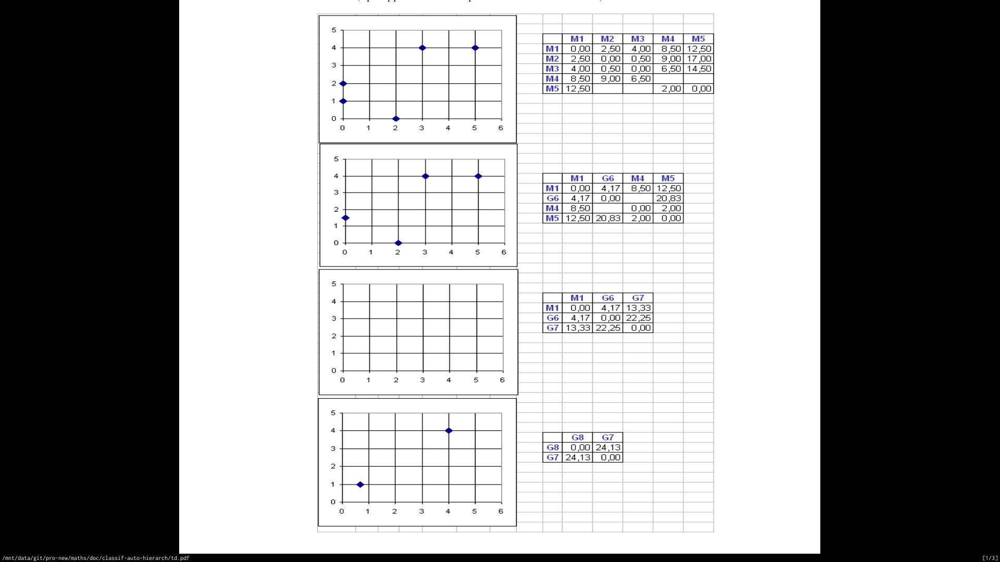
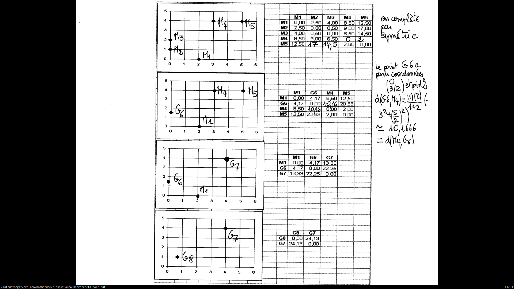
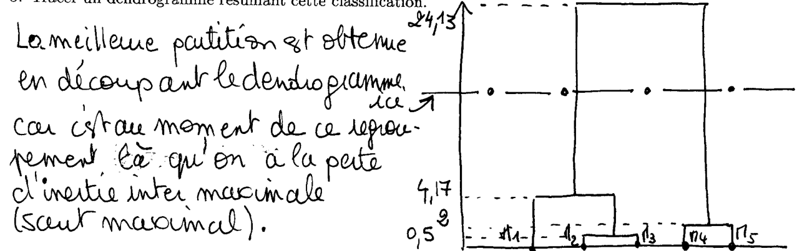

La succession des quatre dessins suivants correspond aux étapes successives d’une classification hiérarchique ascendantes des cinq points $M_1(2, 0)$, $M_2(0, 1)$, $M_3(0, 2)$, $M_4(3, 4)$ et $M_5(5, 4)$ progressivement regroupées en classes de deux ou trois points dont les centres de gravité sont notés $G_6$, $G_7$ et $G_8$.

On suppose que les cinq points initiaux sont tous affectés du poids 1.
La distance choisie pour cette classification, qui apparait dans les quatre matrices de distance, est l'écart de Ward.

1. Compléter le troisième dessin en y plaçant les trois points devant y figurer et indiquer sur les quatre dessins le nom des points.
2. Compléter les six distances manquantes dans les matrices de distances.
3. Préciser les coordonnées des points $G_6$, $G_7$ et $G_8$.
4. Calculer les coordonnées du centre de gravité $G_9$ des cinq points.
5. Tracer un dendrogramme résumant cette classification.

::: {.correction .if correction="true"}

$G_6$ est le milieu du segment $M_2(0;1)$ et $M_3(0;2)$ donc $G_6=(\frac{0-0}{2};\frac{1+2}{2}) = (0; \frac{3}{2})$.

$G_7$ est le milieu du segment $M_4$ et $M_5$ donc $G_7=(4;4)$.

$G_8$ est le centre de gravité de $G_6$ (poids 2) et $M_1$ (poids 1) donc $G_8 = (\frac{2*0+1*2}{3};\frac{2*1.5+1*0}{3}) = (\frac{2}{3};1)$.
$G_9$ est le centre de gravité du nuage : c'est la moyenne des 5 points, ou aussi le centre de gravité de $G_7$ (poids 2) et $G_8$ (poids 3): $G_9 = (\frac{2+0+0+3+5}{5};\frac{0+1+2+4+4}{5}) = (2;2.2)$

:::
