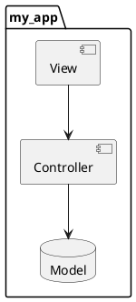
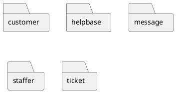
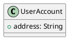
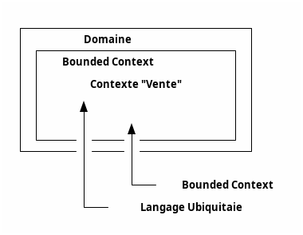
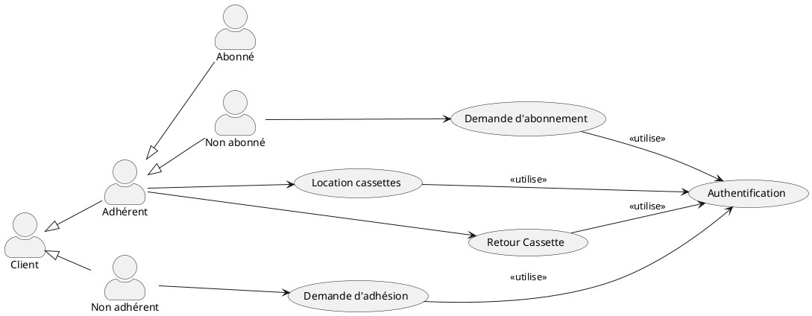
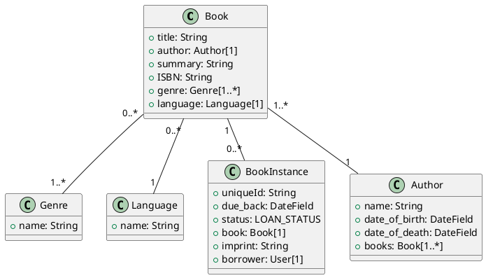
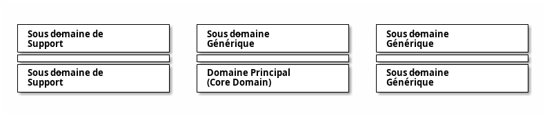
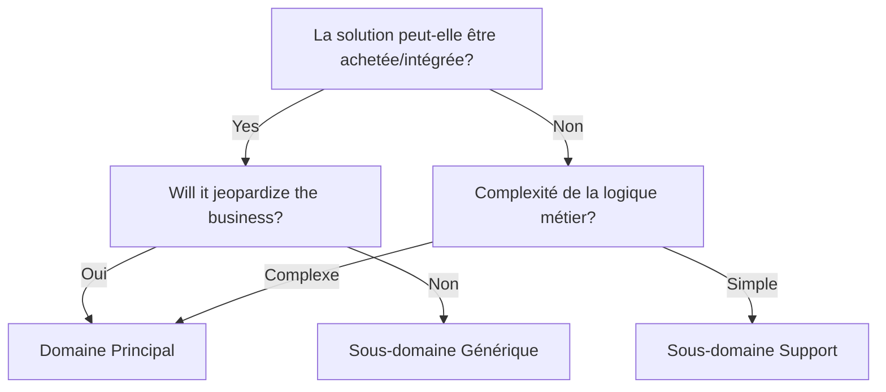
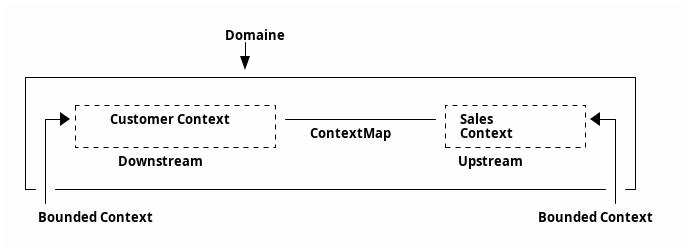
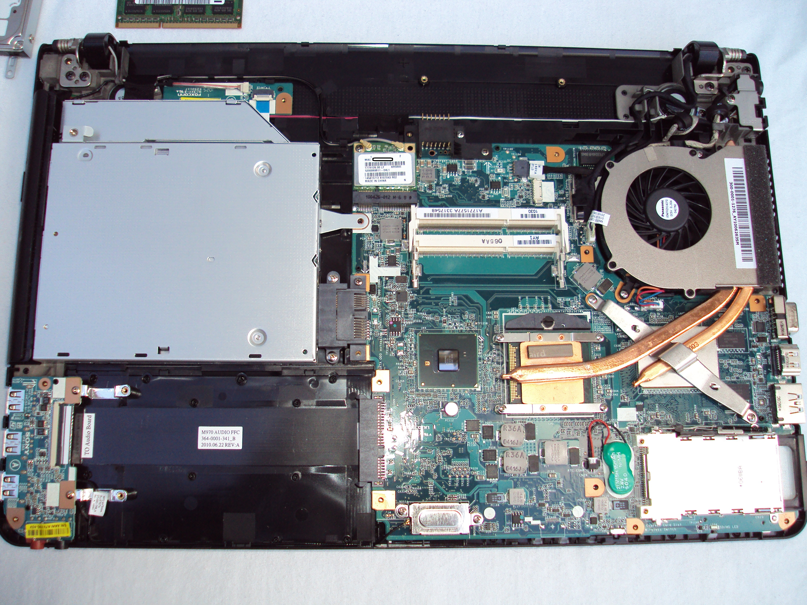

---
# https://github.com/estruyf/slidev-theme-the-unnamed
#theme: the-unnamed
slidev: true
paginate: true
#footer: _© 2024 Tom Avenel under 󰵫  BY-SA 4.0_
title: DDD
keywords:
- ddd
- archi
- hexagonal
- clean
---

<!-- _class: titre lead -->

# Domain-Driven Design

_Tom Avenel_

<https://www.avenel.pro/>


<span class="legende">©lesdieuxducode.com</span>

<!-- _footer: "© 2024 Tom Avenel under 󰵫  BY-SA 4.0" -->

---
layout: center
---

# Problèmes communs aux projets informatiques

---
layout: section
---

# MVC comme architecture

---

# MVC comme architecture



_Quel est le <span v-mark.underline.red="0">but</span> de cette application ?_ 🤔

---



_Quel est le <span v-mark.underline.red="0">but</span> de cette application django ?_ 💡

---
layout: section
---

# Application _CRUD_

---

# Application _CRUD_

<v-clicks>

1. Entité (`getter`/`setter`) + BDD auto-générée
2. ??? 🙈
3. API `REST` : _CRUD_ sur l'entité

</v-clicks>
<v-clicks>

_Quelle est la <span v-mark.underline.red="0">logique métier</span> derrière ces entités ?_

</v-clicks>

---
layout: section
---

# Modèle anémique

---

# Modèle anémique

````md magic-move
```java
public class User {

    private String name;
    private String login;

}
```
```java
public class User {

    private String name;
    private String login;

    public String getName() { return this.name; }
    public void setName(String name) { this.name = name; }

    public String getLogin() { return this.login; }
    public void setLogin(String login) { this.login = login; }
}
```
````

<v-after>

- _Relation `name` / `login` ?_
- _Conditions de validation `name` et `login` ?_
- _Contexte de validité d'une instance ?_

</v-after>

---
layout: section
---

# Domaine incohérent

---

# Domaine incohérent



<v-click>

Problème : addresse de livraison différente ?

</v-click>

---

Solution : ajouter un champ optionnel ?

````md magic-move
```java
class UserAccount {
  address: String
}
```
```java
class UserAccount {
  address: String
  shippingAddress: String [0..1]
}
```
````

<v-clicks>

```java
mainAddress = userAccount.address ;
if (shippingAddress != null) {
    mainAddress = shippingAddress;
}
[…]
```

Et des <span v-mark.crossed-off.red="4">rustines</span> partout dans le code… 🙈

</v-clicks>

---

<!-- TODO  -->


---

# Un bon design ?

<v-clicks>

- Des cas d'utilisation <span v-mark.underline="1">clairs</span> :office_worker:
- Facile à <span v-mark.underline="2">maintenir</span> 🧰
- Facile à <span v-mark.underline="3">tester</span> 🧪
- <span v-mark.underline="4">Cohérent</span> et <span v-mark.underline="4">facile</span> à comprendre 💭
- <span v-mark.underline="5">Découplé</span> ⬅️ ➡️

</v-clicks>

---

# Un bon design ! 🤓

<v-clicks>

```java
private static final boolean WILL_IT_RAIN_IN_LONDON = true;
```

- Le métier s'apprend en <span v-mark.underline="2">lisant le code !</span>

</v-clicks>

---
layout: center 
---

# Le Domain-Driven Design (DDD)

---

## Objectif 🎯

> Le Domain-Driven Design, c'est avant tout la compréhension du métier par l'ensemble de l’équipe.

### Origine

_Eric Evans_, 2003

---

## Vision des équipes métier :office_worker:

> Le Domain-Driven Design c'est avant tout faire comprendre le cœur du métier à l'équipe technique.

---

## Vision des équipes techniques :technologist:

> Le Domain-Driven Design c'est avant tout transcrire l'intention du métier dans le code.

---


<!-- _class: legende -->
Source: alexsoyes.com

---

# Principes

<v-clicks>

- <span v-mark.box="1">**Modéliser**</span> les conceptions complexes (`UML`, …)
- Mettre en avant le <span v-mark.box="2">**domaine**</span>et la <span v-mark.box="2">**logique métier**</span> associée plutôt que la technologie
- <span v-mark.box="3">**Langage commun**</span> pour tous (<span v-mark="{ at: 4, type: 'highlight', color: '#be123c'}">_ubiquitaire_</span>)

</v-clicks>

---


---

## Pourquoi utiliser DDD ? :white_check_mark:

<v-clicks>

- Application <span v-mark.underline="1">techniquement complexe</span>
- <span v-mark.underline="2">Métier complexe</span>
- Haut <span v-mark.underline="3">risque dans le métier</span>(banque, santé, …)
- L'efficacité de la solution dépend de la <span v-mark.underline="4">compréhension du métier</span>

</v-clicks>

---

## Pourquoi ne pas utiliser DDD ? ❌

<v-clicks>

- Application basée <span v-mark.underline="1">data / contenu</span> <span v-mark.crossed-off.red="2">(CMS, CRUD)</span>
- Application <span v-mark.underline="2">techniquement simple</span>
- Domaine très <span v-mark.underline="3">générique</span> ou peu de complexité métier
- Le DDD <span v-mark="{ at: 4, type: 'circle', color: '#be123c'}">prend du temps</span> (time to market)


</v-clicks>

---
layout: center
---

# Stratégie vs tactique

---

# Stratégie vs tactique

<v-clicks>

- <span v-mark="{ at: 1, type: 'highlight', color: '#be123c'}">**Stratégie**</span> : <span v-mark.underline="1">définition</span> de l'objectif
- <span v-mark="{ at: 2, type: 'highlight', color: '#6d2efc'}">**Tactique**</span> : comment <span v-mark.underline="2">atteindre</span> l'objectif (organisation du code)
- `DDD` est avant tout <span v-mark="{ at: 3, type: 'underline', strokeWidth: 5, iterations: 6, animationDuration: 2000, color: '#be123c'}">**stratégique**</span>

</v-clicks>

---

# Méthodologie

<v-clicks>

- 🎯 Commencer par un <span v-mark.underline="1">**design stratégique**</span>
- :speech_balloon: Définir le <span v-mark.underline="2">**langage ubiquitaire**</span>
- ✂️ Découper le métier en <span v-mark.underline="3">**Bounded Context**</span>
- 🔃 <span v-mark.underline="4">Itérer</span>

</v-clicks>

---
layout: center
---

# Domaine, Modèle, Bounded Context, Language ubiquitaire

---
layout: section
---

# Domaine :office:

---

# Domaine :office:

<v-clicks depth="2">

- <span v-mark="{ at: 1, type: 'highlight', color: '#be123c'}">**Domaine**</span> : ce que fait une organisation (et comment)
  - un <span v-mark.underline="2">langage dédié</span>
  - des <span v-mark.underline="3">sous-domaines</span> : l'espace des problèmes à résoudre

</v-clicks>

<v-click>

> La sphère d'un métier ou activité pour lequel on développe l'application. (wikipedia)

</v-click>

---
layout: section
---

# Modèle

---

# Modèle

- <span v-mark="{ at: 0, type: 'highlight', color: '#be123c'}">Modèle</span> : une <span v-mark.underline="0">abstraction</span> qui représente une <span v-mark.underline="0">partie d'un domaine</span>.

---
layout: section
---

# Bounded Context :office_worker:

---

# Bounded Context :office_worker:

<v-clicks>

- <span v-mark="{ at: 1, type: 'highlight', color: '#be123c'}">**Bounded Context**</span> : limite de <span v-mark.underline="1">validité</span> d'un modèle <span v-mark.circle.red="2">(frontière linguistique)</span>
- Concept **métier** précis qui répond à une <span v-mark.underline="1">problématique</span>.

</v-clicks>

---
layout: section
---

# Architecture :building_construction:

---

# Architecture :building_construction:

<v-clicks depth="2">

- Suit les _Bounded Context_
  - Pas de partage de code mais des <span v-mark.underline="2">interactions</span> entre _Bounded Context_
  - Séparation en <span v-mark.underline="3">**modules**, **packages**, **mico-services**, …</span>
  - Découpage en **couches** (si besoin) dans chaque _Bounded Context_.

</v-clicks>

<v-after>

> L'Architecture est une affaire d'Intention, pas de Frameworks. (Uncle Bob)

</v-after>


---

<v-clicks depth="2">

- <span v-mark="{ at: 1, type: 'highlight', color: '#be123c'}">1 bounded context == 1 langage ubiquitaire</span>
  - Dans le contexte <span v-mark.underline.blue="2">culinaire</span> : 🍅 est un <span v-mark.underline.blue="2">légume</span>
  - Dans le contexte <span v-mark.underline.yellow="3">botanique</span> : 🍅 est un <span v-mark.underline.yellow="3">fruit</span>
  - Dans le contexte <span v-mark.underline.green="4">théatral</span> : 🍅 est un <span v-mark.underline.green="4">feedback</span>

</v-clicks>

---



<!-- _class: legende -->
Domaine, Bounded context, langage ubiquitaire.

---
layout: section
---
# D'un langage ubiquitaire au modèle

---

# D'un langage ubiquitaire… :speech_balloon:

<v-clicks depth="2">

- Pas uniquement un glossaire, des <span v-mark.underline.red="1">phrases entières (simples)</span>
- Provient du <span v-mark.underline="2">métier</span>
  - Éliminer les <span v-mark.crossed-off="3">synonymes</span>
  - Coder dans la <span v-mark.underline="4">langue du métier</span>…
  - …ou s'accorder sur les <span v-mark.underline="5">traductions</span> !

</v-clicks>

---
layout: quote
---

> Si vous ne pouvez expliquer un concept à un enfant de six ans, c'est que vous ne le comprenez pas complètement. (Albert Einstein)

---

# …Au modèle :card_index_dividers:

<v-clicks depth="2">

- <span v-mark="{ at: 1, type: 'highlight', color: '#be123c'}">**Le langage est le modèle**</span>
  - langage => modèle (puis => langage)
- Pas de <span v-mark.crossed-off="3">duplication du modèle</span> 🚫
- Privilégier plusieurs éléments <span v-mark.underline="4">simples</span> pour faire des modèles plus complexes 🖇️
- Pas de <span v-mark.crossed-off="5">technique</span> dans le modèle
- Utiliser les termes <span v-mark.underline.red="6">métiers</span> dans le code :office_worker:

</v-clicks>

---


<!-- _class: legende -->
Source: programmerhumor.io

---
layout: center
---

# Définir le langage :speech_balloon:

---

# Objectifs 🎯

<v-clicks>

1. Clarifier le <span v-mark.underline="1">besoin métier</span> entre les différents experts du domaine
2. <span v-mark.underline="2">Simplifier</span> les définitions

</v-clicks>

---
layout: section
---

# Event storming

---

# L'atelier d'Event Storming

<v-clicks depth="2">

- Réunit les parties prenantes :busts_in_silhouette:
  - <span v-mark.underline="2">inclus les développeurs</span> :technologist:
- Brainstorming :
  - <span v-mark.underline="4">**fonctionnalités**</span> 💡
  - <span v-mark.underline="5">**vocabulaire**</span> :speech_balloon:
  - pas de <span v-mark.crossed-off="6">détail technique</span> ! :no_entry:

</v-clicks>

---


<!-- _class: legende -->
https://www.eventstorming.com/book/

---

# Brainstorming

<v-clicks>

1. Trouver les <span v-mark.underline="1">idées</span> 💡 (penser <span v-mark.box="1">_objectifs_</span> 🎯 )
2. <span v-mark.underline="2">Regrouper </span>les idées 🖇️
3. Trouver les <span v-mark.underline="3">déclencheurs</span> (_event triggers_) ▶️

</v-clicks>

<v-after>

[Exemple de brainstorming][brainstorming-example]

</v-after>

---

# Formalisation

<v-clicks>

1. Identifier les <span v-mark.underline="1">**acteurs**</span> 🙋 et les <span v-mark.box="1">**prioriser**</span> :1234:
2. Identifier les <span v-mark.underline="2">**cas d'utilisation**</span> :juggling_person:
3. Identifier les <span v-mark.underline="3">**interactions**</span> entre les cas d'utilisation :wrestling:
4. Identifier les <span v-mark.underline="4">**entités**</span>
5. Diagramme de **classes** (ou **code** directement) : décrit le <span v-mark.underline="5">**glossaire**</span> :ledger:

</v-clicks>

---

# Diagramme de cas d'utilisation



<!-- _class: legende -->
Exemple : diagramme de cas d'utilisation d'un vidéoclub

---

# Diagramme de classe



<!-- _class: legende -->
Exemple de diagramme de classes pour le modèle d'une librairie.

---
layout: default
---

# Loi de Brandolini

<v-clicks depth="2">

> La quantité d'énergie nécessaire pour réfuter des sottises […] est supérieure d'un ordre de grandeur à celle nécessaire pour les produire.
>
> _Bullshit asymmetry principle, Brandolini_

- Event storming (très) long (~3 jours) 💤
  - à <span v-mark.underline>découper</span> (meilleure acceptation) :carpentry_saw:

</v-clicks>

---
layout: center
---

# Patterns stratégiques

---

# Distillation du Core Domain

La **distillation du Core Domain** permet de se concentrer sur les éléments les plus importants du modèle du domaine.

Plusieurs stratégies permettent d'y parvenir :

---

1. **Sous-domaines génériques**  
   - Extraire les sous-domaines qui ne sont pas la raison principale de construire le système.
2. **Déclaration de vision du domaine**  
   - Vision haut niveau du système pour définir le domaine principal.
3. **Domaine principal mis en évidence**  
   - Identifier les parties principales du modèle appartenant au Core (sans les extraire pour l'instant).
4. **Mécanismes cohérents**  
   - Repérer les mécanismes du modèle qui fonctionnent généralement ensemble.
5. **Core séparé** 
   - Détacher les fonctionnalités de support du Core.
6. **Core abstrait**  
   - Viser des concepts abstraits dans le Core réutilisables dans les sous-domaines spécialisés.

---


---

# Découpage

<v-clicks depth="2">

- ⭐ un <span v-mark="{ at: 1, type: 'highlight', color: '#be123c'}">_core domain_</span> : le <span v-mark.underline="1">problème principal</span>
  - c'est la <span v-mark.underline="2">raison d'exister</span> de l'organisation
  - <span v-mark.underline="3">petit</span>, à <span v-mark.box="3">refactorer</span>
  - :rotating_light: doit être bien conçu (_design hexagonal_, …)
- :pray: au moins un <span v-mark="{ at: 1, type: 'highlight', color: '#be123c'}">sous-domaine</span> venant en <span v-mark.underline="5">support</span>
  - moins critique
- (éventuellement) des sous-domaines <span v-mark="{ at: 1, type: 'highlight', color: '#be123c'}">génériques</span>
  - aident le métier
  - souvent des intégrations de solutions externes

</v-clicks>

---



---



---

# Exemple d'un dentiste

<v-clicks depth="2">

- Le <span v-mark="{ at: 1, type: 'highlight', color: '#be123c'}">**core domain**</span> :tooth: : <span v-mark.underline="1">soigner</span> les dents du patient
  - Notion de `patient` :face_with_head_bandage: (historique des soins, …)
- Un sous-domaine de <span v-mark="{ at: 3, type: 'highlight', color: '#be123c'}">**support**</span> :date: : gérer les <span v-mark.underline="3">rdv</span> du patient
  - Notion de `patient` :bust_in_silhouette: (informations de contact, paiement, …)
- Les 2 domaines ont besoin d'un modèle <span v-mark.underline.red="5">différent</span> de patient (chacun dans son `Bounded Context`)
- Un sous-domaine <span v-mark="{ at: 6, type: 'highlight', color: '#be123c'}">**générique**</span> de <span v-mark.underline="6">facturation</span>

</v-clicks>

---
layout: center
---
# Propagation du domaine

---

# Propagation du domaine

- Quelles relations entre domaines ?
- Comment faire interagir différents domaines ?

---

# Carte de contexte

<v-clicks>

- Document représentant les <span v-mark.underline="1">relations</span> entre Bounded Context
- Diagramme ou document écrit
- Niveau de détail variable

</v-clicks>

---



---
layout: section
---

# Patterns de collaboration

---

# Shared Kernel (Noyau partagé)

<v-clicks depth="2">

- Relation entre 2+ _Bounded Context_ qui partagent du code, des données, …
- Création d'un <span v-mark.underline="2">contexte partagé</span> (en dépendance) :
  - évite la <span v-mark.crossed-off="3">duplication</span>
  - <span v-mark.underline.red="4">collaboration forte</span> : doit <span v-mark.box.red="4">notifier</span> chaque contexte dépendant des changements

</v-clicks>

---

# Exemple de noyau partagé

- Plateforme de commerce électronique :
  - une boutique en ligne
  - une application mobile
- Mêmes comptes clients, même historique des commandes, …
  - dans un noyau partagé
  - BDD commune

---

# Customer / Supplier (Client / Fournisseur)

<v-clicks depth="2">

- Relation : un _Bounded Context_ <span v-mark.underline="1">fournit un service</span> (ou des données) à un autre.
- <span v-mark.underline.red="2">Collaboration forte</span>
- Aussi appelé : `Downstream` (Client) / `Upstream` (Supplier)

</v-clicks>

---

# Exemple de Customer / Supplier

- Processus de gestion des catalogues produits :
  - _Client_ : définition des exigences et des règles commerciales
  - _Fournisseur_ : mise en œuvre de l'infrastructure technique

---

# Conformiste

<v-clicks depth="2">

- Le client <span v-mark.underline="1">adhère</span> au modèle (et conventions, règles, …) de l'équipe fournisseur
- <span v-mark.underline.red="2">C'est au client de s'adapter</span>

</v-clicks>

---

# Exemple de Conformiste

- Équipe chargée de gérer l'inventaire des produits dans un entrepôt.
- même modèle que dans le contexte responsable de la gestion des commandes, des clients et des produits.

---

# Separate Ways (Chemins Séparés)

<v-clicks depth="2">

- Contextes très <span v-mark.underline="1">**indépendants**</span> les uns des autres (<span v-mark.underline.red="1">y compris technologiquement</span>)
- Évoluent <span v-mark.underline="2">séparément</span>
- Idée de <span v-mark.underline="3">**modularité**</span>

</v-clicks>

---

# Exemple de Chemins Séparés

1. Application principale de e-commerce
2. Système de gestion des stocks indépendant (propre domaine et logique métier)
  - Communique avec l'application via une file de messages bien définie
  - Développé et maintenu par une équipe distincte

---

# Open Host Services (Services Hôtes)

<v-clicks depth="2">

- Rend disponible des systèmes / services <span v-mark.underline="1">communs</span> à différents _Bounded Context_
  - _RESTful API_, …
- Définit un <span v-mark.underline.red="3">modèle commun d'intégration</span>

</v-clicks>

---

# Exemple de pattern Open Host Service

- _Open Host Service_ de paiement à distance (possède sa propre logique)
- À intégrer dans différents contextes de l'application

---

# Published Language (Langage publié)

<v-clicks depth="2">

- Version formelle des service hôtes : <span v-mark.underline="1">publication technique du modèle commun</span>
  - `JSON`, `XML`, …

</v-clicks>

---

# Couche Anticorruption (ACL)

<v-clicks depth="2">

- <span v-mark.underline.red="1">Protège</span> un _Bounded Context_ des complexités et incohérences d'un autre modèle
- <span v-mark.underline="2">Traducteur</span> et <span v-mark.underline="2">validateur</span> entre deux modèles

</v-clicks>

---

# Exemple de pattern ACL

- Système e-commerce s'intégrant à un ancien système de gestion des stocks (ancien modèle de données)
- L'_ACL_ traduit les concepts, données et messages entre les 2 systèmes

---
layout: section
---

# Context Map

---

# Context Map

- <span v-mark="{ at: 0, type: 'highlight', color: '#be123c'}">**Carte de contexte**</span> : formalise les relations entre les bounded context.

---

# Exemple de context map


<!-- _class: legende -->
Source: methodsandtools.com

---

---
layout: section
---

# Relations entre équipes

---



By <a href="https://en.wikipedia.org/wiki/User:Ravenperch" class="extiw" title="wikipedia:User:Ravenperch">Ravenperch</a> at <a href="https://en.wikipedia.org/wiki/" class="extiw" title="wikipedia:">English Wikipedia</a> - <span class="int-own-work" lang="en">Own work</span> (<span lang="en" dir="ltr">Original text: Self created</span>), <a href="https://creativecommons.org/licenses/by-sa/3.0" title="Creative Commons Attribution-Share Alike 3.0">CC BY-SA 3.0</a>, <a href="https://commons.wikimedia.org/w/index.php?curid=18540450">Link</a>

À votre avis, quelles sont les différentes équipes à travailler sur la réalisation de cet ordinateur ?

---

# Loi de Conway

> Les organisations produisent des systèmes qui reflètent leur structure de communication

- Exemple :
  - _facturation_
  - _gestion des stocks_
  - _gestion des comptes_

---

# Team topologies

- idée : refléter le découpage en composants dans le découpage des équipes
- <span v-mark.underline="1">Team Topologies</span> : pattern d'organisation complémentaire au DDD
  - inverse de la loi de Conway (adapter l'organisation aux modules et pas l'inverse)

---

# Dépendance mutuelle

<v-clicks depth="2">

- Dépendance mutuelle (Shared Kernel)
- Relation <span v-mark.underline.red="2">succès/échec partagée</span>
  - besoin de <span v-mark.underline="3">collaboration forte</span>
  - relation de <span v-mark.underline="4">partenariat</span>

</v-clicks>

---

# Dépendance Upstream / Downstream 

<v-clicks depth="2">

- <span v-mark.underline.red="1">Upstream impacte le succès Downstream</span>
- Downstream n'impacte pas le succès Upstream
  - soit : collaboration par requêtes (envie du Customer à remonter au Supplier), pas par <span v-mark.crossed-off="3">exigence (besoin)</span>
  - soit : API publique (Open Host Service) indépendant du consommateur (le Customer doit s'adapter au Supplier)

</v-clicks>

---


<!-- _class: legende -->
DDD Strategic design patterns (dieuxducode.com)

---

# Objectifs

- Limiter la complexité du système à la charge cognitive de l'équipe
- Collaboration a minima (complexe)
  - sinon : envisager la creation d'un nouveau composant au milieu pour limiter les impacts

---
layout: center
---

# Patterns tactiques

---

- `Entity` - Objet modélisant une partie du domaine - a un ID et est mutable.
- `Value Object` - Objet immuable identifiée par ses attributs.
- `Aggregate` - Encapsule différentes entitées et value objects.
- `Repository` - Bibliothèque permettant d'accéder aux aggrégats.
- `Module` - Abstraction permettant de réduire la charge mentale.
- `Factory` - Design pattern permettant de créer des objets.
- `Domain Service` - Objet sans état qui encapsule une logique compliquée du domaine.
- `Application Service` - Orchestrateur entre le monde extérieur (interface utilisateur, API, etc.) et le domaine métier.

---

- `Dependency Injection` : L'objet ne crée pas lui-même ses dépendances, elles sont injectées depuis l'extérieur.
- `Split Entities` : Diviser une `Entity` en plusieurs entités dans différents _Bounded Context_.
- `Policy` : Règle métier qui décrit une contrainte métier applicable à un _Bounded Context_.
- `Invariant` : Règle métier toujours vraie garantissant la cohérence et l'intégrité du modèle de domaine.
- `Specification Pattern` : Encapsuler des règles métier dans un objet réutilisable, combinable et testable.
- `Command Query Responsibility Segregation (CQRS)` : Sépare les responsabilités de lecture (`Query`) et d'écriture (`Command`)

---

- `Domain Event` : Événement significatif dans le domaine métier (changement d'état, action importante).
- `Eventual Consistency` : Permet à des _Bounded Context_ de communiquer via des événements, sans nécessiter une synchronisation immédiate. La cohérence avec le domaine est effectuée plus tard.
- `Event Sourcing` : Reconstruit l'état du domaine à partir d'une série d'événements.
- `Saga` : Gère la _cohérence éventuelle_ de processus métier de longue durée impliquant plusieurs services ou agrégats.
- `Process Manager` : Orchestrateur central qui coordonne des processus métier complexes qui impliquent plusieurs services ou agrégats.

---

- Rappels sur les [Value Object et Factory](https://opus.ch/en/ddd-concepts-and-patterns-value-object-and-factory/)
- Rappels sur les [Services et Bibliothèques](https://opus.ch/en/ddd-concepts-and-patterns-service-and-repository/)
- Rappels sur les [Aggrégats et les Modules](https://opus.ch/en/ddd-concepts-and-patterns-aggregate-and-module/)
- Voir le document de cours sur les patterns tactiques.

---


<!-- _class: legende -->
Cartographie des modèles et de leurs relations (dieuxducode.com)

---

# Intégration continue

<v-clicks depth="2">

- 🔃 Le DDD est <span v-mark.underline.red="1">itératif</span> (=> CI)
- 🤔 <span v-mark.underline="2">Repenser</span> régulièrement les `Bounded Context` et <span v-mark.underline="2">changer le type de propagation</span> au besoin

</v-clicks>

---

# XP, Agilité, BDD

- `DDD` s'associe particulièrement bien avec les méthodes agiles (`XP`, …)
- Le `BDD` (Behavior-Driven Development) permet de faire le lien par le langage des spécifications (<span v-mark.box="1">par l'exemple</span>) au code

---
layout: section
---

# Architecture

---

# Patterns spécifiques d'architecture

- DDD ne définit pas d'architecture spécifique
- Candidats intéressants :
  - _Architecture Hexagonale_
  - _Clean Architecture_
  - _[L'architecture explicite][archi-explicite] combine le tout_

---

# Architecture à Grande Échelle

DDD utilise les concepts d'**architecture à grande échelle** pour organiser le système au niveau des composants ou des couches. Cette organisation guide les développeurs sur la l'endroit où trouver ou ajouter une fonctionnalité dans le code.

- Architectures classiques : basées sur des considérations techniques
- Archicture à grande échelle : basée sur des concepts liés au domaine

---

1. **Ordre évolutif**  
  - Laisser la structure évoluer avec le temps.
2. **Métaphore système**  
  - Rechercher une métaphore globale pour le système.
3. **Couches de responsabilité**  
  - Organiser le modèle de domaine en plusieurs couches.
4. **Niveau de connaissance**  
  - Permettre la configuration des opérations principales à partir d’un niveau de connaissance.
5. **Cadre de composants plug-and-play**  
  - Abstraction du cœur avec une infrastructure de plugins.

---

# Design Souple (Supple Design)

Idée : concevoir le logiciel de manière intuitive pour le développement et la maintenance.

Voici des **patterns** qui favorisent un design souple :

---

1. **Interfaces explicites**
   - Noms significatifs, utilisation du langage ubiquitaire.
2. **Fonctions sans effets de bord**  
   - Privilégier les fonctions qui renvoient des résultats sans modifier d'état du système.
3. **Assertions**  
   - Énoncer explicitement les post-conditions et les invariants des classes.
4. **Contours conceptuels**  
   - Décomposer le logiciel en unités cohérentes.

---

5. **Classes autonomes**  
   - Réduire les dépendances pour alléger la charge mentale.
6. **Opérations dans des ensembles clos**  
   - Les opérations doivent idéalement retourner le même type que leurs arguments.
7. **Design déclaratif**  
   - Utiliser un style de programmation déclaratif si possible.

---
layout: center
---

# Résumé

---

# Résumé


<!-- _class: legende -->
by: Eric Evans 

---
layout: section
---

# Points de vigilance

---

# Points de vigilance - 1/2

<v-clicks depth="2">

- 🚫 Ne pas utiliser la <span v-mark.crossed-off="1">même architecture</span> pour tous les contextes bornés.
  - Certains contextes sont moins complexes que d'autres.
- 🚫 Ne pas <span v-mark.crossed-off="3">réutiliser</span> un modèle existant ( ⚠ <span v-mark="{ at: 3, type: 'highlight', color: '#be123c'}">1 domaine == 1 problématique</span> )
- 💡 <span v-mark.underline.red="4">Comprendre</span> les problèmes métier avant d'essayer des résoudre une problématique technique.
- ⚠ Ne pas négliger la <span v-mark.underline.red="5">carte de contexte</span>.
- ✂️ Définir clairement les <span v-mark.box.red="6">limites du contexte</span>.
- 🤔 Résoudre les problèmes d'<span v-mark.crossed-off="7">ambiguité</span> (impact fort sur le logiciel).
  - En particulier lorsque la logique métier est complexe.

</v-clicks>

---

# Points de vigilance - 2/2

<v-clicks depth="2">

- 🤓 DDD n'a **PAS** pour but <span v-mark.crossed-off="1">d'ajouter des couches d'abstraction</span>
  - Mais <span v-mark.box.red="2">d'isoler la logique métier</span> !
- ❌ Peu adapté à un <span v-mark.crossed-off="3">domaine simple</span>
  - ou si les acteurs du métier ne sont pas impliqués
  - 💵 <span v-mark.circle.red="5">coûteux</span> en ressources et en temps

</v-clicks>

---

# DDD depuis l'existant

- Peut être complexe à mettre en place (métier mal défini, mal isolé, …)
- Privilégier des patterns stratégiques pour isoler le nouveau métier
- 💡 : générer un nuage de mots depuis le code pour extraire le langage

---
layout: two-cols
---

<!-- class: liens -->
# Liens

- [Articles sur le DDD (opus.ch)](https://opus.ch/en/category/ddd-en/)
- [Présentation du DDD (dieuxducode.com)](https://lesdieuxducode.com/blog/2019/7/introduction-au-domain-driven-design)
- [Résumé du DDD (blog.scottlogic.com)](https://blog.scottlogic.com/2018/03/28/domain-driven-design.html)
- [Alex Soyes - DDD](https://alexsoyes.com/ddd-domain-driven-design/)
- [Blog Opus Software - articles DDD](https://opus.ch/en/blog/)
- [DDD 101 — The 5-Minute Tour (medium.com)](https://medium.com/the-coding-matrix/ddd-101-the-5-minute-tour-7a3037cf53b8)
- [DDD en 5 minutes (cdiese.fr)](https://cdiese.fr/domain-driven-design-en-5-min/)
- [DDD vs Clean architecture en images](https://khalilstemmler.com/articles/software-design-architecture/domain-driven-design-vs-clean-architecture/)
- [Exemple de brainstorming (event storming)][brainstorming-example]

::right::

- [Stratégies d'organisation du code (medium.com)](https://medium.com/@msandin/strategies-for-organizing-code-2c9d690b6f33)
- [Martin Fowler : domain data layering](https://martinfowler.com/bliki/PresentationDomainDataLayering.html)
- [De CRUD à DDD - Comment Meetic a sauvé son legacy (slides)](https://speakerdeck.com/jmlamodiere/de-crud-a-ddd-comment-meetic-a-sauve-son-legacy)
- [Architecture explicite][archi-explicite]
- [Application de poésie](https://github.com/tpierrain/hexagonalThis)
- [Exemple d'application en DDD (Eric Evans)](https://github.com/citerus/dddsample-core)
- [Un autre exemple de DDD](https://github.com/mattia-battiston/clean-architecture-example)
- [Exemple d'application Django en DDD](https://github.com/johnnncodes/ddd-python-django)
- [Discussion about DDD in Symfony issues](https://github.com/symfony/symfony-docs/issues/8893)
- <https://dddinpython.com/>
- <https://teamtopologies.com>

[brainstorming-example]: https://openclassrooms.com/fr/courses/5647281-appliquez-le-principe-du-domain-driven-design-a-votre-application/6828051-identifiez-les-objectifs-de-votre-application-avec-levent-storming#/id/r-6828246
[archi-explicite]: https://herbertograca.com/2017/11/16/explicit-architecture-01-ddd-hexagonal-onion-clean-cqrs-how-i-put-it-all-together/

---

# Livres

- _Domain-Driven Design, Tackling Complexity in the Heart of Software, Eric Evans, 2003._
- _Implementing Domain-Driven Design, Vaughn Vernon, 2013._
- [Living Documentation (Cyrille Martaire)](https://leanpub.com/livingdocumentation)

---

# Vidéos

- [Domain-Driven Design pour de vrai (Cyrille Martraire)](https://www.canal-u.tv/chaines/cemu/printemps-agile-2017/06-atelier-2-domain-driven-design-pour-de-vrai-pa2017)
- [Aggregates, Entities & Value Objects (Amichai Mantinband)](https://www.youtube.com/watch?v=UEtmOW8uZZY)
- [Clean Architecture vs Domain-Driven Design (DDD) - Understand the Difference](https://www.youtube.com/watch?v=eUW2CYAT1Nk)
- [Playlist: REST API following CLEAN ARCHITECTURE (Youtube)](https://www.youtube.com/playlist?list=PLzYkqgWkHPKBcDIP5gzLfASkQyTdy0t4k)
- [DDD en DotNet (linkedin learning)](https://www.linkedin.com/learning/expert-domain-driven-design-ddd-implementation-in-dot-net)

---

<!-- class: legal -->

# Legal

| [](http://creativecommons.org/licenses/by-sa/4.0/) | CC BY-SA 4.0 |
| ---------------------------------------------------------------- | ------------------------------------------ |
|  | Attribution : vous devez créditer l'auteur |
|  | Partage dans les mêmes conditions          |

- Ce fichier est mis à disposition selon les termes de la Licence Creative Commons Attribution - Partage dans les Mêmes Conditions 4.0 International. Pour plus d'informations : <http://creativecommons.org/licenses/by-sa/4.0/>
- Le code source au format `Markdown` de ce document est disponible sur le [site web][site-perso]

[site-perso]: https://www.avenel.pro/
