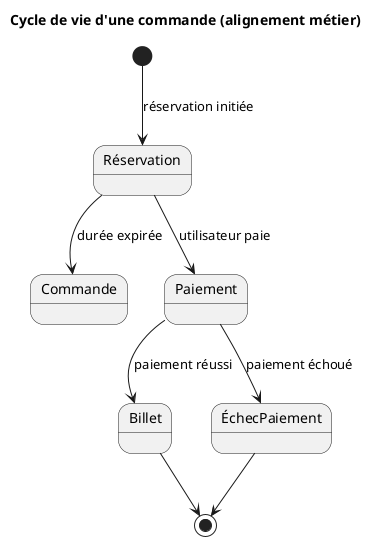
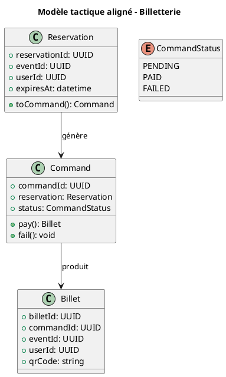

## 🎯 Objectif pédagogique

- Identifier les conflits de vocabulaire ou de compréhension métier.
- Harmoniser des descriptions contradictoires en un **langage ubiquitaire clair**.
- Proposer un modèle cohérent basé sur ce vocabulaire aligné.

## 📝 Contexte - Plateforme de billetterie en ligne

Une startup développe un service de vente de billets pour des événements. Lors des ateliers de découverte du domaine, deux experts donnent des descriptions apparemment similaires mais **contradictoires**.

### 💬 Témoignage 1 - Responsable Produit

> Chaque client peut **réserver un billet** sur notre plateforme. On lui garde une place pendant 15 minutes. Ensuite, il peut **acheter le billet**. Si le paiement échoue, la place est **libérée**.

### 💬 Témoignage 2 - Responsable Support

> Pour nous, un billet **est acheté dès qu’il est réservé**. Ensuite, si le paiement échoue, on doit **l’annuler manuellement**. Et on note dans le support que c’est un "**billet échoué**".

## ✍️ Travail demandé

1. Quelles contradictions ou confusions identifiez-vous entre les deux descriptions ?
2. Proposez un **langage ubiquitaire aligné**, en définissant clairement les concepts métier : _réservation_, _achat_, _billet_, etc.
3. Proposez un **modèle simplifié**, avec un diagramme d'activité, un diagramme de classe et une implémentation du modèle dans le langage de votre choix.

:::correction
## ✅ Correction

### 1. Contradictions identifiées

| Concept           | Produit                                 | Support                         | Conflit                              |
| ----------------- | --------------------------------------- | ------------------------------- | ------------------------------------ |
| **Réservation**   | Garde une place temporairement (15 min) | Équivaut à un achat             | Vision différente du même mot        |
| **Achat**         | Acte déclenché après paiement réussi    | N'intervient pas (ou implicite) | Pas de distinction claire            |
| **Billet échoué** | La place est libérée automatiquement    | Le billet existe, mais échoué   | Existence même du billet en question |


### 2. Langage ubiquitaire aligné (exemple proposé)

| Terme                | Définition métier consensuelle                                        |
| -------------------- | --------------------------------------------------------------------- |
| **Réservation**      | Action de bloquer une place pendant un temps limité avant paiement    |
| **Commande**         | Objet métier représentant l’intention d’achat (créé à la réservation) |
| **Paiement**         | Action qui transforme une commande en achat                           |
| **Billet**           | Délivré uniquement après paiement réussi                              |
| **Commande échouée** | Commande dont le paiement a échoué, sans billet généré                |


### 3. Modèle ou schéma (exemple simplifié)





```python
from uuid import uuid4
from datetime import datetime, timedelta
from enum import Enum

class CommandStatus(Enum):
    PENDING = "pending"
    PAID = "paid"
    FAILED = "failed"

class Reservation:
    def __init__(self, event_id, user_id, duration_minutes=15):
        self.reservation_id = str(uuid4())
        self.event_id = event_id
        self.user_id = user_id
        self.expires_at = datetime.now() + timedelta(minutes=duration_minutes)

    def is_expired(self):
        return datetime.now() > self.expires_at

    def to_command(self):
        if self.is_expired():
            return False
        return Command(self)

class InvalidStatusException(Exception):
    pass

class Command:
    def __init__(self, reservation: Reservation):
        self.command_id = str(uuid4())
        self.reservation = reservation
        self.status = CommandStatus.PENDING

    def pay(self):
        if self.status != CommandStatus.PENDING:
            raise InvalidStatusException("Commande déjà traitée.")
        self.status = CommandStatus.PAID
        return Billet(self)

    def fail(self):
        if self.status != CommandStatus.PENDING:
            raise InvalidStatusException("Commande déjà traitée.")
        self.status = CommandStatus.FAILED

class Billet:
    def __init__(self, command: Command):
        self.billet_id = str(uuid4())
        self.command_id = command.command_id
        self.event_id = command.reservation.event_id
        self.user_id = command.reservation.user_id
        self.qr_code = f"QR-{self.billet_id[:8]}"

# Exemple d'utilisation
if __name__ == "__main__":
    # Données simulées
    event_id = "event-1234"
    user_id = "user-5678"

    print("Création d'une réservation...")
    reservation = Reservation(event_id, user_id)
    print(f"Réservation {reservation.reservation_id} valable jusqu’à {reservation.expires_at}")

    try:
        print("Conversion de la réservation en commande...")
        command = reservation.to_command()
        print(f"Commande créée : {command.command_id}, statut = {command.status.value}")

        # Simulation de paiement
        print("Traitement du paiement...")
        billet = command.pay()
        print(f"Commande payée avec succès : statut = {command.status.value}")
        print(f"Billet généré : {billet}")

    except Exception as e:
        print(f"Erreur : {e}")
        command.fail()
        print(f"Commande échouée : statut = {command.status.value}")
```

#### ✅ Invariants / règles métier intégrés

- ⏳ Impossible de créer une commande à partir d'une réservation expirée.
- 🧾 Une commande ne peut être payée ou échouée qu'une seule fois.
- 🎟️ Un billet n’est généré que si le paiement est réussi.
:::

