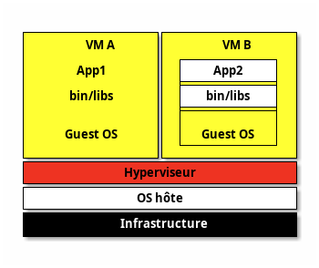
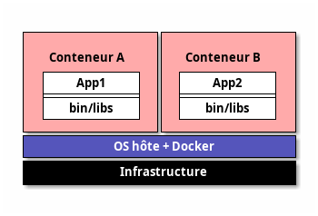

# Introduction: Problèmes courants

---

## Incohérences entre environnements

- **"Ça marche sur ma machine" :**
  - Environnements de dev / test / production différents
  - Bugs spécifiques à chaque environnement : OS, dépendances, configurations, …
  - Difficile de reproduire des environnements proches de la production : Tests d'intégration et de performance faussés

---

## Problèmes de compatibilité

- Grand nombre de dépendances : bibliothèques, versions de logiciels difficiles à maintenir.
- Conflits entre différentes versions de dépendances

---

## Difficulté de déploiement

- Scripts complexes et configurations spécifiques à chaque environnement
- Processus de déploiement manuel :
  - erreurs humaines
  - long

---

## Problèmes de portabilité

- Difficile de déplacer une application : 
  - d'un serveur à un autre
  - d'un environnement de développement à la production

---

## Environnements lourds

- Machines virtuelles pour isoler les environnements :
  - Consomment beaucoup de ressources
  - Gestion et maintenance coûteuses
  - VM lente à démarrer

---

## Difficulté à évoluer

- Scalabilité limitée : environnements traditionnels mal adaptés aux architectures modernes nécessitant une scalabilité rapide et fluide.
- Mise à l’échelle : configurations manuelles complexes.

---

> Develop faster. Run anywhere.

_Docker®_

---
layout: section
---

# Introduction aux conteneurs

---

# Architecture d'une machine virtuelle



---

# Architecture d'un conteneur



---

# Virtualisation forte

* `+` Grande indépendance par rapport à l'hyperviseur
* `+` Isolation forte voir totale
* `+` Ressources dédiées
* `-` Consomme beaucoup de ressources
* `-` Performances réduites : temps de démarrage, virtualisation des appels systèmes, ...

---

# Paravirtualisation (conteneurs)

* `-` Proche du système d'exploitation hôte
* `-` Isolation faible
* `+`/`-` Partage un maximum de ressources
* `+` Impact quasi nul sur les performances

---
layout: section
---

# Présentation de Docker®

---

Docker® est un outil de création, gestion et hébergement de conteneurs applicatifs

* Compatible Windows, Linux et MacOS
* Utilise des images figées pour générer des conteneurs (version dynamique des images)
* La création d'une image est décrite dans un ficher `Dockerfile`

---

Un conteneur ne tourne qu'un seul processus

* Une stack applicative va être découpée en plusieurs conteneurs
* exemple `LAMP` : 1 `Apache`, 1 `MySQL`

---

# Docker® Hub

Docker® utilise des caches locaux et distants pour stocker les images des conteneurs

* Lors de la création d'un conteneur, Docker® cherche si l'image est disponible en local, sinon celle-ci est récupérée depuis un répertoire distant
* Par défaut : <https://hub.docker.com>

---

Les images sont versionnées par un tag

* Exemple : `mysql:5.3`
* Si aucun tag ajouté, le tag `latest` est utilisé
* Attention : `latest` est juste un nom de tag (pas la dernière image)

---

Il est possible d'utiliser d'autres hubs que le hub par défaut :

- Hub Github : <https://ghcr.io/>
- Hub interne à l'entreprise
- Hub d'images temporaires <https://ttl.sh/>
- ...

---

# Avantages de Docker®

 Même environnement d'exécution dans toutes les étapes du pipeline d'intégration : ordinateur personnel, test, production, pré-production, ...

* Windows, Linux, MacOS
* Assure l'utilisation des mêmes versions de librairies, outils, ...
* CI/CD

---

# Avantages de Docker®

Architecture immuable

> Build once, run everywhere

* Une image Docker® est par design immuable et sans état (stateless)
  * Ce n'est pas le cas d'un conteneur (exécution d'une image)
 
---

# Avantages de Docker®

Répertoire centralisé d'images

* Docker® Hub accessible publiquement
* Assure la véracité et l'intégrité des images utilisées

---

# Architecture de Docker® : les namespaces et les cgroups

Docker utilise massivement deux technologies du noyau Linux pour isoler et associer des ressources aux conteneurs : les `namespaces` et les `cgroups`.

---

## Namespaces

- Fonctionnalité native du noyau Linux.
- Aspect fondamental des conteneurs : permet d'isoler des ressources du système hôte.
- 5 types de `namespace` :
  + `Process ID`
  + `Mount`
  + `IPC` (Interprocess communication)
  + `User` (expérimental)
  + `Network`

---

## Cgroups

- Extension du noyau Linux.
- Les `control groups` permettent de contrôler finement les ressources à allouer aux conteneurs.
  + limitations mémoire
  + utilisation et temps CPU
  + accès aux disques
  + ...

---

- Exemples de `cgroups` classiques :
  + `CPU`
  + `Memory`
  + `Network Bandwidth`
  + `Disk`
  + `Priority`

---


<div class="caption">Architecture de Docker®</div>

---

# Commandes de base de Docker® 

Voir la [cheatsheet sur Docker®](https://www.avenel.pro/cours/docker/docker-cheatsheet)

---
layout: section
---

# Persistance des données

---

# Persistance des données

- Possibilité de stocker les données en dehors des conteneurs.
- Permet de dissocier cycle de vie des données / cycle de vie du conteneur .
- Données non critiques et temporaires : dans le conteneur.
- Données liées au métier (base de données, ...) : hors du conteneur.

---

## Volume Docker® 

- Mécanisme de persistance de données.
- Permet l'échange de données avec l'hôte ou un autre conteneur.
- Initialisé lors de la création du conteneur.
- Non détruit à l'arrêt ou à la destruction du conteneur.

---

## Data volume et bind mount

- Volume virtuel lié et monté dans le conteneur : `bind mount`
- Monte un dossier de l'hôte directement dans le conteneur
- Facile d'utilisation
- Dépendant du système hôte : performances, robustesse, portabilité, ...
- Surtout utilisé pour partager des fichiers de configuration, avec peu de changements / accès dans le conteneur

---

## Data volume dédié

- Utilisation d'un vrai volume de stockage partagé : `iSCSI`, `FC` ou `NFS` comme `data volume`.
- Utilise un vrai cluster de stockage
- Beaucoup plus robuste

---

## Partage de données entre conteneurs

Pour partager des données entre conteneurs, il suffit de monter le même volume nommé dans différents conteneurs :

```sh
docker volume create --name mon_volume
docker run -v mon_volume:/pont_de_montage_conteneur_1 conteneur_image
docker run -v mon_volume:/pont_de_montage_conteneur_2 conteneur_image
```

---

# Utilisation des volumes depuis les commandes Docker® 

Voir la section sur les volumes de la [cheatsheet sur Docker®][docker-cheatsheet].

---
layout: section
---

# Gestion et configuration du réseau

---

# Réseau

- Pour interconnecter les conteneurs et pour communiquer avec l'extérieur, Docker® gère une abstraction du réseau. 
- Le comportement par défaut décrit est celui d'un système Linux (installation classique). Celui-ci peut varier dans des installations plus exotiques (`Oracle® VirtualBox` sur Windows, ...).
- La configuration du réseau est gérée par des pilotes (driver) différents décrits ci-après.

---

- Sauf pour `macvlan`, l'adresse `mac` du conteneur est la même que celle de l'hôte.
- Docker intègre un serveur `DNS` pour les réseaux créés par l'utilisateur - en cas d'échec, le service `DNS` configuré dans le conteneur est utilisé (peut provenir de l'hôte).

---

## Driver `bridge`

- À l'installation, création d'un réseau de type pont nommé `bridge` connecté à l'interface `docker0`.
- Réseau par défaut si non spécifié à la création du conteneur.
- Permet l'interconnexion des conteneurs, mais pas d'accès depuis l'extérieur.

---

## Driver `null` - réseau `none`

- Aucune connexion entre conteneurs ou avec l'extérieur.
- Connexion à l'interface locale `loopback` uniquement.
- À l'installation, création d'un réseau de type `null` nommé `none`.

---

## Driver `host`

- Supprimer l'isolation du réseau.
- Connexion directe à une interface de l'hôte.
- À l'installation, création d'un réseau de type `null` nommé `host`.
- Pas de mapping de port (option `-p`).

---

## Driver `overlay`

- Permet de gérer un réseau multi-hôtes distribué entre plusieurs `Docker Engine`.
- Routage automatique du paquet vers le bon couple : hôte/conteneur.

---

## Driver `macvlan`

- Attribue une adresse `mac` dédiée à un conteneur.
- Simule un système physique différent sur le réseau.
- Proche d'une vraie machine virtuelle.

---

## Driver `ipvlan`

- Similaire `macvlan` mais partage la même adresse MAC.

---

# Configuration du réseau depuis les commandes Docker® 

- Voir la section sur le réseau de la [cheatsheet sur Docker®](https://www.avenel.pro/cours/docker/docker-cheatsheet)
- Voir la documentation officielle : <https://docs.docker.com/network/drivers/>

---
layout: section
---

# Le `Dockerfile`

---

# `Dockerfile`

- Fichier texte qui décrit comment créer une nouvelle image Docker®.
- Décrit une suite d'instructions à exécuter les unes à la suite des autres pour générer l'image.
- N'est plus utilisé une fois l'image créée.

---

# Layers

- Les instructions du `Dockerfile` (`ADD`, …) créent chacun une mini-image (_layer_)
- L'image finale est l'empilement de tous les _layer_
- En cas de modification, seuls les nouveaux _layers_ sont modifiés !

---

# Build multistage

- Il est possible d'utiliser plusieurs `FROM … AS etapeX`
- On récupère des fichiers du layer précédent par `COPY --from=etapeX …` 
  - tout le reste du layer est détruit à la fin
  - il ne reste que les instructions après le dernier `FROM …`
- Très utile pour séparer une partie _dev_ ou _build_ de la _prod_

---

# Instructions standards Dockerfile

Voir la [cheatsheet sur Docker®](https://www.avenel.pro/cours/docker/docker-cheatsheet)

---
layout: section
---

# Présentation de Docker Compose

---

# Orchestrateurs de conteneurs

- Principe de Docker : 1 conteneur pour 1 seul service : BDD, backend, frontend, …
- Une application est composée d'une stack de plusieurs services
- Comment gérer une stack de manière homogène ?
  - orchestrateurs de conteneurs : `Docker Compose`, `Swarm`, `DC/OS / Mesos`, `Kubernetes`, `OpenShift`, …

---

# Docker Compose

`Docker compose` est un outil de définition et de management d'applications multi-conteneurs :

* Un fichier `Yaml` configure les différents services (conteneurs) au sein d'une stack
* `Docker compose` gère les dépendances entre services : `depends_on`
* `Docker compose` configure également l'infrastructure Docker® basique : `network`, `volumes`, environnement, …

La stack complète est gérée depuis la CLI `docker compose` : création, démarrage des conteneurs, ...

---

# Philosophie des conteneurs

- Un conteneur isole un service applicatif minimal
- En théorie : 1 conteneur pour 1 processus
- Utile pour créer une architecture de micro-services
- `Docker compose` permet une gestion unifiée de l'application globale

---

En pratique, on utilise Docker pour séparer à la fois :

- des micro-services applicatifs : unités métier indépendantes
  + service de paiement
  + service de gestion des utilisateurs
- des services techniques séparés : séparent les couches d'architecture en services distincts
  + base de données
  + backend
  + UI

---

Google, 2014 : 2 milliards conteneurs lancés par semaine

---

# Commandes de base de Docker compose® 

Voir la [cheatsheet sur Docker®](https://www.avenel.pro/cours/docker/docker-cheatsheet)

---
layout: section
---

# Quelques bonnes pratiques

---

# Bonnes pratiques

- Vérifier l'**image de base** `FROM` :
    - image **officielle** ? **reconnue** ?
    - attention aux **registry** utilisées
    - **layers optimisés** ?
    - failles de **sécurité** ? image **maintenue** ?
    - ne pas utiliser le tag `latest` mais **préciser un tag** avec numéro de version ou directement le `digest` : `FROM NOM_IMAGE@sha256:…`. Voir : `docker manifest inspect NOM_IMAGE`

---

- Installation de paquets : `apt`, `apk`, `pip`, … :
    - **versionner** les éléments à installer
    - **vider les caches** ( et `/var/cache`, …)
    - **supprimer** tout paquet ou outil inutile
    - éviter les outils de débug
    - **mettre à jour** les images

---

- Fichiers :
  - utiliser le `.dockerignore`
  - utiliser `COPY` (obligatoirement local) plutôt que `ADD` (sécurité)
  - éviter le `COPY . .`
  - utiliser un `WORKDIR`

---

- Créer un **utilisateur par défaut** et utiliser l'instruction `USER` (au moins pour le `CMD`)
- Push de l'image : registry _publique_ ou _privée_ ?
- **Éviter les monolithes** : séparer BDD, backend, frontend, …
- utiliser un multi-stage build si besoin

---

- Utiliser un **linter** : `docker run --rm -i hadolint/hadolint < Dockerfile`
- Attention aux **informations sensibles** (secrets, certificats, …)
  - utiliser des **variables**
  - faire des scans de **vulnérabilités** : `Clair`, `Falco`, …

---

- Monter les filesystem en **lecture seule** au maximum
- **Limiter les ressources** d'un conteneur (mémoire, CPU, taille des logs, …)
- Configurer les **logs** : compression, rotation (`max-size`) : [voir doc][doc-logs]
  - par conteneur : `--log-opt`
  - globalement par config. du serveur : `daemon.json`
- Ne pas tourner le serveur Docker en `root` (_expérimental_)

---

## Optimiser la taille des images Docker

- Limiter le **nombre de couches** : chaque instruction `RUN`, `COPY` ou `ADD` ajoute un layer supplémentaire, combiner les commandes si possible :
  - `apt-get update && apt-get install -y … && rm -rf …`
- `apt-get` :
  - L'option `--no-install-recommends` de `apt-get install` permet de ne pas installer les dépendances optionnelles.
  - Supprimer `/var/lib/apt/lists/*` après avoir installé un package
- `apk` :
  - L'option `--no-cache` évite le cache de packets
- **Analysez** vos images, par exemple avec <https://github.com/wagoodman/dive>

---

# Inconvénients de Docker

- Sécurité : **isolation limitée** (conteneur vs VM)
- Performance : surcharge (faible) vs exécution native
- Changement de paradigme : conteneurs "jetables", gestion du stockage, abstraction supplémentaire, …
- Complexité des réseaux : overlay networks, multi-host networking, …
- Infrastructures des orchestrateurs complexes : Kubernetes, …

---

# Exemples d'usages

- Isolation (simple) d'applications :
  - Plusieurs versions de `NodeJS`
  - _Microservices_
- _CI/CD_ : même environnement de _build_ et de _test_
- Environnements de développement reproductibles
- Sandbox pour expérimentation
- Scalabilité et gestion des ressources
  - réplication rapide
  - ressources fortement partagées
- Déploiement simple et rapide dans un cluster Cloud hébergé

---

<!-- class: liens -->

# Liens

- [Documentation / Tutoriels officiels Docker][doc-docker]
- [Documentation officielle sur le sécurité][doc-docker-secu]
- [Comparaison de technologies de virtualisation niveau 2 (OS)][wiki-virt]
- [Architecture Docker][doc-archi]
- [Docker Awesome - écosystème Docker][docker-awesome]
- <https://blog.stephane-robert.info/docs/conteneurs/introduction/>
- <https://github.com/groda/big_data/blob/master/docker_for_beginners.md>
- <https://github.com/eficode-academy/docker-katas> Exercices Docker
- <https://docker-curriculum.com/> Autres exercices Docker
- [Comprendre le réseau Docker](https://blog.stephane-robert.info/docs/conteneurs/moteurs-conteneurs/docker-network/)

---

- [Vidéo Docker for novices (Alec Clews, youtube)](https://www.youtube.com/watch?v=xsjSadjKXns)
- [Vidéo : Docker simplified in 55s (youtube)](https://www.youtube.com/watch?v=vP_4DlOH1G4)
- [Documentation sur les Namespace et les Cgroupes][doc-namespace-cgroups]
- [Fonctionnement du réseau sous Docker][doc-reseau]
- [Gestion de l'état dans le conteneurs][doc-stateful]
- [Bac à sable Docker en ligne][play-docker]
- [Formation complète Docker (stephane-robert.info)](https://blog.stephane-robert.info/docs/conteneurs/moteurs-conteneurs/docker/)
- [Vidéo : 100+ Docker concepts you should know (8')](https://www.youtube.com/watch?v=rIrNIzy6U_g)
- [Livre : Bootstrapping Microservices with Docker, Kubernetes, and Terraform](https://www.manning.com/books/bootstrapping-microservices-with-docker-kubernetes-and-terraform)
- Livre : <https://docker-handbook.farhan.dev/>

---

- [Au final… qu’est-ce qu’un conteneur ? (blog une-tasse-de.cafe)](https://une-tasse-de.cafe/blog/conteneur/)
- [Pourquoi utiliser l'option `-t` pour un conteneur interactif](https://www.baeldung.com/linux/docker-run-interactive-tty-options)
- [Astuce _Docker in Docker_ : `-v var/run/docker.sock:/var/run/docker.sock`](https://jpetazzo.github.io/2015/09/03/do-not-use-docker-in-docker-for-ci/)
- <https://github.com/docker/awesome-compose/>
- [Build multi-plateformes](https://blog.microlinux.fr/docker-cmatrix-alpine-03/)
- [Analyses de sécurité](https://github.com/docker/docker-bench-security)
- <https://docker-saigon.github.io/post/Docker-Caveats/>

---

- Bonnes pratiques :
  - [Best pratices dev (doc officielle)](https://docs.docker.com/develop/dev-best-practices/)
  - [Best practives Dockerfile (doc officielle)](https://docs.docker.com/develop/develop-images/dockerfile_best-practices/)
  - [Best practives Dockerfile (2)](https://github.com/hexops-graveyard/dockerfile)
  - [Optimiser la taille des images](https://blog.stephane-robert.info/docs/conteneurs/images-conteneurs/optimiser-taille-image/)
  - [Optimiser les images avec le cache des layers](https://bearstech.com/societe/blog/securiser-et-optimiser-le-build-des-images-docker-pour-vos-applications/)
  - [Démo faille sécu volume Docker (et résolution)](https://lafor.ge/docker-volume-security/)
  - [Documentation sur les logs][doc-logs]
  - [Bonnes pratiques sur le serveur Docker](https://blog.stephane-robert.info/docs/conteneurs/moteurs-conteneurs/docker-bonnes-pratiques/)

---

- <https://coder.com/> : environnements de dev dockerisés
- [Dev Containers in VS Code](https://www.youtube.com/watch?v=LH5qMhpko8k)
- <https://github.com/RamiKrispin/vscode-python> : Python dev containers (VScode)
- [Awesome Docker : development environment](https://github.com/veggiemonk/awesome-docker#development-environment)
- <https://containertoolbx.org/> : environnements de dev utilisant Podman
- [Vidéo : 0 downtime avec Docker stack et Docker Swarm](https://www.youtube.com/watch?v=fuZoxuBiL9o)

---

- [A Decade of Docker](https://opensourcewatch.beehiiv.com/p/decade-docker)
- [Solomon Hykes : Why we built Docker (youtube)](https://youtu.be/3N3n9FzebAA)
- Podman : autre technologie de conteneurs compatible Docker / docker compose / k8s : <https://podman.io/>
- [LXC / LXD : autres technologies de conteneurs sous Linux](https://lwn.net/Articles/907613/)
- [Containerd : moteur de conteneurs à la base de Docker / Kubernetes](https://blog.stephane-robert.info/docs/conteneurs/moteurs-conteneurs/containerd/)
- [Nerdctl : un concurrent de Docker utilisant Containerd](https://blog.stephane-robert.info/docs/conteneurs/moteurs-conteneurs/containerd/nerdctl-base/)

[img-archi]: https://cdn-images-1.medium.com/fit/c/650/599/1*Zusvp8MI28yU27SVSG0wcA.png
[doc-docker]: https://docs.docker.com/
[doc-docker-secu]: https://docs.docker.com/engine/security/
[wiki-virt]: https://en.wikipedia.org/wiki/OS-level_virtualization
[doc-archi]: https://delftswa.github.io/chapters/docker/
[doc-namespace-cgroups]: https://medium.com/@kasunmaduraeng/docker-namespace-and-cgroups-dece27c209c7
[doc-reseau]: https://devopssec.fr/article/fonctionnement-manipulation-reseau-docker
[docker-awesome]: https://github.com/veggiemonk/awesome-docker
[doc-stateful]: https://container.training/swarm-selfpaced.yml.html#450
[play-docker]: https://labs.play-with-docker.com/
[doc-logs]: https://docs.docker.com/engine/logging/configure/

---

# Legal

- Docker®, Docker Swarm and the Docker logo are trademarks or registered trademarks of Docker, Inc. in the United States and/or other countries. Docker, Inc. and other parties may also have trademark rights in other terms used herein.
- Kubernetes® is a registered trademark of The Linux Foundation in the United States and/or other countries
- Linux is a registered trademark of Linus Torvalds.
- Windows is a registered trademark of Microsoft Corporation in the United States and other countries.
- Oracle and VirtualBox are registered trademarks of Oracle and/or its affiliates.
- Other names may be trademarks of their respective owners

