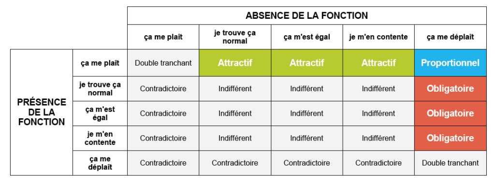
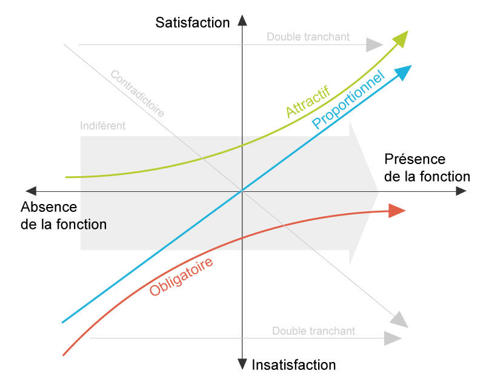

## Diagramme de Kano

- Outil permettant de classer les fonctionnalités en fonction de leur impact sur la satisfaction des utilisateurs selon 3 types d'attentes.
- Aide à déterminer quelles fonctionnalités sont cruciales pour la satisfaction des utilisateurs et quelles fonctionnalités peuvent être des avantages concurrentiels.

---

### Fonctions Obligatoires

- Fonctionnalités de base considérée comme obligatoire par les utilisateurs. 
- absence => insatisfaction importante. 
- Cependant, leur présence n'entraîne pas nécessairement une grande satisfaction, car elles sont considérées comme acquises.

---

### Fonctions Proportionnelles

- Fonctionnalité attendue des utilisateurs.
- Apportent une satisfaction proportionnelle à leur niveau de performance. 
- Plus elles sont développées, plus la satisfaction augmente. 
- Leur absence ne provoque pas une grande insatisfaction.

---

### Fonctions Attractives

- Surprennent les utilisateurs et génèrent une grande satisfaction lorsqu'elles sont présentes.
- Pas nécessairement attendues, mais apportent un plus significatif à l'expérience utilisateur.
- Leur absence ne cause pas de mécontentement. 

---

### Exemple de Diagramme de Kano

Imaginons un projet de développement d'une application de livraison de repas :

- La possibilité de filtrer les restaurants par type de cuisine est une _fonction obligatoire_.
- La rapidité de livraison en moins de 30 minutes est une _fonction proportionnelle_.
- Une surprise aléatoire ajoutée au panier pour chaque commande est une _fonction attractive_.

---

---

